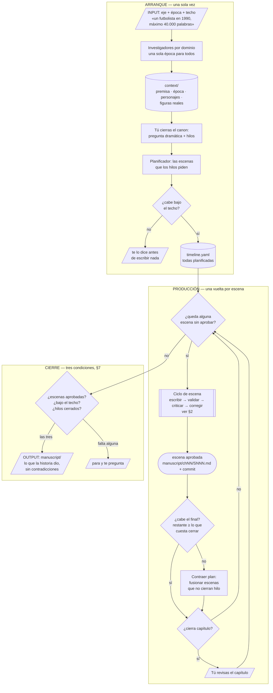
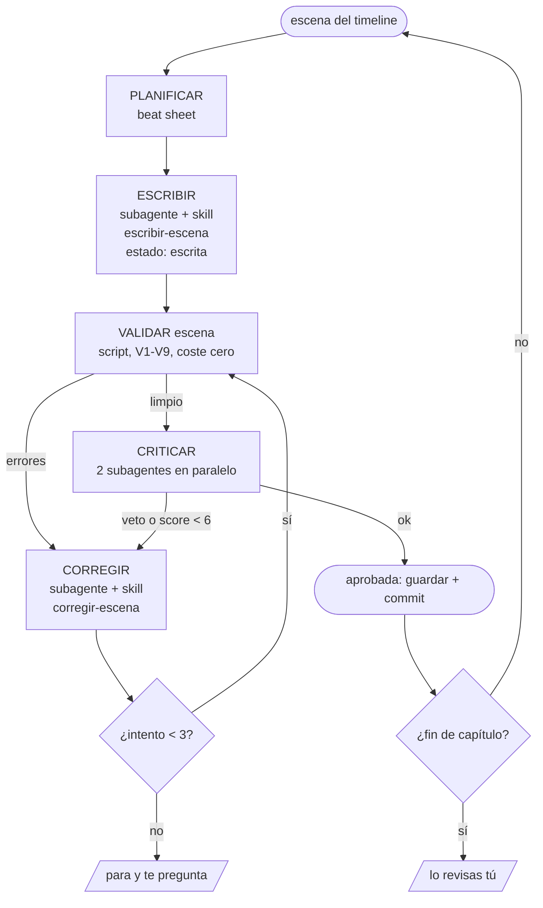

# Story-Maker

Sistema que escribe una novela larga sin contradecirse.

La época, el tema y la longitud los pones tú en el prompt. A lo largo del
documento se usa siempre el mismo ejemplo — *un futbolista en 1990, máximo 40.000
palabras* — pero nada de 1990 está cableado: podía ser 1980, 2010 o el año que
sea, y el sistema saldría a investigarlo igual.

**Principio:** la coherencia factual se **calcula**, no se recuerda. Un LLM olvida
la edad del protagonista en el capítulo 12; un script no. El modelo escribe, el
código verifica.

**Versión 4.0** · 2026-09-15 · historial completo en §11.

**Stack:** Claude Code hace todo el trabajo de modelo — orquesta, planifica,
escribe y critica con subagentes y skills · scripts Python validan.

---

## Panorama general

Antes del detalle, el mapa. Tres fases: **arranque** (una vez), **producción**
(se repite por escena) y **cierre** (una vez).



**Input:** una frase tuya con tres cosas — **de qué va**, **cuándo pasa** y
**cuánto quieres que dure como máximo**. Todo lo demás se deriva de ahí.

**Investigación:** la época no la sabe el sistema, la averigua. Unos agentes
investigadores salen a por el año que hayas pedido y dejan en `context/epoca.yaml`
lo que había y lo que no — de ahí sale, entre otras cosas, la lista de
anacronismos que luego veta el validador.

**Inicialización:** no arranca hasta que `context/` está completo y tú has cerrado
la pregunta dramática y los hilos. El canon existe antes que la primera palabra de
prosa, no se descubre escribiendo.

**Final:** tiene su propia sección (§7) porque no es obvio. En corto: la longitud
que pides es un **techo**, no una meta — si la historia da para 10.000 palabras y
pediste 50.000, salen 10.000. Termina cuando no queda escena sin aprobar, el
recuento no supera el techo y todos los hilos están cerrados. Las tres las
comprueba un script, y un regulador comprueba tras cada escena que el final siga cabiendo. El output es el directorio `manuscript/`; el
historial de git es la traza de cómo se llegó.

El estado vive en disco, no en la conversación. Cualquier fase se puede
interrumpir y reanudar en otra sesión: lo único que hace falta para seguir es
`context/` y lo ya escrito en `manuscript/`.

---

## 1. Los archivos de contexto

Todo el estado vive en `context/`. Es la única fuente de verdad.

### `premise.yaml` — el eje, se escribe una vez y no se toca

Sale del prompt. Las tres primeras claves son literalmente lo que pediste:

```yaml
eje: "Un futbolista en 1990"
epoca: { desde: 1990-01-01, hasta: 1990-12-31 }   # UNA sola, para todo el mundo narrado

limite:                        # TECHO, no meta. Si la historia da menos, se entrega menos (§7)
  palabras: 40000              # lo pides tú: "como mucho 40.000 palabras"
  palabras_por_escena: 900     # única fuente de la longitud de escena

estilo: "Tercera persona, pasado, español rioplatense."   # la longitud NO se repite aquí

pregunta_dramatica: "¿Vuelve Marco a jugar un Mundial?"   # cerrada: se responde sí o no

hilos:                         # se declaran aquí y su número NO crece durante la escritura
  - { id: H1, que: "la lesión y la vuelta" }
  - { id: H2, que: "el matrimonio con Sofía" }
  - { id: H3, que: "la deuda con el club" }
```

`prohibido` no se escribe a mano: lo genera la investigación de época. Nadie se
acuerda de todo lo que no existía en un año concreto.

### `epoca.yaml` — lo que encontraron los investigadores

Se genera en el arranque, a partir del año del prompt. No lo escribes tú.

```yaml
anio: 1990
prohibido: [VAR, celular, internet, redes sociales, tarjeta de débito]
existia:
  - { que: "Walkman", desde: 1979 }
  - { que: "Mundial de Italia", desde: 1990-06-08, hasta: 1990-07-08 }
notas: "Los partidos se seguian por radio; la television daba resumen a la noche."
fuentes: [https://es.wikipedia.org/wiki/...]
```

La lista `prohibido` alimenta la regla V8 del validador. Cambia el año del prompt
y cambia la lista, sin tocar una línea de código.

**La época es una sola y no se divide.** Ni por año ni por dominio: un único
`epoca.yaml`, un único rango, el mismo mundo para el fútbol, la tecnología y la
vida cotidiana. Todo lo que se investiga cae dentro de `premise.yaml.epoca` o se
descarta — es la regla V13, y existe porque un investigador que encuentra un dato
jugoso de 1978 lo mete igual si nadie se lo impide.

**Quién lo rellena:** el subagente `researcher`, una sola vez, en el arranque.
Recorre una lista de ámbitos como quien rellena un formulario — vida cotidiana,
tecnología, medios, y el ámbito del eje (aquí, fútbol) — y escribe un solo
archivo. Los ámbitos son un checklist para no olvidarse de nada, no una división
del canon.

Regla dura: *lo que no trae fuente no entra*. La misma que ya valía para las
personas reales, aplicada a los objetos y las costumbres.

Se investiga en el arranque y no durante la escritura por la misma razón por la
que el canon existe antes que la prosa: un dato que aparece a mitad de libro
puede contradecir lo ya escrito y aprobado.

### `timeline.yaml` — cuándo pasa cada cosa

```yaml
escenas:
  - id: S001
    capitulo: 1
    fecha: 1990-01-08          # absoluta y obligatoria
    lugar: Rosario
    presentes: [marco, sofia]
    resumen: "Marco falla el penalti"
    estado: aprobada            # planificada | escrita | aprobada
    cierra: []                  # qué hilos de premise.yaml cierra esta escena
    flashback: false            # única forma de saltar hacia atrás sin romper V2
    palabras: 940               # recuento real; lo escribe el ciclo al aprobar
    beats:                      # lo que produce PLANIFICAR y consume ESCRIBIR
      - "Llega tarde al entrenamiento"
      - "El técnico lo deja en el banco"
      - "Falla el penalti en el amistoso"
```

Tres campos que existen por una razón concreta:

- **`cierra`** permite calcular el final (§7). Una escena normal lleva la lista
  vacía; la última del libro cierra la `pregunta_dramatica`.
- **`flashback`** es lo único que exime de V2. Si no está declarado aquí, una
  fecha hacia atrás es un error, no un recurso narrativo.
- **`beats`** se guarda, no se pasa en memoria: una escena interrumpida a mitad
  se retoma sin volver a planificar. Es lo que hace que el ciclo sea reanudable
  de verdad.

`estado` recorre los tres valores: `planificada` al salir del arranque, `escrita`
en cuanto hay prosa en `manuscript/` aunque no haya pasado el validador, y
`aprobada` solo tras validador y crítico. El estado intermedio importa: es el que
te dice, al reanudar, que esa escena ya costó trabajo y no hay que empezarla de
cero.

### `characters/marco.yaml` — quién es y cómo cambia

Aquí está la clave del problema del cumpleaños: **lo que se puede calcular, no se guarda**.

```yaml
nombre: Marco Iriarte
nacimiento: 1962-03-14       # única fuente de la edad. NO existe el campo "edad".
club: Newells

estados:                     # el estado tiene vigencia, no es "el actual"
  - { desde: 1990-01-01, hasta: 1990-02-19, lesion: null }
  - { desde: 1990-02-20, hasta: 1990-04-05, lesion: rotura_fibrilar }

eventos_unicos:              # no pueden repetirse nunca
  - { fecha: 1990-02-20, que: lesion }
  - { fecha: 1990-04-12, que: boda }

sabe:                        # qué conoce y desde cuándo
  - { que: "el fichaje", desde: 1990-03-14 }
```

El cumpleaños **no se declara**: se deriva de `nacimiento`. Por eso no puede
ocurrir dos veces en el mismo año.

**Quién escribe `estados` y `sabe`:** el planificador, en el arranque, derivándolos
del timeline. Es mecánico y no hace falta criterio: si S014 cierra el hilo de la
lesión el 5 de abril, quien esté presente lo sabe desde esa fecha; si el
`resumen` de S007 dice que se lesiona, ahí empieza un tramo de `estados`. No los
escribes tú a mano — declarar el conocimiento de todo el libro antes de escribirlo
es la clase de tarea que hace abandonar un proyecto.

Durante la producción son **append-only y solo por decisión tuya**. Esto no es un
detalle: si el ciclo pudiera editar `sabe` para que una escena pase V7, el
validador dejaría de validar nada — el texto reescribiría el canon hasta darse
la razón. El canon solo lo cambia una persona.

### `real-figures.yaml` — personas reales que pueden aparecer

Requisito único: tener artículo en Wikipedia. Lo verifica un script, no un criterio.

```yaml
- nombre: "Nombre Apellido"
  wikipedia: https://es.wikipedia.org/wiki/...
  nacimiento: 1960-10-30
  muerte: null
```

Las fechas salen del artículo, no las inventa el modelo. Lo propone el
`researcher` en el arranque, junto con `epoca.yaml`, y lo apruebas tú: son las
personas reales que **pueden** aparecer, no las que aparecerán.

---

## 2. El ciclo



El validador corre **antes** que el crítico: es instantáneo, determinista y no
falla. Filtrar con él antes de gastar una ronda de crítica es lo que mantiene el
ciclo barato. Si a los 3 intentos no pasa, para y te pregunta.

Cada subagente recibe su skill (§5): es lo que hace que la escena 40 suene igual
que la 3 sin que nadie haya visto las dos.

---

## 3. El validador

Sin LLM. Trece reglas, y lo primero que hay que ver es que **no corren todas en
el mismo momento ni sobre lo mismo**. Son tres validadores distintos:

| # | Regla | Cuándo corre |
|---|---|---|
| **V13** | Todo dato de `epoca.yaml` cae dentro del rango de `premise.yaml.epoca` | **canon**, una vez en el arranque |
| V1 | Toda escena tiene fecha, y está dentro de la época de `premise.yaml` | **escena**, cada vuelta |
| V2 | Las fechas de un capítulo van hacia adelante, salvo `flashback: true` | escena |
| V3 | La edad mencionada en la prosa coincide con la calculada desde `nacimiento` | escena |
| V4 | **El cumpleaños no ocurre dos veces en el mismo año** | escena |
| V5 | Un evento único no se repite | escena |
| V6 | Nadie hace algo incompatible con su estado (jugar lesionado) | escena |
| V7 | Nadie reacciona a algo que todavía no sabe | escena |
| V8 | No aparecen anacronismos: nada de la lista `prohibido` de `epoca.yaml` | escena |
| V9 | Una persona real no aparece antes de nacer ni después de morir | escena |
| V10 | Todo hilo declarado se cierra exactamente una vez, en una escena aprobada | **obra**, al cerrar |
| V11 | Ninguna escena cierra un hilo que no esté declarado en `premise.yaml` | obra |
| V12 | Ni el recuento real ni la proyección superan `limite.palabras` | obra, **y cada vuelta** |

Por eso no hay un `validate.py`, hay tres entradas (§6):

| Script | Entrada | Cuándo |
|---|---|---|
| `validate_canon.py` | `context/` | una vez, tras la investigación |
| `validate_scene.py` | una escena + canon | en cada vuelta del ciclo |
| `validate_book.py` | `manuscript/` + canon | al comprobar si terminó (§7) |

**V12 corre dos veces por una razón.** Comprobar el total al final solo sirve para
enterarse tarde: si te pasaste, el texto ya está escrito. Lo útil es la
proyección en cada vuelta — `escrito + escenas_pendientes × palabras_por_escena` —
que avisa cuando todavía se puede hacer algo.

Salida:

```json
{"escena": "S014", "ok": false, "errores": [
  {"regla": "V4",
   "mensaje": "Se celebra el cumpleaños de Marco el 30-jun, pero nació el 14-mar (ya narrado en S007).",
   "arreglo": "Cambiar el motivo de la celebración, o mover la escena antes del 14-mar."}
]}
```

El mensaje tiene que decir qué está mal, cuál es la verdad y cómo arreglarlo.

**Detección en prosa:** V3, V7 y V8 necesitan leer texto libre. Regex para lo
obvio (palabras prohibidas, "X años"); para el resto, un subagente extrae las
afirmaciones de la prosa y el script las compara **por código** contra el canon.
El subagente solo extrae: no juzga si son correctas.

---

## 4. El crítico

Dos subagentes de Claude Code, en paralelo. **No reescriben: solo diagnostican.**

| Lente | Busca | Poder |
|---|---|---|
| **Continuidad** | contradicciones que el validador no puede formalizar: objetos que aparecen de la nada, cambios de carácter sin causa, conocimiento inferido | **veta** |
| **Calidad** | escena sin conflicto, diálogo expositivo, clichés, ritmo plano | puntúa 1-10, bloquea si < 6 |

Dos detalles que importan:

- Los subagentes de Claude Code tienen contexto aislado, así que **no se ven entre
  sí** (no hay efecto manada) y **no saben en qué intento van** (no aprueban por
  cansancio). Sale gratis.
- El feedback tiene que citar el fragmento exacto. "Mejora el ritmo" es inútil;
  "los párrafos 3-5 frenan la escena" es accionable.

Sobre personas reales, la lente de continuidad veta una sola cosa: atribuirles
conducta deshonrosa o delictiva que no esté documentada.

---

## 5. Skills

**El problema que resuelven:** cada subagente arranca con el contexto limpio. El
que escribe la escena 40 no vio cómo se escribió la 3. Nada garantiza que use la
misma voz, la misma longitud, el mismo criterio para los diálogos ni el mismo
formato de salida. A lo largo de 45 escenas y varias sesiones, eso **deriva**.

Y es una deriva que no detecta nadie: el validador solo mira hechos, y el crítico
de calidad juzga cada escena por separado — una escena puede estar bien escrita y
aun así no parecer del mismo libro.

Una **skill** es esa instrucción escrita una vez en disco, que llega **idéntica**
a cada invocación. Si `context/` es la fuente de verdad de los hechos, las skills
son la fuente de verdad de la forma.

> El canon fija **qué** es cierto. La skill fija **cómo** se cuenta.
> Los dos están en disco por la misma razón: lo que se recuerda, se olvida.

### Cómo se ve

Vive en `.claude/skills/<nombre>/SKILL.md`. La cabecera dice cuándo aplica; el
cuerpo, qué hacer:

```markdown
---
name: escribir-escena
description: Redacta una escena del timeline a partir de su beat sheet y del canon resuelto. Úsala al escribir o reescribir cualquier escena del manuscrito.
---

1. Escribe 800-1000 palabras, tercera persona, pasado, español rioplatense.
2. No expliques lo que el personaje siente: muéstralo en lo que hace.
3. El diálogo no informa al lector de cosas que los personajes ya saben.
4. Devuelve **solo** la prosa. Sin títulos, sin notas, sin resumen.
```

Claude Code lee la `description` siempre y el cuerpo solo cuando toca escribir.
Efecto lateral útil: las instrucciones largas no ocupan contexto en los pasos que
no las necesitan.

### Las skills del proyecto

| Skill | Qué fija |
|---|---|
| `escribir-escena` | La voz: persona, tiempo, registro, longitud, qué no se hace con el diálogo. **Una sola, para el libro entero** — sin variantes por tipo de escena. Es la que más pesa contra la deriva. |
| `resolver-canon` | Cómo se lee `context/` y se entrega el estado **en prosa** — "Marco, 28 años, lesionado hasta el 5 de abril, todavía no sabe lo del fichaje" — para que nadie interprete YAML por su cuenta. |
| `corregir-escena` | Que una corrección toque **solo** lo señalado. Sin esto, cada arreglo reescribe de más y la voz se mueve. |
| `epoca` | Cómo se usa `epoca.yaml`: qué existía y qué no en el año del prompt, y cómo se deja ver sin explicarlo. Escritor y crítico usan el mismo listón. La skill es fija; los datos que lee cambian con el año. |
| `formato-critica` | Cómo se emite el feedback: fragmento citado, problema, arreglo propuesto. Que las dos lentes (§4) hablen igual hace comparable su salida. |

### Una sola voz, de la primera página a la última

No hay una `escribir-escena-partido` y una `escribir-escena-intima`. En cuanto
hay dos skills de voz, hay dos voces, y el libro se nota cosido. Una escena de
acción y una íntima se diferencian en **qué pasa**, no en quién las narra.

Dos mecanismos la sostienen a lo largo de todo el documento:

- **La voz se congela en el arranque.** `escribir-escena` se escribe una vez,
  antes de la primera escena, y no se retoca a mitad de libro. Cambiarla en el
  capítulo 6 parte el manuscrito en dos: lo escrito antes ya está aprobado y
  nadie va a reescribirlo.
- **La muestra de voz viaja con cada invocación.** Al aprobarse la primera
  escena, dos o tres de sus párrafos quedan fijados en `context/voz.md`. Van con
  cada llamada a `escribir-escena` de ahí en adelante, y con la lente de calidad
  cuando juzga. Así la escena 40 tiene delante cómo sonaba la 3, que es
  exactamente lo que le falta a un subagente con el contexto limpio.
  Se fija **una sola vez** y no se regenera: si más tarde reviés o revertís esa
  primera escena, `voz.md` se queda como está. Es una referencia de registro, no
  una copia de S001 — regenerarla cada vez que cambia algo sería volver a tener
  una voz que se mueve.

La muestra es **descriptiva, no un molde**: marca el registro, no el contenido.
Si empieza a asomar en la prosa — mismos giros, mismo arranque de párrafo — es
que la lente de calidad tiene que señalarlo como cliche, igual que cualquier otra
repetición.

### Reglas

- **Una skill, una tarea.** Si la descripción necesita un "y", son dos skills.
- **La `description` es lo único que se ve siempre.** Tiene que decir qué hace *y
  cuándo usarla*, o no se carga en el momento correcto.
- **Nada de estado dentro.** La skill describe el procedimiento; los hechos viven
  en `context/`. Una skill con datos dentro es un canon duplicado, y un canon
  duplicado se desincroniza.
- **Si una nota se repite dos veces en una corrección, es una skill.** Ese es el
  síntoma: instrucción que hay que volver a dar es instrucción que no estaba escrita.

---

## 6. Estructura

```
Story-Maker/
├── SPEC.md
├── .claude/
│   ├── agents/                quién opina (contexto aislado)
│   │   ├── researcher.md          investiga la época (una pasada, un archivo)
│   │   ├── planner.md
│   │   ├── critic-continuity.md
│   │   └── critic-quality.md
│   ├── skills/                la forma, idéntica en cada invocación
│   │   ├── escribir-escena/SKILL.md
│   │   ├── resolver-canon/SKILL.md
│   │   ├── corregir-escena/SKILL.md
│   │   ├── epoca/SKILL.md
│   │   └── formato-critica/SKILL.md
│   └── settings.json          permisos para los scripts
├── scripts/
│   ├── validate_canon.py      V13, una vez tras investigar
│   ├── validate_scene.py      V1-V9, cada vuelta del ciclo
│   ├── validate_book.py       V10-V12 + las tres condiciones de §7
│   └── run_scene.py           conduce el ciclo de una escena
├── context/
│   ├── premise.yaml
│   ├── epoca.yaml             lo generan los investigadores
│   ├── voz.md                 muestra fija de la primera escena aprobada
│   ├── timeline.yaml
│   ├── characters/marco.yaml
│   └── real-figures.yaml
└── manuscript/
    └── ch01/S001.md
```

**Regla de reparto:** si el paso tiene una respuesta correcta, es un script; si
requiere criterio, es un subagente. Las skills no son un tercer ejecutor: son las
instrucciones que el subagente recibe (§5). El ciclo lo conduce `run_scene.py`, no
el modelo — un LLM iterando 45 veces deriva.

Un commit de git por escena aprobada. Si algo se descarrila, `git revert` y se
regenera desde ahí.

---

## 7. El final

**La longitud que pides es un techo, no una meta.** Si pides 50.000 palabras y la
historia da para 10.000, salen 10.000. Estirar una historia que ya terminó es la
forma más segura de arruinarla, y es exactamente lo que hace un modelo al que se
le da un número que cumplir: repite, se demora, mete escenas que no van a ningún
sitio. El número es un límite superior y nada más.

Tres condiciones para terminar, las tres comprobables por script:

| | Condición | Cómo se comprueba |
|---|---|---|
| **C1 — Estructura** | No queda ninguna escena del `timeline.yaml` sin aprobar | contar estados |
| **C2 — Techo** | El recuento real **no supera** `limite.palabras` | contar palabras de `manuscript/` |
| **C3 — Cierre** | Cada hilo declarado se cierra exactamente una vez, en una escena aprobada, y la escena que responde la `pregunta_dramatica` es la última | cruzar `hilos` con los `cierra:` del timeline |

**C3 es la que manda.** C2 no tiene suelo: puede impedir que el libro siga, nunca
obligarlo a seguir. Cerrados todos los hilos y respondida la pregunta, la novela
terminó — aunque sobre el 80% del presupuesto.

### El regulador: que el final quepa

El riesgo real no es quedarse corto, es **llegar al techo con hilos abiertos**: un
libro que se corta a media frase porque se gastó el presupuesto contando el
principio. Para evitarlo, después de cada escena aprobada un script comprueba una
sola desigualdad:

```
palabras_restantes  =  limite.palabras − palabras escritas
cierre_pendiente    =  escenas pendientes que cierran hilo × palabras_por_escena

              cabe  ⟺  palabras_restantes ≥ cierre_pendiente
```

En cristiano: *¿me queda techo suficiente para escribir las escenas que cierran lo
que sigue abierto?* Si sí, el libro puede terminar bien y no hay nada que hacer.
Si no, se contrae.

Lo que **no** se mide es el ritmo. Comparar «cuánto llevas cerrado» contra «cuánto
llevas gastado» castiga la forma normal de una novela: los hilos cierran en el
último tercio, así que en el capítulo 2 cualquier libro sano va «atrasado» y
cualquier umbral dispararía en falso justo cuando contraer es lo peor que se puede
hacer. La desigualdad de arriba no tiene ese problema porque no mide progreso,
mide **capacidad**: solo se rompe cuando el final de verdad ha dejado de caber.

Contraer es una sola cosa: el planificador **fusiona o elimina escenas pendientes
que no cierran ningún hilo**. Son candidatas por definición — si una escena no
cierra nada, el libro sobrevive sin ella. Las que cierran hilo no se tocan nunca:
son el final.

No existe la operación inversa. El plan puede encogerse; no puede crecer.

### Si no cabe, se sabe antes de escribir

El planificador no reparte el techo entre escenas: planifica **las escenas que
los hilos piden** y luego comprueba que quepan.

```
escenas_necesarias × palabras_por_escena  ≤  limite.palabras
```

Si no cuadra, para en el arranque y te lo dice: o sobran hilos, o el techo es
bajo. Es la única vez que el sistema te pregunta antes de haber escrito una
palabra, y es el momento más barato para enterarse.

Durante la producción, la contracción tiene tope de **dos rondas**. A la tercera
para y pregunta: si el final no cabe después de dos contracciones, el problema es
el plan y no lo arregla otra vuelta del bucle.

### La regla que hace que esto termine

> **Los hilos se declaran en el arranque y su número nunca crece durante la
> producción.**

Sin esto no hay final posible: cada escena escrita sugiere dos hilos nuevos y el
libro se persigue la cola para siempre. Si escribiendo aparece un hilo que de
verdad merece existir, **esa es una decisión tuya**, no del bucle: se para, se
añade a `premise.yaml`, y eso es una versión nueva del canon.

El bucle puede encoger el plan. No puede añadir hilos.

Las reglas que sostienen todo esto — V10, V11 y V12 — están en la tabla única
de §3, con el resto.

---

## 8. Decidido

| Qué | Valor |
|---|---|
| Unidad de trabajo | escena; tú apruebas al cerrar cada capítulo |
| Idioma | español |
| Realismo | protagonista ficticio, mundo real (instituciones y eventos del año) |
| Personas reales | permitidas si tienen Wikipedia |
| Época | la del prompt, **única y común** a todos los dominios; la investigan agentes |
| Longitud | la del prompt, como **techo**; si la historia da menos, se entrega menos (§7) |
| Voz | una sola para el libro entero, congelada en el arranque (§5) |
| Fin | tres condiciones calculadas, no un juicio del modelo (§7) |
| Crítico | veta continuidad, aconseja en calidad |
| Investigación | un solo `researcher`, una pasada, un solo `epoca.yaml` |

## 9. Pendiente

Nada que bloquee la implementación. Lo único abierto es calibración, y se
calibra con el ciclo corriendo, no antes:

- `palabras_por_escena` (900) y el tope de dos contracciones son números de
  diseño. **Para el MVP se aceptan tal cual** y se ajustan con datos del primer
  libro. Ninguno de los dos cambia la arquitectura si resulta estar mal.

## 10. Por dónde empezar

1. **10 escenas-trampa** con errores plantados (cumpleaños repetido, edad mal,
   jugar lesionado, hilo cerrado dos veces) y los errores que cada validador
   debería detectar.
2. **`validate_scene.py`** contra ese fixture, y **`validate_book.py`** con un
   timeline de juguete. Sin LLM, sin red: es la mitad del proyecto y se puede
   escribir entera sin gastar un token.
3. **`researcher` + `validate_canon.py`** con dos años distintos (1990 y 2010).
   Si el segundo necesita tocar código, algo quedó cableado. Va aquí, y no al
   final, porque detectarlo ahora cuesta una tarde y detectarlo con el ciclo
   montado cuesta rehacerlo.
4. **`resolver-canon` y `escribir-escena`**, con una escena de juguete: es donde
   se ve si el canon resuelto en prosa basta para escribir sin contradicciones, y
   de dónde sale el primer `voz.md`.
5. Recién entonces, los críticos y el ciclo completo.

---

## 11. Historial de versiones

Toda modificación del spec se registra aquí, en la misma entrega que la cambia.
Una entrada dice **qué** cambió y **por qué** — el qué sin el por qué obliga a
releer el diff para entender la decisión.

Versionado: `MAYOR.MENOR`. Sube **MENOR** al añadir o precisar contenido; sube
**MAYOR** cuando cambia una decisión ya tomada y lo escrito antes deja de valer.

| Versión | Fecha | Commit | Cambio | Por qué |
|---|---|---|---|---|
| **4.0** | 2026-09-15 | _sin commitear_ | **El regulador deja de medir ritmo y mide capacidad.** Fuera `holgura = cerrado − gastado` y su umbral de −0,20; entra una desigualdad: `palabras_restantes ≥ escenas_pendientes_que_cierran_hilo × palabras_por_escena`. | El anterior era defectuoso, no mal calibrado: los hilos cierran en el último tercio, así que en el capítulo 2 cualquier libro sano da holgura muy negativa y **con cualquier umbral** disparaba una contracción justo cuando contraer es lo peor posible. La desigualdad nueva no mide progreso: solo se rompe cuando el final ha dejado de caber de verdad, y no necesita umbral. |
| **4.0** | 2026-09-15 | _sin commitear_ | **`estados` y `sabe` los deriva el planificador** del timeline en el arranque, y durante la producción son append-only y solo por decisión tuya. | Nadie los escribía: V6 y V7 los consultaban en cada escena sin que el spec dijera de dónde salían. A mano son una tarea que hace abandonar el proyecto; editándolos el ciclo, el texto reescribiría el canon hasta darse la razón y el validador dejaría de validar nada. |
| **4.0** | 2026-09-15 | _sin commitear_ | **Una sola tabla de reglas en §3**, con columna de cuándo corre cada una, y `validate.py` se parte en `validate_canon.py` (V13), `validate_scene.py` (V1-V9) y `validate_book.py` (V10-V12). V12 pasa a comprobar también la proyección en cada vuelta. | Las reglas estaban en dos tablas y mezclaban tres ámbitos — canon, escena y obra — que corren en momentos distintos sobre entradas distintas. Un solo script no puede tener esa firma. Y V12 solo sobre el total final llega tarde por definición: cuando avisa, el texto ya está escrito. |
| **4.0** | 2026-09-15 | _sin commitear_ | `timeline.yaml` gana `flashback`, `beats` y `palabras`; `premise.yaml` deja de repetir la longitud de escena en `estilo`. Documentado el estado `escrita`. | V2 eximía «flashbacks declarados» que no tenían dónde declararse; el beat sheet no tenía sitio y se perdía al interrumpir una escena; la longitud estaba escrita dos veces, que es justo lo que §5 prohibe. |
| **4.0** | 2026-09-15 | _sin commitear_ | `voz.md` se fija una vez y no se regenera. El `researcher` propone también `real-figures.yaml`. §10 reordenado: la prueba con dos años distintos sube al paso 3. | Cabos sueltos: qué pasa con la muestra si se revierte S001, quién llena las personas reales, y que detectar código cableado con el ciclo ya montado cuesta rehacerlo. |
| **3.1** | 2026-09-15 | _sin commitear_ | La investigación deja de repartirse entre varios subagentes por dominio: un solo `researcher`, una pasada, un solo `epoca.yaml`. Los ámbitos pasan a ser un checklist dentro de su prompt. §9 queda sin nada que bloquee la implementación; los números de holgura se aceptan como están para el MVP. | La época no se divide, tampoco en quién la investiga. Varios agentes escribiendo el mismo archivo es justo la forma de acabar con dos mundos distintos dentro del canon, y para un MVP la paralelización no compra nada: se corre una vez por libro. |
| **3.0** | 2026-09-15 | _sin commitear_ | **La longitud pasa de meta a techo.** `objetivo.palabras ± tolerancia` se sustituye por `limite.palabras`. C2 pierde el suelo: puede impedir que el libro siga, nunca obligarlo a seguir. Se elimina la operación de añadir escenas cuando el recuento queda corto. | Un número que hay que alcanzar es una orden de estirar, y un modelo la obedece: repite, se demora, mete escenas que no van a ningún sitio. Si pides 50.000 y la historia da 10.000, lo correcto son 10.000. |
| **3.0** | 2026-09-15 | _sin commitear_ | **Nuevo regulador de holgura** (`cerrado − gastado`), medido tras cada escena aprobada. Por debajo de −0,20 el plan **se contrae**: se fusionan escenas que no cierran hilo, nunca las que lo cierran. El planificador ahora planifica lo que los hilos piden y **verifica** que quepa bajo el techo, avisando en el arranque si no. Nueva V12. | Quitar el suelo abre el riesgo contrario: gastar el techo contando el principio y cortar el libro a media frase. El regulador vigila que el final quepa sin recurrir jamás a estirar — el plan solo puede encogerse. |
| **3.0** | 2026-09-15 | _sin commitear_ | **La época es única y común a todos los dominios.** Los investigadores se reparten por dominio, nunca por fecha, y todo dato fuera del rango de `premise.yaml.epoca` se descarta (nueva V13). | La investigación en paralelo permitía que el fútbol quedara en 1950 y la vida cotidiana en 2000. Un investigador que encuentra un dato jugoso de otra década lo mete igual si nadie se lo impide. |
| **3.0** | 2026-09-15 | _sin commitear_ | **Una sola voz para el libro entero**, decidido — cierra la pregunta abierta de §9. Sin variantes de `escribir-escena` por tipo de escena; la voz se congela en el arranque y una **muestra de voz** (`context/voz.md`, párrafos de la primera escena aprobada) viaja con cada invocación y con la lente de calidad. | Dos skills de voz son dos voces, y el libro se nota cosido. Una escena de acción y una íntima se diferencian en qué pasa, no en quién las narra. La muestra le da a la escena 40 lo que le falta a un subagente con contexto limpio: cómo sonaba la 3. |
| **2.0** | 2026-09-15 | _sin commitear_ | **Nueva §7 El final.** La novela termina cuando se cumplen tres condiciones calculadas por script: C1 no queda escena sin aprobar, C2 el recuento cae en `objetivo.palabras ± tolerancia`, C3 todo hilo declarado se cierra una vez y la pregunta dramática se responde en la última escena. Con ellas, dos reglas nuevas del validador (V10, V11) y la regla dura: **los hilos se declaran en el arranque y su número nunca crece**. | Era la última pregunta abierta del spec. Preguntarle al modelo «si ya terminó» repite el error que este proyecto existe para evitar: contestaría que sí cuando está cansado. Y sin congelar los hilos no hay final posible — cada escena sugiere dos subtramas nuevas y el libro se persigue la cola. |
| **2.0** | 2026-09-15 | _sin commitear_ | **La época deja de estar cableada.** 1990 pasa a ser el ejemplo del documento, no el diseño. El año entra por el prompt, unos subagentes investigadores lo estudian por dominios en el arranque y dejan `context/epoca.yaml`. La lista `prohibido` de V8 sale de ahí en vez de escribirse a mano. | El spec había absorbido el ejemplo como si fuera requisito: la skill se llamaba `epoca-1990` y los anacronismos eran una lista fija. Con 2010 o 1980 habría habido que tocar código. Además nadie recuerda de memoria todo lo que no existía en un año concreto — mejor investigarlo y citarlo. |
| **2.0** | 2026-09-15 | _sin commitear_ | **La longitud la pide el usuario** en el prompt (`objetivo.palabras` + `tolerancia`) y de ella se derivan escenas, capítulos e hilos. Sustituye al formato fijo «español, ~40k palabras, ~45 escenas» de §8. Si el recuento se sale de la banda hay ajuste dirigido — corto se añaden escenas a hilos abiertos, largo se fusionan escenas que no cierran ninguno — con tope de dos rondas. | 40k y 45 escenas eran una decisión arbitraria metida en el diseño. Derivar la estructura del objetivo hace que pedir 15.000 o 90.000 palabras dé un libro de esa densidad, no el mismo libro estirado o recortado. |
| **2.0** | 2026-09-15 | _sin commitear_ | El diagrama del Panorama incorpora la fase de investigación, la declaración de hilos y el cierre con las tres condiciones. Nuevo agente `researcher.md`; la skill `epoca-1990` pasa a `epoca`. | El diagrama describía el flujo anterior; dejarlo habría sido peor que no tenerlo. |
| **1.0** | 2026-09-15 | _sin commitear_ | **Eliminado OpenRouter del diseño.** Toda la generación de prosa pasa a subagentes de Claude Code. Desaparecen `draft.py`, el YAML de modelos con fallback, `OPENROUTER_API_KEY`, la escalada por proveedor y todo el razonamiento sobre cuota diaria y 429. | Un segundo proveedor añadía una capa de complejidad que no compraba nada: cliente HTTP, rotación de modelos que desaparecen, parseo tolerante, gestión de límites y una clave en el entorno — todo para orquestarlo igualmente desde Claude Code. |
| **1.0** | 2026-09-15 | _sin commitear_ | Nueva **§5 Skills**: `escribir-escena`, `resolver-canon`, `corregir-escena`, `epoca-1990` y `formato-critica`, con su formato `SKILL.md` y sus reglas. | Cada subagente arranca con contexto limpio: el que escribe la escena 40 no vio la 3. La voz, la longitud y el formato **derivan** a lo largo del libro, y es una deriva que ni el validador (solo mira hechos) ni el crítico de calidad (juzga escena a escena) detectan. La skill es esa instrucción escrita una vez que llega idéntica a cada invocación. |
| **1.0** | 2026-09-15 | _sin commitear_ | Precisado que las skills **no** son un tercer ejecutor junto a scripts y subagentes: son las instrucciones que el subagente recibe. La regla de reparto de §6 sigue siendo binaria. | Redactado antes como si las skills fueran una capa de arquitectura. No lo son: `context/` es la fuente de verdad de los hechos y las skills la de la forma, pero quien ejecuta sigue siendo script o subagente. |
| **1.0** | 2026-09-15 | _sin commitear_ | La reanudación entre sesiones (§Panorama) se justifica ahora por el estado en disco, no por la cuota gratuita. | El motivo original desapareció con OpenRouter, pero la propiedad sigue siendo cierta y vale la pena por sí misma. |
| **1.0** | 2026-09-15 | _sin commitear_ | En §3, la extracción de afirmaciones de la prosa (V3/V7/V8) la hace un subagente que **solo extrae**; la comparación contra el canon sigue siendo del script. | Antes decía "una llamada al modelo" sin decir quién ni hasta dónde. Dejar que el modelo juzgue rompería el principio de que la coherencia se calcula. |
| 0.2 | 2026-09-15 | _sin commitear_ | Añadida la sección **Panorama general**: diagrama de las tres fases (arranque · producción · cierre) con el input, la inicialización y la condición de fin. | El spec entraba directo al detalle de los archivos de contexto; no había ninguna vista donde se viera de dónde sale el proyecto ni cuándo termina. |
| 0.2 | 2026-09-15 | _sin commitear_ | El diagrama del ciclo (§2) pasa de ASCII art a mermaid. | El ASCII no representaba los reintentos ni las bifurcaciones; se leía como lineal cuando no lo es. |
| 0.2 | 2026-09-15 | _sin commitear_ | Consolidados los 12 archivos de `docs/specs/*.md` en este único `SPEC.md`. | Estaban desincronizados entre sí y ninguno era la fuente de verdad. Un solo archivo no puede contradecirse. |
| 0.2 | 2026-09-15 | _sin commitear_ | Añadida esta sección de historial. | Los cambios del spec no quedaban documentados fuera del log de git, que no explica el motivo de cada decisión. |
| 0.1 | 2026-09-15 | `9e4dd23` | Primer volcado del diseño: contexto calculado en vez de recordado, las 9 reglas del validador, el crítico de dos lentes, los límites de OpenRouter y el reparto script/subagente. | Punto de partida. |

### Pendiente de registrar

Nada. La condición de fin, que estaba abierta desde v0.2, se decidió en §7.
