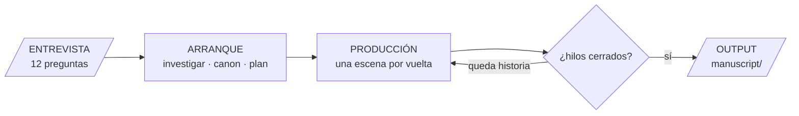
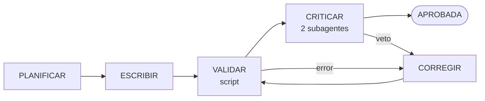

# Story-Maker

Harness que escribe **novelas románticas ambientadas en el deporte**, sin
contradecirse. No un libro: un sistema que produce libros del género, y que
mejora de una novela a la siguiente.

## Para qué existe esto

El objetivo real no es la novela: es **construir capas de control sobre un
modelo**. Escribir cuarenta mil palabras coherentes es una tarea que un LLM no
puede sostener solo — se contradice, deriva de voz, aprueba su propio trabajo y
no sabe cuándo parar. Sirve como banco de pruebas justamente por eso: cada fallo
es visible y ninguno se arregla pidiéndole al modelo que se esfuerce más.

Lo que se está construyendo son las capas:

| Capa | Qué controla | Cómo |
|---|---|---|
| **Canon calculado** | que los hechos no se contradigan | lo que se deriva no se guarda: no hay campo `edad`, hay `nacimiento` (§2) |
| **Validadores** | que la prosa respete esos hechos | 21 reglas deterministas, sin LLM (§4) |
| **Rúbrica con evidencia** | que el criterio no sea una opinión | cinco dimensiones ancladas, cita obligatoria en toda nota (§5) |
| **Puertas** | que nada avance porque alguien opine que puede | cinco puntos de corte, cada uno con criterio escrito y un script que lo aplica (§6) |
| **Reguladores** | que el trabajo termine | techo de palabras y comprobación de que el final quepa (§11) |

La regla que las une es siempre la misma: **el modelo observa, el código
decide.** Un agente que puede aprobar su propio trabajo no es un control.

Por eso el género y la longitud importan menos de lo que parece. Si las capas
funcionan sobre una novela romántica deportiva de cuarenta mil palabras,
funcionan sobre cualquier tarea larga donde haga falta que un modelo produzca y
algo verifique.

El deporte, la época y la pareja los pones tú en el prompt. A lo largo del
documento se usa siempre el mismo ejemplo — *un futbolista en 1990* — pero nada
de 1990 está cableado: podía ser 1980, 2010 o el año que sea, y el sistema
saldría a investigarlo igual.

**La v1 no escribe una novela: escribe 3 párrafos de 4 líneas** (§1). El tamaño
está fijo a propósito — recorre el mismo camino completo y produce los mismos
JSON, pero cabe en una pantalla. Los contratos se fijan con el caso chico.

**Principio:** la coherencia factual se **calcula**, no se recuerda. Un LLM olvida
la edad del protagonista en el capítulo 12; un script no. El modelo escribe, el
código verifica.

**Versión 7.6** · 2026-09-16 · historial completo en §16.

**Stack:** Claude Code hace todo el trabajo de modelo — orquesta, planifica,
escribe y critica con subagentes y skills · scripts Python validan.

**Qué es opcional:** la investigación por internet (§3). Un libro puede traer su
`epoca.yaml` escrito a mano e ir derecho al ciclo de redacción. Es deliberado:
buscar contexto en internet es la parte más lenta y menos determinista del
arranque, y no es lo que hay que hacer funcionar primero.

**Reparto:** `harness/` y `.claude/` saben de romance deportiva y valen para
todos los libros; `books/<slug>/` sabe de una novela concreta (§10).

---

## Panorama general

Antes del detalle, el mapa. Tres fases: **arranque** (una vez), **producción**
(se repite por escena) y **cierre** (una vez).



Tres fases y un bucle. Lo que el dibujo no muestra, y está detallado más abajo:
en **arranque** se comprueba que el plan quepa bajo el techo antes de escribir
nada (§12); en **producción**, tras cada escena, que el final siga cabiendo (§12);
y al cerrar cada capítulo lo revisas tú (§4).

El bucle pregunta por los hilos, pero en este género hay uno que no es opcional:
la relación tiene que llegar a `union` (§2). Un libro con todos los demás hilos
cerrados y la pareja sin cerrar no está terminado, está roto.

**Input:** no es un prompt, es una **entrevista** (§3). El agente `interviewer` te
hace doce preguntas cerradas — quiénes son, qué deporte, qué los separa — y
escribe él las respuestas. No rellenas YAML a mano: es donde entran los datos
malos. El tamaño no se pregunta: sale del perfil de `config.yaml` (§1), fijo en la
v1 en 3 párrafos de 4 líneas.

**Investigación:** la época no la sabe el sistema, la averigua. El agente
`researcher` sale a por el año que hayas pedido y deja en `context/epoca.yaml` lo
que había y lo que no — de ahí sale, entre otras cosas, la lista de anacronismos
que luego veta el validador.

**Inicialización:** no arranca hasta que `context/` está completo y pasa G0. El
canon existe antes que la primera palabra de prosa, no se descubre escribiendo.

**Final:** tiene su propia sección (§12) porque no es obvio. En corto: la longitud
que pides es un **techo**, no una meta — si la historia da para 10.000 palabras y
pediste 50.000, salen 10.000. Termina cuando no queda escena sin aprobar, el
recuento no supera el techo y todos los hilos están cerrados. Las tres las
comprueba un script, y un regulador comprueba tras cada escena que el final siga
cabiendo. El output es el directorio `manuscript/`; el historial de git es la
traza de cómo se llegó.

El estado vive en disco, no en la conversación. Cualquier fase se puede
interrumpir y reanudar en otra sesión: lo único que hace falta para seguir es
`context/` y lo ya escrito en `manuscript/`.

---

## 1. Configuración

Todo lo que tiene un número está aquí, en `harness/config.yaml`, y **nada lo
repite**. La forma del documento no se negocia escena a escena: se declara una
vez y el validador la comprueba.

### El objetivo de la v1: tres párrafos de cuatro líneas

La primera versión no escribe una novela. Escribe **un documento de 3 párrafos de
4 líneas cada uno**, y ese tamaño está **fijo**.

No es una limitación técnica, es la forma de fijar los contratos. Un documento de
144 palabras recorre exactamente el mismo camino que uno de 40.000 — canon,
planificación, escritura, G1, G2, rúbrica, cierre — y produce exactamente los
mismos JSON. La diferencia es que cabe en una pantalla, se corre en un minuto y
cuando algo falla sabés que falla el harness y no la historia.

Cuando los tres JSON (`validation`, `critique`, `state`) estén estables contra
este documento, se suben los números y no se toca nada más. Ese es el plan: los
contratos se fijan con el caso chico, la escala llega después.

```yaml
# harness/config.yaml — perfil v1, FIJO
version: 1
perfil: smoke

estructura:
  capitulos: 1
  escenas_por_capitulo: 1
  parrafos_por_escena: 3
  lineas_por_parrafo: 4
  palabras_por_linea: 12

tolerancia:
  lineas_por_parrafo: 0        # exacto: 4 líneas, ni 3 ni 5
  palabras_por_linea: 3        # 12 ± 3

rubrica:
  dimensiones: [conflicto, dialogo, concrecion, frescura, quimica]
  niveles: [0, 1, 2]
  umbral: 6                    # sobre 10; 5 sobre 8 si la escena no es de pareja
  cero_prohibido: true

ciclo:
  intentos_max: 3
  contracciones_max: 2
  escenas_sin_coincidir_max: 10

genero:
  nombre: romance-deportivo
  etapas_relacion: [desconocidos, atraccion, intimidad, ruptura, union]
  etapa_final_obligatoria: union
```

### Lo que se deriva, no se escribe

Mismo principio que la edad del protagonista: si sale de una cuenta, no se
declara. Estas tres cifras **no existen en ningún archivo** — las calcula el
planificador al arrancar:

```
palabras_por_escena     = parrafos × lineas × palabras_por_linea
                        = 3 × 4 × 12  =  144        el objetivo al escribir

palabras_por_escena_max = parrafos × lineas × (palabras_por_linea + tolerancia)
                        = 3 × 4 × 15  =  180        lo que V15 deja pasar

escenas_totales         = capitulos × escenas_por_capitulo
                        = 1 × 1  =  1

techo_palabras          = escenas_totales × palabras_por_escena_max
                        = 180
```

**El techo presupuesta el máximo, no el nominal.** V15 acepta
`palabras_por_linea ± tolerancia`, así que una escena puede llegar a 180 sin
romper ninguna regla. Si el techo se calculara con 144, un libro pasaría todas
las reglas de escena y reventaría C2 igual — dos reglas en desacuerdo sobre el
mismo hecho, que es justo lo que este documento no se permite.

Por eso `premise.yaml` ya no lleva `limite`: el techo sale de la forma. Cambiar
la escala del libro es cambiar cuatro números aquí, y todo lo demás se recalcula
solo.

### El harness propone, el libro dispone

`harness/config.yaml` son los valores por defecto. Un libro puede traer su propio
`books/<slug>/config.yaml` con solo lo que cambia:

```yaml
estructura:                    # pisa al del harness, seccion por seccion
  capitulos: 1
  escenas_por_capitulo: 2
```

Es lo que permite que dos novelas del mismo harness tengan tamaños distintos. El
perfil v1 sigue siendo el defecto; el override es por libro, nunca al reves.

### Todas las variables

| Variable | Qué controla | v1 | Quién la lee |
|---|---|---|---|
| `capitulos` | cuántos capítulos, y por tanto cuántas puertas G3 | 1 | planificador |
| `escenas_por_capitulo` | granularidad del ciclo | 1 | planificador |
| `parrafos_por_escena` | forma de la escena | **3** | V14 |
| `lineas_por_parrafo` | forma del párrafo | **4** | V15 |
| `palabras_por_linea` | densidad de la prosa | 12 | V15, techo |
| `tolerancia.lineas_por_parrafo` | margen en líneas | 0 (exacto) | V15 |
| `tolerancia.palabras_por_linea` | margen en palabras | ±3 | V15 |
| `rubrica.umbral` | dónde corta G2 | 6/10 | `gate_scene.py` |
| `rubrica.cero_prohibido` | si un 0 tumba la escena sola | sí | `gate_scene.py` |
| `ciclo.intentos_max` | cuántas veces se rehace antes de preguntarte | 3 | `run_scene.py` |
| `ciclo.contracciones_max` | cuántas veces puede encoger el plan | 2 | regulador (§12) |
| `ciclo.escenas_sin_coincidir_max` | cuánto pueden separarse los protagonistas | 10 | V19 |
| `genero.etapas_relacion` | el arco válido de la pareja | 5 etapas | V16-V18 |
| `genero.etapa_final_obligatoria` | la promesa del género | `union` | V18 |

### Cómo escala

Los mismos catorce números dan un documento de prueba o una novela. Solo el
perfil `smoke` está fijado en la v1; los otros dos se muestran para que se vea
que escalar no cambia la arquitectura, solo la aritmética.

| Perfil | cap. | esc/cap | párr/esc | lín/párr | palabras/escena | total |
|---|---|---|---|---|---|---|
| **`smoke`** (v1, fijo) | 1 | 1 | 3 | 4 | 144 | **144** |
| `relato` | 1 | 8 | 12 | 5 | 720 | ~5.800 |
| `novela` | 9 | 5 | 15 | 5 | 900 | ~40.000 |

Nada del sistema sabe en qué perfil está. El validador comprueba «3 párrafos»
porque lo dice la config, no porque 3 sea un número especial.

---

## 2. Los archivos de contexto

Todo el estado vive en `context/`. Es la única fuente de verdad.

### `premise.yaml` — el eje, se escribe una vez y no se toca

Sale del prompt. Las tres primeras claves son literalmente lo que pediste:

```yaml
eje: "Un futbolista en 1990"
deporte: futbol                # ancla el calendario (§2) y el ámbito del researcher
epoca: { desde: 1990-01-01, hasta: 1990-12-31 }   # UNA sola, para todo el mundo narrado

estilo: "Tercera persona, pasado, español rioplatense."   # la longitud NO se repite aquí

pregunta_dramatica: "¿Vuelve Marco a jugar un Mundial?"   # cerrada: se responde sí o no

hilos:                         # se declaran aquí y su número NO crece durante la escritura
  - { id: H1, que: "la lesión y la vuelta" }
  - { id: H2, que: "el matrimonio con Sofía" }
  - { id: H3, que: "la deuda con el club" }
```

El techo de palabras **no está aquí**: sale de la forma declarada en §1. `premise`
es de qué va el libro; `config` es qué tamaño tiene.

`prohibido` tampoco se escribe a mano: lo genera la investigación de época. Nadie
se acuerda de todo lo que no existía en un año concreto.

### `epoca.yaml` — lo que encontró el researcher

Se genera en el arranque, a partir del año del prompt. No lo escribes tú.

```yaml
anio: 1990
prohibido: [VAR, celular, internet, redes sociales, tarjeta de débito]
existia:
  - { que: "Walkman", desde: 1979 }
  - { que: "Mundial de Italia", desde: 1990-06-08, hasta: 1990-07-08 }
notas: "Los partidos se seguian por radio; la television daba resumen a la noche."
fuentes: [https://es.wikipedia.org/wiki/...]
```

La lista `prohibido` alimenta la regla V8 del validador. Cambia el año del prompt
y cambia la lista, sin tocar una línea de código.

**La época es una sola y no se divide.** Ni por año ni por dominio: un único
`epoca.yaml`, un único rango, el mismo mundo para el fútbol, la tecnología y la
vida cotidiana. Todo lo que se investiga cae dentro de `premise.yaml.epoca` o se
descarta — es la regla V13, y existe porque un investigador que encuentra un dato
jugoso de 1978 lo mete igual si nadie se lo impide.

**La investigación es opcional y no está en el camino crítico.** Si `epoca.yaml`
ya trae anacronismos, `crear_novela.py` no la toca y va derecho al ciclo. Un
libro puede traer el canon entero escrito a mano — es más, así es como conviene
probar el ciclo de redacción, porque la investigación es el paso más lento y el
menos determinista del arranque, y su ruido tapa lo que se quiere mirar.

Lo que **no** es opcional es el resultado: G0 no abre con `epoca.yaml` vacío
(§4, V13). Que lo escriba una persona o un agente da igual; que esté, no.

**Quién lo rellena cuando corre:** el subagente `researcher`, una sola vez, en el arranque.
Recorre una lista de ámbitos como quien rellena un formulario — vida cotidiana,
tecnología, medios, y el ámbito del eje (aquí, fútbol) — y escribe un solo
archivo. Los ámbitos son un checklist para no olvidarse de nada, no una división
del canon.

Regla dura: *lo que no trae fuente no entra*. La misma que ya valía para las
personas reales, aplicada a los objetos y las costumbres.

Se investiga en el arranque y no durante la escritura por la misma razón por la
que el canon existe antes que la prosa: un dato que aparece a mitad de libro
puede contradecir lo ya escrito y aprobado.

### `timeline.yaml` — cuándo pasa cada cosa

```yaml
escenas:
  - id: S001
    capitulo: 1
    fecha: 1990-01-08          # absoluta y obligatoria
    lugar: Rosario
    presentes: [marco, sofia]
    resumen: "Marco falla el penalti"
    estado: aprobada            # planificada | escrita | aprobada
    cierra: []                  # qué hilos de premise.yaml cierra esta escena
    flashback: false            # única forma de saltar hacia atrás sin romper V2
    hito: "la final"            # ancla en calendario.yaml; lo comprueba V20
    palabras: 940               # recuento real; lo escribe el ciclo al aprobar
    beats:                      # lo que produce PLANIFICAR y consume ESCRIBIR
      - "Llega tarde al entrenamiento"
      - "El técnico lo deja en el banco"
      - "Falla el penalti en el amistoso"
```

Tres campos que existen por una razón concreta:

- **`cierra`** permite calcular el final (§12). Una escena normal lleva la lista
  vacía; la última del libro cierra la `pregunta_dramatica`.
- **`flashback`** es lo único que exime de V2. Si no está declarado aquí, una
  fecha hacia atrás es un error, no un recurso narrativo.
- **`beats`** se guarda, no se pasa en memoria: una escena interrumpida a mitad
  se retoma sin volver a planificar. Es lo que hace que el ciclo sea reanudable
  de verdad.

`estado` recorre los tres valores: `planificada` al salir del arranque, `escrita`
en cuanto hay prosa en `manuscript/` aunque no haya pasado el validador, y
`aprobada` solo tras validador y crítico. El estado intermedio importa: es el que
te dice, al reanudar, que esa escena ya costó trabajo y no hay que empezarla de
cero.

### `characters/marco.yaml` — quién es y cómo cambia

Aquí está la clave del problema del cumpleaños: **lo que se puede calcular, no se guarda**.

```yaml
nombre: Marco Iriarte
nacimiento: 1962-03-14       # única fuente de la edad. NO existe el campo "edad".
club: Newells

estados:                     # el estado tiene vigencia, no es "el actual"
  - { desde: 1990-01-01, hasta: 1990-08-18, que: sano }
  - { desde: 1990-08-19, hasta: 1990-11-24, que: lesionado,
      prohibe: [jugo, entreno, corrio, pateo] }   # lo que V6 no deja hacer en este tramo

eventos_unicos:              # no pueden repetirse nunca
  - { fecha: 1990-08-19, que: "la lesion en el clasico",
      marcadores: [se rompio, la rotura, se desgarro] }

sabe:                        # qué conoce y desde cuándo
  - { que: "el fichaje", desde: 1990-03-14,
      marcadores: [el fichaje, la oferta] }
```

**`prohibe` y `marcadores` son lo que hace comprobables a V5, V6 y V7.** Sin
ellos, esas tres reglas necesitarían criterio y dejarían de ser script: son las
palabras que, si aparecen en la prosa fuera de su tramo, delatan el error. Las
escribe el planificador junto al resto de la derivación.

El cumpleaños **no se declara**: se deriva de `nacimiento`. Por eso no puede
ocurrir dos veces en el mismo año.

**Quién escribe `estados` y `sabe`:** el planificador, en el arranque, derivándolos
del timeline. Es mecánico y no hace falta criterio: si S014 cierra el hilo de la
lesión el 5 de abril, quien esté presente lo sabe desde esa fecha; si el
`resumen` de S007 dice que se lesiona, ahí empieza un tramo de `estados`. No los
escribes tú a mano — declarar el conocimiento de todo el libro antes de escribirlo
es la clase de tarea que hace abandonar un proyecto.

Durante la producción son **append-only y solo por decisión tuya**. Esto no es un
detalle: si el ciclo pudiera editar `sabe` para que una escena pase V7, el
validador dejaría de validar nada — el texto reescribiría el canon hasta darse
la razón. El canon solo lo cambia una persona.

### `relacion.yaml` — el arco de la pareja

En una romance la relación **no es un hilo más**: es el eje, y la mayoría de los
errores del género son errores de etapa. Un modelo escribe en el capítulo 4 una
intimidad que corresponde al 9, y dos escenas después retrocede sin causa.

Es el mismo problema que el cumpleaños repetido, así que lleva la misma solución:
la etapa **se calcula a una fecha**, exactamente igual que `estados` en un
personaje.

```yaml
entre: [marco, sofia]
etapas:                          # el orden es el de genero.etapas_relacion (§1)
  - { etapa: desconocidos, desde: 1990-01-01 }
  - { etapa: atraccion,    desde: 1990-02-11 }
  - { etapa: intimidad,    desde: 1990-05-03 }
  - { etapa: ruptura,      desde: 1990-08-20 }   # la crisis: obligatoria y única
  - { etapa: union,        desde: 1990-11-02 }   # la promesa del género
```

De aquí salen cuatro reglas que son **script, no criterio** (V16-V19, §5). La
última merece decirse en voz alta: en romance, que acaben juntos no es una
decisión narrativa, es la promesa del género. Si el libro no cierra en `union`,
no entregaste una romance floja — entregaste otro libro.

**`pregunta_dramatica` cambia de forma.** «¿Acaban juntos?» se responde siempre
que sí, así que como pregunta no vale nada. En este género la pregunta no es *si*,
es **qué les cuesta**: «¿A qué renuncia Marco para quedarse con Sofía?». El
planificador la genera así o no la genera.

### `calendario.yaml` — la temporada

Un deporte trae una estructura de tensión creciente ya hecha, con fechas reales:
pretemporada, liga, eliminatorias, final. Desaprovecharla y repartir las escenas a
ojo sería tirar lo mejor que aporta el género.

```yaml
deporte: futbol
temporada: { desde: 1990-01-15, hasta: 1990-11-30 }
hitos:
  - { fecha: 1990-03-04, que: "debut en liga",  peso: 1 }
  - { fecha: 1990-08-19, que: "el clásico",     peso: 3 }
  - { fecha: 1990-11-25, que: "la final",       peso: 5 }
```

`peso` es lo que usa el planificador para anclar los picos: la crisis de la pareja
cae cerca del hito más pesado, no en una fecha cualquiera. Las dos curvas —la
deportiva y la romántica— suben juntas porque comparten calendario, y eso sale
gratis.

Lo rellena el `researcher` junto con `epoca.yaml`: las temporadas y los
calendarios reales son justo el tipo de dato que hay que buscar y citar, no
inventar.

### `real-figures.yaml` — personas reales que pueden aparecer

Requisito único: tener artículo en Wikipedia. Lo verifica un script, no un criterio.

```yaml
- nombre: "Nombre Apellido"
  wikipedia: https://es.wikipedia.org/wiki/...
  nacimiento: 1960-10-30
  muerte: null
```

Las fechas salen del artículo, no las inventa el modelo. Lo propone el
`researcher` en el arranque, junto con `epoca.yaml`, y lo apruebas tú: son las
personas reales que **pueden** aparecer, no las que aparecerán.

---

## 3. La entrevista

Los archivos de §2 no los rellenas tú a mano. Los rellena **un programa**,
`nuevo_libro.py`, preguntándote una cosa por vez y escribiendo él las respuestas:

```bash
python nuevo_libro.py
```

**Por qué un script y no un agente.** Las doce preguntas son fijas, cerradas y de
tipo conocido: una fecha es una fecha, el nivel es uno de tres, los hilos son dos.
No hay nada que decidir ahí, y la regla de reparto de §10 es clara — si el paso
tiene una respuesta correcta, es un script. Un modelo en el medio solo añadiría
formas distintas de preguntar lo mismo en cada libro.

Queda también el agente `interviewer` con el mismo cuestionario, para cuando
prefieras hacerlo conversando dentro de Claude Code. Los dos escriben el mismo
`intake.json` y ninguno abre G0.

### Todo encadenado, en un comando

```bash
python crear_novela.py
```

Hace la entrevista y sigue solo: investiga la época, planifica, y por cada escena
escribe, valida, critica, corrige y aprueba, hasta compilar el entregable. Las
partes de modelo son llamadas a `claude -p`, cada una con contexto limpio; las
puertas y el contador de intentos siguen siendo del script, porque **el ciclo lo
conduce el código y no el modelo**.

Dos reglas que salieron de hacerlo funcionar, y que valen para cualquier paso de
modelo automatizado:

- **Ningún agente escribe archivos.** Devuelven prosa o JSON y el script los
  guarda. Un agente escribiendo YAML a mano mete un `:` sin comillas y deja el
  canon ilegible; y pedirle que cree un archivo abre una superficie de permisos
  que a veces falla en silencio. Con esto hay **un solo dueño del estado**.
- **El prompt viaja por stdin, nunca como argumento.** En Windows `claude` es un
  shim `.cmd` y cmd.exe corta el argumento en el primer salto de línea: el modelo
  recibía un prompt vacío, contestaba «no me llegó ninguna escena», y esa queja
  terminaba escrita como si fuera prosa.

Antes de las doce preguntas te pide **la forma del documento** (§1): un perfil, o
los cinco números a mano. Eso se guarda en `books/<slug>/config.yaml` y pisa al
del harness, así que cada novela elige su tamaño sin tocar nada compartido.

**Por qué preguntar.** Un formulario YAML en blanco produce datos malos de tres formas
distintas, y las tres son fatales aquí: campos vacíos que nadie nota hasta la
escena 20, fechas escritas en cuatro formatos, y el peor — inventarse un dato que
debería haberse investigado. El canon es la única fuente de verdad del sistema; si
entra sucio, todo lo que viene después valida contra basura.

### Solo se pregunta lo que solo vos podés decidir

Es el corte que hace útil la entrevista. Hay tres orígenes para un dato del canon,
y mezclarlos es lo que la ensucia:

| Origen | Qué aporta | Ejemplo |
|---|---|---|
| **Vos**, en la entrevista | decisiones: no hay respuesta correcta | quiénes son, qué los separa, qué deporte |
| **El `researcher`** | hechos verificables, con fuente | el calendario de la temporada, qué no existía ese año |
| **El `planner`** | derivaciones mecánicas | las fechas de cada etapa, `estados`, `sabe`, el techo |

Si `interviewer` te pregunta algo que el researcher puede averiguar, está pidiendo
que inventes. Si te pregunta algo que el planner deriva, está pidiendo que te
equivoques. **Ninguna pregunta de la lista es de esos dos tipos**, y esa es la
regla que la mantiene corta.

### El cuestionario es fijo

Vive en el harness, no en la cabeza del agente. Si el agente improvisa preguntas,
cada libro sale con un canon de forma distinta — la misma deriva que ya vimos con
la voz, y con la misma solución: escrito una vez, idéntico en cada invocación.

| # | Pregunta | Llena | Tipo |
|---|---|---|---|
| 1 | ¿Qué deporte? | `premise.deporte` | uno, y el researcher tiene que poder encontrar su calendario |
| 2 | ¿En qué año o rango de fechas? | `premise.epoca` | fecha o año; **una sola época** |
| 3 | ¿Dónde? | `premise.lugar` | ciudad o país real |
| 4 | ¿A qué nivel se compite? | `calendario.nivel` | amateur / profesional / selección |
| 5 | ¿Quién es el primero de los dos? Nombre y fecha de nacimiento | `characters/<a>.yaml` | nombre + fecha |
| 6 | ¿Qué hace en ese mundo? | `characters/<a>.rol` | texto corto |
| 7 | ¿Quién es la segunda persona? Nombre y fecha de nacimiento | `characters/<b>.yaml` | nombre + fecha |
| 8 | ¿Está dentro del deporte o fuera? | `characters/<b>.rol` | texto corto |
| 9 | ¿Cómo se cruzan por primera vez? | `relacion.encuentro` | una frase |
| 10 | **¿Qué los separa?** | `relacion.obstaculo` | una frase |
| 11 | ¿Qué tiene que perder cada uno para estar con el otro? | `premise.pregunta_dramatica` | una frase por persona |
| 12 | Además de la relación, ¿qué dos cosas están en juego? | `premise.hilos` | exactamente 2 |

Doce preguntas. Las dos que cargan el peso del género son la **10** y la **11**:
sin obstáculo no hay romance, hay dos personas simpáticas; y la 11 es la que
convierte la pregunta dramática en algo que se puede responder, porque «¿acaban
juntos?» ya sabemos que sí (§2).

El tamaño **no se pregunta**: sale del perfil de `config.yaml` (§1), que en la v1
está fijo.

### Cómo pregunta

- **Una por vez, y cerrada donde se pueda.** Las preguntas 1, 2 y 4 tienen
  respuesta acotada, y el agente ofrece opciones. Pedir un párrafo libre y después
  parsearlo es exactamente el problema que la entrevista viene a resolver.
- **Cada respuesta se valida al recibirla, contra el tipo del campo.** Una fecha
  que no es fecha se vuelve a preguntar en el momento, no al final.
- **«No sé» es una respuesta válida en las preguntas 1-4**, y no la rellena el
  agente: la marca para el `researcher`. En las preguntas 5-12 no lo es, porque
  son decisiones tuyas y nadie puede tomarlas por vos.
- **El agente no propone contenido.** Puede pedir que aclares; no puede sugerir un
  obstáculo ni un nombre. En cuanto propone, estás aprobando su idea en vez de
  dando la tuya, y el canon deja de ser tuyo.

### Lo que produce

Una sola pasada escribe `context/intake.json`, y de ahí se generan los archivos
de canon:

```json
{"version": 1, "fecha": "2026-09-15",
 "respuestas": {
   "deporte": "futbol",
   "epoca": {"desde": "1990-01-01", "hasta": "1990-12-31"},
   "lugar": "Rosario, Argentina",
   "nivel": "profesional",
   "persona_a": {"nombre": "Marco Iriarte", "nacimiento": "1962-03-14",
                 "rol": "mediocampista de Newells"},
   "persona_b": {"nombre": "Sofía Rendón", "nacimiento": "1964-07-02",
                 "rol": "médica del club"},
   "encuentro": "Ella lo atiende tras la lesión que él oculta",
   "obstaculo": "Si ella informa la lesión, él pierde el Mundial",
   "precio": {"a": "la carrera", "b": "la licencia"},
   "hilos": ["la deuda con el club", "el hermano que no juega más"]
 },
 "pendiente_investigar": []}
```

Guardar el intake aparte, y no solo los YAML que salen de él, tiene una razón
concreta: si mañana cambia cómo se derivan los archivos de canon, **se regeneran
sin volver a entrevistarte**. La entrevista se hace una vez por libro.

### La entrevista no abre G0

Termina, el `researcher` resuelve lo pendiente, el `planner` deriva lo suyo, y
recién entonces `validate_canon.py` decide si el canon está completo (§7). El
agente que pregunta no es el que aprueba — igual que en todas las demás puertas.

Nueva regla: **V21**, todo campo obligatorio del intake tiene valor y del tipo
declarado.

---

## 4. El ciclo



Cinco pasos y un solo lazo: todo lo que falla vuelve por CORREGIR y se revalida.

VALIDAR y CRITICAR son las puertas **G1** y **G2** (§7). El validador corre antes
que el crítico porque es instantáneo, determinista y gratis: filtrar ahí antes de
convocar dos subagentes es lo que mantiene el ciclo barato.

Cada subagente recibe su skill (§9): es lo que hace que la escena 40 suene igual
que la 3 sin que nadie haya visto las dos.

El dibujo se queda en el esqueleto. Lo que pasa alrededor:

| | |
|---|---|
| **El lazo tiene tope** | 3 intentos, contados en `state.json`. A la cuarta para y te pregunta |
| **PLANIFICAR deja rastro** | los `beats` se guardan en `timeline.yaml`, no se pasan en memoria |
| **ESCRIBIR marca `escrita`** | hay prosa en disco antes de aprobarse; al reanudar sabes que esa escena ya costó trabajo |
| **APROBADA hace commit** | un commit de git por escena, y se recalcula si el final sigue cabiendo (§12) |
| **Al cerrar capítulo, paras tú** | es la puerta **G3**, la única humana (§7) |

---

## 5. El validador

Sin LLM. Veintiuna reglas, y lo primero que hay que ver es que **no corren todas en
el mismo momento ni sobre lo mismo**. Son tres validadores distintos:

Hay tres grupos. Las de **hechos** (V1-V9, V13, V21) ya estaban y son de cualquier
género. Las de **forma** (V14-V15) comprueban que el documento tenga la figura
declarada en §1 — son las que hacen verificable el objetivo de la v1. Las de
**género** (V16-V20) son de romance deportiva: el arco de la pareja y el
calendario. Cambiar de género es cambiar ese tercer grupo y nada más.

| # | Regla | Cuándo corre |
|---|---|---|
| **V21** | Todo campo obligatorio de `intake.json` tiene valor y del tipo declarado | **canon**, tras la entrevista |
| **V13** | Todo dato de `epoca.yaml` cae dentro del rango de `premise.yaml.epoca` | **canon**, una vez en el arranque |
| V1 | Toda escena tiene fecha, y está dentro de la época de `premise.yaml` | **escena**, cada vuelta |
| V2 | Las fechas de un capítulo van hacia adelante, salvo `flashback: true` | escena |
| V3 | La edad mencionada en la prosa coincide con la calculada desde `nacimiento` | escena |
| V4 | **El cumpleaños no ocurre dos veces en el mismo año** | escena |
| V5 | Un evento único no se repite | escena |
| V6 | Nadie hace algo incompatible con su estado (jugar lesionado) | escena |
| V7 | Nadie reacciona a algo que todavía no sabe | escena |
| V8 | No aparecen anacronismos: nada de la lista `prohibido` de `epoca.yaml` | escena |
| V9 | Una persona real no aparece antes de nacer ni después de morir | escena |
| V14 | La escena tiene exactamente `parrafos_por_escena` párrafos | escena |
| V15 | Cada párrafo tiene `lineas_por_parrafo` líneas, y cada línea `palabras_por_linea` ± tolerancia | escena |
| V16 | La etapa de la relación no retrocede ni salta niveles: avanza de a una por `genero.etapas_relacion` | escena |
| V17 | Existe **una sola** `ruptura`, y es posterior a la primera fecha de `intimidad` | obra |
| V18 | La última escena deja la relación en `genero.etapa_final_obligatoria` | obra |
| V19 | Los dos protagonistas no pasan más de `escenas_sin_coincidir_max` escenas sin compartir una | obra |
| V20 | Una escena con `hito:` cae en la fecha que ese hito tiene en `calendario.yaml` | escena |
| V10 | Todo hilo declarado se cierra exactamente una vez, en una escena aprobada | **obra**, al cerrar |
| V11 | Ninguna escena cierra un hilo que no esté declarado en `premise.yaml` | obra |
| V12 | Ni el recuento real ni la proyección superan `techo_palabras` | obra, **y cada vuelta** |

Por eso no hay un `validate.py`, hay tres entradas, una por puerta (§7):

| Script | Entrada | Cuándo |
|---|---|---|
| `validate_canon.py` | `context/` | una vez, tras la investigación |
| `validate_scene.py` | una escena + canon | en cada vuelta del ciclo |
| `validate_book.py` | `manuscript/` + canon | al comprobar si terminó (§12) |

**V12 corre dos veces por una razón.** Comprobar el total al final solo sirve para
enterarse tarde: si te pasaste, el texto ya está escrito. Lo útil es la
proyección en cada vuelta — `escrito + escenas_pendientes × palabras_por_escena` —
que avisa cuando todavía se puede hacer algo.

Salida:

```json
{"escena": "S014", "ok": false, "errores": [
  {"regla": "V4",
   "mensaje": "Se celebra el cumpleaños de Marco el 30-jun, pero nació el 14-mar (ya narrado en S007).",
   "arreglo": "Cambiar el motivo de la celebración, o mover la escena antes del 14-mar."}
]}
```

El mensaje tiene que decir qué está mal, cuál es la verdad y cómo arreglarlo.

**Detección en prosa:** V3, V7 y V8 necesitan leer texto libre. Regex para lo
obvio (palabras prohibidas, "X años"); para el resto, un subagente extrae las
afirmaciones de la prosa y el script las compara **por código** contra el canon.
El subagente solo extrae: no juzga si son correctas.

---

## 6. El crítico

Dos subagentes de Claude Code, en paralelo. **No reescriben: solo diagnostican.**
Y hay una cosa más que no hacen, que es la importante: **no deciden si la escena
pasa**. Emiten evidencia puntuada; quien abre la puerta es un script (§9).

Preguntarle a un modelo "¿esto está bien?" es pedirle que apruebe su propio
examen. Preguntarle "¿hay diálogo que informa al lector de algo que ambos
personajes ya saben? cita dónde" es pedirle que mire. La diferencia entre las dos
preguntas es toda esta sección.

| Lente | Qué busca | Qué emite |
|---|---|---|
| **Continuidad** | contradicciones que el validador no puede formalizar: objetos que aparecen de la nada, cambios de carácter sin causa, conocimiento inferido | hallazgos con cita; **veta** |

**Un hallazgo cuenta como veto**, aunque la lente no marque `veto: true`.
Encontrar una contradicción con el canon y no vetarla no es una salida coherente:
la lente existe justo para encontrarlas, y no hay contradicciones menores. Sin
esta regla, un hallazgo con su cita quedaba escrito en el JSON y la puerta lo
ignoraba — que fue lo que pasó la primera vez que corrió el ciclo entero.

| **Calidad** | escena sin conflicto, diálogo expositivo, abstracción, clichés | una rúbrica puntuada con cita |

### La rúbrica de calidad

Antes esto era "puntúa del 1 al 10, bloquea si baja de 6". No sirve. Un modelo al
que le pides un 1-10 sin anclar contesta 7 a casi todo: no tiene forma de
distinguir un 6 de un 7, así que devuelve el número que suena razonable. El
resultado es una puerta que siempre está abierta, con aspecto de control.

La rúbrica arregla eso con tres decisiones:

1. **Cuatro dimensiones, no una nota global.** Una escena puede tener un diálogo
   excelente y no pasar nada en ella. Promediar eso esconde justo lo que hay que ver.
2. **Tres niveles por dimensión (0-1-2), cada uno anclado a una conducta
   observable.** El modelo no elige un número en una escala continua: señala cuál
   de tres descripciones concretas encaja.
3. **La nota no la pone el modelo, la suma el script.** El modelo rellena
   dimensiones; `gate_scene.py` suma y compara. Es la misma idea que el resto del
   proyecto: el modelo observa, el código decide.

| Dimensión | 0 | 1 | 2 |
|---|---|---|---|
| **Conflicto** | no pasa nada: la escena termina como empezó | hay tensión, pero se resuelve sin que cueste nada | algo cambia y tiene precio |
| **Diálogo** | los personajes se cuentan cosas que ambos ya saben | funcional, pero todos hablan igual | cada uno habla distinto, y lo que callan pesa |
| **Concreción** | se nombran emociones ("estaba triste", "sintió miedo") | mezcla de mostrar y explicar | la acción y el detalle físico llevan el peso |
| **Frescura** | cliché estructural o frases hechas | alguna muletilla, o se repite con lo ya escrito | limpio |
| **Química** | los dos están en la escena y no pasa nada entre ellos | hay tensión, pero la relación queda donde estaba | algo se mueve entre ellos, o se frena a propósito y se nota |

**Umbral:** pasa si `suma ≥ 6` sobre 10 **y** ninguna dimensión es 0.

Las dos condiciones hacen falta. Solo la suma dejaría pasar una escena muerta
(0 en Conflicto) sostenida por el estilo; solo el "ningún 0" dejaría pasar cinco
dimensiones mediocres. Un 6 sobre 10 no es "notable": es el mínimo publicable, y
la mayoría de las escenas deberían pasar a la primera. La puerta existe para el
percentil malo, no para exigir brillantez en 45 escenas seguidas.

**Química es la dimensión del género**, y es la que detecta el fallo típico de una
romance generada: una escena agradable, correcta, donde los dos están presentes y
entre ellos no pasa absolutamente nada. Sin esta dimensión esa escena puntuaba
8 sobre 8 y pasaba la puerta.

En una escena donde solo está uno de los dos, `quimica` vale `null` y el umbral
baja a **5 sobre 8**. No se castiga a una escena por no ser de pareja; se castiga
a una escena de pareja por no serlo.

### Sin cita, no hay puntuación

**Toda** dimensión exige un fragmento textual de la escena, el 2 incluido. No es
un consejo de redacción: si falta la cita, `gate_scene.py` marca esa dimensión
como no evaluada y **la puerta no abre**, igual que si hubiera salido 0.

Al principio solo se exigía cita por debajo de 2, con el argumento de que un 2
no necesita defensa. En la práctica eso dejaba abierto el camino más barato:
**poner 2 en todo y no justificar nada**. Corriéndolo apareció exactamente eso —
un 10 sobre 10 a un primer borrador, con las cinco citas en `null`. Un 2 sin
evidencia es una afirmación, no una observación; ahora cuesta lo mismo que
cualquier otra nota.

Esto corta además el fallo más común de un juez automático, que es la crítica
genérica.
"Mejora el ritmo" no se puede corregir ni verificar. "Los párrafos 3-5 explican lo
que el lector ya vio en el 2" tiene un arreglo evidente, y si es falso se ve al
instante. Obligar a citar obliga a mirar el texto.

### Lo que emiten

Las dos lentes escriben el mismo archivo por intento,
`manuscript/chNN/SNNN.critique.json`, y queda en el repo: es la traza de por qué
una escena se aprobó o se rehízo.

```json
{"escena": "S014", "intento": 2,
 "continuidad": {
   "veto": true,
   "hallazgos": [
     {"que": "Marco conduce un coche que no aparece hasta S021",
      "cita": "arrancó el Falcon y salió a la ruta"}
   ]},
 "calidad": {
   "conflicto":   {"nota": 2, "cita": null},
   "dialogo":     {"nota": 1, "cita": "—Ya sabés que el club no paga desde marzo."},
   "concrecion":  {"nota": 0, "cita": "Marco estaba angustiado."},
   "frescura":    {"nota": 2, "cita": null},
   "quimica":     {"nota": 1, "cita": "Sofía le alcanzó el bolso y se fue."}
 }}
```

Aquí la escena no pasa por dos motivos independientes: hay veto de continuidad, y
`concrecion` es 0. El script no interpreta nada — suma 6, ve un 0, y la rechaza.

### Dos propiedades que salen gratis

- Los subagentes tienen **contexto aislado**: no se ven entre sí (no hay efecto
  manada) y **no saben en qué intento van**, así que no aprueban por cansancio en
  la tercera vuelta. Es una garantía estructural, no una instrucción que haya que
  pedirles.
- La lente de calidad recibe `voz.md` (§10): juzga la escena contra cómo suena el
  libro, no contra su gusto del momento.

Sobre personas reales, la lente de continuidad veta una sola cosa: atribuirles
conducta deshonrosa o delictiva que no esté documentada.

---

## 7. Las puertas

Nada avanza porque alguien opine que puede avanzar. Hay cinco puntos donde el
trabajo cambia de estado, y cada uno tiene un criterio escrito y alguien concreto
que lo aplica.

| Puerta | Dónde | Quién la abre | Criterio | Si no abre |
|---|---|---|---|---|
| **G0 — Canon** | fin del arranque | `validate_canon.py` + tú | V21 y V13 limpios · el plan cabe bajo el techo · `pregunta_dramatica` e `hilos` declarados · `real-figures` con fuente | no se escribe una sola línea de prosa |
| **G1 — Hechos** | cada vuelta | `validate_scene.py` | V1-V9 sin errores | vuelve a CORREGIR, sin gastar crítica |
| **G2 — Criterio** | tras G1 | `gate_scene.py` | sin veto de continuidad · rúbrica ≥ `rubrica.umbral` · ninguna dimensión 0 · toda nota < 2 con cita | vuelve a CORREGIR |
| **G3 — Capítulo** | al cerrar capítulo | **tú** | lo lees | paras y decides: seguir, rehacer o cambiar el canon |
| **G4 — Obra** | al final | `validate_book.py` | C1 · C2 · C3 (§12) | sigue produciendo, o para y pregunta |

### La regla que sostiene todo esto

> **Ningún agente abre su propia puerta.**

El entrevistador no decide si el canon está completo; el escritor no decide si
escribió bien; el crítico no decide si la escena pasa; el planificador no decide
si su plan cabe. En los tres casos el que produce emite
algo **estructurado** — JSON con notas y citas, un recuento, un timeline — y un
script lee ese algo y aplica un umbral escrito.

Es el mismo principio del §Panorama aplicado a las decisiones en vez de a los
hechos: *el modelo observa, el código decide.* Un modelo al que le preguntas si
su trabajo pasa, contesta que sí.

**La única puerta humana es G3**, y es deliberado. Revisar escena a escena
convierte esto en un trabajo a tiempo completo; no revisar nunca es cómo se
terminan 40.000 palabras que no querías. El capítulo es la unidad donde todavía
se puede tirar trabajo sin que duela demasiado.

### G1 antes que G2, siempre

Un error de fechas no necesita a un crítico literario. G1 es un script: tarda
milisegundos, no se equivoca y no cuesta un token. Filtrar ahí antes de convocar
dos subagentes es lo que mantiene el ciclo barato, y es la razón de que el orden
de las puertas no sea negociable.

### El contador de intentos vive en disco

G2 puede rechazar tres veces; a la cuarta el ciclo para y pregunta. Ese contador
**no vive en la conversación**: está en `state.json` junto al resto del progreso.
Si no, reanudar al día siguiente reinicia la cuenta y una escena imposible se
reintenta para siempre.

```json
{"escena_actual": "S014", "intento": 2, "ultima_aprobada": "S013",
 "palabras_escritas": 11840, "contracciones": 0}
```

---

## 8. Políticas de contexto

Las capas de control del §Panorama existen para que el modelo no se equivoque
sobre los **hechos**. Esta sección es sobre el otro lado: que no se equivoque
porque le llegó mal el **contexto**. Son fallos distintos y se arreglan distinto —
un validador no salva a un modelo al que nunca le dijeron lo que necesitaba.

### Los seis fallos, y qué hace el harness con cada uno

| # | Fallo | Política | Dónde vive |
|---|---|---|---|
| 1 | **Relleno de contexto** — pegar archivos enteros «por si acaso» y ahogar la línea que importaba | Ningún paso recibe un archivo del canon. Recibe **la resolución a su fecha**: quién está, con qué edad y qué estado vigente. Lo demás no se manda. | `resolver_canon.py` |
| 2 | **Prerrequisitos invisibles** — lo que un humano da por sabido, el modelo no lo ve | Si una regla del mundo no está **escrita** en el canon, no existe. Los anacronismos son una lista de datos, no un criterio; el conocimiento de cada personaje lleva fecha y marcadores. | `epoca.yaml`, `characters/*.sabe` |
| 3 | **Borradores rancios** — planes viejos que contradicen el objetivo de ahora | Cada llamada arranca con **contexto limpio**; el estado se relee de disco, nunca se arrastra. Y una crítica más vieja que la prosa no abre G2: describe un texto que ya no existe. | `claude -p` por llamada · G2/traza |
| 4 | **Vaivén de altitud** — oscilar entre guion rígido y prompt vago después de cada fallo | El reparto no se toca: respuesta correcta → script, criterio → subagente. Cuando algo falla **se cambia la regla o el dato, no el nivel del prompt**, y el cambio queda en el historial con su porqué. | §10 · §16 |
| 5 | **Depurar solo el prompt** — reescribir adjetivos mientras a la ventana le sigue faltando el dato | Antes de tocar un prompt hay que **comprobar que el dato llegó**. Una corrección recibe los errores con su `arreglo`, nunca «escribí mejor». | §6 · `corregir-escena` |
| 6 | **Métricas de éxito silenciosas** — celebrar respuestas fluidas sin comprobar que había evidencia | **Ninguna puerta abre sin evidencia citable.** Toda nota de la rúbrica exige cita, el 2 incluido, y un hallazgo sin cita no es un hallazgo. | G2 (§7) |

Dos de estas políticas están escritas con cicatriz, y conviene decirlo:

- La **5** la aprendí rompiéndola. Cuando el escritor automático no producía nada,
  culpé al prompt y después a los permisos, y reescribí las dos cosas. El fallo
  real era que en Windows `claude` es un shim `.cmd` y cmd.exe cortaba el
  argumento en el primer salto de línea: al modelo le llegaba un prompt vacío.
  Dos diagnósticos equivocados por no comprobar primero que el dato llegaba.
- La **6** la rompía el propio harness. La rúbrica solo exigía cita por debajo de
  2, así que el camino más barato para aprobar era poner 2 en todo y no
  justificar nada — y la primera corrida completa devolvió un 10 sobre 10 a un
  primer borrador, con las cinco citas en `null`.

### Las cuatro formas de manejar el contexto

El harness usa las cuatro, y cada una resuelve fallos distintos de la tabla.

**Escribir** *(write)* — lo que se recuerda se olvida; lo que importa se escribe.
El canon en `context/`, el progreso en `state.json`, los beats en el timeline, la
traza en los `.validation.json` y `.critique.json`, y un commit por escena
aprobada. Nada vive solo en la conversación: por eso el contador de intentos está
en disco, y reanudar mañana no reinicia la cuenta. *Ataca el 3.*

**Aislar** *(isolate)* — cada llamada a `claude -p` es un proceso nuevo con
contexto limpio. Las dos lentes del crítico **no se ven entre sí** (no hay efecto
manada) y **no saben en qué intento van** (no aprueban por cansancio). El harness
y los libros también están aislados: `harness/` no sabe de Irene ni de Marco.
*Ataca el 3 y el 6.*

**Seleccionar** *(select)* — de todo el canon, a una escena le llega solo lo que
aplica a su fecha. `resolver-canon` elige; el resto no se manda. Las skills
funcionan igual: Claude Code ve siempre la `description` de una línea y lee el
cuerpo **solo** cuando toca. *Ataca el 1 y el 2.*

**Comprimir** *(compress)* — lo que llega, llega resuelto y corto. El canon va en
prosa —«Irene, 29 años, suspendida hasta el 6 de noviembre, todavía no sabe lo de
la venta»— y nunca en YAML para que alguien lo interprete. La crítica son cinco
números con su cita, no un ensayo. La muestra de voz son dos párrafos, no el
libro. *Ataca el 1.*

> Dicho corto: **escribir** para no olvidar, **aislar** para no contaminar,
> **seleccionar** para no ahogar, **comprimir** para no interpretar.

### La prueba de que una política sirve

Una política que no se puede comprobar es una intención. Las de arriba tienen
cada una su forma de fallar visible: si `resolver_canon.py` no incluye un dato,
el escritor no lo tiene y se nota en la prosa; si una crítica queda rancia, G2 no
abre; si una nota llega sin cita, la dimensión no cuenta. Cuando una política
nueva no tenga esa forma, no es una política: es un consejo.

---

## 9. Skills

**El problema que resuelven:** cada subagente arranca con el contexto limpio. El
que escribe la escena 40 no vio cómo se escribió la 3. Nada garantiza que use la
misma voz, la misma longitud, el mismo criterio para los diálogos ni el mismo
formato de salida. A lo largo de 45 escenas y varias sesiones, eso **deriva**.

Y es una deriva que no detecta nadie: el validador solo mira hechos, y el crítico
de calidad juzga cada escena por separado — una escena puede estar bien escrita y
aun así no parecer del mismo libro.

Una **skill** es esa instrucción escrita una vez en disco, que llega **idéntica**
a cada invocación. Si `context/` es la fuente de verdad de los hechos, las skills
son la fuente de verdad de la forma.

> El canon fija **qué** es cierto. La skill fija **cómo** se cuenta.
> Los dos están en disco por la misma razón: lo que se recuerda, se olvida.

### Cómo se ve

Vive en `.claude/skills/<nombre>/SKILL.md`. La cabecera dice cuándo aplica; el
cuerpo, qué hacer:

```markdown
---
name: escribir-escena
description: Redacta una escena del timeline a partir de su beat sheet y del canon resuelto. Úsala al escribir o reescribir cualquier escena del manuscrito.
---

1. Escribe 800-1000 palabras, tercera persona, pasado, español rioplatense.
2. No expliques lo que el personaje siente: muéstralo en lo que hace.
3. El diálogo no informa al lector de cosas que los personajes ya saben.
4. Devuelve **solo** la prosa. Sin títulos, sin notas, sin resumen.
```

Claude Code lee la `description` siempre y el cuerpo solo cuando toca escribir.
Efecto lateral útil: las instrucciones largas no ocupan contexto en los pasos que
no las necesitan.

### Las skills del proyecto

| Skill | Qué fija |
|---|---|
| `entrevistar` | El cuestionario de §3: las doce preguntas, su orden, el tipo de cada respuesta y qué campo llena cada una. Está aquí y no en el agente para que todos los libros se pregunten igual. |
| `escribir-escena` | La voz: persona, tiempo, registro, longitud, qué no se hace con el diálogo. **Una sola, para el libro entero** — sin variantes por tipo de escena. Es la que más pesa contra la deriva. |
| `resolver-canon` | Cómo se lee `context/` y se entrega el estado **en prosa** — "Marco, 28 años, lesionado hasta el 5 de abril, todavía no sabe lo del fichaje" — para que nadie interprete YAML por su cuenta. |
| `corregir-escena` | Que una corrección toque **solo** lo señalado. Sin esto, cada arreglo reescribe de más y la voz se mueve. |
| `epoca` | Cómo se usa `epoca.yaml`: qué existía y qué no en el año del prompt, y cómo se deja ver sin explicarlo. Escritor y crítico usan el mismo listón. La skill es fija; los datos que lee cambian con el año. |
| `formato-critica` | El JSON exacto de la rúbrica (§6): las cuatro dimensiones, los tres niveles y la cita obligatoria. No es cosmética — `gate_scene.py` parsea esa salida, así que el formato **es** el contrato de la puerta G2. |

### Una sola voz, de la primera página a la última

No hay una `escribir-escena-partido` y una `escribir-escena-intima`. En cuanto
hay dos skills de voz, hay dos voces, y el libro se nota cosido. Una escena de
acción y una íntima se diferencian en **qué pasa**, no en quién las narra.

Dos mecanismos la sostienen a lo largo de todo el documento:

- **La voz se congela en el arranque.** `escribir-escena` se escribe una vez,
  antes de la primera escena, y no se retoca a mitad de libro. Cambiarla en el
  capítulo 6 parte el manuscrito en dos: lo escrito antes ya está aprobado y
  nadie va a reescribirlo.
- **La muestra de voz viaja con cada invocación.** Al aprobarse la primera
  escena, dos o tres de sus párrafos quedan fijados en `context/voz.md`. Van con
  cada llamada a `escribir-escena` de ahí en adelante, y con la lente de calidad
  cuando juzga. Así la escena 40 tiene delante cómo sonaba la 3, que es
  exactamente lo que le falta a un subagente con el contexto limpio.
  Se fija **una sola vez** y no se regenera: si más tarde reviés o revertís esa
  primera escena, `voz.md` se queda como está. Es una referencia de registro, no
  una copia de S001 — regenerarla cada vez que cambia algo sería volver a tener
  una voz que se mueve.

La muestra es **descriptiva, no un molde**: marca el registro, no el contenido.
Si empieza a asomar en la prosa — mismos giros, mismo arranque de párrafo — es
que la lente de calidad tiene que señalarlo como cliche, igual que cualquier otra
repetición.

### Reglas

- **Una skill, una tarea.** Si la descripción necesita un "y", son dos skills.
- **La `description` es lo único que se ve siempre.** Tiene que decir qué hace *y
  cuándo usarla*, o no se carga en el momento correcto.
- **Nada de estado dentro.** La skill describe el procedimiento; los hechos viven
  en `context/`. Una skill con datos dentro es un canon duplicado, y un canon
  duplicado se desincroniza.
- **Si una nota se repite dos veces en una corrección, es una skill.** Ese es el
  síntoma: instrucción que hay que volver a dar es instrucción que no estaba escrita.

---

## 10. Estructura

```
Story-Maker/
├── SPEC.md
├── README.md
├── requirements.txt           PyYAML y pytest; nada mas
├── nuevo_libro.py             te pregunta todo y crea un libro (§3)
├── ui/                        interfaz React (Vite)
├── crear_novela.py            encadena todo: pregunta, investiga, escribe (§3)
├── demo.py                    corre el harness entero y lo explica
│
├── .claude/                   EL HARNESS — vale para todos los libros
│   ├── agents/                    quién opina (contexto aislado)
│   │   ├── interviewer.md             hace las 12 preguntas (§3)
│   │   ├── researcher.md              época y calendario, una pasada
│   │   ├── planner.md                 deriva el canon y planifica
│   │   ├── critic-continuity.md       veta
│   │   └── critic-quality.md          puntúa la rúbrica
│   ├── skills/                    la forma, idéntica en cada invocación
│   │   ├── entrevistar/SKILL.md       el cuestionario fijo
│   │   ├── resolver-canon/SKILL.md
│   │   ├── escribir-escena/SKILL.md
│   │   ├── corregir-escena/SKILL.md
│   │   ├── epoca/SKILL.md
│   │   └── formato-critica/SKILL.md   el contrato de G2
│   └── settings.json              permisos para los scripts
│
├── harness/
│   ├── config.yaml                los catorce números (§1)
│   ├── server.py                  API local sobre los scripts
│   ├── voz-base.md                el registro del género
│   └── scripts/
│       ├── common.py              canon, derivaciones, prosa
│       ├── validate_canon.py      G0: V21, V13, V16, ¿cabe el plan?
│       ├── validate_scene.py      G1: V1-V9, V14-V16, V20
│       ├── gate_scene.py          G2: lee la rúbrica y decide (§5)
│       ├── validate_book.py       G4: V10-V12, V17-V19 + las tres condiciones
│       ├── resolver_canon.py      el canon resuelto, en prosa
│       ├── compilar.py            concatena las escenas en novela.md
│       └── run_scene.py           conduce el ciclo y mantiene state.json
│
├── tests/
│   └── test_reglas.py             una escena-trampa por regla
│
└── books/                     LAS INSTANCIAS — una carpeta por novela
    └── marco-1990/
        ├── config.yaml         opcional: la forma de ESTE libro (§1)
        ├── context/
        │   ├── intake.json        las 12 respuestas, tal cual
        │   ├── premise.yaml       derivado del intake
        │   ├── epoca.yaml
        │   ├── calendario.yaml
        │   ├── relacion.yaml
        │   ├── timeline.yaml
        │   ├── voz.md             muestra fija, deriva de voz-base.md
        │   ├── characters/*.yaml
        │   └── real-figures.yaml
        ├── manuscript/
        │   ├── ch01/
        │   │   ├── S001.md                la prosa
        │   │   ├── S001.validation.json   por qué pasó o falló G1
        │   │   └── S001.critique.json     la rúbrica, por qué pasó o falló G2
        │   └── novela.md                  el entregable
        ├── reports/final.json
        └── state.json
```

### Por qué esta división

Sin ella, un repo es un libro. Para la segunda novela copiás la carpeta, y a la
tercera tenés tres rúbricas que ya divergieron y ningún sitio donde arreglar un
bug del validador una sola vez.

La línea es simple: **lo que sabe de romance deportiva vive en el harness; lo que
sabe de Marco y Sofía vive en el libro.** El harness mejora con cada novela; el
libro se termina y no se toca más.

`.claude/` se queda en la raíz y no baja a `harness/` porque Claude Code descubre
agentes y skills en la raíz del proyecto. Es una restricción de la herramienta, no
una decisión de diseño — pero conceptualmente `.claude/` **es** parte del harness,
y por eso está dibujado con él.

`harness/voz-base.md` es nuevo y es lo que convierte esto en un producto: el
registro del género escrito una vez. El `voz.md` de cada libro sale de ahí y se
fija con su primera escena aprobada (§9). Sin una base común, cada novela
reinventa la voz y el harness no acumula nada.

**Regla de reparto:** si el paso tiene una respuesta correcta, es un script; si
requiere criterio, es un subagente. Las skills no son un tercer ejecutor: son las
instrucciones que el subagente recibe (§9). El ciclo lo conduce `run_scene.py`, no
el modelo — un LLM iterando 45 veces deriva.

Los scripts reciben la ruta del libro como argumento: `run_scene.py books/marco-1990`.
Ninguno sabe qué libro es el «actual», porque no hay libro actual.

Un commit de git por escena aprobada. Si algo se descarrila, `git revert` y se
regenera desde ahí.

---

## 11. Inventario: qué se genera

Todo lo que este sistema produce, quién lo produce y quién lo lee. Si un archivo
no está en esta tabla, no debería existir. Las rutas son relativas a
`books/<slug>/` salvo las dos primeras filas.

### Harness — se escribe una vez y vale para todos los libros

| Artefacto | Lo crea | Lo lee | Vida |
|---|---|---|---|
| `harness/config.yaml` | tú | todo | **fijo en la v1** (§1); cambia por versión del harness, nunca por libro |
| `harness/voz-base.md` | tú | `escribir-escena`, lente de calidad | evoluciona con el género, no con la novela |

### Canon del libro — se crea en el arranque

| Artefacto | Lo crea | Lo lee | Vida |
|---|---|---|---|
| `context/intake.json` | `interviewer`, entrevistándote | el `planner`, para derivar el resto | **inmutable**: es lo que dijiste, y permite regenerar el canon sin repetir la entrevista |
| `context/premise.yaml` | `planner`, derivado del intake | todo | **inmutable** tras G0, salvo decisión tuya explícita |
| `context/epoca.yaml` | `researcher` | `epoca`, V8, V13, críticos | inmutable tras G0 |
| `context/calendario.yaml` | `researcher` | planificador, V20 | inmutable tras G0 |
| `context/relacion.yaml` | `planner`, del `encuentro` y el `obstaculo` del intake | `resolver-canon`, V16-V19 | **append-only**: se añaden etapas, no se reescriben |
| `context/real-figures.yaml` | `researcher` propone, tú apruebas | V9, continuidad | inmutable tras G0 |
| `context/characters/*.yaml` | `planner` lo deriva del timeline | `resolver-canon`, V3-V7 | **append-only**, y solo por decisión tuya |
| `context/timeline.yaml` | `planner` | todo el ciclo | muta: `estado`, `palabras`, y se contrae (§12) |

### Progreso — muta durante la producción

| Artefacto | Lo crea | Lo lee | Vida |
|---|---|---|---|
| `context/voz.md` | el ciclo al aprobar la primera escena, partiendo de `voz-base.md` | `escribir-escena`, lente de calidad | **se fija una vez**, no se regenera |
| `state.json` | `run_scene.py`, cada vuelta | `run_scene.py` al reanudar | muta; es lo que permite cerrar el portátil |

### Traza — se escribe y no se toca

| Artefacto | Lo crea | Para qué | Vida |
|---|---|---|---|
| `manuscript/chNN/SNNN.validation.json` | `validate_scene.py`, cada intento | saber por qué falló G1 | se sobrescribe por intento |
| `manuscript/chNN/SNNN.critique.json` | los dos críticos, cada intento | saber por qué falló G2 | se sobrescribe por intento |
| un commit de git por escena aprobada | el ciclo | volver atrás con `git revert` | permanente |

### Entregables — lo que te llevas

| Artefacto | Cuándo | Qué es |
|---|---|---|
| `manuscript/chNN/SNNN.md` | según se aprueban | la prosa, una escena por archivo |
| `manuscript/novela.md` | al abrir G4 | las escenas aprobadas concatenadas en orden de timeline. **Este es el entregable.** En la v1 son 3 párrafos de 4 líneas; la ruta y el formato son los mismos a cualquier escala. |
| `reports/final.json` | al abrir G4 | recuento, escenas, capítulos, hilos y dónde cierra cada uno, las etapas de la relación con su fecha, y las tres condiciones con su resultado |

`novela.md` no se "genera" en ningún sentido interesante: es una concatenación. Se
dice aquí porque si no está escrito, no queda claro que el output es un archivo y
no una carpeta que hay que montar a mano.

### Lo que deliberadamente no se genera

- **Ningún resumen del libro escrito por un modelo.** Lo que hace falta saber de
  una escena ya está en `timeline.yaml`, calculado. Un resumen generado es una
  segunda fuente de verdad que se desincroniza en silencio.
- **Ningún informe de calidad agregado.** Las rúbricas están escena a escena en
  los `.critique.json`; promediarlas daría un número que suena a algo y no
  significa nada.

---

## 12. El final

**La longitud que pides es un techo, no una meta.** Si pides 50.000 palabras y la
historia da para 10.000, salen 10.000. Estirar una historia que ya terminó es la
forma más segura de arruinarla, y es exactamente lo que hace un modelo al que se
le da un número que cumplir: repite, se demora, mete escenas que no van a ningún
sitio. El número es un límite superior y nada más.

Tres condiciones para terminar, las tres comprobables por script. Juntas son la
puerta **G4** (§7), y las aplica `validate_book.py`:

| | Condición | Cómo se comprueba |
|---|---|---|
| **C1 — Estructura** | No queda ninguna escena del `timeline.yaml` sin aprobar | contar estados |
| **C2 — Techo** | El recuento real **no supera** `techo_palabras`, derivado de §1 | contar palabras de `manuscript/` |
| **C3 — Cierre** | Cada hilo declarado se cierra exactamente una vez, en una escena aprobada, y la escena que responde la `pregunta_dramatica` es la última | cruzar `hilos` con los `cierra:` del timeline |

**C3 es la que manda.** C2 no tiene suelo: puede impedir que el libro siga, nunca
obligarlo a seguir. Cerrados todos los hilos y respondida la pregunta, la novela
terminó — aunque sobre el 80% del presupuesto.

### El regulador: que el final quepa

El riesgo real no es quedarse corto, es **llegar al techo con hilos abiertos**: un
libro que se corta a media frase porque se gastó el presupuesto contando el
principio. Para evitarlo, después de cada escena aprobada un script comprueba una
sola desigualdad:

```
palabras_restantes  =  techo_palabras − palabras escritas
cierre_pendiente    =  escenas pendientes que cierran hilo × palabras_por_escena

              cabe  ⟺  palabras_restantes ≥ cierre_pendiente
```

En cristiano: *¿me queda techo suficiente para escribir las escenas que cierran lo
que sigue abierto?* Si sí, el libro puede terminar bien y no hay nada que hacer.
Si no, se contrae.

Lo que **no** se mide es el ritmo. Comparar «cuánto llevas cerrado» contra «cuánto
llevas gastado» castiga la forma normal de una novela: los hilos cierran en el
último tercio, así que en el capítulo 2 cualquier libro sano va «atrasado» y
cualquier umbral dispararía en falso justo cuando contraer es lo peor que se puede
hacer. La desigualdad de arriba no tiene ese problema porque no mide progreso,
mide **capacidad**: solo se rompe cuando el final de verdad ha dejado de caber.

Contraer es una sola cosa: el planificador **fusiona o elimina escenas pendientes
que no cierran ningún hilo**. Son candidatas por definición — si una escena no
cierra nada, el libro sobrevive sin ella. Las que cierran hilo no se tocan nunca:
son el final.

No existe la operación inversa. El plan puede encogerse; no puede crecer.

### Si no cabe, se sabe antes de escribir

El planificador no reparte el techo entre escenas: planifica **las escenas que
los hilos piden** y luego comprueba que quepan.

```
escenas_necesarias × palabras_por_escena  ≤  techo_palabras
```

Si no cuadra, para en el arranque y te lo dice: o sobran hilos, o el techo es
bajo. Es la única vez que el sistema te pregunta antes de haber escrito una
palabra, y es el momento más barato para enterarse.

Durante la producción, la contracción tiene tope de **dos rondas**. A la tercera
para y pregunta: si el final no cabe después de dos contracciones, el problema es
el plan y no lo arregla otra vuelta del bucle.

### La regla que hace que esto termine

> **Los hilos se declaran en el arranque y su número nunca crece durante la
> producción.**

Sin esto no hay final posible: cada escena escrita sugiere dos hilos nuevos y el
libro se persigue la cola para siempre. Si escribiendo aparece un hilo que de
verdad merece existir, **esa es una decisión tuya**, no del bucle: se para, se
añade a `premise.yaml`, y eso es una versión nueva del canon.

El bucle puede encoger el plan. No puede añadir hilos.

Las reglas que sostienen todo esto — V10, V11 y V12 — están en la tabla única
de §5, con el resto.

---

## 13. Decidido

| Qué | Valor |
|---|---|
| Género | romance deportiva; el harness lo sabe y lo comprueba (V16-V20) |
| Objetivo v1 | 3 párrafos de 4 líneas, **fijo**, para fijar los JSON (§1) |
| Configuración | catorce números en `harness/config.yaml`; nada los repite |
| Entrada del canon | una entrevista de 12 preguntas, no un YAML en blanco (§3) |
| Harness vs libro | `harness/` + `.claude/` para todos; `books/<slug>/` por novela |
| Unidad de trabajo | escena; tú apruebas al cerrar cada capítulo |
| Idioma | español |
| Realismo | protagonista ficticio, mundo real (instituciones y eventos del año) |
| Personas reales | permitidas si tienen Wikipedia |
| Época | la del prompt, **única y común** a todos los dominios; la investigan agentes |
| Longitud | se deriva de la forma declarada en §1, y es un **techo**: si la historia da menos, se entrega menos (§12) |
| Voz | una sola para el libro entero, congelada en el arranque (§9) |
| Fin | tres condiciones calculadas, no un juicio del modelo (§12) |
| Crítico | veta continuidad; en calidad puntua una rúbrica de 4×3 con cita obligatoria (§6) |
| Quién decide | un script en cada puerta; ningún agente abre la suya (§7) |
| Revisión humana | una sola puerta, G3, al cerrar cada capítulo |
| Investigación | un solo `researcher`, una pasada, un solo `epoca.yaml` |

## 14. Pendiente

Nada que bloquee la implementación. Lo único abierto es calibración, y se
calibra con el ciclo corriendo, no antes:

- `palabras_por_escena` (900), el tope de dos contracciones y el umbral de la
  rúbrica (5 sobre 8, ningún 0) son números de diseño. **Para el MVP se aceptan
  tal cual** y se ajustan con datos del primer libro. Ninguno cambia la
  arquitectura si resulta estar mal: el umbral vive en `gate_scene.py`, en una
  línea.

## 15. Por dónde empezar

1. **El documento de la v1, a mano.** Escribí vos los 3 párrafos de 4 líneas y
   los tres JSON que debería producir. Es el contrato: todo lo que sigue se mide
   contra esos archivos, y escribirlos a mano obliga a decidir el formato antes
   de que lo decida un modelo por accidente.
2. **10 escenas-trampa** con errores plantados (cumpleaños repetido, edad mal,
   jugar lesionado, la pareja saltando de `atraccion` a `union`, un párrafo de 5
   líneas) y los errores que cada validador debería detectar.
3. **`validate_scene.py`** contra ese fixture, y **`validate_book.py`** con un
   timeline de juguete. Sin LLM, sin red: es la mitad del proyecto y se puede
   escribir entera sin gastar un token.
4. **La rúbrica y `gate_scene.py`** contra un puñado de escenas escritas a mano:
   una buena, una sin conflicto, una donde los dos están y no pasa nada entre
   ellos. Si la puerta no separa esa tercera, el problema es la rúbrica y se ve
   aquí, no en la escena 30.
5. **El ciclo entero sobre el perfil `smoke`.** Una escena, 144 palabras, de
   principio a fin: `researcher`, planificador, escritura, G1, G2, G4,
   `novela.md`. Cuando esto corre dos veces seguidas y da los mismos JSON, el
   harness existe.
6. **`interviewer` + `researcher` + `validate_canon.py`** con dos años y dos
   deportes distintos. Si el segundo necesita tocar código, algo quedó cableado.
   La entrevista se prueba aquí y no antes: hasta que no hay un `validate_canon.py`
   que la juzgue, no se sabe si las doce preguntas alcanzan.
7. Recién entonces, subir los números de `config.yaml` y escribir la novela.

---

## 16. Historial de versiones

Toda modificación del spec se registra aquí, en la misma entrega que la cambia.
Una entrada dice **qué** cambió y **por qué** — el qué sin el por qué obliga a
releer el diff para entender la decisión.

Versionado: `MAYOR.MENOR`. Sube **MENOR** al añadir o precisar contenido; sube
**MAYOR** cuando cambia una decisión ya tomada y lo escrito antes deja de valer.

| Versión | Fecha | Commit | Cambio | Por qué |
|---|---|---|---|---|
| **7.4** | 2026-09-16 | _sin commitear_ | Nuevo subcomando `run_scene.py <libro> reset`: vuelve el libro al punto de partida borrando prosa, criticas, estado y entregable, sin tocar `context/`. | Sin el, probar el ciclo dos veces sobre el mismo libro obligaba a borrar archivos a mano o a escribir un libro nuevo. Y el canon no se toca por diseno: reset deshace lo que produjo el ciclo, no lo que decidio una persona. |
| **7.6** | 2026-09-16 | _sin commitear_ | **Interfaz React** (`ui/`) sobre una API local de stdlib (`harness/server.py`): arriba el pedido —las doce respuestas mas la lista de anacronismos—, debajo la forma del documento con las cifras derivadas en vivo, y abajo los libros con su progreso, el log del ciclo y el entregable. | El canon se pedia por terminal o escribiendo YAML, y las cifras derivadas (palabras por escena, techo) solo se veian despues de crear el libro. Verlas mientras se elige la forma es justamente lo que evita pedir un tamano que no cierra. |
| **7.6** | 2026-09-16 | _sin commitear_ | La API **no reimplementa nada**: llama a `validate_canon.py`, `run_scene.py` y `crear_novela.py`, y crea el canon con las mismas derivaciones de `nuevo_libro.py`. | Dos caminos para lo mismo es como se desincronizan las reglas. La UI puede mostrar la cuenta en vivo, pero la que manda es la del servidor, que es la que ve el validador. |
| **7.6** | 2026-09-16 | _sin commitear_ | El formulario pide la lista de anacronismos y las fuentes, y no deja crear sin ellas. | Sin investigacion automatica, un libro creado desde la UI nacia con `epoca.yaml` vacio y G0 no abria. Mejor decirlo en el formulario que despues de crear el libro. |
| **7.5** | 2026-09-16 | _sin commitear_ | **Nueva §8 Politicas de contexto**: los seis fallos tipicos (relleno, prerrequisitos invisibles, borradores rancios, vaiven de altitud, depurar solo el prompt, metricas silenciosas) con la politica que aplica el harness a cada uno y donde vive en el codigo. Y las cuatro formas de manejar contexto —escribir, aislar, seleccionar, comprimir— mapeadas a mecanismos reales. | Las capas de control cuidaban que el modelo no se equivoque sobre los HECHOS, y no habia nada escrito sobre el otro lado: que no se equivoque porque le llego mal el CONTEXTO. Son fallos distintos y un validador no salva a un modelo al que nunca le dijeron lo que necesitaba. Dos de las politicas van con su cicatriz: la 5 la rompi yo diagnosticando dos veces mal, y la 6 la rompia el propio harness. |
| **7.5** | 2026-09-16 | _sin commitear_ | **Una critica mas vieja que la prosa no abre G2** (G2/traza). | Es el fallo de los borradores rancios aplicado al ciclo: si la escena se corrige despues de que la criticaran, esa critica describe un texto que ya no existe, y abrir con ella es aprobar a ciegas. No habia nada que lo impidiera. |
| **7.4** | 2026-09-16 | _sin commitear_ | **El techo se presupuesta con `palabras_por_escena_max`** (nominal + tolerancia), no con el nominal. La proyeccion de V12, el regulador y la comprobacion de G0 usan el mismo numero. | Corriendo el libro de 2015: cuatro escenas que pasaron G1 y G2 sumaron 585 con un techo de 576, y el libro no podia terminar sin que ninguna escena hubiera roto nada. V15 tolera hasta 15 palabras por linea pero el techo contaba 12: dos reglas en desacuerdo sobre el mismo hecho. Ahora no hay combinacion legal de escenas que reviente C2. |
| **7.3** | 2026-09-16 | _sin commitear_ | **Nuevo encuadre al principio del documento: para que existe esto.** El objetivo no es la novela, son las capas de control sobre un modelo — canon calculado, validadores, rubrica con evidencia, puertas y reguladores — y la novela es el banco de pruebas. | El documento explicaba muy bien COMO funciona cada pieza y en ningun lado PARA QUE. Sin eso, las decisiones que mas cuestan de defender (que el critico no decida, que el canon solo lo cambie una persona) parecen rigidez en vez de lo que son: el punto. |
| **7.3** | 2026-09-16 | _sin commitear_ | **La investigacion por internet sale del camino critico.** Si `epoca.yaml` ya trae anacronismos, `crear_novela.py` no llama al `researcher` y va derecho al ciclo. Un libro puede traer el canon entero escrito a mano. | Es el paso mas lento y el menos determinista del arranque, y su ruido tapaba lo que hay que mirar: el ciclo de redaccion, correccion y critica. Lo que sigue sin ser opcional es el resultado — G0 no abre con la epoca vacia (V13). |
| **7.3** | 2026-09-16 | _sin commitear_ | Nuevo `books/irene-2015`: canon escrito a mano, dos capitulos de dos escenas, para ejercitar el ciclo sin agentes de arranque. | Los libros anteriores tenian una escena sola: no ejercitaban ni el bucle ni G3, la puerta de capitulo. Y su canon era tan escueto que varias reglas no tenian nada que morder — `estados` sin `prohibe`, `sabe` sin marcadores, cero hitos. |
| **7.3** | 2026-09-16 | _sin commitear_ | Nuevo `CLAUDE.md` en la raiz. | El SPEC explica el diseno y su porque, y es largo. Hacia falta la hoja corta de lo que no se rompe, los comandos y donde esta cada cosa. |
| **7.2** | 2026-09-16 | _sin commitear_ | **Toda nota de la rubrica exige cita, el 2 incluido.** Antes solo se exigia por debajo de 2. | Corriendo el ciclo entero aparecio el camino barato: la lente devolvio 10 sobre 10 a un primer borrador con las cinco citas en `null`. Exigir evidencia solo donde la nota baja deja intacta la forma mas comoda de aprobar todo sin mirar. Un 2 sin evidencia es una afirmacion. |
| **7.2** | 2026-09-16 | _sin commitear_ | **Un hallazgo de continuidad cuenta como veto**, aunque la lente ponga `veto: false`. | En esa misma corrida la lente encontro una contradiccion real con su cita —un personaje valoraba un monto que nadie le dijo— y la puerta la ignoro porque el campo `veto` venia en false. Encontrar una contradiccion y no vetarla no es una salida coherente. |
| **7.2** | 2026-09-16 | _sin commitear_ | **Una escena sin `beats` no se escribe.** Si el planner no devuelve plan, el ciclo para en la planificacion en vez de seguir. | El planner fallo, dejo `resumen: (por planificar)` y `beats: []`, y la prosa se escribio igual desde el canon a ojo. Salio bien por suerte, y nadie se habria enterado: un paso que falla en silencio es peor que uno que revienta. |
| **7.1** | 2026-09-16 | _sin commitear_ | **`crear_novela.py`**: un comando que encadena entrevista, investigacion, planificacion, el ciclo por escena y el compilado, llamando a `claude -p` para las partes de modelo. | Tener los pasos sueltos obligaba a orquestarlos a mano. El script sigue siendo el que conduce: las puertas y el contador de intentos no se le delegan al modelo. |
| **7.1** | 2026-09-16 | _sin commitear_ | **Ningun agente escribe archivos**: researcher, planner, escritor y criticos devuelven prosa o JSON, y el script guarda. Un YAML invalido ya no revienta el validador con un traceback: sale como error accionable. | El researcher escribio un `:` sin comillas y dejo el canon ilegible. Y pedirle a un agente que cree un archivo abre una superficie de permisos que falla en silencio. Un solo dueno del estado cierra las dos cosas de una vez. |
| **7.1** | 2026-09-16 | _sin commitear_ | El prompt a `claude -p` viaja por **stdin**, nunca como argumento. | En Windows `claude` es un shim `.cmd` y cmd.exe corta el argumento en el primer salto de linea. El modelo recibia un prompt vacio y contestaba «no me llego ninguna escena»; esa queja terminaba escrita como prosa y G1 la rechazaba nueve veces. Era la causa raiz de todo lo que parecian fallos de permisos y de formato. |
| **7.1** | 2026-09-16 | _sin commitear_ | **V13 se extiende**: G0 no abre si `epoca.yaml` no trae anacronismos, ni si trae datos sin fuentes. | Una epoca vacia pasaba todas las comprobaciones por no tener nada que contradecir, y dejaba el libro entrar a produccion con V8 sin lista que vetar y V20 sin hitos. Una puerta que no puede cerrarse nunca no es una puerta. |
| **7.0** | 2026-09-15 | _sin commitear_ | **La entrevista pasa de agente a script**: `nuevo_libro.py` pregunta la forma del documento y las doce preguntas en la terminal, valida cada respuesta al recibirla, deriva el canon entero y corre G0. El agente `interviewer` se queda para cuando prefieras conversarlo; los dos escriben el mismo `intake.json`. | Las doce preguntas son fijas, cerradas y de tipo conocido: una fecha es una fecha, el nivel es uno de tres, los hilos son dos. No hay nada que decidir, y la regla de reparto dice que eso es un script. Un modelo en el medio solo agregaba formas distintas de preguntar lo mismo en cada libro. |
| **7.0** | 2026-09-15 | _sin commitear_ | **La configuracion admite override por libro**: `books/<slug>/config.yaml` pisa seccion por seccion al del harness. | Sin esto, elegir el tamano de una novela obligaba a editar el archivo compartido por todos los libros, que es justo lo que la division harness/books existe para evitar. |
| **7.0** | 2026-09-15 | _sin commitear_ | Nuevos `demo.py` (corre el harness entero y lo explica) y `README.md`. Los tests dejan de depender del estado guardado del libro: la copia de prueba se normaliza sola. | No habia un solo comando que mostrara el sistema funcionando. Y los tests pasaban o fallaban segun si alguien habia corrido el ciclo antes — al montar `demo.py`, que resetea el estado primero, se cayeron cinco. |
| **6.2** | 2026-09-15 | `cdb067d`+ | **El spec se implementa entero.** 8 scripts en `harness/scripts/`, 5 agentes, 6 skills, el libro de ejemplo `books/marco-1990` con su documento v1, `tests/test_reglas.py` con 47 escenas-trampa y un README. El ciclo corre de punta a punta: G0 -> escribir -> G1 -> G2 -> aprobar -> G4 -> `novela.md`, 142 palabras bajo un techo de 144. | Un spec que nadie ejecuto es una hipotesis. Al implementarlo aparecieron tres cosas que el documento daba por supuestas y no lo estaban. |
| **6.2** | 2026-09-15 | `cdb067d`+ | `characters/*.yaml` gana `prohibe` en los tramos de `estados` y `marcadores` en `eventos_unicos` y `sabe`; `timeline.yaml` gana `hito`. | V5, V6 y V7 necesitan leer prosa, y sin esas listas de palabras exigian criterio: habrian dejado de ser script, que es justo lo que el proyecto no quiere. Son las palabras que, fuera de su tramo, delatan el error. |
| **6.2** | 2026-09-15 | `cdb067d`+ | `resolver-canon` se implementa como **script** (`resolver_canon.py`), no como paso de modelo. | Resolver el canon a una fecha tiene una respuesta correcta — la edad sale de `nacimiento`, el estado del tramo vigente, la etapa del arco — y la regla de reparto del propio spec dice que eso es un script. La skill queda como el instructivo de como consumirlo. |
| **6.2** | 2026-09-15 | `cdb067d`+ | `validate.py` se parte de verdad en cuatro entradas con una `common.py` compartida, y `run_scene.py` expone subcomandos (`next`, `contexto`, `validar`, `puerta`, `aprobar`, `estado`) en vez de ser un bucle cerrado. | El script no puede llamar a un subagente: Claude Code hace las partes de modelo entre paso y paso. Partirlo en subcomandos es lo que deja que el ciclo lo conduzca el codigo y no el modelo, que era el requisito. |
| **6.1** | 2026-09-15 | _sin commitear_ | **Nueva §3 La entrevista.** El canon deja de rellenarse a mano: el agente `interviewer` hace **doce preguntas fijas**, una por vez y cerradas donde se puede, valida cada respuesta contra el tipo del campo al recibirla, y escribe `context/intake.json`; el `planner` deriva de ahí los YAML. Nueva regla V21 y G0 pasa a exigirla. El cuestionario vive en la skill `entrevistar`, no en el agente. | Un YAML en blanco produce datos malos de tres formas — campos vacíos que no se notan hasta la escena 20, fechas en cuatro formatos, y datos inventados que debían investigarse — y el canon es la única fuente de verdad: si entra sucio, todo valida contra basura. El cuestionario es fijo porque un agente que improvisa preguntas da un canon de forma distinta por libro, la misma deriva que ya tenía la voz. |
| **6.1** | 2026-09-15 | _sin commitear_ | Se fija el corte de qué se pregunta: solo decisiones tuyas. Los hechos verificables van al `researcher` («no sé» es respuesta válida en las 4 primeras) y las derivaciones mecánicas al `planner`. El `interviewer` no propone contenido. | Preguntar algo que el researcher puede averiguar es pedir que inventes; preguntar algo que el planner deriva es pedir que te equivoques. Y en cuanto el agente sugiere un obstáculo o un nombre, estás aprobando su idea en vez de dando la tuya: el canon deja de ser tuyo. |
| **6.1** | 2026-09-15 | _sin commitear_ | `intake.json` se guarda aparte de los YAML que genera, y es inmutable. | Si cambia cómo se derivan los archivos de canon, se regeneran sin volver a entrevistarte. La entrevista se hace una vez por libro. |
| **6.0** | 2026-09-15 | _sin commitear_ | **El proyecto deja de ser «una novela» y pasa a ser un harness de romance deportiva.** El árbol se parte: `harness/` + `.claude/` valen para todos los libros, `books/<slug>/` es una novela concreta. Los scripts reciben la ruta del libro como argumento. Nace `harness/voz-base.md`, el registro del género. | Un repo era un libro: para la segunda novela se copiaba la carpeta y a la tercera había tres rúbricas divergentes y ningún sitio donde arreglar un bug una sola vez. El harness mejora con cada novela; el libro se termina y no se toca más. `.claude/` se queda en la raíz porque Claude Code descubre agentes y skills ahí. |
| **6.0** | 2026-09-15 | _sin commitear_ | **Nueva §1 Configuración**: catorce variables en `harness/config.yaml`, con `palabras_por_escena`, `escenas_totales` y el techo **derivados** y no declarados. `premise.yaml` pierde `limite`. Perfil v1 **fijo**: 1 capítulo, 1 escena, 3 párrafos, 4 líneas, 12 palabras/línea = 144 palabras. | Los números estaban repartidos por el documento y algunos escritos dos veces. Y para fijar los contratos JSON hace falta un caso que recorra el camino completo y quepa en una pantalla: cuando falla un documento de 144 palabras, falla el harness, no la historia. |
| **6.0** | 2026-09-15 | _sin commitear_ | **La relación entra al canon**: `relacion.yaml` con etapas fechadas (desconocidos → atracción → intimidad → ruptura → unión), misma forma que los `estados` de un personaje. Con ella V16-V19: no se salta ni retrocede de etapa, hay una sola crisis y es posterior a la intimidad, el libro cierra en `union`, y los protagonistas no pasan más de 10 escenas sin coincidir. `pregunta_dramatica` cambia de forma: no «¿acaban juntos?» sino «¿qué les cuesta?». | Era el hueco grande: el sistema sabía calcular la edad de Marco a una fecha pero no en qué punto estaba la pareja. Escribir en el capítulo 4 una intimidad del 9 es el mismo error que el cumpleaños repetido, y no lo detectaba nadie. Que acaben juntos no es decisión narrativa, es la promesa del género. |
| **6.0** | 2026-09-15 | _sin commitear_ | **El deporte pasa de dominio de investigación a andamio**: `calendario.yaml` con hitos fechados y `peso`, que el planificador usa para anclar los picos. Vuelve `deporte` a `premise.yaml`. Nueva V20. | Una temporada trae una escalada ya hecha, con fechas reales, y `timeline.yaml` ya sabía consumir fechas. Anclar la crisis de la pareja cerca del hito más pesado hace que las dos curvas suban juntas sin trabajo extra. |
| **6.0** | 2026-09-15 | _sin commitear_ | **Quinta dimensión de la rúbrica: química**; umbral 6/10, o 5/8 con `quimica: null` si solo está uno de los dos. Nuevas V14-V15: la escena tiene la figura declarada en §1. | Una escena romántica podía sacar 8 sobre 8 con los dos presentes y nada entre ellos — el fallo típico del género, invisible para una rúbrica genérica. Y sin V14-V15 el objetivo de la v1 no era verificable: «3 párrafos de 4 líneas» no era más que una intención. |
| **6.0** | 2026-09-15 | _sin commitear_ | «Por dónde empezar» se reordena alrededor del perfil `smoke`: el paso 1 es escribir a mano el documento y sus tres JSON; el 5, correr el ciclo entero sobre 144 palabras. | El contrato lo fija una persona o lo fija un modelo por accidente. Y el harness existe el día que el ciclo completo corre dos veces seguidas dando los mismos JSON, no el día que hay 40.000 palabras. |
| **5.0** | 2026-09-15 | _sin commitear_ | **La lente de calidad pasa de una nota 1-10 a una rúbrica de cuatro dimensiones (conflicto, diálogo, concreción, frescura) con tres niveles anclados a conducta observable. Umbral: suma ≥ 5 y ninguna dimensión en 0. Toda nota < 2 exige cita textual o la dimensión cuenta como no evaluada.** | «Puntuá del 1 al 10» es la forma conocida de tener una puerta que parece un control y está siempre abierta: un modelo sin anclas contesta 7 a todo porque no puede distinguir un 6 de un 7. Cuatro dimensiones impiden que un buen diálogo tape una escena donde no pasa nada, y la cita obligatoria corta la crítica genérica, que no se puede corregir ni verificar. |
| **5.0** | 2026-09-15 | _sin commitear_ | **El crítico deja de decidir.** Emite JSON estructurado a `SNNN.critique.json`; quien aplica el umbral es `gate_scene.py`. | Preguntarle a un modelo si su trabajo pasa es pedirle que apruebe su propio examen. Separar observación de decisión es el mismo principio que ya regía para los hechos, aplicado al criterio. |
| **5.0** | 2026-09-15 | _sin commitear_ | **Nueva sección «Las puertas»**: G0 canon, G1 hechos, G2 criterio, G3 capítulo (la única humana), G4 obra, cada una con quién la abre, con qué criterio y qué pasa si no abre. Regla dura: **ningún agente abre su propia puerta**. El contador de intentos pasa a `state.json`. | Los puntos de control existían repartidos por el documento y sin nombre, así que no se podía comprobar que estuvieran todos ni explicarlos. Y el contador de intentos vivía en la conversación: reanudar al día siguiente reiniciaba la cuenta y una escena imposible se reintentaba para siempre. |
| **5.0** | 2026-09-15 | _sin commitear_ | **Nueva sección «Inventario»**: todo artefacto con quién lo crea, quién lo lee y su vida (inmutable / append-only / mutable / traza), más los entregables — `novela.md` y `reports/final.json` — y lo que deliberadamente no se genera. Aparecen en el árbol los `.critique.json`, `.validation.json`, `state.json`, `compilar.py` y `gate_scene.py`. | No estaba escrito qué produce el sistema. Faltaba el entregable: se entendía que el output era una carpeta de escenas sueltas que alguien montaba a mano. Y sin saber qué muta y qué no, cualquiera puede escribir en el canon desde el ciclo y romper el principio del proyecto. |
| **5.0** | 2026-09-15 | _sin commitear_ | Las referencias del historial pasan a nombrar secciones en vez de numerarlas. | Cada sección nueva renumeraba el documento y rompía las referencias de las entradas viejas, que además quedaban históricamente falsas. |
| **4.1** | 2026-09-15 | _sin commitear_ | **Los dos diagramas se simplifican** a su esqueleto: el panorama baja a 5 nodos (input → arranque → producción → ¿hilos cerrados? → output) y el ciclo a 5 pasos con un solo lazo por CORREGIR. El detalle que salía de los dibujos — tope de 3 intentos, `beats` guardados, estado `escrita`, commit por escena, revisión por capítulo, comprobaciones de techo — pasa a prosa y a una tabla justo debajo de cada uno. | Los diagramas habían crecido hasta ser imposibles de explicar en voz alta, que es para lo que sirve un diagrama. El detalle no se pierde: se lee mejor en texto que en un nodo de mermaid. |
| **4.0** | 2026-09-15 | _sin commitear_ | **El regulador deja de medir ritmo y mide capacidad.** Fuera `holgura = cerrado − gastado` y su umbral de −0,20; entra una desigualdad: `palabras_restantes ≥ escenas_pendientes_que_cierran_hilo × palabras_por_escena`. | El anterior era defectuoso, no mal calibrado: los hilos cierran en el último tercio, así que en el capítulo 2 cualquier libro sano da holgura muy negativa y **con cualquier umbral** disparaba una contracción justo cuando contraer es lo peor posible. La desigualdad nueva no mide progreso: solo se rompe cuando el final ha dejado de caber de verdad, y no necesita umbral. |
| **4.0** | 2026-09-15 | _sin commitear_ | **`estados` y `sabe` los deriva el planificador** del timeline en el arranque, y durante la producción son append-only y solo por decisión tuya. | Nadie los escribía: V6 y V7 los consultaban en cada escena sin que el spec dijera de dónde salían. A mano son una tarea que hace abandonar el proyecto; editándolos el ciclo, el texto reescribiría el canon hasta darse la razón y el validador dejaría de validar nada. |
| **4.0** | 2026-09-15 | _sin commitear_ | **Una sola tabla de reglas en «El validador»**, con columna de cuándo corre cada una, y `validate.py` se parte en `validate_canon.py` (V13), `validate_scene.py` (V1-V9) y `validate_book.py` (V10-V12). V12 pasa a comprobar también la proyección en cada vuelta. | Las reglas estaban en dos tablas y mezclaban tres ámbitos — canon, escena y obra — que corren en momentos distintos sobre entradas distintas. Un solo script no puede tener esa firma. Y V12 solo sobre el total final llega tarde por definición: cuando avisa, el texto ya está escrito. |
| **4.0** | 2026-09-15 | _sin commitear_ | `timeline.yaml` gana `flashback`, `beats` y `palabras`; `premise.yaml` deja de repetir la longitud de escena en `estilo`. Documentado el estado `escrita`. | V2 eximía «flashbacks declarados» que no tenían dónde declararse; el beat sheet no tenía sitio y se perdía al interrumpir una escena; la longitud estaba escrita dos veces, que es justo lo que «Skills» prohibe. |
| **4.0** | 2026-09-15 | _sin commitear_ | `voz.md` se fija una vez y no se regenera. El `researcher` propone también `real-figures.yaml`. «Por dónde empezar» reordenado: la prueba con dos años distintos sube al paso 3. | Cabos sueltos: qué pasa con la muestra si se revierte S001, quién llena las personas reales, y que detectar código cableado con el ciclo ya montado cuesta rehacerlo. |
| **3.1** | 2026-09-15 | _sin commitear_ | La investigación deja de repartirse entre varios subagentes por dominio: un solo `researcher`, una pasada, un solo `epoca.yaml`. Los ámbitos pasan a ser un checklist dentro de su prompt. «Pendiente» queda sin nada que bloquee la implementación; los números de holgura se aceptan como están para el MVP. | La época no se divide, tampoco en quién la investiga. Varios agentes escribiendo el mismo archivo es justo la forma de acabar con dos mundos distintos dentro del canon, y para un MVP la paralelización no compra nada: se corre una vez por libro. |
| **3.0** | 2026-09-15 | _sin commitear_ | **La longitud pasa de meta a techo.** `objetivo.palabras ± tolerancia` se sustituye por `limite.palabras`. C2 pierde el suelo: puede impedir que el libro siga, nunca obligarlo a seguir. Se elimina la operación de añadir escenas cuando el recuento queda corto. | Un número que hay que alcanzar es una orden de estirar, y un modelo la obedece: repite, se demora, mete escenas que no van a ningún sitio. Si pides 50.000 y la historia da 10.000, lo correcto son 10.000. |
| **3.0** | 2026-09-15 | _sin commitear_ | **Nuevo regulador de holgura** (`cerrado − gastado`), medido tras cada escena aprobada. Por debajo de −0,20 el plan **se contrae**: se fusionan escenas que no cierran hilo, nunca las que lo cierran. El planificador ahora planifica lo que los hilos piden y **verifica** que quepa bajo el techo, avisando en el arranque si no. Nueva V12. | Quitar el suelo abre el riesgo contrario: gastar el techo contando el principio y cortar el libro a media frase. El regulador vigila que el final quepa sin recurrir jamás a estirar — el plan solo puede encogerse. |
| **3.0** | 2026-09-15 | _sin commitear_ | **La época es única y común a todos los dominios.** Los investigadores se reparten por dominio, nunca por fecha, y todo dato fuera del rango de `premise.yaml.epoca` se descarta (nueva V13). | La investigación en paralelo permitía que el fútbol quedara en 1950 y la vida cotidiana en 2000. Un investigador que encuentra un dato jugoso de otra década lo mete igual si nadie se lo impide. |
| **3.0** | 2026-09-15 | _sin commitear_ | **Una sola voz para el libro entero**, decidido — cierra la pregunta abierta de «Pendiente». Sin variantes de `escribir-escena` por tipo de escena; la voz se congela en el arranque y una **muestra de voz** (`context/voz.md`, párrafos de la primera escena aprobada) viaja con cada invocación y con la lente de calidad. | Dos skills de voz son dos voces, y el libro se nota cosido. Una escena de acción y una íntima se diferencian en qué pasa, no en quién las narra. La muestra le da a la escena 40 lo que le falta a un subagente con contexto limpio: cómo sonaba la 3. |
| **2.0** | 2026-09-15 | _sin commitear_ | **Nueva sección «El final».** La novela termina cuando se cumplen tres condiciones calculadas por script: C1 no queda escena sin aprobar, C2 el recuento cae en `objetivo.palabras ± tolerancia`, C3 todo hilo declarado se cierra una vez y la pregunta dramática se responde en la última escena. Con ellas, dos reglas nuevas del validador (V10, V11) y la regla dura: **los hilos se declaran en el arranque y su número nunca crece**. | Era la última pregunta abierta del spec. Preguntarle al modelo «si ya terminó» repite el error que este proyecto existe para evitar: contestaría que sí cuando está cansado. Y sin congelar los hilos no hay final posible — cada escena sugiere dos subtramas nuevas y el libro se persigue la cola. |
| **2.0** | 2026-09-15 | _sin commitear_ | **La época deja de estar cableada.** 1990 pasa a ser el ejemplo del documento, no el diseño. El año entra por el prompt, unos subagentes investigadores lo estudian por dominios en el arranque y dejan `context/epoca.yaml`. La lista `prohibido` de V8 sale de ahí en vez de escribirse a mano. | El spec había absorbido el ejemplo como si fuera requisito: la skill se llamaba `epoca-1990` y los anacronismos eran una lista fija. Con 2010 o 1980 habría habido que tocar código. Además nadie recuerda de memoria todo lo que no existía en un año concreto — mejor investigarlo y citarlo. |
| **2.0** | 2026-09-15 | _sin commitear_ | **La longitud la pide el usuario** en el prompt (`objetivo.palabras` + `tolerancia`) y de ella se derivan escenas, capítulos e hilos. Sustituye al formato fijo «español, ~40k palabras, ~45 escenas» de «Decidido». Si el recuento se sale de la banda hay ajuste dirigido — corto se añaden escenas a hilos abiertos, largo se fusionan escenas que no cierran ninguno — con tope de dos rondas. | 40k y 45 escenas eran una decisión arbitraria metida en el diseño. Derivar la estructura del objetivo hace que pedir 15.000 o 90.000 palabras dé un libro de esa densidad, no el mismo libro estirado o recortado. |
| **2.0** | 2026-09-15 | _sin commitear_ | El diagrama del Panorama incorpora la fase de investigación, la declaración de hilos y el cierre con las tres condiciones. Nuevo agente `researcher.md`; la skill `epoca-1990` pasa a `epoca`. | El diagrama describía el flujo anterior; dejarlo habría sido peor que no tenerlo. |
| **1.0** | 2026-09-15 | _sin commitear_ | **Eliminado OpenRouter del diseño.** Toda la generación de prosa pasa a subagentes de Claude Code. Desaparecen `draft.py`, el YAML de modelos con fallback, `OPENROUTER_API_KEY`, la escalada por proveedor y todo el razonamiento sobre cuota diaria y 429. | Un segundo proveedor añadía una capa de complejidad que no compraba nada: cliente HTTP, rotación de modelos que desaparecen, parseo tolerante, gestión de límites y una clave en el entorno — todo para orquestarlo igualmente desde Claude Code. |
| **1.0** | 2026-09-15 | _sin commitear_ | Nueva sección **Skills**: `escribir-escena`, `resolver-canon`, `corregir-escena`, `epoca-1990` y `formato-critica`, con su formato `SKILL.md` y sus reglas. | Cada subagente arranca con contexto limpio: el que escribe la escena 40 no vio la 3. La voz, la longitud y el formato **derivan** a lo largo del libro, y es una deriva que ni el validador (solo mira hechos) ni el crítico de calidad (juzga escena a escena) detectan. La skill es esa instrucción escrita una vez que llega idéntica a cada invocación. |
| **1.0** | 2026-09-15 | _sin commitear_ | Precisado que las skills **no** son un tercer ejecutor junto a scripts y subagentes: son las instrucciones que el subagente recibe. La regla de reparto de «Estructura» sigue siendo binaria. | Redactado antes como si las skills fueran una capa de arquitectura. No lo son: `context/` es la fuente de verdad de los hechos y las skills la de la forma, pero quien ejecuta sigue siendo script o subagente. |
| **1.0** | 2026-09-15 | _sin commitear_ | La reanudación entre sesiones (§Panorama) se justifica ahora por el estado en disco, no por la cuota gratuita. | El motivo original desapareció con OpenRouter, pero la propiedad sigue siendo cierta y vale la pena por sí misma. |
| **1.0** | 2026-09-15 | _sin commitear_ | En «El validador», la extracción de afirmaciones de la prosa (V3/V7/V8) la hace un subagente que **solo extrae**; la comparación contra el canon sigue siendo del script. | Antes decía "una llamada al modelo" sin decir quién ni hasta dónde. Dejar que el modelo juzgue rompería el principio de que la coherencia se calcula. |
| 0.2 | 2026-09-15 | _sin commitear_ | Añadida la sección **Panorama general**: diagrama de las tres fases (arranque · producción · cierre) con el input, la inicialización y la condición de fin. | El spec entraba directo al detalle de los archivos de contexto; no había ninguna vista donde se viera de dónde sale el proyecto ni cuándo termina. |
| 0.2 | 2026-09-15 | _sin commitear_ | El diagrama del ciclo pasa de ASCII art a mermaid. | El ASCII no representaba los reintentos ni las bifurcaciones; se leía como lineal cuando no lo es. |
| 0.2 | 2026-09-15 | _sin commitear_ | Consolidados los 12 archivos de `docs/specs/*.md` en este único `SPEC.md`. | Estaban desincronizados entre sí y ninguno era la fuente de verdad. Un solo archivo no puede contradecirse. |
| 0.2 | 2026-09-15 | _sin commitear_ | Añadida esta sección de historial. | Los cambios del spec no quedaban documentados fuera del log de git, que no explica el motivo de cada decisión. |
| 0.1 | 2026-09-15 | `9e4dd23` | Primer volcado del diseño: contexto calculado en vez de recordado, las 9 reglas del validador, el crítico de dos lentes, los límites de OpenRouter y el reparto script/subagente. | Punto de partida. |

### Pendiente de registrar

Nada. La condición de fin, que estaba abierta desde v0.2, se decidió en «El final».
