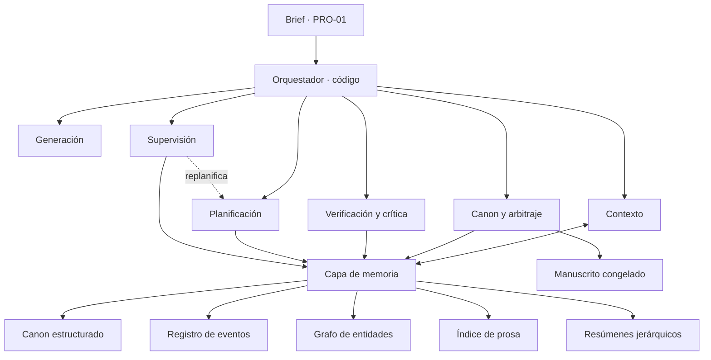
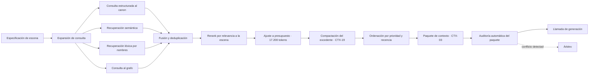
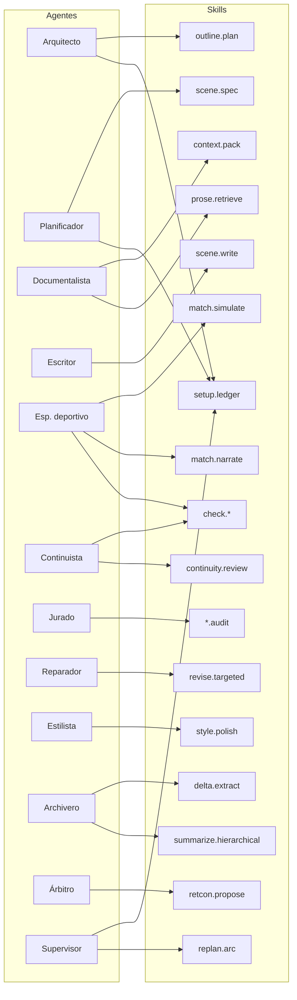
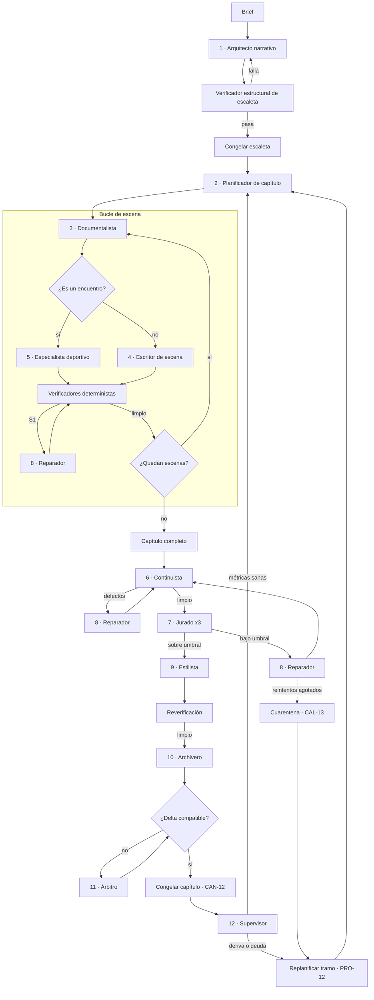
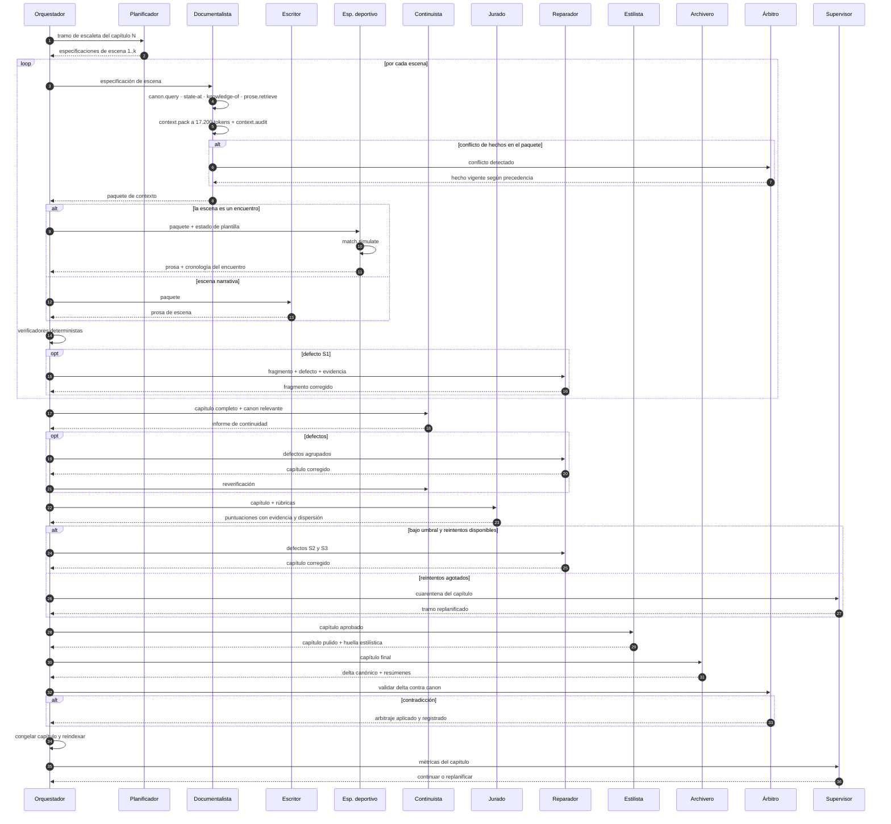
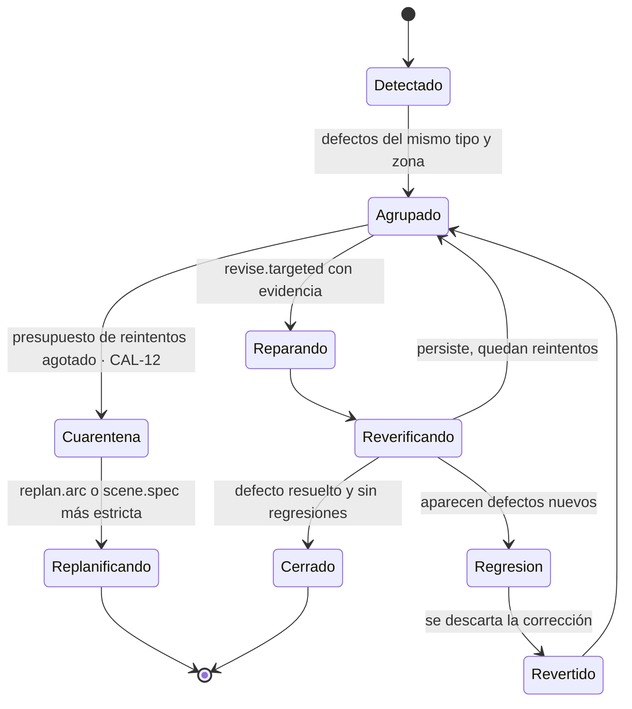
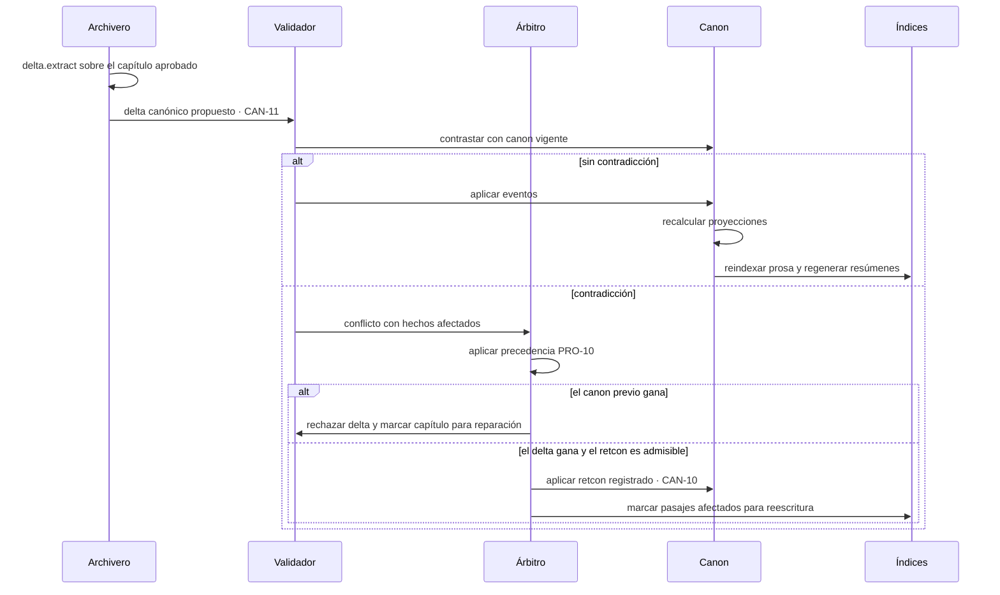

# architecture.md

> Documentación de dominio · ver [`../AGENTS.md`](../AGENTS.md) para el índice completo.
> Relacionados: [definitions](definitions.md) · [domain-knowledge](domain-knowledge.md) · [validations](validations.md)

Arquitectura de un sistema **autónomo** de generación de novelas largas, con el caso de referencia de la épica deportiva. Consume el vocabulario de `definitions.md` y los modelos de `domain-knowledge.md`.

Dos restricciones fijan todo el diseño:

- **No hay intervención externa en ningún punto del ciclo** (PRO-11). El sistema planifica, escribe, verifica, corrige, arbitra y cierra por sí mismo.
- **La ventana de contexto es de 100.000 tokens** (CTX-01), entrada más salida, para cualquier llamada de cualquier agente.

---

## 1. Principios de diseño

1. **El canon es la fuente de verdad, no el texto.** La prosa es una proyección. Si la verdad vive solo en los capítulos escritos, cada llamada obliga a releerlo todo y la coherencia se degrada.
2. **El estado se deriva de eventos.** Registro append-only y proyecciones calculadas. Permite responder "qué era cierto en el capítulo 12" sin ambigüedad.
3. **El contexto se presupuesta, no se acumula.** Cada llamada recibe un paquete construido a propósito (CTX-03). Tener 100.000 tokens no es motivo para usarlos.
4. **Lo verificable se verifica sin modelo.** Fechas, marcadores, nombres, longitudes y repeticiones se comprueban con código. El juez LLM se reserva para lo subjetivo.
5. **Escritura y evaluación se aíslan.** El contexto que generó un texto no lo juzga.
6. **Granularidad de generación: escena. Granularidad de control: capítulo.**
7. **Ningún capítulo se cierra sin integrar su delta canónico (CAN-11).**
8. **Toda decisión tiene dueño.** Sin validación externa, cada bifurcación necesita una regla de precedencia, un umbral numérico o un agente responsable. Donde no haya ninguna de las tres cosas, el sistema se bloquea y eso es un fallo de diseño, no una espera.
9. **El bloqueo se resuelve replanificando, no parando.** Agotados los reintentos, se cuarentena el artefacto y se recalcula el tramo (CAL-13, PRO-12).

---

## 2. Vista de contexto del sistema

---

## 3. Capa de memoria

Cinco almacenes con responsabilidades separadas. Unificarlos en un único índice vectorial es el error estructural más frecuente en este tipo de sistema.

| Almacén | Contenido | Tecnología típica | Consulta que resuelve |
|---|---|---|---|
| **Canon estructurado** | Entidades, atributos, fichas, guía de estilo, escaleta | Documento estructurado o BD relacional, versionado | "Dame la ficha del entrenador" |
| **Registro de eventos** | Hechos canónicos fechados, append-only | Tabla de eventos + proyecciones materializadas | "Qué sabía el protagonista en la jornada 14" |
| **Grafo de entidades** | Relaciones tipadas con vigencia | Grafo o tablas de aristas | "Quién tiene conflicto abierto con quién" |
| **Índice de prosa** | Texto congelado, troceado por escena | Vectorial + léxico (BM25) | "Cómo describí el estadio la primera vez" |
| **Resúmenes jerárquicos** | Escena → capítulo → arco → obra | Documentos enlazados | "Resume los actos I y II en 400 palabras" |

**Troceado del índice de prosa**: la unidad es la escena, no un bloque de N tokens. Cada trozo lleva metadatos de capítulo, POV, lugar, instante de mundo y personajes presentes, de modo que la recuperación se filtre antes de puntuarse.

**Consistencia entre almacenes**: el registro de eventos manda. Canon estructurado y grafo son proyecciones reconstruibles. El índice de prosa se reindexa al congelar un capítulo.

---

## 4. Ingeniería de contexto con ventana de 100.000 tokens

### 4.1 Del límite físico al presupuesto operativo

100.000 tokens es el techo del proveedor, no el objetivo de llenado. La distracción (CTX-14) y la dilución de atención aparecen mucho antes de agotar la ventana, y en generación de prosa el coste se paga en cada escena de cada capítulo.

Reglas duras de ocupación (CTX-18):

| Regla | Valor | Motivo |
|---|---|---|
| Entrada máxima por llamada | 70.000 tokens | Solo el Arquitecto se acerca; el resto opera muy por debajo |
| Entrada + salida máximas | 85.000 tokens | Deja margen para reintentos que añaden el defecto y su evidencia |
| Margen reservado | 15.000 tokens | Absorbe regeneración dirigida sin rehacer el paquete |
| Acción al desbordar | Compactación por prioridad inversa (CTX-19) | Nunca truncamiento por el final |

**Orden de compactación** cuando el material excede el presupuesto: primero los fragmentos recuperados, después la prosa literal previa, después los resúmenes, después las fichas secundarias. Nunca se tocan las anclas, el conocimiento del POV ni la especificación de la escena.

### 4.2 Presupuesto por agente

| Agente | Entrada | Salida | Ocupación de la ventana | Frecuencia |
|---|---:|---:|---:|---|
| Arquitecto narrativo | 55.000 | 15.000 | 70 % | Una vez por obra y por replanificación de arco |
| Planificador de capítulo | 28.000 | 6.000 | 34 % | Una vez por capítulo |
| Escritor de escena | 17.000 | 3.000 | 20 % | Por escena |
| Especialista deportivo | 12.000 | 3.000 | 15 % | Por encuentro |
| Continuista | 45.000 | 5.000 | 50 % | Por capítulo |
| Estilista | 20.000 | 7.000 | 27 % | Por capítulo |
| Juez (por instancia) | 9.000 | 1.500 | 11 % | 3 instancias por capítulo |
| Reparador | 12.000 | 3.000 | 15 % | Por defecto agrupado |
| Archivero | 22.000 | 5.000 | 27 % | Por capítulo |
| Árbitro | 15.000 | 2.000 | 17 % | Por conflicto |
| Supervisor | 30.000 | 3.000 | 33 % | Por capítulo cerrado |

El agente caro no es el que más escribe, es el **Continuista**: necesita el capítulo entero más el canon que podría contradecir. Es también el primero que tocará el techo cuando la novela crezca, y el que justifica la recuperación selectiva.

### 4.3 Presupuesto detallado del Escritor de escena

Es la llamada que más veces se ejecuta, así que es donde el presupuesto importa.

| # | Bloque | Tokens | Compactable | Notas |
|---|---|---:|---|---|
| 1 | Ancla: guía de estilo condensada e invariantes (CTX-17) | 2.000 | No | Idéntica en todas las llamadas |
| 2 | Fichas del elenco activo (CTX-05) | 1.600 | Sí | 4–6 personajes × ~280 tokens |
| 3 | Estado del mundo en t (MUN-10) | 1.200 | Parcial | Incluye estado físico y clasificación |
| 4 | Conocimiento del POV (PER-10) | 600 | No | Solo deltas respecto al estado público |
| 5 | Resúmenes jerárquicos (CTX-06) | 1.400 | Sí | Obra 500, arco 500, capítulo 400 |
| 6 | Prosa literal de la escena anterior (CTX-07) | 4.500 | No | El bloque que sostiene la voz |
| 7 | Recuperación puntual, 4–6 fragmentos (CTX-08) | 3.000 | Sí | Descripciones previas, escenas espejo |
| 8 | Setups abiertos relevantes (CAN-08) | 700 | Sí | Filtrados por personaje y arco |
| 9 | Lista de proscripción (POE-12) | 500 | Sí | 30 elementos más recientes |
| 10 | Muestra modélica de voz | 800 | Sí | Rotativa, nunca la escena anterior |
| 11 | Especificación de la escena | 900 | No | Va al final por CTX-16 |
| — | **Total entrada** | **17.200** | | 17 % de la ventana |
| — | Reserva de salida | 3.000 | | Escena de hasta ~2.000 palabras |

El 80 % restante de la ventana no es espacio libre que llenar. Es margen deliberado: si esos 17.000 tokens están bien elegidos, añadir 50.000 más de canon tangencial empeora el resultado.

### 4.4 Pipeline de ensamblaje

**Auditoría del paquete (paso J)**: antes de gastar la llamada, se comprueba que no haya dos versiones del mismo hecho (CTX-15), que todo el elenco tenga ficha, que las anclas estén presentes y que el total no exceda el presupuesto. Si aparece un conflicto de hechos, no se genera: se resuelve primero en el Árbitro.

### 4.5 Resúmenes jerárquicos

Se generan al congelar, nunca sobre la marcha:

- Escena cerrada: 60–100 palabras con cambio de valor y delta canónico.
- Capítulo cerrado: 150–250 palabras, construidas desde los resúmenes de escena, no desde el texto completo.
- Arco cerrado: 300 palabras.
- Obra: se regenera cada 5 capítulos.

Esto es lo que mantiene la memoria completa dentro de 100.000 tokens cuando la novela pasa de 150.000 palabras. Sin jerarquía, el Continuista deja de caber en la ventana alrededor del capítulo 20.

### 4.6 Control de deriva (CTX-12)

- **Anclas fijas** en toda llamada: guía de estilo condensada e invariantes.
- **Huella estilística (POE-13)** por capítulo: longitud media y varianza de frase, ratio adjetivo/sustantivo, n-gramas de 4 más frecuentes, riqueza léxica. Se compara contra la referencia de los primeros capítulos congelados. Desviación sostenida dispara un pase de estilo automático.
- **Lista de proscripción dinámica**: todo n-grama o imagen usado dos veces entra automáticamente en POE-12.
- **Muestra modélica rotativa**: un fragmento congelado de alta puntuación, distinto del inmediatamente anterior, para que la referencia de voz no sea siempre la última salida del propio sistema (POE-14).

### 4.7 Aislamiento (CTX-11)

Cada agente corre en su propia ventana limpia y devuelve solo salida estructurada. El Escritor nunca ve los informes de defectos de otros capítulos, el Juez nunca ve el paquete del Escritor y el Archivero nunca ve las rúbricas. Es lo que permite que doce agentes trabajen sobre una novela de 200.000 palabras sin que ninguno necesite más de 70.000 tokens.

---

## 5. Catálogo de skills

Una **skill** es una capacidad reutilizable con contrato fijo de entrada y salida. Las usan varios agentes; no pertenecen a ninguno. Las deterministas son código y no consumen ventana; las de modelo encapsulan instrucción, rúbrica y formato de salida.

### 5.1 Skills deterministas

| Skill | Función | Salida |
|---|---|---|
| `canon.query` | Consulta estructurada de entidades y fichas | Fichas en formato compacto |
| `canon.state-at` | Proyecta el estado del mundo en un instante | Estado en t |
| `canon.knowledge-of` | Proyecta qué sabe un personaje en t (PER-10) | Lista de hechos conocidos |
| `prose.retrieve` | Recuperación híbrida con filtro por metadatos | Fragmentos rankeados |
| `context.pack` | Ensambla y ordena el paquete según presupuesto | Paquete de contexto |
| `context.compact` | Reduce bloques por prioridad inversa | Paquete ajustado |
| `context.audit` | Detecta conflictos, huecos y exceso de tokens | Informe de validez |
| `check.timeline` | Fechas, orden de eventos, duración de elipsis | Defectos con evidencia |
| `check.ledger` | Marcadores, clasificación y estadísticas recalculadas | Defectos con evidencia |
| `check.availability` | Disponibilidad física y lesiones (DEP-I2) | Defectos con evidencia |
| `check.format` | POV único, tiempo verbal, persona, longitud | Defectos con evidencia |
| `check.repetition` | N-gramas repetidos y términos proscritos | Lista con recuento |
| `check.lexicon` | Nombres, alias y léxico del mundo | Defectos con evidencia |
| `match.simulate` | Motor de reglas que resuelve un encuentro completo | Cronología del encuentro y resultado |
| `style.fingerprint` | Calcula la huella estilística del texto | Vector de métricas y desviación |
| `setup.ledger` | Mantiene el registro de setups y su estado | Deuda narrativa vigente |
| `metrics.report` | Agrega métricas de salud por capítulo | Cuadro de mando |

`match.simulate` es la skill que más devuelve en épica deportiva: **el encuentro se resuelve primero con reglas y después se narra**. El modelo no inventa el marcador, lo dramatiza. Elimina de raíz toda la familia de defectos de verosimilitud deportiva.

### 5.2 Skills de modelo

| Skill | Función | Salida |
|---|---|---|
| `outline.plan` | Genera arcos, actos y curva de tensión | Escaleta estructurada |
| `scene.spec` | Convierte una entrada de escaleta en especificación completa | Especificación de escena |
| `scene.write` | Escribe la prosa de una escena | Prosa |
| `match.narrate` | Narra un encuentro ya resuelto por `match.simulate` | Prosa de secuencia |
| `continuity.review` | Contrasta prosa contra canon en lo no determinista | Defectos con cita |
| `voice.audit` | Verifica idiolecto y distinción entre voces | Puntuación con evidencia |
| `pacing.audit` | Evalúa ritmo, densidad y cambio de valor | Puntuación con evidencia |
| `subtext.audit` | Evalúa diálogo y subtexto | Puntuación con evidencia |
| `theme.audit` | Evalúa resonancia temática y uso de motivos | Puntuación con evidencia |
| `revise.targeted` | Corrige un fragmento dado el defecto y su evidencia | Fragmento corregido |
| `dialogue.pass` | Pase específico sobre diálogo | Prosa revisada |
| `style.polish` | Pase de estilo, poda y proscripción | Prosa pulida |
| `delta.extract` | Extrae hechos, eventos y cambios de estado | Delta canónico estructurado |
| `summarize.hierarchical` | Resume al nivel pedido | Resumen |
| `retcon.propose` | Propone reinterpretación de canon con pasajes afectados | Propuesta arbitrable |
| `replan.arc` | Recalcula un tramo de escaleta tras un bloqueo | Escaleta parcial |

**Contrato común de las skills de auditoría**: toda puntuación llega acompañada de la cita textual que la justifica. Sin evidencia, la puntuación se descarta automáticamente. Es lo que impide que un juez sin supervisión externa apruebe por inercia.

---

## 6. Catálogo de agentes

| # | Agente | Misión | Skills principales | Criterio de salida |
|---|---|---|---|---|
| 0 | **Orquestador** | Dirige el flujo, aplica presupuestos y cuenta reintentos. Es código, no modelo. | Todas las deterministas | — |
| 1 | **Arquitecto narrativo** | Arcos, doble arco (DEP-20), curva de tensión, escaleta de obra | `outline.plan`, `canon.query` | Escaleta que supera el verificador estructural |
| 2 | **Planificador de capítulo** | Convierte el tramo de escaleta en especificaciones de escena | `scene.spec`, `canon.state-at`, `setup.ledger` | Todas las escenas con función y cambio de valor declarados |
| 3 | **Documentalista** | Ensambla el paquete de contexto de cada llamada. Es código. | `context.pack`, `prose.retrieve`, `canon.*`, `context.audit` | Paquete válido dentro de presupuesto |
| 4 | **Escritor de escena** | Produce la prosa | `scene.write` | Escena generada dentro de longitud |
| 5 | **Especialista deportivo** | Resuelve y narra encuentros; custodia DEP-19 | `match.simulate`, `match.narrate`, `check.availability` | Encuentro consistente con reglamento y plantilla |
| 6 | **Continuista** | Verificación de continuidad de capítulo | `check.*`, `continuity.review` | Cero defectos S1 |
| 7 | **Jurado** (3 instancias) | Evalúa las dimensiones subjetivas | `voice.audit`, `pacing.audit`, `subtext.audit`, `theme.audit` | Puntuaciones sobre umbral y dispersión baja |
| 8 | **Reparador** | Corrección dirigida de defectos agrupados | `revise.targeted`, `dialogue.pass` | Defecto cerrado sin abrir otros |
| 9 | **Estilista** | Pase de voz, poda y proscripción | `style.polish`, `style.fingerprint`, `check.repetition` | Huella dentro de tolerancia |
| 10 | **Archivero** | Extrae el delta canónico y regenera resúmenes | `delta.extract`, `summarize.hierarchical` | Delta completo y estructurado |
| 11 | **Árbitro** | Resuelve conflictos por política de precedencia (PRO-10) | `retcon.propose`, `canon.query` | Conflicto cerrado y registrado |
| 12 | **Supervisor** | Vigila deuda narrativa, curva de tensión y deriva; dispara replanificación | `setup.ledger`, `metrics.report`, `replan.arc` | Métricas dentro de umbral |

Tres agentes son los que suelen faltar en implementaciones ingenuas: el **Archivero** (sin él el canon se queda atrás respecto al texto), el **Árbitro** (sin él un conflicto detiene el sistema, porque no hay a quién preguntar) y el **Supervisor** (sin él la novela pierde forma en el segundo acto sin que nada lo señale).

### 6.1 Matriz agente × skill

---

## 7. Flujo del sistema de agentes

### 7.1 Vista general

### 7.2 Secuencia de un capítulo

### 7.3 Bucle de reparación y cuarentena

Cómo se cierra un defecto sin que nadie apruebe nada.

**Presupuestos de reintento por defecto**: 3 a nivel de escena, 2 a nivel de capítulo, 1 replanificación de tramo. Al agotarse la tercera, se replanifica el arco completo. No hay cuarto nivel: si un arco falla dos veces, el problema está en la escaleta y se recalcula desde el Arquitecto.

---

## 8. Cómo se sustituye cada decisión antes reservada a una persona

| Decisión | Sustituto autónomo |
|---|---|
| Aprobar la escaleta | Verificador estructural determinista: cobertura de arcos, resolución del doble arco en momentos distintos, curva de tensión monótona por acto, todos los setups con payoff planificado, reparto de palabras por capítulo. Más una pasada de jurado sobre la escaleta. |
| Resolver una contradicción de canon | Árbitro con la política de precedencia PRO-10: canon congelado > delta nuevo; brief > canon derivado; invariante duro > preferencia estética; hecho con payoff cobrado > hecho sin cobrar. |
| Autorizar un retcon | `retcon.propose` más regla dura: solo procede si el hecho afectado no ha sido cobrado en ningún payoff y el número de pasajes que habría que tocar es igual o menor que 3. En caso contrario se regenera el capítulo nuevo. |
| Cerrar un capítulo | Puertas automáticas con umbrales por dimensión (CAL-09). |
| Calibrar a los jueces | Conjunto dorado con defectos sembrados (CAL-10) ejecutado cada 5 capítulos, más dispersión del jurado (CAL-11) como señal de fiabilidad por veredicto. |
| Rechazar y parar | No existe. Cuarentena (CAL-13) más replanificación (PRO-12). La producción continúa con el siguiente capítulo y el tramo cuarentenado se rehace. |
| Decidir que la novela está terminada | Condición de cierre verificable: deuda narrativa cero, todos los arcos con estado resuelto, curva de tensión completada, longitud dentro del rango del brief. |

**Lo que se pierde y hay que compensar con medición**: el criterio de gusto. Un sistema autónomo puede garantizar coherencia, verosimilitud y ausencia de defectos, pero no puede decidir por sí mismo que una escena es memorable. La contramedida practicable es el conjunto dorado, que fija un suelo conocido, y la vigilancia de la huella estilística, que detecta el aplanamiento antes de que se acumule.

---

## 9. Control de calidad automático

El catálogo completo de comprobaciones, con su regla exacta, severidad y acción al fallar, está en [`validations.md`](validations.md). Aquí solo se describe el mecanismo.

### 9.1 Verificadores deterministas

Coste despreciable, cero falsos positivos si están bien escritos. Se ejecutan siempre antes que cualquier juez:

- Cronología: fechas mencionadas frente al calendario; orden de eventos; duración de elipsis.
- Resultados y clasificación: el marcador narrado cuadra con `match.simulate`; la tabla recalculada coincide con lo afirmado.
- Estadísticas acumuladas: suma de encuentros narrados.
- Disponibilidad: nadie juega estando lesionado en esa fecha (DEP-I2).
- Nombres, alias y léxico del mundo.
- Restricciones formales: tiempo verbal, persona, POV único por escena, longitud.
- Repetición: n-gramas de 4 o más ya usados; frecuencia de términos proscritos.
- Conocimiento: menciones de hechos canónicos por personajes cuyo PER-10 no los incluye.

### 9.2 Jurado

Tres instancias con rúbricas distintas y semillas distintas. Reglas:

- Toda puntuación cita el fragmento que la justifica. Sin cita, se descarta.
- Contexto mínimo: escena, especificación y ficha de voz. Nunca el paquete del Escritor.
- Dispersión alta entre instancias invalida el veredicto y fuerza una verificación adicional en lugar de promediar. Promediar jueces que no se ponen de acuerdo produce un número sin significado.

### 9.3 Puertas

| Puerta | Condición de paso |
|---|---|
| Escena generada | Cero defectos S1 deterministas |
| Capítulo verificado | Cero S1, máximo 2 S2, continuidad y voz sobre umbral |
| Capítulo cerrado | Puertas anteriores más huella estilística dentro de tolerancia y delta canónico integrado |
| Cierre de acto | Deuda narrativa dentro del margen planificado; curva de tensión conforme |
| Cierre de obra | Deuda narrativa cero; todos los arcos resueltos; longitud en rango |

---

## 10. Escritura de canon

El punto donde el texto generado se convierte en verdad. Sin validación externa, el Árbitro es el único guardián.

Reglas duras: el delta se propone y se valida, nunca se aplica en bruto; todo hecho guarda procedencia (MET-09) y capítulo de origen; todo arbitraje deja registro con la regla aplicada; la congelación es la única operación que cambia el canon.

---

## 11. Observabilidad

Por cada fragmento se guarda: versión del paquete de contexto, ocupación real en tokens por bloque, agente, skill, parámetros, defectos, puntuaciones con evidencia y decisiones de arbitraje.

En un sistema sin supervisión externa, la observabilidad no es un extra: es el único mecanismo para detectar que algo se ha estado degradando durante diez capítulos.

| Métrica | Señal de alarma |
|---|---|
| Defectos S1 por 1.000 palabras | Tendencia creciente: el canon no llega al contexto |
| Tasa de reparación | Por encima del 30 %: escaleta o contexto insuficientes |
| Capítulos en cuarentena | Más de uno por acto: problema estructural, no local |
| Deriva de huella estilística | Desviación sostenida: pase de estilo y refresco de muestras |
| Deuda narrativa | Crece sin plan de cierre |
| Dispersión del jurado | Alta y creciente: rúbricas mal definidas |
| Ocupación real por bloque | Un bloque desplaza sistemáticamente a otro |
| Aciertos sobre el conjunto dorado | Caída: los jueces han derivado |

---

## 12. Riesgos y mitigaciones

| Riesgo | Impacto | Mitigación |
|---|---|---|
| Envenenamiento de canon (CTX-13) | Alto y creciente: sin revisión externa se propaga sin freno | Validación de delta, procedencia obligatoria, arbitraje registrado, conjunto dorado |
| Jueces que derivan junto al generador | Alto y silencioso | Aislamiento, evidencia obligatoria, jurado con dispersión, conjunto dorado periódico |
| Aplanamiento estilístico | Alto | Huella estilística, proscripción dinámica, muestras modélicas rotativas |
| Bucle infinito de reparación | Medio | Presupuesto de reintentos y cuarentena, sin excepción |
| Convergencia a lo correcto pero anodino | Alto, propio de la autonomía total | Umbrales mínimos también en tensión y subtexto, no solo en continuidad |
| Continuista que no cabe en 100.000 tokens | Medio, aparece hacia el capítulo 20 | Resúmenes jerárquicos y recuperación filtrada por metadatos |
| Coste por capítulo | Medio | Determinista antes que modelo, escena como unidad de reintento, modelos distintos por rol |

---

## 13. Decisiones abiertas

1. Tamaño óptimo del bloque de prosa literal (4.500 tokens actuales) frente a su coste por escena.
2. Si el Continuista debe operar por capítulo o por par de capítulos al crecer la obra.
3. Número de instancias de jurado: tres es el mínimo para medir dispersión, pero triplica coste.
4. Umbral de dispersión que invalida un veredicto.
5. Si `match.simulate` debe modelar el encuentro minuto a minuto o solo sus hitos.
6. Punto a partir del cual conviene reescribir un capítulo en vez de repararlo.

---

## 14. Orden de construcción sugerido

1. Canon estructurado + registro de eventos.
2. Especificación de escena y escaleta.
3. Documentalista con presupuesto fijo, sin recuperación semántica.
4. Escritor de escena + verificadores deterministas.
5. Archivero y ciclo de congelación.
6. Árbitro y política de precedencia. **Desde aquí el sistema ya es autónomo**: antes de este punto, cualquier conflicto lo detiene.
7. Resúmenes jerárquicos.
8. Recuperación híbrida.
9. Jurado, conjunto dorado y Estilista.
10. Supervisor, replanificación y métricas de salud.

Los pasos 1 a 6 producen una novela coherente sin intervención. Del 7 en adelante se gana escala y calidad, no viabilidad.
