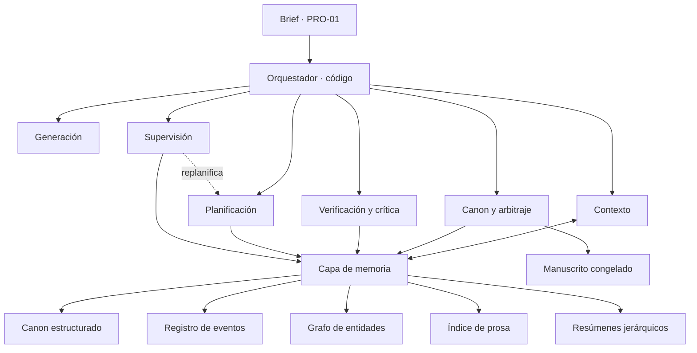
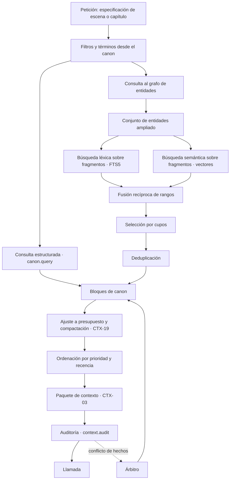
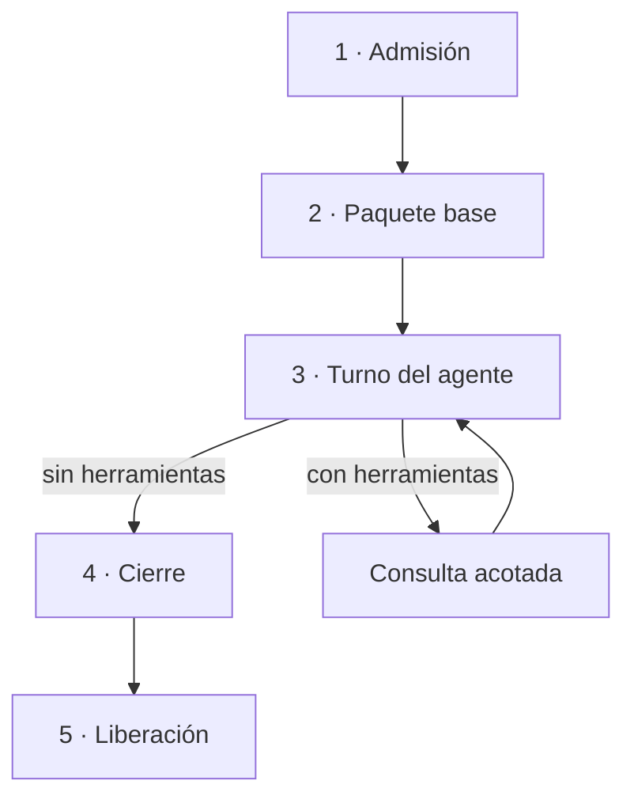
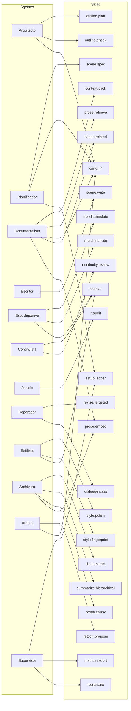
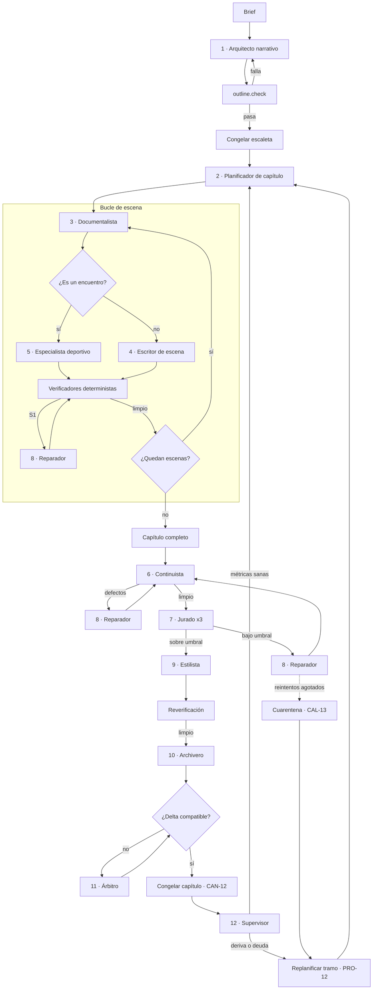
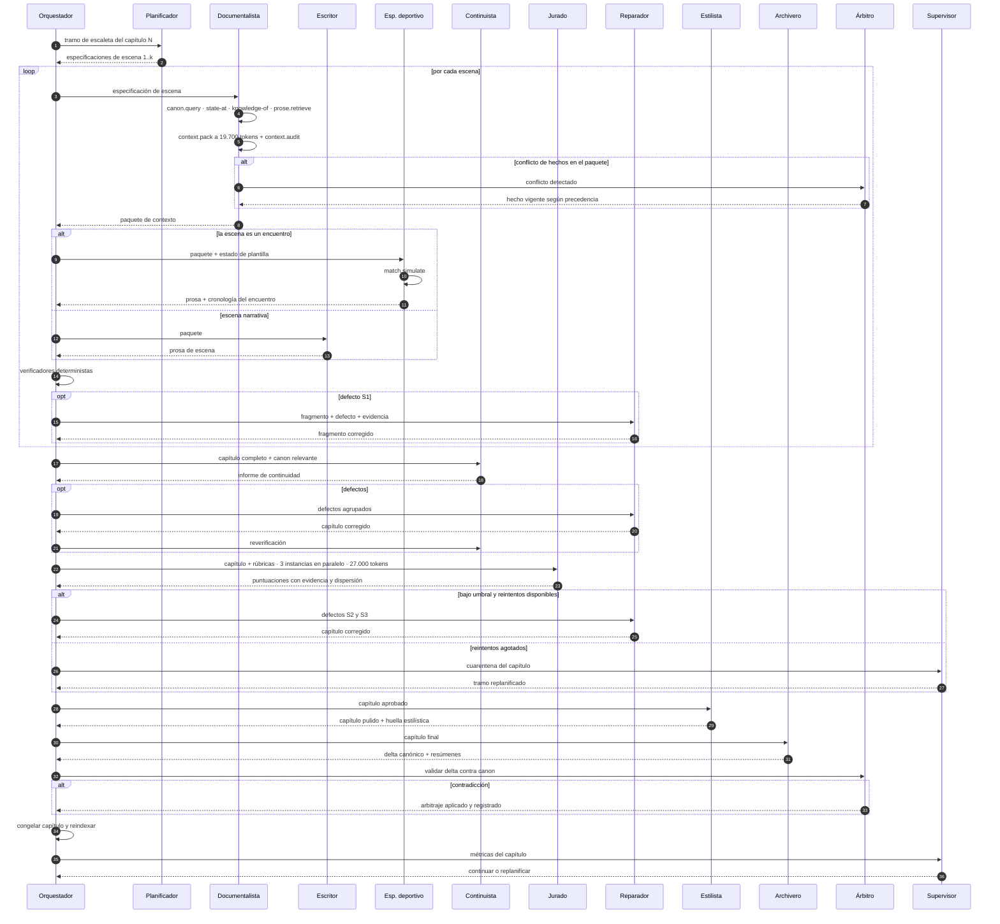
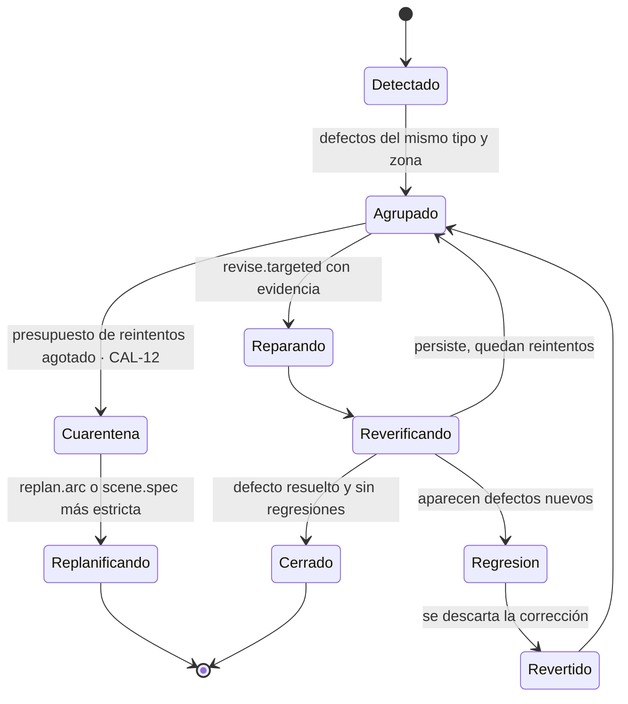
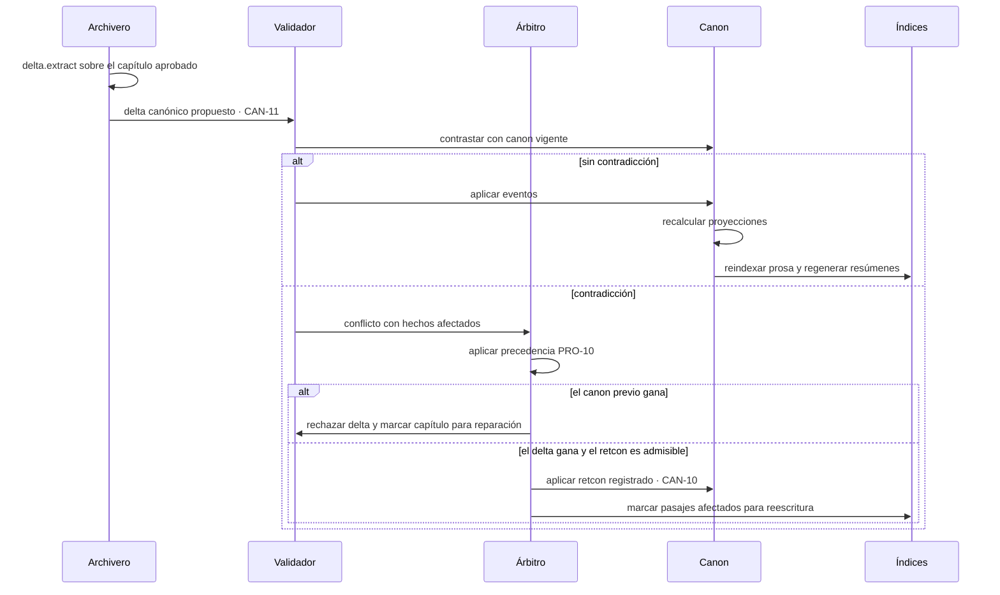

# architecture.md

> Documentación de dominio · ver [`../AGENTS.md`](../AGENTS.md) para el índice completo.
> Relacionados: [definitions](definitions.md) · [domain-knowledge](domain-knowledge.md) · [verification](verification.md)

Arquitectura de un sistema **autónomo** de generación de novelas largas, con el caso de referencia de la épica deportiva. Consume el vocabulario de `definitions.md` y los modelos de `domain-knowledge.md`.

Dos restricciones fijan todo el diseño:

- **No hay intervención externa en ningún punto del ciclo** (PRO-11). El sistema planifica, escribe, verifica, corrige, arbitra y cierra por sí mismo.
- **100.000 tokens es el techo, en dos planos.** Por llamada, la ventana física (CTX-01). Para el sistema, el techo de concurrencia (CTX-20): la suma de todo lo que está en vuelo en el mismo instante.

---

## 1. Principios de diseño

1. **El canon es la fuente de verdad, no el texto.** La prosa es una proyección. Si la verdad vive solo en los capítulos escritos, cada llamada obliga a releerlo todo y la coherencia se degrada.
2. **El estado se deriva de eventos.** Registro append-only y proyecciones calculadas. Permite responder "qué era cierto en el capítulo 12" sin ambigüedad.
3. **El contexto se presupuesta, no se acumula.** Cada llamada recibe un paquete construido a propósito (CTX-03). Tener 100.000 tokens no es motivo para usarlos.
4. **Lo verificable se verifica sin modelo.** Fechas, marcadores, nombres, longitudes y repeticiones se comprueban con código. El juez LLM se reserva para lo subjetivo.
5. **Escritura y evaluación se aíslan.** El contexto que generó un texto no lo juzga.
6. **Granularidad de generación: escena. Granularidad de control: capítulo.**
7. **Ningún capítulo se cierra sin integrar su delta canónico (CAN-11).**
8. **Toda decisión tiene dueño.** Sin validación externa, cada bifurcación necesita una regla de precedencia, un umbral numérico o un agente responsable. Donde no haya ninguna de las tres cosas, el sistema se bloquea y eso es un fallo de diseño, no una espera.
9. **El bloqueo se resuelve replanificando, no parando.** Agotados los reintentos, se cuarentena el artefacto y se recalcula el tramo (CAL-13, PRO-12).

---

## 2. Vista de contexto del sistema



El diagrama es la vista lógica. Todo lo que aparece en él vive en `backend/`.

### 2.1 Reparto físico: monorepo

El repositorio es un monorepo con dos artefactos desplegables.

| Carpeta | Stack | Contiene |
|---|---|---|
| `backend/` | Python y FastAPI | Orquestador, los 13 agentes, el catálogo de skills, los cinco almacenes de la capa de memoria y las puertas de calidad |
| `frontend/` | React | Entrevista del brief, lectura del manuscrito por versiones con portada, índice y ficha de personajes y lugares, enmiendas al brief desde la lectura, y visualización del estado: grafo de entidades, curva de tensión, deuda narrativa y salud de la tirada |

**El frontend es un observador de solo lectura del ciclo.** No aprueba, no corrige, no desbloquea y no escribe canon. El motivo no es de alcance sino de diseño: cualquier interacción de la interfaz que condicione el ciclo reintroduce la aprobación manual que PRO-11 prohíbe, y lo hace por la puerta de atrás, sin regla de precedencia ni agente responsable. Lo único que entra por él son **encargos**: el brief antes del ciclo y sus enmiendas después de una congelación (§2.2). Un encargo cambia lo que se pide, nunca revisa lo que se escribió: la enmienda es un hecho con procedencia `brief` (MET-09) que el sistema aplica solo, por la precedencia de PRO-10, como un retcon (CAN-10) que conserva la versión anterior (PRO-08). Cómo lo hace está en §8.

De ahí se sigue una prueba barata de que el diseño se respeta: **el sistema completa una novela con el frontend apagado**. El día que no pueda, hay un fallo de diseño.

### 2.2 Frontera entre las dos mitades

| Qué cruza | Dirección | Forma |
|---|---|---|
| Brief (PRO-01) | frontend → backend | Encargo inicial, construido en una entrevista cuyas llamadas de modelo despacha el backend en código. Es entrada, no revisión: ocurre antes del ciclo y no lo interrumpe |
| Enmienda al brief (PRO-01) | frontend → backend | Encargo posterior: un hecho nuevo con procedencia `brief` (MET-09) y el fragmento o el hecho del que sale. Se admite solo entre congelaciones o con la obra cerrada; el Orquestador la aplica como retcon (CAN-10) según §8 y la versión anterior (PRO-08) se conserva. Es entrada, no revisión |
| Manuscrito congelado | backend → frontend | Solo capítulos cerrados, por versión (PRO-08), con qué capítulos cambiaron respecto a la anterior. Un borrador (PRO-06) no sale |
| Ficha de entidades | backend → frontend | Personajes y lugares con sus alias, hechos con procedencia, relaciones vigentes y los capítulos donde aparecen. Derivada del canon, nunca el registro en crudo |
| Proyecciones de estado | backend → frontend | Grafo de entidades, curva de tensión, deuda narrativa. Derivadas, nunca el registro de eventos en crudo |
| Traza de ejecución | backend → frontend | Las métricas de §11, en lectura |

El contrato es el esquema OpenAPI que genera FastAPI, y es el único punto de acoplamiento entre las dos mitades. Se verifica con VER-08 de [`verification.md`](verification.md): el cliente del frontend se genera desde ese mismo esquema, de modo que un cambio incompatible rompe la compilación en vez de romper la pantalla.

El grafo de entidades y la curva de tensión a lo largo de la obra no se leen bien en una tabla, así que necesitan representación gráfica. Con qué librería se dibujan es una decisión abierta: no está fijada y no condiciona nada del backend, porque el contrato entre las dos mitades es el esquema OpenAPI y no la tecnología de pintado.

---

### 2.3 Organización interna: paquete por funcionalidad

Las dos mitades se organizan **por funcionalidad, no por capa técnica**. Una funcionalidad es una carpeta que contiene todo lo suyo (modelos, lógica, rutas, persistencia y sus tests), y lo compartido vive en `commons/`.

El motivo es el mismo a los dos lados: agrupar por capa técnica, con un `models/` y un `services/` y un `routers/`, obliga a tocar cinco carpetas para cambiar una sola cosa y deja invisible dónde empieza y dónde acaba cada pieza. Agrupar por funcionalidad hace el cambio local y la frontera visible.

#### Backend

Las funcionalidades son las seis capas del diagrama de §2, más el Orquestador y una carpeta que no es de la novela sino del sistema, `evals/`, que comparte piso con él:

```
backend/
├── commons/         · lo que usan dos o más funcionalidades
├── orchestration/   · agente 0, raíz de composición
├── planning/        · agentes 1 y 2
├── context/         · agente 3 y el catálogo de skills de contexto
├── generation/      · agentes 4 y 5
├── verification/    · agentes 6, 7, 8 y 9
├── canon/           · agentes 10 y 11, los cinco almacenes de §3 y las skills canon.*
├── supervision/     · agente 12
├── brief/           · los encargos: la entrevista que construye el brief y la interpretación de una solicitud de cambio
└── evals/           · los evals de verification.md §5.2: ejercitan las funcionalidades sobre ficheros congelados; piso de orchestration/
```

| Carpeta | Agentes de §6 | Skills de §5 |
|---|---|---|
| `orchestration/` | 0 Orquestador | Presupuestos, admisión CTX-20, recuento de reintentos |
| `planning/` | 1 Arquitecto, 2 Planificador | `outline.plan`, `outline.check`, `scene.spec`, `replan.arc`, `setup.ledger` |
| `context/` | 3 Documentalista | `context.*` |
| `generation/` | 4 Escritor, 5 Especialista deportivo | `scene.write`, `match.simulate`, `match.narrate` |
| `verification/` | 6 Continuista, 7 Jurado, 8 Reparador, 9 Estilista | `check.*`, `*.audit`, `revise.targeted`, `style.*`. El conjunto dorado de defectos sembrados (CAL-10) vive con el Jurado, que es a quien calibra |
| `canon/` | 10 Archivero, 11 Árbitro | `canon.*`, `prose.*`, `delta.extract`, `summarize.hierarchical`, `retcon.propose` |
| `supervision/` | 12 Supervisor | `metrics.report`. **Lee** `setup.ledger` de `planning/` |
| `brief/` | Ninguno | `brief.extract` y `amend.interpret`: dos llamadas de modelo que se despachan en código, como el examen, y no agentes. Las preguntas de la entrevista van por plantilla. La enmienda la aplica `orchestration/` (§8) |
| `evals/` | Ninguno | Conjunto dorado de recuperación, medida de acierto de la recuperación, comparación de tiradas, campaña adversaria. Está en el piso de `orchestration/`: importa lo que mide y nadie lo importa |

#### Frontend

Paquete por funcionalidad también, y **explícitamente no Feature-Sliced Design**: nada de `app/`, `pages/`, `widgets/`, `features/`, `entities/` y `shared/` como capas. Las funcionalidades son las vistas y los encargos de §2.2:

```
frontend/
├── commons/         · cliente generado desde el OpenAPI, tipos y componentes compartidos
├── interview/       · entrevista que produce el brief y sus enmiendas
├── manuscript/      · lectura de capítulos congelados por versión, y solicitud de cambio desde la lectura
├── story-bible/     · ficha de personajes y lugares con enlace a sus capítulos
├── entity-graph/    · grafo de entidades con vigencia
├── tension-curve/   · curva de tensión de la obra
├── narrative-debt/  · setups abiertos sin payoff
└── run-health/      · métricas de §11
```

La raíz de composición del frontend son `main.tsx` y `routes.tsx`, en la raíz de `frontend/`: montan las direcciones que exporta cada funcionalidad y sirven la aplicación bajo `/app/`. Son el equivalente de `orchestration/`: conocen a todas las funcionalidades y ninguna las conoce. No pueden vivir en `commons/`, porque todas importan de él.

El cliente generado vive en `commons/` y no en cada funcionalidad: es uno solo, sale del esquema OpenAPI (§2.2) y duplicarlo rompería la garantía de VER-08 de que un cambio incompatible rompe la compilación.

#### Las tres reglas que evitan que esto se degrade

1. **Una funcionalidad no importa de otra funcionalidad.** Solo de `commons/`. Si dos se necesitan entre sí, o lo común baja a `commons/` o la frontera está mal puesta.
2. **Dos excepciones, una en cada extremo.** `orchestration/` es la raíz de composición: conoce a todas las funcionalidades y ninguna lo conoce a él. `canon/` es la base: todas pueden importar de él **en lectura**, es decir, las skills `canon.*` y las proyecciones de §3, y él no importa de ninguna. La escritura sigue siendo exclusiva del Archivero, que vive dentro de `canon/`. Con eso el grafo de imports tiene tres pisos: `canon/` abajo, las funcionalidades en medio, `orchestration/` arriba. Son «el canon es la fuente de verdad» y «todo entra y sale por el Orquestador» (§6.2) escritos en imports. Sin la excepción de `canon/`, el Documentalista, el Planificador y el Continuista no podrían leer el canon sin romper la regla 1, y llevarse el API de lectura a `commons/` partiría al dueño de los almacenes en dos carpetas.
3. **A `commons/` se entra por uso, no por previsión.** Algo baja cuando lo usan dos funcionalidades, nunca cuando parece que podría usarse. Sin esa regla, `commons/` acaba siendo el vertedero donde cae todo y la organización por funcionalidad deja de significar nada.

La regla 1 y sus dos excepciones son estáticamente comprobables, así que no se dejan en convención: son un patrón de análisis estático en la puerta de CI (VER-02).

**Dónde viven las rutas HTTP.** Dentro de cada funcionalidad, como todo lo suyo: `canon/` sirve el estado del mundo, los capítulos congelados y los retcons, `planning/` la deuda narrativa, `verification/` el veredicto del Jurado y la huella de estilo, `supervision/` la salud de la tirada, `orchestration/` el arranque, el estado de la tirada y las solicitudes de cambio, `brief/` la entrevista. No hay una carpeta `api/` transversal, porque sería una capa técnica con otro nombre y es justo lo que §2.3 evita. **La aplicación FastAPI se compone en `orchestration/`**, que ya es la raíz de composición: monta el router que aporta cada funcionalidad y es el único sitio donde existe el objeto de aplicación. Todas las rutas son de lectura salvo las que §2.2 autoriza como encargo —el brief, sus enmiendas y el arranque de la tirada— y la creación y los turnos de la entrevista que construye el brief.

---

## 3. Capa de memoria

La memoria tiene **dos horizontes**, y confundirlos es lo que degrada una novela larga.

| Horizonte | Qué guarda | Cuándo muere |
|---|---|---|
| **Largo plazo** (§3.1) | Lo que es verdad en el universo: canon, eventos, relaciones, prosa congelada, resúmenes | Nunca. Es la novela |
| **Corto plazo** (§3.2) | Lo que el sistema sostiene mientras produce un capítulo: borradores, defectos, veredictos, reintentos | Al congelar el capítulo |

La regla que los separa: **el largo plazo guarda lo que es verdad; el corto plazo, lo que todavía se está decidiendo.** Un borrador no es canon hasta que pasa las puertas, y tratarlo como si lo fuera es el camino corto al envenenamiento de canon (CTX-13).

**Los dos viven en SQLite, en local, con un fichero por novela.** El motivo está en `AGENTS.md` §3.2.

### 3.1 Largo plazo: los cinco almacenes

Cinco almacenes con responsabilidades separadas. Unificarlos en un único índice vectorial es el error estructural más frecuente en este tipo de sistema. Separación lógica, no física: cinco conjuntos de tablas en la misma base.

| Almacén | Contenido | Implementación en SQLite | Consulta que resuelve |
|---|---|---|---|
| **Canon estructurado** | Entidades, atributos, fichas, guía de estilo, escaleta | Tablas relacionadas con columna de versión | "Dame la ficha del entrenador" |
| **Registro de eventos** | Hechos canónicos fechados, append-only | Tabla de eventos con inserción única y con `(instante, desempate)` único, más vistas materializadas por proyección | "Qué sabía el protagonista en la jornada 14" |
| **Grafo de entidades** | Relaciones tipadas con vigencia | Tabla de aristas con vigencia desde y hasta, recorrida con CTE recursivo | "Quién tiene conflicto abierto con quién" |
| **Índice de prosa** | Texto congelado, en dos niveles: escena y fragmento | FTS5 para el léxico, que ya trae BM25, más una tabla de vectores con el embedding de cada fila de los dos niveles | "Cómo describí el estadio la primera vez" |
| **Resúmenes jerárquicos** | Escena → capítulo → arco → obra | Tabla con nivel y referencia al padre | "Resume los actos I y II en 400 palabras" |

**Lo único que SQLite no resuelve de serie es la búsqueda vectorial del índice de prosa.** FTS5 cubre el lado léxico con BM25 incluido, pero la recuperación híbrida (CTX-08) necesita además similitud semántica. Se resuelve **guardando los vectores en una tabla y calculando la similitud en Python**, sin extensión vectorial.

El motivo es el tamaño real del problema. Una obra de 200.000 palabras troceada por escena (EST-08) da del orden de 200 a 400 trozos, y la recuperación filtra antes por metadatos, así que el conjunto que hay que puntuar es todavía menor. Sobre esas cifras el recorrido exhaustivo es exacto e inmediato, y un índice aproximado solo añadiría error. A cambio, el fichero de la novela sigue siendo un SQLite corriente: se abre con la librería estándar, se copia entero con sus vectores dentro, y «copiar el fichero es copiar el estado completo» (`AGENTS.md` §3.2) sigue siendo cierto sin cargar ninguna extensión nativa en el contenedor.

Cada vector se guarda con el identificador del modelo que lo produjo y su dimensión, para que un cambio de modelo de embedding sea detectable y dispare la reindexación en vez de mezclar vectores incomparables. Cuándo se calculan y en qué orden está en §3.3.

Con el modelo de embeddings en local (§4.8), la pierna semántica **no falla durante la tirada**: se comprueba al arrancar y, si el modelo no carga, la tirada no empieza. La ruta que deja `prose.retrieve` devolviendo solo resultados léxicos sigue existiendo y sigue marcándose en el informe de `context.audit`, pero pasa a cubrir un caso distinto: el fragmento cuyo vector falta porque se indexó con otro modelo. No es una comprobación, así que no aplica el fallo cerrado; sí es una señal de §11.

**Troceado del índice de prosa: dos niveles.** El almacén guarda la prosa congelada en dos granularidades, porque las dos preguntas que se le hacen son distintas.

| Nivel | Una fila por | Qué guarda | Para qué sirve |
|---|---|---|---|
| **Escena** | Escena congelada | Metadatos de capítulo, POV, lugar, instante de mundo, personajes presentes y función (EST-14), más su resumen de §4.5 y el vector de ese resumen | Decidir **qué escenas** son relevantes, y filtrar antes de puntuar |
| **Fragmento** | Tramo de párrafos dentro de una escena | Texto literal, su orden dentro de la escena, su vector y su entrada en FTS5 | Es **lo que se inyecta** en el bloque 7 de un paquete |

El fragmento es la unidad recuperable y **nunca cruza la frontera de una escena**: hereda todos los metadatos de la suya, de modo que el filtro por metadatos sigue aplicándose exactamente y la unidad de troceado sigue siendo la escena, no un bloque ciego de N tokens. Se corta por párrafos completos hasta **450 tokens**, con un párrafo de solape con el fragmento anterior. Ese tope sale de §4.3: el bloque 7 dispone de 3.000 tokens para 4 a 6 fragmentos, así que cada uno cabe en 500 contando su cabecera de procedencia.

Los dos niveles son baratos: una obra de 200.000 palabras da del orden de 200 a 400 escenas y entre 600 y 1.200 fragmentos. Es justo el tamaño en que el recorrido exhaustivo gana al índice aproximado.

**Qué se recupera y qué no.** La recuperación por búsqueda opera solo sobre el índice de prosa. Los resúmenes jerárquicos se piden por nivel y rango, no por similitud, porque quien los necesita ya sabe cuáles quiere: el resumen de la obra, el del arco en curso, el de los tres capítulos anteriores. Y el canon estructurado se consulta con `canon.query`, que es exacto. Buscar por similitud lo que se puede pedir por clave es la forma más común de gastar presupuesto en algo peor.

**Consistencia entre almacenes**: el registro de eventos manda. Canon estructurado y grafo son proyecciones reconstruibles. El índice de prosa se reindexa al congelar un capítulo.

### 3.2 Corto plazo: la memoria de trabajo (PRO-13)

Todo lo que el sistema sostiene mientras produce un capítulo y que **no es verdad todavía**. Vive en el mismo fichero, en tablas marcadas como efímeras.

| Tabla | Qué guarda | Se vacía |
|---|---|---|
| `run_state` | En qué capítulo, escena y paso va la tirada. Es el punto de reanudación (PRO-14) | Al terminar la novela |
| `draft` | Prosa de escena y de capítulo aún no congelada (PRO-06) | Al congelar: pasa al índice de prosa |
| `defect` | Defectos abiertos (CAL-05) con su evidencia y su estado en el bucle de §7.3 | Al congelar |
| `verdict` | Puntuaciones del jurado por dimensión, con su dispersión (CAL-11) | Al congelar |
| `admission` | Qué llamadas están en vuelo y cuáles esperan en la cola de CTX-20 | Al terminar cada llamada |

**Tres reglas.**

1. **La memoria de trabajo nunca entra en la ventana de un modelo.** Lo que el agente ve es su paquete de contexto (CTX-03), que el Documentalista ensambla. Si un borrador rechazado llegara al contexto del Escritor, el sistema estaría aprendiendo de su propio error.
2. **Se purga al congelar** (PRO-I1). La prosa aprobada pasa al índice; defectos, veredictos y cola desaparecen.
3. **Lo que se purga no se pierde: se traza.** §11 exige conservar defectos, puntuaciones y arbitrajes, y eso es trabajo de la observabilidad (VER-09), no del fichero de la novela. **SQLite guarda lo que es verdad; la traza guarda lo que pasó.** Duplicarlo en tablas históricas haría crecer el fichero con material que ya nadie consulta.

**Quién escribe cada tabla, y por qué eso obliga a separar las fábricas de conexión.**

Las cinco tablas no tienen una funcionalidad dueña, y no es un descuido: cada una la escribe quien produce ese estado. `orchestration/` escribe `run_state` y `admission`, `generation/` escribe `draft`, `verification/` escribe `defect` y `verdict`.

Eso choca de frente con la regla de que la escritura a la base solo sale de `canon/` (§2.3). La salida no es relajar esa regla, porque es la que protege el canon, sino **separar dos escrituras que solo comparten fichero por comodidad**:

| Fábrica | Dónde vive | Quién la importa | Qué puede tocar |
|---|---|---|---|
| **Escritura de canon** | `canon/db/` | Solo `canon/` | Todo menos `wm_*`. En la práctica, solo la congelación |
| **Escritura de memoria de trabajo** | `commons/db/` | Cualquier funcionalidad | **Solo** tablas con prefijo `wm_` |
| **Lectura** | `canon/db/` | Cualquiera, por la excepción de lectura de §2.3 | Todo, sin escribir |

El prefijo `wm_` no es una convención de nombres: es lo que hace **comprobable** la separación. Que la fábrica de memoria de trabajo no nombre jamás una tabla sin ese prefijo es un patrón de análisis estático en la puerta de CI, igual que la regla de imports. Sin eso, «el canon solo lo escribe la congelación» sería una promesa y no un invariante.

**Por qué en SQLite y no en memoria del proceso.** `AGENTS.md` §3.2 promete que copiar el fichero es copiar el estado completo, y de ahí salen la reproducibilidad de una tirada, el conjunto dorado (CAL-10) y los evals (VER-10). Con el estado de trabajo en el proceso esa promesa deja de ser cierta, y una caída en el capítulo 28 se lleva el capítulo entero.


### 3.3 Escritura del índice: qué se indexa al congelar

La congelación (CAN-12) es el único momento en que el índice de prosa crece, y el orden importa porque una parte es red y otra es transacción.

**Fuera de la transacción**, con el capítulo ya aprobado y antes de tocar la base:

1. **Cortar los fragmentos** de cada escena del capítulo, por párrafos completos hasta 450 tokens con un párrafo de solape. Es determinista: el mismo capítulo produce siempre los mismos cortes.
2. **Generar los resúmenes** de escena y de capítulo con `summarize.hierarchical`, según §4.5. El de escena es lo que se embebe en el nivel de escena.
3. **Calcular los vectores** de cada resumen de escena y de cada fragmento con `prose.embed`, que es cómputo local (§4.8). Va antes de abrir la transacción porque es la parte cara: cientos de vectores por capítulo, y una transacción abierta mientras se calculan bloquea el fichero sin motivo. Ya no puede fallar por red; si fallara por otra causa, el capítulo va a cuarentena sin haber escrito nada.

**Dentro de la transacción**, todo junto o nada:

4. Aplicar los eventos del delta canónico (CAN-11) al registro.
5. Recalcular las proyecciones del canon estructurado y del grafo.
6. Insertar las filas de escena y de fragmento con sus vectores y sus entradas de FTS5.
7. Escribir los resúmenes en su almacén y regenerar los de nivel superior que toque, según §4.5.
8. **Insertar en la lista de proscripción** (POE-12) los n-gramas e imágenes que este capítulo hace repetidos, según §4.6.
9. Purgar la memoria de trabajo del capítulo (PRO-I1).

La razón de partirlo en dos mitades es que la red y la transacción no se llevan bien: una transacción abierta esperando a un proveedor externo bloquea el fichero durante segundos y deja el estado a medias si el proceso cae. Con este orden, un fallo de red no deja rastro y un fallo de escritura revierte entero.

**Lo que no se indexa.** Nada que no esté congelado. Un borrador (PRO-06) no entra en el índice ni con marca de provisional: si entrara, la recuperación de la escena siguiente podría traer texto que aún puede desaparecer, que es exactamente el camino al envenenamiento de contexto (CTX-13).

---

## 4. Ingeniería de contexto con ventana de 100.000 tokens

### 4.1 Del límite propio al presupuesto operativo

**100.000 tokens es un techo fijado por este proyecto, no un límite del proveedor.** Los modelos que el sistema usa ofrecen ventanas de 200.000 tokens (Haiku 4.5) y de 1.000.000 (Opus 5, Sonnet 5), por defecto y sin recargo. El techo es una decisión de calidad y de coste: la distracción (CTX-14) y la dilución de atención aparecen mucho antes de agotar la ventana, y en generación de prosa el coste se paga en cada escena de cada capítulo.

Que sea propio y no impuesto importa, y por eso está escrito así: **una restricción etiquetada como física se salta en la primera implementación en cuanto alguien descubre que el proveedor da diez veces más.** Esta se sostiene por su motivo, no por su origen.

**El techo mide entrada.** La salida no se cuenta contra él: sale de la ventana del agente que la produce y no ocupa sitio en la de ningún otro. Lo que sí se controla es que la salida de un agente no inunde el paquete del siguiente, y eso es el guardarraíl de 50.000 de la tabla.

Reglas duras de ocupación (CTX-18) y de concurrencia (CTX-20):

| Regla | Valor | Motivo |
|---|---|---|
| Entrada máxima por llamada | 100.000 tokens | Techo propio. Con herramientas, es la suma del paquete base más todo lo que la llamada acumule durante su turno |
| Entrada máxima de un paquete al ensamblarse | 85.000 tokens | Deja 15.000 para lo que añada un reintento —el defecto y su evidencia— sin rehacer el paquete |
| Salida máxima por llamada | 50.000 tokens | Red de seguridad: impide que la salida de un agente ocupe sola la ventana del siguiente. **No sustituye** a los topes de salida por agente de §4.2, que son límites de longitud narrativa, no de ventana |
| Acción al desbordar | Compactación por prioridad inversa (CTX-19) | Nunca truncamiento por el final |
| Techo concurrente del sistema | 100.000 tokens de entrada (CTX-20) | Suma de la **entrada** de todo lo que está en vuelo. Cinco agentes en serie tienen 100.000 cada uno, porque en cada instante solo hay uno en vuelo |
| Política de admisión | FIFO estricta | El Orquestador no arranca una llamada si no cabe: la encola. Sin reordenar por hueco, que mataría de hambre al Arquitecto y al Continuista, que son las llamadas grandes |

**Consecuencia que conviene ver.** Con la salida fuera del recuento y el único paralelismo real siendo los tres jueces, que suman 27.000 de entrada, el techo concurrente deja de morder en el flujo de hoy. Sigue escrito porque es un guardarraíl para cuando el paralelismo crezca, no una descripción de lo que ocurre ahora.

**Antes de llamar, estos números se estiman; después, se miden.** Con qué, en §4.8. Dos cosas que conviene saber ya: **la cuenta es específica del modelo**, porque los tokenizadores difieren entre generaciones hasta un 30 % sobre el mismo texto, así que una calibración hecha contra un modelo no vale para otro; y **los tokens servidos desde caché ocupan ventana igual** que los demás, porque el caché cambia lo que se paga, no lo que ocupa.

**Orden de compactación** cuando el material excede el presupuesto: primero los fragmentos recuperados, después la prosa literal previa, después los resúmenes, después las fichas secundarias. Nunca se tocan las anclas, el conocimiento del POV ni la especificación de la escena.

### 4.2 Presupuesto por agente

| Agente | Entrada | Salida | Ocupación de la ventana | Frecuencia |
|---|---:|---:|---:|---|
| Arquitecto narrativo | 57.500 | 15.000 | 58 % | Una vez por obra y por replanificación de arco |
| Planificador de capítulo | 30.500 | 6.000 | 31 % | Una vez por capítulo |
| Escritor de escena | 19.700 | 3.000 | 20 % | Por escena |
| Especialista deportivo | 14.500 | 3.000 | 15 % | Por encuentro |
| Continuista | 47.500 | 5.000 | 48 % | Por capítulo |
| Estilista | 20.000 | 7.000 | 27 % | Por capítulo |
| Juez (por instancia) | 11.500 | 1.500 | 13 % | 3 instancias por capítulo |
| Reparador | 14.500 | 3.000 | 15 % | Por defecto agrupado |
| Archivero | 24.500 | 5.000 | 25 % | Por capítulo |
| Árbitro | 17.500 | 2.000 | 18 % | Por conflicto |
| Supervisor | 32.500 | 3.000 | 33 % | Por capítulo cerrado |
| Lector del examen · `quiz.answer` | 9.000 | 1.000 | 10 % | Por capítulo |
| Extracción del texto libre · `brief.extract` | 9.000 | 2.000 | 11 % | Por texto libre pegado en la entrevista |
| Interpretación de una solicitud · `amend.interpret` | 7.100 | 500 | 8 % | Por solicitud de cambio |

Las tres últimas filas **no son agentes**: son llamadas de modelo que se despachan en código, sin misión ni criterio de salida propios, igual que el tope de salida lo aplica `dispatch` y no el modelo (§5.3). Su entrada sale de números que ya están en este documento: 8.000 del capítulo completo —el mismo bloque que ya ocupan el Estilista y el Archivero en §4.9—, más 500 de preguntas y 500 de instrucción. La salida es menor que la de un juez porque son respuestas breves y no hay evidencia que citar. Las dos de los encargos también salen de números de este documento (`specs/srs-backend-v3.md` D-80): la extracción lleva el texto libre en el mismo bloque de 8.000 que un capítulo, más 500 de borrador y 500 de instrucción, y devuelve lo que el Árbitro; la interpretación lleva la cita en el techo de 4.500 de la prosa literal de §4.3, las fichas del bloque 2 de §4.3 y 1.000 de petición e instrucción, y devuelve un solo JSON.

**Qué corre en paralelo.** Solo el Jurado: sus tres instancias son deliberadamente independientes entre sí (§9.2), así que se lanzan a la vez y suman 34.500 tokens de entrada. Todo lo demás va en serie. Las escenas de un capítulo **no** se paralelizan, y no por coste: el bloque 6 del paquete del Escritor es la prosa literal de la escena anterior (§4.3), no compactable, así que escribir la escena *n* exige tener escrita la *n−1*. Paralelizarlas compraría velocidad rompiendo justo el bloque que sostiene la voz.

Con eso, las combinaciones que CTX-20 llega a acotar son estas. **Se suma entrada, y para los agentes con herramientas se suma también su cupo de tirón** (§6.3), que se reserva entero en la admisión:

| Concurrencia | Suma de entrada | Cabe |
|---|---:|:-:|
| Jurado ×3 | 34.500 | Sí, de sobra |
| Continuista con su cupo, más Jurado ×3 | 107.000 | No: el Jurado se encola hasta que el Continuista termina, que es además el orden de §7.2 |
| Arquitecto con su cupo, más Supervisor con el suyo | 130.000 | No |
| Escritores de escena en paralelo | 19.700 cada uno | Máximo 5 |

Las dos últimas filas no ocurren en el flujo de §7: el Supervisor corre sobre capítulo cerrado y el Arquitecto solo al planificar, y las escenas van en serie. CTX-20 está para que sigan sin ocurrir cuando el paralelismo crezca, no para describir lo que pasa hoy. Con la salida fuera del recuento, la única concurrencia real —los tres jueces— ocupa poco más de un tercio del techo.

El agente caro no es el que más escribe, es el **Continuista**: necesita el capítulo entero más el canon que podría contradecir. Es también el primero que tocará el techo cuando la novela crezca, y el que justifica la recuperación selectiva.

### 4.3 Presupuesto detallado del Escritor de escena

Es la llamada que más veces se ejecuta, así que es donde el presupuesto importa.

| # | Bloque | Tokens | Compactable | Notas |
|---|---|---:|---|---|
| 1 | **Prefijo cacheable** (CTX-23): instrucción, guía de estilo completa, invariantes duros y léxico del mundo | 4.500 | No | Idéntico en todas las llamadas de este agente. Ver §4.8 |
| 2 | Fichas del elenco activo (CTX-05) | 1.600 | Sí | 4–6 personajes × ~280 tokens |
| 3 | Estado del mundo en t (MUN-10) | 1.200 | Parcial | Incluye estado físico y clasificación |
| 4 | Conocimiento del POV (PER-10) | 600 | No | Solo deltas respecto al estado público |
| 5 | Resúmenes jerárquicos (CTX-06) | 1.400 | Sí | Obra 500, arco 500, capítulo 400 |
| 6 | Prosa literal de la escena anterior (CTX-07) | 4.500 | No | El bloque que sostiene la voz |
| 7 | Recuperación puntual, 4–6 fragmentos (CTX-08) | 3.000 | Sí | Descripciones previas, escenas espejo |
| 8 | Setups abiertos relevantes (CAN-08) | 700 | Sí | Filtrados por personaje y arco |
| 9 | Lista de proscripción (POE-12) | 500 | Sí | 30 elementos más recientes |
| 10 | Muestra modélica de voz | 800 | Sí | Rotativa, nunca la escena anterior |
| 11 | Especificación de la escena | 900 | No | Va al final por CTX-16 |
| — | **Total entrada** | **19.700** | | 20 % del techo de entrada |
| — | Reserva de salida | 3.000 | | Escena de hasta 1.500 palabras (EST-08), con margen |

El 80 % restante del techo no es espacio libre que llenar. Es margen deliberado: si esos 19.700 tokens están bien elegidos, añadir 50.000 más de canon tangencial empeora el resultado.

### 4.4 Recuperación híbrida y ensamblaje del paquete

Esta sección es el camino de lectura: de una petición de trabajo a un paquete de contexto listo para gastar una llamada. Lo ejecuta el Documentalista, que es código, y **no consume ni una llamada de modelo**: la consulta se construye con datos del canon, la fusión es aritmética y la selección va por cupos. Lo único que sale a la red es el vector de la consulta.

#### Las cuatro piernas, y qué aporta cada una

CTX-09 dice que ninguna de las tres búsquedas basta sola. En la práctica se reparten en dos trabajos distintos, y confundirlos es lo que hace lenta y mala una recuperación:

| Pierna | Qué devuelve | Qué decide |
|---|---|---|
| **Consulta estructurada al canon** | Fichas, estado en t, conocimiento del POV | **Qué es verdad.** Va directa a sus bloques del paquete; no compite con nada |
| **Consulta al grafo de entidades** | Entidades relacionadas con las de la escena y con vigencia abierta | **Quién más cuenta.** Amplía el conjunto de entidades y, con él, los nombres que busca la pierna léxica |
| **Búsqueda léxica sobre fragmentos** | Fragmentos que contienen nombres propios, alias y léxico del mundo | **Dónde se dijo.** Es la única que acierta con nombres propios |
| **Búsqueda semántica sobre fragmentos** | Fragmentos parecidos a la escena que se va a escribir | **Qué se pareció.** Es la única que encuentra una escena espejo que no comparte ni una palabra |

Las dos primeras producen hechos y van a los bloques 2, 3, 4 y 8. Las dos últimas producen fragmentos y son las que se fusionan para llenar el bloque 7. **Fusionar fichas de canon con fragmentos de prosa sería comparar cosas que no se comparan**, y además pondría en riesgo la separación entre lo que es verdad y lo que solo se escribió.

#### La consulta se construye sin modelo

La expansión de consulta no es una llamada: es una lectura del canon.

| Parte de la petición | De dónde sale |
|---|---|
| **Filtros** | De la especificación de escena: elenco activo, lugar, instante de mundo, arco, capítulos a excluir |
| **Términos léxicos** | Del canon: nombre canónico y **alias vigentes** de cada entidad del conjunto ampliado por el grafo, más el léxico del mundo (MUN-08) asociado a ese lugar o institución |
| **Texto semántico** | La propia especificación de escena: función, objetivo del POV, obstáculo y beats |
| **Exclusiones** | Las escenas que ya viajan literales en el bloque 6 |

Dos decisiones que esto encierra. La primera: **los sinónimos no los inventa un modelo, los da la tabla de alias**, que es canon. Un modelo expandiendo «el Chino» a «el asiático» introduce ruido; la tabla de alias dice exactamente cómo se ha llamado a esa persona en la obra, que es justo lo que la búsqueda léxica necesita. La segunda: **la especificación de escena ya es la consulta**. No hace falta redactar una: el artefacto que describe lo que se va a escribir es la mejor descripción de lo que conviene recuperar, y ya existe.

#### Fusión: por rangos, no por puntuaciones

Los resultados léxicos vienen con BM25 y los semánticos con similitud de coseno. Son escalas incomparables, y normalizarlas exige una calibración que cambia con el tamaño del corpus, es decir, que cambia en cada capítulo.

Se fusiona con **fusión recíproca de rangos**: cada fragmento suma, por cada pierna en que aparece, uno partido por una constante más su posición en esa pierna. **Propuesta: la constante es 60**, que es el valor del trabajo que introdujo el método; no se ha ajustado aquí y ajustarla exigiría medir con el conjunto dorado.

Tres motivos por los que encaja aquí y no solo por comodidad:

- **No necesita calibración.** Solo usa posiciones, así que es estable capítulo a capítulo.
- **Es determinista.** Dos ejecuciones con el mismo canon dan el mismo paquete, que es lo que hace reproducible una tirada y comprobable una propiedad.
- **Se degrada sola.** Si la pierna semántica devuelve vacío —hoy solo por vectores ausentes o de otro modelo, ya no por red (§4.8)— la fusión sigue funcionando con una sola pierna, sin caso especial.

#### Selección por cupos, no por peso

Con la lista fusionada hay que elegir de 4 a 6 fragmentos. En vez de ponderar señales con pesos que nadie sabe justificar, el bloque 7 se reparte en **cupos por tipo de evidencia**, y cada cupo se llena con el mejor candidato de la lista que lo cumpla:

| Cupo | Qué trae | Qué previene |
|---|---|---|
| Lugar | La descripción anterior más reciente del lugar de la escena | Describir el mismo estadio de dos maneras incompatibles |
| Voz | Un fragmento con diálogo del POV, de una escena que no sea la anterior | Que el idiolecto (PER-08) se diluya |
| Promesa | El fragmento que plantó el setup abierto que esta escena puede cobrar | Que un setup se cobre sin recordar cómo se plantó |
| Espejo | Un fragmento de otra escena con la misma función (EST-14) sobre las mismas entidades | Repetir una solución ya usada sin saberlo, o perder un eco deliberado |
| Libre | Los mejores de la fusión que no repitan escena | Lo que la consulta encuentre y los cupos no cubran |

Cuatro consecuencias buenas de esto. **Cada fragmento lleva su motivo**, así que el paquete se puede auditar y trazar por qué entró cada cosa. **Un cupo vacío no rompe nada**: en los primeros capítulos casi todos lo están, y su presupuesto pasa al cupo libre. **La diversidad está garantizada por construcción**, que es lo que de verdad ayuda a escribir, en vez de seis fragmentos casi idénticos que es lo que da una lista ordenada por puntuación. Y **el cupo de voz penaliza lo ya usado**: un fragmento inyectado en las últimas llamadas cede el sitio al siguiente candidato, que es la contramedida directa contra la autosimilitud (POE-14).

#### Deduplicación y ajuste a presupuesto

- **No se repite escena** entre fragmentos, salvo que dos cupos distintos no tengan otro candidato. Como el solape solo existe dentro de una escena, esa sola regla elimina el texto duplicado.
- **No entra nada que ya viaje literal** en el bloque 6.
- **Un fragmento no se corta a la mitad.** Si no cabe en lo que queda, se prueba el siguiente candidato del mismo cupo; si ninguno cabe, entra el **resumen de su escena**, que ya existe y ocupa unos 130 tokens. Es la regla de compactación de §4.1 aplicada al caso concreto: se sustituye por resumen, nunca se trunca.
- **El presupuesto que sobra en los bloques de canon pasa al cupo libre**, hasta el tope del paquete. Un bloque que no se llena no es espacio ganado para otro capítulo: es espacio para más evidencia en esta llamada.

#### Pipeline completo



#### Cada bloque declara de dónde viene

Todo bloque del paquete llega con su procedencia escrita: **canon**, **prosa congelada** con su capítulo, o **plan**. No es decoración, es la contramedida contra el envenenamiento de contexto (CTX-13): sin la etiqueta, un fragmento de prosa que describía una intención de un personaje se lee igual que un hecho canónico, y a los tres capítulos esa intención se ha convertido en verdad sin que nadie la haya aprobado. Con la etiqueta, la regla que el paquete transporta es la de PRO-10: donde el canon y la prosa discrepen, manda el canon.

#### Auditoría del paquete

Antes de gastar la llamada, `context.audit` comprueba:

| Comprobación | Si falla |
|---|---|
| No hay dos versiones del mismo hecho (CTX-15) | No se genera: va al Árbitro y se vuelve a ensamblar |
| Todo el elenco activo tiene ficha | Se completa desde el canon; si no existe la entidad, es un defecto de planificación |
| Las anclas están presentes y completas | Se reensambla; una llamada sin anclas es deriva garantizada |
| El total no excede el presupuesto del agente destino | Se compacta por prioridad inversa |
| Cada fragmento tiene su cupo y su procedencia | El fragmento sin motivo se descarta |
| La recuperación semántica se ejecutó | Se marca el paquete como degradado y se traza (§11). No es una comprobación de verdad, así que no aplica el fallo cerrado |


### 4.5 Resúmenes jerárquicos

Se generan al congelar, nunca sobre la marcha:

- Escena cerrada: 60–100 palabras con cambio de valor y delta canónico.
- Capítulo cerrado: 150–250 palabras, construidas desde los resúmenes de escena, no desde el texto completo.
- Arco cerrado: 300 palabras.
- Obra: se regenera cada 5 capítulos.

Esto es lo que mantiene la memoria completa dentro de 100.000 tokens cuando la novela pasa de 150.000 palabras. Sin jerarquía, el Continuista deja de caber en la ventana alrededor del capítulo 20.

### 4.6 Control de deriva (CTX-12)

- **Anclas fijas** en toda llamada: guía de estilo condensada e invariantes.
- **Huella estilística (POE-13)** por capítulo: longitud media y varianza de frase, ratio adjetivo/sustantivo, n-gramas de 4 más frecuentes, riqueza léxica. Se compara contra la referencia de los primeros capítulos congelados. Desviación sostenida dispara un pase de estilo automático.
- **Lista de proscripción dinámica**: todo n-grama o imagen usado dos veces entra automáticamente en POE-12. **La inserta la congelación**, dentro de su transacción (§3.3), no el verificador que lo detecta: `check.repetition` opera sobre borradores, y proscribir un término desde un borrador significaría condicionar toda la obra por un texto que aún puede acabar en cuarentena. La lista es una proyección de la prosa congelada, igual que el índice.
- **Muestra modélica rotativa**: un fragmento congelado de alta puntuación, distinto del inmediatamente anterior, para que la referencia de voz no sea siempre la última salida del propio sistema (POE-14).

### 4.7 Aislamiento (CTX-11)

**Cómo se comprueba**, porque hasta aquí era una intención sin forma de verificarse: el paquete se construye siempre desde cero en `context/` y **nunca se muta ni se reutiliza entre llamadas**. No hace falta un módulo de aislamiento; hace falta que el ensamblador sea una función pura de su petición y del canon, y eso es una propiedad comprobable. Si dos llamadas comparten un objeto de paquete, el aislamiento ya está roto aunque nadie lo note.

Cada agente corre en su propia ventana limpia y devuelve solo salida estructurada. El Escritor nunca ve los informes de defectos de otros capítulos, el Juez nunca ve el paquete del Escritor y el Archivero nunca ve las rúbricas. Es lo que permite que trece agentes trabajen sobre una novela de 200.000 palabras sin que ninguno necesite acercarse al techo de 100.000; once consumen ventana, porque el Orquestador y el Documentalista son código.

El aislamiento acota **lo que cada agente ve**, no **cuántos corren a la vez**. Eso segundo lo acota CTX-20, y lo hace cumplir la admisión del Orquestador (§4.1).

---

### 4.8 Proveedores externos y contador de tokens

El sistema depende de **dos servicios externos** —Claude, que escribe y juzga, y Langfuse, que observa— y de un contador de tokens que hace cumplir todos los presupuestos de esta sección.

| Uso | Proveedor | Quién lo consume |
|---|---|---|
| Los once agentes de modelo | **Claude Haiku 4.5**, a través del CLI de Claude Code con la suscripción del autor | `planning/`, `generation/`, `verification/` y `canon/`, siempre a través del puerto de `commons/` |
| Embeddings del índice de prosa | **Modelo local con `fastembed`** | `canon/` al congelar, `context/` al recuperar |
| Observabilidad: trazas, sesiones, scores y prompts versionados | **Langfuse**, espejo de la traza local (§11) | `commons/tracing/`, siempre a través de su exportador |

Esto no cambia que el Orquestador y el Documentalista sean código (§6): Claude es el modelo que hay detrás de los once agentes que sí consumen ventana, no el que dirige el flujo.

**Un puerto, dos operaciones.** Ningún agente importa el SDK de un proveedor. `commons/` expone un puerto con `complete`, que recibe instrucción, paquete de contexto y esquema de salida, y `embed`, que recibe texto y devuelve vector. El motivo es que §12 ya prevé modelos distintos por rol y `verification.md` §5.8 trata cambiar de modelo como un despliegue: con el puerto, cambiar de modelo es cambiar una configuración y no tocar once agentes.

**Claude es el único proveedor de modelo.** La prosa es donde se juega la calidad de la obra, así que va a Claude sin intermediario. Los embeddings, en cambio, **no salen de la máquina**: los calcula un modelo local servido por `fastembed`. **Langfuse no es un proveedor del ciclo sino un espejo de lo que el ciclo ya traza**: recibe una copia, nunca decide nada, y que no responda no para ni degrada una tirada (§11).

#### El CLI de Claude Code como proveedor

Los once agentes llegan a Claude a través del CLI de Claude Code, con la suscripción del autor y no con una clave de API. Es una decisión de coste, y tiene una consecuencia medida: **el CLI añade su propio andamiaje en cada llamada** —instrucciones de sistema y definiciones de herramientas— que suma **38.600 tokens** de entrada incluso con todos los recortes que el puerto aplica: sin herramientas del CLI, sin skills, sin servidores externos, sin persistencia de sesión. El modo mínimo que lo quitaría exige clave de API, así que por esta vía es un suelo.

Ese andamiaje **no cuenta contra el techo de 100.000 de §4.1**. El techo acota lo que el sistema ensambla y controla —paquete, instrucción, cupo de tirón—; el andamiaje es un coste fijo del transporte que el sistema ni decide ni puede compactar. Sí cuenta contra la ventana real del modelo, y ahí cabe: la llamada más cara, el Continuista con su cupo, suma 72.500 + 38.600 = 111.100 sobre una ventana de 200.000. La admisión (§7.4) descuenta el andamiaje del colchón real y no del techo del proyecto, y el contador lo suma al contrastar el estimado con el `usage` (RNF-19), porque el `usage` sí lo incluye.

El cache del prefijo sobrevive entre invocaciones del CLI —medido: la segunda llamada leyó 37.154 fichas de cache—, así que el andamiaje se paga caro una vez por agente y barato después. Volver a la API es cambiar la implementación del puerto (RI-21), no tocar un agente.

#### Embeddings locales

Un modelo cuantizado de unos 30 a 130 MB, cargado en proceso. Lo que compra, en orden de importancia:

| Qué gana | Por qué importa aquí |
|---|---|
| **Desaparece un modo de fallo entero** | La red ya no puede tumbar la indexación al congelar ni degradar la recuperación a solo léxico. Era la única pieza del ciclo que fallaba de forma intermitente |
| **Determinismo real** | Pesos fijos y locales: el mismo texto da el mismo vector siempre. Refuerza la propiedad de §4.4 de que el mismo canon produce el mismo paquete |
| **Coste cero por vector** | Una obra son 600 a 1.200 fragmentos más sus consultas, recalculados en cada reindexación |
| **Un servicio externo menos** | El contenedor de `verification.md` §5.3 no suma otro servicio en el camino crítico: su red se limita a Claude y al espejo de observabilidad |

**El modelo tiene que ser multilingüe, y esto no es negociable.** La novela se escribe en español. Un modelo entrenado en inglés —como `BAAI/bge-small-en-v1.5`, que lo lleva en el nombre— produce vectores que no separan bien el español, y la pierna semántica es justamente la que existe para encontrar lo que la léxica no encuentra: la escena espejo que no comparte ni una palabra con la consulta. Con un modelo inglés sobre texto español esa pierna devuelve ruido, y la recuperación se queda de hecho con una sola pierna, que es el escenario que §4.4 trata como degradado.

**El modelo es `intfloat/multilingual-e5-large`**: 1024 dimensiones, 2,24 GB. De los multilingües que sirve `fastembed` había tres candidatos reales, y se elige **por para qué fue entrenado, no por tamaño**.

| Modelo | Dim | Tamaño | Entrenado para |
|---|---:|---:|---|
| `paraphrase-multilingual-MiniLM-L6-v2` | 384 | 0,22 GB | Similitud entre frases |
| `paraphrase-multilingual-mpnet-base-v2` | 768 | 1,00 GB | Similitud entre frases |
| **`intfloat/multilingual-e5-large`** | 1024 | 2,24 GB | **Recuperación** |

Los dos primeros son modelos de paráfrasis: miden si dos frases parecidas y de longitud parecida dicen lo mismo. Este sistema hace lo contrario: usa una especificación de escena —corta y estructurada— para buscar fragmentos de prosa —largos y narrativos—. Eso es **recuperación asimétrica**, y es justo donde un modelo de paráfrasis rinde peor.

El tamaño no restringe: una obra son 600 a 1.200 fragmentos más un vector de consulta por escena, y a 1024 dimensiones los vectores de la obra entera ocupan unos 5 MB en el fichero. Los 2,24 GB se pagan una vez, en la imagen. Si esta llegara a ser demasiado grande, la alternativa es `paraphrase-multilingual-mpnet-base-v2` a 1 GB, perdiendo el entrenamiento para recuperación; el esquema guarda modelo y dimensión (§3.1), así que cambiarlo es reindexar.

**Los modelos E5 exigen prefijos, y esto hay que escribirlo donde se vea**: `query: ` delante del texto de consulta y `passage: ` delante de cada fragmento que se indexa. Sin ellos el modelo carga sin quejarse, devuelve vectores de la dimensión correcta y recupera peor — sin error, sin aviso y sin que ninguna puerta lo note. Es el mismo modo de fallo silencioso que un modelo monolingüe inglés.

**El modelo va dentro de la imagen, no se descarga en ejecución.** El contenedor no tiene red general (`verification.md` §5.3), así que bajarlo en el arranque sería añadir una dependencia de red justo donde se acaba de quitar una.

**El fallo local es distinto del fallo de red, y por eso se trata distinto.** Que un proveedor no responda es intermitente y reintentar tiene sentido; que el modelo no cargue —fichero ausente, memoria insuficiente, dimensión que no cuadra con la del índice— **es determinista: si falla una vez, falla siempre**. Reintentarlo es perder tiempo. Por eso la comprobación se mueve al arranque: **el modelo se carga y se contrasta su dimensión con la del índice antes de admitir la primera llamada**, y si no carga, la tirada no empieza. Durante la tirada ya no puede fallar, y la ruta de degradación a solo léxico de §4.4 deja de activarse por causas externas.

Cada vector sigue guardando el identificador del modelo que lo produjo y su dimensión (§3.1). Con un modelo local eso importa **más**, no menos: cambiarlo es sustituir un fichero, así que mezclar vectores incomparables pasa a ser un error fácil de cometer, y la detección es lo único que lo impide.

#### Caché de prompt y el prefijo cacheable

Haiku 4.5 **no cachea prefijos de menos de 4.096 tokens**, y no avisa: por debajo de esa cifra el prefijo simplemente se cobra entero, llamada tras llamada, sin error ni señal.

El ancla de §4.3 medía 2.000 tokens, así que caería justo debajo. Y aquí hay una inversión que conviene ver: **por debajo del mínimo cacheable, comprimir el ancla es una economía falsa.** Una lectura de caché cuesta del orden de una décima parte de la entrada normal, así que 4.500 tokens cacheados salen varias veces más baratos que 2.000 sin cachear — y el ancla viaja en **todas** las llamadas del sistema.

Por eso el bloque 1 pasa de 2.000 a **4.500 tokens** y se redefine como **prefijo cacheable** (CTX-23): instrucción del agente, guía de estilo completa en lugar de condensada, invariantes duros y léxico del mundo. El presupuesto de cada agente en §4.2 sube en esos 2.500, que caben de sobra por debajo del techo de §4.1.

Tres reglas, y las tres salen de cómo funciona el caché:

| Regla | Por qué |
|---|---|
| **Nada voluble delante del prefijo** | El caché casa por prefijo: un solo byte distinto invalida todo lo que viene detrás. Una marca de tiempo o un identificador de tirada al principio del paquete anula el caché de la llamada entera |
| **El prefijo es por agente, no global** | Contiene la instrucción del agente, que difiere. Cada agente tiene su prefijo estable y su entrada de caché |
| **Cachear no libera ventana** | Los tokens servidos desde caché **ocupan igual** (§4.1). El caché cambia lo que se paga, no lo que ocupa, así que el prefijo cuenta entero contra el techo y contra CTX-20 |

La señal que delata que esto se ha roto está en §11: si las lecturas de caché son cero llamada tras llamada, algo voluble se ha colado en el prefijo.

#### Medición de tokens

Todos los techos de §4.1 son números, y un número que no se puede medir no es un techo. Esta sección fija **con qué se mide**, y parte de un hecho que condiciona el resto.

**No existe un tokenizador local oficial para los modelos de Claude.** Ninguna librería reproduce offline el recuento del proveedor. Hay dos formas de obtener un número y el sistema usa las dos, porque hacen cosas distintas:

| | `tiktoken` | El bloque `usage` de la respuesta |
|---|---|---|
| Cuándo está disponible | Antes de llamar | Solo después de llamar |
| Exactitud sobre Claude | **Aproximada y corta**: infracuenta entre un 15 y un 20 % en prosa inglesa, y más fuera del inglés | Exacta |
| Coste | Ninguno, es local | Ninguno, viene en toda respuesta |
| Para qué sirve | **Decidir** si una llamada cabe | **Comprobar** lo que ocupó de verdad, y corregir al estimador |

**El estimador es `tiktoken`, local y sin red**, con una codificación fija para que sea determinista. Se elige por encima de una consulta al proveedor porque la admisión corre antes de cada llamada y mantenerla offline deja el ciclo sin una dependencia más en el camino crítico.

**El estimador se queda corto por diseño, y por eso no se usa crudo.** El error de `tiktoken` sobre texto de Claude no es aleatorio: va siempre en la misma dirección, hacia abajo, y esta novela se escribe entera en español, donde el desvío es mayor que el 15-20 % de la prosa inglesa. Un estimador sesgado es utilizable siempre que el sesgo esté acotado y corregido; usarlo sin corregir sería tener un techo que a veces no es un techo.

##### El factor de seguridad

Todo lo que mide `tiktoken` se multiplica por un factor y se redondea hacia arriba antes de compararlo con cualquier techo de §4.1.

| | |
|---|---|
| **Factor** | **Propuesta: 1,35** |
| **De dónde sale** | Del desvío documentado de `tiktoken` sobre Claude. Partiendo de un 25 % de infracuento para prosa en español —el extremo alto del 15-20 % inglés, porque el desvío crece fuera del inglés—, recuperar la cuenta exige dividir por 0,75, que es 1,33. Se redondea a 1,35 |
| **Qué es** | Un punto de partida declarado, **no un dato medido**. El número bueno lo da el lazo de calibración de abajo, no esta estimación |
| **Qué protege** | Que lo estimado nunca quede por debajo de lo real, que es lo único que los techos necesitan del estimador |

Este factor sustituye al 1,15 anterior, que salía del margen de reintento y no del error del tokenizador. Eran dos cosas distintas confundidas en un número: **el margen de §4.1 absorbe lo que añade un reintento; el factor absorbe el sesgo del estimador.** Con 1,15 el factor habría cancelado justo el desvío mínimo en inglés y habría dejado cero margen para el español.

##### El lazo de calibración

Es lo que convierte una aproximación en un número fiable, y funciona porque **la verdad llega gratis en cada respuesta**.

1. Antes de llamar, se estima con `tiktoken` por el factor y se decide si la llamada cabe.
2. Con la respuesta, `usage` da el recuento real. La entrada es la **suma de sus tres campos** —lo no cacheado, lo escrito en caché y lo leído de ella—, porque lo servido desde caché ocupa ventana igual (§4.1). La salida viene aparte y exacta.
3. Los dos números van a la traza (§11), emparejados.
4. **Si algún real supera a su estimado, el factor sube.** No es un aviso: es un fallo de integración continua, y la propiedad que lo vigila está en `verification.md` §4.6.

Por eso el factor no tiene que acertar a la primera. Tiene que empezar por encima y corregirse con lo medido, que es lo contrario de confiar en una constante.

##### La medición en el camino de tirón

Aquí hay una asimetría que conviene aprovechar: **dentro de una llamada con herramientas, el número exacto ya está disponible sin estimar nada.** Cada respuesta del turno trae en su `usage` el tamaño real del prompt en ese punto.

| Qué se pregunta | Con qué se responde |
|---|---|
| Cuánto llevo ocupado — `context.budget` | El `usage` de la última respuesta del turno. **Exacto** |
| Me cabe este resultado — `canon.lookup` | `tiktoken` por el factor sobre el candidato. **Estimado por exceso** |

Es decir: lo que el agente sabe de sí mismo es exacto, y solo lo que todavía no ha entrado se estima. Que el candidato se sobreestime es el lado bueno del error: como mucho se niega un resultado que habría cabido, y el agente pide uno más corto.

##### Quién lleva el contador

Uno solo, en `commons/`, y lo consumen las cuatro cosas que cuentan tokens: el empaquetado (§4.3), la admisión (§7.4), las herramientas (§5.3) y el guardarraíl de `verification.md` §5.4. Dos contadores distintos harían que CTX-I1 dejara de ser comprobable.

| Regla | Valor |
|---|---|
| Estimador | `tiktoken`, local, codificación fija, resultado por el factor y redondeado hacia arriba |
| Fuente de verdad | El bloque `usage` de cada respuesta, sumados sus tres campos de entrada |
| Factor por modelo | Uno por cada modelo en uso. Los tokenizadores de Claude difieren entre generaciones hasta un 30 %, así que un factor calibrado contra un modelo no vale para otro |
| Modelo sin factor | No se admite la llamada, por fallo cerrado |
| Calibración inicial | **Al arrancar**, antes de la primera llamada real: se envía una muestra de prosa en español del propio brief, se compara lo que dice `tiktoken` con el `usage` que devuelve el proveedor, y el factor se fija en la razón observada más un margen. Es una llamada pequeña y se paga una vez por tirada |
| Contraste | Estimado y real se trazan emparejados en toda llamada |
| Discrepancia | Que el real supere al estimado es un fallo de CI, no un aviso |

**Por qué la calibración se hace antes y no sobre la marcha.** Con una ventana de 1.000.000 el error del estimador era irrelevante: sobraban 900.000 tokens. Con Haiku 4.5 la ventana es de **200.000**, y el peor caso —100.000 de entrada más 50.000 de salida— ocupa 150.000, así que el colchón baja de 900.000 a 50.000. Sigue cabiendo, pero el margen deja de absorber cualquier desvió: para romper la ventana bastaría que `tiktoken` se quedara corto **más de un tercio** con el paquete en el techo. El factor deja de ser una formalidad y pasa a ser la pieza que sostiene el sistema, y por eso se mide antes de empezar en vez de corregirse después.

**Riesgo aceptado, declarado aquí y no en otro sitio.** El estimador es inexacto por construcción y su sesgo se corrige con un factor calibrado sobre una muestra, no sobre la obra entera. Mientras el factor no esté calibrado contra tiradas reales, los paquetes pueden salir mayores de lo previsto. Con la calibración inicial y el margen de 50.000 que deja Haiku, un desvío moderado produce deriva de coste y de calidad, no una llamada rota. Uno grande **sí** rompe la llamada, y por eso la señal de §11 —que el recuento real supere al estimado— no es un aviso de higiene: es una alarma.

---

### 4.9 Recetas de paquete por agente

§4.3 detalla el paquete del Escritor porque es la llamada que más veces se ejecuta. Esta sección hace lo mismo con los demás: **qué bloques recibe cada agente y cuántos tokens ocupa cada bloque**, dentro del presupuesto que §4.2 le asigna. Sin esto, «el Documentalista ensambla el paquete» es una frase sin contenido y cada implementación inventaría el suyo.

#### Costes unitarios

Todas las recetas son recuento por coste unitario. Los unitarios salen de secciones ya fijadas; los dos que no, van marcados como propuesta con su origen.

| Pieza | Tokens | De dónde sale |
|---|---|---|
| Prefijo cacheable (CTX-23) | 4.500 | §4.3, bloque 1, y §4.8. Idéntico en toda llamada del mismo agente |
| Ficha compacta de entidad | 280 | §4.3, bloque 2 |
| Ficha completa de entidad | **Propuesta: 800** | La compacta más su historial de versiones y el juego completo de atributos, estimado en el triple. Si resulta mayor, sale del margen de la receta que la use |
| Resumen de escena | 130 | §4.5, 60 a 100 palabras |
| Resumen de capítulo | 400 | §4.3, bloque 5 |
| Resumen de arco | 500 | §4.3, bloque 5 |
| Resumen de obra | 500 | §4.3, bloque 5 |
| Especificación de escena | 900 | §4.3, bloque 11 |
| Fragmento recuperado | 450 | §3.1 |
| Conversión de palabras a tokens | **Propuesta: 2 por palabra** | §4.3 reserva 3.000 tokens de salida para una escena de hasta 1.500 palabras. Es conservador a propósito: pasarse en la cuenta encoge el paquete, quedarse corto rompe el techo |
| Escena completa | hasta 3.000 | EST-08, 1.500 palabras |
| Capítulo completo | hasta 8.000 | EST-07, 4.000 palabras |

Esa conversión explica de paso el bloque 6 del Escritor: 4.500 tokens dan para la escena anterior completa en su tamaño típico más la cola de la anterior, que es lo que sostiene la voz al cruzar una frontera de escena.

#### Arquitecto narrativo · 57.500

| Bloque | Tokens | Nota |
|---|---:|---|
| Prefijo cacheable (CTX-23) | 4.500 | |
| Brief completo | 4.000 | PRO-01, literal |
| Fichas completas de las entidades del brief | 16.000 | 20 × 800 |
| Reglamento y reglas del mundo | 3.000 | DEP-02, MUN-04 |
| Resumen de obra y de arcos cerrados | 2.500 | 500 + 4 × 500 |
| Escaleta vigente | 20.000 | Solo al replanificar; en la primera llamada el bloque va vacío |
| Deuda narrativa completa | 2.000 | CAN-08 |
| Curva de tensión planificada y realizada | 1.500 | |
| Instrucción | 1.500 | Al final, por CTX-16 |
| **Total** | **55.000** | 96 % del presupuesto |

Es el único agente que ve el brief entero y el único que no recupera prosa: en la primera llamada no hay ninguna, y al replanificar le importa la forma del plan, no cómo quedó escrito.

#### Planificador de capítulo · 30.500

| Bloque | Tokens | Nota |
|---|---:|---|
| Prefijo cacheable (CTX-23) | 4.500 | |
| Tramo de escaleta del capítulo | 3.000 | |
| Fichas compactas del elenco previsto | 2.800 | 10 × 280 |
| Estado del mundo en el instante inicial | 1.500 | MUN-10 |
| Conocimiento de los POV previstos | 1.000 | PER-10 |
| Resúmenes de obra, arco y tres capítulos anteriores | 2.200 | 500 + 500 + 3 × 400 |
| Resúmenes de escena del capítulo anterior | 800 | 6 × 130 |
| Deuda narrativa del arco en curso | 1.500 | Filtrada, no completa |
| Reglamento y calendario, si el capítulo tiene encuentro | 1.500 | |
| Curva de tensión del acto | 500 | |
| Instrucción | 1.000 | |
| **Total** | **20.300** | 67 % del presupuesto |

La holgura es deliberada, igual que la del Escritor: si el tramo de escaleta y el estado están bien elegidos, añadir capítulos anteriores enteros empeora la especificación en vez de mejorarla.

#### Especialista deportivo · 14.500

| Bloque | Tokens | Nota |
|---|---:|---|
| Prefijo cacheable (CTX-23) | 4.500 | |
| Especificación de la escena de encuentro | 900 | |
| Cronología ya resuelta por `match.simulate` | 1.200 | El marcador entra como dato, no se inventa |
| Reglamento de la disciplina | 2.000 | DEP-02 |
| Plantillas de ambos equipos con estado físico | 2.000 | DEP-09, DEP-13 |
| Clasificación y estadísticas vigentes | 800 | Recalculadas, nunca de memoria |
| Resúmenes de encuentros previos de la rivalidad | 400 | 3 × 130 |
| Fichas compactas del foco | 1.100 | 4 × 280 |
| Muestra modélica de voz | 800 | |
| Instrucción | 500 | |
| **Total** | **14.200** | 98 % del presupuesto |

Su llamada de modelo es solo `match.narrate`. `match.simulate` es código y no consume ventana, y por eso el resultado llega como cronología cerrada.

#### Continuista · 47.500

El agente caro, y el que justifica la recuperación selectiva. Su recuperación no se parece a la del Escritor: no busca material que inspire, busca **todo lo que podría contradecir**.

| Bloque | Tokens | Nota |
|---|---:|---|
| Prefijo cacheable (CTX-23) | 4.500 | |
| Capítulo completo | 8.000 | Sin compactar: es el objeto que se verifica |
| Fichas completas de toda entidad mencionada | 12.000 | 15 × 800. Completas, no compactas: el detalle es justo donde está la contradicción |
| Estado del mundo al inicio y al final del capítulo | 3.000 | Dos fotos, para detectar cambios no declarados |
| Conocimiento de cada POV del capítulo | 2.000 | PER-I1 |
| Eventos canónicos en la ventana temporal del capítulo | 4.000 | Con margen a ambos lados, para elipsis |
| Clasificación, estadísticas y disponibilidad | 1.500 | DEP-I1, DEP-I2 |
| Resúmenes de los capítulos anteriores del arco | 2.000 | 5 × 400 |
| Fragmentos recuperados por afirmación | 7.200 | 16 × 450 |
| Setups abiertos con su estado | 1.500 | |
| Rúbrica de continuidad e instrucción | 1.500 | |
| **Total** | **47.200** | 99 % del presupuesto |

**Recuperación dirigida por afirmaciones.** En vez de construir la consulta desde una especificación de escena, se extraen del capítulo las afirmaciones comprobables —nombres propios, fechas, cifras, competencias ejercidas, estados físicos— y cada una genera su consulta. Dos diferencias con la del Escritor, y las dos importan:

- **No hay cupos.** Aquí se busca recuerdo, no variedad: un fragmento que no se trae es una contradicción que no se detecta.
- **La pierna semántica pesa poco y puede omitirse.** CTX-09 ya lo dice: los nombres propios fallan en semántica. Una contradicción de continuidad se busca por el nombre y por la cifra, que es exactamente lo que hace bien la búsqueda léxica.

Es también el agente que primero tocará el techo cuando la obra crezca. Lo que lo mantiene dentro es que las fichas y los eventos se filtran por lo que el capítulo menciona, no por lo que existe.

#### Reparador · 14.500

| Bloque | Tokens | Nota |
|---|---:|---|
| Prefijo cacheable (CTX-23) | 4.500 | |
| Escena completa que contiene el fragmento | 3.000 | Se repara con la escena delante, no el fragmento suelto |
| Defectos agrupados con su evidencia citada | 2.000 | Sin cita no hay defecto |
| Hechos canónicos que el defecto viola | 1.500 | Lo que debe ser cierto tras la corrección |
| Fichas compactas del POV y de las entidades del fragmento | 1.100 | 4 × 280 |
| Especificación de la escena | 900 | Para no reparar rompiendo la función |
| Cola de la escena anterior | 700 | Para no romper la juntura |
| Instrucción | 500 | |
| **Total** | **14.200** | 98 % del presupuesto |

No ve el paquete que generó el texto ni los veredictos de otros capítulos: repara con el defecto y su evidencia delante, que es la reflexión de `verification.md` §5.6.

#### Estilista · 20.000

| Bloque | Tokens | Nota |
|---|---:|---|
| Capítulo aprobado | 8.000 | |
| Guía de estilo completa | 2.500 | No la condensada del ancla: es su objeto de trabajo |
| Lista de proscripción completa | 1.500 | POE-12, no solo los 30 últimos |
| Huella estilística de referencia y la del capítulo | 1.000 | POE-13 |
| Muestras modélicas | 2.400 | 3 × 800, rotativas |
| Fichas de voz de los POV del capítulo | 1.500 | PER-08 |
| Repeticiones detectadas con su evidencia | 2.000 | Salida de `check.repetition` |
| Instrucción | 800 | |
| **Total** | **19.700** | 99 % del presupuesto |

#### Archivero · 24.500

| Bloque | Tokens | Nota |
|---|---:|---|
| Prefijo cacheable (CTX-23) | 4.500 | |
| Capítulo final completo | 8.000 | |
| Estado del mundo antes del capítulo | 3.000 | El delta es la diferencia contra esto |
| Fichas compactas de las entidades presentes | 2.800 | 10 × 280 |
| Escaleta del capítulo | 1.500 | Lo que debía pasar, para detectar lo que pasó de más |
| Setups que el capítulo debía plantar o cobrar | 1.000 | |
| Esquema del delta con sus tipos de evento | 1.500 | El contrato de salida, literal |
| Resúmenes de escena del capítulo | 800 | 6 × 130, para regenerar los de nivel superior |
| Instrucción | 1.000 | |
| **Total** | **24.100** | 98 % del presupuesto |

Nunca ve rúbricas ni veredictos: extrae hechos, no juzga calidad.

#### Árbitro · 17.500

| Bloque | Tokens | Nota |
|---|---:|---|
| Prefijo cacheable (CTX-23) | 4.500 | |
| Las dos afirmaciones en conflicto con su procedencia | 1.000 | MET-09 decide la precedencia |
| Fragmentos donde aparece cada una | 2.700 | 6 × 450, la evidencia textual de ambas |
| Estado del mundo en el instante de cada una | 2.000 | |
| Fichas completas de las entidades implicadas | 1.600 | 2 × 800 |
| Cadena de eventos que produjo cada afirmación | 2.000 | |
| Política de precedencia PRO-10, literal | 800 | La regla entra en la ventana, no se asume aprendida |
| Si el hecho está cobrado en algún payoff | 700 | Condición dura del retcon, §8 |
| Instrucción | 700 | |
| **Total** | **16.000** | 91 % del presupuesto |

#### Jurado · 11.500 por instancia

| Bloque | Tokens | Nota |
|---|---:|---|
| Invariantes, sin guía de estilo | 500 | Ancla reducida: un juez que ve la guía puntúa la guía |
| Rúbrica de sus dimensiones | 1.500 | CAL-02 |
| Capítulo | 8.000 | El techo de EST-07, entero: la dimensión de ritmo es de capítulo completo |
| Fichas de voz de los POV | 800 | |
| Instrucción y formato de veredicto | 700 | |
| **Total** | **11.500** | 100 % del presupuesto |

**No recibe el paquete del Escritor, ni su razonamiento, ni los defectos ya detectados** (§9.2). Un capítulo en el techo de EST-07 cabe entero: el bloque es el mismo que el del Estilista y el Archivero, y es lo que cerró la decisión nº 9 de §13.

#### Supervisor · 32.500

| Bloque | Tokens | Nota |
|---|---:|---|
| Prefijo cacheable (CTX-23) | 4.500 | |
| Métricas del capítulo cerrado | 1.500 | §11 |
| Serie histórica de métricas | 3.000 | La tendencia, que es lo que detecta deriva |
| Deuda narrativa completa con estados | 3.000 | |
| Curva de tensión planificada frente a realizada | 2.000 | |
| Resúmenes de todos los capítulos congelados | 12.000 | 30 × 400 |
| Escaleta del tramo restante | 4.000 | |
| Umbrales de §11 | 500 | |
| Instrucción | 1.000 | |
| **Total** | **31.500** | 97 % del presupuesto |

Pasados los 30 capítulos, el bloque de resúmenes desborda. Se compacta como cualquier otro: los resúmenes de los capítulos de un arco ya cerrado se sustituyen por el resumen del arco, que es exactamente para lo que existe la jerarquía de §4.5.

#### La muestra modélica de voz

El bloque 10 del Escritor y las muestras del Estilista piden «un fragmento congelado de alta puntuación, distinto del inmediatamente anterior» (§4.6). Mientras el Jurado no exista, no hay puntuaciones, así que la elección es determinista: **el fragmento con diálogo del mismo POV, de la escena congelada más reciente que no sea la anterior y que no se haya usado como muestra en las tres últimas llamadas**. Cuando el Jurado entre, la puntuación sustituye a la recencia como criterio y la rotación se mantiene: es la regla la que cambia, no el bloque.

### 4.10 Gestión del contexto en el ciclo completo

§4.3 a §4.9 dicen **qué lleva** cada paquete. Esta sección dice **quién decide el contexto y en qué momento**, de principio a fin de una llamada, porque con herramientas ese control deja de estar en un solo sitio.

#### Los dos modos de llenar una ventana

| Modo | Quién decide | Cuándo se decide | Coste |
|---|---|---|---|
| **Empuje** | El Documentalista, que es código | Antes de la llamada, de una vez | Una sola ida y vuelta al modelo |
| **Tirón** | El propio agente, llamando herramientas | Durante su turno, por pasos | Una ida y vuelta por cada consulta, más la definición de las herramientas |

Los dos conviven, y el reparto por agente está en §6.3. La frontera no es de gusto: **empuje donde el trabajo es conocido de antemano, tirón donde el trabajo es una investigación cuya forma depende de lo que se vaya encontrando.**

Escribir una escena es lo primero: la especificación ya dice qué hay que escribir, el paquete está afinado a once bloques y la llamada se ejecuta cientos de veces por novela. Comprobar la continuidad de un capítulo es lo segundo: qué haya que verificar depende de lo que el capítulo afirme, y el Continuista es además el agente que §12 señala como el primero que dejará de caber en su presupuesto cuando la obra crezca. El tirón resuelve ahí un problema declarado; en el Escritor crearía uno.

#### Los cinco momentos de una llamada



**1 · Admisión.** El Orquestador estima la entrada de la llamada y comprueba que quepa en lo que resta del techo concurrente. Para un agente sin herramientas, la estimación es el paquete. Para uno con herramientas, es **el paquete base más su cupo de tirón**, reservado entero desde el principio: admitir por lo que ocupa hoy y dejar que crezca después es la forma de romper el techo sin que salte nada. Si no se puede estimar, no se admite.

**2 · Paquete base.** El Documentalista ensambla según la receta del agente destino, hasta 85.000, audita y entrega. Esto no cambia para nadie: **todo agente arranca con un paquete empujado**, tenga herramientas o no. Ninguno empieza en blanco preguntando qué novela es esta.

**3 · Turno del agente.** Si tiene herramientas, cada consulta pasa por el control de presupuesto de §5.3: la herramienta mide el resultado antes de devolverlo y lo niega si no cabe. El contador de la llamada vive en el Orquestador, no en el agente; la herramienta lo lee y lo actualiza.

**4 · Cierre.** `dispatch` valida la salida contra su esquema y aplica el tope de salida. Es la frontera de confianza: lo que pase de aquí sin validar contamina el canon.

**5 · Liberación.** El Orquestador descuenta la entrada reservada del techo concurrente y admite al primero de la cola.

#### Qué se gana y qué se pierde

El tirón compra flexibilidad y paga con **reproducibilidad**. Una llamada con herramientas no es determinista: el mismo canon y la misma petición pueden dar dos recorridos distintos. Eso rompe la promesa de §4.4 de que «dos ejecuciones con el mismo canon dan el mismo paquete», y con ella la forma de verificar que hoy tiene el sistema.

La salida no es rebajar la exigencia, es **cambiar de tipo de garantía en los agentes de tirón**:

| Camino | Qué se garantiza | Cómo se comprueba |
|---|---|---|
| **Empuje** | El mismo canon produce el mismo paquete | Igualdad de salida; conjunto dorado |
| **Tirón** | Invariantes que se cumplen en todo recorrido | Propiedades sobre la traza, no sobre el resultado |

Los invariantes del camino de tirón son cuatro, y los cuatro se comprueban sobre lo que quedó registrado: **ninguna llamada superó su techo de entrada**; **todo resultado de herramienta llegó con su procedencia**, igual que un bloque de paquete; **ninguna consulta devolvió un resultado truncado**, porque la herramienta niega antes que cortar; y **toda consulta quedó trazada con su coste**, de modo que el recorrido se puede reconstruir aunque no se pueda repetir.

**El camino caliente sigue siendo determinista**, que es lo que de verdad importaba: el Escritor, el Especialista deportivo y los verificadores no tienen herramientas, así que la generación de prosa se sigue pudiendo repetir y medir contra el conjunto dorado exactamente como antes.

---

## 5. Catálogo de skills

Una **skill** es una capacidad reutilizable con contrato fijo de entrada y salida. Las usan varios agentes; no pertenecen a ninguno. Las deterministas son código y no consumen ventana; las de modelo encapsulan instrucción, rúbrica y formato de salida.

### 5.1 Skills deterministas

| Skill | Función | Salida |
|---|---|---|
| `canon.query` | Consulta estructurada de entidades y fichas | Fichas en formato compacto |
| `canon.state-at` | Proyecta el estado del mundo en un instante | Estado en t |
| `canon.knowledge-of` | Proyecta qué sabe un personaje en t (PER-10) | Lista de hechos conocidos |
| `prose.embed` | Calcula el vector de un trozo de prosa o de una consulta con el proveedor de §4.8 | Vector con su modelo y dimensión |
| `prose.retrieve` | Recuperación híbrida de §4.4: dos piernas sobre fragmentos, fusión por rangos y selección por cupos | Fragmentos con su cupo y su procedencia |
| `prose.chunk` | Corta una escena congelada en fragmentos de hasta 450 tokens por párrafos completos, con un párrafo de solape | Fragmentos con su orden |
| `canon.related` | Recorre el grafo de entidades y devuelve las relacionadas con vigencia abierta | Conjunto de entidades ampliado |
| `context.pack` | Ensambla y ordena el paquete según presupuesto | Paquete de contexto |
| `context.compact` | Reduce bloques por prioridad inversa | Paquete ajustado |
| `context.audit` | Detecta conflictos, huecos y exceso de tokens | Informe de validez |
| `check.timeline` | Fechas, orden de eventos, duración de elipsis | Defectos con evidencia |
| `check.ledger` | Marcadores, clasificación y estadísticas recalculadas | Defectos con evidencia |
| `check.availability` | Disponibilidad física y lesiones (DEP-I2) | Defectos con evidencia |
| `check.format` | POV único, tiempo verbal, persona, longitud | Defectos con evidencia |
| `check.repetition` | N-gramas repetidos y términos proscritos | Lista con recuento |
| `check.lexicon` | Nombres, alias y léxico del mundo | Defectos con evidencia |
| `check.knowledge` | Menciones de hechos canónicos por personajes cuyo PER-10 no los incluye en ese instante (PER-I1) | Defectos con evidencia |
| `check.evidence` | Comprueba que la cita de un veredicto existe literal y una sola vez en la escena citada, con 8 palabras o más (`verification.md` §5.11) | Cita anclada con su posición, o veredicto descartado |
| `quiz.build` | Genera preguntas y solucionario desde la especificación de escena y el canon vigente: lo que el capítulo **debía** transmitir | Examen con su clave de corrección |
| `quiz.grade` | Corrige las respuestas contra el solucionario | Defectos S2 por cada respuesta errónea |
| `outline.check` | Verificador estructural de la escaleta: cobertura de arcos, doble arco resuelto en momentos distintos (DEP-20), curva de tensión monótona por acto, todo setup con payoff planificado, reparto de palabras por capítulo | Defectos con evidencia |
| `match.simulate` | Motor de reglas que resuelve un encuentro completo | Cronología del encuentro y resultado |
| `style.fingerprint` | Calcula la huella estilística del texto | Vector de métricas y desviación |
| `setup.ledger` | Mantiene el registro de setups y su estado | Deuda narrativa vigente |
| `metrics.report` | Agrega métricas de salud por capítulo | Cuadro de mando |

`prose.embed` es la única skill de esta tabla que sale a la red, directamente o a través de `prose.retrieve`, que la usa para la consulta. Sigue aquí y no en §5.2 porque no consume ventana de contexto ni admite instrucción: recibe texto y devuelve números.

Las tres skills de prosa viven en `canon/` con el almacén que manejan, y `context/` las consume por la excepción de lectura de §2.3.

`match.simulate` es la skill que más devuelve en épica deportiva: **el encuentro se resuelve primero con reglas y después se narra**. El modelo no inventa el marcador, lo dramatiza. Elimina de raíz toda la familia de defectos de verosimilitud deportiva.

### 5.2 Skills de modelo

| Skill | Función | Salida |
|---|---|---|
| `outline.plan` | Genera arcos, actos y curva de tensión | Escaleta estructurada |
| `scene.spec` | Convierte una entrada de escaleta en especificación completa | Especificación de escena |
| `scene.write` | Escribe la prosa de una escena | Prosa |
| `match.narrate` | Narra un encuentro ya resuelto por `match.simulate` | Prosa de secuencia |
| `continuity.review` | Contrasta prosa contra canon en lo no determinista | Defectos con cita |
| `voice.audit` | Verifica idiolecto y distinción entre voces | Puntuación con evidencia |
| `pacing.audit` | Evalúa ritmo, densidad y cambio de valor | Puntuación con evidencia |
| `subtext.audit` | Evalúa diálogo y subtexto | Puntuación con evidencia |
| `theme.audit` | Evalúa resonancia temática y uso de motivos | Puntuación con evidencia |
| `revise.targeted` | Corrige un fragmento dado el defecto y su evidencia | Fragmento corregido |
| `dialogue.pass` | Pase específico sobre diálogo | Prosa revisada |
| `style.polish` | Pase de estilo, poda y proscripción | Prosa pulida |
| `quiz.answer` | Responde el examen viendo **solo el capítulo**: sin canon, sin fichas, sin rúbrica y sin prefijo cacheable | Respuestas breves |
| `delta.extract` | Extrae hechos, eventos y cambios de estado | Delta canónico estructurado |
| `summarize.hierarchical` | Resume al nivel pedido | Resumen |
| `retcon.propose` | Propone reinterpretación de canon con pasajes afectados | Propuesta arbitrable |
| `replan.arc` | Recalcula un tramo de escaleta tras un bloqueo | Escaleta parcial |

**Contrato común de las skills de auditoría**: toda puntuación llega acompañada de la cita textual que la justifica, y **esa cita se comprueba con `check.evidence` antes de evaluar la puntuación** (`verification.md` §5.11). Sin evidencia, o con evidencia que no aparece en el texto, la puntuación se descarta automáticamente y el descarte se anota contra la instancia que lo produjo. Pedir la cita sin comprobarla deja el requisito en manos del propio modelo que debería cumplirlo.

`quiz.answer` es la única skill de modelo que **no** recibe prefijo cacheable, y no es un olvido de presupuesto: su valor entero depende de que el lector no tenga delante nada más que el capítulo. Compartir prefijo con el resto del sistema sería darle el canon por la puerta de atrás y convertir el examen en una tautología.

### 5.3 Herramientas

Una **herramienta** no es una skill. La diferencia es de quién la ejecuta y qué cuesta:

| | Skill | Herramienta |
|---|---|---|
| Quién la ejecuta | El Orquestador o el Documentalista, que son código | El propio agente de modelo, durante su turno |
| Qué ocupa de ventana | Nada | Su definición, más el resultado de cada consulta |
| Cuándo actúa | Antes o después de la llamada | Dentro de la llamada |
| Es determinista | Sí | El resultado sí; **cuándo y cuántas veces se llama, no** |

Por eso las herramientas son pocas, están acotadas y no las tiene todo el mundo. **La lista de herramientas de un agente es cerrada**: una llamada a algo fuera de su lista se rechaza y se traza, igual que ocurre con las skills.

Son dos, y ninguna escribe nada. **Ninguna herramienta puede modificar el canon**: la congelación sigue siendo la única operación que lo escribe, y solo la ejecuta `canon/`.

#### `context.budget`

Le dice al agente cuánto lleva ocupado de su ventana y cuánto le queda.

| | |
|---|---|
| **Entrada** | Ninguna |
| **Salida** | Consumido, disponible y techo, en tokens, más el número de consultas hechas |
| **Coste** | Despreciable: la respuesta son tres números |

Existe porque sin ella el agente no puede decidir si le cabe una consulta más, y acaba haciendo una de dos cosas malas: quedarse corto por prudencia, o pedir algo que no cabe y consumir un rechazo. El contador que lee no es suyo, es el que lleva el Orquestador.

#### `canon.lookup`

Consulta acotada al canon y a la prosa congelada, **con control de presupuesto incorporado**.

| | |
|---|---|
| **Entrada** | Tipo de consulta —ficha de entidad, estado del mundo en un instante, conocimiento de un personaje, entidades relacionadas, búsqueda en prosa congelada—, sus parámetros y un tope opcional de tokens |
| **Salida** | El resultado con su procedencia, **o** una negativa que dice cuánto habría ocupado |
| **Coste** | El del resultado, que se suma al contador de la llamada |

Tres reglas duras, y las tres son la aplicación literal de principios que ya rigen en el resto del sistema:

1. **Mide antes de devolver.** Si lo consumido más el resultado supera el techo, **no devuelve el resultado**: devuelve su tamaño y en qué acotar la consulta. Es la regla de fallo cerrado aplicada a la recuperación.
2. **Nunca trunca.** Igual que un fragmento del bloque 7 se sustituye por el resumen de su escena en vez de cortarse (§4.4), aquí un resultado que no cabe se niega entero o se sustituye por su resumen. Media ficha de personaje es peor que ninguna, porque el agente no sabe qué le falta.
3. **Todo resultado llega etiquetado** con su procedencia —canon, prosa congelada con su capítulo, o plan— y transporta la misma regla que los bloques del paquete: donde canon y prosa discrepen, manda el canon (PRO-10). Sin la etiqueta, la contramedida contra el envenenamiento de contexto (CTX-13) se pierde justo en el camino nuevo.

**Lo que `canon.lookup` no hace es sustituir a `prose.retrieve`.** La recuperación híbrida con sus cupos sigue siendo del Documentalista y sigue llenando el paquete base. `canon.lookup` es para lo que el agente descubre que necesita **después** de leer su paquete, que es exactamente el caso que el empuje no puede cubrir.

#### El tope de salida no es una herramienta

Las 50.000 fichas de salida de §4.1 las aplica `dispatch`, en el código, no el agente. Un tope que el modelo decide si invoca no es un tope. Es el mismo razonamiento por el que la validación de esquema vive ahí: es la frontera de confianza, y lo que la cruza sin comprobar contamina todo lo que viene detrás.

---

## 6. Catálogo de agentes

| # | Agente | Misión | Skills principales | Criterio de salida |
|---|---|---|---|---|
| 0 | **Orquestador** | Dirige el flujo, aplica presupuestos, admite o encola llamadas contra CTX-20 y cuenta reintentos. Es código, no modelo. | Todas las deterministas | — |
| 1 | **Arquitecto narrativo** | Arcos, doble arco (DEP-20), curva de tensión, escaleta de obra | `outline.plan`, `outline.check`, `canon.query` | Escaleta que supera `outline.check` |
| 2 | **Planificador de capítulo** | Convierte el tramo de escaleta en especificaciones de escena | `scene.spec`, `canon.state-at`, `setup.ledger` | Todas las escenas con función y cambio de valor declarados |
| 3 | **Documentalista** | Ensambla el paquete de contexto de cada llamada. Es código. | `context.pack`, `prose.retrieve`, `canon.*`, `context.audit` | Paquete válido dentro de presupuesto |
| 4 | **Escritor de escena** | Produce la prosa | `scene.write` | Escena generada dentro de longitud |
| 5 | **Especialista deportivo** | Resuelve y narra encuentros; custodia DEP-19 | `match.simulate`, `match.narrate`, `check.availability` | Encuentro consistente con reglamento y plantilla |
| 6 | **Continuista** | Verificación de continuidad de capítulo | `check.*`, `continuity.review` | Cero defectos S1 |
| 7 | **Jurado** (3 instancias) | Evalúa las dimensiones subjetivas | `voice.audit`, `pacing.audit`, `subtext.audit`, `theme.audit` | Puntuaciones sobre umbral y dispersión baja |
| 8 | **Reparador** | Corrección dirigida de defectos agrupados | `revise.targeted`, `dialogue.pass` | Defecto cerrado sin abrir otros |
| 9 | **Estilista** | Pase de voz, poda y proscripción | `style.polish`, `style.fingerprint`, `check.repetition` | Huella dentro de tolerancia |
| 10 | **Archivero** | Extrae el delta canónico y regenera resúmenes | `delta.extract`, `summarize.hierarchical` | Delta completo y estructurado |
| 11 | **Árbitro** | Resuelve conflictos por política de precedencia (PRO-10) | `retcon.propose`, `canon.query` | Conflicto cerrado y registrado |
| 12 | **Supervisor** | Vigila deuda narrativa, curva de tensión y deriva; dispara replanificación | `setup.ledger`, `metrics.report`, `replan.arc` | Métricas dentro de umbral |

Tres agentes son los que suelen faltar en implementaciones ingenuas: el **Archivero** (sin él el canon se queda atrás respecto al texto), el **Árbitro** (sin él un conflicto detiene el sistema, porque no hay a quién preguntar) y el **Supervisor** (sin él la novela pierde forma en el segundo acto sin que nada lo señale).

### 6.1 Matriz agente × skill



**Tres skills no aparecen aquí porque no tienen agente**: `quiz.build`, `quiz.answer` y `quiz.grade` las ejecuta el Orquestador en código, como el resto del examen de comprensión de `verification.md` §5.12. `check.evidence` sí está, dentro de `check.*`, aunque corra sobre la salida de un juez y no sobre la prosa.

---

### 6.2 Contrato de entrada y salida por agente

**Todo entra y sale por el Orquestador**, que es el único que conoce el flujo (§7.2), con una sola excepción documentada al pie de esta sección. Las columnas de abajo dicen qué artefacto recibe y qué artefacto devuelve cada agente, no con quién se comunica.

Los artefactos se nombran por la skill que los produce (`scene.spec`, `delta.extract`) o por su ID de `definitions.md` cuando ya existe (CTX-03, CAN-11). No hay una familia de IDs propia para artefactos: duplicaría el espacio de nombres.

| # | Agente | **Entrada** | **Salida** |
|---|---|---|---|
| 0 | **Orquestador** | Brief (PRO-01) | Manuscrito congelado. Es el bus: recibe y despacha todo lo demás |
| 1 | **Arquitecto narrativo** | Brief (PRO-01) · canon existente si lo hay | Escaleta de obra: arcos, actos y curva de tensión (`outline.plan`) |
| 2 | **Planificador de capítulo** | Tramo de escaleta congelada · estado del mundo en t (`canon.state-at`) · deuda narrativa vigente (`setup.ledger`) | Especificaciones de escena 1..k (`scene.spec`), cada una con función y cambio de valor |
| 3 | **Documentalista** | Una `scene.spec` · presupuesto en tokens del agente destino | Paquete de contexto válido (CTX-03) dentro de presupuesto |
| 4 | **Escritor de escena** | Paquete de contexto (CTX-03) | Prosa de la escena (`scene.write`) |
| 5 | **Especialista deportivo** | Paquete de contexto (CTX-03) · estado de la plantilla | Cronología y resultado del encuentro (`match.simulate`) · prosa de la secuencia (`match.narrate`) |
| 6 | **Continuista** | Capítulo completo (PRO-06) · canon que podría contradecirlo | Informe de continuidad: defectos (CAL-05) con cita localizable |
| 7 | **Jurado** (×3) | Capítulo (PRO-06) · rúbricas (CAL-02) | Puntuación por dimensión con evidencia · dispersión entre instancias |
| 8 | **Reparador** | Fragmento · defecto (CAL-05) · su evidencia | Fragmento o capítulo corregido (`revise.targeted`) |
| 9 | **Estilista** | Capítulo aprobado por Jurado y Continuista | Capítulo pulido (`style.polish`) · huella estilística (`style.fingerprint`) |
| 10 | **Archivero** | Capítulo final, aún sin congelar | Delta canónico (CAN-11, `delta.extract`) · resúmenes jerárquicos (`summarize.hierarchical`) |
| 11 | **Árbitro** | Conflicto: dos afirmaciones incompatibles con su procedencia | Afirmación vigente según precedencia (PRO-10) · registro del arbitraje |
| 12 | **Supervisor** | Métricas del capítulo cerrado · deuda narrativa · curva de tensión acumulada | Veredicto de salud y, si hay deriva, tramo replanificado (`replan.arc`) |

**Dos entradas que conviene no confundir.** Lo que el Orquestador entrega a un agente de modelo es una `scene.spec` o un capítulo; lo que entra de verdad en la ventana es el paquete de contexto (CTX-03) que el Documentalista ensambla a partir de eso. La tabla recoge el contrato lógico. La composición real del paquete está en §4.3 para el Escritor de escena, que es la llamada que más veces se ejecuta y la única que hoy la justifica.

**Los dos agentes que son código.** El Orquestador y el Documentalista no consumen ventana y por eso no aparecen en la tabla de presupuestos de §4.2. Su contrato es igual de vinculante: un Documentalista que devuelve un paquete fuera de presupuesto rompe la restricción de contexto antes de que ningún modelo llegue a verla.

El Orquestador lleva además **el contador de CTX-20**. Es el único que sabe qué hay en vuelo, así que es el único que puede admitir o encolar una llamada. Dos reglas: la admisión es FIFO estricta, y si no puede estimar el presupuesto de una llamada no la admite, por la regla de fallo cerrado.

**El Árbitro entra por dos puertas.** Lo llama el Orquestador cuando el delta del Archivero choca con el canon, y lo llama el Documentalista cuando `context.audit` detecta hechos en conflicto dentro del paquete, antes de generar (§7.2). Es el único agente al que invoca alguien distinto del Orquestador, y es deliberado: arbitrar antes de generar es mucho más barato que reparar después. En imports no es una excepción más: el Árbitro vive en `canon/`, del que toda funcionalidad puede importar (§2.3).

### 6.3 Matriz agente x herramienta

Qué agente puede llamar a qué, y por qué. Un agente sin herramientas no es un agente peor: es uno cuyo trabajo ya está descrito antes de empezar.

| # | Agente | Herramientas | Cupo de tirón | Por qué |
|---|---|---|---:|---|
| 0 | Orquestador | — | — | Es código |
| 1 | Arquitecto | `canon.lookup`, `context.budget` | 20.000 | Planifica sobre la obra entera. Qué necesite consultar depende de lo que vaya decidiendo, y se ejecuta una vez por obra |
| 2 | Planificador | — | — | Recibe el tramo de escaleta y el estado del mundo. No investiga: reparte |
| 3 | Documentalista | — | — | Es código, y es quien construye los paquetes de los demás |
| 4 | **Escritor de escena** | **—** | — | El camino caliente. Cientos de llamadas por novela, paquete afinado a once bloques, y la especificación ya dice qué escribir. **Aquí el tirón multiplica el coste y destruye la reproducibilidad sin comprar nada** |
| 5 | Especialista deportivo | — | — | El encuentro ya está resuelto por `match.simulate` antes de narrarlo. No hay nada que investigar |
| 6 | **Continuista** | `canon.lookup`, `context.budget` | 25.000 | **El caso que justifica el tirón.** Qué comprobar depende de lo que el capítulo afirme, y es el agente que §12 señala como el primero que deja de caber en su presupuesto al crecer la obra |
| 7 | Jurado | — | — | Juzga lo que tiene delante contra una rúbrica. Darle acceso al canon rompería su aislamiento (§9.2) |
| 8 | Reparador | `canon.lookup` | 5.000 | Necesita ver el hecho canónico que violó, y solo ese. Sin `context.budget`: con un cupo tan corto, el presupuesto lo lleva el Orquestador |
| 9 | Estilista | — | — | Trabaja sobre la prosa y la huella. El canon no le dice nada |
| 10 | Archivero | `canon.lookup`, `context.budget` | 15.000 | Extrae el delta, y para saber si un hecho es nuevo tiene que poder preguntar si ya existe |
| 11 | Árbitro | `canon.lookup`, `context.budget` | 15.000 | Resuelve contradicciones. Necesita ver los dos lados y su procedencia para aplicar la precedencia |
| 12 | Supervisor | `canon.lookup`, `context.budget` | 20.000 | Vigila deriva y deuda sobre la obra entera; qué mire depende de qué métrica se salga |

**El cupo de tirón se reserva entero en la admisión** (§4.10). Es el máximo que ese agente puede acumular consultando, y se suma a su entrada de §4.2 para calcular lo que ocupa en el techo concurrente. Un agente que agota su cupo no recibe más resultados: `canon.lookup` empieza a negar, y el agente tiene que concluir con lo que tiene. **No hay ampliación bajo demanda**, porque un cupo que se estira no es un cupo y el techo dejaría de significar nada.

**Siete de los trece agentes no tienen ninguna herramienta, y cinco de ellos son los que más se ejecutan.** Es deliberado: el coste del tirón se paga una vez por capítulo en los agentes que investigan, no una vez por escena en los que producen.

---

## 7. Flujo del sistema de agentes

### 7.1 Vista general



### 7.2 Secuencia de un capítulo



### 7.3 Bucle de reparación y cuarentena

Cómo se cierra un defecto sin que nadie apruebe nada.



**Presupuestos de reintento por defecto**: 3 a nivel de escena, 2 a nivel de capítulo, 1 replanificación de tramo. Al agotarse la tercera, se replanifica el arco completo. No hay cuarto nivel: si un arco falla dos veces, el problema está en la escaleta y se recalcula desde el Arquitecto.

#### La cuarentena significa cosas distintas según el nivel

«La producción no se detiene» (CAL-13) quiere decir que **nadie tiene que intervenir**, no que el sistema salte por encima de lo que ha fallado. Y lo que puede saltarse depende del nivel:

| Nivel | Qué hace la cuarentena | Por qué |
|---|---|---|
| **Escena** | La escena se marca, vuelve al Planificador, que reescribe su especificación más estricta, y se regenera **en su sitio**. Las escenas ya cerradas del capítulo se conservan | La escena es la unidad de reintento y de reanudación. Rehacerla no toca nada de lo anterior |
| **Capítulo** | El capítulo se rehace **de inmediato**: vuelve al Arquitecto, que replanifica su tramo, y se regenera. **No se difiere ni se salta al siguiente** | Un capítulo cuarentenado no está congelado, y sin congelar no existe para el sistema |

La segunda fila es la que hay que tener clara, porque la lectura contraria parece razonable y no funciona. Escribir el capítulo N+1 exige dos cosas del N: **su prosa literal**, que ocupa el bloque 6 del paquete del Escritor y no es compactable (§4.3), y **su estado del mundo**, que solo existe tras congelar (§10). Si el N está cuarentenado no hay ni una ni otra, así que el N+1 se escribiría como si el N no hubiera ocurrido — y cuando el N se rehiciera, lo haría contra un canon donde el N+1 ya está congelado ignorándolo. Eso no es continuar la producción: es fabricar una contradicción que ninguna puerta detecta.

**La tirada avanza igual**, que es lo que CAL-13 protege: no hay espera, no hay a quién preguntar y el ciclo sigue solo. Lo que no hay es avance *hacia delante* mientras queda algo sin cerrar detrás.

### 7.4 Ejecución: el Orquestador como código

§7.1 a §7.3 dicen **qué pasa**. Esta sección dice **cómo se ejecuta**, que es lo que hace falta para escribir `backend/orchestration/`.

#### Un proceso, un bucle

El Orquestador es un bucle síncrono en un solo proceso. No hay cola de trabajos ni workers. Las tres llamadas del Jurado corren en hilos del mismo proceso, y la admisión de CTX-20 es un semáforo compartido entre ellos.

El motivo es de dimensionamiento, no de gusto: una novela es una unidad aislada, no hay concurrencia entre tiradas, la persistencia es un fichero local, y el paralelismo real que hay que soportar son **tres llamadas simultáneas**, las del Jurado (§4.2). Un broker y un proceso más serían infraestructura para un problema que este sistema no tiene, y añadirían un modo de fallo nuevo a un ciclo que por PRO-11 debe terminar sin que nadie intervenga.

#### Reanudación por escena

La tirada persiste su punto de reanudación (PRO-14) en `run_state` al cerrar **cada escena**, no cada llamada.

| | |
|---|---|
| **Al arrancar** | Si hay un capítulo sin congelar, se reanuda desde la última escena cerrada |
| **Qué se descarta** | Todo borrador posterior a ese punto: puede estar a medias y no ha pasado ninguna puerta (PRO-I2) |
| **Qué se conserva** | Las escenas ya cerradas del capítulo y su cuenta de reintentos consumidos |

Por escena y no por llamada porque la escena **ya es** la unidad de reintento de §7.3: reanudar por ahí reaprovecha una frontera que el diseño tiene, en vez de inventar otra. Persistir cada llamada obligaría a serializar su paquete de contexto y multiplicaría la escritura sin comprar nada.

#### Admisión de llamadas: CTX-20 como semáforo

El techo de concurrencia de §4.1 se implementa como un **semáforo con contador de tokens**, no como un límite de llamadas simultáneas: lo que se cuenta son tokens, porque tres jueces y un Continuista ocupan cosas muy distintas.

```
reserva(llamada) = entrada_del_paquete + cupo_de_tiron_del_agente

admitir(llamada):
    si en_vuelo + reserva(llamada) <= 100.000:
        en_vuelo += reserva(llamada);  ejecutar
    si no:
        encolar en FIFO estricta, sin reordenar por hueco
al terminar(llamada):
    en_vuelo -= reserva(llamada);  admitir al primero de la cola
```

Lo que se cuenta es **entrada**, y para un agente con herramientas se reserva su cupo de tirón entero desde el principio, aunque acabe sin usarlo. Admitir por lo que ocupa al empezar y dejar que crezca durante el turno es la forma de romper el techo sin que salte nada: cuando la llamada se pasa, ya está en vuelo y no hay dónde devolverla.

Tres reglas que no se negocian: **FIFO estricta**, porque reordenar por hueco mata de hambre al Arquitecto y al Continuista, que son las llamadas grandes; **fallo cerrado**, si el presupuesto de una llamada no se puede estimar —incluido el caso de un modelo sin factor de contador conocido (§4.1)— no se admite; y **el cupo no se amplía en caliente**, porque un cupo que se estira no acota nada.

#### Módulos de `backend/orchestration/`

| Módulo | Responsabilidad |
|---|---|
| `loop` | Los bucles de capítulo y de escena de §7.1 |
| `checkpoint` | Escribe y lee el punto de reanudación en `run_state` |
| `admission` | Contador de CTX-20, cola FIFO y fallo cerrado |
| `retries` | Presupuesto de reintentos y paso a cuarentena de §7.3 |
| `dispatch` | Llama al agente que toca, sirve sus herramientas contra el contador de la llamada, aplica el tope de salida de §4.1 y valida la salida contra el esquema antes de devolverla |

`dispatch` es el que concentra el riesgo: es la frontera de confianza donde el texto de un modelo se convierte en objeto tipado (VER-01). Todo lo que pase de ahí sin validar contamina el canon.

---

## 8. Cómo se sustituye cada decisión antes reservada a una persona

| Decisión | Sustituto autónomo |
|---|---|
| Aprobar la escaleta | `outline.check`, verificador estructural determinista: cobertura de arcos, resolución del doble arco en momentos distintos, curva de tensión monótona por acto, todos los setups con payoff planificado, reparto de palabras por capítulo. Más una pasada de jurado sobre la escaleta. |
| Resolver una contradicción de canon | Árbitro con la política de precedencia PRO-10: canon congelado > delta nuevo; brief > canon derivado; invariante duro > preferencia estética; hecho con payoff cobrado > hecho sin cobrar. |
| Autorizar un retcon | `retcon.propose` más regla dura: solo procede si el hecho afectado no ha sido cobrado en ningún payoff y el número de pasajes que habría que tocar es igual o menor que 3. En caso contrario se regenera el capítulo nuevo. |
| Aplicar un cambio pedido por quien encargó la novela | Es una enmienda al brief (PRO-01) con procedencia `brief`, así que gana sobre el canon derivado por PRO-10 y **sin** la regla de los 3 pasajes, que acota lo que el sistema se propone a sí mismo. Se admite solo entre congelaciones o con la obra cerrada; el Orquestador identifica las escenas que nombran el hecho por el registro de eventos y el índice de prosa, las repara con el hecho nuevo como canónico, las reverifica y las recongela (§10), y la versión anterior (PRO-08) se conserva entera. Si el hecho nuevo contradice un invariante duro o el reglamento, se rechaza con el motivo: invariante duro gana. Si el sistema no lo interpreta como exactamente una entidad y un atributo, se rechaza para que se reformule; nunca elige por quien pide. |
| Cerrar un capítulo | Puertas automáticas con umbrales por dimensión (CAL-09). |
| Calibrar a los jueces | Conjunto dorado con defectos sembrados (CAL-10) ejecutado cada 5 capítulos, más dispersión del jurado (CAL-11) como señal de fiabilidad por veredicto. |
| Rechazar y parar | No existe. Cuarentena (CAL-13) más replanificación (PRO-12). El artefacto cuarentenado se rehace de inmediato, sin esperar a nadie; a nivel de capítulo no se salta al siguiente (§7.3). |
| Decidir que la novela está terminada | Condición de cierre verificable: deuda narrativa cero, todos los arcos con estado resuelto, curva de tensión completada, longitud dentro del rango del brief. |

**Lo que se pierde y hay que compensar con medición**: el criterio de gusto. Un sistema autónomo puede garantizar coherencia, verosimilitud y ausencia de defectos, pero no puede decidir por sí mismo que una escena es memorable. La contramedida practicable es el conjunto dorado, que fija un suelo conocido, y la vigilancia de la huella estilística, que detecta el aplanamiento antes de que se acumule.

---

## 9. Control de calidad automático

Los métodos con los que se verifica este control — y el código que lo implementa — están en [`verification.md`](verification.md). Aquí solo se describe el mecanismo.

### 9.1 Verificadores deterministas

Coste despreciable, cero falsos positivos si están bien escritos. Se ejecutan siempre antes que cualquier juez:

- Cronología: fechas mencionadas frente al calendario; orden de eventos; duración de elipsis.
- Resultados y clasificación: el marcador narrado cuadra con `match.simulate`; la tabla recalculada coincide con lo afirmado.
- Estadísticas acumuladas: suma de encuentros narrados.
- Disponibilidad: nadie juega estando lesionado en esa fecha (DEP-I2).
- Nombres, alias y léxico del mundo.
- Restricciones formales: tiempo verbal, persona, POV único por escena, longitud.
- Repetición: n-gramas de 4 o más ya usados; frecuencia de términos proscritos.
- Conocimiento (`check.knowledge`): menciones de hechos canónicos por personajes cuyo PER-10 no los incluye.
- Anclaje de la evidencia (`check.evidence`): toda cita que acompaña a un defecto o a una puntuación existe literal y una sola vez en la escena que nombra. Corre sobre la salida de los jueces, no sobre la prosa.

### 9.2 Jurado

Tres instancias con las mismas rúbricas y semillas distintas: la semilla fija el orden de las dimensiones y el ángulo de lectura, que es lo que hace que las tres no sean la misma llamada tres veces (CAL-11). Reglas:

- Toda puntuación cita el fragmento que la justifica, y la cita **se comprueba** con `check.evidence`. Sin cita, o con una cita que no aparece en el texto, se descarta y el descarte se anota contra esa instancia.
- Contexto mínimo, el de §4.9: el capítulo entero, las rúbricas y las fichas de voz de los POV. Nunca la especificación ni el paquete del Escritor.
- Dispersión alta entre instancias invalida el veredicto y fuerza una verificación adicional en lugar de promediar. Promediar jueces que no se ponen de acuerdo produce un número sin significado.

### 9.3 Puertas

| Puerta | Condición de paso |
|---|---|
| Escena generada | Cero defectos S1 deterministas |
| Capítulo verificado | Cero S1, máximo 2 S2, continuidad y voz sobre umbral. Las respuestas erróneas del examen de comprensión (`verification.md` §5.12) entran aquí como S2, sin umbral propio |
| Capítulo cerrado | Puertas anteriores más huella estilística dentro de tolerancia y delta canónico integrado |
| Cierre de acto | Deuda narrativa dentro del margen planificado; curva de tensión conforme. Ver abajo |
| Cierre de obra | Deuda narrativa cero; todos los arcos resueltos; longitud en rango |

#### La puerta de cierre de acto

Es la única de las cinco que no se evalúa por capítulo, y por eso se le escapa a quien la lee de pasada. Corre **al congelar el último capítulo de un acto**, es determinista y la ejecuta `planning/`, que es quien tiene el registro de setups y la escaleta.

| | |
|---|---|
| **Qué comprueba** | Que todo setup (CAN-08) cuyo payoff estaba **planificado dentro de este acto** aparece cobrado. El umbral no es un número nuevo: lo fija la propia escaleta, que ya declara dónde se cobra cada promesa |
| **Y su mitad de juicio** | Que la curva de tensión realizada —el nivel de ritmo del Jurado por capítulo— acompañe a la planificada. Se comparan en dirección, no en valor, porque son escalas distintas: falla cuando la realizada baja donde la planificada no baja, sostenido tres capítulos como la deriva de la huella. El remedio es el mismo que el de la deuda |
| **Si falla** | El Arquitecto replanifica el tramo **siguiente** para dar payoff a lo que quedó sin cobrar |
| **Qué no hace nunca** | Tocar el acto que se acaba de cerrar. El canon congelado gana (PRO-10), así que el remedio solo puede mirar hacia delante |

**Por qué existe pese a que el cierre de obra ya comprueba deuda cero.** Porque comprobarlo solo al final es comprobarlo cuando ya no se puede arreglar barato: una deuda que se desmadra en el acto II y se detecta en el cierre obliga a replanificar la obra entera. Esta puerta la detecta un acto antes, cuando queda sitio por delante para cobrarla.

---

## 10. Escritura de canon

El punto donde el texto generado se convierte en verdad. Sin validación externa, el Árbitro es el único guardián.



Reglas duras: el delta se propone y se valida, nunca se aplica en bruto; todo hecho guarda procedencia (MET-09) y capítulo de origen; todo arbitraje deja registro con la regla aplicada; la congelación es la única operación que cambia el canon.

---

## 11. Observabilidad

Por cada fragmento se guarda: versión del paquete de contexto, ocupación real en tokens por bloque, ocupación concurrente en el momento de admitir la llamada, tiempo en cola, agente, skill, parámetros, defectos, puntuaciones con evidencia y decisiones de arbitraje.

En un sistema sin supervisión externa, la observabilidad no es un extra: es el único mecanismo para detectar que algo se ha estado degradando durante diez capítulos.

**Dos destinos, una sola fuente.** La traza local JSONL de cada novela (RI-16) es la fuente de verdad: se escribe siempre, sin red, y se copia con la tirada. **Langfuse es su espejo**: una sesión por novela, que agrupa la entrevista, la tirada y las solicitudes de cambio; un span por agente y por llamada a herramienta; tokens, coste y latencia por llamada; los resultados de cada verificador, del Jurado y de la verificación formal como scores; y los prompts de cada agente versionados, para que un resultado diga qué versión lo produjo. El espejo observa y no gobierna: un fallo al exportar se registra en la traza local y la tirada sigue, y todo lo que muestra Langfuse se puede reconstruir desde el JSONL.

| Métrica | Señal de alarma |
|---|---|
| Defectos S1 por 1.000 palabras | Tendencia creciente: el canon no llega al contexto |
| Tasa de reparación | Por encima del 30 %: escaleta o contexto insuficientes |
| Capítulos en cuarentena | Más de uno por acto: problema estructural, no local |
| Deriva de huella estilística | Desviación sostenida: pase de estilo y refresco de muestras |
| Deuda narrativa | Crece sin plan de cierre |
| Dispersión del jurado | Alta y creciente: rúbricas mal definidas |
| Ocupación real por bloque | Un bloque desplaza sistemáticamente a otro |
| Ocupación concurrente máxima (CTX-20) | Roza los 100.000 de forma sostenida, o la cola crece: el paralelismo está mal dimensionado |
| Aciertos sobre el conjunto dorado | Caída: los jueces han derivado |
| Recuento real frente al estimado por el contador (§4.8) | El real supera al estimado en alguna llamada: el factor de seguridad se ha quedado corto |
| Recuperaciones degradadas a solo léxico | Cualquiera: con el modelo en local no debería ocurrir nunca durante una tirada. Si ocurre, hay vectores ausentes o indexados con otro modelo |
| Cupos del bloque 7 que quedan vacíos (§4.4) | Muchos y sostenidos pasado el primer acto: el índice no está encontrando lo que debería, o la escaleta no planta setups |
| Fragmentos sustituidos por el resumen de su escena | Creciente: los fragmentos no caben y el paquete está mal dimensionado |

---

## 12. Riesgos y mitigaciones

| Riesgo | Impacto | Mitigación |
|---|---|---|
| Envenenamiento de canon (CTX-13) | Alto y creciente: sin revisión externa se propaga sin freno | Validación de delta, procedencia obligatoria, arbitraje registrado, conjunto dorado |
| Jueces que derivan junto al generador | Alto y silencioso | Aislamiento, evidencia obligatoria, jurado con dispersión, conjunto dorado periódico |
| Aplanamiento estilístico | Alto | Huella estilística, proscripción dinámica, muestras modélicas rotativas |
| Bucle infinito de reparación | Medio | Presupuesto de reintentos y cuarentena, sin excepción |
| Convergencia a lo correcto pero anodino | Alto, propio de la autonomía total | Umbrales mínimos también en tensión y subtexto, no solo en continuidad |
| Continuista que no cabe en 100.000 tokens | Medio, aparece hacia el capítulo 20 | Resúmenes jerárquicos y recuperación filtrada por metadatos |
| Coste por capítulo | Medio | Determinista antes que modelo, escena como unidad de reintento, modelos distintos por rol |

---

## 13. Decisiones abiertas

1. Tamaño óptimo del bloque de prosa literal (4.500 tokens actuales) frente a su coste por escena.
2. ~~Si el Continuista debe operar por capítulo o por par de capítulos al crecer la obra.~~ **Cerrada: por capítulo.** Los resúmenes de arco de §4.5 son lo que lo mantiene dentro; `specs/srs-backend-v2.md` RNF-29 lo mide y la reabre si no cabe.
3. ~~Número de instancias de jurado: tres es el mínimo para medir dispersión, pero triplica coste.~~ **Cerrada: tres.** Es el mínimo que mide dispersión y el coste se paga una vez por capítulo, no por escena.
4. ~~Umbral de dispersión que invalida un veredicto.~~ **Cerrada: rango ≥ 2 niveles sobre una rúbrica de cinco**, con la mediana como nivel resultante y umbral de aceptación en 3 (`specs/srs-backend-v2.md` D-39).
5. Si `match.simulate` debe modelar el encuentro minuto a minuto o solo sus hitos.
6. Punto a partir del cual conviene reescribir un capítulo en vez de repararlo.
7. ~~Con qué modelo de embedding se puebla el índice de prosa.~~ **Cerrada: `intfloat/multilingual-e5-large`** (§4.8). Cambiarlo más adelante es reindexar, no rediseñar, porque el esquema guarda modelo y dimensión.
8. ~~Qué modelo de Claude usa cada rol.~~ **Cerrada: los once agentes de modelo corren sobre Claude Haiku 4.5, a través del CLI de Claude Code** (§4.8). El puerto sigue permitiendo modelos distintos por agente si midiendo con `verification.md` §5.8 se viera que alguno lo necesita; hoy no se usa esa posibilidad. Consecuencias ya recogidas: ventana de 200.000 en vez de 1.000.000, mínimo cacheable de 4.096 y un factor de contador por modelo.
9. ~~Cómo evalúa el Jurado un capítulo en el techo de EST-07, que no cabía en los 9.000 tokens que §4.2 le daba.~~ **Cerrada: sube el presupuesto por instancia a 11.500** con el capítulo entero en 8.000 (§4.2, §4.9). Por mitades rompe la dimensión de ritmo; acotar la escaleta encoge EST-07 por una limitación del evaluador.
10. Constante de la fusión recíproca de rangos (§4.4). Se usa 60 por venir del trabajo original; ajustarla exige medir con el conjunto dorado, que llega en el paso 9.

---

## 14. Orden de construcción sugerido

1. Canon estructurado, registro de eventos y grafo de entidades. El grafo entra aquí porque su tabla de aristas con vigencia ya la crea este paso: lo único que añade es el recorrido recursivo, y un almacén sin paso es un almacén que no construye nadie.
2. Especificación de escena y escaleta.
3. Documentalista completo: recetas de paquete (§4.9) y recuperación híbrida (§4.4) con sus dos piernas. Va entero y no a mitades porque la fusión y los cupos hay que escribirlos igual con una pierna que con dos, y el vector de la consulta es una llamada más a una skill que ya existe.
4. Escritor de escena, Especialista deportivo, verificadores deterministas, Continuista y Reparador. Los cinco van juntos porque el bucle de §7.1 no cierra sin ellos: sin Reparador no hay regeneración dirigida, sin Continuista no hay coherencia de capítulo y sin `match.simulate` los verificadores deportivos no tienen contra qué comprobar. `verification/` se llena en dos tramos, el determinista y de continuidad aquí, el subjetivo y de estilo en el paso 9.
5. Archivero y ciclo de congelación.
6. Árbitro y política de precedencia. **Desde aquí el sistema ya es autónomo**: antes de este punto, cualquier conflicto lo detiene.
7. Resúmenes jerárquicos.
8. Afinado de la recuperación: tamaño de fragmento, constante de fusión y reparto de cupos, medidos contra el conjunto dorado en vez de estimados.
9. Jurado, conjunto dorado y Estilista.
10. Supervisor, replanificación y métricas de salud.
11. Frontend: entrevista del brief, lectura por versiones con ficha de personajes y lugares, enmiendas al brief desde la lectura, y visualización. Su SRS es `specs/srs-frontend-v1.md`; las rutas que exige del backend son la versión 3 del backend.

**Las rutas HTTP no son un paso.** Cada paso añade las suyas dentro de su funcionalidad y las monta en `orchestration/` (§2.3). Concentrarlas en un paso propio dejaría los diez anteriores sin forma de ejercitarse y convertiría la API en la capa técnica que §2.3 evita.

El orden recorre **funcionalidades de §2.3**, no capas técnicas: los pasos 1, 5 y 7 llenan `canon/`, el 2 `planning/`, el 3 `context/` y el 8 lo afina, el 4 `generation/` y la mitad determinista de `verification/`, el 6 cierra `canon/`, el 9 completa `verification/`, el 10 `supervision/` y el 11 el frontend entero. Los pasos se agrupan en versiones del backend, cada una con su SRS en `specs/` (`AGENTS.md` §3.3); la versión 1 son los pasos 1 a 6 y está en `specs/srs-backend-v1.md`. Es la consecuencia práctica de organizar por funcionalidad: cada paso entrega una carpeta que funciona, no un estrato horizontal que todavía no hace nada.

Los pasos 1 a 6 producen una novela coherente sin intervención. Del 7 al 10 se gana escala y calidad, no viabilidad. El paso 11 está fuera del camino crítico por definición (§2.1): la entrevista y la lectura funcionan desde el paso 6, y las vistas de métricas solo tienen sentido cuando el paso 10 ya las produce.
