# domain-knowledge.md

> Documentación de dominio · ver [`../AGENTS.md`](../AGENTS.md) para el índice completo.
> Relacionados: [definitions](definitions.md) · [architecture](architecture.md) · [verification](verification.md)

Representación visual de la ontología definida en `definitions.md`. Cada diagrama responde a una pregunta concreta sobre el dominio. Los identificadores entre corchetes remiten al glosario.

Índice:

1. Mapa maestro de capas
2. Árbol estructural de la obra
3. Modelo relacional del núcleo
4. Anatomía de la escena
5. Árbol de personaje
6. Árbol del mundo
7. Árbol del subdominio deportivo
8. Cronología y estado
9. Árbol de poética y estilo
10. Árbol de canon y continuidad
11. Ciclo setup → payoff
12. Árbol de contexto
13. Composición del paquete de contexto
14. Árbol de calidad
15. Ciclo de vida de un capítulo
16. Mapa de modos de fallo

---

## 1. Mapa maestro de capas

Vista de conjunto. Tres bloques: lo que se cuenta, cómo se cuenta y cómo se controla.

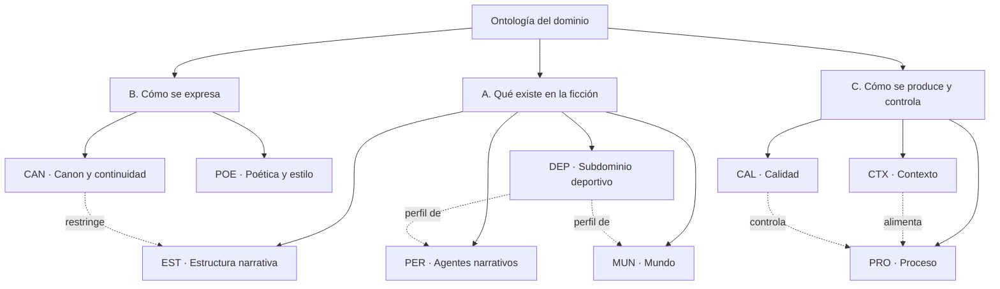

El subdominio deportivo es un **perfil sustituible**: cambiarlo por otro género no obliga a rehacer el resto.

---

## 2. Árbol estructural de la obra

Descomposición del texto, de universo a beat.

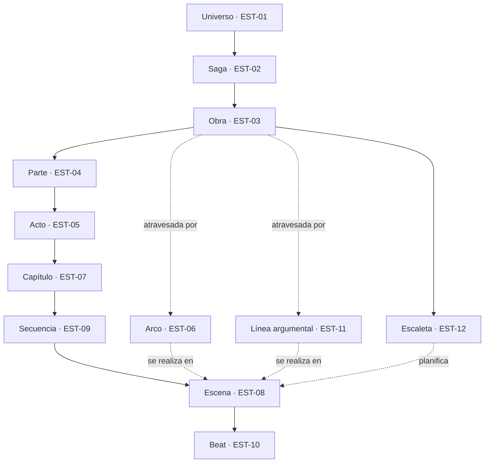

Punto clave del diagrama: **arcos y líneas no son contenedores, son trayectorias transversales**. Modelarlos como jerarquía es el primer error de diseño habitual.

---

## 3. Modelo relacional del núcleo

Cardinalidades entre las entidades que sí se persisten.

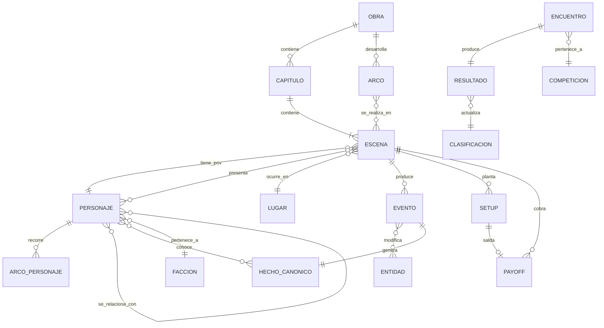

La relación `PERSONAJE }o--o{ HECHO_CANONICO : conoce` (PER-10) es la que más incoherencias previene y la que casi nadie modela.

---

## 4. Anatomía de la escena

Unidad mínima que el sistema genera y evalúa.

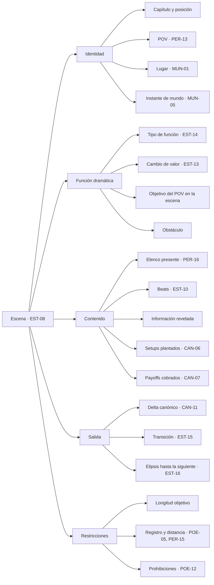

Una escena bien especificada así es generable sin ambigüedad y evaluable sin lectura completa del capítulo.

---

## 5. Árbol de personaje

```mermaid
graph TD
  PER["Personaje · PER-01"]

  PER --> IDT["Identidad"]
  IDT --> ID1["Nombre canónico y alias"]
  IDT --> ID2["Datos biográficos"]
  IDT --> ID3["Rasgos físicos estables"]

  PER --> PSI["Motor interno"]
  PSI --> P1["Deseo · PER-03"]
  PSI --> P2["Necesidad · PER-04"]
  PSI --> P3["Herida · PER-05"]
  PSI --> P4["Creencia limitante"]
  PSI --> P5["Valores y línea roja"]

  PER --> ARQ["Arco · PER-06"]
  ARQ --> A1["Estado inicial"]
  ARQ --> A2["Grietas"]
  ARQ --> A3["Crisis"]
  ARQ --> A4["Decisión"]
  ARQ --> A5["Estado final"]

  PER --> VOZ["Voz · PER-07"]
  VOZ --> V1["Idiolecto · PER-08"]
  VOZ --> V2["Longitud y sintaxis típicas"]
  VOZ --> V3["Temas recurrentes"]
  VOZ --> V4["Lo que nunca dice"]

  PER --> EST2["Estado variable en t"]
  EST2 --> E1["Competencia · PER-09"]
  EST2 --> E2["Conocimiento · PER-10"]
  EST2 --> E3["Relaciones vigentes · PER-11"]
  EST2 --> E4["Ubicación y posesiones"]
  EST2 --> E5["Estado físico · DEP-13"]

  PER --> FUN2["Función"]
  FUN2 --> N1["Rol actancial por arco · PER-02"]
  FUN2 --> N2["Facción · PER-12"]
```

Nótese la separación entre **rasgos estables** e **estado variable en t**. Solo el segundo bloque necesita proyectarse por instante; el primero se cachea una vez.

---

## 6. Árbol del mundo

```mermaid
graph TD
  MUN["Mundo · MUN"]

  MUN --> ESP["Espacio"]
  ESP --> L1["Lugar · MUN-01"]
  ESP --> L2["Geografía relativa"]
  ESP --> L3["Textura sensorial · MUN-09"]

  MUN --> SOC["Sociedad"]
  SOC --> S1["Institución · MUN-03"]
  SOC --> S2["Facción · PER-12"]
  SOC --> S3["Normas sociales"]
  SOC --> S4["Opinión pública · DEP-16"]

  MUN --> REG["Reglas"]
  REG --> R1["Regla del mundo · MUN-04"]
  REG --> R2["Reglamento deportivo · DEP-02"]
  REG --> R3["Economía · DEP-17"]

  MUN --> TMP["Tiempo"]
  TMP --> T1["Cronología · MUN-05"]
  TMP --> T2["Eventos históricos · MUN-07"]
  TMP --> T3["Calendario competitivo · DEP-05"]

  MUN --> MAT["Materia"]
  MAT --> M1["Objeto significante · MUN-02"]
  MAT --> M2["Léxico del mundo · MUN-08"]
```

---

## 7. Árbol del subdominio deportivo

```mermaid
graph TD
  DEP["Épica deportiva · DEP"]

  DEP --> MAR["Marco competitivo"]
  MAR --> C1["Disciplina · DEP-01"]
  MAR --> C2["Reglamento · DEP-02"]
  MAR --> C3["Competición · DEP-03"]
  MAR --> C4["Temporada · DEP-04"]
  MAR --> C5["Jornada · DEP-05"]

  DEP --> ENC["Encuentro · DEP-06"]
  ENC --> E1["Previa y presión"]
  ENC --> E2["Planteamiento táctico · DEP-11"]
  ENC --> E3["Desarrollo y giro"]
  ENC --> E4["Momento cumbre · DEP-18"]
  ENC --> E5["Resultado · DEP-07"]
  ENC --> E6["Consecuencias y vestuario"]

  DEP --> ACT2["Actores"]
  ACT2 --> A1["Plantilla · DEP-09"]
  ACT2 --> A2["Cuerpo técnico · DEP-10"]
  ACT2 --> A3["Rival · DEP-15"]
  ACT2 --> A4["Afición y prensa · DEP-16"]
  ACT2 --> A5["Entorno personal"]

  DEP --> CUE["Cuerpo y límite"]
  CUE --> B1["Estado físico · DEP-13"]
  CUE --> B2["Lesión · DEP-14"]
  CUE --> B3["Edad deportiva"]
  CUE --> B4["Competencia técnica · PER-09"]

  DEP --> NUM["Estado derivado"]
  NUM --> D1["Clasificación · DEP-08"]
  NUM --> D2["Estadística · DEP-12"]

  DEP --> DOB["Doble arco · DEP-20"]
  DOB --> G1["Arco competitivo: ¿gana?"]
  DOB --> G2["Arco interno: ¿cambia?"]
```

Los nodos de **estado derivado** nunca se narran de memoria: se calculan y se inyectan como dato.

---

## 8. Cronología y estado

Cómo se pasa de eventos a "qué es verdad ahora".

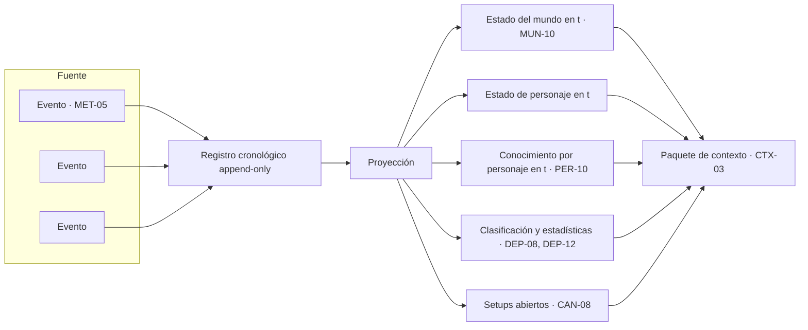

Principio: **los eventos son la verdad, el estado es una vista**. Permite reconstruir el mundo en cualquier punto sin ambigüedad, que es justo lo que hace falta para escribir analepsis sin romper nada.

---

## 9. Árbol de poética y estilo

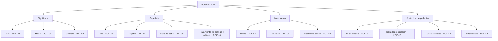

La rama de control de degradación no existe en la teoría literaria clásica. Es propia de la generación automática y hay que modelarla explícitamente o el estilo se aplana hacia el capítulo 15.

---

## 10. Árbol de canon y continuidad

```mermaid
graph TD
  CAN["Canon · CAN-01"]

  CAN --> HEC["Hechos"]
  HEC --> H1["Hecho canónico · CAN-02"]
  HEC --> H2["Procedencia · MET-09"]
  HEC --> H3["Vigencia · MET-07"]

  CAN --> BIB["Biblia de la obra · CAN-03"]
  BIB --> B1["Fichas de personaje"]
  BIB --> B2["Fichas de mundo"]
  BIB --> B3["Guía de estilo"]
  BIB --> B4["Escaleta"]
  BIB --> B5["Reglamento del subdominio"]

  CAN --> INT["Integridad"]
  INT --> I1["Continuidad · CAN-04"]
  INT --> I2["Contradicción · CAN-05"]
  INT --> I3["Retcon controlado · CAN-10"]

  CAN --> PRM["Promesas"]
  PRM --> P1["Setup · CAN-06"]
  PRM --> P2["Prefiguración · CAN-09"]
  PRM --> P3["Payoff · CAN-07"]
  PRM --> P4["Deuda narrativa · CAN-08"]

  CAN --> EVO["Evolución"]
  EVO --> V1["Delta canónico · CAN-11"]
  EVO --> V2["Congelación · CAN-12"]

  I2 --> T1["De hecho"]
  I2 --> T2["Temporal"]
  I2 --> T3["De conocimiento"]
  I2 --> T4["De capacidad"]
  I2 --> T5["De estado físico"]
  I2 --> T6["De nombre o léxico"]
```

---

## 11. Ciclo setup → payoff

La deuda narrativa como máquina de estados.

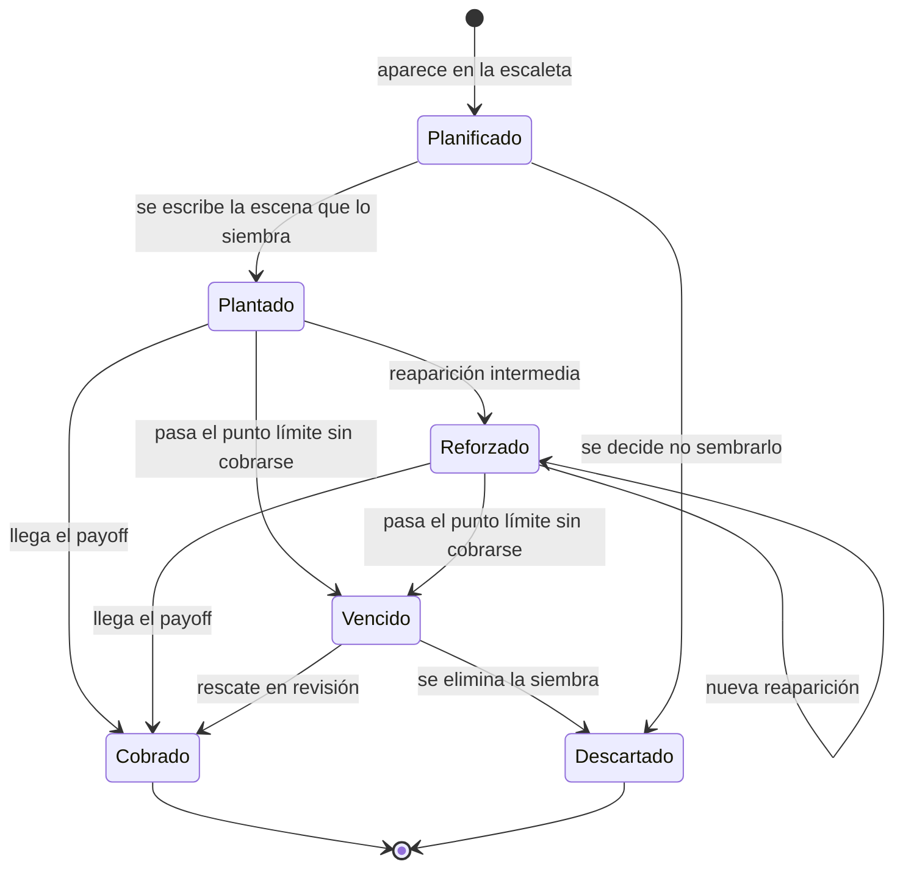

Todo setup en estado `Plantado`, `Reforzado` o `Vencido` al llegar al desenlace es deuda narrativa pendiente (CAN-08).

---

## 12. Árbol de contexto

Dos techos de 100.000 tokens que no son el mismo: la ventana física de una llamada (CTX-01) y el techo de concurrencia del sistema (CTX-20), que suma todo lo que está en vuelo a la vez. Dentro de una llamada, la ocupación operativa (CTX-18) que se permite usar es aún menor: el límite útil lo marca la atención del modelo, no el del proveedor.

```mermaid
graph TD
  CTX["Ingeniería de contexto · CTX-04"]

  CTX --> LIM["Límites"]
  LIM --> L1["Ventana física: 100.000 tokens · CTX-01"]
  LIM --> L2["Presupuesto · CTX-02"]
  LIM --> L3["Ocupación operativa · CTX-18"]
  LIM --> L4["Desbordamiento y compactación · CTX-19"]
  LIM --> L5["Sesgo de recencia · CTX-16"]
  LIM --> L6["Techo de concurrencia · CTX-20"]

  CTX --> FUE["Fuentes de material"]
  FUE --> F1["Canon estructurado · CAN-03"]
  FUE --> F2["Estado en t · MUN-10"]
  FUE --> F3["Resumen jerárquico · CTX-06"]
  FUE --> F4["Ventana literal reciente · CTX-07"]
  FUE --> F5["Recuperación híbrida · CTX-09"]

  CTX --> TRA["Transformaciones"]
  TRA --> T1["Ficha compacta · CTX-05"]
  TRA --> T2["Compactación · CTX-10"]
  TRA --> T3["Aislamiento · CTX-11"]
  TRA --> T4["Anclas · CTX-17"]

  CTX --> PAT["Patologías"]
  PAT --> D1["Deriva · CTX-12"]
  PAT --> D2["Envenenamiento · CTX-13"]
  PAT --> D3["Distracción · CTX-14"]
  PAT --> D4["Conflicto · CTX-15"]
```

---

## 13. Composición del paquete de contexto

Qué entra en la llamada que escribe una escena, y en qué orden.

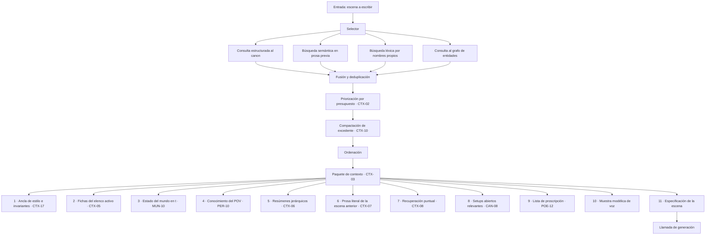

Los once bloques y su orden son los de [`architecture.md`](architecture.md) §4.3, que es donde viven sus presupuestos en tokens. La especificación de la escena va **al final** por CTX-16. Las anclas van al principio porque deben sobrevivir a la compactación.

---

## 14. Árbol de calidad

```mermaid
graph TD
  CAL["Calidad · CAL"]

  CAL --> DIM["Dimensiones · CAL-01"]
  DIM --> X1["Continuidad factual y temporal"]
  DIM --> X2["Caracterización y voz"]
  DIM --> X3["Integridad estructural"]
  DIM --> X4["Tensión, ritmo y densidad"]
  DIM --> X5["Fidelidad de estilo"]
  DIM --> X6["Verosimilitud deportiva · DEP-19"]
  DIM --> X7["No redundancia"]
  DIM --> X8["Diálogo y subtexto"]
  DIM --> X9["Resonancia temática"]
  DIM --> X10["Cumplimiento del brief"]

  CAL --> MEC["Mecanismos"]
  MEC --> M1["Verificador determinista · CAL-03"]
  MEC --> M2["Juez LLM con rúbrica · CAL-04"]
  MEC --> M3["Conjunto dorado y jurado · CAL-10, CAL-11"]

  CAL --> GOB["Gobierno"]
  GOB --> G1["Rúbrica · CAL-02"]
  GOB --> G2["Umbral · CAL-09"]
  GOB --> G3["Puerta de calidad · CAL-07"]

  CAL --> REM["Remediación"]
  REM --> R1["Defecto y severidad · CAL-05, CAL-06"]
  REM --> R2["Regeneración dirigida · CAL-08"]
  REM --> R3["Arbitraje y replanificación · PRO-10, PRO-12"]
  REM --> R4["Cuarentena al agotar reintentos · CAL-12, CAL-13"]

  X1 --> M1
  X6 --> M1
  X7 --> M1
  X10 --> M1
  X4 --> M2
  X8 --> M2
  X9 --> M2
  X2 --> M1
  X2 --> M2
```

---

## 15. Ciclo de vida de un capítulo

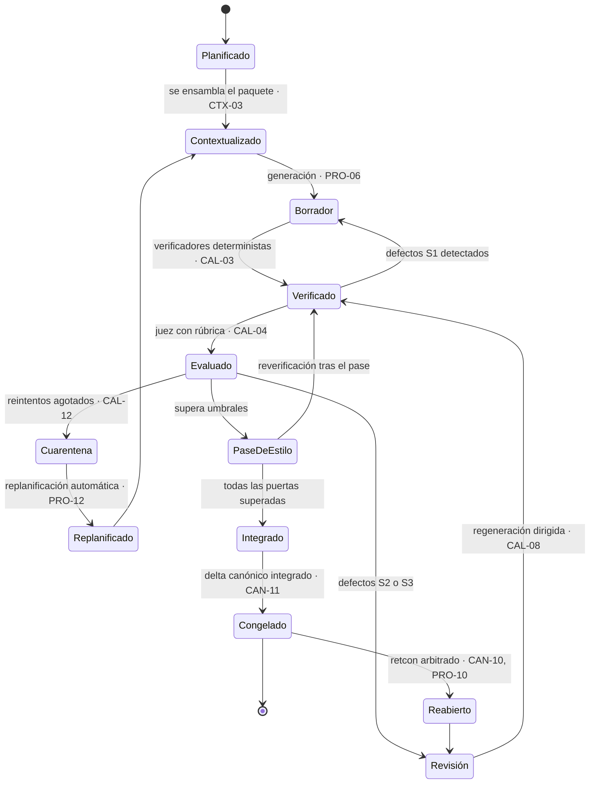

El paso `Integrado → Congelado` es el único que modifica el canon. Todo lo anterior trabaja sobre material provisional.

---

## 16. Mapa de modos de fallo

Qué se rompe, por qué y dónde se ataca.

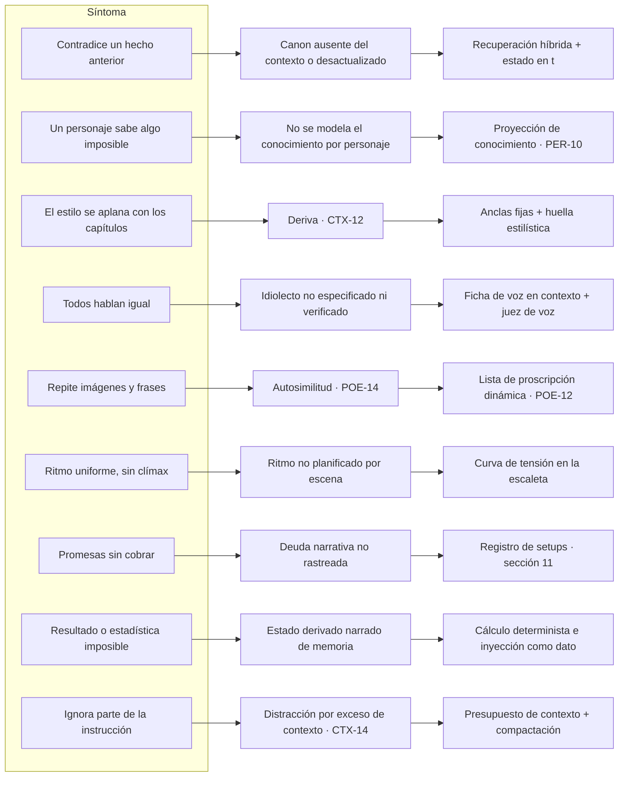

Cada solución de la columna derecha corresponde a un componente concreto en [`architecture.md`](architecture.md) y a un método de verificación con ID en [`verification.md`](verification.md).
