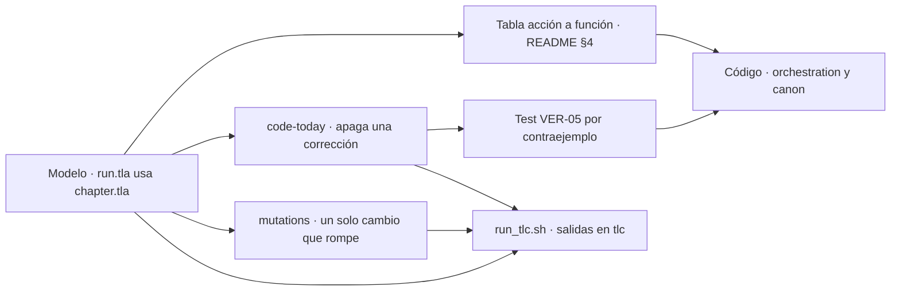

# 02 · Trade-offs

> Documentación de proceso · ver [`README.md`](README.md) para el índice de esta carpeta y [`../../AGENTS.md`](../../AGENTS.md) para el del repositorio.
> Relacionados: [definitions](../definitions.md) · [domain-knowledge](../domain-knowledge.md) · [architecture](../architecture.md) · [verification](../verification.md)
> Hermanos: [01-spec-inicial](01-spec-inicial.md) · [03-explainers](03-explainers.md) · [04-diagramas](04-diagramas.md) · [05-iteraciones](05-iteraciones.md) · [06-red-team](06-red-team.md)

Cada decisión de diseño relevante, contada como decisión: qué opciones había, con qué criterios se eligió, qué se eligió y qué coste se aceptó a cambio. No sustituye a las tablas «Decisiones tomadas» de `specs/`: las agrupa por tema y cuenta el razonamiento que las une.

**Las anclas `TO-1`, `TO-2`… son locales a este documento.** Sirven para enlazar desde los documentos hermanos. No son IDs del glosario ni de ninguna spec, y no se citan fuera de `docs/process/`.

**Cómo se lee cada opción.** Cuando el repositorio registra la alternativa descartada, se cita con su fuente. Cuando no la registra pero el documento explica por qué no, la alternativa obvia se marca como *alternativa implícita*. No hay opciones inventadas.

Las rutas de `specs/` y `backend/` son relativas a esta carpeta: `../../specs/`, `../../backend/`.

---

## Resumen

| Ancla | Decisión | Elección |
|---|---|---|
| [TO-1](#to-1--un-agente-o-trece) | Un agente o varios | Trece agentes con misión y criterio de salida; dos son código |
| [TO-2](#to-2--formato-de-la-story-bible) | Formato de la story bible | Canon estructurado en SQLite, cinco almacenes, registro de eventos append-only |
| [TO-3](#to-3--el-modelo-de-lectura) | Quién lee, recupera y juzga | Recuperación sin modelo con FTS5 y `multilingual-e5-large` local; Haiku 4.5 para los once agentes de modelo |
| [TO-4](#to-4--tla-atado-al-flujo-real) | Cómo se ata TLA+ al código | Dos módulos, tabla acción ↔ función, contraejemplos del código anterior y mutaciones |
| [TO-5](#to-5--qué-invariantes-demuestra-lean) | Qué demuestra Lean | Cuatro invariantes de la cronología, antes de congelar |
| [TO-6](#to-6--sqlite-con-un-fichero-por-novela) | Persistencia | SQLite local, un fichero por novela, vectores sin extensión |
| [TO-7](#to-7--determinista-antes-que-modelo) | Código o modelo | Determinista antes que modelo |
| [TO-8](#to-8--el-cli-de-claude-code-como-proveedor) | Transporte al modelo | CLI de Claude Code con suscripción, aislado y sin razonamiento |
| [TO-9](#to-9--presupuesto-de-contexto) | Presupuesto de contexto | Techo propio de 100.000; paquete a 85.000 más 15.000 de reintento |
| [TO-10](#to-10--organización-por-funcionalidad) | Organización del código | Por funcionalidad, sin FSD, tres pisos de imports |
| [TO-11](#to-11--langfuse-como-espejo) | Observabilidad | JSONL local como fuente; Langfuse como espejo |
| [TO-12](#to-12--el-jurado) | Juicio subjetivo | Tres jueces, nueve dimensiones, mediana y dispersión |
| [TO-13](#to-13--guardarraíl-de-prohibidas) | Palabras prohibidas | Verificador propio S1, niveles y normalización sin modelo |
| [TO-14](#to-14--fallo-cerrado-y-cuarentena) | Qué hacer cuando algo falla | Fallo cerrado; cuarentena y replanificación, nunca parar a preguntar |
| [TO-15](#to-15--retcon-y-enmiendas) | Cambiar lo ya congelado | Retcon con regla de 3 pasajes; enmienda al brief sin ella |
| [TO-16](#to-16--web-o-pdf) | Forma de entrega | Web |
| [TO-17](#to-17--perfiles-de-extensión-y-modo-permisivo) | Obras cortas para probar | Perfiles `prueba`, `breve` y `corta`, estrictos como `novela` |
| [TO-18](#to-18--un-proceso-un-bucle) | Ejecución del Orquestador | Un proceso, un bucle síncrono, reanudación por escena |

---

## TO-1 · Un agente o trece

| Opción | Qué da | Por qué no, o por qué sí |
|---|---|---|
| Un solo agente que planifica, escribe y se revisa · *alternativa implícita* | Menos piezas y menos llamadas | El contexto que generó un texto lo juzgaría. Y un único paquete tendría que llevar a la vez escaleta, canon, prosa y rúbricas |
| Pocos agentes genéricos · *alternativa implícita* | Menos catálogo | Se pierden justo los tres que «suelen faltar en implementaciones ingenuas»: Archivero, Árbitro y Supervisor |
| **Trece agentes con misión, skills y criterio de salida propios** | Aislamiento entre escribir y evaluar; un presupuesto de contexto por rol; un dueño por decisión | Elegida |

**Criterios.** Que toda decisión tenga dueño, porque no hay persona a quien preguntar ([architecture §1](../architecture.md), principio 8). Que escritura y evaluación se aíslen: «el contexto que generó un texto no lo juzga» (principio 5). Que cada paquete quepa en su presupuesto ([architecture §4.2](../architecture.md)). Y que la verificación entre modelos no dé confianza falsa: [VER-14](../verification.md) exige aislamiento y evidencia.

**Elección.** El catálogo de [architecture §6](../architecture.md). Dos de los trece no son modelo: el Orquestador y el Documentalista son código. Los once restantes consumen ventana. Sin Archivero el canon se queda atrás respecto al texto; sin Árbitro un conflicto detiene el sistema; sin Supervisor la novela pierde forma en el segundo acto sin que nada lo señale.

Tres límites al crecimiento del catálogo:

- **La entrevista no es un agente 14º** ([D-49](../../specs/srs-frontend-v1.md)). Ocurre antes del ciclo y no tiene misión ni criterio de salida dentro de él. Un agente nuevo obligaría a tocar catálogo, matriz agente × skill y flujos para algo que no participa en ninguno.
- **Los roles de la traza no son agentes** (`interviewer`, `planner`, `writer`, `editor`, `canon`, `supervisor`, en [architecture §11](../architecture.md)). Son etiquetas que agrupan los de §6.
- **No hay debate entre agentes.** El Árbitro decide por la regla de precedencia [PRO-10](../definitions.md), «más barato y más reproducible que un debate» ([VER-14](../verification.md)).

**Coste aceptado.** Más llamadas por capítulo y un contrato de entrada y salida por agente ([architecture §6.2](../architecture.md)). Y el límite que [VER-14](../verification.md) declara: el verificador es otro modelo y comparte modos de fallo con el generador. Detecta lo que el generador hizo mal, no lo que los dos entienden mal igual.

**Fuente.** [architecture §1, §6, §6.2](../architecture.md); [verification §5.6](../verification.md); [D-03, D-04](../../specs/srs-backend-v1.md); [D-49](../../specs/srs-frontend-v1.md).

---

## TO-2 · Formato de la story bible

| Opción | Qué da | Por qué no, o por qué sí |
|---|---|---|
| La verdad en la prosa, releída en cada llamada · *alternativa implícita* | Nada que mantener aparte | «Cada llamada obliga a releerlo todo y la coherencia se degrada» ([architecture §1](../architecture.md), principio 1). Y no cabe en 100.000 tokens |
| Un documento libre, Markdown o JSON · *alternativa implícita* | Fácil de leer y de escribir por un modelo | No responde «qué era cierto en el capítulo 12» sin ambigüedad. No se puede validar un delta contra él. No tiene procedencia por hecho |
| Un único índice vectorial con todo dentro | Una sola consulta | «El error estructural más frecuente en este tipo de sistema» ([architecture §3.1](../architecture.md)). Buscar por similitud lo que se puede pedir por clave es gastar presupuesto en algo peor |
| **Canon estructurado en cinco almacenes, derivado de un registro de eventos** | Estado en cualquier instante, validación antes de escribir, procedencia y proyecciones reconstruibles | Elegida |

**Criterios.** El canon es la fuente de verdad ([AGENTS §5.3](../../AGENTS.md), restricción 3). El estado se deriva de eventos (principio 2). Ningún capítulo se cierra sin integrar su delta canónico, [CAN-11](../definitions.md) (principio 7). Y el envenenamiento de canon, [CTX-13](../definitions.md), es el fallo más caro porque se propaga.

**Elección.** Cinco almacenes con separación lógica y no física, todos en el mismo SQLite ([architecture §3.1](../architecture.md)):

| Almacén | Forma | Qué resuelve |
|---|---|---|
| Canon estructurado | Tablas con columna de versión | La ficha de una entidad |
| Registro de eventos | Append-only, `(instante, desempate)` único ([D-07, D-34](../../specs/srs-backend-v1.md)) | Qué sabía alguien en un instante |
| Grafo de entidades | Aristas con vigencia, CTE recursivo ([D-15](../../specs/srs-backend-v1.md)) | Quién tiene conflicto abierto con quién |
| Índice de prosa | FTS5 más tabla de vectores, en dos niveles: escena y fragmento | Cómo se describió algo la primera vez |
| Resúmenes jerárquicos | Nivel y referencia al padre | Resumen de un arco o de la obra |

El registro manda: canon estructurado y grafo son proyecciones reconstruibles. Todo entra por el registro, también la guía de estilo, la escaleta y el reglamento ([D-08](../../specs/srs-backend-v1.md)). El delta se propone y se valida, nunca se aplica en bruto, y la congelación es la única operación que cambia el canon ([architecture §10](../architecture.md)). Hecho × escena y la cronología son piezas derivadas que no guardan verdad propia ([D-89](../../specs/srs-backend-v4.md)).

**Coste aceptado.** Un Archivero que extrae el delta y un Árbitro que lo arbitra en cada capítulo. Un esquema que migrar. Y la verdad que no se expresa como hecho del canon no la ve ningún verificador.

**Fuente.** [architecture §1, §3.1, §10](../architecture.md); [D-07, D-08, D-15, D-30, D-34](../../specs/srs-backend-v1.md); [D-89](../../specs/srs-backend-v4.md).

---

## TO-3 · El modelo de lectura

En el repositorio «lectura» tiene tres sentidos, y cada uno tiene su decisión: el **camino de lectura** que ensambla el paquete ([architecture §4.4](../architecture.md)), el **modelo que escribe y juzga** detrás de los agentes ([architecture §4.8](../architecture.md)) y el **lector del examen** sin contexto ([VER-20](../verification.md)).

### Recuperar: sin modelo, con cuatro piernas

| Opción | Por qué no, o por qué sí |
|---|---|
| Un modelo que expande la consulta · *alternativa implícita* | «Un modelo expandiendo "el Chino" a "el asiático" introduce ruido»; la tabla de alias ya es canon |
| Solo búsqueda semántica | [CTX-09](../definitions.md): los nombres propios fallan en semántica |
| Solo búsqueda léxica | No encuentra la escena espejo que no comparte ni una palabra |
| Fusión por puntuación normalizada | BM25 y coseno son escalas incomparables, y normalizarlas exige una calibración que cambia en cada capítulo |
| **Consulta desde la especificación de escena; canon y grafo aparte; fusión recíproca de rangos; selección por cupos** | Elegida |

**Criterios.** Determinismo: el mismo canon da el mismo paquete. Ninguna llamada de modelo en el camino de lectura. Diversidad garantizada por construcción. Degradación sin caso especial si una pierna vuelve vacía.

**Elección.** El Documentalista es código. La especificación de escena ya es la consulta. Canon y grafo producen hechos que no compiten con los fragmentos: «fusionar fichas de canon con fragmentos de prosa sería comparar cosas que no se comparan». Las piernas léxica y semántica se fusionan por rangos con constante 60, marcada como propuesta ([architecture §13](../architecture.md), decisión abierta 10). El bloque 7 se llena por cupos de lugar, voz, promesa, espejo y libre, y cada fragmento lleva su motivo. Un fragmento que no cabe se sustituye por el resumen de su escena, nunca se corta ([D-18](../../specs/srs-backend-v1.md)). El Continuista recupera por afirmaciones, sin cupos y con la léxica al frente ([D-17](../../specs/srs-backend-v1.md)).

### Embeddings: local y de recuperación

| Modelo | Dim | Tamaño | Entrenado para |
|---|---:|---:|---|
| `paraphrase-multilingual-MiniLM-L6-v2` | 384 | 0,22 GB | Similitud entre frases |
| `paraphrase-multilingual-mpnet-base-v2` | 768 | 1,00 GB | Similitud entre frases |
| **`intfloat/multilingual-e5-large`** | 1024 | 2,24 GB | **Recuperación** |
| Un modelo inglés, como `BAAI/bge-small-en-v1.5` | — | — | Descartado: la novela es en español y la pierna semántica devolvería ruido |
| Un servicio remoto de embeddings | — | — | Descartado por [D-22](../../specs/srs-backend-v1.md): era el único modo de fallo intermitente del ciclo |

**Criterios.** Multilingüe, «y esto no es negociable». Entrenado para recuperación asimétrica: consulta corta y estructurada contra fragmentos largos y narrativos. Determinista. Sin red en el camino crítico.

**Elección.** `intfloat/multilingual-e5-large` servido en proceso por `fastembed` ([D-22, D-29](../../specs/srs-backend-v1.md)), con los prefijos `query: ` y `passage: ` que exige E5. Se elige por para qué fue entrenado, no por tamaño. Los vectores se calculan al congelar, desde la versión 1, para que el afinado no reindexe la novela entera ([D-13](../../specs/srs-backend-v1.md)). Cada vector guarda modelo y dimensión, así que cambiar de modelo es reindexar, no rediseñar.

**Coste aceptado.** 2,24 GB dentro de la imagen, pagados una vez. Si la imagen llegara a ser demasiado grande, la salida declarada es `paraphrase-multilingual-mpnet-base-v2`, perdiendo el entrenamiento para recuperación. Y un fallo silencioso que ninguna puerta ve: sin prefijos, E5 carga, devuelve vectores de la dimensión correcta y recupera peor.

### Escribir y juzgar: un solo modelo para los once

**Elección.** Claude Haiku 4.5 para los once agentes de modelo, por el CLI de Claude Code ([D-23](../../specs/srs-backend-v1.md); cierra la decisión abierta 8 de [architecture §13](../architecture.md)). Es una decisión de coste del autor. El puerto conserva la posibilidad de modelos distintos por rol ([RI-21](../../specs/srs-backend-v1.md)); hoy no se usa.

**Coste aceptado.** Ventana de 200.000 en vez de 1.000.000. Un mínimo cacheable de 4.096 tokens, que obligó a hacer crecer el ancla de 2.000 a 4.500 y a subir 2.500 cada presupuesto con ancla ([D-24, D-25](../../specs/srs-backend-v1.md)). Un factor de contador calibrado al arrancar, porque el colchón baja de 900.000 a 50.000 ([D-28](../../specs/srs-backend-v1.md)).

### El lector del examen

`quiz.answer` lee el capítulo **sin nada más delante**: sin prefijo cacheable, sin canon, sin fichas y sin rúbrica ([RF-114](../../specs/srs-backend-v1.md), [VER-20](../verification.md)). La alternativa, un lector con el prefijo compartido, se descarta de forma explícita: «un lector que ve el canon examina lo que ya sabía». Las preguntas salen de la especificación de escena y no del delta, porque preguntar por lo que el capítulo dijo es circular y aprueba siempre. El coste aceptado es su límite: mide que la información llegue, no que llegue bien contada.

**Fuente.** [architecture §3.1, §4.4, §4.8, §13](../architecture.md); [verification §5.12](../verification.md); [D-12, D-13, D-17, D-18, D-22 a D-25, D-28, D-29](../../specs/srs-backend-v1.md).

---

## TO-4 · TLA+ atado al flujo real

| Opción | Por qué no, o por qué sí |
|---|---|
| Solo tests del Orquestador ([VER-05](../verification.md)) | Prueban caminos concretos; no recorren todas las intercalaciones de caída, reanudación y enmienda |
| `Alloy` sobre el diseño | [verification §4.4](../verification.md) lo nombra junto a TLA+; el repositorio usa TLA+ con TLC |
| Un modelo de la tirada escrito de cero · *alternativa implícita* | [D-98](../../specs/srs-backend-v4.md) lo descarta en la práctica: se conserva el modelo de capítulo ya comprobado |
| **`chapter.tla` para un capítulo y `run.tla` para la tirada, que lo usa con `INSTANCE`** | Elegida |

**Criterios.** Que el modelo describa lo que hace el código y no lo que debería hacer. Que cada invariante lo rompa alguna mutación, porque un invariante que nada rompe es sospechoso de vacuidad ([VER-18](../verification.md)). Que TLC acabe en tiempo razonable. Que la salida se guarde para poder leerla sin volver a ejecutar.

**Elección.** La atadura tiene cinco piezas, en [`backend/orchestration/model/`](../../backend/orchestration/model/README.md):

| Pieza | Qué ata |
|---|---|
| Tabla acción ↔ código | Cada acción de TLA+ con su `fichero:función` y el test VER-05 del mismo camino. Se cita por función para sobrevivir a los cambios de línea |
| Banderas de corrección | `run.tla` lleva como banderas las cuatro correcciones que destapó TLC, B1 a B4. `run.cfg` las activa, que es lo que hace el código |
| `code-today/*.cfg` | Cada fichero apaga una bandera y conserva el contraejemplo del código anterior al arreglo, con el test que lo reproduce |
| `mutations/m1` a `m4` | Copias de `run.tla` con un cambio marcado `MUTACION` que rompe a propósito un invariante o la vivacidad |
| `run_tlc.sh` | Ejecuta todo, guarda cada salida en `tlc/` con cabecera y falla cerrado si algo no da lo esperado |

La caída se acota y no lleva equidad: con equidad sobre ella, una caída infinita rompería la terminación sin ser un fallo del sistema ([D-98](../../specs/srs-backend-v4.md)). Las constantes de tamaño son del modelo, no del sistema; los reintentos sí salen de [RF-18](../../specs/srs-backend-v1.md) y de `retries.py`.

**Coste aceptado.** Prueba el flujo modelado, no el orquestador: esa distancia la cubre VER-05. El modelo no representa la prosa ni la escaleta, la segunda ronda del Jurado, la deriva de estilo ni el conjunto dorado. Las diferencias conocidas con el código están declaradas con su riesgo en el §6 del README. Y el espacio de estados obligó a reducirlo: la primera versión crecía unas 26 veces por capítulo, y con 5 capítulos no terminaba en diez minutos.

**Fuente.** [verification §5.10](../verification.md); [D-98](../../specs/srs-backend-v4.md); [`backend/orchestration/model/README.md`](../../backend/orchestration/model/README.md) §3, §4, §6 y §7; [`backend/PLAN.md`](../../backend/PLAN.md) T38.

---

## TO-5 · Qué invariantes demuestra Lean

| Opción | Por qué no, o por qué sí |
|---|---|
| Solo los verificadores de texto, como `check.timeline` | Leen fechas explícitas en la prosa; no cruzan presencia con vigencia de atributos. [CASOS.md](../../backend/evals/formal/CASOS.md) muestra uno que pasan y Lean refuta |
| Lean al final de la obra | Descartado en [D-88](../../specs/srs-backend-v4.md): encontraría la violación en capítulos que nadie puede reabrir, porque el canon congelado gana |
| `decide` a secas | Descartado en [D-103](../../specs/srs-backend-v4.md): 150 escenas y 750 presencias agotan `maxRecDepth` en el elaborador |
| Inventar la fecha de nacimiento que falta · *alternativa implícita* | [D-87](../../specs/srs-backend-v4.md): «derivar sin marcarlo sería inventar» |
| **Cuatro invariantes de la cronología, `decide +kernel`, antes de cada congelación, retcon y enmienda** | Elegida |

**Criterios.** La cronología es el único canon cuya coherencia se puede **demostrar** para todos los hechos a la vez, no solo muestrear ([verification §4.4](../verification.md)). El fallo tiene que tener a quién volver. No perder garantía al escalar. Y fallo cerrado: un hecho que no se exporta cuenta como fallo.

**Elección.** Un generador en `backend/verification/formal/`, función pura de la lectura del canon más lo pendiente ([D-87](../../specs/srs-backend-v4.md)), que escribe un teorema por invariante sobre `StoryMaker/Invariants.lean` ([RF-244](../../specs/srs-backend-v4.md)):

| Invariante | Qué dice | Por qué así |
|---|---|---|
| I1 | Nadie está presente antes de su primera fecha de nacimiento posible, y la edad es compatible con el nacimiento | Intervalos que se solapan: exigir que uno contenga al otro daría falsos S1 entre edades de instantes distintos |
| I2 | Nadie está en dos lugares en el mismo instante | Minutos más desempate: comparar solo minutos daría falso S1 con dos escenas del mismo día sin hora |
| I3 | Ninguna vigencia de `attribute`, `entity_alias`, `competence` o `relation` termina antes de empezar ni empieza antes que su entidad | `knowledge` queda fuera porque no tiene fin de vigencia |
| I4 | Nadie está presente después de quedar excluido | `excluded` excluye desde después de su instante: estar en la escena de la muerte vale |

Cada invariante tiene función booleana, especificación proposicional y el lema que las une. Sin el lema, un `decide` verde probaría que una función devuelve `true`, no que la historia cumple la invariante. Con `+kernel` la decisión la comprueba el núcleo, «que es la parte de Lean en la que se confía» ([D-103](../../specs/srs-backend-v4.md)). La fecha de nacimiento sale de `birth_date`; si falta, se deriva de `age` como intervalo de un año y consta como derivada ([MET-09](../definitions.md)); si faltan las dos, se declara ausente.

Un fallo es un S1 `check.formal` que vuelve al Reparador, o rechaza la enmienda sin crear versión. `lake` se comprueba al arrancar y sin él la tirada no empieza. `gate.py` y CI compilan una fixture limpia, que tiene que pasar, y otra sembrada, que tiene que fallar en su teorema y no en otro sitio ([RF-246](../../specs/srs-backend-v4.md)).

**Coste aceptado.** Lean prueba los hechos exportados, no que la prosa los narre: esa distancia la cubren VER-05 y los verificadores de texto. Una dependencia más en la máquina, que para la tirada si falta. Y la evidencia empírica es una mutación declarada como tal: ninguna tirada real de T52 dio `formal.lean` fallido ([CASOS.md](../../backend/evals/formal/CASOS.md), caso 1, sobre I4).

**Fuente.** [verification §4.4](../verification.md); [architecture §9.1, §10](../architecture.md); [D-87, D-88, D-103, D-107, RF-244 a RF-246](../../specs/srs-backend-v4.md); [`backend/evals/formal/CASOS.md`](../../backend/evals/formal/CASOS.md).

---

## TO-6 · SQLite con un fichero por novela

| Opción | Por qué no, o por qué sí |
|---|---|
| Un servidor de base de datos · *alternativa implícita* | «Sin servidor no hay una pieza más que pueda fallar» en un ciclo que debe terminar sin que nadie intervenga |
| Una extensión vectorial o un índice aproximado | [D-12](../../specs/srs-backend-v1.md): con 200 a 400 escenas y 600 a 1.200 fragmentos por obra, el recorrido exhaustivo es exacto e inmediato; un índice aproximado solo añade error |
| **SQLite local, un fichero por novela, vectores en tabla y similitud en Python** | Elegida |

**Criterios.** Una novela es una unidad aislada: sin concurrencia entre tiradas y con un solo escritor de canon. Reproducibilidad: copiar el fichero es copiar el estado completo, para depurar, para el conjunto dorado ([CAL-10](../definitions.md)) y para los evals de [VER-10](../verification.md).

**Elección.** [AGENTS §3.2](../../AGENTS.md). Memoria de trabajo y canon comparten fichero por comodidad, con dos fábricas de escritura distintas ([D-30](../../specs/srs-backend-v1.md)). La lista global de prohibidas se copia al crear la novela para que el fichero siga siendo el estado completo ([D-91](../../specs/srs-backend-v4.md)). Las entrevistas, que aún no son novela, viven en un `_interviews.sqlite` común ([D-74](../../specs/srs-backend-v3.md)).

**Coste aceptado.** La similitud vectorial se escribe a mano. Si la obra creciera órdenes de magnitud, el recorrido exhaustivo dejaría de ser inmediato.

**Fuente.** [AGENTS §3.2](../../AGENTS.md); [architecture §3, §3.1](../architecture.md); [D-12, D-30](../../specs/srs-backend-v1.md); [D-74](../../specs/srs-backend-v3.md).

---

## TO-7 · Determinista antes que modelo

**Opciones.** Preguntar a un modelo lo que se puede comprobar con código, o reservar el modelo para lo subjetivo.

**Criterios.** Coste despreciable, cero falsos positivos si el verificador está bien escrito, reproducibilidad ([architecture §9.1](../architecture.md)). Y la restricción 4 de [AGENTS §5.3](../../AGENTS.md).

**Elección.** Fechas, marcadores, nombres, longitudes, repeticiones y prohibidas se comprueban con código, y siempre antes que cualquier juez. Consecuencias que se ven en el diseño:

- El Orquestador y el Documentalista son código (TO-1, TO-3).
- La entrevista pregunta por plantillas en orden fijo; el modelo solo extrae del texto libre ([D-73](../../specs/srs-backend-v3.md)). Qué falta y qué se contradice lo decide el backend con esquema, no el frontend ni un modelo ([D-51](../../specs/srs-frontend-v1.md)).
- El tope de salida es un guardarraíl en `dispatch`, no una herramienta: «un tope que el modelo decide si invoca no es un tope» ([D-20](../../specs/srs-backend-v1.md)).
- El examen lo dispara el Orquestador: «un examen que el examinado decide si se presenta no es un examen» ([VER-20](../verification.md)).
- Toda cita de un juez se ancla literal con `check.evidence` ([VER-19](../verification.md)).

**Coste aceptado.** Lo que no tiene verificador lo ve solo el Continuista: la duración de las elipsis y las estadísticas acumuladas constan como riesgo aceptado ([architecture §9.1](../architecture.md)). Y el criterio de gusto se pierde; se compensa con el conjunto dorado y la huella estilística ([architecture §8](../architecture.md)).

**Fuente.** [architecture §1, §5.3, §9.1](../architecture.md); [D-20](../../specs/srs-backend-v1.md); [D-73](../../specs/srs-backend-v3.md); [D-51](../../specs/srs-frontend-v1.md).

---

## TO-8 · El CLI de Claude Code como proveedor

| Opción | Por qué no, o por qué sí |
|---|---|
| API con clave | Quitaría el andamiaje, pero exige clave. El autor decidió por coste usar la suscripción ([D-23](../../specs/srs-backend-v1.md)) |
| `--bare` en el CLI | Exige clave de API ([RI-62](../../specs/srs-backend-v4.md)) |
| CLI con la configuración de quien lo ejecuta | Un plugin de observabilidad del usuario mandaría el brief a un servicio por una vía que nadie decidió ([D-85](../../specs/srs-backend-v4.md)) |
| Razonamiento por defecto | Medido: cada llamada del juez escribía de 7.000 a 13.000 tokens para un JSON de unos 1.500 ([D-133](../../specs/srs-backend-v4.md)) |
| **`claude -p` con suscripción, sin ajustes ni extensiones, sin `LANGFUSE_*` ni `OTEL_*`, con `MAX_THINKING_TOKENS=0`** | Elegida |

**Criterios.** Coste. Que ningún dato salga por una vía no decidida. Que la salida sea validable: el esquema viaja con `--json-schema` y `dispatch` revalida ([D-62](../../specs/srs-backend-v1.md)). Y que volver a la API sea cambiar la implementación del puerto, no tocar un agente ([RI-21](../../specs/srs-backend-v1.md)).

**Elección.** [architecture §4.8](../architecture.md). El bucle de herramientas se lleva por protocolo desde fuera ([D-46](../../specs/srs-backend-v1.md)). Sin razonamiento, porque «todo lo que un agente produce ya lo comprueba un verificador determinista o la regla de evidencia» ([D-133](../../specs/srs-backend-v4.md)).

**Coste aceptado.** 38.600 tokens de andamiaje por llamada, que no cuentan contra el techo del proyecto pero sí contra la ventana real: la llamada más cara suma 111.100 sobre 200.000 ([D-35](../../specs/srs-backend-v1.md)). La caché del prefijo lo abarata desde la segunda llamada.

**Fuente.** [architecture §4.8](../architecture.md); [D-23, D-35, D-46, D-62](../../specs/srs-backend-v1.md); [D-85, D-133, RI-62](../../specs/srs-backend-v4.md).

---

## TO-9 · Presupuesto de contexto

| Opción | Por qué no, o por qué sí |
|---|---|
| Usar la ventana que da el proveedor | «Tener 100.000 tokens no es motivo para usarlos»; la distracción ([CTX-14](../definitions.md)) aparece mucho antes de agotar la ventana |
| Truncar por el final al desbordar | Prohibido: se compacta por prioridad inversa ([CTX-19](../definitions.md)) |
| Admitir por lo que ocupa una llamada al empezar | Rompe el techo sin que salte nada: cuando se pasa, ya está en vuelo ([D-21](../../specs/srs-backend-v1.md)) |
| **Techo propio de 100.000 de entrada; paquete a 85.000 y 15.000 para el reintento; salida con red en 50.000** | Elegida |

**Criterios.** Calidad y coste por escena. Una restricción que se sostenga por su motivo: «una restricción etiquetada como física se salta en la primera implementación» ([architecture §4.1](../architecture.md)). Un reintento que no obligue a rehacer el paquete.

**Elección.** Empuje para todos y tirón además para cinco agentes, porque el Continuista investiga y es el primero que deja de caber ([D-19](../../specs/srs-backend-v1.md)). Admisión FIFO estricta contra [CTX-20](../definitions.md), con el cupo de tirón reservado entero ([architecture §7.4](../architecture.md)). Contador `tiktoken` local con factor de seguridad calibrado contra el `usage` real ([D-14](../../specs/srs-backend-v1.md)).

**Coste aceptado.** Jerarquía de resúmenes y recuperación selectiva en vez de «meterlo todo». Y un techo concurrente que hoy casi no muerde: sigue escrito como guardarraíl para cuando crezca el paralelismo.

**Fuente.** [AGENTS §5.3](../../AGENTS.md); [architecture §4.1, §4.2, §7.4](../architecture.md); [D-14, D-19, D-21](../../specs/srs-backend-v1.md).

---

## TO-10 · Organización por funcionalidad

| Opción | Por qué no, o por qué sí |
|---|---|
| Por capa técnica, con `models/`, `services/` y `routers/` | Obliga a tocar cinco carpetas para cambiar una cosa y deja invisible dónde empieza cada pieza |
| Feature-Sliced Design en el frontend | Excluido de forma explícita: nada de `app/`, `pages/`, `widgets/`, `features/`, `entities/` y `shared/` como capas |
| Una carpeta `api/` transversal | «Sería una capa técnica con otro nombre» ([D-01](../../specs/srs-backend-v1.md)) |
| **Una carpeta por funcionalidad y lo compartido en `commons/`** | Elegida |

**Criterios.** Cambio local y frontera visible. Que las reglas se puedan comprobar en CI y no queden en convención.

**Elección.** Tres reglas ([architecture §2.3](../architecture.md)): una funcionalidad no importa de otra; `orchestration/` arriba y `canon/` abajo, en lectura, como excepciones; y a `commons/` se entra por uso, no por previsión. El grafo de imports queda en tres pisos y lo comprueba un patrón de análisis estático ([VER-02](../verification.md)). Los evals viven en el piso de `orchestration/` porque medir la recuperación exige ejecutarla ([D-44](../../specs/srs-backend-v2.md)).

**Coste aceptado.** Casos que hay que decidir a mano, como dónde vive `setup.ledger` ([D-31](../../specs/srs-backend-v1.md)) o las skills de prosa ([D-16](../../specs/srs-backend-v1.md)).

**Fuente.** [architecture §2.3](../architecture.md); [D-01, D-16, D-31](../../specs/srs-backend-v1.md); [D-44](../../specs/srs-backend-v2.md); [D-68](../../specs/srs-frontend-v1.md).

---

## TO-11 · Langfuse como espejo

| Opción | Por qué no, o por qué sí |
|---|---|
| Langfuse como fuente de la traza · *alternativa implícita* | Metería la red en el camino crítico; el ciclo debe terminar aunque no haya red |
| Solo el fichero local | No da coste agregado, sesiones ni comparación de versiones de prompt |
| Leer los prompts desde Langfuse | Descartado: la tirada nunca lee el texto de un prompt de Langfuse ([D-108](../../specs/srs-backend-v4.md)) |
| **JSONL local por tirada como fuente; Langfuse como espejo, en vivo y por lote con una sola correspondencia** | Elegida |

**Criterios.** «La observabilidad observa, no gobierna» ([D-11](../../specs/srs-backend-v1.md)). Que todo lo que muestre Langfuse se pueda reconstruir desde el JSONL. Que el vivo y el lote no puedan divergir ([D-85](../../specs/srs-backend-v4.md)).

**Elección.** Un fallo al exportar se registra y la tirada sigue. La traza es también el audit log, con cadena de hashes y `verify_chain` ([D-92](../../specs/srs-backend-v4.md)). Por el mismo motivo, un Supervisor que no responde cuenta como sano y se traza como fallo de proceso: «un Supervisor que puede parar la tirada es un aprobador con otro nombre» ([D-45](../../specs/srs-backend-v2.md)).

**Coste aceptado.** Dos conductores que mantener, y un espejo que puede ir por detrás de la traza local.

**Fuente.** [architecture §11](../architecture.md); [D-11](../../specs/srs-backend-v1.md); [D-45](../../specs/srs-backend-v2.md); [D-85, D-86, D-92, D-106, D-108](../../specs/srs-backend-v4.md).

---

## TO-12 · El Jurado

| Opción | Por qué no, o por qué sí |
|---|---|
| Un solo juez | No mide dispersión ([CAL-11](../definitions.md)) |
| Promediar jueces que discrepan | «Produce un número sin significado» ([architecture §9.2](../architecture.md)) |
| Evaluar el capítulo por mitades | Rompe la dimensión de ritmo ([D-36](../../specs/srs-backend-v2.md)) |
| Una dimensión de continuidad que sustituya al Continuista | La factual sigue siendo del Continuista: los defectos anclados valen más que una nota ([D-94](../../specs/srs-backend-v4.md)) |
| **Tres instancias con semillas distintas, rúbrica de cinco niveles, mediana, dispersión inválida con rango ≥ 2, umbral 3, nueve dimensiones** | Elegida |

**Criterios.** Que cada criterio de la rúbrica de la entrega tenga su dimensión sin tirar las que calibra el conjunto dorado. Evidencia anclada o descarte. Aislamiento: el Jurado nunca ve la especificación ni el paquete del Escritor.

**Elección.** [D-37, D-39](../../specs/srs-backend-v2.md) y [D-94](../../specs/srs-backend-v4.md). Las nueve dimensiones son las cinco anteriores, con `voice` ampliada, más `continuity`, `tone`, `arc` y `personalization`. Sin destinatario no se juzga `personalization`; sin tono pedido, no `tone` ([D-114](../../specs/srs-backend-v4.md)). Una cita que no ancla vuelve al juez y consume intento ([D-71](../../specs/srs-backend-v2.md)).

**Coste aceptado.** Tres llamadas por capítulo, y la única concurrencia real del sistema: 39.600 tokens de entrada a la vez. Los jueces pueden derivar junto al generador; se vigila con el conjunto dorado cada 5 capítulos ([architecture §8](../architecture.md)).

**Fuente.** [architecture §9.2, §13](../architecture.md); [D-36, D-37, D-39, D-71](../../specs/srs-backend-v2.md); [D-94, D-114, D-142](../../specs/srs-backend-v4.md).

---

## TO-13 · Guardarraíl de prohibidas

| Opción | Por qué no, o por qué sí |
|---|---|
| Tratar la prohibida como S2 estético | Medido: una tirada congeló ocho fragmentos con la palabra dentro ([D-90](../../specs/srs-backend-v4.md)) |
| Búsqueda por subcadena | Hacía saltar «mar» en «Marcos» |
| Un modelo que decide si la palabra aparece · *alternativa implícita* | Lo resuelve la palabra completa con variantes, sin modelo |
| **`check.forbidden` propio, S1, por palabra normalizada con variantes, en cada intento y sobre el capítulo entero antes de congelar** | Elegida |

**Criterios.** Una prohibida del encargo contradice lo que se pidió, y el brief gana sobre el canon derivado ([PRO-10](../definitions.md)): es invariante duro. Sin falsos positivos por subcadena.

**Elección.** Normalización NFKD con `casefold` y sin marcas, en `canon/normalize.py`, con variantes `+s`, `+es`, `z`→`ces` y `o`↔`a` ([D-90, D-101](../../specs/srs-backend-v4.md)). Niveles `global`, `cliente` y `novela`, más `estilo` aparte para los n-gramas; un término repetido se queda en el más fuerte ([D-91](../../specs/srs-backend-v4.md)). Agotada la escalera, `RunAbortedError` con término y nivel.

**Coste aceptado.** La «ñ» se pliega y es riesgo aceptado ([D-101](../../specs/srs-backend-v4.md)). Las variantes no se componen: el femenino plural exigió añadir `violenta` y `macabra` a la lista ([D-99](../../specs/srs-backend-v4.md)).

**Fuente.** [architecture §3.1, §9.1](../architecture.md); [D-75](../../specs/srs-backend-v3.md); [D-90, D-91, D-99, D-101](../../specs/srs-backend-v4.md).

---

## TO-14 · Fallo cerrado y cuarentena

| Opción | Por qué no, o por qué sí |
|---|---|
| Parar y preguntar | No existe: no hay a quién ([architecture §8](../architecture.md)) |
| Saltar al capítulo siguiente | Fabrica una contradicción que ninguna puerta detecta ([D-26](../../specs/srs-backend-v1.md)) |
| Reintentar un fallo determinista | Si falla una vez, falla siempre: el modelo de embeddings y `lake` se comprueban al arrancar |
| **Fallo cerrado; escalera 3 · 2 · 1; cuarentena y replanificación** | Elegida |

**Criterios.** Una comprobación que no puede ejecutarse cuenta como fallida ([AGENTS §5.3](../../AGENTS.md), restricción 6). «El bloqueo se resuelve replanificando, no parando» (principio 9).

**Elección.** 3 intentos por escena, 2 por capítulo y 1 replanificación de tramo ([RF-18](../../specs/srs-backend-v1.md)). El capítulo cuarentenado se rehace de inmediato. Tres intentos por llamada, compartidos entre salida que no valida y proveedor que no responde ([D-70](../../specs/srs-backend-v2.md)).

**Coste aceptado.** La tirada puede acabar en `RunAbortedError` cuando la escalera se agota; eso es preferible a congelar algo que no pasó sus puertas (TO-17).

**Fuente.** [architecture §7.3, §8](../architecture.md); [D-26, RF-18](../../specs/srs-backend-v1.md); [D-70](../../specs/srs-backend-v2.md); [D-88](../../specs/srs-backend-v4.md).

---

## TO-15 · Retcon y enmiendas

| Opción | Por qué no, o por qué sí |
|---|---|
| El canon congelado gana siempre | Fue la regla de la versión 1 ([D-05](../../specs/srs-backend-v1.md)); el retcon exigía Estilista y Jurado |
| Retcon libre | El sistema taparía su propia incoherencia: es el vector de envenenamiento de canon |
| Editar el texto desde la lectura | Sería revisión humana del texto ([PRO-11](../definitions.md)) |
| **Retcon con regla dura: sin payoff cobrado y 3 pasajes o menos. Enmienda al brief sin esa regla** | Elegida |

**Criterios.** La regla de los 3 pasajes acota lo que el sistema se propone a sí mismo. Un cambio pedido por quien encarga tiene otra procedencia y otra amenaza ([D-48](../../specs/srs-frontend-v1.md)). La versión anterior se conserva entera ([PRO-08](../definitions.md)).

**Elección.** El retcon entra en la versión 2 con recongelación ([D-43](../../specs/srs-backend-v2.md)). La enmienda es un hecho con procedencia `brief`, se aplica una a la vez, entre congelaciones o con la obra cerrada, y cada una produce una versión ([D-52, D-53](../../specs/srs-frontend-v1.md); [D-77](../../specs/srs-backend-v3.md)). Un cambio de nombre es retroactivo ([D-76](../../specs/srs-backend-v3.md)). Si el sistema no la interpreta como una entidad y un atributo, se rechaza: nunca elige por quien pide.

**Coste aceptado.** Recongelar escenas y guardar historial por versión. TLC encontró que un retcon podía cambiar una versión ya publicada, y la corrección vive en `refreeze.commit` para toda recongelación (TO-4, B2).

**Fuente.** [architecture §8, §10](../architecture.md); [D-05](../../specs/srs-backend-v1.md); [D-43](../../specs/srs-backend-v2.md); [D-76, D-77](../../specs/srs-backend-v3.md); [D-48, D-52, D-53](../../specs/srs-frontend-v1.md).

---

## TO-16 · Web o PDF

**Opciones.** Un documento PDF por versión, o una aplicación web.

**Criterios.** Lo pide quien encarga el sistema. Pedir el cambio desde la propia página es la mitad más valiosa de la evaluación. No regenerar un documento por versión.

**Elección.** Web ([D-47](../../specs/srs-frontend-v1.md)), servida bajo `/app/` por el backend ([D-67](../../specs/srs-frontend-v1.md)), con sondeo de estado a intervalo fijo en vez de un canal en tiempo real ([D-59](../../specs/srs-frontend-v1.md)). El frontend es observador de solo lectura: el sistema completa una novela con él apagado ([architecture §2.1](../architecture.md)).

**Coste aceptado.** Un contrato OpenAPI que mantener, comprobado con [VER-08](../verification.md).

**Fuente.** [architecture §2.1, §2.2](../architecture.md); [D-47, D-59, D-67](../../specs/srs-frontend-v1.md).

---

## TO-17 · Perfiles de extensión y modo permisivo

| Opción | Por qué no, o por qué sí |
|---|---|
| Probar con novelas de tamaño real | Una tirada tarda horas |
| Un segundo camino de código para las pruebas · *alternativa implícita* | Descartado en [D-105](../../specs/srs-backend-v4.md): todo consumidor lee el rango del perfil, así que los verificadores son los mismos |
| Perfiles cortos permisivos | Fue [D-136](../../specs/srs-backend-v4.md), junto a [D-128](../../specs/srs-backend-v4.md) y [D-131](../../specs/srs-backend-v4.md). **Revertidas por D-142** |
| **Perfiles `prueba`, `breve` y `corta` con sus rangos, y las puertas de `novela` en todos** | Elegida |

**Criterios.** Que las pruebas cubran lo que se evalúa entre capítulos: índice, marcas de cambio, regeneración selectiva, reanudación y la cronología de Lean. Por eso `prueba` son 3 capítulos de 1 escena y no un capítulo de 3 escenas ([D-105](../../specs/srs-backend-v4.md)). `breve` es el encargo de diez capítulos breves ([D-132](../../specs/srs-backend-v4.md)) y `corta` prueba el ciclo con cinco ([D-139](../../specs/srs-backend-v4.md)).

**Elección y su giro.** [D-136](../../specs/srs-backend-v4.md) nació de una tirada `breve` real que no congeló el capítulo 1 en unos 45 minutos: prefería una obra con defectos declarados a ninguna obra. [D-142](../../specs/srs-backend-v4.md) lo revirtió por decisión de quien encarga el sistema: «una obra así no demuestra que el ciclo escriba bien. Si un filtro bloquea, se arregla lo que produce el texto, no el filtro». Es el lema de esta carpeta aplicado. Se quedan los rangos de cada perfil, la replanificación por cuarentena con el perfil del brief, que corregía un fallo, y [D-130](../../specs/srs-backend-v4.md) y [D-140](../../specs/srs-backend-v4.md), que descartan con su motivo lo inválido.

**Coste aceptado.** Tiradas cortas que pueden no cerrar. Y un camino permisivo que sigue en el código sin perfil que lo active ([architecture §7.3](../architecture.md)).

**Fuente.** [PRO-15](../definitions.md); [architecture §7.3, §9.3](../architecture.md); [D-105, D-113, D-128 a D-132, D-136, D-137, D-139, D-142](../../specs/srs-backend-v4.md).

---

## TO-18 · Un proceso, un bucle

| Opción | Por qué no, o por qué sí |
|---|---|
| Cola de trabajos con workers · *alternativa implícita* | «Infraestructura para un problema que este sistema no tiene», con un modo de fallo nuevo |
| Persistir cada llamada | Obligaría a serializar su paquete y multiplicaría la escritura sin comprar nada |
| **Bucle síncrono en un proceso, Jurado en hilos, reanudación por escena** | Elegida |

**Criterios.** Dimensionamiento real: el único paralelismo son tres llamadas. Reanudar debe dar lo mismo que no caer.

**Elección.** [architecture §7.4](../architecture.md). La escena ya es la unidad de reintento, así que es también la de reanudación. Se conservan escenas cerradas, reintentos consumidos y escaleta vigente.

**Coste aceptado.** La escritura del punto de reanudación es delicada. TLC encontró tres fallos en ella (B1, B3, B4 del README del modelo) y uno más sin contraejemplo formal (R1); cada uno se cerró con un test (TO-4).

**Fuente.** [architecture §7.4](../architecture.md); [D-26](../../specs/srs-backend-v1.md); [`backend/orchestration/model/README.md`](../../backend/orchestration/model/README.md) §7.1.
