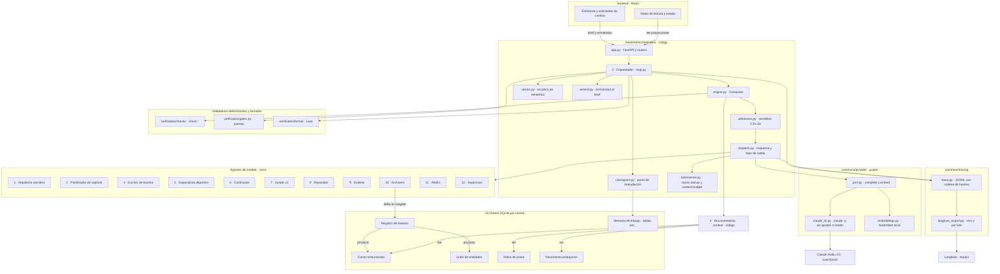
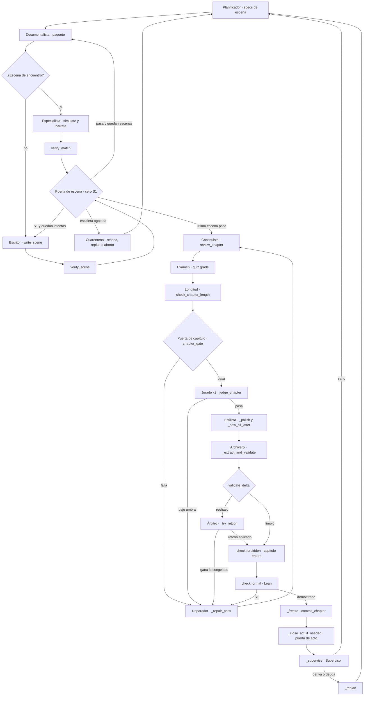
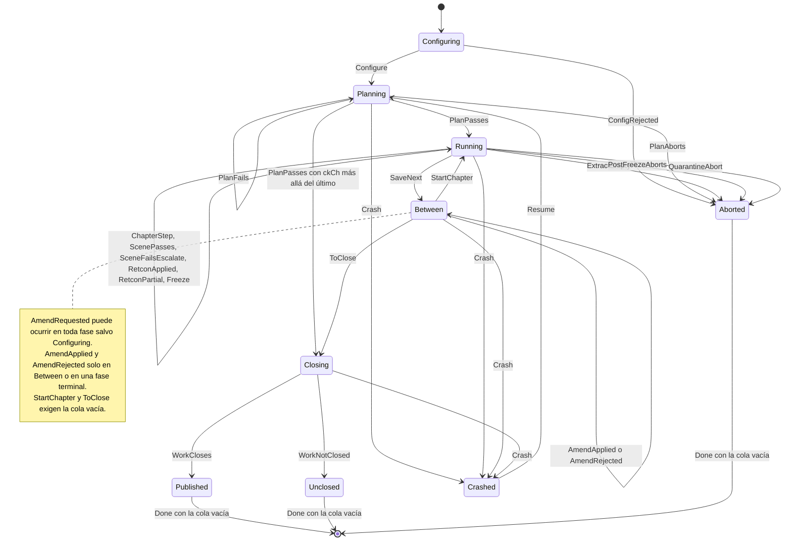
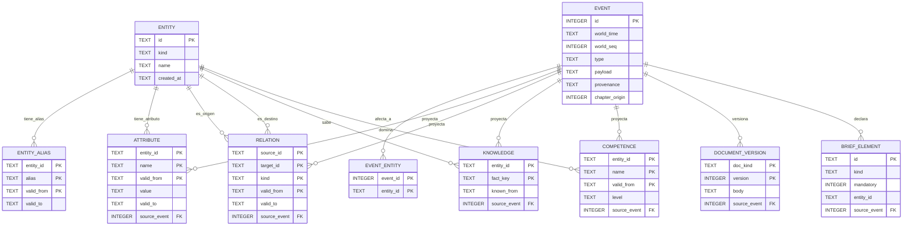
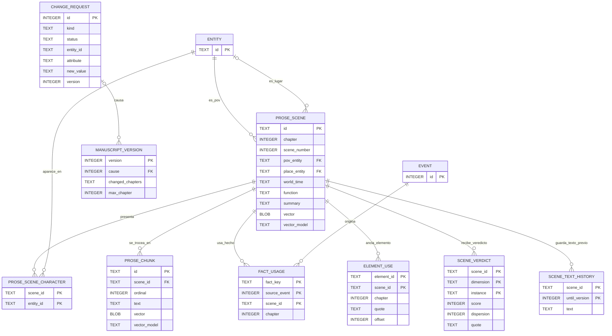
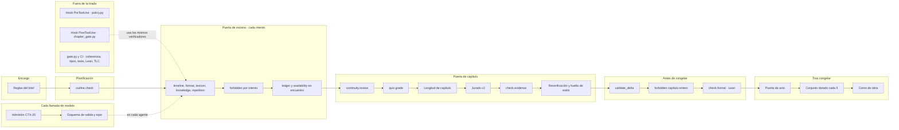

# 04 · Diagramas

> Documentación de proceso · ver [`../../AGENTS.md`](../../AGENTS.md) para el índice completo y [`README.md`](README.md) para el de esta carpeta.
> Documentos de dominio: [definitions](../definitions.md) · [domain-knowledge](../domain-knowledge.md) · [architecture](../architecture.md) · [verification](../verification.md)
> Hermanos de proceso: [01-spec-inicial](01-spec-inicial.md) · [02-trade-offs](02-trade-offs.md) · [03-explainers](03-explainers.md) · [05-iteraciones](05-iteraciones.md) · [06-red-team](06-red-team.md)

Cuatro vistas del sistema tal como está hoy en la rama: el harness que ejecuta la tirada, la máquina de estados que comprueba TLC, el esquema SQLite de una novela y el mapa de validadores con su punto de ejecución. Cada diagrama sale del código y de `docs/architecture.md`, y cada uno dice de dónde. Si un diagrama y el código discrepan, gana el código y el diagrama está mal.

| § | Diagrama | Tipo | Fuente principal |
|---|---|---|---|
| 1.1 | Arquitectura del harness | `graph TD` | `architecture.md` §2 a §7, `backend/orchestration/`, `backend/commons/` |
| 1.2 | Ciclo de un capítulo en el código | `graph TD` | `backend/orchestration/loop.py` |
| 2.1 | Ciclo de vida del capítulo, `chapter.tla` | `stateDiagram-v2` | `backend/orchestration/model/chapter.tla` |
| 2.2 | Fases de la tirada, `run.tla` | `stateDiagram-v2` | `backend/orchestration/model/run.tla` |
| 3.1 | Canon, registro y grafo | `erDiagram` | `backend/canon/db/schema.sql`, `migrations.py` |
| 3.2 | Índice de prosa y versiones | `erDiagram` | `backend/canon/db/schema.sql`, `migrations.py` |
| 4.2 | Dónde corre cada validador | `graph LR` | `architecture.md` §9.1, `loop.py`, `engine.py`, `gate.py` |

---

## 1. Arquitectura del harness

### 1.1 Vista general

**Qué muestra.** Las piezas que intervienen en una tirada y quién llama a quién. El Orquestador es código (`orchestration/loop.py`) y es el único que conoce a todas las funcionalidades: compone el motor en `engine.py` y monta la aplicación FastAPI en `app.py`. Cada llamada de modelo sigue el mismo camino, el que describe la cabecera de `engine.py`: el Documentalista ensambla el paquete, `admission` reserva contra CTX-20, `dispatch` llama a través del puerto de `commons/provider/` y valida la salida contra su esquema. El puerto tiene dos operaciones, `complete` y `embed`; `complete` se implementa con `claude_cli.py`, que lanza `claude -p` sin ajustes de usuario ni de proyecto, y `embed` con `fastembed` en local. La traza local JSONL es la fuente de verdad de lo que pasó y Langfuse la recibe como espejo.

**Qué decisión explica.** Tres, que se ven en la forma del grafo. Primera: el frontend solo entra por la API y solo como observador o para dejar encargos, así que la tirada termina igual con él apagado (`architecture.md` §2.1). Segunda: ningún agente toca el proveedor; todos pasan por `dispatch` y el puerto, que es lo que permite cambiar de modelo sin tocar once agentes (§4.8). Tercera: Langfuse cuelga de la traza y no del ciclo, así que su caída no para nada (§11).

Tres lecturas que el diagrama no dice solo:

- **La flecha del Archivero al registro de eventos es la única que escribe canon.** La escribe `canon/freeze/freeze.py:commit_chapter`, llamado desde `loop.py:_freeze`; el resto de escrituras van a las tablas `wm_*` por la fábrica de `commons/db/working_memory.py` (`architecture.md` §3.2).
- **El Documentalista y el Orquestador no consumen ventana.** Son código; los once agentes de modelo de §6 son los que pasan por `claude -p`. Las llamadas de `brief.extract`, `amend.interpret` y el lector del examen también pasan por `dispatch`, pero no son agentes (`architecture.md` §2.3 y §11, tabla de roles).
- **Los hooks de `.claude/settings.json` no aparecen.** Actúan sobre el agente de desarrollo, no sobre la tirada, y los `claude -p` del motor no los cargan (§4.8). Están en la sección 4.

### 1.2 Ciclo de un capítulo en el código

**Qué muestra.** El orden real en que `loop.py` recorre un capítulo, con los nombres de sus funciones: `_write_chapter` y `_write_scene` para las escenas, `_approve_chapter` para todo lo demás hasta `_freeze`, y `_close_act_if_needed` y `_supervise` después. Es el mismo ciclo que `architecture.md` §7.1, visto desde el código.

**Qué decisión explica.** Que toda reparación vuelve a la puerta de capítulo, nunca a un punto intermedio, y que las dos comprobaciones que miran lo que va a entrar en el canon, `check.forbidden` sobre el capítulo entero y `check.formal`, corren después del delta y justo antes de congelar (`architecture.md` §10). El reintento de escena lo reescribe el Escritor con el defecto delante: `engine.write_scene` recibe los defectos del intento anterior.

---

## 2. Máquina de estados de TLA+

**Qué muestra.** Los dos módulos de `backend/orchestration/model/`, traducidos acción por acción. `chapter.tla` es el ciclo de vida de un capítulo; `run.tla` es la tirada completa y reutiliza el capítulo con `INSTANCE chapter`. Las etiquetas de las transiciones son los nombres de las acciones del `.tla`, sin cambiar ninguno. Es el método VER-18 de `verification.md` §5.10.

**Qué decisión explica.** Que la escalera de cuarentena termina siempre, que nada entra en el canon sin pasar las cuatro puertas —escena, capítulo, Jurado y arbitraje del delta— y que una caída en cualquier fase no duplica, no pierde y no reutiliza una escena que no pasó su puerta. Son propiedades del flujo, no de un caso: TLC recorre el espacio de estados entero del modelo pequeño.

### 2.1 Ciclo de vida del capítulo, `chapter.tla`

Los estados son los de `States`. El rombo `ToRepair` no es un estado: es el operador del mismo nombre, que decide entre `Repairing`, si queda un intento de escena, y `Quarantine`, si no. Lo usan `ChapterGateFails`, `JuryFails`, `DeltaRejected`, `RetconPartial` y `RetconRefused`. `JurorAdmitted` y `JurorReturns` no cambian `state`: mueven `inFlight`, `jurorsIn` y `jurorsDone` dentro de `Judging`.

```mermaid
stateDiagram-v2
  state ToRepair <<choice>>

  [*] --> Writing
  Writing --> SceneGate : WriteScene
  SceneGate --> Writing : ScenePasses, quedan escenas
  SceneGate --> ChapterGate : ScenePasses, última escena
  SceneGate --> Writing : SceneFailsRetry
  SceneGate --> Writing : SceneFailsRespec
  SceneGate --> Quarantine : SceneFailsEscalate

  ChapterGate --> Judging : ChapterGatePasses
  ChapterGate --> ToRepair : ChapterGateFails

  Judging --> Judging : JurorAdmitted o JurorReturns
  Judging --> Polishing : JuryPasses
  Judging --> ToRepair : JuryFails

  Polishing --> Reverifying : Polish
  Reverifying --> Extracting : Reverify

  ToRepair --> Repairing : queda intento de escena
  ToRepair --> Quarantine : intentos de escena agotados
  Repairing --> Revalidating : Repair
  Revalidating --> ChapterGate : Revalidate

  Extracting --> Arbitrating : Extract
  Arbitrating --> Freezing : DeltaAccepted
  Arbitrating --> Retconning : RetconProposed
  Arbitrating --> ToRepair : DeltaRejected
  Retconning --> Freezing : RetconApplied
  Retconning --> ToRepair : RetconPartial o RetconRefused

  Freezing --> Frozen : Freeze
  Frozen --> Supervised : Supervise

  Quarantine --> Writing : QuarantineRespec
  Quarantine --> Writing : QuarantineReplan
  Quarantine --> Aborted : QuarantineAbort

  Supervised --> [*] : Done
  Aborted --> [*] : Done
```

Guardas que el diagrama resume y conviene tener a la vista:

| Acción | Guarda o efecto |
|---|---|
| `SceneFailsRetry` | `sceneAttempts + 1 < SceneAttempts` |
| `SceneFailsRespec` | Escena agotada y `chapterAttempts + 1 < ChapterAttempts`: gasta un intento de capítulo y vuelve a la misma escena |
| `SceneFailsEscalate` | Escena agotada y capítulo agotado |
| `Polish` | `openS1' \in BOOLEAN`: el pase puede abrir un S1; `Reverify` lo revierte con `openS1' = FALSE` |
| `Freeze` | `gatesPassed /\ juryPassed /\ deltaClean` |
| `QuarantineRespec` | `arcReplans < ArcReplans` y queda intento de capítulo |
| `QuarantineReplan` | `arcReplans < ArcReplans` y capítulo agotado: gasta la replanificación y pone `chapterAttempts` a 0 |
| `QuarantineAbort` | `arcReplans >= ArcReplans`: no hay cuarto nivel |
| `Call(next)` | Toda llamada en serie exige `inFlight + Reserve <= Ceiling` |
| `JurorAdmitted` | Exige `inFlight + JuryReserve <= Ceiling`: la admisión espera y nunca rebasa el techo |

### 2.2 Fases de la tirada, `run.tla`

Los estados son los de `Phases`. Dentro de `Running` corre el capítulo de 2.1: `ChapterStep` agrupa las acciones de `chapter.tla` que no tocan nada persistente, y `ScenePasses`, `SceneFailsEscalate`, `RetconApplied`, `RetconPartial` y `Freeze` se envuelven en `run.tla` porque escriben borradores, punto de reanudación, canon o versiones.

Tres detalles del modelo que cambian la lectura:

- **`PlanPasses` es también la reanudación.** Lee `ckCh`: si el capítulo del punto ya está congelado y `ResumeSkipsFrozen` es verdadera, entra en `Running` con el capítulo en `Frozen`, directo a la puerta de acto; si no, arranca desde la primera escena no reutilizable (`Reusable`) y, con `ResumeKeepsBudget`, conserva los intentos gastados.
- **`Crash` está acotada por `MaxCrashes`** y conserva lo que vive en el fichero: `drafts`, `ckCh`, `ckScene`, `freezes`, `revs`, `hist`, versiones y cola. Pierde el capítulo en curso y el presupuesto en memoria.
- **`AmendApplied` crea la versión `cv + 1`** y guarda en `snap` lo que mostraba la vigente; `Rewrite` guarda el texto anterior en `hist`, que modela `scene_text_history`.

### 2.3 Qué comprueba TLC

Sale de los tres `.cfg` de `backend/orchestration/model/`. Los números de estados son los que `README.md` §3 registra para las salidas de `tlc/`.

| Módulo y `.cfg` | Nombre | Clase | Qué dice |
|---|---|---|---|
| `chapter.cfg` | `TypeOK` | Invariante | `state` en `States`, `inFlight` en `0..Ceiling` y como mucho `Jurors` instancias |
| `chapter.cfg` | `NeverFreezeWithoutGates` | Invariante | En `Frozen` o `Supervised`, las tres marcas `gatesPassed`, `juryPassed` y `deltaClean` son verdaderas |
| `chapter.cfg` | `NoCanonBeforeFreeze` | Invariante | `canonWritten` solo en `Frozen` o `Supervised` |
| `chapter.cfg` | `RepairRevalidates` | Invariante | Ninguna reparación llega al Jurado ni más allá sin revalidar, y ningún S1 del pase de estilo llega a la extracción |
| `chapter.cfg` | `CtxI1` | Invariante | `inFlight <= Ceiling`, también con el Jurado en paralelo |
| `chapter.cfg` | `LadderBounded` | Invariante | Los tres contadores de la escalera no pasan de su límite |
| `chapter.cfg` | `RetconsBounded` | Invariante | `retcons <= SceneAttempts * (ChapterAttempts + ArcReplans)`, sin contador propio |
| `chapter.cfg` | `Terminates` | Liveness | Toda ejecución acaba en `Supervised` o `Aborted` |
| `run.cfg` | `TypeOK` | Invariante | Tipos de la tirada más `Ch!TypeOK` |
| `run.cfg` | `NeverPublishUngated` | Invariante | Ninguna versión, vigente o anterior, muestra un capítulo cuyo texto no pasó todas sus puertas |
| `run.cfg` | `NoChapterDuplicated` | Invariante | Ningún capítulo se congela dos veces |
| `run.cfg` | `NoChapterLost` | Invariante | En marcha, los anteriores al capítulo en curso están congelados; al cerrar, todos |
| `run.cfg` | `ResumeOnlyClosed` | Invariante | PRO-I2: el punto solo cubre borradores que pasaron su puerta y no queda ninguno posterior a él |
| `run.cfg` | `PreviousVersionPreserved` | Invariante | Lo que mostraba cada versión al dejar de ser vigente es lo que sigue mostrando |
| `run.cfg` | `RetriesWithinLimit` | Invariante | Escalera, planificación, retcons e intentos gastados dentro del límite, también sumando caídas |
| `run.cfg` | `ChapterSafety` | Invariante | En `Running` siguen valiendo los cuatro de seguridad de `chapter.tla` |
| `run.cfg` | `GenerationTerminates` | Liveness | `<>(phase \in Terminal)` |
| `run.cfg` | `AmendmentsSettle` | Liveness | Toda solicitud en cola acaba aplicada o rechazada |
| `run_reach.cfg` | `NeverPublished` | Alcance | Tiene que **fallar**: prueba que `Published` es alcanzable y que `run.cfg` no pasa por vacío |

| Ejecución | Resultado registrado | Estados distintos |
|---|---|---|
| `chapter` | Sin error | 1.831 |
| `run`, 5 capítulos | Sin error, con las dos propiedades temporales | 508.470 |
| `run_reach` | `NeverPublished` violado, como se espera | 70.990 |

**Equidad.** `chapter.tla` usa `WF_vars(Next)`. `run.tla` usa `WF_vars(Progress)`, donde `Progress` es `Next` sin `Crash`, sin `AmendRequested` y sin `Done`: las dos primeras vienen de fuera y pueden no ocurrir nunca.

### 2.4 Cómo se ata el modelo al código

El modelo prueba el flujo modelado, no el orquestador. Lo que lo ata al código son cuatro piezas de la misma carpeta:

| Pieza | Qué hace |
|---|---|
| `README.md` §4 | Tabla acción TLA+ ↔ `fichero:función` ↔ test VER-05 del mismo camino. Cada acción de 2.1 y 2.2 tiene fila, por ejemplo `Freeze` ↔ `loop.py:_freeze` → `commit_chapter` |
| `README.md` §6 | Las diferencias conocidas entre modelo y código, con su riesgo. Por ejemplo, el código no cuenta retcons y el modelo prueba la cota que da la escalera |
| `code-today/*.cfg` | Cuatro banderas de `run.tla` —`CheckpointOnlyPassed`, `ResumeSkipsFrozen`, `ResumeKeepsBudget` y `RetconKeepsHistory`— son cada una la corrección de un fallo que TLC encontró al modelar el código, B1 a B4. `run.cfg` las pone a `TRUE`; cada `code-today/*.cfg` apaga una y conserva su contraejemplo, y el README nombra el test que lo reproduce. `b4_budget_liveness.cfg` comprueba que, aun con ese fallo, la tirada terminaba |
| `mutations/*.tla` | Copias de `run.tla` con un solo cambio marcado `MUTACION`: M1 congela sin puertas, M2 quita el tope de caídas, M3 aplica la enmienda sin historial y M4 guarda el punto sin borrar los borradores posteriores. Cada una tiene que romper su invariante o su liveness; M4 es la prueba de que `ResumeOnlyClosed` no es vacuo |

`run_tlc.sh` lo ejecuta todo, guarda cada salida en `tlc/` y sale con 0 solo si las trece comprobaciones dan lo esperado: las que tienen que pasar pasan y las que tienen que fallar fallan. En CI, `.github/workflows/backend.yml` ejecuta TLC sobre `chapter.cfg` en el trabajo diario de comprobaciones lentas.

---

## 3. Esquema SQLite

**Qué muestra.** Las tablas reales de un fichero de novela, versión de esquema 8. Salen del DDL de `backend/canon/db/schema.sql`, que crea la base, y de `backend/canon/db/migrations.py`, que añade las versiones 2 a 8. Las entrevistas viven en otro fichero, `_interviews.sqlite`, con el DDL de `backend/brief/store.py`. El listado se contrastó con `sqlite_master` de un fichero de `backend/runs/`, en solo lectura, y coincide tabla por tabla.

**Qué decisión explica.** Que los cinco almacenes son una separación lógica y no física (`architecture.md` §3.1): cinco conjuntos de tablas en la misma base. Que el registro de eventos manda: `attribute`, `relation`, `knowledge`, `competence` y `document_version` llevan `source_event` hacia `event`, porque son proyecciones reconstruibles. Y que la inmutabilidad no se deja en convención: triggers `RAISE(ABORT)` impiden modificar o borrar `event`, `retcon`, `scene_text_history`, `manuscript_version` e `interview_turn`.

Los diagramas solo dibujan las claves ajenas que el DDL declara con `REFERENCES`. Hay dos relaciones lógicas sin clave ajena: `event_entity.entity_id` y `brief_element.entity_id`, que apuntan a `entity.id` sin `REFERENCES`.

### 3.1 Canon estructurado, registro de eventos y grafo

`event` lleva dos restricciones que hacen de él el registro: `UNIQUE (world_time, world_seq)`, que da el orden total de proyección, y `CHECK ((provenance = 'brief') = (chapter_origin IS NULL))`, que obliga a todo hecho que no viene del brief a tener capítulo de origen.

### 3.2 Índice de prosa, calidad por escena y versiones del manuscrito

La vista `chronology`, creada en la migración 5 con el cuerpo de `canon/prose_index/chronology.py`, no es tabla: da una fila por `prose_scene` en orden de mundo, con los presentes calculados desde `pov_entity` y `prose_scene_character`. Es lo que lee el generador de Lean.

### 3.3 Todas las tablas, por almacén

La columna almacén usa los cinco de `architecture.md` §3.1 y la memoria de trabajo de §3.2. Las tablas que no pertenecen a ninguno lo dicen.

| Tabla | Almacén | Propósito | Dónde se crea |
|---|---|---|---|
| `event` | Registro de eventos | Hechos canónicos fechados, append-only por trigger | `schema.sql` |
| `event_entity` | Registro de eventos | Entidades a las que afecta cada evento | `schema.sql` |
| `entity` | Canon estructurado | Entidades con tipo, nombre e instante de aparición | `schema.sql` |
| `entity_alias` | Canon estructurado | Alias con vigencia | `schema.sql` |
| `attribute` | Canon estructurado | Atributos con vigencia, MET-07 | `schema.sql` |
| `knowledge` | Canon estructurado | Qué sabe cada personaje y desde cuándo, PER-10; lo lee `check.knowledge` | `schema.sql` |
| `competence` | Canon estructurado | Competencias vigentes, PER-09 | `schema.sql` |
| `document_version` | Canon estructurado | Guía de estilo, escaleta y reglamento versionados | `schema.sql` |
| `brief_element` | Canon estructurado | Proyección de `element.declared`: rasgos y recuerdos del destinatario | `migrations.py`, versión 8 |
| `proscribed` | Canon estructurado | Lista de proscripción POE-12 con `level` global, cliente, novela o estilo | `schema.sql`; `level` y sus triggers en la versión 4 |
| `relation` | Grafo de entidades | Aristas tipadas con vigencia, recorridas con CTE | `schema.sql` |
| `prose_scene` | Índice de prosa | Nivel escena: metadatos, resumen y vector | `schema.sql` |
| `prose_scene_character` | Índice de prosa | Personajes presentes por escena | `schema.sql` |
| `prose_chunk` | Índice de prosa | Nivel fragmento: texto literal y vector | `schema.sql` |
| `prose_chunk_fts` | Índice de prosa | Tabla virtual FTS5 con BM25 sobre `prose_chunk` | `schema.sql` |
| `fact_usage` | Índice de prosa | Hecho × escena, escrito al congelar | `migrations.py`, versión 5 |
| `element_use` | Índice de prosa | Uso anclado de un elemento obligatorio, con su cita | `migrations.py`, versión 8 |
| `chronology` | Índice de prosa, vista | Cronología en orden de mundo para Lean | `migrations.py`, versión 5 |
| `retrieval_params` | Índice de prosa | Parámetros de troceado e indexación; cambiarlos es reindexar | `migrations.py`, versión 2 |
| `summary` | Resúmenes jerárquicos | Resumen vigente por nivel escena, capítulo, arco u obra | `schema.sql` |
| `summary_version` | Resúmenes jerárquicos | Todas las versiones de cada resumen | `migrations.py`, versión 2 |
| `scene_verdict` | Ninguno: proyección de calidad | Veredictos del Jurado por escena congelada | `migrations.py`, versión 2 |
| `chapter_fingerprint` | Ninguno: proyección de calidad | Huella estilística por capítulo congelado | `migrations.py`, versión 2 |
| `chapter_metrics` | Ninguno: supervisión | Las señales de `architecture.md` §11 por capítulo | `migrations.py`, versión 2 |
| `retcon` | Ninguno: registro de arbitraje | Retcons aplicados, append-only por trigger | `migrations.py`, versión 2 |
| `change_request` | Ninguno: encargos | Solicitudes de cambio y su estado, que solo cambia el backend | `migrations.py`, versión 3; `kind` y `term` en la 7 |
| `manuscript_version` | Ninguno: versiones | Una fila por versión creada por enmienda, desde la 2 | `migrations.py`, versión 3 |
| `scene_text_history` | Ninguno: versiones | Texto de una escena hasta `until_version`, append-only | `migrations.py`, versión 3 |
| `schema_version` | Ninguno: metadatos | Versiones de esquema aplicadas | `schema.sql` |
| `wm_run_state` | Memoria de trabajo | Punto de reanudación; reintentos y escaleta vigente desde la versión 6 | `schema.sql`; columnas en la versión 6 |
| `wm_draft` | Memoria de trabajo | Borradores de escena sin congelar | `schema.sql` |
| `wm_defect` | Memoria de trabajo | Defectos abiertos con cita, regla y estado | `schema.sql` |
| `wm_verdict` | Memoria de trabajo | Puntuaciones del Jurado del capítulo en curso | `schema.sql` |
| `wm_admission` | Memoria de trabajo | Llamadas en cola o en vuelo contra CTX-20 | `schema.sql` |
| `interview` | Fuera de la novela | Estado vigente de cada entrevista, en `_interviews.sqlite` | `brief/store.py` |
| `interview_turn` | Fuera de la novela | Cada turno tal como llegó, append-only por trigger | `brief/store.py` |

---

## 4. Validadores y su punto de ejecución

**Qué muestra.** Todo lo que comprueba algo en el sistema, dónde corre y qué pasa si falla. La fuente de verdad es la tabla de `architecture.md` §9.1; esta la reordena por punto de ejecución, le añade la puerta de CI y los guardarraíles de `dispatch` y `admission`, y le pone su método de `verification.md`. Cada fila se contrastó con el código: el `kind` que asigna, la función que lo define y la línea de `engine.py` o `loop.py` que lo llama.

**Qué decisión explica.** «Determinista antes que modelo» (`AGENTS.md` §5.3.4) escrito en orden de ejecución: los verificadores de código corren en cada intento de escena, antes de cualquier juez; el Continuista y el Jurado solo ven un capítulo que ya pasó los deterministas; y lo formal corre justo antes de congelar, donde un fallo todavía tiene a quién volver. Y «fallo cerrado» (§5.3.6): `check.formal` sin `lake` es S1, los hooks salen con 2 si no pueden evaluar, y la admisión no admite una llamada cuyo presupuesto no se puede estimar.

### 4.1 Tabla

Tipos: **programático**, código determinista sobre prosa o estructura; **semántico**, un agente de modelo con cita anclada; **formal**, Lean o TLC; **guardarraíl**, filtro que acota la acción antes de que ocurra (VER-12).

| Validador | Tipo | Punto de ejecución | Si falla | Fichero | VER-NN |
|---|---|---|---|---|---|
| Reglas del brief | Programático | Carga del brief y cada turno de la entrevista | 422 con la regla; en la entrevista se muestra la contradicción | `canon/brief_rules.py:contradictions` | VER-05 |
| `outline.check` | Programático | Tras el Arquitecto, `loop.py:_plan_with_gate`, y en cada `_replan` | La escaleta vuelve con sus defectos; agotada, `RunAbortedError` | `planning/outline/check.py` | VER-05 |
| `check.timeline` | Programático | Puerta de escena, `engine.py:Composer.verify_scene` | S1: reintento de escena con el defecto delante | `verification/checks/deterministic.py:check_timeline` | VER-05, VER-06, VER-07 |
| `check.format` | Programático | Puerta de escena, `verify_scene` | S1 en tiempo y persona, S2 en longitud: reintento | `deterministic.py:check_format` | VER-05, VER-06, VER-07 |
| `check.lexicon` | Programático | Puerta de escena, `verify_scene` | S1: reintento | `deterministic.py:check_lexicon` | VER-05, VER-06, VER-07 |
| `check.knowledge` | Programático | Puerta de escena, `verify_scene` | S1: reintento | `deterministic.py:check_knowledge` | VER-05, VER-06, VER-07 |
| `check.repetition` | Programático | Puerta de escena, `verify_scene` | S2: lo recibe el Estilista en `_polish` | `deterministic.py:check_repetition` | VER-05, VER-06, VER-07 |
| `check.forbidden`, por intento | Guardarraíl | Puerta de escena, `verify_scene` | S1: reintento; agotada la escalera, `RunAbortedError` con término y nivel | `verification/checks/forbidden.py:check_forbidden` | VER-12 |
| `check.ledger` | Programático | Escena de encuentro, `Composer.verify_match` | S1: reintento | `deterministic.py:check_ledger` y `check_milestones` | VER-05, VER-06, VER-07 |
| `check.availability` | Programático | Escena de encuentro, `verify_match` | S1: reintento | `deterministic.py:check_availability` | VER-05, VER-06, VER-07 |
| Puerta de escena | Programático | Tras `verify_scene` o `verify_match` | Cero S1 o reintento, respec o cuarentena por `retries.py:on_failure` | `verification/gates.py:scene_gate` | VER-05 |
| `continuity.review` | Semántico | Puerta de capítulo, `Composer.review_chapter`, y otra vez tras el pase de estilo | S1 y S2 a reparación; una reparación que abre un S1 se revierte | `verification/continuity/review.py` | VER-14 |
| `quiz.grade` | Programático | Puerta de capítulo, antes del Jurado | S2 por respuesta errónea | `verification/quiz/grade.py` | VER-20 |
| `check.format`, longitud de capítulo | Programático | Puerta de capítulo, `loop.py:_approve_chapter` | S2 en el máximo de la puerta; reparación | `deterministic.py:check_chapter_length` | VER-05 |
| Puerta de capítulo | Programático | `_approve_chapter`, sobre todo lo anterior | Cero S1 y máximo 2 S2, o `_repair_pass` | `verification/gates.py:chapter_gate` | VER-05 |
| Jurado, las `*.audit` | Semántico | Tras la puerta de capítulo, `Composer.judge_chapter`, tres hilos | Dimensión bajo umbral a reparación; dispersión alta, segunda ronda | `verification/jury/verdict.py` | VER-14 |
| `check.evidence` | Programático | Sobre la salida del Continuista, del Jurado y del Archivero | La cita que no ancla se descarta como defecto de proceso | `verification/checks/evidence.py` | VER-19 |
| Reverificación del pase de estilo | Programático y semántico | `loop.py:_polish`, con `_new_s1_after` | Un S1 nuevo revierte el pase entero | `orchestration/loop.py` | VER-05 |
| Huella estilística | Programático | `_polish`, tras cada pase | Fuera de tolerancia, segunda pasada; si persiste, se congela y la deriva queda en la traza para el Supervisor | `verification/style/drift.py` | VER-16 |
| Validación del delta | Programático | Antes de congelar, `loop.py:_extract_and_validate` | S1: arbitraje, retcon por `_try_retcon` o reparación | `canon/arbiter/entries.py:validate_delta` | VER-08, VER-12 |
| `check.forbidden`, capítulo entero | Guardarraíl | Justo antes de congelar, `_forbidden_before_freeze` | S1 al Reparador | `forbidden.py:check_forbidden` | VER-12 |
| `check.formal` | Formal | Antes de congelar, `_formal_before_freeze`; antes de reescribir en `_try_retcon` y en `amend.py:_formal_or_reject`; en `amend.py:_apply_forbid` | S1 a reparación; en un retcon gana lo congelado; en una enmienda se rechaza sin crear versión. Sin `lake`, S1 | `verification/formal/check.py`, `compose.py:check_lean` | VER-04 |
| Puerta de acto | Programático | Al congelar el último capítulo de un acto, `_close_act_if_needed` | Replanifica el tramo siguiente | `planning/act_gate/gate.py:check_act` | VER-05 |
| Conjunto dorado | Semántico | Cada 5 capítulos, `loop.py:_golden_check`; en `prueba`, al congelar el último | Alarma en la traza | `verification/jury/golden.py` | VER-10 |
| Cierre de obra | Programático | Tras el último capítulo, `loop.py:_work_closes` | La obra no cierra y `work.close` dice por qué | `orchestration/loop.py` | VER-05 |
| Esquema de salida y tope | Guardarraíl | En cada llamada de modelo, `dispatch.py` | La llamada cuenta como fallida y consume un reintento | `orchestration/dispatch.py` | VER-12 |
| Admisión CTX-20 | Guardarraíl | Antes de cada llamada, `admission.py:admit` | Se encola en FIFO; sin presupuesto estimable, no se admite | `orchestration/admission.py` | VER-12 |
| Hook de capítulo | Guardarraíl | `PostToolUse` de Claude Code sobre `*.chapter.md` o `*.chapter.txt` | Código de salida 2 con los defectos al agente de desarrollo | `.claude/hooks/chapter_gate.py` | VER-12 |
| Hook de política | Guardarraíl | `PreToolUse` sobre `Write`, `Edit`, `MultiEdit`, `Read` y `Bash` | Deniega con el motivo y lo registra en `.claude/audit/policy.jsonl` | `.claude/hooks/policy.py` | VER-12 |
| `gate.py` | Programático | Cada cambio y la CI: coherencia, contrato OpenAPI, ruff, mypy, `lint-imports`, bandit, pytest y las dos fixtures de Lean | CI en rojo | `backend/gate.py` | VER-15 |
| `gate.py --full` y trabajo lento | Programático y formal | CI diaria: `pip_audit`, mutación con `mutmut` y TLC sobre `chapter.cfg` | CI en rojo; mutación por debajo del 90 % | `backend/gate.py`, `.github/workflows/backend.yml` | VER-07, VER-18 |

### 4.2 Dónde corre cada grupo

**Qué muestra.** Los mismos validadores de 4.1 agrupados por el momento del ciclo en que corren, de izquierda a derecha. Los hooks y la puerta de CI quedan fuera de la tirada, porque actúan sobre quien construye el sistema y no sobre la novela.

Una regla del diagrama que la tabla no enseña: **todo fallo de la puerta de capítulo en adelante vuelve al principio de la puerta de capítulo**, nunca a la mitad. Es `RepairRevalidates` de 2.3, y en el código es el `while True` de `_approve_chapter`.

