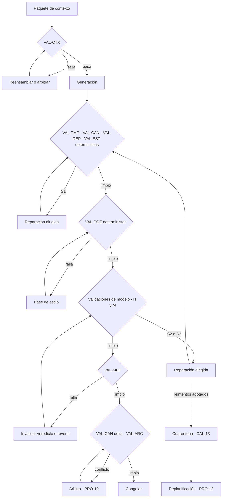

# validations.md

> Documentación de dominio · ver [`../AGENTS.md`](../AGENTS.md) para el índice completo.
> Relacionados: [definitions](definitions.md) · [domain-knowledge](domain-knowledge.md) · [architecture](architecture.md)

Catálogo de todas las comprobaciones que el sistema ejecuta sobre sí mismo. Es el contrato de calidad: nada llega al manuscrito sin pasar por aquí, y como no hay validación externa (PRO-11), este documento es el único lugar donde está definido qué significa "correcto".

`architecture.md` describe **quién** valida. Este documento define **qué** se valida, **con qué regla** y **qué pasa si falla**.

---

## 1. Modelo de validación

Una validación es una tupla con siete campos:

| Campo | Significado |
|---|---|
| **ID** | Identificador estable `VAL-XXX-NN` |
| **Qué comprueba** | Enunciado en una frase |
| **Tipo** | `D` determinista (código) · `M` de modelo (rúbrica con evidencia) · `H` híbrido |
| **Regla o umbral** | Condición exacta de paso |
| **Severidad** | S1 a S4 (CAL-06) |
| **Puerta** | Dónde se ejecuta |
| **Acción al fallar** | Qué hace el sistema |

**Principios**

1. **Determinista antes que modelo.** Ninguna validación `M` se ejecuta si queda alguna `D` en rojo. Juzgar el ritmo de un capítulo con la cronología rota es tirar tokens.
2. **Evidencia obligatoria.** Toda validación, `D` o `M`, devuelve el fragmento exacto que la dispara. Un defecto sin localización no se puede reparar de forma dirigida (CAL-08).
3. **Fallo cerrado.** Si una validación no puede ejecutarse, cuenta como fallida. Nunca se asume que pasa.
4. **Sin escalado externo.** Al agotarse el presupuesto de reintentos (CAL-12), el artefacto entra en cuarentena y se replanifica (PRO-12).

**Severidades**

| Nivel | Definición | Tolerancia |
|---|---|---|
| **S1** | Rompe el canon, el reglamento o un invariante duro | Cero, siempre |
| **S2** | Daña el arco, la caracterización o la estructura | ≤2 por capítulo |
| **S3** | Afecta al estilo, el ritmo o la repetición | ≤6 por capítulo |
| **S4** | Cosmético | Se registra, no bloquea |

**Espacios de nombres**

| Prefijo | Familia |
|---|---|
| `VAL-CTX` | Paquete de contexto, antes de generar |
| `VAL-TMP` | Cronología y tiempo |
| `VAL-CAN` | Canon, hechos y conocimiento |
| `VAL-PER` | Personaje, voz y capacidad |
| `VAL-DEP` | Subdominio deportivo |
| `VAL-EST` | Estructura y escena |
| `VAL-POE` | Estilo, ritmo y repetición |
| `VAL-ARC` | Arco, obra y deuda narrativa |
| `VAL-MET` | Meta-validación: valida a los validadores |

---

## 2. VAL-CTX · Paquete de contexto

Se ejecutan **antes** de la llamada de generación. Son las más baratas y las que más llamadas caras evitan.

| ID | Qué comprueba | Tipo | Regla | Sev. | Acción al fallar |
|---|---|---|---|---|---|
| VAL-CTX-01 | El paquete no excede el presupuesto | D | Total ≤ presupuesto del agente; entrada ≤ 70.000 tokens | S1 | Compactar por prioridad inversa (CTX-19) |
| VAL-CTX-02 | Las anclas están presentes | D | Guía de estilo condensada e invariantes duros en el paquete | S1 | Reensamblar |
| VAL-CTX-03 | Todo el elenco activo tiene ficha | D | Cada personaje de la especificación tiene ficha compacta | S1 | Reensamblar |
| VAL-CTX-04 | No hay dos versiones del mismo hecho | D | Sin colisión de hechos canónicos con distinta afirmación (CTX-15) | S1 | Enviar al Árbitro antes de generar |
| VAL-CTX-05 | El conocimiento del POV está proyectado | D | `canon.knowledge-of` resuelto para el POV en el instante de la escena | S1 | Reensamblar |
| VAL-CTX-06 | La especificación va al final | D | Último bloque del paquete (CTX-16) | S2 | Reordenar |
| VAL-CTX-07 | Los fragmentos recuperados son relevantes | M | ≥70 % de los fragmentos calificados como útiles por muestreo del propio ensamblador | S3 | Ajustar consulta y rerank |
| VAL-CTX-08 | La muestra modélica no es la escena anterior | D | Identificador distinto del bloque de prosa literal | S3 | Rotar muestra |
| VAL-CTX-09 | La lista de proscripción está actualizada | D | Incluye los n-gramas detectados en el último capítulo congelado | S3 | Regenerar lista |

---

## 3. VAL-TMP · Cronología

| ID | Qué comprueba | Tipo | Regla | Sev. | Acción |
|---|---|---|---|---|---|
| VAL-TMP-01 | Las fechas mencionadas existen en el calendario | D | Toda fecha explícita resuelve contra la cronología (MUN-05) | S1 | Reparación dirigida |
| VAL-TMP-02 | El orden de eventos es consistente | D | Ningún evento narrado precede a su causa registrada | S1 | Reparación dirigida |
| VAL-TMP-03 | La elipsis declarada coincide con lo narrado | D | Tiempo transcurrido en la escena = elipsis de la especificación ±10 % | S2 | Reparación dirigida |
| VAL-TMP-04 | Las referencias relativas son correctas | H | "Tres semanas después", "la temporada pasada" cuadran con el calendario | S1 | Reparación dirigida |
| VAL-TMP-05 | Las analepsis están marcadas | D | Todo salto a tiempo de mundo anterior tiene marca de transición (EST-15) | S2 | Reparación dirigida |
| VAL-TMP-06 | La edad y la antigüedad cuadran | D | Edad calculada desde la fecha de nacimiento canónica | S1 | Reparación dirigida |

---

## 4. VAL-CAN · Canon, hechos y conocimiento

| ID | Qué comprueba | Tipo | Regla | Sev. | Acción |
|---|---|---|---|---|---|
| VAL-CAN-01 | Ningún hecho narrado contradice el canon congelado | H | Sin contradicción con hechos vigentes (CAN-05) | S1 | Árbitro y reparación |
| VAL-CAN-02 | Los nombres y alias son los canónicos | D | Coincidencia exacta con el léxico registrado (MUN-08) | S1 | Reparación dirigida |
| VAL-CAN-03 | Los atributos estables no han cambiado | D | Rasgos físicos y biográficos sin vigencia coinciden | S1 | Reparación dirigida |
| VAL-CAN-04 | Nadie usa información que no conoce | H | Toda mención de un hecho por un personaje está en su PER-10 en `t` (PER-I1) | S1 | Reparación dirigida |
| VAL-CAN-05 | Los lugares se describen de forma compatible | M | Sin contradicción con descripciones previas recuperadas | S2 | Reparación dirigida |
| VAL-CAN-06 | El delta canónico es completo | M | Todo cambio de estado narrado aparece en el delta (CAN-11) | S1 | Reejecutar `delta.extract` |
| VAL-CAN-07 | El delta es aplicable | D | Sin colisión con canon vigente al aplicarse | S1 | Árbitro (PRO-10) |
| VAL-CAN-08 | Todo hecho nuevo tiene procedencia y origen | D | Campos MET-09 y capítulo de origen presentes | S1 | Rechazar delta |
| VAL-CAN-09 | El retcon es admisible | D | El hecho afectado no tiene payoff cobrado y afecta a ≤3 pasajes | S1 | Denegar retcon y regenerar el capítulo nuevo |
| VAL-CAN-10 | Las proyecciones reconstruyen el estado | D | Recalcular estado en `t` desde el registro de eventos da el mismo resultado | S1 | Reconstruir proyecciones |

VAL-CAN-04 es la validación con peor relación entre importancia e implementación: es la causa número uno de incoherencias y solo se puede detectar de forma aproximada. Conviene reforzarla marcando en la especificación de escena qué hechos **puede** mencionar cada personaje, y tratar cualquier hecho fuera de esa lista como sospechoso.

---

## 5. VAL-PER · Personaje y voz

| ID | Qué comprueba | Tipo | Regla | Sev. | Acción |
|---|---|---|---|---|---|
| VAL-PER-01 | POV único por escena | D | Sin acceso a la conciencia de otro personaje (EST-I1) | S1 | Reparación dirigida |
| VAL-PER-02 | La distancia narrativa es la declarada | M | Coincide con la especificación (PER-15) | S2 | Pase de estilo |
| VAL-PER-03 | Nadie ejecuta algo fuera de su competencia | H | Toda acción está respaldada por PER-09 en `t` | S1 | Reparación dirigida |
| VAL-PER-04 | Las voces son distinguibles | M | Un evaluador identifica al hablante sin etiqueta en ≥80 % de las réplicas | S2 | Pase de diálogo |
| VAL-PER-05 | El idiolecto se respeta | H | Marcadores de PER-08 presentes; sin marcadores de otro personaje | S2 | Pase de diálogo |
| VAL-PER-06 | El comportamiento es coherente con valores y línea roja | M | Ninguna acción contradice los valores sin evento que lo justifique | S2 | Reparación dirigida |
| VAL-PER-07 | El arco avanza según lo planificado | M | El estado interno al final de la escena coincide con el previsto (PER-06) | S2 | Replanificar escena |
| VAL-PER-08 | Las relaciones vigentes se reflejan | D | El trato entre personajes coincide con PER-11 en `t` | S2 | Reparación dirigida |

---

## 6. VAL-DEP · Subdominio deportivo

Estas validaciones son las que hacen creíble una épica deportiva ante un lector que conoce el deporte. Son casi todas deterministas porque el dominio tiene reglas duras.

| ID | Qué comprueba | Tipo | Regla | Sev. | Acción |
|---|---|---|---|---|---|
| VAL-DEP-01 | El desarrollo respeta el reglamento | D | Toda acción es legal según DEP-02 | S1 | Reparación dirigida |
| VAL-DEP-02 | El marcador narrado coincide con el simulado | D | Igualdad exacta con la salida de `match.simulate` | S1 | Reparación dirigida |
| VAL-DEP-03 | La clasificación afirmada es recalculable | D | Coincide con la tabla derivada de los resultados registrados (DEP-I1) | S1 | Sustituir por dato calculado |
| VAL-DEP-04 | Las estadísticas cuadran | D | Suma de encuentros narrados = acumulado afirmado | S1 | Sustituir por dato calculado |
| VAL-DEP-05 | Nadie compite estando indisponible | D | Estado físico permite participar en esa fecha (DEP-I2) | S1 | Reparación dirigida |
| VAL-DEP-06 | Las plantillas son coherentes | D | Los participantes pertenecen al equipo en esa fecha | S1 | Reparación dirigida |
| VAL-DEP-07 | El calendario es válido | D | El encuentro existe en la competición y en esa jornada | S1 | Reparación dirigida |
| VAL-DEP-08 | La duración narrativa respeta la real | D | Tiempo de juego narrado ≤ duración reglamentaria más prórroga | S2 | Reparación dirigida |
| VAL-DEP-09 | La recuperación de lesión es plausible | D | Tiempo transcurrido ≥ plazo mínimo registrado para esa lesión | S1 | Reparación dirigida |
| VAL-DEP-10 | La táctica narrada existe y es aplicable | M | Coherente con la disciplina y con la plantilla disponible | S2 | Reparación dirigida |
| VAL-DEP-11 | El momento cumbre no se diluye | M | La dilatación temporal se concentra en DEP-18, no repartida | S3 | Pase de ritmo |
| VAL-DEP-12 | El vocabulario técnico es correcto | H | Términos de la disciplina usados con su significado | S2 | Pase de estilo |

---

## 7. VAL-EST · Estructura y escena

| ID | Qué comprueba | Tipo | Regla | Sev. | Acción |
|---|---|---|---|---|---|
| VAL-EST-01 | La escena tiene cambio de valor | M | Estado emocional o situacional distinto al inicio y al final (EST-13) | S2 | Replanificar escena |
| VAL-EST-02 | La escena cumple su función declarada | M | Coincide con EST-14 de la especificación | S2 | Replanificar escena |
| VAL-EST-03 | Unidad de tiempo, espacio y POV | D | Sin cambio de los tres dentro de la misma escena (EST-08) | S2 | Dividir escena |
| VAL-EST-04 | La longitud está en rango | D | Palabras dentro del objetivo ±20 % | S3 | Pase de poda o ampliación |
| VAL-EST-05 | Los setups planificados se plantan | D | Todo setup previsto para la escena aparece marcado | S2 | Reparación dirigida |
| VAL-EST-06 | Los payoffs previstos se cobran | D | Todo payoff previsto se registra como cobrado | S2 | Reparación dirigida |
| VAL-EST-07 | La transición es coherente | D | El tipo de transición coincide con lo planificado (EST-15) | S3 | Reparación dirigida |
| VAL-EST-08 | El capítulo tiene todas sus escenas | D | Número y orden coinciden con la escaleta | S1 | Regenerar las que falten |
| VAL-EST-09 | La causalidad entre escenas se sostiene | M | Cada escena es consecuencia plausible de la anterior | S2 | Replanificar tramo |

---

## 8. VAL-POE · Estilo, ritmo y repetición

| ID | Qué comprueba | Tipo | Regla | Sev. | Acción |
|---|---|---|---|---|---|
| VAL-POE-01 | Tiempo verbal y persona | D | Coinciden con la guía de estilo (POE-06) | S1 | Pase de estilo |
| VAL-POE-02 | Sin términos proscritos | D | Cero coincidencias con POE-12 | S3 | Pase de estilo |
| VAL-POE-03 | Sin n-gramas repetidos | D | Ningún n-grama de ≥5 palabras repetido respecto al corpus congelado | S3 | Pase de estilo |
| VAL-POE-04 | Sin tics de modelo | H | Ausencia de los patrones registrados en POE-11 | S3 | Pase de estilo |
| VAL-POE-05 | Huella estilística dentro de tolerancia | D | Desviación ≤1,5 σ respecto a la referencia de capítulos congelados (POE-13) | S2 | Pase de estilo y refresco de anclas |
| VAL-POE-06 | Imágenes no recicladas | H | Ninguna metáfora central repetida de un capítulo previo (POE-14) | S3 | Pase de estilo |
| VAL-POE-07 | Densidad suficiente | M | Información nueva en cada párrafo; sin relleno (POE-08) | S3 | Pase de poda |
| VAL-POE-08 | Ritmo conforme a la curva | M | Palabras por unidad de tiempo de mundo coherentes con la tensión prevista | S2 | Pase de ritmo |
| VAL-POE-09 | Subtexto en el diálogo | M | El diálogo no expone directamente lo que el personaje quiere (POE-09) | S2 | Pase de diálogo |
| VAL-POE-10 | Tono y registro conformes | M | Coinciden con la especificación de la escena | S2 | Pase de estilo |
| VAL-POE-11 | Motivos temáticos presentes | M | Los motivos previstos aparecen sin subrayarse | S3 | Reparación dirigida |

---

## 9. VAL-ARC · Arco, obra y deuda narrativa

Se ejecutan al cerrar capítulo, acto y obra.

| ID | Qué comprueba | Tipo | Regla | Sev. | Acción |
|---|---|---|---|---|---|
| VAL-ARC-01 | La deuda narrativa está bajo control | D | Setups abiertos ≤ presupuesto del acto | S2 | Replanificar tramo |
| VAL-ARC-02 | Ningún setup vence sin plan | D | Todo setup tiene capítulo de payoff asignado | S2 | Replanificar tramo |
| VAL-ARC-03 | La curva de tensión progresa | D | Tensión estimada no decrece entre puntos de control de un acto | S2 | Replanificar tramo |
| VAL-ARC-04 | Los arcos avanzan | M | Cada arco activo registra progreso cada N capítulos | S2 | Replanificar tramo |
| VAL-ARC-05 | El doble arco se resuelve por separado | D | Clímax competitivo y clímax interno en capítulos distintos (DEP-20) | S1 | Replanificar desenlace |
| VAL-ARC-06 | La obra cierra limpia | D | Deuda narrativa cero, todos los arcos resueltos, longitud en rango | S1 | Bloquear cierre y replanificar |
| VAL-ARC-07 | El reparto de palabras es el planificado | D | Longitud por acto dentro del ±15 % previsto | S3 | Ajustar en el tramo siguiente |
| VAL-ARC-08 | Sin líneas argumentales huérfanas | D | Toda línea abierta tiene escena de cierre | S1 | Replanificar desenlace |

---

## 10. VAL-MET · Meta-validación

Valida a los validadores. Sin supervisión externa, es lo único que impide que el sistema se apruebe a sí mismo por inercia.

| ID | Qué comprueba | Tipo | Regla | Sev. | Acción |
|---|---|---|---|---|---|
| VAL-MET-01 | Los jueces siguen detectando defectos conocidos | D | ≥90 % de aciertos sobre el conjunto dorado (CAL-10), cada 5 capítulos | S1 | Congelar veredictos y revertir a la versión anterior de la rúbrica |
| VAL-MET-02 | El jurado converge | D | Dispersión entre instancias ≤1 punto de la rúbrica (CAL-11) | S2 | Invalidar veredicto y forzar verificación adicional |
| VAL-MET-03 | Toda puntuación tiene evidencia | D | Cita textual presente y localizable en el texto evaluado | S1 | Descartar la puntuación |
| VAL-MET-04 | Sin inflación de notas | D | Media móvil de puntuaciones estable respecto a los 10 capítulos anteriores | S2 | Reejecutar conjunto dorado |
| VAL-MET-05 | Las reparaciones no generan regresiones | D | Tras reparar, ninguna validación previamente en verde pasa a rojo | S1 | Revertir la corrección |
| VAL-MET-06 | Los reintentos no se desbordan | D | Contador dentro de CAL-12 | S2 | Cuarentena y replanificación |
| VAL-MET-07 | Todo arbitraje queda registrado | D | Conflicto, regla aplicada y resultado en el registro | S1 | Bloquear congelación |
| VAL-MET-08 | Las validaciones se ejecutan todas | D | Ninguna validación aplicable omitida o con error de ejecución | S1 | Tratar como fallida (fallo cerrado) |

---

## 11. Cascada de ejecución

Nótese que toda reparación vuelve a `G1`, nunca al punto donde falló. Una corrección de estilo puede romper la continuidad, y no revalidar desde el principio es la forma más común de que un sistema autónomo se dé por bueno mientras se degrada.

---

## 12. Matriz puerta × familia

| Puerta | CTX | TMP | CAN | PER | DEP | EST | POE | ARC | MET |
|---|:-:|:-:|:-:|:-:|:-:|:-:|:-:|:-:|:-:|
| Antes de generar | ● | | | | | | | | |
| Escena generada | | ● | ● | ● | ● | ● | ● | | |
| Capítulo completo | | ● | ● | ● | ● | ● | ● | | ● |
| Tras pase de estilo | | ● | ● | ● | | | ● | | |
| Integración de delta | | | ● | | | | | | ● |
| Cierre de acto | | | | | | | | ● | ● |
| Cierre de obra | | | ● | | ● | ● | | ● | ● |

---

## 13. Umbrales de aceptación

| Dimensión (CAL-01) | Umbral | Validaciones que la sostienen |
|---|---|---|
| Continuidad factual y temporal | Cero S1 | VAL-TMP-\*, VAL-CAN-\* |
| Caracterización y voz | ≥4/5 y cero S1 | VAL-PER-\* |
| Integridad estructural | ≥4/5 | VAL-EST-\*, VAL-ARC-\* |
| Tensión, ritmo y densidad | ≥3,5/5 | VAL-POE-07, 08, VAL-DEP-11 |
| Fidelidad de estilo | Desviación ≤1,5 σ | VAL-POE-01 a 06 |
| Verosimilitud deportiva | Cero S1 | VAL-DEP-\* |
| No redundancia | Cero n-gramas repetidos ≥5 | VAL-POE-02, 03, 06 |
| Diálogo y subtexto | ≥3,5/5 | VAL-PER-04, 05, VAL-POE-09 |
| Resonancia temática | ≥3/5 | VAL-POE-11 |
| Cumplimiento del brief | Cero S1 | VAL-EST-04, VAL-POE-01, VAL-ARC-07 |

Los umbrales de las dimensiones subjetivas están deliberadamente por encima del mínimo. Con autonomía total, un umbral bajo en tensión y subtexto produce una novela sin defectos y sin interés, que es el modo de fallo característico de este diseño.

---

## 14. Cómo se añade una validación

1. Asignar ID en la familia correspondiente.
2. Declarar tipo, regla exacta y severidad. Si la regla no se puede enunciar como condición verificable, no es una validación: es una preferencia y va a la guía de estilo.
3. Definir la acción al fallar entre las cuatro existentes: reparación dirigida, pase de estilo, arbitraje o replanificación. No se crean acciones nuevas sin justificarlo.
4. Añadirla a la matriz de la sección 12.
5. Sembrar al menos un caso en el conjunto dorado, o VAL-MET-01 no podrá detectar que deja de funcionar.
