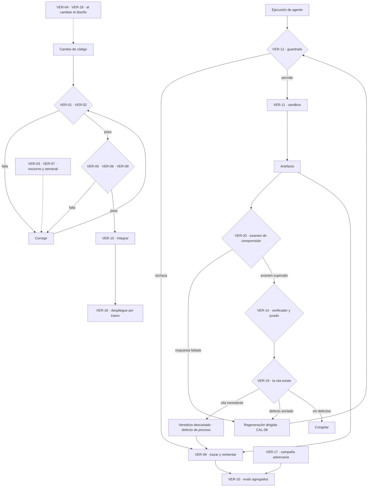

# verification.md

> Documentación de dominio · ver [`../AGENTS.md`](../AGENTS.md) para el índice completo.
> Relacionados: [definitions](definitions.md) · [domain-knowledge](domain-knowledge.md) · [architecture](architecture.md)

Catálogo de los métodos con los que se verifica que **el código es correcto** y que **la salida de los agentes es fiable**. No es una lista de comprobaciones concretas: es el mapa de qué técnica se aplica a qué artefacto, con qué garantía y a qué coste.

Regla de fondo: en un sistema sin intervención humana (PRO-11), la verificación es la única fuente de confianza que queda. Si un artefacto no está cubierto por ningún método de este documento, no está verificado, y eso se declara de forma explícita en §9 en vez de dejarse como suposición silenciosa.

---

## 1. Los dos ejes

| Eje | Pregunta | Objeto | Cuándo corre |
|---|---|---|---|
| **Producto** | ¿El código hace lo que dice? | `backend/` en Python y FastAPI, `frontend/` en React | En CI, antes de desplegar |
| **Proceso** | ¿El agente se comporta de forma fiable? | Trayectoria, llamadas a skills, prosa, delta canónico | En cada ejecución, y de forma agregada |

Los dos ejes son independientes. Un backend sin un solo bug puede orquestar agentes que escriben basura coherente, y un agente impecable no salva a un simulador de partidos con un error de signo. Verificar solo uno es el modo de fallo característico de los sistemas agénticos.

---

## 2. Clasificación TAIDU

Todo elemento verificable recibe **una** clase. La clase dice cómo se obtiene la confianza, no cuánta hay.

| Clase | Nombre | Se verifica | Garantía |
|---|---|---|---|
| **T** | Test | Ejecutando el sistema contra entradas concretas | Solo sobre lo ejecutado |
| **A** | Analysis | Razonamiento estático: tipos, SAST, ejecución simbólica, prueba formal | Sobre todas las entradas del dominio analizado |
| **I** | Inspection | Alguien lee y juzga: en este sistema, un modelo crítico, nunca una persona | Depende del juez; exige evidencia citada |
| **D** | Demonstration | Observando operación correcta en un escenario realista: staging, sandbox, ejecución sombra | Sobre el escenario observado |
| **U** | Unverifiable | Ningún método aplica, o no compensa su coste. Se nombra y se registra | Ninguna. Es riesgo aceptado |

**Reglas de asignación**

1. **A antes que T antes que D antes que I.** Si algo se puede decidir con tipos o con un solver, no se le pregunta a un modelo. Es la restricción «determinista antes que modelo» de `AGENTS.md` §5.3, punto 4, aplicada a la verificación.
2. **I solo para lo irreductiblemente subjetivo.** Tensión, subtexto y resonancia temática. Todo lo demás que caiga en I es un fallo de diseño: significa que no se ha sabido enunciar la regla.
3. **U se declara, no se hereda.** Un elemento no entra en U por olvido. Entra por decisión escrita, con motivo y con la señal que se vigilará en su lugar.
4. **Fallo cerrado.** Un método que no puede ejecutarse cuenta como fallado, nunca como pasado.

---

## 3. Mapa de métodos

| ID | Método | Eje | Clase | Dónde corre |
|---|---|:-:|:-:|---|
| VER-01 | Type checking | Producto | A | Pre-commit y CI |
| VER-02 | Static analysis y SAST | Producto | A | Pre-commit y CI |
| VER-03 | Symbolic execution | Producto | A | CI nocturno |
| VER-04 | Formal verification | Producto | A | Lean: antes de cada congelación. Modelo formal: al cambiar el diseño |
| VER-05 | Unit e integration testing | Producto | T | CI, en cada push |
| VER-06 | Property-based testing | Producto | T | CI, en cada push |
| VER-07 | Mutation testing | Producto | T | CI semanal |
| VER-08 | Contract testing | Producto | T | CI, en cada push |
| VER-09 | Runtime observability y tracing | Proceso | D | Siempre, en toda ejecución |
| VER-10 | Evals | Proceso | T · I | CI y por lotes |
| VER-11 | Sandboxed execution | Proceso | D | Siempre, en toda ejecución |
| VER-12 | Guardrails | Proceso | A | En línea, antes de cada acción |
| VER-13 | Human-in-the-loop review | Proceso | I | **Excluido del ciclo** · evaluación fuera de él, ver §5.5 |
| VER-14 | Multi-agent verification | Proceso | I | En línea, por artefacto |
| VER-15 | CI/CD integration | Proceso | T | En cada cambio de código |
| VER-16 | Progressive rollout | Proceso | D | Al cambiar prompt o modelo |
| VER-17 | Red-teaming | Proceso | T | Por campaña |
| VER-18 | Model checking | Proceso | A | Al cambiar el flujo |
| VER-19 | Anclaje de evidencia | Proceso | A | En línea, antes de aceptar cada veredicto |
| VER-20 | Examen de comprensión sin contexto | Proceso | T | Por capítulo, antes de su puerta |

---

## 4. Verificación de producto

### 4.1 VER-01 · Type checking

Comprobación automática de que los valores se usan de forma consistente con lo que las operaciones esperan: nunca un `str` donde se requiere un `int`.

| Atributo | Valor |
|---|---|
| **Qué verifica aquí** | Firmas del backend, formas de los DTO de la API, props del frontend, y sobre todo el **esquema de salida de cada agente**: `scene.spec`, el delta canónico (CAN-11, salida de `delta.extract`) y las puntuaciones de `*.audit` |
| **Clase** | A |
| **Herramienta** | `mypy --strict` o `pyright` en `backend/`; `tsc --strict` en `frontend/`; `pydantic` en la frontera HTTP y en el parseo de toda respuesta de modelo |
| **Límite** | No dice nada sobre el contenido. Un `chapter_number: int` bien tipado puede valer 47 en un libro de 30 capítulos |

La salida de un modelo entra al sistema como texto. El punto donde ese texto se convierte en objeto tipado es la frontera de confianza del sistema entero: todo lo que pase de ahí sin validar contamina el canon.

### 4.2 VER-02 · Static analysis y SAST

Escaneo del código fuente sin ejecutarlo, contra patrones conocidos como malos: vulnerabilidades, malos olores, antipatrones.

| Atributo | Valor |
|---|---|
| **Qué verifica aquí** | Inyección en las consultas al almacén canónico, secretos en el repositorio, `eval` sobre texto generado, rutas de fichero construidas con salida de modelo, dependencias con CVE, y **la frontera entre funcionalidades** de `architecture.md` §2.3 |
| **Clase** | A |
| **Herramienta** | `ruff` y `bandit` en `backend/`; `eslint` en `frontend/`; `semgrep` con reglas propias; `gitleaks` para secretos; `pip-audit` y `npm audit` para dependencias |
| **Límite** | Solo encuentra lo que alguien ya catalogó. Cero garantía sobre lógica de dominio |

Dos reglas propias que conviene escribir como patrón, porque ninguna herramienta las trae de serie:

1. **Ninguna cadena procedente de un modelo puede alcanzar una operación de sistema de ficheros, red o base de datos sin pasar antes por un validador de esquema.** Patrón de `semgrep`.
2. **Ninguna funcionalidad importa de otra funcionalidad**, solo de `commons/`, con dos excepciones: `orchestration/` importa de todas y de `canon/` importan todas en lectura (`architecture.md` §2.3). Se comprueba con `import-linter` en `backend/` y con la regla de fronteras de `eslint` en `frontend/`. Se deja en CI y no en convención porque es lo único que impide que el paquete por funcionalidad se convierta en capas técnicas con otro nombre al cabo de veinte ficheros.

### 4.3 VER-03 · Symbolic execution

Ejecución del código con entradas simbólicas para derivar, mediante un solver SMT, las condiciones exactas que lo rompen y un contraejemplo concreto.

| Atributo | Valor |
|---|---|
| **Qué verifica aquí** | Aritmética del calendario y las elipsis; el recálculo de la clasificación; el empaquetador de contexto, que nunca debe superar su presupuesto; el corte de fragmentos y la fusión por rangos de `architecture.md` §4.4; la resolución de precedencia del Árbitro |
| **Clase** | A |
| **Herramienta** | `CrossHair` sobre funciones puras con contrato; `z3` directamente para el calendario y el simulador de encuentros |
| **Límite** | Explota en coste con bucles y estado. Se aplica a funciones puras y pequeñas, no al orquestador |

Es el método adecuado justo para lo que los tests fallan en cubrir: el caso de frontera aritmético que aparece en el capítulo 28 de una tirada de 40.

### 4.4 VER-04 · Formal verification y theorem proving

Demostración matemática de que el código satisface una especificación para **todas** las entradas posibles, no solo las probadas o exploradas.

| Atributo | Valor |
|---|---|
| **Qué verifica aquí** | Dos objetos. **La historia**: la cronología del canon (MUN-05) se exporta a un fichero Lean con eventos, instante, personajes presentes, lugar y fechas de nacimiento, y se demuestran sus invariantes temporales —orden de los eventos, edad coherente con la fecha de nacimiento, nadie en dos lugares en el mismo instante, nadie presente tras un evento que lo excluye—. **El diseño**: que el protocolo de congelación no admite escritura en canon antes de superar la puerta, y que la política de precedencia PRO-10 es total y sin ciclos |
| **Clase** | A |
| **Herramienta** | `Lean 4` con `lake build` para la cronología, generado desde el SQLite de la novela; `TLA+` o `Alloy` para el diseño, sobre el modelo y no sobre el código |
| **Límite** | Lean prueba los hechos exportados, no que la prosa los narre; esa distancia la cubren VER-05 y los verificadores de CAL-03. El modelo del diseño prueba el modelo, no la implementación; esa distancia la cubren VER-18 y VER-05 |

Por qué estos dos objetos. Si la precedencia admite un ciclo, un conflicto de canon no tiene resolución, y sin persona a quien preguntar el sistema se detiene: es la clase de fallo que rompe la autonomía por construcción. Y la cronología es el único canon cuya coherencia se puede **demostrar** para todos los hechos a la vez, no solo muestrear: un fallo de Lean es un defecto S1 del capítulo que se iba a congelar, y vuelve al bucle de reparación como cualquier otro.

**Dónde corre Lean y qué pasa si no puede.** Antes de cada congelación, retcon y enmienda, sobre el canon más lo que va a entrar, y en la puerta de CI sobre una fixture limpia y otra sembrada (`specs/srs-backend-v4.md` RF-244 a RF-246 y RF-254). Por fallo cerrado, si `lake` no está la tirada no arranca, y agotar el tope de `lake build` cuenta como fallo. La fecha de nacimiento sale del atributo `birth_date`; si falta y hay edad, se deriva como intervalo y consta como derivada, y si faltan las dos el nacimiento se declara ausente: nunca se inventa.

### 4.5 VER-05 · Unit e integration testing

Comprobación del comportamiento contra entradas de ejemplo concretas y salidas esperadas.

| Atributo | Valor |
|---|---|
| **Qué verifica aquí** | Cada verificador determinista (CAL-03) con casos positivos y negativos; cada skill con su contrato de entrada y salida; el ciclo de vida del capítulo de extremo a extremo con modelos sustituidos por dobles |
| **Clase** | T |
| **Herramienta** | `pytest` y el `TestClient` de FastAPI en `backend/`; `vitest` y React Testing Library en `frontend/` |
| **Límite** | Solo cubre los ejemplos elegidos. Un test verde no dice nada sobre la entrada que nadie imaginó |

**Todo test que involucre un agente usa un doble determinista.** Un test que llama a un modelo real no es un test: es un eval (VER-10), es lento y no es reproducible.

### 4.6 VER-06 · Property-based testing

Enunciar una propiedad general que debe cumplirse para cualquier entrada, y generar muchas entradas automáticamente buscando una violación.

| Atributo | Valor |
|---|---|
| **Qué verifica aquí** | «El recálculo de la clasificación es invariante a la permutación de los encuentros»; «el paquete de contexto nunca supera 85.000 tokens al ensamblarse, ni 100.000 al llamar contando el cupo de tirón»; «la suma de las llamadas en vuelo nunca supera CTX-20, sea cual sea el orden de llegada» (CTX-I1); «fusionar dos deltas canónicos es asociativo»; «todo setup insertado aparece en la lista de deuda hasta cobrarse»; «congelar un capítulo no deja ninguna fila de memoria de trabajo» (PRO-I1); «reanudar desde un punto de reanudación produce el mismo capítulo que una tirada sin interrupción» (PRO-14); «lo estimado con `tiktoken` por su factor de seguridad nunca queda por debajo del recuento real que devuelve `usage`, sumados sus tres campos de entrada» (`architecture.md` §4.8); «un fragmento del índice de prosa nunca cruza la frontera de su escena»; «la fusión de §4.4 es determinista: el mismo canon produce el mismo paquete»; «ningún fragmento recuperado repite texto ya presente en el paquete» |
| **Clase** | T |
| **Herramienta** | `hypothesis` en `backend/`, con `fast-check` en `frontend/` si la lógica de proyección lo justifica |
| **Límite** | Encuentra contraejemplos, no demuestra ausencia. Y solo prueba lo que la propiedad enuncia |

Es el método con mejor relación coste-cobertura para este sistema, porque casi todos los invariantes de `definitions.md` ya están escritos como propiedades universales. Traducirlos es mecánico.

### 4.7 VER-07 · Mutation testing

Introducir bugs pequeños a propósito para comprobar si la batería de tests los detecta.

| Atributo | Valor |
|---|---|
| **Qué verifica aquí** | La batería que cubre los verificadores deterministas, y nada más al principio |
| **Clase** | T |
| **Herramienta** | `mutmut` o `cosmic-ray` |
| **Umbral** | **Propuesta**: ≥90 % de mutantes muertos en los verificadores deterministas, sin umbral en el resto del backend. Sale de exigir a los verificadores el mismo cero-tolerancia que ellos exigen al texto |
| **Límite** | Caro y lento. Por eso corre semanalmente y solo sobre el módulo crítico |

El motivo de acotarlo a los verificadores deterministas: son la red de seguridad del sistema entero. Un verificador con tests que no detectan su ruptura es peor que no tener verificador, porque produce confianza falsa.

### 4.8 VER-08 · Contract testing

Verificar que la interfaz entre dos servicios se mantiene consistente, con independencia de las tripas de cada lado.

| Atributo | Valor |
|---|---|
| **Qué verifica aquí** | Dos contratos distintos. El **HTTP**, entre `backend/` y `frontend/`, con el esquema OpenAPI que FastAPI genera como fuente de verdad. Y el **agente a agente**: el esquema JSON de `scene.spec`, del delta canónico (CAN-11) y de las puntuaciones de `*.audit`, que es lo que de verdad se rompe |
| **Clase** | T |
| **Herramienta** | `schemathesis` contra el OpenAPI; cliente TypeScript generado desde ese mismo esquema, de modo que el frontend no compile si el contrato cambia; los esquemas de artefacto versionados y probados en ambos lados |
| **Límite** | Verifica la forma, no el significado. Un delta canónico con la forma correcta y hechos falsos pasa |

El contrato entre agentes merece el mismo rigor que el HTTP. Un Planificador que añade un campo a `scene.spec` y un Escritor que lo ignora es un fallo silencioso: nada peta, la escena sale peor.

---

## 5. Verificación de proceso

### 5.1 VER-09 · Runtime observability y tracing

Instrumentar al agente para que su trayectoria real (llamadas a skills, tokens, latencia, errores) sea visible y consultable después.

| Atributo | Valor |
|---|---|
| **Qué verifica aquí** | Toda ejecución: qué contexto entró, qué skill se llamó, cuántos tokens consumió, qué defectos se dispararon, cuántos reintentos hubo. Es la implementación de PRO-09, trazabilidad |
| **Clase** | D |
| **Herramienta** | Traza local en fichero: un JSONL append-only por novela, junto a su SQLite, escrito desde `backend/commons/tracing`. Un registro por llamada a agente, nombrado por agente, capítulo e intento; los datos de `architecture.md` §11 van como campos del registro. Es la fuente de verdad: parte del estado de la tirada, se copia con ella. **Langfuse es su espejo** (`architecture.md` §11): sesión por novela, span por agente y por herramienta, scores de los verificadores y prompts versionados. Un fallo al exportar se registra y la tirada sigue |
| **Audit log** | Cada registro lleva el hash del anterior. Borrar, editar o reordenar una línea se detecta con `verify_chain`, así que la traza sirve también de audit log de las decisiones del motor de políticas —arbitraje, retcon, guardarraíl y verificación formal— sin duplicarse en tablas del canon |
| **Límite** | Observa, no juzga. Dice qué pasó, nunca si estuvo bien |

Es prerrequisito de casi todo lo demás: sin traza no hay eval reproducible (VER-10), ni diagnóstico de deriva (VER-16), ni evidencia de un ataque (VER-17). Se instrumenta primero, no al final.

### 5.2 VER-10 · Evals

Pruebas estructuradas del comportamiento de un modelo o agente contra un conjunto de datos y un método de puntuación.

| Variante | Aplicación aquí |
|---|---|
| Golden dataset | El conjunto dorado CAL-10, con defectos sembrados, cada 5 capítulos |
| LLM-as-judge | El Jurado CAL-11 con rúbrica CAL-02 y evidencia citada |
| Task completion | ¿Cierra la novela con deuda narrativa cero y todos los arcos resueltos? |
| Adversarial | Entradas de VER-17 convertidas en casos fijos del conjunto |
| Live u online | Puntuación agregada por capítulo sobre ejecuciones reales, vigilada por el Supervisor |
| Conjunto de briefs | Cinco briefs versionados —semilla, adversarial, trampa temporal, destinatario menor con prohibiciones y dominio no deportivo—, una tirada por cada uno y una tabla brief × verificador generada desde las trazas, nunca escrita a mano |
| Evaluación humana de referencia | Una persona puntúa una novela ya congelada con la rúbrica del Jurado, y una comparación generada dice por dimensión cuánto se separan. Fuera del ciclo: ver §5.5 |

| Atributo | Valor |
|---|---|
| **Clase** | T cuando la puntuación es determinista, I cuando la da un juez |
| **Límite** | Mide contra el conjunto que alguien eligió. Un eval en verde dice que el sistema sigue haciendo lo que ese conjunto cubre, nunca que la novela sea buena |

El conjunto dorado existe justamente porque detecta que un juez ha dejado de detectar: es lo que sustituye a la calibración por revisión manual.

### 5.3 VER-11 · Sandboxed execution

Ejecutar el código del agente en un entorno aislado, de modo que una acción mala falle sin consecuencias en vez de llegar a producción.

| Atributo | Valor |
|---|---|
| **Qué verifica aquí** | El backend entero, que es el único proceso (`architecture.md` §7.4) y por tanto toda llamada a agente, corre en un contenedor sin más red que la de Claude y la del espejo de observabilidad, Langfuse, porque los embeddings son locales (`architecture.md` §4.8), con el sistema de ficheros acotado al directorio de la tirada y con el canon montado en **solo lectura**. La escritura al canon pasa exclusivamente por el Archivero tras congelar |
| **Clase** | D |
| **Límite** | Contiene el daño, no lo previene. Un agente sandboxeado puede seguir escribiendo prosa incoherente con total libertad |

### 5.4 VER-12 · Guardrails

Políticas o filtros que acotan qué acciones y qué salidas puede producir un agente, **antes** de que actúe.

| Guardrail | Regla |
|---|---|
| Esquema de salida | Toda respuesta valida contra su esquema JSON o se rechaza sin parsear |
| Lista de skills permitidas | Cada agente declara las suyas; una llamada fuera de lista se rechaza y se traza |
| Techo de tokens por llamada | Entrada ≤100.000 por llamada y ≤85.000 al ensamblarse el paquete; salida ≤50.000, que no cuenta contra el techo de entrada. Comprobado antes de llamar |
| Techo de concurrencia (CTX-20) | La llamada se admite solo si lo que está en vuelo más su presupuesto no supera 100.000. Si no cabe, se encola en FIFO estricta. Si el presupuesto no se puede estimar, no se admite |
| Léxico proscrito | La lista de proscripción de la capa POE, en su nivel `estilo`, se filtra en la salida del Estilista |
| Palabras prohibidas del encargo | `check.forbidden`, S1, en cada intento de escena y sobre el capítulo entero antes de congelar. Normaliza mayúsculas, tildes, plurales y variantes simples y compara por palabra completa. Agotada la escalera, la tirada para con el motivo. Tres niveles: global, cliente y novela |
| Canon de solo lectura | Ningún agente salvo el Archivero puede emitir una escritura canónica |
| Argumentos de herramienta | `canon.lookup` rechaza tipos cambiados, claves de más y JSON malformado; no los coerciona |
| Hooks de Claude Code | Sobre el agente de desarrollo, no sobre el sistema: un hook valida un fichero de capítulo con los verificadores reales y otro aplica la política —canon de solo lectura, secretos, lista global— y registra cada decisión. Fallan cerrados |

| Atributo | Valor |
|---|---|
| **Clase** | A. Son comprobaciones estáticas sobre la acción propuesta, no pruebas |
| **Límite** | Acotan la **forma** de la acción, nunca su contenido. Un delta canónico con la forma correcta y los hechos falsos pasa todos los guardarraíles sin que salte ninguno |

Es la capa más barata y la que más incidentes evita, porque actúa antes de gastar la llamada.

### 5.5 VER-13 · Human-in-the-loop review — excluido

Una persona aprueba, rechaza o edita las acciones de alto impacto, y su decisión se realimenta como señal de entrenamiento.

**Este método está excluido de este sistema.** No por coste ni por preferencia: contradice PRO-11 y la primera restricción de `AGENTS.md` §5.3. Se documenta aquí porque forma parte del catálogo y porque conviene que quede escrito qué ocupa su lugar.

La tabla de sustitutos vive en [`architecture.md`](architecture.md) §8 y no se repite aquí: mantener dos copias de la misma tabla es garantizar que una se quede atrás. En corto: lo que haría la persona lo hacen las puertas con umbral (CAL-09), el Árbitro con la precedencia PRO-10, el conjunto dorado (CAL-10) con la dispersión del jurado (CAL-11), y la cuarentena (CAL-13) con la replanificación (PRO-12).

La única entrada humana del sistema es el brief (PRO-01), inicial o enmendado después de una congelación (`architecture.md` §2.2). Eso es un encargo, no una revisión: cambia lo que se pide y no interrumpe el capítulo en curso.

**Fuera del ciclo sí hay lectura humana, y no es este método.** Una persona puede leer una novela ya congelada y puntuarla con las mismas dimensiones que el Jurado, para medir cuánto se parece el juicio del sistema al humano. Es un eval (VER-10) sobre un artefacto cerrado: no aprueba, no corrige y no entra en ninguna tirada, así que no toca PRO-11. Su resultado alimenta la calibración del Jurado, igual que el conjunto dorado.

Es el único método del catálogo sin línea de límite, y es correcto que no la tenga: un método excluido no cubre nada, así que no hay cobertura que acotar.

### 5.6 VER-14 · Multi-agent verification

Verificación por modelos que se vigilan entre sí.

| Variante | Quién la implementa |
|---|---|
| Critic o verifier | Continuista sobre la prosa del Escritor; Archivero sobre el delta |
| Self-consistency | Simulación del encuentro repetida con semillas distintas; se toma la mayoría |
| Debate | No se usa. El Árbitro decide por regla de precedencia, más barato y más reproducible que un debate |
| Reflection | Regeneración dirigida CAL-08: el agente reescribe con el defecto y su evidencia delante |
| Ensembles | Jurado CAL-11 con rúbricas o semillas distintas; la dispersión alta invalida el veredicto |

| Atributo | Valor |
|---|---|
| **Clase** | I |
| **Límite** | El verificador es otro modelo, así que comparte modos de fallo con el generador. Detecta lo que el generador hizo mal, no lo que ambos entienden mal igual |

Dos condiciones innegociables, o el método produce confianza falsa: **aislamiento**, el verificador no ve el razonamiento del generador, y **evidencia**, todo veredicto cita el fragmento exacto o se descarta.

### 5.7 VER-15 · CI/CD integration

Enrutar los cambios generados por agentes por el mismo pipeline, los mismos tests y la misma revisión que el código escrito por personas, con etiquetado de procedencia.

| Atributo | Valor |
|---|---|
| **Qué verifica aquí** | Ningún cambio en `backend/` o `frontend/` llega a la rama principal sin pasar VER-01, VER-02, VER-05, VER-06 y VER-08 en verde |
| **Clase** | T |
| **Procedencia** | Cada commit generado por agente lleva su autoría y el identificador de la tirada y de la llamada en su traza local en el pie del mensaje, de modo que todo cambio se puede devolver a la ejecución que lo produjo |
| **Límite** | Verifica el código del sistema. No dice nada sobre la novela que ese código produce |

### 5.8 VER-16 · Progressive rollout

Desplegar un cambio tras un feature flag, a un porcentaje pequeño del tráfico, vigilado antes de liberarlo del todo.

| Atributo | Valor |
|---|---|
| **Qué verifica aquí** | El equivalente al tráfico es el **capítulo**. Un prompt nuevo o un modelo nuevo se activa por flag en un tramo corto, y sus métricas de calidad se comparan con la tirada de referencia antes de generalizarlo |
| **Clase** | D |
| **Umbral** | **Propuesta**: activación en 3 capítulos y promoción solo si ninguna dimensión de CAL-01 empeora. El 3 sale del presupuesto de reintentos a nivel de escena que ya fija `architecture.md` §7 |
| **Límite** | Detecta regresiones medibles. Un aplanamiento estilístico lento cae por debajo del radar en 3 capítulos |

Cambiar el prompt de un agente es un despliegue. Tratarlo como una edición de texto es cómo se degrada un sistema agéntico sin que nadie sepa cuándo empezó.

### 5.9 VER-17 · Red-teaming

Sondear fallos a propósito bajo un modelo de amenaza adversario, no solo error ordinario.

| Amenaza | Vector concreto aquí |
|---|---|
| Prompt injection | Instrucciones incrustadas en el brief —incluido el texto libre que la entrevista extrae y una enmienda pedida desde la lectura—, o en un nombre de personaje que luego entra en todos los paquetes de contexto |
| Tool misuse chains | Encadenar `retcon.propose` con la reparación dirigida para reescribir canon ya congelado |
| Goal drift | El Escritor optimizando la puntuación del Jurado en lugar de la escena; deriva de género a lo largo de 40 capítulos |
| Data exfiltration | Salida de modelo que construye una ruta o una URL para salir del sandbox |
| **Envenenamiento de canon** | Un agente emite un delta que reescribe un hecho para que su propia salida deje de ser incoherente |

La última es la amenaza propia de este sistema y la más difícil de ver, porque después del ataque todo valida. La contramedida es estructural, no un filtro: el canon es de escritura exclusiva del Archivero (VER-11), todo delta pasa por arbitraje, y el retcon exige que el hecho no esté cobrado en ningún payoff.

| Atributo | Valor |
|---|---|
| **Clase** | T |
| **Límite** | Solo encuentra lo que la campaña buscó. Una amenaza que nadie llegó a enunciar no aparece, y la cobertura caduca en cuanto cambian los prompts o el modelo |

Cada hallazgo se convierte en caso fijo del conjunto de VER-10, o la campaña no deja residuo.

### 5.10 VER-18 · Model checking

Explorar de forma exhaustiva los estados y transiciones alcanzables del flujo para verificar invariantes. Es el análogo, a nivel de flujo multiagente, de la ejecución simbólica.

| Atributo | Valor |
|---|---|
| **Qué verifica aquí** | La tirada entera de `architecture.md` §7: configuración, planificación, cada capítulo con su ciclo de vida, caída y reanudación, enmiendas entre congelaciones y publicación de cada versión. El capítulo es un modelo propio que el de la tirada usa como subacción |
| **Invariantes** | «Nunca se publica una versión con un capítulo que no pasó todas sus puertas», y dentro del capítulo «nunca se congela sin superar todas las puertas»; «ningún capítulo se congela dos veces» y «la reanudación no pierde capítulos»; «lo que mostraba una versión al dejar de ser la vigente es lo que sigue mostrando»; «los reintentos nunca superan la escalera de RF-18, tampoco sumando caídas»; «nunca se escribe canon antes de congelar»; «toda reparación revalida desde la primera puerta»; «nunca hay más de CTX-20 tokens en vuelo», que es CTX-I1; «tras reanudar no queda borrador posterior al punto cerrado», que es PRO-I2 y se comprueba sobre el estado que deja la reanudación, no por construcción; «una enmienda solo se aplica entre congelaciones». Cada uno lo rompe al menos una mutación versionada: un invariante que ninguna mutación rompe es sospechoso de vacuidad |
| **Propiedad de vivacidad** | «Toda generación acaba publicada o abortada», con equidad débil sobre las acciones de progreso y nunca sobre la caída, que se acota. Incluye «no hay ciclo que evite la cuarentena para siempre» |
| **Clase** | A |
| **Herramienta** | `TLA+` con TLC sobre el modelo de estados, con `tla2tools.jar` en versión fija. La salida de cada ejecución se guarda con su commit, y un README relaciona cada acción con la función del código que la implementa. Los modelos están en `backend/orchestration/model/` y `run_tlc.sh` guarda cada salida en `tlc/` |
| **Límite** | Prueba el flujo modelado, no el orquestador que lo implementa. Esa distancia la cubre VER-05 |

El tercer invariante es el que más se rompe en la práctica: revalidar solo desde el punto que falló deja pasar la corrección de estilo que rompió la continuidad.

El modelo de la tirada lleva como banderas las correcciones que el código aún no tiene: `run.cfg` las activa y cada configuración de `code-today/` da el contraejemplo del código actual (`backend/orchestration/model/README.md` §7.1).

### 5.11 VER-19 · Anclaje de evidencia

Comprobar que la cita con la que un modelo justifica un veredicto **existe de verdad** en el texto que dice citar.

| Atributo | Valor |
|---|---|
| **Qué verifica aquí** | Toda salida que este sistema exige acompañada de evidencia: los defectos del Continuista, las puntuaciones de las skills `*.audit`, los veredictos del Jurado y los defectos que devuelven los verificadores deterministas |
| **Clase** | A. Es una coincidencia de cadenas sobre la acción propuesta, no una prueba ni un juicio |
| **Herramienta** | `check.evidence` en `backend/`, contra la escena que la cita nombra. El Continuista ancla contra el capítulo entero y deduce la escena; el Jurado prueba la escena nombrada y, si ahí no ancla, la única escena del capítulo que contiene la cita (D-66) |
| **Regla de coincidencia** | La cita se normaliza —espacios, comillas tipográficas, guiones de diálogo, mayúsculas, y la barra de salto de párrafo y los puntos suspensivos tipográficos (D-65)— y debe aparecer **exactamente una vez** en la escena donde ancla, con **8 palabras o más**. Nada de lematización ni de coincidencia difusa |
| **Si falla** | El veredicto se descarta sin evaluarlo y se anota como **defecto de proceso** de esa instancia, nunca como defecto del texto. No detiene la producción |
| **Límite** | Comprueba que la cita existe, jamás que sostenga lo que se afirma con ella. Un pasaje real citado para justificar algo que no dice pasa entero |

Por qué merece método propio y no una línea dentro de VER-12: hoy «sin cita no hay defecto» es **una instrucción de prompt**, y una instrucción de prompt la cumple formalmente cualquier modelo inventándose la cita. Sin esta comprobación, el requisito de evidencia que atraviesa el sistema entero —CAL-04, el contrato de las skills de auditoría, `AGENTS.md` §5.3 punto 5— no está verificado por nada: solo pedido con educación.

Los dos fallos que evita son simétricos y los dos son caros. Una **cita falsa que acusa** hace que el sistema repare una escena sana, gaste presupuesto de reintentos (CAL-12) y con frecuencia la empeore. Una **cita falsa que absuelve** deja pasar un defecto real hasta canon, donde ya solo lo saca un retcon.

De dónde salen sus dos números. El **8** no es nuevo: `check.repetition` ya trata el n-grama de 4 como unidad detectable, y dos de esos localizan sin ambigüedad. La **unicidad** no es rigor por gusto, es lo que convierte la cita en una posición: si aparece una sola vez, el sistema sabe dónde reparar sin preguntárselo a ningún modelo, y el Reparador recibe el fragmento exacto. Si aparece dos veces, la cita es inválida y el juez tiene que alargarla, que le cuesta cero.

Es el método más barato del catálogo —una búsqueda de texto— y el que convierte en clase A un requisito que hasta ahora dependía de la buena fe de un modelo.

### 5.12 VER-20 · Examen de comprensión sin contexto

Dar el capítulo a un modelo que **no tiene nada más delante** y preguntarle por los hechos que ese capítulo debía transmitir, corrigiendo sus respuestas contra un solucionario construido de antemano.

| Atributo | Valor |
|---|---|
| **Qué verifica aquí** | Que la información que la escaleta encargó al capítulo llegó a la página, y no solo al estado del mundo |
| **Clase** | T. Entradas concretas con respuesta esperada. El modelo es el instrumento que lee; la corrección es determinista |
| **Herramienta** | `quiz.build` genera preguntas y solucionario desde la especificación de escena y el canon vigente en ese punto; `quiz.answer` responde viendo solo el capítulo; `quiz.grade` corrige |
| **Aislamiento** | El paquete de `quiz.answer` es el capítulo, las preguntas y la instrucción. **Sin prefijo cacheable, sin canon, sin fichas, sin rúbrica.** Un lector que ve el canon examina lo que ya sabía |
| **Si falla** | Cada respuesta errónea es un defecto **S2** y entra en el bucle de reparación por la puerta de capítulo que ya existe. Sin puerta nueva y sin umbral nuevo |
| **Límite** | Mide que la información llegue, nunca que llegue bien contada. Un capítulo plomizo y clarísimo saca un diez |

**Las preguntas salen de lo que se encargó, nunca de lo que el capítulo dijo.** Es la decisión que sostiene el método. Generadas desde el delta extraído del propio capítulo, la pregunta sería «¿dijiste lo que dijiste?»: circular, y aprueba siempre. Generadas desde la especificación de escena, la pregunta es «¿entregaste lo que se te pidió?». Y por el mismo motivo no las escribe un modelo: **una pregunta sin solucionario garantizado devuelve esto a la condición de juez**, que es justo lo que se estaba evitando.

Qué modo de fallo ataca, y que ningún otro método ve. Todo lo que revisa este sistema lo revisa **con el canon delante**, así que aprueba un capítulo que resulta coherente para quien ya sabe la respuesta y opaco para quien solo tiene el texto. El hecho vive en el estado del mundo y no en la página, y ningún revisor con contexto puede notar la diferencia, porque comparte exactamente la misma ventaja. Es el defecto que convierte una novela correcta en una novela ilegible, y es invisible para VER-14 por construcción.

Es además lo más cerca que llega el catálogo de la fila «que la novela interese a un lector real» de §9. No mide el interés —eso sigue en U— pero sí una condición **necesaria** para que lo haya: que se entienda.

**Quién lo dispara.** El Orquestador, en código, al cerrar el capítulo y antes de su puerta. No lo invoca un agente por el mismo motivo por el que el tope de salida lo aplica `dispatch` y no el modelo (`architecture.md` §5.3): **un examen que el examinado decide si se presenta no es un examen.**

---

## 6. Cascada de verificación

El eje de producto y el de proceso se cruzan en un solo punto: los evals agregados (VER-10) son lo que decide si un cambio de código o de prompt se promociona en VER-16.

Dos detalles de orden que no son decorativos. **VER-20 corre antes que VER-14**, porque es más barato y porque un capítulo que no transmite lo que debía no merece que se le mida la voz. Y **VER-19 corre después de VER-14 y antes del bucle de reparación**, que es el único sitio donde sirve: filtra los veredictos antes de que cuesten una regeneración.

---

## 7. Matrices de cobertura

### 7.1 Método × artefacto

| Artefacto | Métodos que lo cubren | Clase dominante |
|---|---|---|
| Lógica de dominio del backend | VER-01, 02, 03, 05, 06, 07 | A |
| API HTTP | VER-01, 02, 05, 08 | T |
| Frontend | VER-01, 02, 05, 06, 08 | T |
| Verificadores deterministas CAL-03 | VER-05, 06, 07 | T |
| Flujo del orquestador | VER-05, 18 | A |
| Memoria de trabajo PRO-13 | VER-01, 05, 06 | T |
| Reanudación de una tirada | VER-06, 18 | A |
| Versiones del manuscrito y enmiendas | VER-05, 18 | A |
| Cronología del canon MUN-05 | VER-04, 05 | A |
| Guardarraíl de palabras prohibidas | VER-05, 06, 12 | A |
| Espejo de observabilidad y audit log | VER-05, 06, 09 | D |
| Hooks del trabajo de desarrollo | VER-05, 12 | A |
| Lectura visual del manuscrito | VER-05 | T |
| Conjunto de evaluación del sistema | VER-10, 16 | T · I |
| Prompt de un agente | VER-10, 16, 17 | T · D |
| Prosa generada | VER-10, 14, 20 | T · I |
| Delta canónico | VER-08, 12, 14, 17 | A · I |
| Veredicto de un juez o del Continuista | VER-09, 19 | A |
| Trayectoria de ejecución | VER-09, 11, 12 | D |
| Controlador de admisión CTX-20 | VER-06, 12, 18 | A |
| Contador de tokens | VER-06, 09, 12 | T · A |
| Índice de prosa y sus vectores | VER-05, 06 | T |
| Pipeline de recuperación híbrida | VER-03, 05, 06, 09 | A · T |
| Recetas de paquete por agente | VER-06, 12 | T · A |

Toda fila tiene al menos un método. Cuando una fila nueva no lo tenga, va a §9 antes de escribir el código, no después.

### 7.2 Punto ciego × método que lo tapa

La matriz anterior responde «¿está cubierto este artefacto?». Esta responde la pregunta que de verdad decide cuánta confianza hay: **«¿está cubierto el punto ciego de este método?»**. Cada fila cruza la línea **Límite** que el propio método ya declara en §4 y §5 con quién se hace cargo de ella.

| Método | Su punto ciego, tal como él mismo lo declara | Qué lo tapa |
|---|---|---|
| VER-01 | Tipo correcto con valor imposible | VER-03, VER-06 y los verificadores CAL-03 vía VER-05 |
| VER-02 | Solo encuentra lo ya catalogado; nada sobre lógica de dominio | VER-03, VER-05, VER-06 |
| VER-03 | Explota en coste con bucles y estado | VER-06 sobre lo que no es función pura |
| VER-04 | En el diseño, prueba el modelo y no la implementación; en la cronología, prueba los hechos exportados y no que la prosa los narre | VER-07 sobre los módulos afectados, y §9; en la cronología, VER-05 y los verificadores CAL-03 sobre la prosa |
| VER-05 | Solo los ejemplos elegidos | VER-06, VER-07 |
| VER-06 | Encuentra contraejemplos, no demuestra ausencia | VER-03, y VER-04 en sus dos propiedades |
| VER-07 | Caro y lento; solo cubre el módulo crítico | **§9, riesgo aceptado** |
| VER-08 | Verifica la forma, no el significado | VER-19 para lo citable, VER-14 para el resto |
| VER-09 | Observa, no juzga | VER-10, VER-14 |
| VER-10 | Mide contra el conjunto elegido, que caduca | VER-17, que le añade casos por campaña |
| VER-11 | Contiene el daño, no lo previene | VER-12 |
| VER-12 | Acota la forma de la acción, no su contenido | VER-19, VER-20, VER-14 |
| VER-13 | Excluido; no cubre nada | — |
| VER-14 | El verificador comparte modos de fallo con el generador | CAL-10 dentro de VER-10, y VER-19, que es código y no comparte ninguno |
| VER-15 | Verifica el código, no la novela que produce | VER-10, VER-14, VER-20 |
| VER-16 | El aplanamiento lento cae bajo el radar en 3 capítulos | **§9, riesgo aceptado**, con la huella estilística como señal |
| VER-17 | Solo lo que la campaña buscó, y caduca al cambiar prompts | VER-10, si cada hallazgo deja caso fijo |
| VER-18 | Prueba el flujo modelado, no el orquestador | VER-05 |
| VER-19 | La cita existe pero no sostiene lo que se afirma | VER-14, que lee cita y veredicto juntos, y **§9** |
| VER-20 | Mide que la información llegue, no que esté bien contada | VER-14, VER-10 |

**La regla que impone esta matriz**: todo punto ciego declarado tiene al menos otro método que lo tapa, o una fila propia en §9. Un método nuevo entra aquí en el mismo cambio en que entra en §3. Un límite sin cobertura y sin fila en §9 es una zona de confianza sin fundamento, que es exactamente lo que este documento existe para que no ocurra.

Y la lectura que da de un vistazo: las tres casillas cuya única cobertura es «riesgo aceptado» —VER-07, VER-16 y el límite semántico de VER-19— son, por construcción, los tres sitios por donde este sistema fallará primero.

---

## 8. Cómo se elige el método

1. Enunciar qué debe ser cierto, como condición verificable. Si no se puede enunciar así, no es un requisito: es una preferencia, y va a la guía de estilo.
2. Aplicar la clase más alta posible según §2: primero A, luego T, luego D, y solo entonces I.
3. Si la clase resultante es I, comprobar que la dimensión es de verdad subjetiva. Casi nunca lo es.
4. Si ningún método aplica, registrarlo en §9 con su motivo y la señal sustitutiva. No dejarlo en blanco.
5. Asignar ID `VER-NN` con el siguiente número libre y añadirlo a la tabla de §3, a la matriz de §7.1 y a la de §7.2 **con su línea de límite ya escrita**. Un método sin punto ciego declarado no está entendido: significa que todavía no se sabe qué deja pasar.

---

## 9. Registro de riesgo aceptado

Lo que este catálogo **no** verifica, dicho de forma explícita. Es la clase U de §2.

| Riesgo | Por qué queda en U | Señal que se vigila en su lugar |
|---|---|---|
| Que una escena sea memorable | No hay criterio operativo de gusto, y el sistema no tiene a quién preguntárselo | Suelo del conjunto dorado CAL-10 y huella estilística |
| Aplanamiento estilístico lento a lo largo de 40 capítulos, **en lo que la huella no captura**: imagen, tono, riqueza que no se mide en cinco métricas | Cada capítulo aislado pasa todas las puertas; el defecto solo existe en el agregado. La parte observable ya no está aquí: la deriva sostenida de la huella la detecta `verification/style/` y la vigila el Supervisor (RF-138, RF-146) | La muestra modélica por puntuación del Jurado, que reintroduce juicio en la referencia de voz |
| Que la novela interese a un lector real | Fuera del alcance de cualquier método automático | VER-20 vigila la condición **necesaria**: que el texto se entienda sin el canon delante. El interés en sí, ninguna |
| Que una cita real sostenga de verdad la afirmación que la acompaña | Comprobarlo exige entender el texto, y eso devuelve el problema a un modelo con los mismos modos de fallo que el que citó. VER-19 llega hasta la existencia literal y ahí se para | La cita es literal y única, así que el pasaje siempre se puede contrastar; y la tasa de citas descartadas por VER-19, por instancia, queda en la traza de VER-09 |
| Que el modelo cambie de comportamiento tras una actualización del proveedor | No es observable por adelantado | Conjunto dorado ejecutado en cada cambio de versión de modelo, más VER-16 |
| Que el proveedor de embeddings cambie el modelo y los vectores dejen de ser comparables entre sí | El cambio ocurre fuera del sistema y no se anuncia | Cada vector guarda su modelo y dimensión (`architecture.md` §3.1); una mezcla dispara reindexación completa |
| Corrección de la implementación frente al modelo formal de VER-04 y VER-18 | La prueba cubre el modelo; cerrar la distancia exigiría código verificado, que no compensa | Cobertura de mutación de VER-07 sobre los módulos afectados |
| Una palabra común al principio de frase, a una edición de un nombre corto del canon, que no sale en minúscula en la escena: `check.lexicon` la toma por errata y da un falso S1, como «Llena» con Elena en el canon | Sin diccionario del español no se distingue de una errata. La lista de palabras comunes lo reduce, no lo elimina | El defecto dice «variante mal escrita de X» y cita la palabra, así que el Reparador lo ve y la traza cuenta cuántos hay |
| Que un tema prohibido del brief aparezca en la prosa | Un tema no se detecta sin modelo; la palabra prohibida sí, y esa la cubre VER-12 | Las dimensiones de tono y tema del Jurado, y la evaluación humana de referencia |

Un riesgo en esta tabla es una decisión, no una omisión. Sacar una fila de aquí exige un método; meter una nueva exige motivo y señal.

---

## 10. Referencias canónicas

Un enlace por método, a la **explicación de la metodología**, nunca a la página de un producto. Están aquí y no repetidos en cada apartado de §4 y §5, que es donde se decide qué hace cada método *en este sistema*; esto es lo que el método es en general.

| ID | Método | Referencia |
|---|---|---|
| VER-01 | Type checking | [Type system — Wikipedia](https://en.wikipedia.org/wiki/Type_system) |
| VER-02 | Static analysis y SAST | [Static program analysis — Wikipedia](https://en.wikipedia.org/wiki/Static_program_analysis) |
| VER-03 | Symbolic execution | [Symbolic execution — Wikipedia](https://en.wikipedia.org/wiki/Symbolic_execution) |
| VER-04 | Formal verification | [Formal verification — Wikipedia](https://en.wikipedia.org/wiki/Formal_verification) |
| VER-05 | Unit e integration testing | [Unit testing — Wikipedia](https://en.wikipedia.org/wiki/Unit_testing) |
| VER-06 | Property-based testing | [QuickCheck — Claessen y Hughes, 2000](https://dl.acm.org/doi/10.1145/351240.351266) |
| VER-07 | Mutation testing | [Mutation testing — Wikipedia](https://en.wikipedia.org/wiki/Mutation_testing) |
| VER-08 | Contract testing | [Contract Test — Martin Fowler](https://martinfowler.com/bliki/ContractTest.html) |
| VER-09 | Runtime observability y tracing | [Observability primer — OpenTelemetry](https://opentelemetry.io/docs/concepts/observability-primer/) |
| VER-10 | Evals | [Holistic Evaluation of Language Models — Liang et al., 2022](https://arxiv.org/abs/2211.09110) |
| VER-11 | Sandboxed execution | [Sandbox, computer security — Wikipedia](https://en.wikipedia.org/wiki/Sandbox_(computer_security)) |
| VER-12 | Guardrails | [AI Risk Management Framework — NIST](https://www.nist.gov/itl/ai-risk-management-framework) |
| VER-13 | Human-in-the-loop review | [Human-in-the-loop — Wikipedia](https://en.wikipedia.org/wiki/Human-in-the-loop) |
| VER-14 | Multi-agent verification | [AI Safety via Debate — Irving, Christiano y Amodei, 2018](https://arxiv.org/abs/1805.00899) |
| VER-15 | CI/CD integration | [Continuous integration — Wikipedia](https://en.wikipedia.org/wiki/Continuous_integration) |
| VER-16 | Progressive rollout | [Feature toggle — Wikipedia](https://en.wikipedia.org/wiki/Feature_toggle) |
| VER-17 | Red-teaming | [OWASP Top 10 for LLM Applications](https://owasp.org/www-project-top-10-for-large-language-model-applications/) |
| VER-18 | Model checking | [Model checking — Wikipedia](https://en.wikipedia.org/wiki/Model_checking) |
| VER-19 | Anclaje de evidencia | [Measuring Attribution in Natural Language Generation — Rashkin et al., 2021](https://arxiv.org/abs/2112.12870) |
| VER-20 | Examen de comprensión sin contexto | [SQuAD: 100,000+ Questions for Machine Comprehension of Text — Rajpurkar et al., 2016](https://arxiv.org/abs/1606.05250) |
| — | Clasificación TAIDU | [Verification and validation — Wikipedia](https://en.wikipedia.org/wiki/Verification_and_validation) |

Las referencias de VER-19 y VER-20 son **analogías, no fuentes de la implementación**: aquí el anclaje se resuelve con coincidencia literal y no con un modelo de atribución, y el examen se corrige contra un solucionario propio y no contra un conjunto público. Están porque nombran el problema, que es lo que hace falta para buscar más.

**Property-based testing y evals no tienen referencia fundacional neutral** como sí la tiene la verificación formal. Los dos enlaces apuntan al trabajo que introdujo o formalizó cada uno, QuickCheck y HELM, que es una elección entre varias posibles y no la única.
