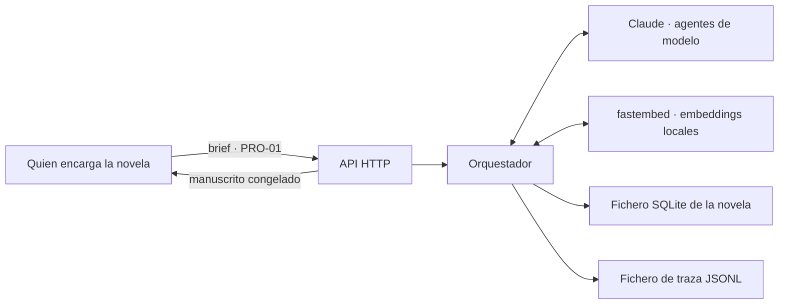

# SRS · Backend de Story-Maker · versión 1

> Especificación de requisitos de software de la primera versión de `backend/`. Refina [`architecture.md`](../docs/architecture.md) hasta el punto en que se puede escribir código; no la sustituye. Vocabulario: [`definitions.md`](../docs/definitions.md). Modelos: [`domain-knowledge.md`](../docs/domain-knowledge.md). Métodos: [`verification.md`](../docs/verification.md). Reglas del repositorio y convención de esta carpeta: [`AGENTS.md`](../AGENTS.md) §3.3.

---

## 1. Introducción

### 1.1 Propósito

Este documento fija **qué debe hacer la primera versión del backend** para que un equipo la construya sin volver a decidir nada que los cuatro documentos de `docs/` ya decidieron. Cada requisito lleva su fuente en esos documentos y el método `VER-NN` que lo comprueba.

Lo que no está aquí no es de la versión 1. Lo que está aquí y contradice a `architecture.md` es un error de este documento y se corrige aquí, nunca al revés (`AGENTS.md` §3.3).

### 1.2 Alcance

La versión 1 es el **sistema mínimo autónomo**: los pasos 1 a 6 del orden de construcción de `architecture.md` §14, que son los que producen una novela coherente sin intervención (`AGENTS.md` §8). Del brief (PRO-01) al manuscrito congelado, sin que nadie apruebe nada.

| Entra en la versión 1 | Sale de la versión 1 |
|---|---|
| Canon estructurado, registro de eventos y grafo de entidades (paso 1) | Resúmenes de arco y de obra (paso 7) |
| Índice de prosa en dos niveles, con sus vectores, escrito al congelar | Afinado de la recuperación contra el conjunto dorado (paso 8) |
| Escaleta y especificación de escena (paso 2) | Jurado, conjunto dorado y Estilista (paso 9) |
| Documentalista completo: recetas de paquete y recuperación híbrida (paso 3) | Supervisor, replanificación por métricas y cuadro de mando (paso 10) |
| Escritor, Especialista deportivo y verificadores deterministas (paso 4) | Frontend (paso 11) |
| Continuista y Reparador, que cierran el bucle de §7.1 | Retcon sobre capítulos congelados (CAN-10): aquí el canon congelado siempre gana |
| Archivero y congelación (paso 5) | |
| Árbitro y política de precedencia (paso 6) | |
| Orquestador, admisión CTX-20, reanudación y bucle de herramientas | |
| Rutas HTTP mínimas dentro de cada funcionalidad | |
| Traza local por tirada desde el primer día | |

Diez agentes de los trece de `architecture.md` §6 participan: 0 Orquestador, 1 Arquitecto, 2 Planificador, 3 Documentalista, 4 Escritor, 5 Especialista deportivo, 6 Continuista, 8 Reparador, 10 Archivero y 11 Árbitro. Quedan fuera 7 Jurado, 9 Estilista y 12 Supervisor.

**Por qué esta frontera y no otra.** Los pasos 7 a 10 compran escala y calidad, no viabilidad. La versión 1 garantiza coherencia factual, temporal y deportiva; no garantiza todavía calidad literaria medida, porque eso lo aportan el Jurado y el Estilista. Es una limitación declarada, no un olvido.

**Por qué la recuperación híbrida sí entra.** `architecture.md` §4.4 la deja resuelta con dos piernas sobre el mismo índice, fusión por rangos y selección por cupos, todo determinista y sin una sola llamada de modelo extra. Escribir primero la mitad léxica y añadir la semántica después obligaría a escribir dos veces la fusión y los cupos, que es el grueso del trabajo. Lo que queda para el paso 8 es medir y afinar, no construir.

### 1.3 Definiciones

Todo el vocabulario es el de `definitions.md`, referenciado por ID. Este documento no introduce términos nuevos. Los cuatro que más se usan:

| ID | Término | En una frase |
|---|---|---|
| CTX-03 | Paquete de contexto | Lo único que un agente de modelo ve en cada llamada |
| CTX-09 | Recuperación híbrida | Buscar por significado, por palabra y por clave, porque ninguna de las tres basta sola |
| CAN-11 | Delta canónico | Lo que un capítulo cambia en el mundo, extraído y validado antes de congelar |
| CAN-12 | Congelación | El único momento en que la prosa pasa a ser canon y crece el índice |

«Fragmento» es el término que `architecture.md` §3.1 y §4.3 ya usan para la unidad recuperable del índice de prosa. No es vocabulario nuevo.

### 1.4 Referencias

| Documento | Qué aporta a este SRS |
|---|---|
| `docs/definitions.md` | Ontología, IDs e invariantes. Los invariantes son la fuente de casi todos los requisitos verificables por propiedad |
| `docs/domain-knowledge.md` | §8 cronología y estado, §13 composición del paquete, §15 ciclo de vida del capítulo |
| `docs/architecture.md` | Reparto físico (§2), memoria y escritura del índice (§3), presupuestos, recuperación y recetas (§4), skills (§5), agentes (§6), flujos (§7), arbitraje (§8), puertas (§9), escritura de canon (§10), observabilidad (§11), orden de construcción (§14) |
| `docs/verification.md` | Método `VER-NN` de cada requisito y puerta de CI |
| `AGENTS.md` | Restricciones no negociables (§5.3), stack (§3.1), persistencia (§3.2) |

### 1.5 Convenciones de este documento

- Los requisitos se numeran `RF-NN` (funcionales), `RD-NN` (datos), `RI-NN` (interfaces) y `RNF-NN` (no funcionales). Son estables dentro de este documento: no se reciclan ni se renumeran.
- «Debe» es obligatorio. «Puede» es opcional y se marca como tal. No hay «debería».
- Cada requisito lleva **fuente** (sección de `docs/`) y **verificación** (`VER-NN`). Un requisito sin método va al registro de riesgo aceptado de `verification.md` §9 antes de escribir su código, nunca después.
- Todos los números salen de `docs/`. Este documento no inventa presupuestos, umbrales ni severidades.

---

## 2. Descripción general

### 2.1 Perspectiva del producto

El backend es el sistema completo: el frontend, cuando llegue, solo observa (`architecture.md` §2.1). La versión 1 se puede ejecutar y terminar una novela con un cliente HTTP mínimo y ninguna interfaz gráfica.

Cinco fronteras: la API HTTP, los dos proveedores de `architecture.md` §4.8, el fichero SQLite y el fichero de traza. Todas se detallan en §3.

### 2.2 Funciones del producto

Una fila por funcionalidad de `architecture.md` §2.3. Las funcionalidades son carpetas, y cada una lleva dentro sus modelos, su lógica, sus rutas y sus tests.

| Carpeta | Función en la versión 1 | Agentes |
|---|---|---|
| `commons/` | Puerto de proveedor con `complete` y `embed`, contador de tokens, fábrica de escritura de memoria de trabajo, cliente de trazas, y tipos compartidos por dos o más funcionalidades | — |
| `orchestration/` | Bucle de capítulo y de escena, admisión CTX-20, reintentos, punto de reanudación, despacho y validación de salidas. Además compone la aplicación FastAPI montando el router de cada funcionalidad | 0 |
| `planning/` | Escaleta de obra, verificación estructural, especificación de escenas, registro de setups, puerta de cierre de acto y replanificación | 1, 2 |
| `context/` | Construcción de la consulta, ensamblaje del paquete según la receta del agente destino, compactación y auditoría | 3 |
| `generation/` | Prosa de escena; simulación y narración de encuentros | 4, 5 |
| `verification/` | Verificadores deterministas; revisión de continuidad; reparación dirigida | 6, 8 |
| `canon/` | Los cinco almacenes; skills `canon.*` y `prose.*`; extracción del delta; arbitraje; congelación | 10, 11 |

**Dónde vive la recuperación.** Las skills `prose.chunk`, `prose.embed` y `prose.retrieve` viven en `canon/`, con el almacén que manejan. `context/` las consume por la excepción de lectura de `architecture.md` §2.3, igual que consume `canon.query`. Poner la búsqueda en `context/` obligaría a esa carpeta a abrir la base, que es justo lo que la frontera de `canon/` impide.

### 2.3 Actores

| Actor | Qué hace | Cuándo |
|---|---|---|
| Quien encarga la novela | Entrega el brief (PRO-01) y lee el manuscrito congelado | Antes del ciclo y después de cada congelación. **Nunca dentro** (PRO-11) |
| Claude | Responde a las llamadas de los agentes de modelo | En cada llamada admitida |
| Modelo local de `fastembed` | Calcula los embeddings del índice y de las consultas. **No es un actor externo**: corre en el mismo proceso | Al congelar y al recuperar |
| Frontend | Lee proyecciones y manuscrito | Fuera de la versión 1; la API ya le sirve |

No hay actor «revisor». Cualquier requisito que lo necesite es un error de este documento.

### 2.4 Entorno de operación

| Aspecto | Valor | Fuente |
|---|---|---|
| Lenguaje y framework | Python y FastAPI | `AGENTS.md` §3.1 |
| Ejecución | Un solo proceso, un bucle síncrono, sin cola de trabajos ni workers | `architecture.md` §7.4 |
| Persistencia | SQLite en local, un fichero por novela, sin extensiones nativas | `AGENTS.md` §3.2; `architecture.md` §3.1 |
| Aislamiento | Contenedor sin más red que la de Claude y la de Langfuse; ficheros acotados al directorio de la tirada | `verification.md` §5.3 |
| Modelo de los once agentes | **Claude Haiku 4.5**, a través del CLI de Claude Code con la suscripción del autor. Ventana de 200.000, salida máxima de 64.000, mínimo cacheable de 4.096. El CLI añade 38.600 tokens de andamiaje por llamada que no cuentan contra el techo del proyecto (D-35) | `architecture.md` §4.8 |
| Embeddings | `intfloat/multilingual-e5-large` con `fastembed`, empaquetado en la imagen. 1024 dimensiones | `architecture.md` §4.8 |
| Contador de tokens | `tiktoken` local con factor de seguridad en `commons/`, contrastado contra el `usage` de cada respuesta | `architecture.md` §4.8 |
| Observabilidad | Traza local JSONL por tirada, escrita por `commons/tracing` | `verification.md` §5.1 |

### 2.5 Restricciones de diseño

Las seis de `AGENTS.md` §5.3, que aquí se convierten en requisitos no funcionales (§6), más cuatro de estructura:

1. **Paquete por funcionalidad.** Ninguna funcionalidad importa de otra, solo de `commons/`. Dos excepciones: `orchestration/` importa de todas; de `canon/` importan todas en lectura.
2. **El OpenAPI es el contrato.** Todo endpoint declara modelos de entrada y salida. Nada de `dict` ni `Any` en firma pública.
3. **La frontera de confianza está en el parseo, en los dos sentidos.** Toda salida de modelo se valida contra su modelo pydantic antes de tocar nada, y toda llamada a herramienta se valida contra la lista cerrada de su agente y contra el presupuesto de la llamada antes de ejecutarse.
4. **La recuperación no llama a ningún modelo.** La consulta se construye con datos del canon, la fusión es aritmética y la selección va por cupos. Lo único que sale a la red es el vector de la consulta.

### 2.6 Supuestos y dependencias

| Supuesto | Consecuencia si falla |
|---|---|
| El CLI de Claude Code está instalado y autenticado, y la ventana del modelo cubre 100.000 tokens más el andamiaje del CLI | El sistema no arranca: fallo cerrado en el arranque |
| El modelo de embeddings carga al arrancar y su dimensión coincide con la del índice | La tirada no empieza. Es fallo cerrado en el arranque, no durante el ciclo (RF-101) |
| `intfloat/multilingual-e5-large` recupera bien sobre prosa literaria en español | La pierna semántica rinde por debajo de lo previsto y nada lo señala. Se mide con el conjunto dorado cuando llegue (paso 8); hasta entonces, riesgo aceptado |
| El factor de seguridad de §4.8 cubre el infracuento de `tiktoken` sobre prosa en español | Los paquetes salen mayores de lo previsto. No rompe ninguna llamada, porque el techo es propio y la ventana física es de 1.000.000; produce deriva de coste y calidad. Lo vigila una propiedad de CI (RNF-19) |
| El brief llega ya estructurado, con sus entidades identificadas | Un brief en texto libre no se acepta en la versión 1 |

---

## 3. Requisitos de interfaces externas

### 3.1 API HTTP

Mínima, y coherente con la frontera de `architecture.md` §2.2: entra el brief, salen capítulos congelados y proyecciones. Ninguna ruta aprueba, corrige ni desbloquea. Cada ruta vive en la funcionalidad dueña de lo que sirve.

| RI | Ruta | Dueña | Entrada | Salida |
|---|---|---|---|---|
| RI-01 | `POST /novels` | `canon/` | Brief (PRO-01) estructurado | Identificador de novela |
| RI-02 | `POST /novels/{id}/run` | `orchestration/` | — | Estado de la tirada. Idempotente: si ya corre, devuelve el estado |
| RI-03 | `GET /novels/{id}` | `orchestration/` | — | Capítulo y escena en curso, capítulos congelados, cuarentenas, condición de cierre |
| RI-04 | `GET /novels/{id}/chapters` | `canon/` | — | Lista de capítulos congelados |
| RI-05 | `GET /novels/{id}/chapters/{n}` | `canon/` | — | Prosa del capítulo `n` congelado |
| RI-06 | `GET /novels/{id}/state?at=` | `canon/` | Instante de mundo | Estado del mundo en t (MUN-10) |
| RI-07 | `GET /novels/{id}/debt` | `planning/` | — | Deuda narrativa vigente (CAN-08) |
| RI-27 | `GET /novels/{id}/trace` | `orchestration/` | — | Registros de la traza de la tirada (RI-16), en orden de escritura |

Requisitos transversales de la API:

- **RI-08** El esquema OpenAPI generado por FastAPI es la única fuente del contrato. Se versiona en el repositorio y se prueba con `schemathesis` (VER-08).
- **RI-09** Ninguna ruta escribe en el canon. La única escritura que la API provoca es la carga del brief de RI-01, que ocurre antes del ciclo.
- **RI-10** Una ruta que reciba un identificador inexistente responde error explícito, nunca una colección vacía que parezca una novela sin capítulos.

### 3.2 Proveedores

- **RI-11** El acceso a los proveedores pasa por un **puerto** en `commons/` con dos operaciones. `complete`: dada una instrucción, un paquete de contexto (CTX-03) y un esquema de salida, devuelve texto; lo sirve Claude. `embed`: dado un texto, devuelve vector con su modelo y dimensión; lo sirve un modelo multilingüe local a través de `fastembed`, sin salir a la red. Ningún agente importa el SDK de un proveedor directamente (`architecture.md` §4.8).
- **RI-12** Toda respuesta de `complete` devuelve además el recuento real de tokens del proveedor, que se traza y se contrasta con el estimado (RNF-19).
- **RI-13** El puerto no reintenta por su cuenta. Los reintentos son del Orquestador y se cuentan contra el presupuesto de `architecture.md` §7.3.
- **RI-20** El contador de tokens de `commons/` es `tiktoken` con codificación fija, local y sin red, y es el único que usan el empaquetado, la admisión, las herramientas y el guardarraíl. Su resultado nunca se usa crudo: se multiplica por el factor de seguridad de `architecture.md` §4.8, que es uno por modelo, y se redondea hacia arriba. La fuente de verdad es el bloque `usage` de cada respuesta, cuya entrada es la suma de sus tres campos. Si el modelo de una llamada no tiene factor conocido, no se admite (RNF-05).
- **RI-21** Un cambio de modelo, de proveedor o de codificación del contador es un cambio de configuración del puerto, nunca una edición en un agente.
- **RI-22** `embed` no sale a la red: lo sirve un modelo local. Su fallo es **determinista** —fichero ausente, memoria insuficiente, dimensión que no cuadra— así que reintentarlo no arregla nada y la comprobación se hace **una vez, al arrancar** (RF-101). Durante la tirada, `embed` no puede fallar por causas externas. La ruta degradada de RF-78 sigue existiendo para el caso de un fragmento sin vector o indexado con otro modelo.

### 3.3 Persistencia

- **RI-14** Un fichero SQLite por novela, en el directorio de la tirada. Copiar el fichero es copiar el estado completo, vectores incluidos.
- **RI-15** Tres fábricas de conexión: lectura, escritura de canon y escritura de memoria de trabajo (RD-09). La separación es comprobable por análisis estático, no una convención de nombres: es lo que convierte «el canon solo lo escribe la congelación» en un invariante.

### 3.4 Observabilidad

- **RI-16** Una traza por novela, en un fichero JSONL append-only junto a su SQLite. Un registro por llamada a agente, nombrado por agente, capítulo e intento. Los datos de `architecture.md` §11 van como campos del registro.
- **RI-17** Ningún dato de la traza se duplica en tablas históricas del fichero de la novela. SQLite guarda lo que es verdad; la traza guarda lo que pasó.
- **RI-23** La traza de cada paquete incluye, por bloque, su ocupación real y, para el bloque de recuperación, el cupo y la procedencia de cada fragmento. Es lo que permite responder por qué entró un fragmento concreto sin reconstruir la ejecución.

### 3.5 Contratos agente a agente

Los artefactos se nombran por la skill que los produce o por su ID (`architecture.md` §6.2). Cada uno es un modelo pydantic versionado en `commons/` si lo consumen dos funcionalidades, o en la funcionalidad dueña si lo consume una.

| Artefacto | Productor | Consumidor | Campos mínimos |
|---|---|---|---|
| Escaleta (`outline.plan`) | Arquitecto | `outline.check`, Planificador | Arcos con estado, actos, entradas de escena con función (EST-14), cambio de valor (EST-13), POV, instante de mundo, setups planificados, reparto de palabras por capítulo, curva de tensión por acto, doble arco (DEP-20) con sus dos momentos de resolución |
| Especificación de escena (`scene.spec`) | Planificador | Documentalista, Escritor, Especialista | Los cinco bloques de `domain-knowledge.md` §4: identidad, función dramática, contenido, salida esperada, restricciones. Marca de «es encuentro» |
| Petición de recuperación | Documentalista | `prose.retrieve` | Filtros, términos léxicos, texto semántico, exclusiones, cupos pedidos, presupuesto en tokens |
| Paquete de contexto (CTX-03) | Documentalista | Todos los agentes de modelo | Bloques ordenados con su recuento de tokens y su procedencia, versión del paquete, informe de `context.audit`, marca de degradado |
| Prosa de escena (`scene.write`, `match.narrate`) | Escritor, Especialista | Verificadores, Continuista | Texto, POV, recuento de palabras, escena a la que responde |
| Cronología del encuentro (`match.simulate`) | Especialista | `match.narrate`, `check.ledger` | Hitos con instante, resultado (DEP-07), participantes, cambios de estado físico |
| Informe de defectos (CAL-05) | Verificadores, Continuista | Reparador, Orquestador | Por defecto: tipo, severidad (CAL-06), fragmento citado con posición, regla o hecho canónico violado |
| Fragmento corregido (`revise.targeted`) | Reparador | Verificadores | Texto sustituto, posición, defectos que cierra |
| Delta canónico (CAN-11, `delta.extract`) | Archivero | Validador, Árbitro, registro de eventos | Eventos con instante, tipo, entidades, procedencia (MET-09) y capítulo de origen |
| Arbitraje (PRO-10) | Árbitro | Orquestador, traza | Las dos afirmaciones, la regla aplicada, la ganadora, los pasajes afectados |

- **RI-18** Todo artefacto de salida de un agente de modelo se valida contra su esquema antes de devolverse al Orquestador. Si no valida, la llamada cuenta como fallida y consume un reintento.
- **RI-19** Todo veredicto, defecto o puntuación sin cita localizable se descarta (`AGENTS.md` §5.3 punto 5). **La cita no se acepta por declarada: se comprueba** con `check.evidence` antes de evaluar el veredicto (RF-110). Una cita que no aparece en la escena que nombra invalida el veredicto y se anota como defecto de proceso de esa instancia.

---

## 4. Requisitos funcionales

Agrupados por funcionalidad. El orden sigue el de construcción de `architecture.md` §14.

### 4.1 `canon/` · almacenes y lectura (paso 1)

| RF | Requisito | Fuente | Verificación |
|---|---|---|---|
| RF-01 | El registro de eventos es append-only. Ningún `UPDATE` ni `DELETE` llega a ejecutarse: lo impiden triggers en el propio esquema | `architecture.md` §3.1 | VER-05 |
| RF-02 | Todo evento lleva instante de mundo (MUN-05), tipo, al menos una entidad afectada (MET-05), procedencia válida (MET-09) y capítulo de origen. Uno incompleto se rechaza antes de tocar la base | `architecture.md` §10 | VER-01 |
| RF-03 | `canon.state-at(t)` proyecta solo los eventos con instante ≤ t, e incluye estado físico (DEP-13), clasificación (DEP-08) y estadísticas (DEP-12) recalculadas | MET-06, MUN-10 | VER-06 |
| RF-04 | La proyección es independiente del orden de inserción de los eventos. Se sostiene sin condiciones gracias a RD-19: sin empates posibles, `(world_time, world_seq)` ya es un orden total | MUN-06 | VER-06 |
| RF-05 | El canon estructurado es proyección reconstruible: regenerarlo desde cero es igual a mantenerlo de forma incremental | `architecture.md` §3.1 | VER-06 |
| RF-06 | Atributos y relaciones tienen vigencia (MET-07) coherente; una consulta en t devuelve solo lo vigente en t | MET-07, PER-11 | VER-06 |
| RF-07 | `canon.knowledge-of(c, t)` devuelve solo hechos que un evento hizo conocer a `c` en o antes de t, más sus competencias vigentes (PER-09) | PER-10, PER-I1 | VER-06 |
| RF-08 | La clasificación y las estadísticas son invariantes a la permutación de los encuentros | DEP-I1 | VER-06 |
| RF-09 | `canon.query` devuelve ficha compacta (CTX-05) o completa. Seis compactas caben en 1.600 tokens; una completa cabe en 800 | `architecture.md` §4.3, §4.9 | VER-06 |
| RF-10 | Fichas, guía de estilo (POE-06), escaleta (EST-12) y reglamento (DEP-02) se guardan versionados; ninguna versión se sobrescribe | `architecture.md` §3.1 | VER-05 |
| RF-11 | Al crear la novela, el brief se carga como eventos con procedencia `brief` y capítulo de origen nulo | PRO-01, MET-09 | VER-05 |
| RF-12 | El índice de prosa tiene dos niveles: una fila por escena congelada con sus metadatos y el vector de su resumen, y filas de fragmento dentro de cada escena | `architecture.md` §3.1 | VER-05 |
| RF-67 | `canon.related` recorre el grafo de entidades con CTE recursivo sobre aristas vigentes en t y devuelve las entidades relacionadas | `architecture.md` §3.1, §5.1 | VER-05 |

### 4.2 `canon/` · escritura del índice (pasos 1 y 5)

| RF | Requisito | Fuente | Verificación |
|---|---|---|---|
| RF-69 | `prose.chunk` corta una escena congelada en fragmentos de hasta 450 tokens, por párrafos completos y con un párrafo de solape con el anterior. Es determinista: la misma escena produce siempre los mismos cortes | `architecture.md` §3.1, §3.3 | VER-06 |
| RF-70 | Un fragmento nunca cruza la frontera de su escena y hereda sus metadatos: capítulo, POV, lugar, instante de mundo, personajes presentes y función | `architecture.md` §3.1 | VER-06 |
| RF-71 | Solo entra prosa congelada en el índice. Un borrador no se indexa ni marcado como provisional | `architecture.md` §3.3; CTX-13 | VER-05 |
| RF-68 | Al congelar, el corte de fragmentos, los resúmenes y los vectores se calculan **fuera** de la transacción; los eventos, las proyecciones, el índice, los resúmenes y la purga se escriben **dentro**, todo junto o nada. Si el proveedor de embeddings falla, se reintenta contra el presupuesto de §7.3 y, agotado, el capítulo va a cuarentena sin haber escrito nada | `architecture.md` §3.3 | VER-05, VER-06 |

### 4.3 `orchestration/` · ejecución (transversal)

| RF | Requisito | Fuente | Verificación |
|---|---|---|---|
| RF-13 | El Orquestador ejecuta los bucles de capítulo y de escena de `architecture.md` §7.1, reducidos a los agentes de la versión 1: sin Jurado, sin Estilista, sin Supervisor. El paso «capítulo aprobado» sale directamente de la reverificación del Continuista al Archivero | `architecture.md` §7.1, §7.2 | VER-05, VER-18 |
| RF-14 | Admisión por semáforo de tokens de **entrada**: una llamada se admite si lo en vuelo más su reserva ≤ 100.000, donde la reserva es la entrada del paquete más el cupo de tirón del agente, reservado entero desde el principio. Si no cabe, se encola en FIFO estricta, sin reordenar por hueco | CTX-20, CTX-I1; `architecture.md` §7.4 | VER-06, VER-18 |
| RF-15 | Si el presupuesto de una llamada no se puede estimar, no se admite | `architecture.md` §7.4 | VER-05 |
| RF-16 | Ninguna llamada supera 100.000 tokens de entrada, contando el paquete base más lo que acumule con herramientas; ningún paquete supera 85.000 al ensamblarse; ninguna salida supera 50.000. Se comprueba antes de llamar | `architecture.md` §4.1 | VER-12, VER-06 |
| RF-17 | Cada agente tiene una lista de skills permitidas. Una llamada fuera de lista se rechaza y se traza | `verification.md` §5.4 | VER-12 |
| RF-18 | Presupuesto de reintentos: 3 por escena, 2 por capítulo, 1 replanificación de tramo. Agotado el tercero, se recalcula el arco desde el Arquitecto | `architecture.md` §7.3 | VER-05, VER-18 |
| RF-19 | Al agotar reintentos el artefacto entra en cuarentena (CAL-13) y se rehace **de inmediato**, sin esperar a nadie. A nivel de escena la replanifica el Planificador con una especificación más estricta y se regenera en su sitio; a nivel de capítulo la replanifica el Arquitecto y el capítulo se regenera. **En ningún caso se salta al capítulo siguiente** | `architecture.md` §7.3, §8 | VER-05, VER-18 |
| RF-107 | No se empieza un capítulo mientras el anterior no esté congelado. Escribir el N+1 exige del N su prosa literal, que no es compactable, y su estado del mundo, que solo existe tras congelar | `architecture.md` §4.3, §7.3, §10 | VER-18 |
| RF-20 | El punto de reanudación (PRO-14) se escribe en `run_state` al cerrar cada escena. Al arrancar con un capítulo sin congelar, se reanuda desde la última escena cerrada y se descarta todo borrador posterior | PRO-I2 | VER-06, VER-18 |
| RF-21 | `dispatch` valida toda salida de agente contra su esquema antes de devolverla. Es la frontera de confianza | `verification.md` §4.1 | VER-01, VER-05 |
| RF-22 | Cada capítulo pasa las puertas de la versión 1 en este orden: escena generada con cero S1 deterministas; capítulo verificado con cero S1 y máximo 2 S2 del Continuista; capítulo cerrado con delta canónico integrado | `architecture.md` §9.3 | VER-18 |
| RF-105 | Al congelar el último capítulo de un acto corre la **puerta de cierre de acto**, determinista y ejecutada por `planning/`: todo setup cuyo payoff estaba planificado dentro de ese acto aparece cobrado. El umbral lo fija la escaleta, no un número nuevo | `architecture.md` §9.3; CAN-08 | VER-05, VER-18 |
| RF-106 | Si la puerta de cierre de acto falla, el Arquitecto replanifica el tramo **siguiente** para dar payoff a lo que quedó sin cobrar. Nunca se toca el acto ya congelado: el canon congelado gana | `architecture.md` §9.3, §10; PRO-10 | VER-05, VER-18 |
| RF-23 | Condición de cierre de obra: deuda narrativa cero (CAN-I2), todos los arcos resueltos (EST-I2), curva de tensión completada y longitud dentro del rango del brief. Se evalúa tras cada congelación | `architecture.md` §8 | VER-05 |
| RF-24 | Toda decisión del Orquestador queda en la traza con su regla aplicada. Ninguna espera a una persona | PRO-11 | VER-09 |

### 4.4 `planning/` · escaleta y especificación (paso 2)

| RF | Requisito | Fuente | Verificación |
|---|---|---|---|
| RF-25 | El Arquitecto produce la escaleta (`outline.plan`) con el paquete de `architecture.md` §4.9, dentro de 57.500 tokens de entrada y 15.000 de salida | `architecture.md` §4.2, §4.9 | VER-12, VER-10 |
| RF-26 | `outline.check` es determinista y comprueba: todo arco tiene inicio, crisis y resolución planificados; el doble arco (DEP-20) resuelve el competitivo y el interno en escenas distintas; la curva de tensión es monótona por acto; todo setup planificado tiene payoff planificado; la suma de palabras por capítulo cae en el rango del brief y cada capítulo en el de EST-07 | `architecture.md` §5.1, §8 | VER-05, VER-06 |
| RF-27 | Una escaleta que no pasa `outline.check` vuelve al Arquitecto con los defectos y su evidencia; pasa, se congela y ya no cambia salvo replanificación | `architecture.md` §7.1 | VER-05 |
| RF-28 | El Planificador convierte el tramo de escaleta de un capítulo en especificaciones de escena (`scene.spec`) con los cinco bloques de `domain-knowledge.md` §4, dentro de 30.500 de entrada y 6.000 de salida | `architecture.md` §4.2, §4.9 | VER-12, VER-08 |
| RF-29 | Toda `scene.spec` declara exactamente un POV, un capítulo y al menos un cambio de valor. Una que no, se rechaza en el parseo | EST-I1 | VER-01 |
| RF-30 | Toda escena de la escaleta que sea un encuentro (DEP-06) se marca como tal en su `scene.spec` | `architecture.md` §7.1 | VER-05 |
| RF-31 | `setup.ledger` mantiene el estado de cada setup según la máquina de `domain-knowledge.md` §11. Todo setup insertado aparece en la deuda hasta cobrarse | CAN-08 | VER-06 |

### 4.5 `context/` · consulta, recuperación y paquete (paso 3)

El corazón de la versión 1 y donde vive el RAG híbrido. Todo lo de esta sección es determinista: **cero llamadas de modelo**, salvo el vector de la consulta.

#### Construcción de la consulta

| RF | Requisito | Fuente | Verificación |
|---|---|---|---|
| RF-72 | La petición de recuperación se construye sin llamada a modelo. Filtros desde la `scene.spec`: elenco activo, lugar, instante, arco, escenas excluidas. Términos léxicos desde el canon: nombre canónico y alias vigentes de cada entidad, más el léxico del mundo (MUN-08) del lugar o institución. Texto semántico: la propia `scene.spec` | `architecture.md` §4.4 | VER-05 |
| RF-73 | Los sinónimos salen de la tabla de alias, que es canon. Ningún componente inventa variantes de un nombre | `architecture.md` §4.4; MUN-08 | VER-05 |
| RF-74 | `canon.related` amplía el conjunto de entidades con las relacionadas de vigencia abierta, y los nombres de las añadidas entran en los términos léxicos | `architecture.md` §4.4 | VER-05 |

#### Piernas y fusión

| RF | Requisito | Fuente | Verificación |
|---|---|---|---|
| RF-75 | La consulta estructurada al canon y la del grafo alimentan los bloques de canon del paquete y **no se fusionan** con los resultados de prosa | `architecture.md` §4.4 | VER-05 |
| RF-76 | Las piernas léxica (FTS5 con BM25) y semántica (coseno sobre los vectores de fragmento) se fusionan por rangos: cada fragmento suma, por cada pierna en que aparece, uno partido por 60 más su posición | `architecture.md` §4.4 | VER-06 |
| RF-77 | La fusión es determinista: el mismo canon y la misma petición producen el mismo orden | `architecture.md` §4.4; PRO-09 | VER-06 |
| RF-78 | Si la pierna semántica devuelve vacío —fragmentos sin vector o indexados con otro modelo— la fusión sigue con una sola pierna, el paquete se marca como degradado y se traza. No aplica el fallo cerrado: la recuperación no es una comprobación | `architecture.md` §3.1, §4.4, §4.8 | VER-05, VER-09 |
| RF-101 | Al arrancar, el modelo de embeddings se carga y su dimensión se contrasta con la del índice de la novela. Si no carga o no coincide, la tirada no empieza. No se reintenta: el fallo es determinista | `architecture.md` §4.8 | VER-05 |
| RF-102 | El modelo de embeddings es `intfloat/multilingual-e5-large` y viaja dentro de la imagen. Ni se descarga en ejecución ni se elige en caliente. Toda consulta se embebe con el prefijo `query: ` y todo fragmento indexado con `passage: `, que es lo que ese modelo exige | `architecture.md` §4.8 | VER-11, VER-05 |
| RF-103 | Todo paquete abre con el prefijo cacheable (CTX-23) de 4.500 tokens: instrucción del agente, guía de estilo completa, invariantes duros y léxico del mundo. Es idéntico en todas las llamadas de ese agente y **nada voluble va delante** | `architecture.md` §4.3, §4.8 | VER-05, VER-06 |
| RF-104 | Al arrancar se calibra el factor del contador: se mide una muestra de prosa en español del brief con `tiktoken` y contra el `usage` real, y el factor se fija en la razón observada más margen. Sin calibración no se admite ninguna llamada | `architecture.md` §4.8 | VER-05, VER-06 |

#### Selección y ajuste

| RF | Requisito | Fuente | Verificación |
|---|---|---|---|
| RF-79 | El bloque de recuperación se llena por cupos: lugar, voz, promesa, espejo y libre. Cada cupo toma el mejor candidato de la fusión que lo cumpla | `architecture.md` §4.4 | VER-05 |
| RF-80 | Cada fragmento del paquete lleva su cupo y su procedencia. Un fragmento sin motivo se descarta en la auditoría | `architecture.md` §4.4 | VER-05 |
| RF-81 | Un cupo sin candidato queda vacío y su presupuesto pasa al cupo libre. Un cupo vacío no es un error | `architecture.md` §4.4 | VER-05 |
| RF-82 | El cupo de voz excluye los fragmentos usados como muestra en las tres llamadas anteriores. Es la contramedida contra la autosimilitud (POE-14) | `architecture.md` §4.4, §4.9 | VER-05 |
| RF-83 | No se repite escena entre fragmentos salvo que dos cupos no tengan otro candidato, y no entra nada que ya viaje literal en el bloque de prosa previa | `architecture.md` §4.4 | VER-06 |
| RF-84 | Un fragmento no se trunca. Si no cabe en el presupuesto restante se prueba el siguiente candidato del mismo cupo; si ninguno cabe, entra el resumen de su escena | CTX-19; `architecture.md` §4.4 | VER-06 |
| RF-85 | El presupuesto que sobra en los bloques de canon pasa al cupo libre, hasta el tope del paquete | `architecture.md` §4.4 | VER-06 |

#### Ensamblaje, recetas y auditoría

| RF | Requisito | Fuente | Verificación |
|---|---|---|---|
| RF-32 | El paquete del Escritor tiene los once bloques de `architecture.md` §4.3, en ese orden y con esos presupuestos, hasta 19.700 tokens. En la versión 1 el bloque 5 lleva los resúmenes de obra y de capítulo, porque los de arco llegan en el paso 7 | `architecture.md` §4.3 | VER-06 |
| RF-86 | El Documentalista ensambla el paquete de cada agente según su receta de `architecture.md` §4.9. Ningún paquete supera el presupuesto de entrada que §4.2 da a su agente destino | `architecture.md` §4.2, §4.9 | VER-06, VER-12 |
| RF-87 | El paquete del Continuista se construye con recuperación dirigida por afirmaciones: se extraen del capítulo los nombres propios, fechas, cifras, competencias ejercidas y estados físicos, y cada uno genera su consulta. Sin cupos y con la pierna léxica al frente | `architecture.md` §4.9 | VER-05 |
| RF-88 | Cada bloque del paquete declara su procedencia: canon, prosa congelada con su capítulo, o plan. Donde canon y prosa discrepen, manda el canon (PRO-10) | CTX-13; `architecture.md` §4.4 | VER-05 |
| RF-89 | La muestra modélica de voz se elige de forma determinista mientras no haya Jurado: fragmento con diálogo del mismo POV, de la escena congelada más reciente que no sea la anterior y que no se haya usado en las tres últimas llamadas | `architecture.md` §4.9 | VER-05 |
| RF-33 | Al desbordar, `context.compact` reduce por prioridad inversa: fragmentos recuperados, prosa literal previa, resúmenes, fichas secundarias. Nunca toca anclas, conocimiento del POV ni especificación de la escena | CTX-19; `architecture.md` §4.1 | VER-06 |
| RF-34 | La especificación de la escena va al final del paquete; las anclas al principio | CTX-16, CTX-17 | VER-05 |
| RF-35 | `context.audit` comprueba antes de la llamada: no hay dos versiones del mismo hecho (CTX-15), todo el elenco activo tiene ficha, las anclas están completas, el total no excede el presupuesto, y cada fragmento tiene cupo y procedencia | `architecture.md` §4.4 | VER-05 |
| RF-36 | Si `context.audit` detecta un conflicto de hechos, no se genera: el Documentalista llama al Árbitro, incorpora la afirmación vigente y vuelve a auditar | `architecture.md` §6.2, §7.2 | VER-05 |
| RF-37 | La memoria de trabajo (PRO-13) nunca entra en un paquete. Un borrador rechazado no llega al Escritor | `architecture.md` §3.2 | VER-05 |
| RF-109 | El ensamblador de paquetes es una función pura de su petición y del canon: construye cada paquete desde cero y **nunca lo muta ni lo reutiliza entre llamadas**. Es la forma comprobable del aislamiento (CTX-11), y no requiere módulo propio | CTX-11; `architecture.md` §4.7 | VER-03, VER-06 |
| RF-39 | Cada paquete lleva versión propia y recuento real por bloque, que se traza junto con el cupo y la procedencia de cada fragmento | CTX-03, PRO-08 | VER-09 |

### 4.6 `generation/` · prosa y encuentros (paso 4)

| RF | Requisito | Fuente | Verificación |
|---|---|---|---|
| RF-40 | El Escritor produce la prosa de una escena a partir del paquete, dentro de 3.000 tokens de salida y de la longitud objetivo de la `scene.spec`, que cae en el rango de EST-08 | `architecture.md` §4.2, §4.3 | VER-12, VER-10 |
| RF-41 | La prosa respeta el POV único, el tiempo verbal y la persona de la guía de estilo. Lo comprueba `check.format` | EST-I1, POE-06 | VER-05 |
| RF-42 | `match.simulate` resuelve el encuentro completo con reglas antes de que se narre: cronología de hitos, resultado (DEP-07), participantes y cambios de estado físico. Es determinista dada una semilla | `architecture.md` §5.1 | VER-05, VER-06 |
| RF-43 | `match.simulate` no alinea a nadie cuya disponibilidad (DEP-13, DEP-14) lo impida en esa fecha | DEP-I2 | VER-06 |
| RF-44 | `match.narrate` dramatiza la cronología sin alterar resultado ni hitos, con el paquete de §4.9 y dentro de 14.500 de entrada y 3.000 de salida | `architecture.md` §4.2, §4.9 | VER-05, VER-10 |
| RF-45 | Al escribir la escena n, el bloque de prosa literal contiene la escena n−1 completa y, si cabe en sus 4.500 tokens, la cola de la n−2. Por eso las escenas de un capítulo van en serie | `architecture.md` §4.2, §4.9 | VER-18 |

### 4.7 `verification/` · verificadores, continuidad y reparación (paso 4)

| RF | Requisito | Fuente | Verificación |
|---|---|---|---|
| RF-46 | Los verificadores deterministas de `architecture.md` §9.1 corren sobre cada escena antes de cualquier juez y devuelven defectos con severidad y cita localizable: `check.timeline`, `check.ledger`, `check.availability`, `check.format`, `check.repetition`, `check.lexicon`, `check.knowledge` | `architecture.md` §5.1, §9.1 | VER-05, VER-06, VER-07 |
| RF-47 | `check.ledger` recalcula clasificación y estadísticas desde los eventos y la cronología de `match.simulate`, y marca S1 toda cifra narrada que no cuadre | DEP-I1 | VER-06 |
| RF-48 | `check.knowledge` marca S1 toda mención de un hecho canónico por un personaje cuyo `canon.knowledge-of` en ese instante no lo incluye | PER-I1 | VER-05 |
| RF-49 | `check.repetition` marca los n-gramas de 4 o más ya usados en prosa congelada y los términos proscritos. Todo n-grama o imagen usado dos veces entra automáticamente en la lista de proscripción | `architecture.md` §4.6, §9.1 | VER-05 |
| RF-50 | Los verificadores deterministas tienen cobertura de mutación ≥ 90 % | `verification.md` §4.7 | VER-07 |
| RF-51 | El Continuista recibe el paquete de §4.9, dentro de 47.500 de entrada y 5.000 de salida, y devuelve defectos con cita para lo que los deterministas no cubren. Su criterio de salida es cero S1 | `architecture.md` §4.2, §4.9 | VER-12, VER-10 |
| RF-52 | El Continuista no ve el paquete que generó la prosa ni el razonamiento del Escritor | `architecture.md` §1, §4.7 | VER-05 |
| RF-53 | El Reparador recibe fragmento, defectos agrupados y su evidencia, con el paquete de §4.9, dentro de 14.500 de entrada y 3.000 de salida | `architecture.md` §4.2, §4.9 | VER-12, VER-10 |
| RF-54 | Toda reparación revalida desde la primera puerta. Una reparación que abre defectos nuevos se revierte | `architecture.md` §7.3; `verification.md` §5.10 | VER-05, VER-18 |
| RF-110 | `check.evidence` comprueba toda cita que acompaña a un defecto o a una puntuación: normalizada —espacios, comillas tipográficas, guiones de diálogo y mayúsculas— debe aparecer **exactamente una vez** en la escena citada, con **8 palabras o más**. Sin lematización ni coincidencia difusa. La cita válida devuelve además su posición, que es lo que recibe el Reparador | `verification.md` §5.11; RI-19 | VER-05, VER-06 |
| RF-111 | Una cita que no ancla invalida el veredicto sin evaluarlo y se anota como defecto de proceso de la instancia que lo emitió, no como defecto del texto. No consume reintento del artefacto ni detiene la producción | `verification.md` §5.11 | VER-05, VER-09 |
| RF-112 | Al cerrar el capítulo y antes de su puerta, el Orquestador ejecuta el examen de comprensión: `quiz.build` genera preguntas y solucionario desde la especificación de escena y el canon vigente, `quiz.answer` responde con un paquete de 9.000 de entrada y 1.000 de salida que contiene solo capítulo, preguntas e instrucción, y `quiz.grade` corrige | `verification.md` §5.12; `architecture.md` §4.2 | VER-05, VER-20 |
| RF-113 | Las preguntas se generan desde lo que se **encargó**, nunca desde el delta extraído del propio capítulo, y nunca las escribe un modelo. Una pregunta sin solucionario garantizado no entra en el examen | `verification.md` §5.12 | VER-05 |
| RF-114 | El paquete de `quiz.answer` no lleva prefijo cacheable, canon, fichas ni rúbrica. Un lector con canon delante examina lo que ya sabía | `verification.md` §5.12; `architecture.md` §4.7 | VER-06, VER-12 |
| RF-115 | Cada respuesta errónea del examen es un defecto S2 y entra en el bucle de reparación por la puerta de capítulo de RF-22. Sin puerta nueva y sin umbral propio | `architecture.md` §9.3; CAL-06 | VER-05, VER-20 |

### 4.8 `canon/` · delta, arbitraje y congelación (pasos 5 y 6)

| RF | Requisito | Fuente | Verificación |
|---|---|---|---|
| RF-55 | El Archivero extrae el delta canónico del capítulo aprobado con el paquete de §4.9, dentro de 24.500 de entrada y 5.000 de salida. Todo evento del delta lleva procedencia `prose` o `derived`, su capítulo de origen y un `world_seq` que no colisione con nada ya registrado (RD-19) | `architecture.md` §4.9, §10 | VER-12, VER-08 |
| RF-56 | El delta se propone y se valida contra el canon vigente; nunca se aplica en bruto | `architecture.md` §10 | VER-05, VER-18 |
| RF-57 | La congelación aplica eventos, recalcula proyecciones, escribe el índice y sus vectores, guarda los resúmenes, inserta en la lista de proscripción (RF-108) y purga la memoria de trabajo en una sola transacción. Tras congelar no queda ninguna fila de memoria de trabajo del capítulo | PRO-I1; `architecture.md` §3.3 | VER-06 |
| RF-58 | La congelación es la única operación que escribe canon y solo `canon/` la ejecuta | `architecture.md` §10 | VER-02, VER-05 |
| RF-59 | Con contradicción, el Árbitro aplica la precedencia PRO-10 con el paquete de §4.9: canon congelado sobre delta nuevo; brief sobre canon derivado; invariante duro sobre preferencia estética; hecho con payoff cobrado sobre hecho sin cobrar. Todo arbitraje se registra con la regla aplicada | `architecture.md` §8, §10 | VER-04, VER-05 |
| RF-60 | En la versión 1, si el canon previo gana, el delta se rechaza y el capítulo vuelve al Reparador con la contradicción como defecto S1. El retcon no está implementado | `architecture.md` §8, §10 | VER-05 |
| RF-61 | La política de precedencia es total y sin ciclos: todo conflicto tiene exactamente un ganador | `verification.md` §4.4 | VER-04 |
| RF-62 | Fusionar dos deltas canónicos es asociativo | `verification.md` §4.6 | VER-06 |
| RF-63 | El Árbitro atiende dos entradas: la del Orquestador al validar el delta y la del Documentalista desde `context.audit`. Su presupuesto es 17.500 de entrada y 2.000 de salida | `architecture.md` §4.2, §6.2 | VER-12 |
| RF-90 | Los resúmenes de escena y de capítulo se generan al congelar, según `architecture.md` §4.5. El de escena es lo que se embebe en el nivel de escena del índice | `architecture.md` §3.3, §4.5 | VER-05 |
| RF-108 | La lista de proscripción (POE-12) la **inserta la congelación**, dentro de su transacción. `check.repetition` detecta, no inserta: opera sobre borradores, y proscribir desde un borrador condicionaría la obra por un texto que aún puede acabar en cuarentena | `architecture.md` §3.3, §4.6; POE-12 | VER-05, VER-06 |

### 4.9 Rutas HTTP (dentro de cada funcionalidad)

| RF | Requisito | Fuente | Verificación |
|---|---|---|---|
| RF-64 | Las rutas de §3.1 existen con los modelos declarados y el OpenAPI las describe sin `dict` ni `Any`. Cada ruta vive en la funcionalidad dueña de lo que sirve; `orchestration/` compone la aplicación montando sus routers. No hay carpeta `api/` | `architecture.md` §2.3 | VER-01, VER-02, VER-08 |
| RF-65 | Las rutas de lectura solo devuelven capítulos congelados y proyecciones derivadas. Ninguna expone borradores, defectos, veredictos, la cola de admisión ni el registro de eventos en crudo | `architecture.md` §2.2 | VER-05 |
| RF-66 | RI-02 es idempotente y arranca la tirada en un hilo del mismo proceso, uno por novela, sin proceso ni cola adicionales | `architecture.md` §7.4 | VER-05 |

### 4.10 Herramientas de agente (transversal)

Refina `architecture.md` §5.3, §6.3 y §4.10. Una herramienta la invoca el propio agente durante su turno; una skill la ejecuta el código. La diferencia manda en todo lo que sigue.

| RF | Requisito | Fuente | Verificación |
|---|---|---|---|
| RF-91 | Cada agente de modelo declara una lista **cerrada** de herramientas, la de la matriz de `architecture.md` §6.3. Una llamada a algo fuera de su lista se rechaza, consume un reintento y se traza. Sus argumentos se validan contra un esquema estricto y cerrado, sin coercionar (`srs-backend-v4.md` RF-230) | `architecture.md` §5.3, §6.3 | VER-05, VER-12 |
| RF-92 | `context.budget` devuelve consumido, disponible y techo. El consumido es el recuento real del `usage` de la última respuesta del turno, **no una estimación** | `architecture.md` §4.8, §5.3 | VER-05 |
| RF-93 | `canon.lookup` estima el candidato antes de entregarlo. Si lo consumido más el candidato supera el techo de la llamada, no lo entrega: devuelve su tamaño y en qué acotar la consulta | `architecture.md` §5.3 | VER-05, VER-06 |
| RF-94 | `canon.lookup` nunca trunca un resultado. Si no cabe, se niega entero o se sustituye por el resumen de su escena | CTX-19; `architecture.md` §5.3 | VER-06 |
| RF-95 | Todo resultado de herramienta llega etiquetado con su procedencia —canon, prosa congelada con su capítulo, o plan— y transporta la precedencia PRO-10: donde canon y prosa discrepen, manda el canon | CTX-13; `architecture.md` §5.3 | VER-05, VER-17 |
| RF-96 | Ninguna herramienta escribe. La congelación sigue siendo la única operación que escribe canon, y solo `canon/` la ejecuta | `architecture.md` §5.3, §10 | VER-02, VER-05 |
| RF-97 | El cupo de tirón de cada agente es el de `architecture.md` §6.3, se reserva entero en la admisión y **no se amplía en caliente**. Agotado, `canon.lookup` niega toda consulta y el agente concluye con lo que tiene | `architecture.md` §6.3, §7.4 | VER-06, VER-18 |
| RF-98 | Todo agente arranca con un paquete empujado por el Documentalista, tenga herramientas o no. Ninguno empieza en blanco | `architecture.md` §4.10 | VER-05 |
| RF-99 | Los agentes sin herramientas —Escritor, Especialista deportivo, Planificador— resuelven su turno en una sola ida y vuelta, sin bucle | `architecture.md` §4.10, §6.3 | VER-05 |
| RF-100 | Toda llamada a herramienta se traza con su cupo, su coste real y su resultado o su negativa | PRO-08; `architecture.md` §11 | VER-09 |

**Interfaces que esto añade:**

- **RI-24** El puerto de `commons/` expone dos modos de `complete`. Uno de una sola vuelta, para los agentes sin herramientas, y uno con bucle de herramientas, para los cinco que las declaran. El agente no elige: lo decide su ficha en la matriz de §6.3.
- **RI-25** El tope de salida de 50.000 tokens lo aplica `dispatch`, en el código. **No es una herramienta**: un tope que el modelo decide si invoca no es un tope.
- **RI-26** Las herramientas se sirven desde `orchestration/`, que es quien lleva el contador de la llamada. `canon.lookup` delega en las skills `canon.*` y `prose.*` de `canon/` por la excepción de lectura de §2.3; no abre la base por su cuenta.

**No funcionales que esto añade:**

| RNF | Requisito | Fuente | Verificación |
|---|---|---|---|
| RNF-23 | El camino de empuje es reproducible: el mismo canon y la misma petición producen el mismo paquete | `architecture.md` §4.4, §4.10 | VER-06 |
| RNF-24 | El camino de tirón **no** es reproducible, y se verifica por invariantes sobre la traza, no por igualdad de salida: ninguna llamada superó su techo; todo resultado llevó procedencia; ninguno llegó truncado; toda consulta quedó trazada con su coste | `architecture.md` §4.10 | VER-09, VER-18 |
| RNF-25 | El camino caliente —Escritor, Especialista deportivo y verificadores— no tiene herramientas, así que la generación de prosa sigue siendo determinista y medible contra el conjunto dorado cuando llegue | `architecture.md` §4.10, §6.3 | VER-06, VER-10 |

---

## 5. Requisitos de datos

Un fichero SQLite por novela, sin extensiones nativas. Separación lógica de los almacenes, no física. Prefijo `wm_` en las tablas de memoria de trabajo.

| RD | Requisito | Fuente | Verificación |
|---|---|---|---|
| RD-01 | Tabla `event`: identificador autoincremental, `world_time` en ISO 8601, `world_seq` de desempate, `type`, `payload` JSON validado por tipo, `provenance` acotada a los cuatro valores de MET-09, `chapter_origin`, `recorded_at`. Triggers que abortan `UPDATE` y `DELETE` | MET-05, MET-09 | VER-05 |
| RD-02 | Tabla `event_entity` que relaciona cada evento con las entidades que modifica, con al menos una fila por evento | MET-05 | VER-05 |
| RD-03 | Orden de proyección `(world_time, world_seq)`, **total por construcción**: el par es único en la tabla de eventos, así que no hay empates que desempatar y el orden de inserción no participa en ningún caso | MUN-05, MUN-06 | VER-06 |
| RD-19 | La pareja `(world_time, world_seq)` es única. Un evento que colisione con otro ya registrado se rechaza: el registro no elige por su cuenta quién va primero, porque esa decisión es de causalidad narrativa y la tiene quien construye el delta, no quien lo escribe | RD-03; `architecture.md` §10 | VER-05, VER-06 |
| RD-04 | Canon estructurado como tablas proyectadas y versionadas: `entity`, `entity_alias`, `attribute` y `relation` con vigencia, `knowledge`, `competence`, `document_version` | `architecture.md` §3.1 | VER-06 |
| RD-05 | Clasificación y estadísticas no se materializan: se calculan al pedirlas desde los eventos de resultado | DEP-I1 | VER-06 |
| RD-06 | Índice de prosa, nivel escena: una fila por escena congelada con capítulo, POV, lugar, instante, personajes presentes, función, resumen y vector del resumen | `architecture.md` §3.1 | VER-05 |
| RD-15 | Índice de prosa, nivel fragmento: filas hijas de una escena, con texto, orden dentro de la escena, vector y entrada en FTS5. Los metadatos se heredan por clave ajena, no se duplican | `architecture.md` §3.1 | VER-05, VER-06 |
| RD-16 | Todo fragmento pertenece a exactamente una escena y su texto está contenido en el de esa escena | `architecture.md` §3.1 | VER-06 |
| RD-13 | Cada vector guarda el identificador del modelo que lo produjo y su dimensión | `architecture.md` §3.1 | VER-05 |
| RD-14 | Vectores de modelos distintos no se comparan. Encontrarlos mezclados es un error explícito que fuerza reindexación | `architecture.md` §3.1 | VER-05 |
| RD-17 | La similitud se calcula en Python sobre el conjunto ya filtrado por metadatos. No se carga ninguna extensión vectorial de SQLite | `architecture.md` §3.1 | VER-02, VER-05 |
| RD-07 | Tablas de memoria de trabajo `wm_run_state`, `wm_draft`, `wm_defect`, `wm_verdict`, `wm_admission`. `wm_verdict` se crea aunque la versión 1 no tenga Jurado, para que el fichero sea completo | PRO-13 | VER-05 |
| RD-08 | Ninguna consulta de `canon.*` ni de `prose.*` nombra una tabla `wm_*` | `architecture.md` §3.2 | VER-02 |
| RD-09 | Hay **dos** fábricas de escritura. La de canon vive en `canon/db/`, solo es importable desde `canon/` y tiene prohibido tocar tablas `wm_*`. La de memoria de trabajo vive en `commons/db/`, la importa cualquier funcionalidad y **solo** puede nombrar tablas con prefijo `wm_`. Una conexión de lectura no escribe | `architecture.md` §2.3, §3.2 | VER-02, VER-05 |
| RD-18 | Cada tabla de memoria de trabajo la escribe quien produce ese estado: `orchestration/` las de `run_state` y `admission`, `generation/` la de `draft`, `verification/` las de `defect` y `verdict`. Ninguna otra funcionalidad las escribe | `architecture.md` §3.2 | VER-02, VER-05 |
| RD-10 | El fichero lleva versión de esquema. Abrir una versión anterior migra hacia adelante en escritura; abrir una desconocida falla | Skill `sqlite` §6 | VER-05 |
| RD-11 | Ninguna consulta se construye concatenando texto. Todo valor va como parámetro | `verification.md` §4.2 | VER-02 |
| RD-12 | Abrir una copia del fichero devuelve las mismas proyecciones y la misma recuperación que el original | `AGENTS.md` §3.2 | VER-05 |

---

## 6. Requisitos no funcionales

### 6.1 Autonomía

| RNF | Requisito | Fuente | Verificación |
|---|---|---|---|
| RNF-01 | Ningún punto del ciclo espera una entrada humana. No existe estado «pendiente de aprobación» en `run_state` ni ruta que lo resuelva | PRO-11 | VER-18 |
| RNF-02 | Toda bifurcación del flujo tiene regla de precedencia, umbral numérico o agente responsable. Un bloqueo se resuelve con cuarentena y replanificación, nunca parando | `architecture.md` §1 | VER-18 |
| RNF-03 | La tirada termina, por cierre de obra o por agotar la replanificación de arco, sin intervención | `verification.md` §5.10 | VER-18 |

### 6.2 Contexto y concurrencia

| RNF | Requisito | Fuente | Verificación |
|---|---|---|---|
| RNF-04 | Entrada ≤ 100.000 tokens en toda llamada y paquete ≤ 85.000 al ensamblarse; la suma de la entrada en vuelo, cupos de tirón incluidos, ≤ 100.000. La salida no cuenta contra el techo y tiene tope propio en 50.000. Lo que no cabe se compacta o se encola, nunca se trunca | `AGENTS.md` §5.3; CTX-I1 | VER-06, VER-12 |
| RNF-05 | Fallo cerrado en la admisión: sin estimación de presupuesto no hay llamada | `architecture.md` §7.4 | VER-05 |
| RNF-06 | El paralelismo real de la versión 1 es cero: sin Jurado, todas las llamadas van en serie. La admisión existe igual, porque CTX-20 acota lo que vendrá | `architecture.md` §4.2 | VER-06 |
| RNF-20 | La recuperación completa de un paquete no gasta ninguna llamada de modelo. Su único coste externo es un vector de consulta | `architecture.md` §4.4 | VER-09 |

### 6.3 Fiabilidad

| RNF | Requisito | Fuente | Verificación |
|---|---|---|---|
| RNF-07 | Una comprobación que no puede ejecutarse cuenta como fallida | `AGENTS.md` §5.3 | VER-05 |
| RNF-08 | Reanudar desde un punto de reanudación produce el mismo capítulo que una tirada sin interrupción, dadas las mismas semillas y respuestas de modelo | PRO-14 | VER-06 |
| RNF-09 | Una caída en mitad de una escena pierde como mucho esa escena | `architecture.md` §7.4 | VER-05 |
| RNF-21 | Ninguna transacción de base de datos permanece abierta esperando a un proveedor externo | `architecture.md` §3.3 | VER-02, VER-05 |

### 6.4 Seguridad

| RNF | Requisito | Fuente | Verificación |
|---|---|---|---|
| RNF-10 | Ninguna cadena procedente de un modelo alcanza sistema de ficheros, red ni base de datos sin pasar por un validador de esquema | `verification.md` §4.2 | VER-02 |
| RNF-11 | El proceso corre en contenedor sin más red que la de Claude y la de Langfuse, con el sistema de ficheros acotado al directorio de la tirada. El modelo de embeddings viaja en la imagen y no se descarga en ejecución | `verification.md` §5.3; `architecture.md` §4.8 | VER-11 |
| RNF-12 | El brief se trata como entrada no confiable: sus textos entran a los paquetes como datos, nunca como instrucción | `verification.md` §5.9 | VER-17 |
| RNF-22 | Un fragmento recuperado entra al paquete como prosa con su procedencia, nunca como instrucción ni como hecho canónico | CTX-13; `verification.md` §5.9 | VER-05, VER-17 |

### 6.5 Observabilidad

| RNF | Requisito | Fuente | Verificación |
|---|---|---|---|
| RNF-13 | Toda llamada, defecto, reintento, admisión y arbitraje se escribe en la traza local de la tirada. Un fallo al escribir la traza se registra y la tirada continúa: la observabilidad observa, no gobierna | `verification.md` §5.1; PRO-09 | VER-09 |
| RNF-14 | Todo fragmento congelado es trazable a la versión del paquete y a la llamada que lo produjo | PRO-09 | VER-09 |
| RNF-19 | Hay un solo contador de tokens y lo estimado con `tiktoken` por su factor nunca queda por debajo del recuento real de `usage`, sumados sus tres campos de entrada. Si alguna llamada lo supera, CI falla y el factor sube | `architecture.md` §4.8 | VER-06, VER-09 |

### 6.6 Mantenibilidad

| RNF | Requisito | Fuente | Verificación |
|---|---|---|---|
| RNF-15 | Paquete por funcionalidad con el contrato de capas de `architecture.md` §2.3, comprobado con `import-linter` | `architecture.md` §2.3 | VER-02 |
| RNF-16 | `mypy --strict` en todo `backend/`; `ruff`, `bandit` y `pip-audit` en CI | `verification.md` §4.1, §4.2 | VER-01, VER-02 |
| RNF-17 | Todo test que involucre un agente usa un doble determinista. Las llamadas a modelo real son evals, no tests | `verification.md` §4.5 | VER-05 |
| RNF-18 | Las funciones de proyección, calendario, clasificación, corte de fragmentos, fusión y empaquetado se escriben puras, para que VER-03 y VER-06 puedan aplicarse | Skill `fastapi` §6 | VER-03 |

---

## 7. Verificación

### 7.1 Matriz requisito × método

| Método | Requisitos que cubre como método principal |
|---|---|
| VER-01 Type checking | RF-02, RF-21, RF-29, RF-64, RNF-16 |
| VER-02 Static analysis | RF-58, RF-64, RF-96, RD-08, RD-09, RD-11, RD-17, RD-18, RI-17, RI-20, RI-26, RNF-10, RNF-15, RNF-21 |
| VER-03 Symbolic execution | RF-109; RNF-18: proyecciones, calendario, clasificación, corte de fragmentos, fusión y empaquetador |
| VER-04 Formal verification | RF-59, RF-61 |
| VER-05 Unit e integration | RF-01, RF-10, RF-11, RF-12, RF-15, RF-23, RF-26, RF-27, RF-30, RF-34, RF-35, RF-36, RF-37, RF-41, RF-48, RF-49, RF-52, RF-56, RF-60, RF-65, RF-66, RF-67, RF-68, RF-71, RF-72, RF-73, RF-74, RF-75, RF-78, RF-79, RF-80, RF-81, RF-82, RF-87, RF-88, RF-89, RF-90, RF-91, RF-92, RF-93, RF-95, RF-98, RF-99, RF-101, RF-102, RF-103, RF-104, RF-105, RF-106, RF-108, RF-113, RD-01, RD-02, RD-06, RD-07, RD-10, RD-12, RD-13, RD-14, RD-15, RD-19, RI-13, RI-14, RI-15, RI-22, RNF-05, RNF-07, RNF-09, RNF-17, RNF-22 |
| VER-06 Property-based | RF-03 a RF-09, RF-14, RF-16, RF-20, RF-31, RF-32, RF-33, RF-42, RF-43, RF-47, RF-57, RF-62, RF-69, RF-70, RF-76, RF-77, RF-83, RF-84, RF-85, RF-86, RF-93, RF-94, RF-97, RF-103, RF-104, RF-108, RF-109, RF-114, RD-03, RD-04, RD-05, RD-16, RNF-04, RNF-06, RNF-08, RNF-19, RNF-23, RNF-25 |
| VER-07 Mutation | RF-46, RF-50 |
| VER-08 Contract | RI-01 a RI-11, RI-18, RI-21, RI-24, RI-27, RF-28, RF-55, RF-64 |
| VER-09 Observability | RI-12, RI-16, RI-23, RF-24, RF-39, RF-100, RNF-13, RNF-14, RNF-19, RNF-20, RNF-24 |
| VER-10 Evals | RF-25, RF-40, RF-44, RF-51, RF-53: calidad de la salida de cada agente de modelo, con dobles en CI y modelo real por lotes |
| VER-11 Sandbox | RNF-11 |
| VER-12 Guardrails | RF-16, RF-17, RF-25, RF-28, RF-40, RF-44, RF-51, RF-53, RF-55, RF-63, RF-86, RF-91, RI-25 |
| VER-17 Red-teaming | RNF-12, RNF-22 |
| VER-18 Model checking | RF-13, RF-14, RF-18, RF-19, RF-20, RF-22, RF-45, RF-54, RF-56, RF-97, RF-105, RF-106, RF-107, RNF-01, RNF-02, RNF-03, RNF-24 |
| VER-19 Anclaje de evidencia | RI-19, RF-110, RF-111 |
| VER-20 Examen de comprensión | RF-112, RF-115 |

VER-13 está excluido. VER-14 entra con el Jurado, VER-15 es la puerta de §7.2 y VER-16 se aplica al cambiar un prompt.

**VER-19 y VER-20 entran ya en la versión 1 aunque el Jurado no esté.** VER-19 porque esta versión ya produce veredictos con cita —los del Continuista (RF-51) y los de los verificadores (RF-46)—, y sin él RI-19 sería un requisito que nada comprueba. VER-20 porque lo que mide es coherencia factual transmitida, no calidad literaria: cae de lleno en lo que esta versión sí garantiza, y no necesita ninguno de los tres agentes que faltan.

### 7.2 Puerta de CI

Ningún cambio en `backend/` llega a la rama principal sin VER-01, VER-02, VER-05, VER-06 y VER-08 en verde. VER-03 corre en CI nocturno y VER-07 semanal, solo sobre los verificadores deterministas.

### 7.3 Propiedades que se traducen sin trabajo

Los invariantes ya escritos como propiedades universales, más las que el RAG añade:

| Invariante o regla | Propiedad | Requisito |
|---|---|---|
| CTX-I1 | La suma de lo en vuelo nunca supera 100.000, sea cual sea el orden de llegada | RF-14 |
| PRO-I1 | Congelar no deja fila de memoria de trabajo del capítulo | RF-57 |
| PRO-I2 | Solo se reanuda desde una escena cerrada | RF-20 |
| EST-I1 | Toda `scene.spec` tiene un capítulo, un POV y un cambio de valor | RF-29 |
| PER-I1 | Ningún personaje actúa sobre información fuera de su conocimiento | RF-48 |
| DEP-I1 | Clasificación y estadísticas recalculables | RF-08, RF-47 |
| DEP-I2 | Nadie juega lesionado | RF-43 |
| CAN-I1 | Ningún capítulo se cierra sin delta extraído, validado e integrado | RF-56, RF-57 |
| §3.1 | Un fragmento nunca cruza la frontera de su escena | RF-70, RD-16 |
| §4.4 | La fusión es determinista: mismo canon, mismo paquete | RF-77 |
| §4.4 | Ningún fragmento repite texto ya presente en el paquete | RF-83 |
| §4.9 | Ningún paquete supera el presupuesto de su agente | RF-86 |
| §4.8 | Lo estimado nunca queda por debajo del recuento real | RNF-19 |

### 7.4 Riesgo aceptado propio de la versión 1

Filas que se añaden al registro de `verification.md` §9 mientras dure esta versión:

| Riesgo | Por qué queda en U | Señal que se vigila |
|---|---|---|
| Calidad literaria de la prosa: tensión, subtexto, voz | Sin Jurado ni Estilista no hay quien la mida | Ninguna hasta la versión 2. Riesgo aceptado |
| Conformidad de la curva de tensión realizada con la planificada, en la puerta de cierre de acto | Medirla exige juicio, y el juicio llega con el Jurado. La mitad determinista de la puerta —la deuda— sí se comprueba (RF-105) | Setups sin cobrar al cierre de cada acto, en la traza |
| Que el factor del contador calibrado sobre una muestra valga para la obra entera | La muestra es del brief y la obra son 200.000 palabras de registros distintos | Que el recuento real supere al estimado en alguna llamada. Con Haiku es alarma, no aviso (RNF-19) |
| Aplanamiento estilístico y autosimilitud | Sin huella estilística el defecto no es observable en el agregado | Recuento de `check.repetition` por capítulo, y el cupo de voz que excluye lo ya usado (RF-82) |
| Que los cupos traigan lo relevante | Sin conjunto dorado no hay contra qué medir la recuperación | Cupos vacíos por capítulo y fragmentos sustituidos por resumen, en la traza (`architecture.md` §11) |
| Que la constante de fusión y el tamaño de fragmento sean los adecuados | Ajustarlos exige medir, y la medición llega en el paso 8 | Las mismas señales de la fila anterior |
| Continuista que deja de caber en su presupuesto al crecer la obra | Sin resúmenes de arco, el canon filtrado crece con la novela | Ocupación real de su paquete en la traza |

---

## 8. Fuera de alcance

| Qué | Llega en | Motivo |
|---|---|---|
| Resúmenes de arco y de obra regenerados cada 5 capítulos | Paso 7 | La versión 1 genera los de escena y capítulo, que es lo que el índice y las recetas necesitan |
| Afinado de la recuperación con el conjunto dorado | Paso 8 | El pipeline está completo; lo que falta es medir sus parámetros |
| Jurado, rúbricas, dispersión, conjunto dorado | Paso 9 | Calidad, no coherencia |
| Estilista, huella estilística, muestras por puntuación | Paso 9 | La muestra se elige por recencia mientras tanto (RF-89) |
| Supervisor, métricas agregadas, replanificación por deriva | Paso 10 | Con pocos capítulos la deriva no se acumula lo bastante para medirla |
| Retcon y `retcon.propose` | Versión posterior | En la versión 1 el canon congelado siempre gana |
| Frontend y representación gráfica | Paso 11 | Fuera del camino crítico por diseño |
| Brief en texto libre | Sin asignar | Convertirlo a estructura es trabajo de modelo y nadie lo ha presupuestado |

---

## 9. Decisiones tomadas en este documento

Ninguna introduce un término ni un número nuevo. Todas eligen entre formas de realizar lo que `architecture.md` fija, o cierran huecos que dejaba abiertos.

| D | Decisión | Elección | Por qué |
|---|---|---|---|
| D-01 | Dónde viven las rutas HTTP | Dentro de cada funcionalidad; la aplicación se compone en `orchestration/` | Es lo que `architecture.md` §2.3 ya pedía. Una carpeta transversal sería una capa técnica con otro nombre |
| D-02 | Alcance de la versión 1 | Pasos 1 a 6 de §14 | Son los que producen una novela coherente sin intervención |
| D-03 | Continuista, Reparador y Especialista deportivo | Dentro de la versión 1 | El bucle de §7.1 no cierra sin ellos |
| D-04 | Quién replanifica sin Supervisor | El Planificador a nivel de escena, el Arquitecto a nivel de tramo | Son las dos salidas que §7.3 ya nombra |
| D-05 | Retcon | El canon congelado siempre gana en la versión 1 | El camino alternativo exige reescribir pasajes congelados; es la mitad cara de §10 |
| D-06 | Puerta de capítulo sin Jurado | Cero S1 y máximo 2 S2 del Continuista | Es la puerta de §9.3 sin el componente de voz |
| D-07 | Tiempo de mundo | ISO 8601 más `world_seq` de desempate | Ordena lexicográficamente igual que cronológicamente |
| D-08 | Guía de estilo, escaleta y reglamento | Eventos proyectados a versiones | Todo entra por el registro, así el canon estructurado sigue siendo proyección pura |
| D-09 | Carga del brief | La ejecuta `canon/` al crear el fichero | Es la única escritura fuera de la congelación y vive donde vive la otra |
| D-10 | Alcance de la recuperación en la versión 1 | Completa, con sus dos piernas | Separarla obligaría a escribir dos veces la fusión y los cupos, que es el grueso. `architecture.md` §14 recoge el cambio |
| D-11 | Destino de la traza | Fichero JSONL local por tirada como fuente de verdad, y Langfuse como espejo: sesión por novela, span por agente y herramienta, scores y prompts versionados. Un fallo al escribir o al exportar se registra y se continúa | La traza local es estado de la tirada y se copia con ella, así que el ciclo termina aunque no haya red. Langfuse da lo que un fichero no da —coste agregado, sesiones, comparación de versiones de prompt— sin entrar en el camino crítico: la observabilidad observa, no gobierna |
| D-12 | Búsqueda vectorial | Vectores en tabla y similitud en Python, sin extensión | 200 a 400 escenas y 600 a 1.200 fragmentos por obra: el recorrido exhaustivo es exacto e inmediato. El fichero sigue siendo un SQLite corriente |
| D-13 | Cuándo se calculan los embeddings | Al congelar, desde la versión 1 | Evita que el afinado del paso 8 reindexe la novela entera |
| D-34 | Desempate entre eventos del mismo instante | `(world_time, world_seq)` único; la colisión se rechaza y la resuelve el Archivero | Ver §9.1 |
| D-62 | Salida estructurada de los agentes sobre el CLI | El esquema JSON del artefacto viaja con `--json-schema` y el CLI lo hace cumplir; `dispatch` revalida igual (RI-18). El texto del esquema va ademas al final de la entrada, no en el sistema | Medido en la primera tirada real: con el esquema en el sistema, Haiku devolvia markdown o claves inventadas, porque el CLI antepone su andamiaje y lo ultimo que se lee es lo que mas pesa (CTX-16). Cuesta un turno mas, y el andamiaje dos veces, que `harness_tokens` declara |
| D-46 | Bucle de herramientas sobre el CLI | Por protocolo desde fuera: en cada turno el modelo devuelve una peticion de herramienta en JSON o su respuesta final; el servidor de `orchestration/` la sirve contra el cupo y el resultado entra en el turno siguiente. Doce turnos como red de seguridad, no como cupo | El CLI solo expone sus propias herramientas y el modo con las nuestras exige clave de API. El protocolo conserva lo que importa: lista cerrada, cupo en tokens aplicado por el servidor, cada consulta trazada con su coste. Cuesta reenviar el paquete por turno, y el prefijo cacheado lo abarata |
| D-35 | Andamiaje del CLI frente al techo de 100.000 | No cuenta contra el techo del proyecto; sí contra la ventana real del modelo, donde la admisión lo descuenta | El techo acota lo que el sistema ensambla y controla; el andamiaje es coste fijo del transporte, medido en 38.600 tokens, que el sistema ni decide ni compacta. La llamada más cara suma 111.100 sobre 200.000 de ventana. `architecture.md` §4.8 |
| D-30 | Dueño de la memoria de trabajo | Dos fábricas de escritura: canon en `canon/db/`, memoria de trabajo en `commons/db/` acotada a `wm_*` | Son dos escrituras distintas que comparten fichero por comodidad. Relajar la regla de `canon/` para que quepa el estado efímero habría desprotegido lo único que esa regla existe para proteger |
| D-31 | Dueño de `setup.ledger` | `planning/`, no `supervision/` | `planning/` planta los setups al escribir la escaleta y los cobra al especificar escenas. Y el Supervisor no existe en la v1, así que dejarlo ahí era dejar la deuda narrativa sin nadie justo donde hace falta. Corrige `architecture.md` §2.3 |
| D-32 | Quién inserta en la lista de proscripción | La congelación, en su transacción | La lista es una proyección de la prosa congelada. Insertarla desde el verificador la alimentaría con borradores que pueden acabar en cuarentena |
| D-33 | Forma del aislamiento | Una propiedad sobre el ensamblador, no un módulo | Si el paquete se construye desde cero y no se muta, el aislamiento se cumple por construcción y se comprueba. Un módulo de aislamiento sería una pieza que vigila algo que no debería poder ocurrir |
| D-29 | Modelo de embeddings | `intfloat/multilingual-e5-large`, 1024 dimensiones | Se elige por su entrenamiento, no por tamaño: es de recuperación y los otros candidatos multilingües de `fastembed` son de paráfrasis. Aquí la consulta es una especificación de escena y el resultado son fragmentos de prosa, que es recuperación asimétrica |
| D-23 | Modelo de los once agentes | Claude Haiku 4.5 para todos, a través del CLI de Claude Code con la suscripción del autor, no con clave de API | Decisión de coste del autor. Cierra la decisión abierta nº 8. El puerto sigue permitiendo modelos distintos por rol si la medición lo pidiera |
| D-24 | Tamaño del ancla | Crece de 2.000 a 4.500 y pasa a ser prefijo cacheable | Haiku no cachea por debajo de 4.096 y no avisa. Por debajo del mínimo, comprimir el ancla es una economía falsa: 4.500 cacheados salen varias veces más baratos que 2.000 sin cachear, y el ancla viaja en todas las llamadas |
| D-25 | Presupuestos por agente | Suben 2.500 cada uno, los que llevan ancla | Es el crecimiento del prefijo, no un ensanche. Caben de sobra bajo el techo de 100.000 |
| D-26 | Cuarentena de capítulo | Se rehace de inmediato; no se salta al siguiente | Sin congelar, el capítulo no existe para el sistema, y el siguiente necesita de él la prosa literal y el estado del mundo. Saltar fabrica una contradicción que ninguna puerta detecta |
| D-27 | Puerta de cierre de acto | Entra en la versión 1, solo con la mitad determinista | La deuda se comprueba contra la escaleta, sin número nuevo. La curva de tensión exige juicio y queda en riesgo aceptado hasta el Jurado |
| D-28 | Calibración del contador | Al arrancar, no sobre la marcha | Con Haiku el colchón baja de 900.000 a 50.000. El factor deja de ser una formalidad |
| D-22 | Quién calcula los embeddings | Modelo multilingüe local con `fastembed`, en el mismo proceso | Quita el único modo de fallo intermitente del ciclo, hace los vectores deterministas, baja el coste por vector a cero y no suma otro servicio de red al camino crítico. El identificador del modelo queda por fijar; nada más depende de él |
| D-14 | Contador de tokens | `tiktoken` local con factor de seguridad de 1,35 por modelo, calibrado contra el `usage` real | Mantiene la admisión offline y sin dependencias nuevas en el camino crítico. El sesgo de `tiktoken` es conocido y va siempre hacia abajo, así que se acota con el factor y se corrige con lo medido, que llega gratis en cada respuesta |
| D-15 | Grafo de entidades | Se construye en el paso 1, con su recorrido recursivo | La tabla de aristas ya la crea ese paso; lo único que añade es la consulta |
| D-16 | Dónde viven las skills de prosa | En `canon/`, con el almacén que manejan | Poner la búsqueda en `context/` obligaría a esa carpeta a abrir la base |
| D-17 | Recuperación del Continuista | Dirigida por afirmaciones, sin cupos y con la pierna léxica al frente | Busca recuerdo, no variedad, y CTX-09 dice que los nombres propios fallan en semántica |
| D-18 | Fragmento que no cabe | Se sustituye por el resumen de su escena | Es la regla de compactación de §4.1 aplicada al caso, y el resumen ya existe |
| D-19 | Empuje o tirón de contexto | Híbrido por agente: empuje para todos, tirón además para cinco | El Escritor se ejecuta cientos de veces y su paquete ya está afinado; el Continuista investiga y es el primero que deja de caber. El coste del tirón se paga por capítulo, no por escena |
| D-20 | Tope de salida | Guardarraíl en `dispatch`, no herramienta del agente | Un tope que el modelo decide si invoca no es un tope |
| D-21 | Cupo de tirón | Se reserva entero en la admisión y no se amplía | Admitir por lo que ocupa al empezar y dejar que crezca es romper el techo sin que salte nada: cuando la llamada se pasa, ya está en vuelo |

---

### 9.1 Por qué RD-03 decía lo que decía

La versión anterior fijaba el orden en `(world_time, world_seq, id)` y afirmaba
a la vez que el orden de inserción no participaba. Las dos cosas no podían ser
ciertas: **`id` es el orden de inserción**, así que participaba exactamente
cuando las dos primeras claves empataban.

No fue un descuido, fue una costura entre dos preocupaciones razonables que se
escribieron por separado. `world_seq` nació para ordenar hechos dentro de un
mismo día, que es un problema de cronología narrativa. El `id` se añadió después
para que el orden fuera **total** y una consulta no dependiera de cómo la base
devolviera las filas, que es un problema de determinismo de lectura. Cada uno
resolvía lo suyo; juntos, el segundo se comía la garantía del primero.

Lo destapó una prueba de propiedad al implementar el tramo 1, generando dos
eventos en el mismo instante y el mismo `seq` sobre el mismo atributo.

**La salida elegida** hace el orden total sin recurrir al `id`: la pareja
`(world_time, world_seq)` es única y una colisión se rechaza. Así el `id` deja
de decidir nada y RF-04 se sostiene tal como estaba escrita, que importa porque
es lo que hace que copiar el fichero sea copiar la novela.

**Y se rechaza en vez de asignar un hueco libre**, que era la alternativa cómoda.
Elegir qué hecho va primero cuando dos caen en el mismo instante es una decisión
de causalidad narrativa: si el Archivero vio que el gol fue antes de la lesión,
lo sabe él, no el código que escribe filas. Un registro que desempata solo
tomaría esa decisión en silencio y siempre igual, que es como se cuelan los
hechos en el orden equivocado sin que nada lo señale.

---

## 10. Decisiones abiertas

| Decisión | Dónde está | Efecto en la versión 1 |
|---|---|---|
| ~~Nº 7: qué modelo de embedding puebla el índice~~ | **Cerrada**: `intfloat/multilingual-e5-large` (D-29) | Ninguno. Cambiarlo después es reindexar, porque el esquema guarda modelo y dimensión |
| ~~Nº 8: qué modelo de Claude usa cada rol~~ | **Cerrada**: Haiku 4.5 para los once (D-23) | Ventana de 200.000 en vez de 1.000.000, mínimo cacheable de 4.096 y menos colchón para el error del contador. Todo ello ya recogido |
| Nº 9 de `architecture.md` §13: capítulo en el techo de EST-07 que no cabe en el presupuesto del Jurado | Abierta | Ninguno: el Jurado no está en la versión 1 |
| Nº 10 de `architecture.md` §13: constante de la fusión por rangos | Abierta | Se usa 60; medirla es el paso 8 |
| Nº 1 de `architecture.md` §13: tamaño del bloque de prosa literal | Abierta | Se usan los 4.500 tokens de §4.3 |
| Nº 5 de `architecture.md` §13: granularidad de `match.simulate` | Abierta | Libre mientras la cronología sirva a `check.ledger` |
| Nº 6 de `architecture.md` §13: cuándo reescribir en vez de reparar | Abierta | Se usa el presupuesto de reintentos sin excepción |

Las decisiones nº 2, nº 3 y nº 4 no afectan a la versión 1: son del Continuista al crecer la obra y del Jurado, que no está.

---

## 11. Plan de ejecución

El orden de `architecture.md` §14 dice **qué se construye antes que qué**. Esta sección lo baja a tramos de trabajo con su contenido, sus requisitos y la puerta que hay que pasar para seguir. Es lo que permite construir el backend entero de una vez sin ir descubriendo dependencias por el camino.

**Regla que gobierna el orden:** un tramo no empieza hasta que el anterior pasa su puerta. No es burocracia: cada puerta comprueba una propiedad de la que depende el tramo siguiente, y descubrir en el tramo 6 que las proyecciones no eran reconstruibles obliga a rehacer todo lo que se apoyó en ellas.

| # | Tramo | Qué entrega | Requisitos | Puerta para seguir |
|---|---|---|---|---|
| **T0** | `commons/` | Puerto con `complete` en sus dos modos y `embed` sobre modelo local; contador de tokens con su factor por modelo; tipos de los artefactos que cruzan dos funcionalidades | RI-11 a RI-13, RI-17, RI-20 a RI-22, RI-24, RD-18, RF-64, RF-101 a RF-104, RNF-10, RNF-15 a RNF-19 | `mypy --strict` limpio y el contador contrastado contra un `usage` de doble |
| **T1** | `canon/` · esquema y lectura | Las tablas de los cinco almacenes con sus triggers append-only y su versión de esquema; proyecciones; grafo con recorrido recursivo; `canon.query`, `state-at`, `knowledge-of`, `related` | RD-01 a RD-19, RF-01 a RF-11, RF-65, RF-67, RI-01, RI-04 a RI-06, RI-09, RI-10, RI-14, RI-15 | Las propiedades de proyección: independencia del orden de inserción, reconstruibilidad desde cero, vigencia correcta en cualquier instante |
| **T2** | `planning/` | Escaleta, `outline.check` determinista, especificación de escena, registro de setups | RF-25 a RF-31, RI-07 | `outline.check` rechaza una escaleta con un arco sin resolución planificada, y acepta una válida |
| **T3** | `context/` | Construcción de la consulta desde el canon; las dos piernas; fusión por rangos; selección por cupos; ensamblaje por receta; compactación; auditoría | RF-32 a RF-39, RF-72 a RF-89, RF-109, RNF-12, RNF-20, RNF-22, RNF-23 | La fusión es determinista sobre el mismo canon, y ningún paquete supera el presupuesto de su agente destino |
| **T4** | `generation/` | `scene.write`; `match.simulate` como motor de reglas; `match.narrate` | RF-40 a RF-45 | `match.simulate` es determinista dada una semilla y no alinea a nadie indisponible |
| **T5** | `verification/` · determinista | Los siete `check.*`; `continuity.review`; `revise.targeted` con revalidación desde la primera puerta | RF-46 a RF-54, RF-110 a RF-115 | Cobertura de mutación ≥ 90 % en los verificadores deterministas |
| **T6** | `canon/` · escritura | `prose.chunk`, `prose.embed`, índice en dos niveles, `delta.extract`, resúmenes, congelación transaccional | RF-12, RF-55 a RF-58, RF-68 a RF-71, RF-90, RNF-21 | Congelar no deja ninguna fila de memoria de trabajo, y un fallo de embeddings no escribe nada |
| **T7** | `canon/` · arbitraje | Política de precedencia con sus dos puertas de entrada | RF-59 a RF-63 | La precedencia es total y sin ciclos, y fusionar dos deltas es asociativo |
| **T8** | `orchestration/` | `loop`, `checkpoint`, `admission`, `retries`, `dispatch`, y el servidor de herramientas con su contador por llamada | RF-13 a RF-24, RF-66, RF-91 a RF-100, RI-02, RI-03, RI-08, RI-18, RI-25, RI-26, RNF-01 a RNF-09, RNF-11, RNF-24, RNF-25 | Los invariantes de `verification.md` §7 comprobados por model checking |

**Las rutas HTTP no son un tramo.** Cada uno añade las suyas dentro de su funcionalidad, y `orchestration/` las monta al componer la aplicación. Concentrarlas al final dejaría los ocho tramos anteriores sin forma de ejercitarse.

### 11.1 Por qué este orden y no el de `architecture.md` §14 tal cual

Dos diferencias, y las dos tienen motivo:

**`commons/` se adelanta a todo (T0).** No aparece en §14 porque §14 ordena funcionalidades y `commons/` no lo es. Pero todas importan de él, así que construirlo después obliga a escribir dos veces las firmas que lo cruzan.

**`canon/` se parte en tres tramos (T1, T6, T7) en lugar de uno.** §14 ya lo hace —sus pasos 1, 5 y 6 son todos `canon/`— y aquí se hace explícito, porque leer el canon hay que tenerlo en el tramo 1 y escribirlo no se puede hasta tener qué escribir, que llega en el 6.

### 11.2 Qué significa que el backend está terminado

No es «los ocho tramos compilan». Es esto:

- [ ] Los ocho tramos pasaron su puerta
- [ ] La puerta de integración continua de §7.2 está en verde
- [ ] Todo requisito de §4, §5 y §6 tiene su método principal ejecutándose, o consta en el riesgo aceptado de §7.4
- [ ] Una tirada completa va del brief al cierre de obra **sin intervención**, que es la condición de RNF-03
- [ ] Copiar el fichero de la novela y abrirlo devuelve las mismas proyecciones y la misma recuperación, que es RD-12

El cuarto es el que de verdad cuenta. Los otros son comprobaciones de que el camino existe; ese es la comprobación de que funciona.

---

## Apéndice A · Trazabilidad con `definitions.md`

IDs que la versión 1 realiza. Un ID que no aparece aquí no está implementado en esta versión.

| Capa | IDs realizados |
|---|---|
| MET | 01, 02, 03, 05, 06, 07, 08, 09 |
| EST | 03, 05, 06, 07, 08, 09, 12, 13, 14; invariantes I1, I2 |
| PER | 01, 08, 09, 10, 11, 13, 16; invariante I1 |
| MUN | 01, 02, 03, 04, 05, 06, 07, 08, 10 |
| DEP | 01, 02, 03, 06, 07, 08, 09, 12, 13, 14, 20; invariantes I1, I2 |
| POE | 06, 12 |
| CAN | 01, 02, 03, 04, 05, 06, 07, 08, 11, 12; invariantes I1, I2 |
| CTX | 01, 02, 03, 05, 06, 07, 08, 09, 10, 11, 15, 16, 17, 18, 19, 20, 21, 22, 23; invariante I1 |
| CAL | 03, 05, 06, 07, 08, 09, 12, 13 |
| PRO | 01, 06, 08, 09, 10, 11, 12, 13, 14; invariantes I1, I2 |

CTX-06 se realiza solo en sus dos niveles bajos, escena y capítulo; arco y obra llegan en el paso 7.

No realizados y por qué: POE-13 y POE-14 en su medición, que llega con el Estilista, aunque RF-82 ya ataca la autosimilitud desde la recuperación; CAL-02, CAL-04, CAL-10 y CAL-11 (Jurado); CAN-09 y CAN-10 (retcon); CTX-12 a CTX-14 en su vigilancia agregada (Supervisor).
