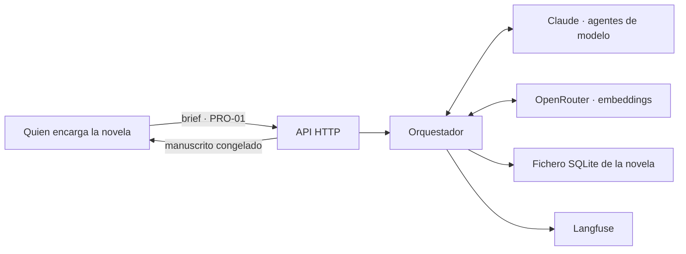

# SRS · Backend de Story-Maker · versión 1

> Especificación de requisitos de software de la primera versión de `backend/`. Refina [`architecture.md`](../docs/architecture.md) hasta el punto en que se puede escribir código; no la sustituye. Vocabulario: [`definitions.md`](../docs/definitions.md). Modelos: [`domain-knowledge.md`](../docs/domain-knowledge.md). Métodos: [`verification.md`](../docs/verification.md). Reglas del repositorio y convención de esta carpeta: [`AGENTS.md`](../AGENTS.md) §3.3.

---

## 1. Introducción

### 1.1 Propósito

Este documento fija **qué debe hacer la primera versión del backend** para que un equipo la construya sin volver a decidir nada que los cuatro documentos de `docs/` ya decidieron. Cada requisito lleva su fuente en esos documentos y el método `VER-NN` que lo comprueba.

Lo que no está aquí no es de la versión 1. Lo que está aquí y contradice a `architecture.md` es un error de este documento y se corrige aquí, nunca al revés (`AGENTS.md` §3.3).

### 1.2 Alcance

La versión 1 es el **sistema mínimo autónomo**: los pasos 1 a 6 del orden de construcción de `architecture.md` §14, que son los que producen una novela coherente sin intervención (`AGENTS.md` §8). Del brief (PRO-01) al manuscrito congelado, sin que nadie apruebe nada.

| Entra en la versión 1 | Sale de la versión 1 |
|---|---|
| Canon estructurado, registro de eventos y grafo de entidades (paso 1) | Resúmenes de arco y de obra (paso 7) |
| Índice de prosa en dos niveles, con sus vectores, escrito al congelar | Afinado de la recuperación contra el conjunto dorado (paso 8) |
| Escaleta y especificación de escena (paso 2) | Jurado, conjunto dorado y Estilista (paso 9) |
| Documentalista completo: recetas de paquete y recuperación híbrida (paso 3) | Supervisor, replanificación por métricas y cuadro de mando (paso 10) |
| Escritor, Especialista deportivo y verificadores deterministas (paso 4) | Frontend (paso 11) |
| Continuista y Reparador, que cierran el bucle de §7.1 | Retcon sobre capítulos congelados (CAN-10): aquí el canon congelado siempre gana |
| Archivero y congelación (paso 5) | |
| Árbitro y política de precedencia (paso 6) | |
| Orquestador, admisión CTX-20 y reanudación | |
| Rutas HTTP mínimas dentro de cada funcionalidad | |
| Observabilidad con Langfuse desde el primer día | |

Diez agentes de los trece de `architecture.md` §6 participan: 0 Orquestador, 1 Arquitecto, 2 Planificador, 3 Documentalista, 4 Escritor, 5 Especialista deportivo, 6 Continuista, 8 Reparador, 10 Archivero y 11 Árbitro. Quedan fuera 7 Jurado, 9 Estilista y 12 Supervisor.

**Por qué esta frontera y no otra.** Los pasos 7 a 10 compran escala y calidad, no viabilidad. La versión 1 garantiza coherencia factual, temporal y deportiva; no garantiza todavía calidad literaria medida, porque eso lo aportan el Jurado y el Estilista. Es una limitación declarada, no un olvido.

**Por qué la recuperación híbrida sí entra.** `architecture.md` §4.4 la deja resuelta con dos piernas sobre el mismo índice, fusión por rangos y selección por cupos, todo determinista y sin una sola llamada de modelo extra. Escribir primero la mitad léxica y añadir la semántica después obligaría a escribir dos veces la fusión y los cupos, que es el grueso del trabajo. Lo que queda para el paso 8 es medir y afinar, no construir.

### 1.3 Definiciones

Todo el vocabulario es el de `definitions.md`, referenciado por ID. Este documento no introduce términos nuevos. Los cuatro que más se usan:

| ID | Término | En una frase |
|---|---|---|
| CTX-03 | Paquete de contexto | Lo único que un agente de modelo ve en cada llamada |
| CTX-09 | Recuperación híbrida | Buscar por significado, por palabra y por clave, porque ninguna de las tres basta sola |
| CAN-11 | Delta canónico | Lo que un capítulo cambia en el mundo, extraído y validado antes de congelar |
| CAN-12 | Congelación | El único momento en que la prosa pasa a ser canon y crece el índice |

«Fragmento» es el término que `architecture.md` §3.1 y §4.3 ya usan para la unidad recuperable del índice de prosa. No es vocabulario nuevo.

### 1.4 Referencias

| Documento | Qué aporta a este SRS |
|---|---|
| `docs/definitions.md` | Ontología, IDs e invariantes. Los invariantes son la fuente de casi todos los requisitos verificables por propiedad |
| `docs/domain-knowledge.md` | §8 cronología y estado, §13 composición del paquete, §15 ciclo de vida del capítulo |
| `docs/architecture.md` | Reparto físico (§2), memoria y escritura del índice (§3), presupuestos, recuperación y recetas (§4), skills (§5), agentes (§6), flujos (§7), arbitraje (§8), puertas (§9), escritura de canon (§10), observabilidad (§11), orden de construcción (§14) |
| `docs/verification.md` | Método `VER-NN` de cada requisito y puerta de CI |
| `AGENTS.md` | Restricciones no negociables (§5.3), stack (§3.1), persistencia (§3.2) |

### 1.5 Convenciones de este documento

- Los requisitos se numeran `RF-NN` (funcionales), `RD-NN` (datos), `RI-NN` (interfaces) y `RNF-NN` (no funcionales). Son estables dentro de este documento: no se reciclan ni se renumeran.
- «Debe» es obligatorio. «Puede» es opcional y se marca como tal. No hay «debería».
- Cada requisito lleva **fuente** (sección de `docs/`) y **verificación** (`VER-NN`). Un requisito sin método va al registro de riesgo aceptado de `verification.md` §9 antes de escribir su código, nunca después.
- Todos los números salen de `docs/`. Este documento no inventa presupuestos, umbrales ni severidades.

---

## 2. Descripción general

### 2.1 Perspectiva del producto

El backend es el sistema completo: el frontend, cuando llegue, solo observa (`architecture.md` §2.1). La versión 1 se puede ejecutar y terminar una novela con un cliente HTTP mínimo y ninguna interfaz gráfica.

Cinco fronteras externas: la API HTTP, los dos proveedores de `architecture.md` §4.8, el fichero SQLite y Langfuse. Todas se detallan en §3.

### 2.2 Funciones del producto

Una fila por funcionalidad de `architecture.md` §2.3. Las funcionalidades son carpetas, y cada una lleva dentro sus modelos, su lógica, sus rutas y sus tests.

| Carpeta | Función en la versión 1 | Agentes |
|---|---|---|
| `commons/` | Puerto de proveedor con `complete` y `embed`, contador de tokens, tipos compartidos por dos o más funcionalidades | — |
| `orchestration/` | Bucle de capítulo y de escena, admisión CTX-20, reintentos, punto de reanudación, despacho y validación de salidas. Además compone la aplicación FastAPI montando el router de cada funcionalidad | 0 |
| `planning/` | Escaleta de obra, verificación estructural, especificación de escenas, registro de setups | 1, 2 |
| `context/` | Construcción de la consulta, ensamblaje del paquete según la receta del agente destino, compactación y auditoría | 3 |
| `generation/` | Prosa de escena; simulación y narración de encuentros | 4, 5 |
| `verification/` | Verificadores deterministas; revisión de continuidad; reparación dirigida | 6, 8 |
| `canon/` | Los cinco almacenes; skills `canon.*` y `prose.*`; extracción del delta; arbitraje; congelación | 10, 11 |

**Dónde vive la recuperación.** Las skills `prose.chunk`, `prose.embed` y `prose.retrieve` viven en `canon/`, con el almacén que manejan. `context/` las consume por la excepción de lectura de `architecture.md` §2.3, igual que consume `canon.query`. Poner la búsqueda en `context/` obligaría a esa carpeta a abrir la base, que es justo lo que la frontera de `canon/` impide.

### 2.3 Actores

| Actor | Qué hace | Cuándo |
|---|---|---|
| Quien encarga la novela | Entrega el brief (PRO-01) y lee el manuscrito congelado | Antes del ciclo y después de cada congelación. **Nunca dentro** (PRO-11) |
| Claude | Responde a las llamadas de los agentes de modelo | En cada llamada admitida |
| OpenRouter | Calcula los embeddings del índice y de las consultas | Al congelar y al recuperar |
| Langfuse | Recibe la traza de cada ejecución | Siempre |
| Frontend | Lee proyecciones y manuscrito | Fuera de la versión 1; la API ya le sirve |

No hay actor «revisor». Cualquier requisito que lo necesite es un error de este documento.

### 2.4 Entorno de operación

| Aspecto | Valor | Fuente |
|---|---|---|
| Lenguaje y framework | Python y FastAPI | `AGENTS.md` §3.1 |
| Ejecución | Un solo proceso, un bucle `asyncio`, sin cola de trabajos ni workers | `architecture.md` §7.4 |
| Persistencia | SQLite en local, un fichero por novela, sin extensiones nativas | `AGENTS.md` §3.2; `architecture.md` §3.1 |
| Aislamiento | Contenedor sin más red que las APIs de Claude, OpenRouter y Langfuse; ficheros acotados al directorio de la tirada | `verification.md` §5.3 |
| Proveedor de los agentes de modelo | Claude, API de Anthropic | `architecture.md` §4.8 |
| Proveedor de embeddings | OpenRouter | `architecture.md` §4.8 |
| Contador de tokens | Local, determinista y offline, en `commons/` | `architecture.md` §4.8 |
| Observabilidad | Langfuse con su SDK de Python | `verification.md` §5.1 |

### 2.5 Restricciones de diseño

Las seis de `AGENTS.md` §5.3, que aquí se convierten en requisitos no funcionales (§6), más cuatro de estructura:

1. **Paquete por funcionalidad.** Ninguna funcionalidad importa de otra, solo de `commons/`. Dos excepciones: `orchestration/` importa de todas; de `canon/` importan todas en lectura.
2. **El OpenAPI es el contrato.** Todo endpoint declara modelos de entrada y salida. Nada de `dict` ni `Any` en firma pública.
3. **La frontera de confianza está en el parseo.** Toda salida de modelo se valida contra su modelo pydantic antes de tocar nada.
4. **La recuperación no llama a ningún modelo.** La consulta se construye con datos del canon, la fusión es aritmética y la selección va por cupos. Lo único que sale a la red es el vector de la consulta.

### 2.6 Supuestos y dependencias

| Supuesto | Consecuencia si falla |
|---|---|
| La API de Claude está accesible y su ventana es ≥ 100.000 tokens | El sistema no arranca: fallo cerrado en el arranque |
| La API de embeddings está accesible al congelar | El capítulo agota reintentos y va a cuarentena (RF-68) |
| La API de embeddings está accesible al recuperar | La recuperación se degrada a solo léxica, se marca en la auditoría y se traza (RF-78). No detiene la tirada |
| El contador local nunca estima por debajo del recuento real del proveedor | Una llamada rompería el techo de 70.000 u 85.000 sin que salte el guardarraíl. Lo vigila una propiedad de CI (RNF-19) |
| El brief llega ya estructurado, con sus entidades identificadas | Un brief en texto libre no se acepta en la versión 1 |

---

## 3. Requisitos de interfaces externas

### 3.1 API HTTP

Mínima, y coherente con la frontera de `architecture.md` §2.2: entra el brief, salen capítulos congelados y proyecciones. Ninguna ruta aprueba, corrige ni desbloquea. Cada ruta vive en la funcionalidad dueña de lo que sirve.

| RI | Ruta | Dueña | Entrada | Salida |
|---|---|---|---|---|
| RI-01 | `POST /novels` | `canon/` | Brief (PRO-01) estructurado | Identificador de novela |
| RI-02 | `POST /novels/{id}/run` | `orchestration/` | — | Estado de la tirada. Idempotente: si ya corre, devuelve el estado |
| RI-03 | `GET /novels/{id}` | `orchestration/` | — | Capítulo y escena en curso, capítulos congelados, cuarentenas, condición de cierre |
| RI-04 | `GET /novels/{id}/chapters` | `canon/` | — | Lista de capítulos congelados |
| RI-05 | `GET /novels/{id}/chapters/{n}` | `canon/` | — | Prosa del capítulo `n` congelado |
| RI-06 | `GET /novels/{id}/state?at=` | `canon/` | Instante de mundo | Estado del mundo en t (MUN-10) |
| RI-07 | `GET /novels/{id}/debt` | `planning/` | — | Deuda narrativa vigente (CAN-08) |

Requisitos transversales de la API:

- **RI-08** El esquema OpenAPI generado por FastAPI es la única fuente del contrato. Se versiona en el repositorio y se prueba con `schemathesis` (VER-08).
- **RI-09** Ninguna ruta escribe en el canon. La única escritura que la API provoca es la carga del brief de RI-01, que ocurre antes del ciclo.
- **RI-10** Una ruta que reciba un identificador inexistente responde error explícito, nunca una colección vacía que parezca una novela sin capítulos.

### 3.2 Proveedores

- **RI-11** El acceso a los proveedores pasa por un **puerto** en `commons/` con dos operaciones. `complete`: dada una instrucción, un paquete de contexto (CTX-03) y un esquema de salida, devuelve texto; lo sirve Claude. `embed`: dado un texto, devuelve vector con su modelo y dimensión; lo sirve OpenRouter. Ningún agente importa el SDK de un proveedor directamente (`architecture.md` §4.8).
- **RI-12** Toda respuesta de `complete` devuelve además el recuento real de tokens del proveedor, que se traza y se contrasta con el estimado (RNF-19).
- **RI-13** El puerto no reintenta por su cuenta. Los reintentos son del Orquestador y se cuentan contra el presupuesto de `architecture.md` §7.3.
- **RI-20** El contador de tokens de `commons/` es local, determinista y offline. Es el único que usan el empaquetado, la admisión y el guardarraíl. Si no puede estimar una llamada, el Orquestador no la admite (RNF-05).
- **RI-21** Un cambio de modelo, de proveedor o de codificación del contador es un cambio de configuración del puerto, nunca una edición en un agente.
- **RI-22** `embed` es la única operación del puerto que puede fallar sin detener la tirada, y sus dos rutas de fallo son distintas porque las consecuencias lo son: al congelar agota reintentos y cuarentena el capítulo (RF-68), porque escribir mal el índice es permanente; al recuperar degrada la búsqueda a solo léxica (RF-78), porque recuperar peor una vez no lo es.

### 3.3 Persistencia

- **RI-14** Un fichero SQLite por novela, en el directorio de la tirada. Copiar el fichero es copiar el estado completo, vectores incluidos.
- **RI-15** Dos fábricas de conexión: lectura y escritura. La de escritura solo es importable desde `canon/` (RD-09).

### 3.4 Observabilidad

- **RI-16** Una traza de Langfuse por novela. Un span por llamada a agente, nombrado por agente, capítulo e intento. Los datos de `architecture.md` §11 van como metadatos del span.
- **RI-17** Ningún dato de la traza se duplica en tablas históricas del fichero de la novela. SQLite guarda lo que es verdad; la traza guarda lo que pasó.
- **RI-23** La traza de cada paquete incluye, por bloque, su ocupación real y, para el bloque de recuperación, el cupo y la procedencia de cada fragmento. Es lo que permite responder por qué entró un fragmento concreto sin reconstruir la ejecución.

### 3.5 Contratos agente a agente

Los artefactos se nombran por la skill que los produce o por su ID (`architecture.md` §6.2). Cada uno es un modelo pydantic versionado en `commons/` si lo consumen dos funcionalidades, o en la funcionalidad dueña si lo consume una.

| Artefacto | Productor | Consumidor | Campos mínimos |
|---|---|---|---|
| Escaleta (`outline.plan`) | Arquitecto | `outline.check`, Planificador | Arcos con estado, actos, entradas de escena con función (EST-14), cambio de valor (EST-13), POV, instante de mundo, setups planificados, reparto de palabras por capítulo, curva de tensión por acto, doble arco (DEP-20) con sus dos momentos de resolución |
| Especificación de escena (`scene.spec`) | Planificador | Documentalista, Escritor, Especialista | Los cinco bloques de `domain-knowledge.md` §4: identidad, función dramática, contenido, salida esperada, restricciones. Marca de «es encuentro» |
| Petición de recuperación | Documentalista | `prose.retrieve` | Filtros, términos léxicos, texto semántico, exclusiones, cupos pedidos, presupuesto en tokens |
| Paquete de contexto (CTX-03) | Documentalista | Todos los agentes de modelo | Bloques ordenados con su recuento de tokens y su procedencia, versión del paquete, informe de `context.audit`, marca de degradado |
| Prosa de escena (`scene.write`, `match.narrate`) | Escritor, Especialista | Verificadores, Continuista | Texto, POV, recuento de palabras, escena a la que responde |
| Cronología del encuentro (`match.simulate`) | Especialista | `match.narrate`, `check.ledger` | Hitos con instante, resultado (DEP-07), participantes, cambios de estado físico |
| Informe de defectos (CAL-05) | Verificadores, Continuista | Reparador, Orquestador | Por defecto: tipo, severidad (CAL-06), fragmento citado con posición, regla o hecho canónico violado |
| Fragmento corregido (`revise.targeted`) | Reparador | Verificadores | Texto sustituto, posición, defectos que cierra |
| Delta canónico (CAN-11, `delta.extract`) | Archivero | Validador, Árbitro, registro de eventos | Eventos con instante, tipo, entidades, procedencia (MET-09) y capítulo de origen |
| Arbitraje (PRO-10) | Árbitro | Orquestador, traza | Las dos afirmaciones, la regla aplicada, la ganadora, los pasajes afectados |

- **RI-18** Todo artefacto de salida de un agente de modelo se valida contra su esquema antes de devolverse al Orquestador. Si no valida, la llamada cuenta como fallida y consume un reintento.
- **RI-19** Todo veredicto, defecto o puntuación sin cita localizable se descarta (`AGENTS.md` §5.3 punto 5).

---

## 4. Requisitos funcionales

Agrupados por funcionalidad. El orden sigue el de construcción de `architecture.md` §14.

### 4.1 `canon/` · almacenes y lectura (paso 1)

| RF | Requisito | Fuente | Verificación |
|---|---|---|---|
| RF-01 | El registro de eventos es append-only. Ningún `UPDATE` ni `DELETE` llega a ejecutarse: lo impiden triggers en el propio esquema | `architecture.md` §3.1 | VER-05 |
| RF-02 | Todo evento lleva instante de mundo (MUN-05), tipo, al menos una entidad afectada (MET-05), procedencia válida (MET-09) y capítulo de origen. Uno incompleto se rechaza antes de tocar la base | `architecture.md` §10 | VER-01 |
| RF-03 | `canon.state-at(t)` proyecta solo los eventos con instante ≤ t, e incluye estado físico (DEP-13), clasificación (DEP-08) y estadísticas (DEP-12) recalculadas | MET-06, MUN-10 | VER-06 |
| RF-04 | La proyección es independiente del orden de inserción de los eventos | MUN-06 | VER-06 |
| RF-05 | El canon estructurado es proyección reconstruible: regenerarlo desde cero es igual a mantenerlo de forma incremental | `architecture.md` §3.1 | VER-06 |
| RF-06 | Atributos y relaciones tienen vigencia (MET-07) coherente; una consulta en t devuelve solo lo vigente en t | MET-07, PER-11 | VER-06 |
| RF-07 | `canon.knowledge-of(c, t)` devuelve solo hechos que un evento hizo conocer a `c` en o antes de t, más sus competencias vigentes (PER-09) | PER-10, PER-I1 | VER-06 |
| RF-08 | La clasificación y las estadísticas son invariantes a la permutación de los encuentros | DEP-I1 | VER-06 |
| RF-09 | `canon.query` devuelve ficha compacta (CTX-05) o completa. Seis compactas caben en 1.600 tokens; una completa cabe en 800 | `architecture.md` §4.3, §4.9 | VER-06 |
| RF-10 | Fichas, guía de estilo (POE-06), escaleta (EST-12) y reglamento (DEP-02) se guardan versionados; ninguna versión se sobrescribe | `architecture.md` §3.1 | VER-05 |
| RF-11 | Al crear la novela, el brief se carga como eventos con procedencia `brief` y capítulo de origen nulo | PRO-01, MET-09 | VER-05 |
| RF-12 | El índice de prosa tiene dos niveles: una fila por escena congelada con sus metadatos y el vector de su resumen, y filas de fragmento dentro de cada escena | `architecture.md` §3.1 | VER-05 |
| RF-67 | `canon.related` recorre el grafo de entidades con CTE recursivo sobre aristas vigentes en t y devuelve las entidades relacionadas | `architecture.md` §3.1, §5.1 | VER-05 |

### 4.2 `canon/` · escritura del índice (pasos 1 y 5)

| RF | Requisito | Fuente | Verificación |
|---|---|---|---|
| RF-69 | `prose.chunk` corta una escena congelada en fragmentos de hasta 450 tokens, por párrafos completos y con un párrafo de solape con el anterior. Es determinista: la misma escena produce siempre los mismos cortes | `architecture.md` §3.1, §3.3 | VER-06 |
| RF-70 | Un fragmento nunca cruza la frontera de su escena y hereda sus metadatos: capítulo, POV, lugar, instante de mundo, personajes presentes y función | `architecture.md` §3.1 | VER-06 |
| RF-71 | Solo entra prosa congelada en el índice. Un borrador no se indexa ni marcado como provisional | `architecture.md` §3.3; CTX-13 | VER-05 |
| RF-68 | Al congelar, el corte de fragmentos, los resúmenes y los vectores se calculan **fuera** de la transacción; los eventos, las proyecciones, el índice, los resúmenes y la purga se escriben **dentro**, todo junto o nada. Si el proveedor de embeddings falla, se reintenta contra el presupuesto de §7.3 y, agotado, el capítulo va a cuarentena sin haber escrito nada | `architecture.md` §3.3 | VER-05, VER-06 |

### 4.3 `orchestration/` · ejecución (transversal)

| RF | Requisito | Fuente | Verificación |
|---|---|---|---|
| RF-13 | El Orquestador ejecuta los bucles de capítulo y de escena de `architecture.md` §7.1, reducidos a los agentes de la versión 1: sin Jurado, sin Estilista, sin Supervisor. El paso «capítulo aprobado» sale directamente de la reverificación del Continuista al Archivero | `architecture.md` §7.1, §7.2 | VER-05, VER-18 |
| RF-14 | Admisión por semáforo de tokens: una llamada se admite si lo en vuelo más su presupuesto ≤ 100.000. Si no cabe, se encola en FIFO estricta, sin reordenar por hueco | CTX-20, CTX-I1 | VER-06, VER-18 |
| RF-15 | Si el presupuesto de una llamada no se puede estimar, no se admite | `architecture.md` §7.4 | VER-05 |
| RF-16 | Ninguna llamada supera 70.000 tokens de entrada ni 85.000 de entrada más salida; se comprueba antes de llamar | `architecture.md` §4.1 | VER-12, VER-06 |
| RF-17 | Cada agente tiene una lista de skills permitidas. Una llamada fuera de lista se rechaza y se traza | `verification.md` §5.4 | VER-12 |
| RF-18 | Presupuesto de reintentos: 3 por escena, 2 por capítulo, 1 replanificación de tramo. Agotado el tercero, se recalcula el arco desde el Arquitecto | `architecture.md` §7.3 | VER-05, VER-18 |
| RF-19 | Al agotar reintentos el artefacto entra en cuarentena (CAL-13); la producción no se detiene y el tramo se replanifica (PRO-12). En la versión 1 replanifica el Planificador a nivel de escena y el Arquitecto a nivel de tramo, porque el Supervisor no está | `architecture.md` §7.3, §8 | VER-05, VER-18 |
| RF-20 | El punto de reanudación (PRO-14) se escribe en `run_state` al cerrar cada escena. Al arrancar con un capítulo sin congelar, se reanuda desde la última escena cerrada y se descarta todo borrador posterior | PRO-I2 | VER-06, VER-18 |
| RF-21 | `dispatch` valida toda salida de agente contra su esquema antes de devolverla. Es la frontera de confianza | `verification.md` §4.1 | VER-01, VER-05 |
| RF-22 | Cada capítulo pasa las puertas de la versión 1 en este orden: escena generada con cero S1 deterministas; capítulo verificado con cero S1 y máximo 2 S2 del Continuista; capítulo cerrado con delta canónico integrado | `architecture.md` §9.3 | VER-18 |
| RF-23 | Condición de cierre de obra: deuda narrativa cero (CAN-I2), todos los arcos resueltos (EST-I2), curva de tensión completada y longitud dentro del rango del brief. Se evalúa tras cada congelación | `architecture.md` §8 | VER-05 |
| RF-24 | Toda decisión del Orquestador queda en la traza con su regla aplicada. Ninguna espera a una persona | PRO-11 | VER-09 |

### 4.4 `planning/` · escaleta y especificación (paso 2)

| RF | Requisito | Fuente | Verificación |
|---|---|---|---|
| RF-25 | El Arquitecto produce la escaleta (`outline.plan`) con el paquete de `architecture.md` §4.9, dentro de 55.000 tokens de entrada y 15.000 de salida | `architecture.md` §4.2, §4.9 | VER-12, VER-10 |
| RF-26 | `outline.check` es determinista y comprueba: todo arco tiene inicio, crisis y resolución planificados; el doble arco (DEP-20) resuelve el competitivo y el interno en escenas distintas; la curva de tensión es monótona por acto; todo setup planificado tiene payoff planificado; la suma de palabras por capítulo cae en el rango del brief y cada capítulo en el de EST-07 | `architecture.md` §5.1, §8 | VER-05, VER-06 |
| RF-27 | Una escaleta que no pasa `outline.check` vuelve al Arquitecto con los defectos y su evidencia; pasa, se congela y ya no cambia salvo replanificación | `architecture.md` §7.1 | VER-05 |
| RF-28 | El Planificador convierte el tramo de escaleta de un capítulo en especificaciones de escena (`scene.spec`) con los cinco bloques de `domain-knowledge.md` §4, dentro de 28.000 de entrada y 6.000 de salida | `architecture.md` §4.2, §4.9 | VER-12, VER-08 |
| RF-29 | Toda `scene.spec` declara exactamente un POV, un capítulo y al menos un cambio de valor. Una que no, se rechaza en el parseo | EST-I1 | VER-01 |
| RF-30 | Toda escena de la escaleta que sea un encuentro (DEP-06) se marca como tal en su `scene.spec` | `architecture.md` §7.1 | VER-05 |
| RF-31 | `setup.ledger` mantiene el estado de cada setup según la máquina de `domain-knowledge.md` §11. Todo setup insertado aparece en la deuda hasta cobrarse | CAN-08 | VER-06 |

### 4.5 `context/` · consulta, recuperación y paquete (paso 3)

El corazón de la versión 1 y donde vive el RAG híbrido. Todo lo de esta sección es determinista: **cero llamadas de modelo**, salvo el vector de la consulta.

#### Construcción de la consulta

| RF | Requisito | Fuente | Verificación |
|---|---|---|---|
| RF-72 | La petición de recuperación se construye sin llamada a modelo. Filtros desde la `scene.spec`: elenco activo, lugar, instante, arco, escenas excluidas. Términos léxicos desde el canon: nombre canónico y alias vigentes de cada entidad, más el léxico del mundo (MUN-08) del lugar o institución. Texto semántico: la propia `scene.spec` | `architecture.md` §4.4 | VER-05 |
| RF-73 | Los sinónimos salen de la tabla de alias, que es canon. Ningún componente inventa variantes de un nombre | `architecture.md` §4.4; MUN-08 | VER-05 |
| RF-74 | `canon.related` amplía el conjunto de entidades con las relacionadas de vigencia abierta, y los nombres de las añadidas entran en los términos léxicos | `architecture.md` §4.4 | VER-05 |

#### Piernas y fusión

| RF | Requisito | Fuente | Verificación |
|---|---|---|---|
| RF-75 | La consulta estructurada al canon y la del grafo alimentan los bloques de canon del paquete y **no se fusionan** con los resultados de prosa | `architecture.md` §4.4 | VER-05 |
| RF-76 | Las piernas léxica (FTS5 con BM25) y semántica (coseno sobre los vectores de fragmento) se fusionan por rangos: cada fragmento suma, por cada pierna en que aparece, uno partido por 60 más su posición | `architecture.md` §4.4 | VER-06 |
| RF-77 | La fusión es determinista: el mismo canon y la misma petición producen el mismo orden | `architecture.md` §4.4; PRO-09 | VER-06 |
| RF-78 | Si `embed` falla al recuperar, la pierna semántica devuelve vacío, la fusión sigue con una sola pierna, el paquete se marca como degradado y se traza. No aplica el fallo cerrado: la recuperación no es una comprobación | `architecture.md` §3.1, §4.4 | VER-05, VER-09 |

#### Selección y ajuste

| RF | Requisito | Fuente | Verificación |
|---|---|---|---|
| RF-79 | El bloque de recuperación se llena por cupos: lugar, voz, promesa, espejo y libre. Cada cupo toma el mejor candidato de la fusión que lo cumpla | `architecture.md` §4.4 | VER-05 |
| RF-80 | Cada fragmento del paquete lleva su cupo y su procedencia. Un fragmento sin motivo se descarta en la auditoría | `architecture.md` §4.4 | VER-05 |
| RF-81 | Un cupo sin candidato queda vacío y su presupuesto pasa al cupo libre. Un cupo vacío no es un error | `architecture.md` §4.4 | VER-05 |
| RF-82 | El cupo de voz excluye los fragmentos usados como muestra en las tres llamadas anteriores. Es la contramedida contra la autosimilitud (POE-14) | `architecture.md` §4.4, §4.9 | VER-05 |
| RF-83 | No se repite escena entre fragmentos salvo que dos cupos no tengan otro candidato, y no entra nada que ya viaje literal en el bloque de prosa previa | `architecture.md` §4.4 | VER-06 |
| RF-84 | Un fragmento no se trunca. Si no cabe en el presupuesto restante se prueba el siguiente candidato del mismo cupo; si ninguno cabe, entra el resumen de su escena | CTX-19; `architecture.md` §4.4 | VER-06 |
| RF-85 | El presupuesto que sobra en los bloques de canon pasa al cupo libre, hasta el tope del paquete | `architecture.md` §4.4 | VER-06 |

#### Ensamblaje, recetas y auditoría

| RF | Requisito | Fuente | Verificación |
|---|---|---|---|
| RF-32 | El paquete del Escritor tiene los once bloques de `architecture.md` §4.3, en ese orden y con esos presupuestos, hasta 17.200 tokens. En la versión 1 el bloque 5 lleva los resúmenes de obra y de capítulo, porque los de arco llegan en el paso 7 | `architecture.md` §4.3 | VER-06 |
| RF-86 | El Documentalista ensambla el paquete de cada agente según su receta de `architecture.md` §4.9. Ningún paquete supera el presupuesto de entrada que §4.2 da a su agente destino | `architecture.md` §4.2, §4.9 | VER-06, VER-12 |
| RF-87 | El paquete del Continuista se construye con recuperación dirigida por afirmaciones: se extraen del capítulo los nombres propios, fechas, cifras, competencias ejercidas y estados físicos, y cada uno genera su consulta. Sin cupos y con la pierna léxica al frente | `architecture.md` §4.9 | VER-05 |
| RF-88 | Cada bloque del paquete declara su procedencia: canon, prosa congelada con su capítulo, o plan. Donde canon y prosa discrepen, manda el canon (PRO-10) | CTX-13; `architecture.md` §4.4 | VER-05 |
| RF-89 | La muestra modélica de voz se elige de forma determinista mientras no haya Jurado: fragmento con diálogo del mismo POV, de la escena congelada más reciente que no sea la anterior y que no se haya usado en las tres últimas llamadas | `architecture.md` §4.9 | VER-05 |
| RF-33 | Al desbordar, `context.compact` reduce por prioridad inversa: fragmentos recuperados, prosa literal previa, resúmenes, fichas secundarias. Nunca toca anclas, conocimiento del POV ni especificación de la escena | CTX-19; `architecture.md` §4.1 | VER-06 |
| RF-34 | La especificación de la escena va al final del paquete; las anclas al principio | CTX-16, CTX-17 | VER-05 |
| RF-35 | `context.audit` comprueba antes de la llamada: no hay dos versiones del mismo hecho (CTX-15), todo el elenco activo tiene ficha, las anclas están completas, el total no excede el presupuesto, y cada fragmento tiene cupo y procedencia | `architecture.md` §4.4 | VER-05 |
| RF-36 | Si `context.audit` detecta un conflicto de hechos, no se genera: el Documentalista llama al Árbitro, incorpora la afirmación vigente y vuelve a auditar | `architecture.md` §6.2, §7.2 | VER-05 |
| RF-37 | La memoria de trabajo (PRO-13) nunca entra en un paquete. Un borrador rechazado no llega al Escritor | `architecture.md` §3.2 | VER-05 |
| RF-39 | Cada paquete lleva versión propia y recuento real por bloque, que se traza junto con el cupo y la procedencia de cada fragmento | CTX-03, PRO-08 | VER-09 |

### 4.6 `generation/` · prosa y encuentros (paso 4)

| RF | Requisito | Fuente | Verificación |
|---|---|---|---|
| RF-40 | El Escritor produce la prosa de una escena a partir del paquete, dentro de 3.000 tokens de salida y de la longitud objetivo de la `scene.spec`, que cae en el rango de EST-08 | `architecture.md` §4.2, §4.3 | VER-12, VER-10 |
| RF-41 | La prosa respeta el POV único, el tiempo verbal y la persona de la guía de estilo. Lo comprueba `check.format` | EST-I1, POE-06 | VER-05 |
| RF-42 | `match.simulate` resuelve el encuentro completo con reglas antes de que se narre: cronología de hitos, resultado (DEP-07), participantes y cambios de estado físico. Es determinista dada una semilla | `architecture.md` §5.1 | VER-05, VER-06 |
| RF-43 | `match.simulate` no alinea a nadie cuya disponibilidad (DEP-13, DEP-14) lo impida en esa fecha | DEP-I2 | VER-06 |
| RF-44 | `match.narrate` dramatiza la cronología sin alterar resultado ni hitos, con el paquete de §4.9 y dentro de 12.000 de entrada y 3.000 de salida | `architecture.md` §4.2, §4.9 | VER-05, VER-10 |
| RF-45 | Al escribir la escena n, el bloque de prosa literal contiene la escena n−1 completa y, si cabe en sus 4.500 tokens, la cola de la n−2. Por eso las escenas de un capítulo van en serie | `architecture.md` §4.2, §4.9 | VER-18 |

### 4.7 `verification/` · verificadores, continuidad y reparación (paso 4)

| RF | Requisito | Fuente | Verificación |
|---|---|---|---|
| RF-46 | Los verificadores deterministas de `architecture.md` §9.1 corren sobre cada escena antes de cualquier juez y devuelven defectos con severidad y cita localizable: `check.timeline`, `check.ledger`, `check.availability`, `check.format`, `check.repetition`, `check.lexicon`, `check.knowledge` | `architecture.md` §5.1, §9.1 | VER-05, VER-06, VER-07 |
| RF-47 | `check.ledger` recalcula clasificación y estadísticas desde los eventos y la cronología de `match.simulate`, y marca S1 toda cifra narrada que no cuadre | DEP-I1 | VER-06 |
| RF-48 | `check.knowledge` marca S1 toda mención de un hecho canónico por un personaje cuyo `canon.knowledge-of` en ese instante no lo incluye | PER-I1 | VER-05 |
| RF-49 | `check.repetition` marca los n-gramas de 4 o más ya usados en prosa congelada y los términos proscritos. Todo n-grama o imagen usado dos veces entra automáticamente en la lista de proscripción | `architecture.md` §4.6, §9.1 | VER-05 |
| RF-50 | Los verificadores deterministas tienen cobertura de mutación ≥ 90 % | `verification.md` §4.7 | VER-07 |
| RF-51 | El Continuista recibe el paquete de §4.9, dentro de 45.000 de entrada y 5.000 de salida, y devuelve defectos con cita para lo que los deterministas no cubren. Su criterio de salida es cero S1 | `architecture.md` §4.2, §4.9 | VER-12, VER-10 |
| RF-52 | El Continuista no ve el paquete que generó la prosa ni el razonamiento del Escritor | `architecture.md` §1, §4.7 | VER-05 |
| RF-53 | El Reparador recibe fragmento, defectos agrupados y su evidencia, con el paquete de §4.9, dentro de 12.000 de entrada y 3.000 de salida | `architecture.md` §4.2, §4.9 | VER-12, VER-10 |
| RF-54 | Toda reparación revalida desde la primera puerta. Una reparación que abre defectos nuevos se revierte | `architecture.md` §7.3; `verification.md` §5.10 | VER-05, VER-18 |

### 4.8 `canon/` · delta, arbitraje y congelación (pasos 5 y 6)

| RF | Requisito | Fuente | Verificación |
|---|---|---|---|
| RF-55 | El Archivero extrae el delta canónico del capítulo aprobado con el paquete de §4.9, dentro de 22.000 de entrada y 5.000 de salida. Todo evento del delta lleva procedencia `prose` o `derived` y su capítulo de origen | `architecture.md` §4.9, §10 | VER-12, VER-08 |
| RF-56 | El delta se propone y se valida contra el canon vigente; nunca se aplica en bruto | `architecture.md` §10 | VER-05, VER-18 |
| RF-57 | La congelación aplica eventos, recalcula proyecciones, escribe el índice y sus vectores, guarda los resúmenes y purga la memoria de trabajo en una sola transacción. Tras congelar no queda ninguna fila de memoria de trabajo del capítulo | PRO-I1; `architecture.md` §3.3 | VER-06 |
| RF-58 | La congelación es la única operación que escribe canon y solo `canon/` la ejecuta | `architecture.md` §10 | VER-02, VER-05 |
| RF-59 | Con contradicción, el Árbitro aplica la precedencia PRO-10 con el paquete de §4.9: canon congelado sobre delta nuevo; brief sobre canon derivado; invariante duro sobre preferencia estética; hecho con payoff cobrado sobre hecho sin cobrar. Todo arbitraje se registra con la regla aplicada | `architecture.md` §8, §10 | VER-04, VER-05 |
| RF-60 | En la versión 1, si el canon previo gana, el delta se rechaza y el capítulo vuelve al Reparador con la contradicción como defecto S1. El retcon no está implementado | `architecture.md` §8, §10 | VER-05 |
| RF-61 | La política de precedencia es total y sin ciclos: todo conflicto tiene exactamente un ganador | `verification.md` §4.4 | VER-04 |
| RF-62 | Fusionar dos deltas canónicos es asociativo | `verification.md` §4.6 | VER-06 |
| RF-63 | El Árbitro atiende dos entradas: la del Orquestador al validar el delta y la del Documentalista desde `context.audit`. Su presupuesto es 15.000 de entrada y 2.000 de salida | `architecture.md` §4.2, §6.2 | VER-12 |
| RF-90 | Los resúmenes de escena y de capítulo se generan al congelar, según `architecture.md` §4.5. El de escena es lo que se embebe en el nivel de escena del índice | `architecture.md` §3.3, §4.5 | VER-05 |

### 4.9 Rutas HTTP (dentro de cada funcionalidad)

| RF | Requisito | Fuente | Verificación |
|---|---|---|---|
| RF-64 | Las rutas de §3.1 existen con los modelos declarados y el OpenAPI las describe sin `dict` ni `Any`. Cada ruta vive en la funcionalidad dueña de lo que sirve; `orchestration/` compone la aplicación montando sus routers. No hay carpeta `api/` | `architecture.md` §2.3 | VER-01, VER-02, VER-08 |
| RF-65 | Las rutas de lectura solo devuelven capítulos congelados y proyecciones derivadas. Ninguna expone borradores, defectos, veredictos, la cola de admisión ni el registro de eventos en crudo | `architecture.md` §2.2 | VER-05 |
| RF-66 | RI-02 es idempotente y arranca la tirada en el bucle `asyncio` del proceso, sin proceso ni cola adicionales | `architecture.md` §7.4 | VER-05 |

---

## 5. Requisitos de datos

Un fichero SQLite por novela, sin extensiones nativas. Separación lógica de los almacenes, no física. Prefijo `wm_` en las tablas de memoria de trabajo.

| RD | Requisito | Fuente | Verificación |
|---|---|---|---|
| RD-01 | Tabla `event`: identificador autoincremental, `world_time` en ISO 8601, `world_seq` de desempate, `type`, `payload` JSON validado por tipo, `provenance` acotada a los cuatro valores de MET-09, `chapter_origin`, `recorded_at`. Triggers que abortan `UPDATE` y `DELETE` | MET-05, MET-09 | VER-05 |
| RD-02 | Tabla `event_entity` que relaciona cada evento con las entidades que modifica, con al menos una fila por evento | MET-05 | VER-05 |
| RD-03 | Orden de proyección `(world_time, world_seq, id)`. El orden de inserción no participa | MUN-05, MUN-06 | VER-06 |
| RD-04 | Canon estructurado como tablas proyectadas y versionadas: `entity`, `entity_alias`, `attribute` y `relation` con vigencia, `knowledge`, `competence`, `document_version` | `architecture.md` §3.1 | VER-06 |
| RD-05 | Clasificación y estadísticas no se materializan: se calculan al pedirlas desde los eventos de resultado | DEP-I1 | VER-06 |
| RD-06 | Índice de prosa, nivel escena: una fila por escena congelada con capítulo, POV, lugar, instante, personajes presentes, función, resumen y vector del resumen | `architecture.md` §3.1 | VER-05 |
| RD-15 | Índice de prosa, nivel fragmento: filas hijas de una escena, con texto, orden dentro de la escena, vector y entrada en FTS5. Los metadatos se heredan por clave ajena, no se duplican | `architecture.md` §3.1 | VER-05, VER-06 |
| RD-16 | Todo fragmento pertenece a exactamente una escena y su texto está contenido en el de esa escena | `architecture.md` §3.1 | VER-06 |
| RD-13 | Cada vector guarda el identificador del modelo que lo produjo y su dimensión | `architecture.md` §3.1 | VER-05 |
| RD-14 | Vectores de modelos distintos no se comparan. Encontrarlos mezclados es un error explícito que fuerza reindexación | `architecture.md` §3.1 | VER-05 |
| RD-17 | La similitud se calcula en Python sobre el conjunto ya filtrado por metadatos. No se carga ninguna extensión vectorial de SQLite | `architecture.md` §3.1 | VER-02, VER-05 |
| RD-07 | Tablas de memoria de trabajo `wm_run_state`, `wm_draft`, `wm_defect`, `wm_verdict`, `wm_admission`. `wm_verdict` se crea aunque la versión 1 no tenga Jurado, para que el fichero sea completo | PRO-13 | VER-05 |
| RD-08 | Ninguna consulta de `canon.*` ni de `prose.*` nombra una tabla `wm_*` | `architecture.md` §3.2 | VER-02 |
| RD-09 | La fábrica de conexión de escritura solo es importable desde `canon/`; una conexión de lectura no puede escribir | `architecture.md` §2.3 | VER-02, VER-05 |
| RD-10 | El fichero lleva versión de esquema. Abrir una versión anterior migra hacia adelante en escritura; abrir una desconocida falla | Skill `sqlite` §6 | VER-05 |
| RD-11 | Ninguna consulta se construye concatenando texto. Todo valor va como parámetro | `verification.md` §4.2 | VER-02 |
| RD-12 | Abrir una copia del fichero devuelve las mismas proyecciones y la misma recuperación que el original | `AGENTS.md` §3.2 | VER-05 |

---

## 6. Requisitos no funcionales

### 6.1 Autonomía

| RNF | Requisito | Fuente | Verificación |
|---|---|---|---|
| RNF-01 | Ningún punto del ciclo espera una entrada humana. No existe estado «pendiente de aprobación» en `run_state` ni ruta que lo resuelva | PRO-11 | VER-18 |
| RNF-02 | Toda bifurcación del flujo tiene regla de precedencia, umbral numérico o agente responsable. Un bloqueo se resuelve con cuarentena y replanificación, nunca parando | `architecture.md` §1 | VER-18 |
| RNF-03 | La tirada termina, por cierre de obra o por agotar la replanificación de arco, sin intervención | `verification.md` §5.10 | VER-18 |

### 6.2 Contexto y concurrencia

| RNF | Requisito | Fuente | Verificación |
|---|---|---|---|
| RNF-04 | Entrada ≤ 70.000 tokens y entrada más salida ≤ 85.000 en toda llamada; 100.000 es el techo de lo que está en vuelo. Lo que no cabe se compacta o se encola, nunca se trunca | `AGENTS.md` §5.3; CTX-I1 | VER-06, VER-12 |
| RNF-05 | Fallo cerrado en la admisión: sin estimación de presupuesto no hay llamada | `architecture.md` §7.4 | VER-05 |
| RNF-06 | El paralelismo real de la versión 1 es cero: sin Jurado, todas las llamadas van en serie. La admisión existe igual, porque CTX-20 acota lo que vendrá | `architecture.md` §4.2 | VER-06 |
| RNF-20 | La recuperación completa de un paquete no gasta ninguna llamada de modelo. Su único coste externo es un vector de consulta | `architecture.md` §4.4 | VER-09 |

### 6.3 Fiabilidad

| RNF | Requisito | Fuente | Verificación |
|---|---|---|---|
| RNF-07 | Una comprobación que no puede ejecutarse cuenta como fallida | `AGENTS.md` §5.3 | VER-05 |
| RNF-08 | Reanudar desde un punto de reanudación produce el mismo capítulo que una tirada sin interrupción, dadas las mismas semillas y respuestas de modelo | PRO-14 | VER-06 |
| RNF-09 | Una caída en mitad de una escena pierde como mucho esa escena | `architecture.md` §7.4 | VER-05 |
| RNF-21 | Ninguna transacción de base de datos permanece abierta esperando a un proveedor externo | `architecture.md` §3.3 | VER-02, VER-05 |

### 6.4 Seguridad

| RNF | Requisito | Fuente | Verificación |
|---|---|---|---|
| RNF-10 | Ninguna cadena procedente de un modelo alcanza sistema de ficheros, red ni base de datos sin pasar por un validador de esquema | `verification.md` §4.2 | VER-02 |
| RNF-11 | El proceso corre en contenedor sin más red que las APIs de Claude, OpenRouter y Langfuse, con el sistema de ficheros acotado al directorio de la tirada | `verification.md` §5.3 | VER-11 |
| RNF-12 | El brief se trata como entrada no confiable: sus textos entran a los paquetes como datos, nunca como instrucción | `verification.md` §5.9 | VER-17 |
| RNF-22 | Un fragmento recuperado entra al paquete como prosa con su procedencia, nunca como instrucción ni como hecho canónico | CTX-13; `verification.md` §5.9 | VER-05, VER-17 |

### 6.5 Observabilidad

| RNF | Requisito | Fuente | Verificación |
|---|---|---|---|
| RNF-13 | Toda llamada, defecto, reintento, admisión y arbitraje se traza en Langfuse. Si Langfuse no responde, la traza se encola en local y la tirada continúa | `verification.md` §5.1; PRO-09 | VER-09 |
| RNF-14 | Todo fragmento congelado es trazable a la versión del paquete y a la llamada que lo produjo | PRO-09 | VER-09 |
| RNF-19 | Hay un solo contador de tokens y su estimación nunca queda por debajo del recuento real del proveedor. Si alguna llamada lo supera, CI falla y el factor de seguridad sube | `architecture.md` §4.8 | VER-06, VER-09 |

### 6.6 Mantenibilidad

| RNF | Requisito | Fuente | Verificación |
|---|---|---|---|
| RNF-15 | Paquete por funcionalidad con el contrato de capas de `architecture.md` §2.3, comprobado con `import-linter` | `architecture.md` §2.3 | VER-02 |
| RNF-16 | `mypy --strict` en todo `backend/`; `ruff`, `bandit` y `pip-audit` en CI | `verification.md` §4.1, §4.2 | VER-01, VER-02 |
| RNF-17 | Todo test que involucre un agente usa un doble determinista. Las llamadas a modelo real son evals, no tests | `verification.md` §4.5 | VER-05 |
| RNF-18 | Las funciones de proyección, calendario, clasificación, corte de fragmentos, fusión y empaquetado se escriben puras, para que VER-03 y VER-06 puedan aplicarse | Skill `fastapi` §6 | VER-03 |

---

## 7. Verificación

### 7.1 Matriz requisito × método

| Método | Requisitos que cubre como método principal |
|---|---|
| VER-01 Type checking | RF-02, RF-21, RF-29, RF-64, RNF-16 |
| VER-02 Static analysis | RF-58, RF-64, RD-08, RD-09, RD-11, RD-17, RNF-10, RNF-15, RNF-21 |
| VER-03 Symbolic execution | RNF-18: proyecciones, calendario, clasificación, corte de fragmentos, fusión y empaquetador |
| VER-04 Formal verification | RF-59, RF-61 |
| VER-05 Unit e integration | RF-01, RF-10, RF-11, RF-12, RF-15, RF-27, RF-30, RF-34, RF-35, RF-36, RF-37, RF-41, RF-48, RF-49, RF-52, RF-56, RF-60, RF-65, RF-66, RF-67, RF-68, RF-71, RF-72, RF-73, RF-74, RF-75, RF-78, RF-79, RF-80, RF-81, RF-82, RF-87, RF-88, RF-89, RF-90, RD-01, RD-02, RD-06, RD-07, RD-10, RD-12, RD-13, RD-14, RD-15, RNF-05, RNF-07, RNF-09, RNF-17, RNF-22 |
| VER-06 Property-based | RF-03 a RF-09, RF-14, RF-16, RF-20, RF-31, RF-32, RF-33, RF-42, RF-43, RF-47, RF-57, RF-62, RF-69, RF-70, RF-76, RF-77, RF-83, RF-84, RF-85, RF-86, RD-03, RD-04, RD-05, RD-16, RNF-04, RNF-06, RNF-08, RNF-19 |
| VER-07 Mutation | RF-46, RF-50 |
| VER-08 Contract | RI-08, RI-11, RI-21, RF-28, RF-55, RF-64 |
| VER-09 Observability | RI-12, RI-16, RI-23, RF-24, RF-39, RNF-13, RNF-14, RNF-19, RNF-20 |
| VER-10 Evals | RF-25, RF-40, RF-44, RF-51, RF-53: calidad de la salida de cada agente de modelo, con dobles en CI y modelo real por lotes |
| VER-11 Sandbox | RNF-11 |
| VER-12 Guardrails | RF-16, RF-17, RF-25, RF-28, RF-40, RF-44, RF-51, RF-53, RF-55, RF-63, RF-86 |
| VER-17 Red-teaming | RNF-12, RNF-22 |
| VER-18 Model checking | RF-13, RF-14, RF-18, RF-19, RF-20, RF-22, RF-45, RF-54, RF-56, RNF-01, RNF-02, RNF-03 |

VER-13 está excluido. VER-14 entra con el Jurado, VER-15 es la puerta de §7.2 y VER-16 se aplica al cambiar un prompt.

### 7.2 Puerta de CI

Ningún cambio en `backend/` llega a la rama principal sin VER-01, VER-02, VER-05, VER-06 y VER-08 en verde. VER-03 corre en CI nocturno y VER-07 semanal, solo sobre los verificadores deterministas.

### 7.3 Propiedades que se traducen sin trabajo

Los invariantes ya escritos como propiedades universales, más las que el RAG añade:

| Invariante o regla | Propiedad | Requisito |
|---|---|---|
| CTX-I1 | La suma de lo en vuelo nunca supera 100.000, sea cual sea el orden de llegada | RF-14 |
| PRO-I1 | Congelar no deja fila de memoria de trabajo del capítulo | RF-57 |
| PRO-I2 | Solo se reanuda desde una escena cerrada | RF-20 |
| EST-I1 | Toda `scene.spec` tiene un capítulo, un POV y un cambio de valor | RF-29 |
| PER-I1 | Ningún personaje actúa sobre información fuera de su conocimiento | RF-48 |
| DEP-I1 | Clasificación y estadísticas recalculables | RF-08, RF-47 |
| DEP-I2 | Nadie juega lesionado | RF-43 |
| CAN-I1 | Ningún capítulo se cierra sin delta extraído, validado e integrado | RF-56, RF-57 |
| §3.1 | Un fragmento nunca cruza la frontera de su escena | RF-70, RD-16 |
| §4.4 | La fusión es determinista: mismo canon, mismo paquete | RF-77 |
| §4.4 | Ningún fragmento repite texto ya presente en el paquete | RF-83 |
| §4.9 | Ningún paquete supera el presupuesto de su agente | RF-86 |
| §4.8 | El contador nunca estima por debajo del real | RNF-19 |

### 7.4 Riesgo aceptado propio de la versión 1

Filas que se añaden al registro de `verification.md` §9 mientras dure esta versión:

| Riesgo | Por qué queda en U | Señal que se vigila |
|---|---|---|
| Calidad literaria de la prosa: tensión, subtexto, voz | Sin Jurado ni Estilista no hay quien la mida | Ninguna hasta la versión 2. Riesgo aceptado |
| Aplanamiento estilístico y autosimilitud | Sin huella estilística el defecto no es observable en el agregado | Recuento de `check.repetition` por capítulo, y el cupo de voz que excluye lo ya usado (RF-82) |
| Que los cupos traigan lo relevante | Sin conjunto dorado no hay contra qué medir la recuperación | Cupos vacíos por capítulo y fragmentos sustituidos por resumen, en la traza (`architecture.md` §11) |
| Que la constante de fusión y el tamaño de fragmento sean los adecuados | Ajustarlos exige medir, y la medición llega en el paso 8 | Las mismas señales de la fila anterior |
| Continuista que deja de caber en su presupuesto al crecer la obra | Sin resúmenes de arco, el canon filtrado crece con la novela | Ocupación real de su paquete en la traza |

---

## 8. Fuera de alcance

| Qué | Llega en | Motivo |
|---|---|---|
| Resúmenes de arco y de obra regenerados cada 5 capítulos | Paso 7 | La versión 1 genera los de escena y capítulo, que es lo que el índice y las recetas necesitan |
| Afinado de la recuperación con el conjunto dorado | Paso 8 | El pipeline está completo; lo que falta es medir sus parámetros |
| Jurado, rúbricas, dispersión, conjunto dorado | Paso 9 | Calidad, no coherencia |
| Estilista, huella estilística, muestras por puntuación | Paso 9 | La muestra se elige por recencia mientras tanto (RF-89) |
| Supervisor, métricas agregadas, replanificación por deriva | Paso 10 | Con pocos capítulos la deriva no se acumula lo bastante para medirla |
| Retcon y `retcon.propose` | Versión posterior | En la versión 1 el canon congelado siempre gana |
| Frontend y representación gráfica | Paso 11 | Fuera del camino crítico por diseño |
| Brief en texto libre | Sin asignar | Convertirlo a estructura es trabajo de modelo y nadie lo ha presupuestado |

---

## 9. Decisiones tomadas en este documento

Ninguna introduce un término ni un número nuevo. Todas eligen entre formas de realizar lo que `architecture.md` fija, o cierran huecos que dejaba abiertos.

| D | Decisión | Elección | Por qué |
|---|---|---|---|
| D-01 | Dónde viven las rutas HTTP | Dentro de cada funcionalidad; la aplicación se compone en `orchestration/` | Es lo que `architecture.md` §2.3 ya pedía. Una carpeta transversal sería una capa técnica con otro nombre |
| D-02 | Alcance de la versión 1 | Pasos 1 a 6 de §14 | Son los que producen una novela coherente sin intervención |
| D-03 | Continuista, Reparador y Especialista deportivo | Dentro de la versión 1 | El bucle de §7.1 no cierra sin ellos |
| D-04 | Quién replanifica sin Supervisor | El Planificador a nivel de escena, el Arquitecto a nivel de tramo | Son las dos salidas que §7.3 ya nombra |
| D-05 | Retcon | El canon congelado siempre gana en la versión 1 | El camino alternativo exige reescribir pasajes congelados; es la mitad cara de §10 |
| D-06 | Puerta de capítulo sin Jurado | Cero S1 y máximo 2 S2 del Continuista | Es la puerta de §9.3 sin el componente de voz |
| D-07 | Tiempo de mundo | ISO 8601 más `world_seq` de desempate | Ordena lexicográficamente igual que cronológicamente |
| D-08 | Guía de estilo, escaleta y reglamento | Eventos proyectados a versiones | Todo entra por el registro, así el canon estructurado sigue siendo proyección pura |
| D-09 | Carga del brief | La ejecuta `canon/` al crear el fichero | Es la única escritura fuera de la congelación y vive donde vive la otra |
| D-10 | Alcance de la recuperación en la versión 1 | Completa, con sus dos piernas | Separarla obligaría a escribir dos veces la fusión y los cupos, que es el grueso. `architecture.md` §14 recoge el cambio |
| D-11 | Langfuse caído | Encolar en local y continuar | La observabilidad observa, no gobierna |
| D-12 | Búsqueda vectorial | Vectores en tabla y similitud en Python, sin extensión | 200 a 400 escenas y 600 a 1.200 fragmentos por obra: el recorrido exhaustivo es exacto e inmediato. El fichero sigue siendo un SQLite corriente |
| D-13 | Cuándo se calculan los embeddings | Al congelar, desde la versión 1 | Evita que el afinado del paso 8 reindexe la novela entera |
| D-14 | Contador de tokens | Uno solo, local y determinista, contrastado contra el recuento real | Una consulta de red en la admisión añadiría un modo de fallo al ciclo que debe terminar solo |
| D-15 | Grafo de entidades | Se construye en el paso 1, con su recorrido recursivo | La tabla de aristas ya la crea ese paso; lo único que añade es la consulta |
| D-16 | Dónde viven las skills de prosa | En `canon/`, con el almacén que manejan | Poner la búsqueda en `context/` obligaría a esa carpeta a abrir la base |
| D-17 | Recuperación del Continuista | Dirigida por afirmaciones, sin cupos y con la pierna léxica al frente | Busca recuerdo, no variedad, y CTX-09 dice que los nombres propios fallan en semántica |
| D-18 | Fragmento que no cabe | Se sustituye por el resumen de su escena | Es la regla de compactación de §4.1 aplicada al caso, y el resumen ya existe |

---

## 10. Decisiones abiertas

| Decisión | Dónde está | Efecto en la versión 1 |
|---|---|---|
| Nº 7 de `architecture.md` §13: qué modelo de embedding puebla el índice | Abierta | Ninguno de diseño. El esquema guarda modelo y dimensión, así que elegir otro es reindexar |
| Nº 8 de `architecture.md` §13: qué modelo de Claude usa cada rol | Abierta | Ninguno de diseño. El puerto lo aísla |
| Nº 9 de `architecture.md` §13: capítulo en el techo de EST-07 que no cabe en el presupuesto del Jurado | Abierta | Ninguno: el Jurado no está en la versión 1 |
| Nº 10 de `architecture.md` §13: constante de la fusión por rangos | Abierta | Se usa 60; medirla es el paso 8 |
| Nº 1 de `architecture.md` §13: tamaño del bloque de prosa literal | Abierta | Se usan los 4.500 tokens de §4.3 |
| Nº 5 de `architecture.md` §13: granularidad de `match.simulate` | Abierta | Libre mientras la cronología sirva a `check.ledger` |
| Nº 6 de `architecture.md` §13: cuándo reescribir en vez de reparar | Abierta | Se usa el presupuesto de reintentos sin excepción |

Las decisiones nº 2, nº 3 y nº 4 no afectan a la versión 1: son del Continuista al crecer la obra y del Jurado, que no está.

---

## Apéndice A · Trazabilidad con `definitions.md`

IDs que la versión 1 realiza. Un ID que no aparece aquí no está implementado en esta versión.

| Capa | IDs realizados |
|---|---|
| MET | 01, 02, 03, 05, 06, 07, 08, 09 |
| EST | 03, 05, 06, 07, 08, 09, 12, 13, 14; invariantes I1, I2 |
| PER | 01, 08, 09, 10, 11, 13, 16; invariante I1 |
| MUN | 01, 02, 03, 04, 05, 06, 07, 08, 10 |
| DEP | 01, 02, 03, 06, 07, 08, 09, 12, 13, 14, 20; invariantes I1, I2 |
| POE | 06, 12 |
| CAN | 01, 02, 03, 04, 05, 06, 07, 08, 11, 12; invariantes I1, I2 |
| CTX | 01, 02, 03, 05, 06, 07, 08, 09, 10, 11, 15, 16, 17, 18, 19, 20; invariante I1 |
| CAL | 03, 05, 06, 07, 08, 09, 12, 13 |
| PRO | 01, 06, 08, 09, 10, 11, 12, 13, 14; invariantes I1, I2 |

CTX-06 se realiza solo en sus dos niveles bajos, escena y capítulo; arco y obra llegan en el paso 7.

No realizados y por qué: POE-13 y POE-14 en su medición, que llega con el Estilista, aunque RF-82 ya ataca la autosimilitud desde la recuperación; CAL-02, CAL-04, CAL-10 y CAL-11 (Jurado); CAN-09 y CAN-10 (retcon); CTX-12 a CTX-14 en su vigilancia agregada (Supervisor).
