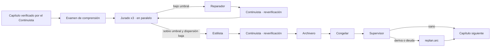

# SRS · Backend de Story-Maker · versión 2

> Especificación de requisitos de la segunda versión de `backend/`: los pasos 7 a 10 del orden de construcción de [`architecture.md`](../docs/architecture.md) §14, más el retcon que la versión 1 dejó fuera. Refina la arquitectura hasta el punto en que se puede escribir código; no la sustituye. Vocabulario: [`definitions.md`](../docs/definitions.md). Modelos: [`domain-knowledge.md`](../docs/domain-knowledge.md). Métodos: [`verification.md`](../docs/verification.md). Reglas del repositorio: [`AGENTS.md`](../AGENTS.md) §3.3. La versión anterior: [`srs-backend-v1.md`](srs-backend-v1.md).

---

## 1. Introducción

### 1.1 Propósito

La versión 1 produce una novela **coherente** sin intervención. Esta versión la hace **buena y larga sin que nadie lo vigile**: mide la calidad literaria con un Jurado calibrado, sostiene la voz con un Estilista y una huella estilística, mantiene la memoria completa bajo el techo cuando la obra pasa de 150.000 palabras, y detecta la degradación lenta con un Supervisor que replanifica solo. Cada requisito lleva su fuente en `docs/` y el método `VER-NN` que lo comprueba.

Lo que no está aquí no es de la versión 2. Lo que está aquí y contradice a `architecture.md` es un error de este documento y se corrige aquí.

### 1.2 Alcance

| Entra en la versión 2 | Sale de la versión 2 |
|---|---|
| Resúmenes de arco y de obra, regenerados al cerrar arco y cada 5 capítulos (paso 7) | Frontend y representación gráfica (paso 11) |
| Afinado de la recuperación medido contra un conjunto dorado de recuperación construido desde la escaleta (paso 8) | Brief en texto libre |
| Jurado de tres instancias, rúbricas CAL-02, dispersión, conjunto dorado de defectos sembrados y VER-14 (paso 9) | Modelos distintos por agente: el puerto lo permite, nadie lo ha medido |
| Estilista, huella estilística POE-13, muestra modélica por puntuación POE-14 (paso 9) | |
| Supervisor, métricas de salud de `architecture.md` §11 y replanificación por deriva (paso 10) | |
| Retcon CAN-10 con la regla dura de `architecture.md` §8 | |
| Campaña de red-teaming fijada como casos del conjunto dorado (VER-17) | |
| Despliegue por tramo de prompts y modelo (VER-16) | |

Los trece agentes participan. La versión 1 tenía diez; entran 7 Jurado, 9 Estilista y 12 Supervisor.

**Por qué el retcon entra aquí y no en una versión aparte.** `architecture.md` §8 y §10 lo describen con regla dura y flujo; la versión 1 lo dejó fuera porque exige reescribir prosa congelada, y eso solo tiene sentido cuando hay Estilista para que la reescritura no rompa la voz y Jurado para medir que no la empeoró. Las dos piezas llegan en esta versión: dejarlo para una tercera sería dejar el sistema descrito en `docs/` sin construir.

### 1.3 Definiciones

Todo el vocabulario es el de `definitions.md`. Este documento no introduce términos. Los que más se usan aquí:

| ID | Término | En una frase |
|---|---|---|
| CAL-02 | Rúbrica | Definición operativa de una dimensión con niveles y ejemplos |
| CAL-10 | Conjunto dorado | Fragmentos con defectos sembrados y conocidos, para saber si los jueces siguen detectando |
| CAL-11 | Jurado | Varias instancias de juez; la dispersión mide la fiabilidad |
| POE-13 | Huella estilística | Perfil cuantitativo del texto; mide deriva |
| POE-14 | Autosimilitud | El sistema reciclando sus propias imágenes al leer su producción |
| CTX-06 | Resumen jerárquico | Escena → capítulo → arco → obra |
| CAN-10 | Retcon | Reinterpretación deliberada de canon previo, explícita y registrada |

### 1.4 Referencias

| Documento | Qué aporta |
|---|---|
| `docs/definitions.md` | CAL, POE, CTX-06, CTX-12 a CTX-14, CAN-10, PRO-12 |
| `docs/domain-knowledge.md` | Ciclo de vida del capítulo completo, mapa de modos de fallo |
| `docs/architecture.md` | §4.2 presupuestos, §4.5 resúmenes, §4.6 deriva, §4.9 recetas del Jurado, Estilista y Supervisor, §5 skills de auditoría y estilo, §6 contratos, §7.1 flujo completo, §8 retcon, §9.2 Jurado, §9.3 puertas, §10 escritura de canon con retcon, §11 métricas, §13 decisiones abiertas |
| `docs/verification.md` | VER-10, VER-14, VER-16, VER-17 y la cascada de §6 |
| `specs/srs-backend-v1.md` | Requisitos que esta versión hereda intactos. Ningún ID se recicla |

### 1.5 Convenciones

Las de la versión 1 §1.5. La numeración continúa donde aquella terminó: `RF-116` en adelante, `RD-20`, `RI-28`, `RNF-26`, `D-36`. Un requisito de la versión 1 que esta versión modifica se cita por su ID y se dice qué cambia; no se reescribe allí.

---

## 2. Descripción general

### 2.1 Perspectiva del producto

El mismo proceso único de la versión 1. Cambian dos cosas visibles desde fuera: el bucle de capítulo pasa por Jurado y Estilista antes del Archivero, y tras cada congelación corre el Supervisor. El paralelismo real deja de ser cero: las tres instancias del Jurado se lanzan a la vez y son la única concurrencia del sistema.

### 2.2 Funciones del producto

| Carpeta | Función en la versión 2 | Agentes |
|---|---|---|
| `canon/summaries/` | Niveles de arco y de obra; regeneración cada 5 capítulos | Archivero |
| `canon/arbiter/` | `retcon.propose` y la regla dura; marcado de pasajes afectados | Árbitro |
| `context/` | Parámetros de recuperación medidos; muestra modélica por puntuación | Documentalista |
| `verification/jury/` | Tres instancias, rúbricas, dispersión, `check.evidence` sobre cada puntuación; conjunto dorado de defectos sembrados | Jurado |
| `verification/style/` | `style.polish`, `style.fingerprint`, deriva | Estilista |
| `supervision/` | `metrics.report`, umbrales de §11, disparo de replanificación | Supervisor |
| `evals/` | Conjunto dorado de recuperación, campaña adversaria, comparación de tiradas | Ninguno: es código que corre sobre ficheros congelados |
| `orchestration/` | Bucle completo de `architecture.md` §7.1; paralelismo del Jurado bajo admisión | Orquestador |

`evals/` es una carpeta nueva **del piso de `orchestration/`**: ejercita las funcionalidades —la recuperación de `context/`, la escaleta de `planning/`— para medirlas, así que las conoce igual que la raíz de composición, y ninguna la importa a ella (D-44). Es donde vive lo que `verification.md` §5.2 llama evals.

### 2.3 Actores

Los de la versión 1 §2.3. No hay actor «revisor».

### 2.4 Entorno de operación

El de la versión 1 §2.4, más una dependencia local:

| Aspecto | Valor | Fuente |
|---|---|---|
| Análisis morfológico para la huella | `spaCy` con el modelo `es_core_news_sm`, empaquetado en la imagen como el de embeddings; no se descarga en ejecución | D-40 |
| Paralelismo | Tres llamadas simultáneas, las del Jurado, bajo la admisión de CTX-20 | `architecture.md` §4.2, §7.4 |

### 2.5 Restricciones de diseño

Las de la versión 1 §2.5. Dos consecuencias propias de esta versión:

1. **El Jurado no ve el paquete del Escritor, ni su razonamiento, ni los defectos ya detectados.** Un juez que ve la guía de estilo puntúa la guía (`architecture.md` §4.9).
2. **Nada de esta versión aprueba nada.** El Jurado puntúa y el sistema decide por umbral; el Supervisor mide y el sistema replanifica por regla. Si al implementar aparece una espera, es un error de diseño.

### 2.6 Supuestos y dependencias

| Supuesto | Si falla |
|---|---|
| La versión 1 pasó su puerta: existe `golden/v1-seed/` con una tirada real completa | Esta versión no tiene contra qué medir. No se empieza |
| Los presupuestos de `architecture.md` §4.2 con el Jurado en 13.200 por instancia caben en la ventana real con el andamiaje del CLI (D-35) | Cada instancia ocupa 13.200 + 38.600 = 51.800 de su propia ventana de 200.000: caben |

---

## 3. Requisitos de interfaces externas

### 3.1 API HTTP

Se añaden a la tabla de la versión 1 §3.1. Ninguna aprueba, corrige ni desbloquea.

| RI | Ruta | Dueña | Entrada | Salida |
|---|---|---|---|---|
| RI-28 | `GET /novels/{id}/health` | `supervision/` | — | Cuadro de mando: las trece señales de `architecture.md` §11 por capítulo congelado, con su estado frente al umbral |
| RI-29 | `GET /novels/{id}/chapters/{n}/verdict` | `verification/` | — | Veredicto del Jurado sobre el capítulo `n` congelado: puntuación por dimensión con su evidencia anclada, dispersión, instancias descartadas |
| RI-30 | `GET /novels/{id}/style` | `verification/` | — | Huella estilística de referencia y la de cada capítulo congelado, con su desviación |
| RI-31 | `GET /novels/{id}/retcons` | `canon/` | — | Retcons aplicados: hecho anterior, hecho nuevo, pasajes reescritos, regla aplicada |

- **RI-32** Las rutas nuevas entran en el esquema OpenAPI versionado de RI-08 y se prueban con `schemathesis`.

### 3.2 Proveedores

Los de la versión 1 §3.2, más:

- **RI-33** El puerto expone `complete` para tres llamadas simultáneas. La concurrencia la decide la admisión (RF-14), no el puerto: el puerto solo tiene que no serializar por su cuenta.
- **RI-34** Todo prompt lleva un identificador de versión —hash de su prefijo cacheable y de su plantilla de instrucción— que viaja en la traza de cada llamada. Es lo que permite comparar dos tiradas con prompts distintos (VER-16).

### 3.3 Persistencia

- **RI-35** El fichero de la novela sigue siendo uno, y su versión de esquema sube. Abrir un fichero de la versión 1 migra hacia adelante en escritura (RD-10) y deja vacías las tablas nuevas hasta que un capítulo las llene.

### 3.4 Observabilidad

- **RI-36** La traza registra además: cada veredicto de juez con su instancia, sus puntuaciones y sus citas descartadas; la huella de cada capítulo; cada decisión del Supervisor con la señal que la disparó; cada retcon con sus pasajes.

### 3.5 Contratos agente a agente

Se añaden a la tabla de la versión 1 §3.5:

| Artefacto | Productor | Consumidor | Campos mínimos |
|---|---|---|---|
| Veredicto de juez (`*.audit`) | Una instancia del Jurado | `check.evidence`, Orquestador | Por dimensión: nivel de la rúbrica, cita literal con escena, justificación breve. Identificador de instancia y semilla |
| Veredicto del Jurado (CAL-11) | Orquestador, en código | Puerta de capítulo, Estilista, traza | Por dimensión: los tres niveles, la dispersión, el nivel resultante o la marca de veredicto inválido; citas descartadas por instancia |
| Huella estilística (POE-13) | `style.fingerprint` | Estilista, Supervisor, traza | Longitud media y varianza de frase, ratio adjetivo/sustantivo, n-gramas de 4 más frecuentes, riqueza léxica; capítulo; desviación frente a la referencia |
| Capítulo pulido (`style.polish`) | Estilista | Continuista, Archivero | Texto, huella resultante, repeticiones cerradas |
| Resumen de arco y de obra (`summarize.hierarchical`) | Archivero | Recetas de §4.9 | Texto, nivel, capítulos que cubre, versión |
| Cuadro de mando (`metrics.report`) | `supervision/`, en código | Supervisor, RI-28 | Las trece señales de §11 con valor, umbral y estado, por capítulo |
| Veredicto de salud | Supervisor | Orquestador, traza | Sano, o deriva con la señal y el tramo a replanificar |
| Propuesta de retcon (`retcon.propose`) | Árbitro | Regla dura de RF-153, Reparador, traza | Hecho anterior, hecho nuevo, pasajes afectados con su escena, si algún payoff lo cobró |

---

## 4. Requisitos funcionales

### 4.1 `canon/summaries/` · resúmenes de arco y de obra (paso 7)

| RF | Requisito | Fuente | Verificación |
|---|---|---|---|
| RF-116 | Al congelar el capítulo que cierra un arco, el Archivero genera el resumen de ese arco, de 300 palabras, construido desde los resúmenes de capítulo y no desde la prosa | `architecture.md` §4.5; CTX-06 | VER-05, VER-10 |
| RF-117 | Cada 5 capítulos congelados se regenera el resumen de obra, de 500 tokens, desde los resúmenes de arco y de capítulo. La versión anterior se conserva (RF-10) | `architecture.md` §4.5, §4.9 | VER-05 |
| RF-118 | Los resúmenes de arco y de obra entran en las recetas que los nombran —Arquitecto, Planificador, Continuista, Supervisor— en el bloque y con el coste unitario de §4.9. Un resumen que no cabe en su bloque se rechaza y se regenera más corto; no se trunca | `architecture.md` §4.9 | VER-06, VER-12 |
| RF-119 | El paquete del Continuista en el capítulo `n` de una obra con resúmenes de arco ocupa menos que el mismo paquete construido sin ellos. Es la propiedad que justifica el paso 7 | `architecture.md` §4.5, §12 | VER-05 |
| RF-120 | Un resumen se genera al congelar, nunca sobre la marcha, y se escribe dentro de la transacción de congelación. Su generación —la llamada de modelo— ocurre fuera de ella (RF-68) | `architecture.md` §3.3, §4.5 | VER-05 |

### 4.2 `context/` · afinado de la recuperación (paso 8)

| RF | Requisito | Fuente | Verificación |
|---|---|---|---|
| RF-121 | Existe un **conjunto dorado de recuperación** construido sin intervención desde la escaleta y el canon de `golden/v1-seed/`: para cada especificación de escena, los fragmentos que la escaleta hace relevantes —la escena donde se plantó cada setup que cobra, las escenas anteriores en el mismo lugar, las escenas anteriores del mismo POV— son los esperados de sus cupos de promesa, lugar y voz | `architecture.md` §4.4; CAL-10 | VER-05 |
| RF-122 | La medida de acierto de la recuperación es la fracción de fragmentos esperados presentes en el bloque de recuperación del paquete del Escritor, por cupo y agregada. Es determinista dada la misma base | `architecture.md` §4.4 | VER-06 |
| RF-123 | El tamaño de fragmento, la constante de la fusión por rangos y el reparto de cupos se recorren en una malla acotada y se elige la combinación que maximiza RF-122 sin que ningún paquete supere su presupuesto. El resultado queda registrado en `architecture.md` §4.4 y §13 como decisión cerrada, con la medida que lo justifica. Hasta entonces rigen 450, 60 y el reparto de §4.4 | `architecture.md` §13 nº 10, §14 paso 8 | VER-05 |
| RF-124 | Cambiar el tamaño de fragmento reindexa la novela entera; el esquema ya guarda el tamaño con el que se cortó (RD-13 por analogía). Vectores o cortes de configuraciones distintas no se mezclan | `architecture.md` §3.1 | VER-05 |
| RF-125 | `evals/` compara dos tiradas —dos ficheros con su traza— sobre el mismo brief: acierto de recuperación, defectos por 1.000 palabras, tasa de reparación, ocupación por bloque, y las dimensiones de CAL-01 cuando hay veredictos. Es lo que decide una promoción en VER-16 | `verification.md` §5.2, §5.8, §6 | VER-05 |

### 4.3 `verification/jury/` · Jurado y conjunto dorado (paso 9)

| RF | Requisito | Fuente | Verificación |
|---|---|---|---|
| RF-126 | El Jurado son **tres** instancias con rúbricas CAL-02 y semillas distintas que evalúan el mismo capítulo en paralelo. Tres es el mínimo que mide dispersión (D-37) | `architecture.md` §9.2; CAL-11 | VER-05, VER-14 |
| RF-127 | Cada instancia recibe exactamente el paquete de §4.9: invariantes sin guía de estilo, rúbrica de sus dimensiones, capítulo completo, fichas de voz de los POV, el encargo del destinatario como dato (`srs-backend-v4.md` RF-258) e instrucción. Dentro de 13.200 de entrada y 1.500 de salida (D-36, `srs-backend-v4.md` RNF-57). Nunca el paquete del Escritor, su razonamiento ni los defectos ya detectados | `architecture.md` §4.9, §9.2 | VER-06, VER-12 |
| RF-128 | Las dimensiones que el Jurado puntúa son las de CAL-01 que `definitions.md` asigna a juez: 4 tensión y ritmo (`pacing.audit`), 8 diálogo y subtexto (`subtext.audit`), 9 resonancia temática (`theme.audit`), y la parte no determinista de 2 voz (`voice.audit`) y 5 fidelidad a la guía. La versión 2 del conjunto de rúbricas añade continuidad de lectura, tono, arco y personalización (`srs-backend-v4.md` RF-257). Cada rúbrica tiene cinco niveles con ejemplos (D-39) | `architecture.md` §5.2; CAL-01, CAL-02 | VER-05 |
| RF-129 | Toda puntuación cita el fragmento que la justifica y la cita **se comprueba** con `check.evidence` (RF-110) antes de evaluar la puntuación. Una puntuación sin cita anclada se descarta y el descarte se anota contra la instancia (RF-111) | `architecture.md` §5.2, §9.2; RI-19 | VER-05, VER-19 |
| RF-130 | Dispersión por dimensión: el rango entre el nivel más alto y el más bajo de las tres instancias. Rango ≥ 2 niveles invalida el veredicto de esa dimensión; el sistema **no promedia**: fuerza una verificación adicional con las tres semillas cambiadas, y si vuelve a dispersar, la dimensión cuenta como bajo umbral (D-39) | `architecture.md` §9.2; CAL-11 | VER-05, VER-06 |
| RF-131 | Umbral de aceptación CAL-09 por dimensión: nivel resultante ≥ 3 de 5, donde el resultante es la mediana de los tres cuando la dispersión es válida (D-39) | `architecture.md` §9.3; CAL-09 | VER-05 |
| RF-132 | La puerta de capítulo de RF-22 recupera su componente de voz: cero S1, máximo 2 S2 del Continuista, examen de comprensión superado, y **todas** las dimensiones del Jurado sobre umbral con dispersión válida. Bajo umbral, los defectos S2 y S3 con su evidencia van al Reparador y el capítulo vuelve al Continuista antes de volver al Jurado | `architecture.md` §7.1, §9.3 | VER-05, VER-18 |
| RF-133 | Existe un **conjunto dorado de defectos** (CAL-10) construido sin intervención: fragmentos congelados de `golden/v1-seed/` con defectos sembrados por transformación determinista —intercambio de marcadores de idiolecto entre dos POV, inserción de términos proscritos, duplicación de un párrafo, supresión de la frase que realiza el cambio de valor, sustitución de un nombre por otro—. Cada caso guarda la transformación y la dimensión que debe detectarla | CAL-10; `verification.md` §5.2 | VER-05 |
| RF-134 | Cada 5 capítulos congelados, el Orquestador pasa al Jurado el conjunto dorado de defectos y mide qué fracción detecta. Por debajo del 90 % (D-41) la señal «aciertos sobre el conjunto dorado» de §11 pasa a alarma y el Supervisor la recibe. El Jurado no sabe cuándo evalúa un caso dorado | `architecture.md` §11; `verification.md` §5.2 | VER-05, VER-10 |
| RF-135 | Los veredictos del Jurado sobre un capítulo congelado se guardan por escena (RD-20) y son lo que el Documentalista usa para elegir la muestra modélica (RF-140) | `architecture.md` §4.6 | VER-05 |
| RF-136 | Un capítulo en el techo de EST-07 —4.000 palabras, 8.000 tokens— cabe entero en el bloque del Jurado. Cierra la decisión abierta nº 9 de `architecture.md` §13 (D-36) | `architecture.md` §4.9, §13 | VER-06 |

### 4.4 `verification/style/` · Estilista y huella (paso 9)

| RF | Requisito | Fuente | Verificación |
|---|---|---|---|
| RF-137 | `style.fingerprint` calcula por capítulo: longitud media y varianza de frase, ratio adjetivo/sustantivo, los n-gramas de 4 más frecuentes y la riqueza léxica. Es determinista: el mismo texto da la misma huella | `architecture.md` §4.6; POE-13 | VER-06 |
| RF-138 | La huella de referencia es la de los **tres primeros capítulos congelados** (D-42). La desviación de un capítulo es la distancia, por métrica, en desviaciones típicas de la referencia. Deriva es desviación mayor de 2 desviaciones típicas en alguna métrica **sostenida tres capítulos** (D-42) | `architecture.md` §4.6; CTX-12 | VER-05, VER-06 |
| RF-139 | El Estilista recibe el paquete de §4.9 —capítulo aprobado por Continuista y Jurado, guía de estilo completa, lista de proscripción completa, huella de referencia y del capítulo, tres muestras modélicas, fichas de voz, repeticiones detectadas— dentro de 20.000 de entrada y 7.000 de salida, y devuelve el capítulo pulido con su huella dentro de tolerancia | `architecture.md` §4.2, §4.9, §6 | VER-12, VER-10 |
| RF-140 | La muestra modélica es rotativa y **se elige por puntuación**: un fragmento congelado cuyo veredicto del Jurado esté sobre umbral en voz, distinto del inmediatamente anterior y de los ya usados en el capítulo. Sustituye a la elección por recencia de RF-89 | `architecture.md` §4.6; POE-14 | VER-05 |
| RF-141 | Tras el Estilista, el capítulo vuelve al Continuista para reverificación (`architecture.md` §7.1). Un pase de estilo que abre un defecto de continuidad se revierte: rige RF-54 | `architecture.md` §7.1, §7.3 | VER-05, VER-18 |
| RF-142 | La puerta «capítulo cerrado» de §9.3 exige huella dentro de tolerancia además del delta integrado. Un capítulo con deriva vuelve al Estilista una vez; si persiste, se congela igual y la deriva la recibe el Supervisor, que es quien puede actuar sobre el tramo y no sobre el capítulo | `architecture.md` §9.3, §4.6 | VER-05, VER-18 |
| RF-143 | El aplanamiento estilístico sale del registro de riesgo aceptado de `verification.md` §9 en lo observable: la señal existe (RF-138) y la vigila el Supervisor (RF-146). Sigue en riesgo lo que la huella no captura | `verification.md` §9 | VER-05 |

### 4.5 `supervision/` · Supervisor y métricas de salud (paso 10)

| RF | Requisito | Fuente | Verificación |
|---|---|---|---|
| RF-144 | `metrics.report` calcula, desde la traza y el canon, las trece señales de `architecture.md` §11 por capítulo congelado, con su estado frente al umbral que esa tabla fija. Es código, determinista y recomputable desde la traza | `architecture.md` §5.1, §11 | VER-05, VER-06 |
| RF-145 | Los umbrales que §11 da como regla se realizan así, sin número nuevo: «tendencia creciente» es tres capítulos consecutivos al alza; «por encima del 30 %» es literal; «más de uno por acto» es literal; «desviación sostenida» es RF-138; «roza los 100.000 de forma sostenida» es ocupación concurrente máxima ≥ 85.000 —el presupuesto de ensamblaje de §4.1— en tres capítulos consecutivos | `architecture.md` §11, §4.1; `verification.md` §5.8 | VER-05 |
| RF-146 | Tras cada congelación, el Supervisor recibe el paquete de §4.9 —métricas del capítulo, serie histórica, deuda con estados, curva planificada frente a realizada, resúmenes de todos los capítulos, escaleta del tramo restante, umbrales— dentro de 32.500 de entrada y 3.000 de salida, con `canon.lookup` y `context.budget` y cupo de 20.000, y devuelve un veredicto de salud | `architecture.md` §4.2, §4.9, §6.3 | VER-12, VER-10 |
| RF-147 | Si el veredicto es deriva o deuda, el Supervisor devuelve el tramo a replanificar y el Orquestador ejecuta `replan.arc` sobre él (RF-106 lo hacía solo por puerta de acto). Nunca toca capítulos congelados | `architecture.md` §7.1, §9.3; PRO-12 | VER-05, VER-18 |
| RF-148 | La puerta de cierre de acto gana su mitad de juicio: la curva de tensión realizada —nivel de la dimensión 4 del Jurado por capítulo— se compara con la planificada, y una desviación sostenida (RF-138 por analogía) cuenta como fallo de la puerta con el mismo remedio que la deuda (RF-106) | `architecture.md` §9.3 | VER-05 |
| RF-149 | El Supervisor no bloquea: un veredicto que no llega —fallo del modelo, presupuesto agotado— cuenta como «sano» **y se traza como fallo de proceso**. La tirada continúa; la observabilidad observa | PRO-11; `architecture.md` §11 | VER-05, VER-18 |
| RF-150 | `setup.ledger` sigue viviendo en `planning/` (D-31); `supervision/` lo lee, no lo escribe | `architecture.md` §2.3 | VER-02 |

### 4.6 `canon/arbiter/` · retcon (cierra `architecture.md` §8 y §10)

| RF | Requisito | Fuente | Verificación |
|---|---|---|---|
| RF-151 | Cuando un hecho del delta choca con canon congelado, antes de rechazarlo el Árbitro ejecuta `retcon.propose` con el paquete de §4.9: el código le da el hecho anterior, el nuevo, los pasajes congelados afectados y si algún payoff cobró el hecho anterior, y el modelo solo decide si propone que gane el delta. Sin propuesta, o si la regla de RF-152 no la admite, gana lo congelado por PRO-10 y el hecho sigue siendo un S1 (RF-60). Un fallo de la llamada cuenta como «sin propuesta» | `architecture.md` §8, §10; CAN-10 | VER-05, VER-12 |
| RF-152 | El retcon **solo procede** si el hecho anterior no ha sido cobrado en ningún payoff **y** los pasajes a tocar son 3 o menos. En otro caso se rechaza el delta y el capítulo nuevo se marca para reparación (RF-59 a RF-63). La regla es código, no criterio del modelo | `architecture.md` §8 | VER-05, VER-06 |
| RF-153 | Un retcon admitido se aplica así, todo junto o nada: eventos de retcon con procedencia `arbitration` —la que el esquema de RD-01 da a lo que decide un arbitraje— y capítulo de origen el nuevo; los pasajes afectados van al Reparador con el hecho nuevo como hecho canónico a respetar; cada escena reescrita se reverifica desde `check.*` y por el Continuista, y se **recongela**: se reemplazan sus filas de índice y su resumen, se regenera el resumen de su capítulo, y la vigencia del hecho anterior termina en el registro. El registro de eventos sigue siendo append-only | `architecture.md` §10; CAN-12 | VER-05, VER-06 |
| RF-154 | Todo retcon queda registrado y es consultable (RI-31): es legítimo solo si es explícito, registrado y compatible con el texto ya escrito, y la compatibilidad la garantiza la recongelación | CAN-10 | VER-05 |
| RF-155 | La cadena `retcon.propose` → reparación no puede reescribir canon que ningún delta haya puesto en conflicto: el Reparador recibe el hecho nuevo como dato y ninguna herramienta escribe (RF-96). Es la contramedida a «tool misuse chains» de `verification.md` §5.9 | `verification.md` §5.9 | VER-05, VER-17 |

### 4.7 `evals/` · conjunto dorado, campaña adversaria y despliegue por tramo

| RF | Requisito | Fuente | Verificación |
|---|---|---|---|
| RF-156 | La campaña de red-teaming de `verification.md` §5.9 se fija como casos ejecutables: brief con instrucciones incrustadas, nombre de personaje con instrucción, delta que reescribe un hecho para tapar su propia incoherencia, salida que construye una ruta o URL. Cada caso afirma la contramedida que debe saltar y **queda en el conjunto** | `verification.md` §5.9 | VER-05, VER-17 |
| RF-157 | Un cambio de prompt o de modelo es un despliegue: se activa por ajuste en un tramo de **3 capítulos** sobre el brief de `golden/v1-seed/`, y se promociona solo si RF-125 no muestra ninguna dimensión de CAL-01 peor que la tirada de referencia. El 3 es el de `verification.md` §5.8 | `verification.md` §5.8 | VER-05, VER-16 |
| RF-158 | `evals/` está en el piso de `orchestration/`: puede importar de toda funcionalidad para ejercitarla, y ninguna funcionalidad importa de `evals/`. Se comprueba con `import-linter` | `architecture.md` §2.3 | VER-02 |

### 4.8 `orchestration/` · bucle completo

| RF | Requisito | Fuente | Verificación |
|---|---|---|---|
| RF-159 | El bucle de capítulo es el completo de `architecture.md` §7.1: Continuista → examen → Jurado → Estilista → reverificación → Archivero → Árbitro → congelar → Supervisor. RF-13 deja de estar reducido | `architecture.md` §7.1, §7.2 | VER-05, VER-18 |
| RF-160 | Las tres instancias del Jurado se admiten como tres llamadas independientes contra CTX-20 y se ejecutan en paralelo. Son la única concurrencia del sistema; todo lo demás sigue en serie (RF-45) | `architecture.md` §4.2, §7.4 | VER-06, VER-18 |
| RF-161 | El modelo TLA+ de VER-18 se extiende con los estados nuevos —juzgando, puliendo, supervisando, retcon— y sus seis invariantes siguen sin contraejemplo | `verification.md` §5.10 | VER-18 |

---

## 5. Requisitos de datos

| RD | Requisito | Fuente | Verificación |
|---|---|---|---|
| RD-20 | Tabla `scene_verdict`: por escena congelada y dimensión, el nivel resultante, la dispersión, la instancia y semilla de cada puntuación, y la cita anclada con su posición. Es proyección del veredicto sobre prosa congelada, no traza: la lee el Documentalista para la muestra modélica (RF-140) | `architecture.md` §4.6, §9.2 | VER-05 |
| RD-21 | Tabla `chapter_fingerprint`: por capítulo congelado, las cinco métricas de RF-137 y su desviación frente a la referencia. La referencia se marca en las filas de los tres primeros capítulos | POE-13 | VER-05 |
| RD-22 | Tabla `chapter_metrics`: por capítulo congelado, las trece señales de §11 con valor, umbral y estado. Es un agregado recomputable desde la traza y el canon, no una copia de la traza: RI-17 se mantiene | `architecture.md` §11 | VER-05, VER-06 |
| RD-23 | La tabla `summary` admite los niveles `arc` y `work` además de `scene` y `chapter`, con los capítulos que cubre y su versión. Ninguna versión se sobrescribe | CTX-06; RF-10 | VER-05 |
| RD-24 | Tabla `retcon`: hecho anterior, hecho nuevo, eventos que lo registran, escenas recongeladas, regla aplicada, capítulo de origen. Append-only como el registro | CAN-10 | VER-05 |
| RD-25 | Recongelar una escena reemplaza sus filas de `prose_scene`, `prose_chunk` y su entrada FTS5 dentro de la transacción; el fragmento sigue perteneciendo a exactamente una escena (RD-16) | `architecture.md` §3.1 | VER-06 |
| RD-26 | Las tablas nuevas las escribe quien produce ese estado, en la transacción de congelación o de recongelación: `scene_verdict` y `chapter_fingerprint` las prepara `verification/` y las escribe `canon/freeze`; `chapter_metrics` la prepara `supervision/` y la escribe `canon/freeze`; `retcon` la escribe `canon/arbiter` por la fábrica de canon. Ninguna herramienta ni ruta las escribe | `architecture.md` §2.3, §10; RD-09 | VER-02, VER-05 |
| RD-27 | El fichero guarda los parámetros de recuperación con los que se cortó e indexó —tamaño de fragmento, constante de fusión, reparto de cupos— igual que guarda el modelo de sus vectores (RD-13). Cambiarlos es reindexar | RF-123, RF-124 | VER-05 |

---

## 6. Requisitos no funcionales

### 6.1 Autonomía

| RNF | Requisito | Fuente | Verificación |
|---|---|---|---|
| RNF-26 | Ninguna de las piezas nuevas introduce una espera: el Jurado puntúa y el umbral decide; el Supervisor mide y la regla replanifica; el retcon lo admite código. `run_state` sigue sin estado «pendiente» | PRO-11 | VER-18 |
| RNF-27 | Un veredicto invalidado por dispersión, un Supervisor que no responde o un retcon rechazado tienen salida definida y la tirada continúa | `architecture.md` §1 | VER-18 |

### 6.2 Contexto y concurrencia

| RNF | Requisito | Fuente | Verificación |
|---|---|---|---|
| RNF-28 | La concurrencia real es el Jurado: 3 × 13.200 = 39.600 de entrada en vuelo. Continuista con su cupo más Jurado ×3 sumaría 112.100 y **no cabe**: la admisión encola al Jurado hasta que el Continuista termina, que es además el orden de §7.2 | `architecture.md` §4.2; CTX-I1 | VER-06, VER-18 |
| RNF-29 | El Continuista cabe en su presupuesto en el capítulo 20 de la semilla dorada gracias a los resúmenes de arco. Si no cabe, la decisión abierta nº 2 de §13 se reabre; hasta entonces opera por capítulo (D-38) | `architecture.md` §4.5, §12, §13 | VER-05 |

### 6.3 Fiabilidad

| RNF | Requisito | Fuente | Verificación |
|---|---|---|---|
| RNF-30 | Una recongelación es atómica: una caída a mitad deja la escena anterior intacta y el retcon sin aplicar | `architecture.md` §3.3 | VER-05 |
| RNF-31 | Las llamadas paralelas del Jurado no comparten objeto de paquete: cada una se construye desde cero (D-33) | `architecture.md` §4.7 | VER-06 |

### 6.4 Seguridad

| RNF | Requisito | Fuente | Verificación |
|---|---|---|---|
| RNF-32 | La rúbrica y las puntuaciones del Jurado no llegan nunca al Escritor ni al Archivero. Un Escritor que ve la rúbrica optimiza la rúbrica: es el «goal drift» de `verification.md` §5.9 | `architecture.md` §4.7; `verification.md` §5.9 | VER-05, VER-17 |
| RNF-33 | `spaCy` corre en proceso sobre texto ya validado por esquema y no ejecuta nada del texto; su modelo viaja en la imagen y no se descarga en ejecución (RNF-11) | D-40 | VER-11 |

### 6.5 Observabilidad

| RNF | Requisito | Fuente | Verificación |
|---|---|---|---|
| RNF-34 | Toda puntuación, descarte por cita, dispersión, huella, señal de §11, decisión del Supervisor y retcon queda en la traza con su regla aplicada | PRO-09; `architecture.md` §11 | VER-09 |
| RNF-35 | Toda llamada lleva el identificador de versión de su prompt (RI-34), de modo que dos tiradas se pueden comparar sabiendo qué cambió | `verification.md` §5.8 | VER-09 |

### 6.6 Mantenibilidad

| RNF | Requisito | Fuente | Verificación |
|---|---|---|---|
| RNF-36 | `supervision/` entra en los contratos de `import-linter` como funcionalidad, y `evals/` en el piso superior junto a `orchestration/`; las tres reglas de §2.3 siguen comprobándose en CI | `architecture.md` §2.3 | VER-02 |
| RNF-37 | Las rúbricas CAL-02 son datos versionados en el fichero de la novela (RF-10), no constantes del código: cambiar una rúbrica es un despliegue (RF-157), no una edición | `architecture.md` §3.1; `verification.md` §5.8 | VER-05 |

---

## 7. Verificación

### 7.1 Matriz requisito × método

| Método | Requisitos que cubre como método principal |
|---|---|
| VER-02 Static analysis | RF-150, RF-158, RD-26, RNF-36 |
| VER-05 Unit e integration | RF-116, RF-117, RF-119, RF-120, RF-121, RF-123, RF-124, RF-125, RF-126, RF-128, RF-129, RF-131, RF-132, RF-133, RF-134, RF-135, RF-138, RF-140, RF-141, RF-142, RF-143, RF-144, RF-145, RF-147, RF-148, RF-149, RF-151, RF-152, RF-153, RF-154, RF-155, RF-156, RF-157, RF-159, RD-20 a RD-25, RD-27, RI-33, RI-35, RNF-29, RNF-30, RNF-32, RNF-37 |
| VER-06 Property-based | RF-118, RF-122, RF-127, RF-130, RF-136, RF-137, RF-160, RD-22, RD-25, RNF-28, RNF-31 |
| VER-08 Contract | RI-28 a RI-32 |
| VER-09 Observability | RI-34, RI-36, RNF-34, RNF-35 |
| VER-10 Evals | RF-134, RF-139, RF-146: calidad de la salida del Jurado, Estilista y Supervisor, con dobles en CI y modelo real sobre la semilla dorada |
| VER-11 Sandbox | RNF-33 |
| VER-12 Guardrails | RF-118, RF-127, RF-139, RF-146, RF-151 |
| VER-14 Multi-agent | RF-126: el Jurado es el ensemble de `verification.md` §5.6 |
| VER-16 Progressive rollout | RF-157 |
| VER-17 Red-teaming | RF-155, RF-156, RNF-32 |
| VER-18 Model checking | RF-132, RF-141, RF-142, RF-147, RF-149, RF-159, RF-160, RF-161, RNF-26, RNF-27, RNF-28 |
| VER-19 Anclaje de evidencia | RF-129 |

VER-13 sigue excluido. VER-20 ya corre desde la versión 1 (RF-112). VER-04 y VER-07 no cambian de alcance.

### 7.2 Puerta de CI

La de la versión 1 §7.2, con `supervision/`, `evals/` y `verification/jury/` y `style/` dentro de `testpaths`. La mutación sigue acotada a `verification/checks/`.

### 7.3 Propiedades que se traducen sin trabajo

| Invariante o regla | Propiedad | Requisito |
|---|---|---|
| CTX-I1 | Tres jueces más lo en vuelo nunca superan 100.000 | RF-160, RNF-28 |
| §9.2 | Dispersión ≥ 2 niveles nunca produce un nivel resultante | RF-130 |
| §4.6 | La misma prosa produce la misma huella | RF-137 |
| §4.5 | Con resúmenes de arco el paquete del Continuista no crece con la novela | RF-119 |
| §8 | Ningún retcon toca un hecho cobrado ni más de 3 pasajes | RF-152 |
| RD-16 de la versión 1 | Tras recongelar, todo fragmento sigue en exactamente una escena | RD-25 |
| §4.7 | Dos instancias del Jurado no comparten objeto | RNF-31 |

### 7.4 Riesgo aceptado propio de la versión 2

| Riesgo | Por qué queda en U | Señal que se vigila |
|---|---|---|
| Calibración del Jurado en subtexto y tema | El conjunto dorado siembra defectos por transformación determinista, y esas dos dimensiones no tienen transformación que las degrade sin juicio. Se calibra solo lo que se puede sembrar: voz, guía de estilo y ritmo —un párrafo duplicado y un cambio de valor suprimido degradan el ritmo sin juicio— | Dispersión por dimensión en la traza: alta y creciente en esas dos es la señal de §11 |
| Que la huella capture la deriva que importa | Cinco métricas cuantitativas no miden imagen ni tono | La muestra modélica por puntuación, que reintroduce juicio en la referencia de voz |
| Que la constante de fusión medida sobre una semilla valga para otra obra | Una tirada es una muestra | RF-125 sobre cada tirada nueva |
| Que el retcon reescriba bien los pasajes | El Reparador reescribe con el hecho nuevo delante; que la prosa resultante sea tan buena como la anterior lo mide el Jurado, con su límite | Veredicto del Jurado sobre las escenas recongeladas frente al anterior |
| Que la novela interese a un lector real | Sigue fuera de todo método automático | Las de `verification.md` §9 |

---

## 8. Fuera de alcance

| Qué | Motivo |
|---|---|
| Frontend (paso 11) | Fuera del camino crítico por diseño |
| Brief en texto libre | Convertirlo a estructura es trabajo de modelo sin presupuesto asignado |
| Modelos distintos por agente | El puerto lo permite (RI-21); elegirlos exige medir con RF-125, que es de esta versión, y decidir después |
| Debate entre agentes | El Árbitro decide por regla, más barato y reproducible (`verification.md` §5.6) |

---

## 9. Decisiones tomadas en este documento

| D | Decisión | Elección | Por qué |
|---|---|---|---|
| D-36 | Capítulo en el techo de EST-07 frente al presupuesto del Jurado | Sube el presupuesto por instancia de 9.000 a **11.500**, con el capítulo en 8.000 —el mismo bloque que Estilista y Archivero— y 1.500 de salida. Tres instancias suman 34.500 | Evaluar por mitades rompe la dimensión de ritmo, que es de capítulo entero; acotar la escaleta por debajo de 2.750 palabras encoge EST-07 por una limitación del evaluador. La suma en vuelo sigue a un tercio del techo. Cierra la decisión abierta nº 9 y corrige `architecture.md` §4.2 y §4.9. Las rúbricas versión 2 lo suben a 13.200 (`srs-backend-v4.md` D-94) |
| D-37 | Número de instancias del Jurado | Tres | Es el mínimo que mide dispersión; el coste se paga una vez por capítulo. Cierra la nº 3 |
| D-38 | Continuista por capítulo o por par | Por capítulo, con los resúmenes de arco como lo que lo mantiene dentro | El par duplica su entrada; los resúmenes la reducen. Se mide en RNF-29 y se reabre si no cabe. Cierra la nº 2 |
| D-39 | Escala de las rúbricas, dispersión y umbral | Cinco niveles; dispersión inválida con rango ≥ 2; umbral ≥ 3; resultante la mediana | **Propuesta.** Cinco niveles es la forma habitual de una rúbrica con ejemplos por nivel (CAL-02). Rango ≥ 2 significa que dos jueces no coinciden ni en niveles adyacentes. El 3 es la mediana de la escala: «cumple». La mediana y no la media porque con tres valores la media la arrastra el disidente. Cierra la nº 4 |
| D-40 | Análisis morfológico para el ratio adjetivo/sustantivo | `spaCy` con `es_core_news_sm`, en la imagen | Es la métrica que `architecture.md` §4.6 fija; sin etiquetado no se calcula. El modelo pequeño basta para una ratio y viaja en la imagen como el de embeddings |
| D-41 | Suelo de detección del conjunto dorado | 90 % | El mismo que la cobertura de mutación de RF-50 y por la misma razón: un detector que no detecta lo sembrado produce confianza falsa |
| D-42 | Referencia y tolerancia de la huella | Referencia: los tres primeros capítulos congelados. Deriva: > 2 desviaciones típicas sostenida tres capítulos | **Propuesta.** El 3 es el tramo de `verification.md` §5.8; dos desviaciones típicas es la convención que separa variación de anomalía. Sostenida para que un capítulo atípico a propósito no dispare un pase de estilo |
| D-43 | Retcon en la versión 2 | Entra, con la regla dura de §8 y recongelación | Exige Estilista y Jurado, que llegan aquí. Dejarlo fuera deja `docs/` describiendo algo que no existe |
| D-44 | Dónde viven los evals | Carpeta `evals/` en el piso de `orchestration/`: conoce a las funcionalidades y nadie la conoce a ella | Medir la recuperación exige ejecutarla, y ejecutarla es lo que hace la raíz de composición. Meterla en `verification/` mezclaría lo que verifica la novela con lo que verifica al sistema; ponerla entre las funcionalidades le prohibiría importar lo que mide |
| D-45 | Supervisor que no responde | Cuenta como sano y se traza como fallo de proceso | La observabilidad observa, no gobierna. Un Supervisor que puede parar la tirada es un aprobador con otro nombre |
| D-63 | Qué son «muchos» cupos vacíos para el Supervisor | La mayoría de los cupos del paquete, **más de la mitad**, tres capítulos seguidos y pasado el primer acto | **Propuesta.** `architecture.md` §11 dice «muchos» sin número. La mitad es el único corte que no se inventa: por debajo, la recuperación sigue llenando más de lo que deja vacío. El primer acto se excluye porque al principio no hay prosa congelada que recuperar y los cupos vacíos son lo esperado |
| D-64 | Cuándo una respuesta del examen contiene una clave de nombre | Si contiene la clave entera o alguna de sus palabras distintivas: tres letras o más y fuera de artículos y preposiciones | Medido en la primera tirada real: exigir el nombre completo dio por falladas cinco de seis respuestas correctas («Marcos» por «Marcos Vela»). El examen mide si la información llegó a la página (RF-112), no la memoria del lector para los apellidos. Sigue siendo determinista y literal por palabra |
| D-65 | Qué más normaliza `check.evidence` | La barra con que un juez marca el salto de párrafo y los puntos suspensivos tipográficos, además de lo de RF-110. **Modifica RF-110 y RI-19** en la lista de lo que se normaliza; el resto de la regla no cambia | Son forma de copiar, no de leer. Medido en la primera tirada real: una cita literal por lo demás se descartaba por unir dos párrafos con « / ». Ni lematización ni coincidencia difusa: una errata introducida al copiar sigue descartando |
| D-66 | Dónde ancla la cita de una puntuación del Jurado | En la escena que nombra, y si ahí no ancla, en **la única** escena del capítulo que la contiene literal y una vez. **Modifica RI-19** para el Jurado: «la escena citada» pasa a ser la escena donde la cita ancla | La escena nombrada es una pista; la prueba es la cita. Es la regla del Continuista, que ancla contra el capítulo y deduce la escena. Medido en la primera tirada real: el ritmo, que se juzga sobre el capítulo entero, se quedó sin nivel en todas las rondas. Una cita que está en dos escenas sigue sin ser una posición |
| D-69 | Suelo de la desviación típica de la huella | El 5 % de la media de la métrica en la referencia | **Propuesta.** Con tres capítulos de referencia (D-42) la desviación típica puede salir cero, y entonces cualquier variación mínima contaría como infinitas desviaciones y dispararía la deriva en el capítulo 4. El 5 % es el menor suelo que absorbe la variación de redondeo de las cinco métricas de RF-137 sin tapar un cambio real: dos desviaciones sobre ese suelo son un 10 % de la media. Es una lectura necesaria de D-42, no un umbral de calidad nuevo |
| D-70 | Presupuesto de una llamada que falla | Tres intentos por llamada, el mismo número que por escena, compartidos entre salida que no valida (RI-18) y proveedor que no responde (`architecture.md` §4.8). Agotados, el error sube al bucle y la tirada se reanuda por RF-20 | **Propuesta.** RI-18 dice que una salida inválida «consume un reintento» sin decir de qué presupuesto, y §4.8 dice que el fallo del proveedor es intermitente y se reintenta. Reutilizar el 3 de RF-18 evita un número nuevo; compartirlo evita que un proveedor caído y un modelo que no cumple el esquema sumen seis llamadas por una. Queda por debajo de la escalera de §7.3: es la llamada, no el artefacto |
| D-71 | Qué pasa con una cita del Jurado que no ancla | Cuenta como salida que no encaja: vuelve al juez con cada cita fallida y su motivo —corta, recortada con puntos suspensivos, repetida o no literal— y consume un intento del presupuesto de D-70. Lo que tras el último intento siga sin anclar se descarta como dice RF-129 | Medido en la segunda tirada real: el juez recortaba citas con «...» y citaba frases de cinco palabras, y en la última ronda descartó 18 de 30 puntuaciones. Cuatro dimensiones sin tres citas ancladas cuentan como bajo umbral y mandaban al Reparador a arreglar un texto sin el defecto: la escalera entera se gastaba en un fallo del juez, que RF-111 dice que es de proceso, no del texto. Decirle el motivo le cuesta cero |

---

## 10. Decisiones abiertas

| Decisión | Estado en esta versión |
|---|---|
| Nº 1 de `architecture.md` §13: tamaño del bloque de prosa literal | Abierta. Se usan los 4.500 de §4.3; RF-125 da la medida para cerrarla en una versión posterior |
| Nº 5: granularidad de `match.simulate` | Abierta. Libre mientras la cronología sirva a `check.ledger` |
| Nº 6: cuándo reescribir en vez de reparar | Abierta. Rige el presupuesto de reintentos; el Supervisor la observa pero no la decide |
| Nº 10: constante de la fusión por rangos | **Se cierra en el paso 8 con la medida de RF-123**, no en este documento: cerrarla aquí sería inventar el número |

---

## 11. Plan de ejecución

Continúa la numeración de `backend/PLAN.md`. T17 es este documento.

| # | Tramo | Qué entrega | Requisitos | Puerta para seguir |
|---|---|---|---|---|
| **T18** | `canon/summaries/` · arco y obra | Niveles `arc` y `work`; regeneración cada 5; entrada en recetas | RF-116 a RF-120, RD-23, RI-35, RNF-29 | El paquete del Continuista en el capítulo 20 de la semilla ocupa menos que sin resúmenes de arco |
| **T19** | `evals/` · medir | Conjunto dorado de recuperación desde la escaleta; medida de acierto; malla de parámetros; comparación de tiradas; campaña adversaria fijada | RF-121 a RF-125, RF-156 a RF-158, RD-27, RI-34, RNF-35, RNF-36 | Una malla completa corre sobre la semilla y deja el valor elegido registrado en `architecture.md` §4.4 y §13 |
| **T20** | `verification/jury/` | Tres instancias, rúbricas versionadas, `check.evidence` sobre cada puntuación, dispersión, conjunto dorado de defectos, puerta de capítulo completa | RF-126 a RF-136, RD-20, RI-29, RNF-28, RNF-31, RNF-32, RNF-37 | El Jurado detecta ≥ 90 % del conjunto dorado de defectos; tres instancias sobre un capítulo en el techo de EST-07 caben y corren en paralelo bajo admisión |
| **T21** | `verification/style/` | Huella, referencia, deriva, `style.polish`, muestra por puntuación, reverificación | RF-137 a RF-143, RD-21, RI-30, RNF-33 | La huella de la semilla es estable dentro de tolerancia; un pase de estilo que abre un S1 se revierte |
| **T22** | `supervision/` | `metrics.report`, umbrales de §11, Supervisor con herramientas, replanificación por métrica, puerta de acto con juicio | RF-144 a RF-150, RD-22, RI-28, RNF-26, RNF-27 | Las trece señales se calculan desde la traza de la semilla; una deriva sembrada dispara `replan.arc` sin detener la tirada |
| **T23** | `canon/arbiter/` · retcon | `retcon.propose`, regla dura, recongelación atómica, registro | RF-151 a RF-155, RD-24 a RD-26, RI-31, RNF-30 | Un retcon admisible recongela sus escenas y deja el canon y el índice coherentes; uno inadmisible no toca nada |
| **T24** | `orchestration/` · bucle completo | Flujo de §7.1 entero; modelo TLA+ extendido; tirada real de la versión 2 | RF-159 a RF-161, RI-32, RI-33, RI-36, RNF-34 | TLC sin contraejemplo; una tirada real con los trece agentes cierra la obra sin intervención y `evals/` la compara con `golden/v1-seed/` sin ninguna dimensión peor |

### 11.1 Qué significa que el backend está terminado

- [ ] T18 a T24 pasaron su puerta
- [ ] La puerta de CI en verde con las carpetas nuevas dentro
- [ ] Todo requisito de este documento con su método principal ejecutándose, o en §7.4
- [ ] Una tirada real con los trece agentes va del brief al cierre de obra sin intervención, y ninguna dimensión de CAL-01 queda por debajo de la semilla de la versión 1
- [ ] Las decisiones abiertas de `architecture.md` §13 están cerradas o declaradas abiertas con su motivo, y ninguna queda cerrada aquí y abierta allí

---

## Apéndice A · Trazabilidad con `definitions.md`

IDs que esta versión realiza y la versión 1 no realizaba.

| Capa | IDs |
|---|---|
| POE | 13, 14 |
| CAN | 10 |
| CTX | 06 completo; 12, 13, 14 en su vigilancia agregada |
| CAL | 01 en sus diez dimensiones, 02, 04, 10, 11 |
| PRO | 12 por métrica, además de por puerta |

Sigue sin realizarse CAN-09 en su detección: la prefiguración se planifica en la escaleta como setup de baja visibilidad y se cobra como cualquier otro; que el lector la reconozca solo en retrospectiva no lo mide ningún método del catálogo, y está en `verification.md` §9 bajo «que una escena sea memorable».
