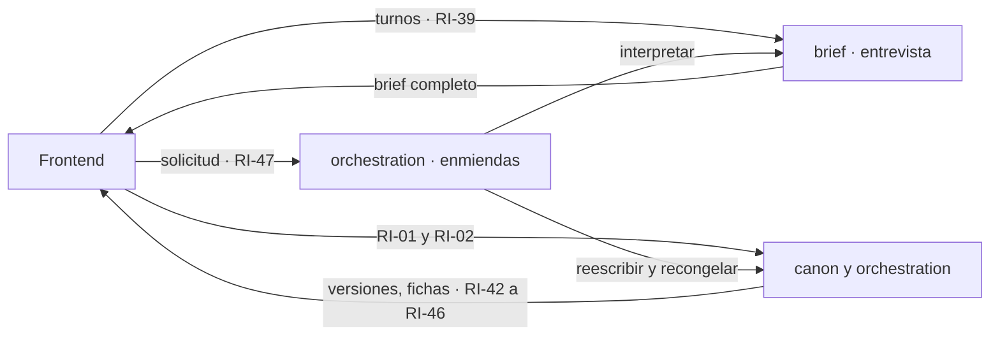

# SRS · Backend de Story-Maker · versión 3

> Especificación de requisitos de la tercera versión de `backend/`: las rutas y el comportamiento que [`srs-frontend-v1.md`](srs-frontend-v1.md) exige en su §3.2 y su §8.2 para el paso 11 del orden de construcción de [`architecture.md`](../docs/architecture.md) §14. Refina la arquitectura hasta el punto en que se puede escribir código; no la sustituye. Vocabulario: [`definitions.md`](../docs/definitions.md). Métodos: [`verification.md`](../docs/verification.md). Reglas del repositorio: [`AGENTS.md`](../AGENTS.md) §3.3. Las versiones anteriores: [`srs-backend-v1.md`](srs-backend-v1.md) y [`srs-backend-v2.md`](srs-backend-v2.md).

---

## 1. Introducción

### 1.1 Propósito

Las versiones 1 y 2 terminan una novela sin intervención, pero solo se le puede encargar a quien escriba un brief en JSON, y solo se puede leer con un cliente HTTP. Esta versión da al frontend lo que necesita para que una persona **encargue, lea y pida cambios** sin tocar nada más: la entrevista que construye el brief, la lectura por versiones, la ficha de personajes y lugares, y la solicitud de cambio que el sistema aplica solo.

El contrato de las rutas lo fija `srs-frontend-v1.md` §3.2 (RI-37 a RI-53), y aquí no se redefine: se cita por su ID y se dice cómo lo realiza el backend. Cada requisito lleva su fuente y el método `VER-NN` que lo comprueba.

### 1.2 Alcance

| Entra en la versión 3 | Sale |
|---|---|
| Brief extendido con destinatario, dedicatoria, género, tono y prohibiciones; reglas deterministas de contradicción | Un agente 14º: la entrevista no lo es (`srs-frontend-v1.md` D-49) |
| Entrevista: preguntas, respuestas, ediciones, datos que faltan, contradicciones, extracción del texto libre y brief completo | Preguntas generadas por modelo: van por plantilla (D-73) |
| Versiones del manuscrito, manifiesto, capítulo por versión con marcas de cambio | Diferencias palabra a palabra entre versiones: la marca es por escena |
| Entidades y ficha de cada una; lista de novelas | Ficha acotada al capítulo leído: decisión abierta del frontend |
| Solicitud de cambio: interpretación, cola, aplicación como retcon con recongelación, estados | Deshacer una enmienda: se pide otra |

### 1.3 Definiciones

Todo el vocabulario es el de `definitions.md`. Las tres expresiones de `srs-frontend-v1.md` §1.3 —**enmienda al brief**, **solicitud de cambio** y **entrevista**— se usan con el mismo sentido y el mismo ID al que remiten: MET-09 con procedencia `brief`, CAN-10 como efecto y PRO-01 como producto.

### 1.4 Referencias

| Documento | Qué aporta |
|---|---|
| `docs/architecture.md` | §2.2 la frontera y los encargos; §2.3 el reparto por funcionalidad; §4.2 los presupuestos; §8 cómo se aplica un cambio pedido; §10 escritura de canon |
| `docs/verification.md` | §4.5, §4.6, §4.8 los métodos de producto; §5.9 el texto no confiable; §5.11 el anclaje de citas |
| `specs/srs-backend-v2.md` | La recongelación de RF-153 y la tabla de retcons (RD-24) que la enmienda reutiliza |
| `specs/srs-frontend-v1.md` | El contrato de §3.2, las decisiones D-47 a D-61 y D-67, D-68 |

### 1.5 Convenciones

Las de `srs-backend-v1.md` §1.5. La numeración continúa la de todo `specs/`: `RF-200`, `RD-32`, `RI-57`, `RNF-48`, `D-72` y `T33` en adelante. Los números que no salen de `docs/` van marcados como propuesta con su origen.

---

## 2. Descripción general

### 2.1 Perspectiva del producto

La entrevista vive antes de la novela: no escribe canon, y su producto es un brief que el frontend envía a RI-01 tal como el backend lo devolvió. La solicitud de cambio vive después: la recibe el Orquestador, la interpreta con `brief/`, y la aplica con las piezas del retcon de la versión 2.

### 2.2 Funciones del producto

| Carpeta | Qué añade |
|---|---|
| `canon/` | Brief extendido y sus reglas (`brief_rules.py`); evento `entity.renamed`; esquema versión 3; versiones del manuscrito, solicitudes y fichas (`manuscript.py`, `entities.py`); rutas RI-42 a RI-46 |
| `brief/` | Funcionalidad nueva (D-72): borrador, preguntas, respuestas, extracción del texto libre, almacén de entrevistas, interpretación de solicitudes; rutas RI-38 a RI-40 |
| `orchestration/` | Aplicación de enmiendas (`amend.py`) en el bucle y fuera de él; rutas RI-37 y RI-47 a RI-49; inyección del proveedor en las rutas de `brief/` |

### 2.3 Actores

Los de `srs-frontend-v1.md` §2.3. El Orquestador aplica las enmiendas (D-53); nadie las aprueba.

### 2.4 Entorno de operación

El de `srs-backend-v1.md` §2.4. Las dos llamadas de modelo nuevas usan el mismo puerto y el mismo modelo que los agentes (`architecture.md` §4.8).

### 2.5 Restricciones de diseño

1. **Las escrituras nuevas son encargos.** Crear una entrevista, enviar un turno y crear una solicitud. Ninguna aprueba, rechaza ni desbloquea (`architecture.md` §2.2).
2. **Determinista antes que modelo.** Qué falta, qué se contradice, qué se pregunta y si una interpretación vale lo decide código. El modelo solo extrae hechos del texto libre e interpreta una petición.
3. **Texto de persona, dato no confiable.** El texto libre y la petición van en un bloque delimitado del paquete, nunca en la instrucción, y lo que devuelve el modelo se valida antes de usarse (`verification.md` §5.9).
4. **La versión anterior se conserva.** Recongelar reemplaza el índice; el texto anterior de cada escena reescrita se guarda antes, y ninguna lectura de una versión pasada cambia después.

### 2.6 Supuestos y dependencias

| Supuesto | Consecuencia si falla |
|---|---|
| El retcon con recongelación de `srs-backend-v2.md` RF-151 a RF-155 existe | Existe y está en verde (T23) |
| El Reparador puede reescribir un pasaje con el hecho nuevo delante | Es `retcon_rewrite` de la versión 2 |
| La escaleta congelada no tiene almacén propio | El título de capítulo va nulo en el manifiesto (D-79) |

---

## 3. Requisitos de interfaces externas

### 3.1 Rutas

Las de `srs-frontend-v1.md` §3.2 con su contrato, más dos cambios de las rutas que ya existían, entregados durante T28 del frontend:

| RI | Qué cambia | Verificación |
|---|---|---|
| RI-57 | RI-06 devuelve también las relaciones vigentes en el instante pedido, con tipo y vigencia, porque MUN-10 las incluye. Ningún paquete de contexto las lee | VER-08 |
| RI-58 | RI-04 devuelve el instante de mundo en que termina cada capítulo, y cuenta escenas y no fragmentos | VER-08 |

Dónde vive cada ruta: RI-42 a RI-46 en `canon/`, que es dueño de lo que sirven; RI-38 a RI-40 en `brief/`; RI-37 y RI-47 a RI-49 en `orchestration/`: la lista de novelas lleva el estado de la tirada, que es del Orquestador, y las solicitudes las aplica él (D-53, D-72).

### 3.2 Proveedor

- **RI-59** Las rutas de `brief/` reciben el proveedor por dependencia, y quien la resuelve es la raíz de composición, `orchestration/app.py`: `brief/` no conoce el transporte. Las pruebas la sustituyen por un doble (`srs-backend-v1.md` RI-11).

---

## 4. Requisitos funcionales

### 4.1 `canon/` · brief extendido (T34)

| RF | Requisito | Fuente | Verificación |
|---|---|---|---|
| RF-200 | El brief admite destinatario —entidad del brief, edad, rasgos, recuerdos y papel—, género, tono, dedicatoria, palabras prohibidas y temas prohibidos. Todos opcionales, para que los briefs anteriores sigan valiendo | `srs-frontend-v1.md` RI-41; PRO-01 | VER-01, VER-05 |
| RF-201 | Tres reglas deterministas de contradicción del brief (D-75): destinatario menor de 12 años con género o tono de la lista adulta; palabra prohibida presente en el título, la dedicatoria o un nombre de entidad; tema prohibido que es el propio género o tono. Las tres comparan por palabra normalizada (`srs-backend-v4.md` RF-237). RI-01 rechaza un brief con alguna, con la lista de campos y regla | `srs-frontend-v1.md` RI-41, RF-172; CAN-05 | VER-05, VER-06 |
| RF-202 | Las palabras prohibidas del brief entran como proscritas (POE-12) al crear la novela, con nivel `cliente`, así que `check.forbidden` las detecta en cada escena (`srs-backend-v4.md` RF-236) | `architecture.md` §9.1 | VER-05 |

### 4.2 `canon/` · versiones, fichas y lista de novelas (T34)

| RF | Requisito | Fuente | Verificación |
|---|---|---|---|
| RF-203 | La versión 1 del manuscrito (PRO-08) es la tirada. Cada enmienda aplicada produce la siguiente, con su causa y los capítulos que cambió. Antes de recongelar una escena, su texto anterior se guarda con la última versión en que regía | `srs-frontend-v1.md` D-52 | VER-05, VER-06 |
| RF-204 | El texto de una escena en la versión `v` es el guardado con la menor versión mayor o igual que `v`, o el vigente si no hay ninguno. Una versión contiene los capítulos congelados hasta que se creó la siguiente | `srs-frontend-v1.md` RI-44 | VER-06 |
| RF-205 | El manifiesto (RI-43) lleva título, dedicatoria y nombre del destinatario del brief; capítulos con número, título, palabras en esa versión y marca de cambiado respecto a la anterior; y si es la vigente. El título de capítulo va nulo (D-79) | `srs-frontend-v1.md` RI-43 | VER-05 |
| RF-206 | El capítulo en una versión (RI-44) lleva sus escenas en orden, con identificador de `prose_scene`, número, POV, texto de esa versión y marca de cambiada en ella | `srs-frontend-v1.md` RI-44 | VER-05 |
| RF-207 | Las entidades (RI-45) llevan tipo, nombre canónico, alias vigentes y capítulos donde aparecen como POV, lugar o elenco de una escena congelada. El tipo filtra por `person`, `place`, `institution` y `object` | `srs-frontend-v1.md` RI-45; CAN-03 | VER-05 |
| RF-208 | La ficha (RI-46) lleva la ficha compacta (CTX-05), los hechos vigentes con atributo, valor y procedencia del evento que los estableció (MET-09), las relaciones vigentes con tipo y vigencia, y las apariciones por capítulo y escena | `srs-frontend-v1.md` RI-46 | VER-05 |
| RF-209 | La lista de novelas (RI-37) lleva, por cada fichero del directorio de tiradas, identificador, título del brief, estado de la tirada y número de versiones | `srs-frontend-v1.md` RI-37, D-61 | VER-05 |
| RF-210 | Un cambio de nombre es el evento `entity.renamed` (D-76): cambia el nombre canónico de la entidad en todo el canon, y el nombre anterior no queda como alias | `architecture.md` §8 | VER-05, VER-06 |

### 4.3 `brief/` · la entrevista (T35)

| RF | Requisito | Fuente | Verificación |
|---|---|---|---|
| RF-211 | Crear una entrevista (RI-38) devuelve su identificador, la primera pregunta, el borrador vacío y la lista de datos que faltan | `srs-frontend-v1.md` RI-38 | VER-05 |
| RF-212 | El entrevistador pregunta por plantilla (D-73), una pregunta por campo, en orden fijo: primero los obligatorios —título, nombre, edad y papel del destinatario, premisa, género, tono, extensión, fecha de arranque y dedicatoria—, después los opcionales —rasgos, recuerdos, palabras y temas prohibidos—, salvo la fecha de nacimiento, opcional, que va justo tras la edad (`srs-backend-v4.md` RF-249). Un opcional se da por contestado con «ninguno» | `architecture.md` §1 | VER-05 |
| RF-213 | Una respuesta rellena el campo de la pregunta en curso con análisis determinista: entero para edad y extensión, fecha `AAAA-MM-DD` para el arranque, lista separada por comas para los campos de lista. Si no se entiende, el campo sigue faltando y la respuesta del entrevistador lo dice | `srs-frontend-v1.md` RF-168 | VER-05, VER-06 |
| RF-214 | Una edición estructurada cambia un campo por nombre, con el mismo análisis que una respuesta. El borrador que se devuelve es el guardado | `srs-frontend-v1.md` RF-170 | VER-05 |
| RF-215 | Los datos que faltan son los campos obligatorios vacíos, calculados por código, con su etiqueta | `srs-frontend-v1.md` RF-171, D-51 | VER-05 |
| RF-216 | Las contradicciones son las reglas de RF-201 aplicadas al borrador, cada una con sus dos campos y la regla | `srs-frontend-v1.md` RF-172 | VER-05 |
| RF-217 | El texto libre va a una llamada de modelo, `brief.extract`, como bloque no confiable. Devuelve hechos propuestos —rasgo o recuerdo del destinatario, o personaje o lugar nuevo— cada uno con su cita. Una cita que no aparece literal en el texto se descarta y consta. Un texto de más de 8.000 tokens se rechaza con error explícito, nunca se trunca. Si el modelo falla, el turno sigue con cero propuestas y la respuesta lo dice | `srs-frontend-v1.md` RF-173, RF-174, D-50; `verification.md` §5.9, §5.11 | VER-05, VER-17 |
| RF-218 | Aceptar un hecho propuesto lo aplica al borrador; descartarlo lo deja fuera. Nada del texto libre entra de otra forma | `srs-frontend-v1.md` RF-174 | VER-05 |
| RF-219 | Sin datos que faltan ni contradicciones, el estado declara el brief completo y lo lleva en la forma que RI-01 acepta, con la guía de estilo compuesta a partir de premisa, género, tono, destinatario y prohibiciones, más un identificador de novela sugerido (D-81) | `srs-frontend-v1.md` RF-175, RI-41 | VER-05, VER-08 |
| RF-220 | El estado de la entrevista se guarda tras cada turno y RI-40 lo devuelve igual que RI-39. Una entrevista abandonada no deja nada que bloquee la creación de otra ni ninguna tirada | `srs-frontend-v1.md` RF-167, RNF-39 | VER-05 |

### 4.4 Solicitudes de cambio (T36)

| RF | Requisito | Fuente | Verificación |
|---|---|---|---|
| RF-221 | Crear una solicitud (RI-47) la interpreta en la misma llamada con `amend.interpret`: la petición como bloque no confiable, el ancla y las fichas compactas de las entidades candidatas —las de la escena del ancla de fragmento o la del ancla de hecho—. El código valida la salida: exactamente una entidad existente, un atributo vigente de ella o `nombre`, y un valor nuevo no vacío y distinto del vigente | `srs-frontend-v1.md` RI-47, RI-52; `architecture.md` §8 | VER-05, VER-17 |
| RF-222 | Lo que no valida se rechaza en la misma respuesta con su motivo: ambigua, entidad desconocida, atributo desconocido, sin cambio o valor vacío. Lo que valida queda `queued` con su interpretación | `srs-frontend-v1.md` RI-52, RF-188 | VER-05 |
| RF-223 | Las solicitudes se aplican de una en una por novela, en orden de llegada (D-77): con una tirada en marcha, tras cada capítulo congelado y al cerrar la obra; sin tirada, el Orquestador la aplica enseguida en su hilo | `srs-frontend-v1.md` D-53 | VER-05 |
| RF-224 | Aplicar una solicitud reescribe, con el Reparador y el hecho nuevo delante, cada escena congelada cuyo texto contiene el valor anterior y en la que la entidad es POV, lugar o elenco —en un cambio de nombre, toda escena que nombra a la entidad por alguna forma de su nombre anterior (D-83), porque el nombre en el texto ya es la señal—; la reverifica con `check.*` y el Continuista; y la recongela junto con el evento de procedencia `brief`, en una sola transacción. Sin la regla de los 3 pasajes (`srs-frontend-v1.md` D-48) | `architecture.md` §8, §10 | VER-05 |
| RF-225 | Un defecto cuya evidencia contiene el valor nuevo —o, en un cambio de nombre, una palabra suya de tres letras o más— es la enmienda misma y no cuenta (D-78), ni uno que ya estaba en la escena antes de reescribirla (D-84). Cualquier otro S1, o el valor anterior aún en la escena, rechaza la solicitud con el motivo y no toca nada: invariante duro gana | `architecture.md` §8 | VER-05 |
| RF-226 | Los estados son `queued`, `applying`, `applied` y `rejected`, y solo los cambia el backend. Aplicada, la solicitud lleva la versión que produjo y sus capítulos cambiados. Un fallo del proveedor durante la aplicación la rechaza con motivo; una que quedó en `applying` por una caída vuelve a `queued` al aplicar la siguiente | `srs-frontend-v1.md` RI-51 | VER-05 |
| RF-227 | Las dos llamadas nuevas pasan por el puerto de proveedor con su presupuesto de `architecture.md` §4.2 comprobado antes de llamar, y su salida se valida con esquema; la interpretación y la aplicación se trazan en la traza de la novela | `architecture.md` §4.2, §11 | VER-05, VER-09 |

---

## 5. Requisitos de datos

| RD | Requisito | Fuente | Verificación |
|---|---|---|---|
| RD-32 | Las entrevistas viven en `_interviews.sqlite`, en el directorio de tiradas —el guion bajo no es un identificador de novela válido, así que el almacén nunca choca con una novela—: una fila por entrevista con su estado, y sus turnos en una tabla que solo admite inserciones (D-74) | `AGENTS.md` §3.2 | VER-05 |
| RD-33 | `change_request` en el fichero de la novela: texto, ancla, estado, interpretación —entidad, atributo, valor anterior y nuevo—, motivo, versión producida y capítulos cambiados | `srs-frontend-v1.md` RI-49 | VER-05 |
| RD-34 | `manuscript_version` —versión, causa, capítulos cambiados, último capítulo congelado al crearse— y `scene_text_history` —escena, última versión en que regía, texto—. Las dos tablas solo admiten inserciones: ni se actualizan ni se borran | `srs-frontend-v1.md` D-52 | VER-06 |
| RD-35 | El esquema pasa a la versión 3 solo añadiendo tablas, como la 2 (`srs-backend-v2.md` RI-35) | `srs-backend-v2.md` RI-35 | VER-05 |
| RD-36 | `entity.renamed` entra en el conjunto cerrado de tipos de evento con entidad y nombre nuevo | MET-05 | VER-01, VER-05 |

---

## 6. Requisitos no funcionales

| RNF | Requisito | Fuente | Verificación |
|---|---|---|---|
| RNF-48 | Las únicas operaciones de escritura nuevas son `POST /interviews`, `POST /interviews/{iid}/turns` y `POST /novels/{id}/change-requests`. Ninguna ruta aprueba, rechaza ni desbloquea | `architecture.md` §2.2; PRO-11 | VER-08 |
| RNF-49 | El texto libre y la petición nunca van en la instrucción del modelo, sino en un bloque delimitado del paquete; nada de lo que devuelven llega al brief ni al canon sin pasar la validación de código (RF-217, RF-221) | `verification.md` §5.9; `srs-backend-v1.md` RNF-12 | VER-17 |
| RNF-50 | Aplicar una enmienda es atómico: una caída antes de confirmar la transacción deja la versión anterior intacta, sin versión nueva y sin historia a medias | `srs-backend-v2.md` RNF-30 | VER-05 |
| RNF-51 | Presupuestos (D-80): `brief.extract` 9.000 de entrada y 2.000 de salida; `amend.interpret` 7.100 y 500. Una entrada que no cabe se rechaza antes de llamar | `architecture.md` §4.2 | VER-12 |
| RNF-52 | Todas las rutas nuevas entran en `backend/openapi.json` y la comprobación generativa de `schemathesis` corre sobre ellas (`srs-frontend-v1.md` RI-50) | `srs-backend-v1.md` RI-08 | VER-08 |

---

## 7. Verificación

### 7.1 Matriz requisito × método

| Método | Requisitos que cubre como método principal |
|---|---|
| VER-01 Type checking | RF-200, RD-36 |
| VER-05 Unit e integration | RF-202, RF-203, RF-205 a RF-209, RF-211, RF-212, RF-214 a RF-216, RF-218, RF-220, RF-222 a RF-226, RD-32, RD-33, RD-35, RNF-50 |
| VER-06 Property-based | RF-201, RF-204, RF-210, RF-213, RD-34 |
| VER-08 Contract | RI-57, RI-58, RI-59, RF-219, RNF-48, RNF-52 |
| VER-09 Tracing | RF-227 |
| VER-12 Guardrails | RNF-51 |
| VER-17 Red-teaming | RF-217, RF-221, RNF-49 |

### 7.2 Puerta de CI

La de `srs-backend-v1.md` §7.2 con `brief/` dentro de los contratos de `import-linter`, más la comprobación del contrato versionado que ya corre en `gate.py`.

### 7.3 Propiedades que se traducen sin trabajo

| Regla | Propiedad | Requisito |
|---|---|---|
| Versión conservada | Tras aplicar cualquier secuencia de enmiendas, el texto de cada escena en la versión 1 es el que tenía antes de la primera | RF-203, RF-204, RD-34 |
| Análisis de respuestas | Toda edad y extensión que se escribe en cifras se lee igual; cualquier otra cosa deja el campo faltando | RF-213 |
| Renombrado | Tras `entity.renamed`, el nombre anterior no aparece ni como nombre ni como alias, y reconstruir el canon desde cero da lo mismo | RF-210 |
| Reglas del brief | Un brief sin prohibiciones y con destinatario de 12 años o más no tiene contradicciones, sea cual sea su texto | RF-201 |

### 7.4 Riesgo aceptado propio de la versión 3

| Riesgo | Por qué queda en U | Señal |
|---|---|---|
| Que la extracción del texto libre proponga hechos correctos en la forma y equivocados en el fondo | Comprobarlo exige otro modelo; la persona acepta o descarta cada uno con su cita delante | Hechos descartados por entrevista |
| Que el Reparador cambie el valor y deje una alusión indirecta al antiguo | La comprobación busca el valor literal; una perífrasis no la dispara | Solicitudes seguidas de otra sobre el mismo hecho (`srs-frontend-v1.md` §7.4) |

---

## 8. Fuera de alcance

| Qué | Motivo |
|---|---|
| Preguntas generadas por modelo | Determinista antes que modelo (D-73) |
| Deshacer una enmienda | Se pide otra: cada versión tiene una sola causa (`srs-frontend-v1.md` D-52) |
| Títulos de capítulo | La escaleta no tiene almacén propio (D-79) |

---

## 9. Decisiones tomadas en este documento

| D | Decisión | Elección | Por qué |
|---|---|---|---|
| D-72 | Dónde vive la entrevista | Funcionalidad nueva `brief/`, en el piso de las funcionalidades: borrador, preguntas, extracción, almacén de entrevistas e interpretación de solicitudes. Las rutas de solicitudes, en `orchestration/` | La entrevista no es canon —no escribe hechos— ni es de ninguna capa de la novela. Las solicitudes las aplica el Orquestador (D-53), y solo él puede componer el Reparador con el canon |
| D-73 | Quién pregunta | Plantillas por campo en orden fijo; el modelo solo extrae del texto libre e interpreta la petición | Qué falta ya lo sabe el código (D-51): preguntar por lo que falta no necesita un modelo, y una pregunta que un modelo improvisa puede pedir lo que no hace falta |
| D-74 | Dónde se guardan las entrevistas | `_interviews.sqlite` en el directorio de tiradas | Una entrevista no es una novela y no tiene fichero propio hasta RI-01; un fichero para todas mantiene «un fichero por novela» sin ficheros vacíos |
| D-75 | Reglas de contradicción | Tres. Edad: **propuesta**, menor de 12 años con un género o un tono que contenga, por palabra normalizada y con sus variantes (`srs-backend-v4.md` RF-237), `terror`, `erótico`, `erótica`, `gore`, `violento`, `violenta`, `macabro` o `macabra` (`srs-backend-v4.md` D-99): la lista es una para los dos campos. El 12 sale de la franja PEGI 12, la primera que el sistema de clasificación europeo separa de las edades infantiles. Prohibición presente en título, dedicatoria o nombre. Tema prohibido igual al género o al tono | Son las que se comprueban sin juicio. Una regla que necesite leer la premisa necesitaría un modelo, y la persona ve la contradicción y la corrige |
| D-76 | Cómo se cambia un nombre | Evento `entity.renamed`, retroactivo: la entidad se llama así desde siempre | Quien encarga no dice «desde el capítulo 7 se llama Nala», dice que se llama Nala. Dejar el nombre anterior como alias haría que `check.lexicon` lo siguiera aceptando |
| D-77 | Cuándo y en qué orden se aplica | Una a la vez por novela, en orden de llegada; en tirada, tras cada congelación y al cerrar; sin tirada, enseguida en el hilo del Orquestador, que se registra como la tirada de esa novela | Dos enmiendas a la vez podrían reescribir la misma escena. En serie, cada versión tiene exactamente una causa |
| D-78 | Qué defectos cuentan al reverificar | Todos menos los que citan el valor nuevo, y en un cambio de nombre también los que citan una palabra suya de tres letras o más, la misma forma que D-83 usa para el nombre anterior | El canon todavía dice el valor anterior mientras se verifica, así que `check.lexicon` y el Continuista ven el nuevo como contradicción. Esa contradicción es la enmienda: el brief gana sobre el canon derivado (PRO-10). En un nombre de dos palabras, `check.lexicon` cita la palabra suelta —«Ruiz» de «Mateo Ruiz»—, y sin la segunda parte la enmienda se rechazaría aunque la reescritura fuera buena |
| D-79 | Título de capítulo en el manifiesto | Nulo | La escaleta no se guarda: no hay de dónde sacarlo sin inventarlo |
| D-80 | Presupuestos de las dos llamadas | `brief.extract`: 8.000 del texto libre, el mismo bloque que un capítulo completo en §4.2, más 500 de borrador y 500 de instrucción; salida 2.000, la del Árbitro. `amend.interpret`: 4.500 de la cita, el techo de la prosa literal de una escena de §4.3, 1.600 de fichas, el bloque 2 de §4.3, 500 de petición y 500 de instrucción; salida 500, un solo JSON | Todos los sumandos salen de `architecture.md` §4.2 y §4.3. Un texto libre más largo que un capítulo no es una anécdota, es un manuscrito, y se rechaza |
| D-81 | Identificador de novela sugerido | El título en minúsculas sin acentos, con guiones, hasta 40 caracteres, más `-` y los 4 primeros caracteres del identificador de la entrevista | Cumple el patrón de identificador de RI-01, se lee, y dos novelas con el mismo título no chocan |
| D-82 | Cuándo se interpreta | En la misma llamada de RI-47 | RF-188 del frontend muestra la interpretación al instante, y una solicitud que no se entiende se rechaza antes de encolarse |
| D-83 | Qué formas de un nombre busca y quita un cambio de nombre | El nombre completo y cada palabra suya de tres letras o más que no esté en el nombre nuevo | La prosa nombra por el nombre de pila aunque el canon guarde el completo: «Marcos» y no «Marcos Vela». Buscar solo el completo no encontraría ninguna escena. Una palabra que sigue en el nombre nuevo, como «Marcos» al pasar a «Marcos Ruiz», no se quita |
| D-84 | Qué defectos de una reescritura cuentan contra la enmienda | Los que la reescritura abre: no cuenta el que cita algo que ya estaba tal cual en la escena antes de reescribirla | Es la regla de la reparación de la versión 1, donde solo se revierte la que abre un S1 nuevo. Sin ella, un defecto previo de la versión 1 tumbaría cualquier enmienda sobre esa escena |

---

## 10. Decisiones abiertas

| Decisión | Estado |
|---|---|
| Reglas de contradicción que exigen juicio, como premisa frente a edad | Abierta. Hoy solo las tres deterministas |
| Guardar la escaleta y servir títulos de capítulo | Abierta. Cambia RF-205 sin cambiar el contrato: el campo ya existe |

---

## 11. Plan de ejecución

| # | Tramo | Qué entrega | Requisitos | Puerta para seguir |
|---|---|---|---|---|
| **T33** | `specs/srs-backend-v3.md` | Este documento | — | `coherence.py` en verde con él dentro |
| **T34** | `canon/` · brief, versiones y fichas | Brief extendido y reglas, proscripción del brief, `entity.renamed`, esquema 3, versiones, manifiesto, capítulo por versión, entidades, ficha, lista de novelas en `orchestration/` | RF-200 a RF-210, RD-34 a RD-36, RI-57, RI-58 | Con una enmienda aplicada a mano sobre un fichero de prueba, la versión 1 se lee igual que antes y la 2 marca sus capítulos y escenas |
| **T35** | `brief/` · entrevista | Borrador, preguntas, análisis, ediciones, reglas, extracción con doble, almacén, rutas RI-38 a RI-40 | RF-211 a RF-220, RD-32, RI-59, RNF-49 | Una entrevista con doble llega a brief completo y RI-01 lo acepta; un texto libre con una instrucción incrustada no entra sin aceptarse |
| **T36** | `orchestration/` · enmiendas | Interpretación, cola, aplicación en el bucle y fuera de él, estados, rutas RI-47 a RI-49 | RF-221 a RF-227, RD-33, RNF-48, RNF-50 a RNF-52 | Pedir «el perro se llama Nala» sobre una novela cerrada con dobles produce la versión 2 con sus escenas reescritas, y la versión 1 sigue igual |

### 11.1 Qué significa que la versión 3 está terminada

- [ ] T34 a T36 pasaron su puerta
- [ ] `backend/openapi.json` declara RI-37 a RI-49 y el frontend compila contra él
- [ ] La puerta de CI en verde, con `brief/` dentro de los contratos de importación

---

## Apéndice A · Trazabilidad con `definitions.md`

| Capa | IDs |
|---|---|
| MET | 05 con `entity.renamed`; 09 como procedencia de la enmienda |
| CAN | 03 en la ficha; 05 en las reglas del brief; 10 como la enmienda aplicada |
| CTX | 05 en la ficha compacta |
| POE | 12 con las palabras prohibidas |
| PRO | 01 construido por la entrevista; 08 en las versiones |
