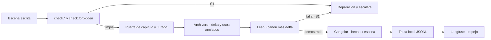

# SRS · Backend de Story-Maker · versión 4

> Especificación de requisitos de la cuarta versión de `backend/`: verificación formal de la cronología, guardarraíl bloqueante de palabras prohibidas, observabilidad con Langfuse como espejo, memoria de uso de hechos, hooks de Claude Code, endurecimiento de verificadores y del brief, Jurado con las dimensiones del encargo y evaluación del sistema. Refina la arquitectura hasta el punto en que se puede escribir código; no la sustituye. Vocabulario: [`definitions.md`](../docs/definitions.md). Métodos: [`verification.md`](../docs/verification.md). Reglas del repositorio: [`AGENTS.md`](../AGENTS.md) §3.3. Las versiones anteriores: [`srs-backend-v1.md`](srs-backend-v1.md), [`srs-backend-v2.md`](srs-backend-v2.md) y [`srs-backend-v3.md`](srs-backend-v3.md).

---

## 1. Introducción

### 1.1 Propósito

Las versiones 1 a 3 escriben, verifican, versionan y enmiendan una novela sin intervención. Esta versión no añade un paso al orden de construcción de `architecture.md` §14: endurece los que ya existen donde hoy dejan pasar algo o no dejan rastro.

| Hueco de hoy | Qué lo cierra |
|---|---|
| Una palabra prohibida del brief es S2 y se congela | `check.forbidden`, S1 en cada intento y otra vez antes de congelar |
| La cronología se comprueba solo por fechas citadas | Lean 4 demuestra sus invariantes antes de cada congelación |
| Qué capítulos usan un hecho se calcula al vuelo | Registro hecho × escena escrito al congelar, y vista de cronología |
| La traza es un fichero que solo se lee a mano | Langfuse como espejo: sesión por novela, spans, scores, coste y prompts versionados |
| El Jurado no puntúa continuidad, tono, arco ni personalización | Rúbricas versión 2, con el destinatario delante como dato |
| Nada comprueba que los recuerdos del destinatario salgan | Elementos obligatorios como setups con uso anclado |
| El trabajo de desarrollo no tiene hooks | Hooks de Claude Code que llaman a los validadores reales |
| No hay conjunto de evaluación del sistema | Cinco briefs, tabla por brief generada, lectura humana comparada con el Jurado y una iteración de tuning |

Cada requisito lleva su fuente y el método `VER-NN` que lo comprueba.

### 1.2 Alcance

| Entra en la versión 4 | Sale |
|---|---|
| Espejo de la traza en Langfuse, con aislamiento de los `claude -p` del motor | Leer prompts o configuración de Langfuse durante una tirada (D-86) |
| Generador de Lean desde el SQLite, cuatro invariantes, `lake build` en la puerta y antes de congelar | Demostrar que la prosa narra lo exportado: lo cubren VER-05 y CAL-03 |
| Guardarraíl de prohibidas bloqueante, con tres niveles y registro de cada coincidencia | Detectar temas prohibidos en la prosa: riesgo aceptado (§7.4) |
| Hecho × escena y vista de cronología | Una cronología con verdad propia: es proyección (D-89) |
| Hooks de Claude Code y audit log verificable | Hooks dentro del ciclo de generación: no los hay (D-92) |
| Tono adulto en las contradicciones, `extra='forbid'` en los esquemas del brief, fecha de nacimiento | Reglas de contradicción que exijan leer la premisa |
| Rúbricas versión 2 y elementos obligatorios del destinatario | Sustituir al Continuista: la continuidad factual sigue siendo suya |
| Modelo TLA+ del flujo completo | Verificar el orquestador contra el modelo: VER-05 |
| Validación visual con un MCP de navegador | Cambiar pantallas o contratos del frontend: no se toca ninguno (D-96) |
| Conjunto de cinco briefs, tabla por brief, lectura humana y tuning | Que la lectura humana entre en una tirada: es un eval fuera del ciclo (`verification.md` §5.5) |

### 1.3 Definiciones

Todo el vocabulario es el de `definitions.md`. Tres expresiones de este documento no son términos nuevos sino nombres de datos:

| Expresión | Qué es | ID al que remite |
|---|---|---|
| **Palabra prohibida** | Término de la lista de proscripción que viene del encargo y no de la estética | POE-12 con procedencia `brief` (MET-09) |
| **Elemento obligatorio** | Rasgo o recuerdo del destinatario que el brief exige que aparezca | Setup (CAN-06) de procedencia `brief` |
| **Fecha de nacimiento** | Atributo reservado `birth_date` de una persona | MET-02 sobre PER-01 |

### 1.4 Referencias

| Documento | Qué aporta |
|---|---|
| `docs/architecture.md` | §2.1 y §2.3 el reparto; §3.1 y §3.3 los almacenes y la congelación; §4.2, §4.8 y §4.9 presupuestos, proveedores y recetas; §9.1 a §9.3 verificadores y puertas; §10 escritura de canon; §11 observabilidad |
| `docs/verification.md` | §4.4 Lean y el modelo formal; §5.1 el espejo; §5.2 y §5.5 los evals y la lectura humana; §5.4 los guardarraíles; §5.10 TLA+ |
| `specs/srs-backend-v3.md` | El brief extendido, la entrevista y las solicitudes de cambio que esta versión endurece |

### 1.5 Convenciones

Las de `srs-backend-v1.md` §1.5. La numeración continúa la de todo `specs/`: `RF-228`, `RD-37`, `RI-60`, `RNF-53`, `D-85` y `T37` en adelante. Los números que no salen de `docs/` van marcados como propuesta con su origen.

---

## 2. Descripción general

### 2.1 Perspectiva del producto

Nada de lo nuevo decide fuera de las puertas que ya existen: el guardarraíl y Lean producen defectos S1 que entran por la escalera de `architecture.md` §7.3, y el espejo solo lee la traza.

### 2.2 Funciones del producto

| Carpeta | Qué añade |
|---|---|
| `commons/` | Exportador a Langfuse (`tracing/langfuse_export.py`); coste y latencia en el puerto; aislamiento del CLI; cadena de hashes en la traza |
| `verification/` | `checks/forbidden.py`; `formal/` con el generador de Lean y el proyecto Lake; rúbricas versión 2 del Jurado; verificadores endurecidos |
| `canon/` | Niveles de proscripción, hecho × escena, vista de cronología, atributos reservados, elementos del brief |
| `brief/` | Tono adulto, esquemas estrictos, fecha de nacimiento, traza de la entrevista |
| `planning/` | Elementos obligatorios planificados como setups |
| `orchestration/` | Puerta formal antes de congelar, parada informada del guardarraíl, prohibiciones por solicitud, publicador de prompts, modelo TLA+ del flujo completo |
| `evals/` | Cinco briefs, tabla por brief, plantilla humana, comparación con el Jurado y tuning |
| Raíz del repositorio | `.claude/settings.json` y `.claude/hooks/` para el trabajo de desarrollo; `.mcp.json` con el MCP de navegador |
| `frontend/visual/` | Recorrido visual repetible |

### 2.3 Actores

Los de `srs-backend-v1.md` §2.3. Aparece uno fuera del ciclo, **quien lee para evaluar**: una persona que puntúa una novela ya congelada con la rúbrica del Jurado (`verification.md` §5.5). No aprueba, no corrige y su resultado no entra en ninguna tirada.

### 2.4 Entorno de operación

El de `srs-backend-v1.md` §2.4, con dos herramientas más en la máquina y en CI: la cadena Lean 4 con `lake`, instalada con `elan` y fijada en `lean-toolchain`, y Java con `tla2tools.jar` en una versión fija. La red del contenedor es la de Claude y la de Langfuse (RNF-11).

### 2.5 Restricciones de diseño

1. **Lo nuevo entra por las puertas que existen.** Un fallo del guardarraíl o de Lean es un S1 con cita que vuelve al Reparador por la escalera de `architecture.md` §7.3. No hay puerta nueva con remedio propio.
2. **La observabilidad observa y no gobierna.** El espejo no para, no espera y no decide; todo lo que muestra se reconstruye desde el JSONL (D-11).
3. **Determinista antes que modelo.** Guardarraíl, generador de Lean, hooks, registro de usos y tablas de evaluación son código. El modelo solo cita dónde aparece un elemento, y la cita se ancla (VER-19).
4. **Fallo cerrado.** Si `lake` no está, la tirada no arranca; si un hook no puede importar el backend, bloquea.
5. **Los hooks son del desarrollo, no de la novela.** Actúan sobre lo que hace Claude Code en este repositorio y nunca dentro de una tirada, así que no introducen revisión del texto (`AGENTS.md` §5.3).

### 2.6 Supuestos y dependencias

| Supuesto | Consecuencia si falla |
|---|---|
| La máquina de la defensa tiene `elan`, `lake`, Java y `tla2tools.jar` | La tirada no arranca (RF-255) y la puerta falla: fallo cerrado |
| El JSON del CLI trae un campo de coste por llamada | El coste va nulo, nunca inventado (RF-235) |
| La tirada T16 cierra y deja `golden/v1-seed/` | Las tiradas de evaluación de T52 esperan; el código de T38 a T51 se construye con dobles |
| El MCP de navegador conecta | T49 lo sustituye por el guion de Playwright, que es el mismo recorrido sin agente |

---

## 3. Requisitos de interfaces externas

### 3.1 Langfuse

- **RI-60** El exportador lee `LANGFUSE_PUBLIC_KEY`, `LANGFUSE_SECRET_KEY` y `LANGFUSE_BASE_URL` del entorno. Si falta alguna, no envía nada, deja un registro `export.disabled` en la traza una sola vez y la tirada sigue. Ningún valor de clave aparece en el repositorio ni en la traza (`architecture.md` §11). Método: VER-05.
- **RI-61** Reexportación por lote: `python -m commons.tracing.langfuse_export --novel <id> [--runs-dir <dir>]` recorre la traza de una novela, y la de las entrevistas de las que salió, y la envía con la misma correspondencia que el conductor en vivo. Reexportar actualiza y no duplica (RF-234). Método: VER-05.
- **RI-62** El puerto lanza cada `claude -p` del motor sin cargar la configuración de usuario ni la del proyecto —ni plugins, ni hooks, ni `CLAUDE.md`, ni skills, ni servidores MCP— y con un entorno del que se quitan las variables `LANGFUSE_*` y `OTEL_*`. Una prueba fija la lista de argumentos y el entorno. El suelo de andamiaje de `architecture.md` §4.8 se vuelve a medir con esta forma, y mientras no se mida se conserva, porque sobreestimar es el lado seguro. Método: VER-11.

### 3.2 Lean

- **RI-63** `python -m verification.formal.generate <novela.sqlite> -o <fichero.lean>` escribe el fichero de la cronología. El proyecto Lake vive en `backend/verification/formal/lean/` con `lakefile.toml`, `lean-toolchain` fijado a una versión estable concreta, `StoryMaker/Types.lean`, `StoryMaker/Invariants.lean` y el fichero generado; sin Mathlib. Una fixture limpia y otra sembrada viven en `backend/verification/formal/fixtures/`. Método: VER-05.

### 3.3 Rutas

- **RI-64** RI-01 y el brief que devuelven RI-39 y RI-40 rechazan cualquier campo que el esquema no declare, con 422 y la ruta del campo. `backend/openapi.json` y el cliente del frontend se regeneran en el mismo cambio (D-93). Método: VER-08.
- **RI-65** RI-27 devuelve además `chain_broken_at`: el número del primer registro cuya cadena no verifica, o nulo (RF-253). Es un campo añadido; ningún consumidor existente cambia. Método: VER-08.
- **RI-67** La interpretación de RI-49 lleva además `kind`, `fact` o `forbid`, y `term`, nulo salvo en `forbid` (RF-256). Es un campo añadido con valor por defecto `fact`. Método: VER-05.

### 3.4 Claude Code y navegador

- **RI-66** `.claude/settings.json` declara dos hooks. `PostToolUse` con `Write|Edit|MultiEdit` ejecuta `python .claude/hooks/chapter_gate.py`, que lee el JSON del hook por la entrada estándar, actúa solo sobre `*.chapter.md` y `*.chapter.txt`, sale con 0 si pasa y con 2 y los defectos con su cita en la salida de error si no; y admite un modo manual `--novel <fichero.sqlite> --chapter N`. `PreToolUse` con `Write|Edit|MultiEdit|Read|Bash` ejecuta `python .claude/hooks/policy.py`, que devuelve el JSON de decisión de Claude Code con `permissionDecision` y su motivo. Método: VER-05.
- **RI-68** `python -m orchestration.prompts_sync` publica en Langfuse el texto de los prompts de cada agente (RF-266). Método: VER-05.
- **RI-69** `.mcp.json` declara el MCP de navegador de Playwright para la validación visual, y `frontend/visual/tour.mjs` es el mismo recorrido como guion repetible (RF-267). Método: VER-05.

---

## 4. Requisitos funcionales

### 4.1 `orchestration/model/` · TLA+ del flujo completo (T38)

| RF | Requisito | Fuente | Verificación |
|---|---|---|---|
| RF-228 | Un modelo `run.tla` compone la tirada entera y usa el de capítulo como subacción: configuración, planificación con el reintento de `outline.check`, capítulos con la guarda de RF-107, caída y reanudación desde la última escena cerrada descartando lo posterior (PRO-I2), aborto por delta vacío, cierre que publica la versión 1 y enmiendas entre congelaciones que publican la N+1 o se rechazan sin cambiar la versión | `verification.md` §5.10; `architecture.md` §7 | VER-18 |
| RF-229 | El modelo declara al menos tres invariantes de seguridad no vacuos —cada uno roto por una mutación versionada en `model/mutations/`— y la propiedad de terminación «toda generación acaba publicada o abortada», con equidad débil sobre las acciones de progreso y nunca sobre la caída. La salida de TLC del modelo limpio y de cada mutación se guarda en `model/tlc/` con commit, fecha y versión de TLC; `model/README.md` relaciona cada acción con su `fichero:función` y su prueba VER-05, y declara las divergencias y los contraejemplos (D-98) | `verification.md` §5.10 | VER-18, VER-15 |

### 4.2 `verification/` y `orchestration/` · verificadores endurecidos (T39, y la llamada de RF-232 en la puerta en T41)

| RF | Requisito | Fuente | Verificación |
|---|---|---|---|
| RF-230 | Las herramientas validan sus argumentos con un esquema estricto y cerrado —`canon.lookup` y `context.budget`— que rechaza tipos cambiados, claves de más, un `kind` fuera de su lista y JSON malformado, en vez de coercionarlos. El rechazo vuelve al modelo con los tres primeros errores y su ruta, como negativa del bucle de herramientas, y no consume un intento de escena. El protocolo que ve el modelo es el esquema JSON de ese mismo modelo, exportado por el servidor (D-97) | `architecture.md` §5.3; `srs-backend-v1.md` RF-91 | VER-05, VER-12 |
| RF-231 | Un nombre vale solo escrito exactamente como en el canon, tildes incluidas y sin contar la mayúscula. Una palabra con mayúscula a una operación de edición —inserción, borrado, sustitución o transposición— de un nombre o alias del canon que empieza por mayúscula, o igual a él salvo tildes, es S1 de `check.lexicon`, «variante mal escrita», aunque aparezca una sola vez y en cualquier posición. Al principio de frase no cuenta si es una palabra común o si sale también en minúscula en el texto (D-97) | `architecture.md` §9.1 | VER-05, VER-06 |
| RF-232 | Las palabras escritas de un capítulo se miden contra el rango de EST-07 en la puerta de capítulo, sobre las escenas unidas: fuera de él es un defecto `check.format` S2, con la cifra y el rango, que cuenta en el máximo de 2 S2 de esa puerta sin umbral propio (D-97) | EST-07; `architecture.md` §9.1, §9.3 | VER-05 |

### 4.3 `commons/` · Langfuse base (T40)

| RF | Requisito | Fuente | Verificación |
|---|---|---|---|
| RF-233 | Una función pura convierte registros de la traza en objetos de Langfuse, y la usan dos conductores: uno en vivo, observador de la traza con cola acotada y un hilo propio, y otro por lote (RI-61). Las dos tiradas de una misma traza dan los mismos objetos (D-85) | `architecture.md` §11; `verification.md` §5.1 | VER-05 |
| RF-234 | Hay una traza de Langfuse por generación —cada invocación de la tirada hasta su cierre o aborto, cada solicitud de cambio hasta aplicarse o rechazarse, cada entrevista—, con identificador determinista derivado de su fichero, su tipo y su primer `seq`, y `session_id` igual al identificador de la novela (D-86) | `architecture.md` §11 | VER-06, VER-05 |
| RF-235 | Cada registro `call` lleva `cost_usd`, el coste que el JSON del CLI da por llamada como equivalente de API, nulo si no viene y nunca calculado con una tabla propia; y `duration_ms`, medido con reloj monótono en `dispatch` alrededor de la llamada, bucle de herramientas incluido. En Langfuse cada `call` es una generation con modelo, los cuatro campos de uso, coste y hora de inicio y fin. Al cerrar la tirada, un registro `work.cost` lleva tokens y coste totales de la novela (D-86) | `architecture.md` §4.8, §11 | VER-09, VER-05 |

### 4.4 `verification/` y `orchestration/` · guardarraíl de prohibidas (T41)

| RF | Requisito | Fuente | Verificación |
|---|---|---|---|
| RF-236 | `check.forbidden` devuelve un S1 por coincidencia, con término, nivel, cita y desplazamiento. Es independiente de `check.repetition`, que se queda con lo estético. Corre en `verify_scene` en cada intento —y por eso también tras reparar, pulir o reescribir por retcon o enmienda— y otra vez sobre el capítulo entero justo antes de congelar; una coincidencia ahí es un S1 que vuelve a reparación, nunca una congelación (D-90) | CAL-06; PRO-10; `architecture.md` §9.1, §9.3 | VER-12, VER-05 |
| RF-237 | Se compara sobre texto normalizado —descomposición NFKD, `casefold` y sin marcas combinantes— y por palabra completa, nunca por subcadena. Del término se generan sus variantes simples: `+s`, `+es`, `z` final a `ces` y `o` final a `a` y al revés. Un término de varias palabras se busca como secuencia de palabras. Una sola función de normalización sirve al guardarraíl y a las reglas del brief (D-90) | `architecture.md` §9.1 | VER-06, VER-05 |
| RF-238 | Una coincidencia entra en la escalera que ya existe: el reintento de escena lleva el defecto y su cita, y después vienen la reespecificación, la cuarentena y la replanificación. Agotada, la tirada termina con `RunAbortedError`, cuyo motivo nombra `check.forbidden`, el nivel y el término, y RI-03 lo muestra en `reason` (D-90) | `architecture.md` §7.3 | VER-05, VER-18 |
| RF-239 | La proscripción tiene tres niveles de guardarraíl y uno de estilo: `global`, cargado al crear la novela desde un fichero versionado; `cliente`, las palabras prohibidas que la persona da en la entrevista; `novela`, las que añade después una solicitud de cambio (RF-256); y `estilo`, los n-gramas de POE-12, que no son guardarraíl. Un término presente en dos niveles se guarda en el más fuerte —global, cliente, novela— y el colapso consta en la traza (D-91) | POE-12; `architecture.md` §3.1 | VER-05, VER-06 |
| RF-240 | Cada coincidencia deja un registro `guardrail.match` con capítulo, escena, intento, término, nivel, cita, desplazamiento y decisión: `reintentar`, `reparar` o `abortar` | `architecture.md` §11 | VER-09, VER-05 |

### 4.5 `canon/` · memoria de uso y cronología (T42)

| RF | Requisito | Fuente | Verificación |
|---|---|---|---|
| RF-241 | Al congelar, dentro de la transacción, se registra hecho × escena: una escena congelada usa el hecho `entidad.atributo` si la entidad es POV, lugar o elenco de la escena y el valor vigente aparece en su texto por palabra normalizada (RF-237). Recongelar reescribe las filas de las escenas recongeladas. `affected_scenes` lee el registro y conserva la búsqueda en el texto como comprobación: si discrepan, consta en la traza (D-89) | CAN-02; `architecture.md` §3.3 | VER-06, VER-05 |
| RF-242 | La vista `chronology` da una fila por escena congelada con escena, capítulo, instante, lugar, personajes presentes y resumen, ordenada por instante de mundo y, a igualdad, por capítulo y número de escena. Es proyección del índice de prosa: no guarda verdad propia (D-89) | MUN-05; `architecture.md` §3.1 | VER-05 |

### 4.6 `verification/formal/` · Lean (T43)

| RF | Requisito | Fuente | Verificación |
|---|---|---|---|
| RF-243 | El generador es una función pura de una conexión de lectura del canon y de un añadido opcional con lo que está por congelar —escenas del capítulo con instante, lugar y presentes, y eventos del delta—. Lee la cronología (RF-242), los atributos y los eventos, y emite una entrada por fila con su origen —tabla e identificador— en el nombre o en un comentario. Mismo canon, mismo fichero byte a byte. El instante es un natural: minutos desde el 1 de enero del año 1 (D-87) | MUN-05; `verification.md` §4.4 | VER-06, VER-05 |
| RF-244 | `Invariants.lean` define cuatro invariantes como funciones booleanas decidibles con su especificación proposicional y el lema que las relaciona, y el fichero generado emite un teorema por invariante demostrado `by decide`: **I1**, nadie está presente en una escena anterior a su nacimiento, y la edad declarada cuadra con la fecha de nacimiento en el arranque del brief; **I2**, nadie está en dos lugares en el mismo instante; **I3**, ninguna vigencia termina antes de empezar ni empieza antes de que exista su entidad; **I4**, nadie está presente en una escena posterior al instante desde el que está excluido (D-87) | `verification.md` §4.4; MUN-05, MET-07 | VER-04 |
| RF-245 | `run_lean` genera el fichero, ejecuta `lake build` con lista de argumentos y tope de tiempo (RNF-55) y devuelve si pasó, qué teorema falló y las filas de origen implicadas. No estar `lake`, no compilar o agotar el tope cuenta como fallo | `AGENTS.md` §5.3 | VER-05 |
| RF-246 | `gate.py` y CI compilan las dos fixtures de RI-63: la limpia tiene que pasar y la sembrada tiene que fallar en el teorema de su invariante y no en otro sitio. La salida de una ejecución real se guarda con commit y fecha (D-88) | `verification.md` §5.7 | VER-15 |

### 4.7 `brief/` y `canon/` · el brief (T44)

| RF | Requisito | Fuente | Verificación |
|---|---|---|---|
| RF-247 | La regla de edad de RF-201 usa para el tono la misma lista adulta que para el género, más `violento` y `macabro` (D-75), y compara por palabra normalizada con sus variantes (RF-237): un destinatario de 6 años con tono «thriller erótico» o género «eróticas» es contradicción | `srs-backend-v3.md` RF-201; CAN-05 | VER-05, VER-06 |
| RF-248 | Los esquemas del brief, de sus partes y de la salida de `brief.extract` rechazan campos de más. En la extracción, un hecho con un campo de más cuenta como inválido y consta, como un tipo inventado (RF-217); en RI-01, el brief se rechaza (RI-64) (D-93) | `verification.md` §4.8 | VER-08, VER-05 |
| RF-249 | El destinatario admite `birth_date` opcional en ISO 8601, que la entrevista pregunta tras la edad y da por contestada con «ninguno»; el brief admite `origin_interview`, que la entrevista rellena con su identificador. Al crear la novela, la edad y la fecha de nacimiento del destinatario entran como los atributos reservados `age` y `birth_date` de su entidad, con procedencia `brief` (RD-41, D-93) | RF-212; MET-02, MET-09 | VER-05 |
| RF-250 | Cinco briefs versionados en `backend/evals/briefs/` validan contra el esquema del brief y cumplen cada uno su propiedad de diseño, que una prueba afirma (tabla de abajo, D-95) | `verification.md` §5.2 | VER-10, VER-05 |

| Brief | Qué cubre | Qué tiene que saltar |
|---|---|---|
| `01-semilla.json` | Copia del brief de `golden/v1-seed/`: el caso base deportivo | Nada: la tirada cierra |
| `02-adversarial.json` | Texto libre de la entrevista y un nombre de personaje con instrucciones incrustadas | Ninguna instrucción llega al borrador ni a un paquete como instrucción (RNF-49) |
| `03-temporal.json` | Una trampa temporal: un personaje con fecha de nacimiento posterior a un recuerdo que se le atribuye y una fecha que no está en el calendario | Lean I1 y `check.timeline` |
| `04-menor.json` | Destinatario menor de 12 años con palabras y temas prohibidos y dedicatoria | `check.forbidden` en cada nivel, y la regla de edad si el tono se desliza |
| `05-no-deportivo.json` | Dominio sin reglamento ni encuentros | `verify_match` no corre; el resto de verificadores sí |

Todos con personas y lugares inventados y extensión de 3.000 a 5.500 palabras: el mínimo es dos capítulos en el suelo de EST-07 y el máximo el de la semilla, para que una tirada quepa en una sesión (propuesta).

### 4.8 Raíz del repositorio y `commons/tracing/` · hooks y audit log (T45)

| RF | Requisito | Fuente | Verificación |
|---|---|---|---|
| RF-251 | El hook de capítulo llama a los validadores reales de `backend/` —`verification.checks`, `check.forbidden` y `verification.gates`— sin reimplementar ninguno, con el canon de la novela cuando se le da y con listas vacías si no. Un S1 lo bloquea (D-92) | `architecture.md` §9.1 | VER-05 |
| RF-252 | El hook de política aplica sus reglas en orden y gana la primera que casa: deniega escribir un `*.sqlite` bajo `backend/runs-*/` o `backend/golden/`, porque el canon solo lo escribe la congelación; deniega leer `.env*` o ficheros de claves; deniega escribir un fichero de capítulo que contiene un término de nivel `global`; y permite todo lo demás. Cada decisión, también las que permiten, se registra en el audit log de desarrollo (D-92) | `AGENTS.md` §5.3 | VER-12, VER-05 |
| RF-253 | Cada registro de la traza lleva `prev_hash`, el sha256 del JSON canónico del registro anterior, vacío en el primero, y `verify_chain` devuelve el primer registro cuya cadena no verifica o nulo. Las decisiones del motor de políticas —`arbitration`, `retcon.proposal`, `guardrail.match`, `formal.lean`— llevan decisión, regla e instante. Las del hook van a `.claude/audit/policy.jsonl` con la misma cadena (D-92) | RI-16; PRO-10 | VER-06, VER-05 |

### 4.9 `orchestration/` · puerta formal y prohibiciones por solicitud (T46)

| RF | Requisito | Fuente | Verificación |
|---|---|---|---|
| RF-254 | Toda operación que congela o recongela —capítulo, retcon y enmienda— pasa antes `run_lean` sobre el canon más lo que va a entrar. Un fallo en una congelación es un S1 `check.formal` cuya regla nombra el teorema y las filas de origen y cuya cita es la primera frase de la escena implicada que nombra a la entidad, o la primera de la escena si no la nombra; vuelve al Reparador por la escalera. En una enmienda, la rechaza con el motivo y no crea la versión N+1. Cada resultado deja un registro `formal.lean` (D-88) | `verification.md` §4.4; `architecture.md` §10 | VER-05 |
| RF-255 | Al arrancar una tirada o la aplicación de enmiendas se comprueba `lake` y se compilan `Types` e `Invariants`. Si falla, la tirada no empieza y RI-03 da el motivo, igual que un modelo de embeddings que no carga (D-88) | `architecture.md` §4.8 | VER-05 |
| RF-256 | Una solicitud de cambio puede pedir una prohibición: `amend.interpret` la devuelve como `forbid` con su término, que el código valida —no vacío, no prohibido ya—. Al aplicarse, el término entra con nivel `novela` y cada escena congelada que lo contiene se reescribe, se reverifica con `check.forbidden` incluido y se recongela como en RF-224, produciendo la versión siguiente (D-91) | `srs-backend-v3.md` RF-221, RF-224 | VER-05 |

### 4.10 `verification/jury/`, `planning/` y `canon/` · Jurado y elementos obligatorios (T47)

| RF | Requisito | Fuente | Verificación |
|---|---|---|---|
| RF-257 | La versión 2 del conjunto de rúbricas puntúa nueve dimensiones, cada una con cinco niveles y un ejemplo por nivel: `voice`, ampliada a coherencia de la caracterización —voz y decisiones—; `style_guide`; `pacing`; `subtext`; `theme`; y cuatro nuevas, `continuity` —si el capítulo se lee como continuación de lo anterior, no si los hechos cuadran—, `tone`, `arc` y `personalization` —si el destinatario, sus rasgos y sus recuerdos aparecen integrados y no pegados—, con las skills `*.audit` de `architecture.md` §5.2. Su severidad sigue CAL-06 (D-94) | CAL-01, CAL-02, CAL-06 | VER-05 |
| RF-258 | Cada instancia del Jurado recibe un bloque delimitado con el encargo —nombre, rasgos y recuerdos obligatorios del destinatario, y el tono pedido— como dato y nunca como instrucción, dentro de su presupuesto (RNF-57) | `architecture.md` §4.9; `verification.md` §5.9 | VER-17, VER-05 |
| RF-259 | Toda puntuación lleva una justificación no vacía, y el registro `jury` de la traza lleva por dimensión e instancia el nivel, la escena, la cita y la justificación | CAL-04 | VER-05 |
| RF-260 | Todo rasgo y recuerdo del destinatario es obligatorio salvo los que la entrevista marca como opcionales. Cada elemento entra en el canon como evento `element.declared` de procedencia `brief`, y el Arquitecto lo planifica como setup (CAN-06) con su escena de cobro: `outline.check` falla si un elemento obligatorio no tiene cobro planificado (D-95) | CAN-06, CAN-08; PRO-01 | VER-05 |
| RF-261 | El delta del Archivero lleva los elementos que aparecen en el capítulo con su cita literal, y el código la ancla con `check.evidence` en la escena. Anclada, entra en hecho × escena como `element.<id>`; sin anclar, se descarta como defecto de proceso. El registro de setups solo da por cobrado un elemento con un uso registrado, así que la puerta de acto y la de cierre de obra lo exigen por la deuda narrativa, y el cierre nombra el elemento que falta (D-95) | `verification.md` §5.11; `architecture.md` §9.3 | VER-19, VER-05 |

### 4.11 `commons/tracing/`, `brief/` y `orchestration/` · Langfuse completo (T48)

| RF | Requisito | Fuente | Verificación |
|---|---|---|---|
| RF-262 | La entrevista tiene traza propia en `_interviews/<iid>.trace.jsonl`, y `brief.extract` y `amend.interpret` dejan un registro `call` con agente, tokens, `prompt_version`, coste y duración. Al crear una novela con `origin_interview`, la traza de su entrevista se reexporta con el `session_id` de la novela, así que la sesión junta entrevista, tirada y solicitudes (D-86) | `architecture.md` §11 | VER-09, VER-05 |
| RF-263 | Cada `call` es un span con nombre `<rol>.<agente>` según la tabla de roles de `architecture.md` §11, con capítulo, escena, intento y `prompt_version`, colgado del span de su capítulo o escena. Un agente sin rol en la tabla hace fallar la exportación en la prueba, no inventa un nombre (D-86) | `architecture.md` §11 | VER-05 |
| RF-264 | El servidor de herramientas deja un registro `tool` por llamada servida o rechazada, con nombre, resumen de argumentos, tokens del resultado, procedencia, si se rechazó, error, duración y el agente, capítulo y escena de la llamada que la hizo. En Langfuse es una observación hija de su generation | `architecture.md` §5.3, §11 | VER-09, VER-05 |
| RF-265 | El resultado de cada verificador llega como score a la traza o al span que evaluó, con los nombres y tipos de la tabla de scores de `architecture.md` §11, Lean y guardarraíl incluidos. El término de una coincidencia del guardarraíl viaja como sha256 recortado a 12 caracteres, con su nivel. Un tipo de registro de verificador sin score definido hace fallar la prueba (D-86) | `architecture.md` §11 | VER-05 |
| RF-266 | Los prompts de cada agente se publican en Langfuse desde los ficheros del repositorio (RI-68), con nombre igual al agente y etiqueta igual a su `prompt_version`: publicar dos veces sin cambios no crea versión y cambiar un byte sí. La tirada nunca lee un prompt de Langfuse. Cada generation enlaza su prompt por nombre y etiqueta, y `evals/compare.py` dice qué versión usó cada tirada y cuáles cambiaron (D-86) | `srs-backend-v2.md` RI-34; `verification.md` §5.8 | VER-16, VER-05 |

### 4.12 `frontend/visual/` · validación visual (T49)

| RF | Requisito | Fuente | Verificación |
|---|---|---|---|
| RF-267 | Un recorrido abre, sobre una copia de una novela congelada con brief de prueba, la portada —título, dedicatoria y destinatario—, el índice —un enlace por capítulo congelado— y la ficha de un personaje con sus capítulos, y guarda capturas y un registro fechado en `frontend/visual/results/`. Un defecto de datos —el manifiesto sin dedicatoria— queda en el registro como fallo del backend; uno de presentación es una prueba en rojo del frontend. Nunca reabre un capítulo (D-96) | `architecture.md` §2.1, §2.2 | VER-05 |

### 4.13 `backend/coherence.py` · tabla de validadores (T50)

| RF | Requisito | Fuente | Verificación |
|---|---|---|---|
| RF-268 | La puerta contrasta la tabla de validadores de `architecture.md` §9.1 con el código: todo `kind="check.*"` de `backend/verification/` tiene fila, y todo `check.*` que nombra una fila existe en el código como `kind` o como módulo | `AGENTS.md` §6.7 | VER-15 |

### 4.14 `evals/` · herramientas de evaluación (T51)

| RF | Requisito | Fuente | Verificación |
|---|---|---|---|
| RF-269 | `evals/brief_table.py` genera desde las trazas, o desde sus extractos versionados, la tabla brief × verificador —pasó, falló con recuento, o no aplica— con commit y `prompt_version` de cada tirada, en `evals/results/briefs.md`. La misma entrada da el mismo fichero | `verification.md` §5.2 | VER-10 |
| RF-270 | La plantilla de lectura humana se genera desde el conjunto de rúbricas vigente, con sus mismas dimensiones y niveles, y el fichero de puntuaciones se valida contra su esquema (RD-48) | `verification.md` §5.5 | VER-10 |
| RF-271 | `evals/human_vs_jury.py` cruza la lectura humana con el último veredicto aprobado del Jurado de cada capítulo y genera, por dimensión, la media humana, la del Jurado, la diferencia media absoluta y los capítulos con diferencia de 2 niveles o más —el rango que ya invalida un veredicto (D-39)—, sin umbral de acuerdo | `verification.md` §5.5 | VER-10 |

### 4.15 Tiradas de evaluación (T52)

| RF | Requisito | Fuente | Verificación |
|---|---|---|---|
| RF-272 | Una tirada por cada brief de RF-250, de una en una y sobre un commit etiquetado; la tabla de RF-269 generada desde ellas; en la del brief temporal, qué verificador cazó la trampa; un caso que Lean detecta y los demás no —real, o por mutación declarada como tal— en `evals/formal/CASOS.md` con su prueba reproducible; la lectura humana de una novela completa y su comparación (RF-271); y una iteración de tuning con versión de prompt nueva, uno o dos briefs repetidos y la comparación antes y después en `evals/results/tuning-01.md` (D-95) | `verification.md` §5.2, §5.8 | VER-10, VER-16 |

---

## 5. Requisitos de datos

Cuatro tramos suben el esquema —T41, T42, T46 y T47—, una migración cada uno y solo añadiendo, como `srs-backend-v3.md` RD-35. El número de versión lo da el orden en que se integran, no este documento: dos migraciones con el mismo número romperían la reanudación.

| RD | Requisito | Fuente | Verificación |
|---|---|---|---|
| RD-37 | `proscribed` gana la columna `level` —`global`, `cliente`, `novela` o `estilo`— y `kind` queda para `ngram`, `image` o `term`. El esquema sube una versión solo añadiendo, y un fichero anterior migra `kind='brief'` a nivel `cliente` y los n-gramas a `estilo` | `srs-backend-v3.md` RD-35 | VER-05 |
| RD-38 | La lista global vive en `backend/canon/db/forbidden_global.txt`, un término por línea, versionada; se copia a cada novela al crearla para que el fichero siga siendo el estado completo. Nace vacía: no se inventa una lista (propuesta) | `AGENTS.md` §3.2 | VER-05 |
| RD-39 | `fact_usage` —clave del hecho, evento de origen, escena y capítulo— vive en el índice de prosa, no en el canon estructurado, porque es un índice y no verdad. El esquema sube una versión solo añadiendo | `architecture.md` §3.1 | VER-05 |
| RD-40 | La vista `chronology` entra en la misma versión del esquema que `fact_usage`, sobre `prose_scene` y `prose_scene_character` | MUN-05 | VER-05 |
| RD-41 | Tres atributos reservados de persona: `birth_date`, fecha ISO 8601; `age`, años cumplidos en el arranque del brief; y `excluded`, que desde su vigencia impide estar presente —muerte o marcha definitiva—. Si falta la fecha y hay edad, la fecha se deriva como el intervalo de un año compatible con ella y consta como derivada (MET-09); si faltan las dos, el nacimiento se declara ausente y I1 no lo usa. Nunca se inventa una fecha (D-87) | MET-02, MET-07, MET-09 | VER-05, VER-04 |
| RD-42 | El destinatario gana `birth_date` y `optional` —el subconjunto de sus rasgos y recuerdos que no son obligatorios—, y el brief gana `origin_interview`. Todos opcionales, para que los briefs anteriores sigan valiendo, y con los esquemas estrictos de RF-248 | `srs-backend-v3.md` RF-200 | VER-08, VER-05 |
| RD-43 | Cada brief del conjunto de evaluación es un JSON que el esquema del brief acepta tal cual, con nombre `NN-<caso>.json`; su tabla de cobertura es la de §4.7 | `verification.md` §5.2 | VER-05 |
| RD-44 | El registro `call` gana `cost_usd` y `duration_ms`; entran los registros `work.cost`, `export.failed` y `export.disabled` | RI-16 | VER-09 |
| RD-45 | Todo registro de la traza gana `prev_hash`. Los campos existentes no cambian: los leen `evals/`, las rutas de traza y el Supervisor | RI-16 | VER-06 |
| RD-46 | Entran el registro `tool` y la traza de la entrevista en `_interviews/<iid>.trace.jsonl`; el guion bajo no es un identificador de novela válido, así que nunca choca con una (`srs-backend-v3.md` RD-32) | RI-16 | VER-09 |
| RD-47 | `element.declared` —identificador, tipo `trait` o `memory`, texto y si es obligatorio— entra en el conjunto cerrado de tipos de evento, proyectado a la tabla `brief_element`. El esquema sube una versión solo añadiendo | MET-05 | VER-01, VER-05 |
| RD-49 | `change_request` gana `kind`, `fact` o `forbid`, y `term`; una solicitud anterior migra como `fact`. El esquema sube una versión solo añadiendo | `srs-backend-v3.md` RD-33 | VER-05 |
| RD-48 | El fichero de lectura humana, `evals/human/<novela>.json`, lleva por capítulo y dimensión el nivel, la escena, la cita y la justificación, con el mismo esquema que el veredicto del Jurado, y al revisor solo por su papel | `verification.md` §5.5 | VER-05 |

---

## 6. Requisitos no funcionales

| RNF | Requisito | Fuente | Verificación |
|---|---|---|---|
| RNF-53 | Un fallo o una ausencia de Langfuse nunca para, espera ni ralentiza una tirada: se cuenta en los fallos de la traza, deja `export.failed` y el ciclo sigue. Cerrar la tirada no espera a la red; lo que no se envió sigue en el JSONL y se reexporta por lote (RI-61) | D-11; `srs-backend-v1.md` RNF-13 | VER-05 |
| RNF-54 | Nada de la novela sale de la máquina hacia Langfuse salvo por el exportador. El término de una coincidencia del guardarraíl viaja como hash, porque puede ser el nombre de una persona real que el cliente prohibió; el literal queda solo en la traza local | `verification.md` §5.3 | VER-11, VER-05 |
| RNF-55 | `lake build` tiene un tope de 600 segundos, el mismo que una llamada al proveedor (`timeout_s` del CLI); agotarlo es fallo (propuesta) | `architecture.md` §4.8 | VER-12, VER-05 |
| RNF-56 | Los hooks fallan cerrados: si no pueden importar el backend o ejecutar un validador, el de capítulo sale con 2 y el de política deniega. Nunca corren dentro de una tirada, y los `claude -p` del motor no los cargan (RI-62) | `AGENTS.md` §5.3 | VER-05 |
| RNF-57 | El Jurado pasa de 11.500 a 13.200 tokens de entrada por instancia: las cuatro dimensiones nuevas a 300 cada una, que es el coste por dimensión del bloque de rúbrica de hoy (1.500 entre 5), y 500 del bloque del encargo, el mismo del borrador de `brief.extract` (D-80), que ya contiene al destinatario entero. Tres instancias suman 39.600 y caben en el techo concurrente (D-94) | `architecture.md` §4.2, §4.9; CTX-20 | VER-12, VER-06 |
| RNF-58 | Las tiradas de evaluación no corren en `gate.py` ni en CI: van de una en una, sobre un commit etiquetado y nunca junto a otra tirada real. Ningún brief del conjunto lleva datos de personas reales | `verification.md` §5.2 | VER-15 |

---

## 7. Verificación

### 7.1 Matriz requisito × método

| Método | Requisitos que cubre como método principal |
|---|---|
| VER-01 Type checking | RD-47 |
| VER-04 Formal verification | RF-244 |
| VER-05 Unit e integration | RF-230, RF-231, RF-232, RF-233, RF-238, RF-239, RF-242, RF-245, RF-247, RF-249, RF-251, RF-254 a RF-257, RF-259, RF-260, RF-263, RF-265, RF-267, RI-60, RI-61, RI-63, RI-66 a RI-69, RD-37 a RD-41, RD-43, RD-48, RD-49, RNF-53, RNF-56 |
| VER-06 Property-based | RF-234, RF-237, RF-241, RF-243, RF-253, RD-45 |
| VER-08 Contract | RF-248, RI-64, RI-65, RD-42 |
| VER-09 Tracing | RF-235, RF-240, RF-262, RF-264, RD-44, RD-46 |
| VER-10 Evals | RF-250, RF-269 a RF-272 |
| VER-11 Sandbox | RI-62, RNF-54 |
| VER-12 Guardrails | RF-236, RF-252, RNF-55, RNF-57 |
| VER-15 CI/CD | RF-246, RF-268, RNF-58 |
| VER-16 Progressive rollout | RF-266 |
| VER-17 Red-teaming | RF-258 |
| VER-18 Model checking | RF-228, RF-229 |
| VER-19 Anclaje | RF-261 |

### 7.2 Puerta de CI

La de `srs-backend-v1.md` §7.2 más tres pasos: la compilación de las dos fixtures de Lean (RF-246), TLC sobre `chapter.cfg` y `run.cfg` con `tla2tools.jar` en versión fija cuando cambie `backend/orchestration/model/`, y el contraste de la tabla de validadores (RF-268). Los dos primeros fallan cerrados si falta la herramienta.

### 7.3 Propiedades que se traducen sin trabajo

| Regla | Propiedad | Requisito |
|---|---|---|
| Normalización | Para cualquier término y cualquier mezcla de mayúsculas y tildes, el término entre espacios casa siempre, y el término pegado a una letra por la derecha no casa salvo que forme una variante declarada | RF-237 |
| Errata de nombre | Toda variante a una edición de un nombre del canon se marca, y un nombre bien escrito nunca | RF-231 |
| Exportación idempotente | Exportar dos veces la misma traza da los mismos identificadores y ningún objeto de más | RF-234 |
| Generador determinista | El mismo canon produce el mismo fichero Lean byte a byte, sea cual sea el orden de inserción | RF-243 |
| Cadena de la traza | Editar, borrar o reordenar cualquier registro hace que `verify_chain` señale el primero afectado | RF-253, RD-45 |
| Registro de usos | Para cualquier secuencia de congelaciones y enmiendas, las escenas que el registro da para un hecho son las que da la búsqueda en el texto | RF-241 |

### 7.4 Riesgo aceptado propio de la versión 4

| Riesgo | Por qué queda en U | Señal |
|---|---|---|
| Que un tema prohibido del brief aparezca en la prosa | Un tema no se detecta sin modelo; la palabra sí, y esa la cubre `check.forbidden` | Las dimensiones `theme` y `tone` del Jurado, y la lectura humana |
| Que el Jurado puntúe la personalización o la continuidad leída con los mismos sesgos que el Escritor | Son juicio: clase I | Dispersión del Jurado, conjunto dorado y la comparación con la lectura humana (RF-271) |
| Que Lean demuestre la cronología exportada y la prosa diga otra cosa | Lean prueba los hechos, no el texto | Continuista y `check.timeline` sobre la prosa |
| Que `decide` no escale a una novela real | El coste crece con el número de escenas y personajes | Tiempo de `lake build` en la traza; si pasa el tope, se usa `native_decide` y se declara aquí que se confía en el compilador |
| Que la duración de las elipsis y las estadísticas acumuladas que `architecture.md` §9.1 enumera no tengan verificador propio | Hoy solo las ve el Continuista | Defectos del Continuista de esos ámbitos en la traza |
| Que una sola persona lectora sesgue la comparación con el Jurado | Hay una lectura, no un panel | Con dos lectores, su acuerdo se mide igual que el de las instancias del Jurado |
| Que una palabra común al principio de frase, a una edición de un nombre corto del canon, dé un falso S1 —«Llena» con Elena— | Sin diccionario del español no se distingue de una errata; la lista de palabras comunes lo reduce, no lo elimina | El defecto dice «variante mal escrita de X» y cita la palabra: el Reparador lo ve y la traza lo cuenta |

---

## 8. Fuera de alcance

| Qué | Motivo |
|---|---|
| Leer prompts o ajustes de Langfuse durante una tirada | Metería la red en el camino crítico (D-86) |
| Hooks que actúen dentro de una tirada | Serían revisión del texto por la puerta de atrás (`AGENTS.md` §5.3) |
| Un lematizador o un modelo en el guardarraíl | Determinista antes que modelo; las variantes simples cubren el caso (D-90) |
| Una lista global con contenido | No hay de dónde sacarla sin inventarla (RD-38) |
| Deshacer una prohibición añadida por solicitud | Se pide otra solicitud, como cualquier enmienda (`srs-backend-v3.md` §8) |

---

## 9. Decisiones tomadas en este documento

El interrogatorio de `AGENTS.md` §6.1 se hizo con la respuesta recomendada en cada pregunta, por indicación de quien encarga el trabajo. Cada fila es una de esas respuestas.

| D | Decisión | Elección | Por qué |
|---|---|---|---|
| D-85 | Cómo llega la traza a Langfuse, y por qué otra vía no | Una sola correspondencia registro → Langfuse con dos conductores: en vivo, como observador de la traza con cola acotada en un hilo propio, y por lote, reexportando el JSONL. Los `claude -p` del motor se lanzan sin configuración de usuario ni de proyecto y sin variables `LANGFUSE_*` ni `OTEL_*` | El vivo da latencias reales y trazas mientras corre la tirada; el lote exporta tiradas ya hechas, como T16, y recupera lo que el vivo no pudo enviar. Con una sola correspondencia, los dos no pueden divergir. Sin aislar el CLI, un plugin de usuario podría mandar el texto del brief a Langfuse como sesiones sueltas, por una vía que nadie decidió |
| D-86 | Qué ve Langfuse | Una traza por generación con identificador determinista y `session_id` igual a la novela; la entrevista, con traza propia enlazada por `origin_interview`; un span `<rol>.<agente>` por llamada según la tabla de `architecture.md` §11; una observación por herramienta; tokens, coste del CLI o nulo y latencia medida en `dispatch`; scores con la tabla de §11; prompts publicados desde el repositorio con su `prompt_version` como etiqueta y nunca leídos en la tirada | Los roles de la rúbrica —entrevistador, planner, writer, editor— no son los nombres de los agentes, así que la tabla los relaciona sin renombrar nada. El coste con la suscripción no se factura: el equivalente del CLI es un dato, una tabla de precios propia sería un número inventado. Pedir el prompt a Langfuse en cada llamada metería la red en el ciclo; publicarlo desde el repositorio da el versionado sin esa dependencia |
| D-87 | De dónde sale Lean y qué demuestra | Generador en `backend/verification/formal/`, función pura de la lectura del canon más lo pendiente; instante como natural en minutos desde el año 1; cuatro invariantes, I1 a I4; fecha de nacimiento del atributo `birth_date` del brief o de un delta, derivada de `age` con precisión de un año si falta, y ausente si no hay ninguna de las dos | En `verification/` porque es un verificador, el cuarto tipo de la tabla de §9.1. Un natural hace decidibles las comparaciones con `decide`. Los minutos cubren un instante con hora sin perder los días. Derivar sin marcarlo sería inventar; marcarlo como derivado (MET-09) deja que I1 use la cota segura |
| D-88 | Dónde corre Lean y qué pasa si falla | Antes de cada congelación, retcon y enmienda, sobre el canon más lo que va a entrar; un fallo es S1 `check.formal` que vuelve al Reparador, o rechaza la enmienda. `lake` se comprueba al arrancar, y sin él la tirada no empieza. `gate.py` y CI compilan una fixture limpia y otra sembrada | «El canon congelado gana» (`architecture.md` §10): un Lean al final encontraría la violación en capítulos que nadie puede reabrir. Antes de congelar, el fallo tiene a quién volver. Comprobarlo al arrancar es el mismo trato que el modelo de embeddings: un fallo determinista no se reintenta |
| D-89 | Hecho × capítulo y cronología | `fact_usage` en el índice de prosa, escrito en la transacción de congelación con la misma regla que `affected_scenes`; `chronology` como vista SQL, una fila por escena congelada | Con la misma regla, el registro y el cálculo al vuelo no pueden discrepar sin que salte. En el índice y no en el canon estructurado, porque el canon es proyección pura del registro de eventos. Una vista no puede desincronizarse de lo que proyecta |
| D-90 | El guardarraíl de prohibidas | `check.forbidden` propio, S1, en cada intento de escena y sobre el capítulo entero antes de congelar; normalización NFKD con `casefold` y sin marcas, por palabra completa, con variantes `+s`, `+es`, `z`→`ces` y `o`↔`a`; la escalera de siempre y, agotada, `RunAbortedError` con el motivo | Una prohibida del encargo contradice lo que se pidió, y el brief gana sobre el canon derivado (PRO-10): es invariante duro, no estética, y por eso S1. Con S2 una tirada medida congeló ocho fragmentos con la palabra dentro. La subcadena hacía saltar «mar» en «Marcos»; la palabra completa con variantes lo evita sin modelo. La comprobación antes de congelar es la segunda red tras reparaciones y pase de estilo |
| D-91 | Los tres niveles | `global`, desde un fichero versionado copiado al crear la novela; `cliente`, las prohibidas de la entrevista; `novela`, las que añade una solicitud de cambio; y `estilo`, aparte, para los n-gramas. Un término repetido se queda en el nivel más fuerte | La lista global en un fichero copiado mantiene «un fichero por novela es el estado completo». La solicitud de cambio ya es el único encargo posterior a la creación, así que el tercer nivel no necesita una entrada nueva. Separar `level` de `kind` deja de mezclar el origen con el tipo estético |
| D-92 | Audit log y hooks | Cadena de hashes en la traza, con `verify_chain`; las decisiones del motor de políticas llevan decisión, regla e instante. Hooks de Claude Code: `PostToolUse` sobre ficheros de capítulo que llama a los validadores reales y bloquea con código 2, y `PreToolUse` con cuatro reglas en orden donde gana la primera; su audit log, en `.claude/audit/policy.jsonl` con la misma cadena | La cadena respeta RI-16 y RI-17 sin duplicar la traza en tablas: se puede borrar una línea, pero se detecta. Los hooks actúan sobre el desarrollo, no sobre la novela, así que no son revisión humana ni del sistema dentro del ciclo; llamar a los validadores reales evita una segunda copia que se desincronice |
| D-93 | Endurecer el brief | `extra='forbid'` en el brief, sus partes y la salida de la extracción; la lista adulta del tono es la del género más `violento` y `macabro`, comparada por palabra con variantes; `birth_date` opcional del destinatario, preguntada tras la edad; `origin_interview` en el brief | Un campo que el sistema no lee es un campo que la persona cree haber pedido. Un tono erótico es tan inadecuado para un niño como un género erótico. La fecha de nacimiento es la única fuente real para I1 del destinatario, y el origen es lo que une la entrevista a la sesión de la novela |
| D-94 | Dimensiones del Jurado | Rúbricas versión 2 con nueve dimensiones: las cinco de hoy, con `voice` ampliada a coherencia de la caracterización, más `continuity`, `tone`, `arc` y `personalization`. El Jurado ve el encargo del destinatario como dato delimitado. Severidades: `continuity`, `arc` y `personalization` S2; `tone` S3 | Así cada criterio de la rúbrica de la entrega tiene su dimensión sin tirar las que calibran el conjunto dorado. La continuidad del Jurado es la de lectura; la factual sigue siendo del Continuista con defectos anclados, que valen más que una nota. S2 donde CAL-06 dice arco o caracterización, S3 donde dice estilo |
| D-95 | Elementos obligatorios y evaluación | Rasgos y recuerdos del destinatario, obligatorios salvo los marcados opcionales, como setups de procedencia `brief` que el Arquitecto planifica y el Archivero cita al aparecer, con la cita anclada. Evaluación: cinco briefs versionados, tabla generada desde las trazas, lectura humana con la rúbrica del Jurado comparada por dimensión sin umbral, y una iteración de tuning | Reutiliza la deuda narrativa: la puerta de acto replanifica lo que no se cobró y el cierre exige deuda cero, sin mecanismo nuevo. «Aparece» lo decide una cita anclada, no una búsqueda de subcadenas sobre un recuerdo que nunca se narra literal. Fijar un umbral de acuerdo con la lectura humana sería un número sin origen |
| D-96 | Validación visual | Un MCP de navegador en `.mcp.json` para la demostración y un guion de Playwright en `frontend/visual/` para la repetición; va en esta versión del backend y no en una del frontend | No cambia ninguna pantalla ni contrato: comprueba los que existen, así que no justifica una versión del frontend. El MCP de la sesión no conecta, y el guion es el mismo recorrido sin agente. La carpeta se llama `visual/` y no `e2e/` porque el reparto de `architecture.md` §2.3 nombra las carpetas solo con letras, y la puerta que lo contrasta no reconocería otra cosa |
| D-97 | Verificadores endurecidos | Las herramientas rechazan argumentos mal formados en vez de coercionarlos; un nombre vale solo escrito exactamente como en el canon, y una palabra con mayúscula a distancia de edición 1 de uno del canon, o igual salvo tildes, es S1 aunque salga una vez y en cualquier posición; un capítulo escrito fuera de EST-07 es `check.format` S2 en la puerta de capítulo, como la escena fuera de rango | Coercionar `"no"` a verdadero hace que el modelo reciba lo contrario de lo que pidió sin saberlo, y el rechazo cuesta una negativa del bucle, que ya está acotado, no un reintento. Una operación de edición es la errata tipográfica —una tecla de más, de menos, cambiada o dos trasladadas—; con dos, «Nala» y «Lana» serían el mismo nombre (propuesta). S2 no inventa número ni severidad: es la que ya lleva la escena fuera de rango, y entra en una puerta que decide con su máximo de 2; S3 no llegaría a ninguna |
| D-98 | TLA+ del flujo completo | `run.tla` que usa el capítulo como subacción; constantes del modelo pequeño Chapters = 3, Scenes = 2, Amendments = 1 y MaxCrashes = 1; equidad débil sobre `Next` sin la caída | Conserva el modelo de capítulo ya comprobado. Las constantes son del modelo, no del sistema (propuesta): bastan para recorrer cada transición y mantienen TLC en segundos. Con equidad sobre la caída, una caída infinita rompería la terminación sin ser un fallo del sistema |

---

## 10. Decisiones abiertas

| Decisión | Estado |
|---|---|
| Contenido de la lista global | Abierta. Nace vacía (RD-38); llenarla exige un origen que no sea gusto |
| Detectar temas prohibidos en la prosa | Abierta. Exige modelo; hoy es riesgo aceptado (§7.4) |
| Suelo de andamiaje del CLI aislado | Abierta hasta medirlo (RI-62). Mientras tanto se conserva el de `architecture.md` §4.8 |
| `decide` frente a `native_decide` en una novela real | Abierta hasta medir `lake build` sobre la semilla (§7.4) |

---

## 11. Plan de ejecución

| # | Tramo | Qué entrega | Requisitos | Puerta para seguir |
|---|---|---|---|---|
| **T37** | `specs/srs-backend-v4.md` | Este documento y su propagación | — | `coherence.py` y `gate.py` en verde con él dentro |
| **T38** | `orchestration/model/` · TLA+ del flujo | `run.tla`, `run.cfg`, mutaciones, salidas de TLC, README | RF-228, RF-229 | TLC sin error en los dos modelos y cada mutación con contraejemplo |
| **T39** | Verificadores endurecidos | Argumentos estrictos de las herramientas, erratas de nombre, medida de la longitud de capítulo | RF-230, RF-231 | «Nalah» suelto con Nala en el canon da S1; `"full": "no"` se rechaza |
| **T40** | `commons/` · Langfuse base | Correspondencia, conductor en vivo y por lote, sesión, coste y latencia, CLI aislado | RF-233 a RF-235, RI-60 a RI-62, RD-44, RNF-53, RNF-54 | Con un cliente doble, una tirada con dobles da una traza por generación con `session_id` y coste; si el cliente lanza, la tirada cierra igual |
| **T41** | Guardarraíl | `check.forbidden`, normalización, escalera y parada, niveles, `guardrail.match`; y la longitud de capítulo en la puerta, porque `loop.py` es suyo en esa ola | RF-232, RF-236 a RF-240, RD-37, RD-38 | La tirada de la sonda con una prohibida no congela ningún capítulo con la palabra dentro |
| **T42** | `canon/` · memoria | `fact_usage` y `chronology` | RF-241, RF-242, RD-39, RD-40 | Tras congelar dos capítulos, el registro y `affected_scenes` coinciden |
| **T43** | `verification/formal/` · Lean | Generador, invariantes, `run_lean`, fixtures, `lake build` en la puerta | RF-243 a RF-246, RI-63, RD-41, RNF-55 | La fixture limpia compila y la sembrada falla en su teorema |
| **T44** | Brief | Tono adulto, esquemas estrictos, nacimiento y origen, cinco briefs | RF-247 a RF-250, RI-64, RD-42, RD-43 | Seis años y tono «thriller erótico» es contradicción; un campo de más da 422; los cinco briefs validan |
| **T45** | Hooks y audit log | `.claude/settings.json`, los dos hooks, cadena de la traza | RF-251 a RF-253, RI-65, RI-66, RD-45, RNF-56 | Un capítulo en presente queda bloqueado por el hook; borrar una línea de la traza lo detecta `verify_chain` |
| **T46** | Puerta formal y prohibición por solicitud | `run_lean` antes de congelar, retcon y enmienda; `lake` al arrancar; `forbid` | RF-254 a RF-256, RI-67, RD-49 | Un fallo de Lean inyectado impide congelar y publicar, y el Reparador recibe el defecto con su cita |
| **T47** | Jurado y elementos | Rúbricas versión 2, bloque del encargo, justificación, `element.declared`, usos anclados | RF-257 a RF-261, RD-47, RNF-57 | Un recuerdo obligatorio sin uso impide cerrar la obra y el motivo lo nombra |
| **T48** | Langfuse completo | Entrevista trazada, spans por rol, herramientas, scores, prompts | RF-262 a RF-266, RI-68, RD-46 | Entrevista, tirada y solicitud de una novela comparten sesión con un cliente doble |
| **T49** | Validación visual | `.mcp.json`, `frontend/visual/` | RF-267, RI-69 | El recorrido falla cuando la portada no tiene dedicatoria y deja su registro |
| **T50** | Tabla de validadores en la puerta | Contraste de `architecture.md` §9.1 con el código | RF-268 | Borrar una fila de la tabla hace fallar `coherence.py` |
| **T51** | Herramientas de evaluación | Tabla por brief, plantilla humana, comparación con el Jurado | RF-269 a RF-271, RD-48 | Las tres se regeneran idénticas desde ficheros de prueba |
| **T52** | Tiradas de evaluación | Cinco tiradas, caso de Lean, lectura humana y tuning | RF-272, RNF-58 | `briefs.md`, `human-vs-jury.md`, `tuning-01.md` y `CASOS.md` existen y se regeneran con un comando |

### 11.1 Qué significa que la versión 4 está terminada

- [ ] T38 a T52 pasaron su puerta
- [ ] La puerta de CI de §7.2 en verde, con Lean y TLC ejecutados y no saltados
- [ ] Ningún camino congela o publica sin pasar `check.forbidden` y `run_lean`
- [ ] Una novela real tiene su sesión en Langfuse con entrevista, tirada y una solicitud

---

## Apéndice A · Trazabilidad con `definitions.md`

| Capa | IDs |
|---|---|
| MET | 02 y 07 en los atributos reservados; 05 con `element.declared`; 09 en la fecha derivada y la procedencia de los elementos |
| EST | 06 en la dimensión de arco; 07 en la longitud de capítulo |
| PER | 01 con la fecha de nacimiento; 07 y 08 en la dimensión de caracterización |
| MUN | 05 en la cronología que exporta Lean |
| POE | 04 en la dimensión de tono; 12 con los niveles de proscripción |
| CAN | 02 en hecho × escena; 04 en la continuidad leída; 05 en el tono adulto; 06 y 08 en los elementos obligatorios |
| CAL | 01, 02 y 06 en las rúbricas versión 2; 04 en la justificación; 11 en el Jurado |
| PRO | 01 en el brief; 08 en la versión que una prohibición produce; 09 en el espejo; 10 en la severidad del guardarraíl; I2 en la reanudación del modelo TLA+ |
