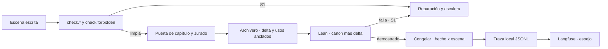

# SRS · Backend de Story-Maker · versión 4

> Especificación de requisitos de la cuarta versión de `backend/`: verificación formal de la cronología, guardarraíl bloqueante de palabras prohibidas, observabilidad con Langfuse como espejo, memoria de uso de hechos, hooks de Claude Code, endurecimiento de verificadores y del brief, Jurado con las dimensiones del encargo y evaluación del sistema. Refina la arquitectura hasta el punto en que se puede escribir código; no la sustituye. Vocabulario: [`definitions.md`](../docs/definitions.md). Métodos: [`verification.md`](../docs/verification.md). Reglas del repositorio: [`AGENTS.md`](../AGENTS.md) §3.3. Las versiones anteriores: [`srs-backend-v1.md`](srs-backend-v1.md), [`srs-backend-v2.md`](srs-backend-v2.md) y [`srs-backend-v3.md`](srs-backend-v3.md).

---

## 1. Introducción

### 1.1 Propósito

Las versiones 1 a 3 escriben, verifican, versionan y enmiendan una novela sin intervención. Esta versión no añade un paso al orden de construcción de `architecture.md` §14: endurece los que ya existen donde hoy dejan pasar algo o no dejan rastro.

| Hueco de hoy | Qué lo cierra |
|---|---|
| Una palabra prohibida del brief es S2 y se congela | `check.forbidden`, S1 en cada intento y otra vez antes de congelar |
| La cronología se comprueba solo por fechas citadas | Lean 4 demuestra sus invariantes antes de cada congelación |
| Qué capítulos usan un hecho se calcula al vuelo | Registro hecho × escena escrito al congelar, y vista de cronología |
| La traza es un fichero que solo se lee a mano | Langfuse como espejo: sesión por novela, spans, scores, coste y prompts versionados |
| El Jurado no puntúa continuidad, tono, arco ni personalización | Rúbricas versión 2, con el destinatario delante como dato |
| Nada comprueba que los recuerdos del destinatario salgan | Elementos obligatorios como setups con uso anclado |
| El trabajo de desarrollo no tiene hooks | Hooks de Claude Code que llaman a los validadores reales |
| No hay conjunto de evaluación del sistema | Cinco briefs, tabla por brief generada, lectura humana comparada con el Jurado y una iteración de tuning |

Cada requisito lleva su fuente y el método `VER-NN` que lo comprueba.

### 1.2 Alcance

| Entra en la versión 4 | Sale |
|---|---|
| Espejo de la traza en Langfuse, con aislamiento de los `claude -p` del motor | Leer prompts o configuración de Langfuse durante una tirada (D-86) |
| Generador de Lean desde el SQLite, cuatro invariantes, `lake build` en la puerta y antes de congelar | Demostrar que la prosa narra lo exportado: lo cubren VER-05 y CAL-03 |
| Guardarraíl de prohibidas bloqueante, con tres niveles y registro de cada coincidencia | Detectar temas prohibidos en la prosa: riesgo aceptado (§7.4) |
| Hecho × escena y vista de cronología | Una cronología con verdad propia: es proyección (D-89) |
| Hooks de Claude Code y audit log verificable | Hooks dentro del ciclo de generación: no los hay (D-92) |
| Tono adulto en las contradicciones, `extra='forbid'` en los esquemas del brief, fecha de nacimiento | Reglas de contradicción que exijan leer la premisa |
| Rúbricas versión 2 y elementos obligatorios del destinatario | Sustituir al Continuista: la continuidad factual sigue siendo suya |
| Modelo TLA+ del flujo completo | Verificar el orquestador contra el modelo: VER-05 |
| Validación visual con un MCP de navegador | Cambiar pantallas o contratos del frontend: no se toca ninguno (D-96) |
| Conjunto de cinco briefs, tabla por brief, lectura humana y tuning | Que la lectura humana entre en una tirada: es un eval fuera del ciclo (`verification.md` §5.5) |

### 1.3 Definiciones

Todo el vocabulario es el de `definitions.md`. Tres expresiones de este documento no son términos nuevos sino nombres de datos:

| Expresión | Qué es | ID al que remite |
|---|---|---|
| **Palabra prohibida** | Término de la lista de proscripción que viene del encargo y no de la estética | POE-12 con procedencia `brief` (MET-09) |
| **Elemento obligatorio** | Rasgo o recuerdo del destinatario que el brief exige que aparezca | Setup (CAN-06) de procedencia `brief` |
| **Fecha de nacimiento** | Atributo reservado `birth_date` de una persona | MET-02 sobre PER-01 |

### 1.4 Referencias

| Documento | Qué aporta |
|---|---|
| `docs/architecture.md` | §2.1 y §2.3 el reparto; §3.1 y §3.3 los almacenes y la congelación; §4.2, §4.8 y §4.9 presupuestos, proveedores y recetas; §9.1 a §9.3 verificadores y puertas; §10 escritura de canon; §11 observabilidad |
| `docs/verification.md` | §4.4 Lean y el modelo formal; §5.1 el espejo; §5.2 y §5.5 los evals y la lectura humana; §5.4 los guardarraíles; §5.10 TLA+ |
| `specs/srs-backend-v3.md` | El brief extendido, la entrevista y las solicitudes de cambio que esta versión endurece |

### 1.5 Convenciones

Las de `srs-backend-v1.md` §1.5. La numeración continúa la de todo `specs/`: `RF-228`, `RD-37`, `RI-60`, `RNF-53`, `D-85` y `T37` en adelante. Los números que no salen de `docs/` van marcados como propuesta con su origen.

---

## 2. Descripción general

### 2.1 Perspectiva del producto

Nada de lo nuevo decide fuera de las puertas que ya existen: el guardarraíl y Lean producen defectos S1 que entran por la escalera de `architecture.md` §7.3, y el espejo solo lee la traza.

### 2.2 Funciones del producto

| Carpeta | Qué añade |
|---|---|
| `commons/` | Exportador a Langfuse (`tracing/langfuse_export.py`); coste y latencia en el puerto; aislamiento del CLI; cadena de hashes en la traza |
| `verification/` | `checks/forbidden.py`; `formal/` con el generador de Lean y el proyecto Lake; rúbricas versión 2 del Jurado; verificadores endurecidos |
| `canon/` | Niveles de proscripción, hecho × escena, vista de cronología, atributos reservados, elementos del brief |
| `brief/` | Tono adulto, esquemas estrictos, fecha de nacimiento, traza de la entrevista |
| `planning/` | Elementos obligatorios planificados como setups |
| `orchestration/` | Puerta formal antes de congelar, parada informada del guardarraíl, prohibiciones por solicitud, publicador de prompts, modelo TLA+ del flujo completo |
| `evals/` | Cinco briefs, tabla por brief, plantilla humana, comparación con el Jurado y tuning |
| Raíz del repositorio | `.claude/settings.json` y `.claude/hooks/` para el trabajo de desarrollo; `.mcp.json` con el MCP de navegador |
| `frontend/visual/` | Recorrido visual repetible |

### 2.3 Actores

Los de `srs-backend-v1.md` §2.3. Aparece uno fuera del ciclo, **quien lee para evaluar**: una persona que puntúa una novela ya congelada con la rúbrica del Jurado (`verification.md` §5.5). No aprueba, no corrige y su resultado no entra en ninguna tirada.

### 2.4 Entorno de operación

El de `srs-backend-v1.md` §2.4, con dos herramientas más en la máquina y en CI: la cadena Lean 4 con `lake`, instalada con `elan` y fijada en `lean-toolchain`, y Java con `tla2tools.jar` en una versión fija. La red del contenedor es la de Claude y la de Langfuse (RNF-11).

### 2.5 Restricciones de diseño

1. **Lo nuevo entra por las puertas que existen.** Un fallo del guardarraíl o de Lean es un S1 con cita que vuelve al Reparador por la escalera de `architecture.md` §7.3. No hay puerta nueva con remedio propio.
2. **La observabilidad observa y no gobierna.** El espejo no para, no espera y no decide; todo lo que muestra se reconstruye desde el JSONL (D-11).
3. **Determinista antes que modelo.** Guardarraíl, generador de Lean, hooks, registro de usos y tablas de evaluación son código. El modelo solo cita dónde aparece un elemento, y la cita se ancla (VER-19).
4. **Fallo cerrado.** Si `lake` no está, la tirada no arranca; si un hook no puede importar el backend, bloquea.
5. **Los hooks son del desarrollo, no de la novela.** Actúan sobre lo que hace Claude Code en este repositorio y nunca dentro de una tirada, así que no introducen revisión del texto (`AGENTS.md` §5.3).

### 2.6 Supuestos y dependencias

| Supuesto | Consecuencia si falla |
|---|---|
| La máquina de la defensa tiene `elan`, `lake`, Java y `tla2tools.jar` | La tirada no arranca (RF-255) y la puerta falla: fallo cerrado |
| El JSON del CLI trae un campo de coste por llamada | El coste va nulo, nunca inventado (RF-235) |
| La tirada T16 cierra y deja `golden/v1-seed/` | Las tiradas de evaluación de T52 esperan; el código de T38 a T51 se construye con dobles |
| El MCP de navegador conecta | T49 lo sustituye por el guion de Playwright, que es el mismo recorrido sin agente |

---

## 3. Requisitos de interfaces externas

### 3.1 Langfuse

- **RI-60** El exportador lee `LANGFUSE_PUBLIC_KEY`, `LANGFUSE_SECRET_KEY` y `LANGFUSE_BASE_URL` del entorno. Si falta alguna, el conductor en vivo no envía nada, deja un registro `export.disabled` en la traza una sola vez por fichero y proceso, y la tirada sigue; un envío que falla deja `export.failed` con el motivo, sin claves. Ningún valor de clave aparece en el repositorio ni en la traza (`architecture.md` §11). `LANGFUSE_TRACING_ENVIRONMENT` es opcional y no es una clave: da el entorno de todo lo enviado si cumple la regla de nombres de Langfuse, y si no se omite (D-106). Método: VER-05.
- **RI-61** Reexportación por lote: `python -m commons.tracing.langfuse_export --novel <id> [--runs-dir <dir>] [--interview <iid>]` recorre la traza de una novela, y la de las entrevistas de las que salió —la que se le da o la de `origin_interview` del brief—, y la envía con la misma correspondencia que el conductor en vivo. Reexportar actualiza y no duplica (RF-234). El lote es de solo lectura: nunca escribe en el JSONL, porque reexportar una tirada terminada o en marcha no debe añadirle líneas. Sin claves escribe `export.disabled: faltan <nombres>` en la salida de error y sale con 2; si el envío falla, `export.failed: <motivo>` y sale con 1 (D-100). Método: VER-05.
- **RI-62** El puerto lanza cada `claude -p` del motor sin cargar la configuración de usuario ni la del proyecto —ni plugins, ni hooks, ni `CLAUDE.md`, ni skills, ni servidores MCP— y con un entorno del que se quitan las variables que empiezan por `LANGFUSE_` u `OTEL_`, sin distinguir mayúsculas. Los argumentos son `--setting-sources ""`, que no carga los ajustes de usuario, proyecto ni local; `--safe-mode`, que desactiva `CLAUDE.md`, skills, plugins, hooks y servidores MCP y conserva la autenticación por suscripción; y los recortes `--strict-mcp-config`, `--mcp-config {"mcpServers":{}}` y `--disable-slash-commands`. `--bare` no se usa porque exige `ANTHROPIC_API_KEY`. Una prueba fija la lista de argumentos y el entorno. El suelo de andamiaje de `architecture.md` §4.8 se vuelve a medir con esta forma, y mientras no se mida se conserva, porque sobreestimar es el lado seguro. Método: VER-11.

### 3.2 Lean

- **RI-63** `python -m verification.formal.generate <novela.sqlite> -o <fichero.lean>` escribe el fichero de la cronología. El proyecto Lake vive en `backend/verification/formal/lean/` con `lakefile.toml`, `lean-toolchain` fijado a una versión estable concreta, `StoryMaker/Types.lean`, `StoryMaker/Invariants.lean`, `lake-manifest.json`, que genera Lake, y el fichero generado; sin Mathlib. Los constructores de la fixture limpia y de la sembrada viven en `backend/verification/formal/fixtures/` y construyen cada novela con la API del canon, `create_novel` y `commit_chapter` con su delta; lo que generan vive en `lean/`: `StoryMaker/Fixture.lean`, en el objetivo por defecto, y `Seeded.lean`, en su propia `lean_lib` fuera de él, así que `lake build` a secas tiene que pasar y `lake build Seeded` tiene que fallar. `python -m verification.formal.fixtures [--write] [--record]` las regenera y compila, y es el comando de la puerta. `run_lean` escribe y compila en la `lean_lib Generated` (`Generated.+`), que no se versiona. Método: VER-05.

### 3.3 Rutas

- **RI-64** RI-01 y el brief que devuelven RI-39 y RI-40 rechazan cualquier campo que el esquema no declare, con 422 y la ruta del campo. `backend/openapi.json` y el cliente del frontend se regeneran en el mismo cambio (D-93). Método: VER-08.
- **RI-65** RI-27 devuelve además `chain_broken_at`: el número de línea, desde 1, del primer registro cuya cadena no verifica, o nulo (RF-253). No es `seq`, porque dos instancias de la traza sobre la misma novela reinician `seq`. Se comprueba la cadena del fichero entero, no solo la página ni el filtro `kind`. Es un campo añadido; ningún consumidor existente cambia (D-109). Método: VER-08.
- **RI-67** La interpretación de RI-49 lleva además `kind`, `fact` o `forbid`, y `term`, nulo salvo en `forbid` (RF-256). Es un campo añadido con valor por defecto `fact`. Un `forbid` lleva `entity_id`, `attribute`, `previous_value` y `new_value` vacíos y el término en `term`, y en la tabla de solicitudes `entity_id` es nulo. El código lo valida con `brief/interpret.py:validate`, que exige un término con alguna palabra y que no esté ya en ningún nivel, comparando con `canon.normalize.key` (RF-237). Método: VER-05.

### 3.4 Claude Code y navegador

- **RI-66** `.claude/settings.json` declara dos hooks, cada uno con el comando `python "$CLAUDE_PROJECT_DIR/.claude/hooks/<guion>.py"`: la ruta es absoluta porque el hook corre en el directorio de trabajo de Claude, que cambia cuando el agente hace `cd`, y la variable la exporta Claude Code, que en Windows lanza el comando con Git Bash. `PostToolUse` con `Write|Edit|MultiEdit` ejecuta `chapter_gate.py`, que lee el JSON del hook por la entrada estándar, actúa solo sobre `*.chapter.md` y `*.chapter.txt`, sale con 0 si pasa y con 2 y los defectos con su cita en la salida de error si no; y admite un modo manual `--novel <fichero.sqlite> --chapter N`. `PreToolUse` con `Write|Edit|MultiEdit|Read|Bash` ejecuta `policy.py`, que lee el JSON del hook por la entrada estándar. En un `deny` devuelve el JSON de decisión de Claude Code, con `permissionDecision` y su motivo. En un `allow` no devuelve ninguna decisión y sigue el flujo normal de permisos, porque un `allow` de Claude Code saltaría también las reglas `deny` del usuario; la decisión consta igual en el audit log. Si no puede evaluar, sale con 2 (D-109). Método: VER-05.
- **RI-68** `python -m orchestration.prompts_sync` publica en Langfuse el texto de los prompts de cada agente (RF-266). Método: VER-05.
- **RI-69** `.mcp.json` declara el MCP de navegador de Playwright para la validación visual, y `frontend/visual/tour.mjs` es el mismo recorrido como guion repetible (RF-267). Al lado viven `verdict.ts`, el veredicto puro —qué pasa, qué falla y a qué mitad vuelve—, sus pruebas en `verdict.test.ts`, que corren en `node gate.mjs`, y `seed.py`, que siembra la novela de prueba con la API del canon y sin modelo. `npm run visual` hace `vite build` y levanta un solo `uvicorn` que sirve `dist/` bajo `/app/` (D-67) sobre una copia temporal, sin variables `LANGFUSE_*` ni `OTEL_*` (RNF-53). El recorrido con navegador no está en `node gate.mjs`: necesita Python, `uvicorn` y el navegador instalado, que se instala una vez por máquina con `npx playwright install chromium-headless-shell`; ni la puerta ni el guion lo descargan. `playwright` va en versión exacta, 1.63.0, como el resto de dependencias del frontend. `.mcp.json` fija `@playwright/mcp@0.0.82` con `--headless --isolated --browser msedge`, lanzado con `cmd /c npx`, que es como Claude Code arranca `npx` en Windows: el Playwright del MCP no es el del guion, y Edge ya está en Windows 11 sin descargar nada; en Linux o macOS se quita `cmd /c` y el navegador es `chromium`. Un servidor MCP de proyecto lo aprueba la persona en una sesión interactiva, así que mientras no se aprueba el recorrido se demuestra con el guion. Método: VER-05.

---

## 4. Requisitos funcionales

### 4.1 `orchestration/model/` · TLA+ del flujo completo (T38)

| RF | Requisito | Fuente | Verificación |
|---|---|---|---|
| RF-228 | Un modelo `run.tla` compone la tirada entera y usa el de capítulo como subacción: configuración, planificación con el reintento de `outline.check`, capítulos con la guarda de RF-107, caída y reanudación desde la última escena cerrada descartando lo posterior (PRO-I2), aborto por delta vacío, cierre que publica la versión 1 y enmiendas entre congelaciones que publican la N+1 o se rechazan sin cambiar la versión | `verification.md` §5.10; `architecture.md` §7 | VER-18 |
| RF-229 | El modelo declara al menos tres invariantes de seguridad no vacuos —cada uno roto por una mutación versionada en `model/mutations/`— y la propiedad de terminación «toda generación acaba publicada o abortada», con equidad débil sobre las acciones de progreso y nunca sobre la caída. La salida de TLC del modelo limpio y de cada mutación se guarda en `model/tlc/` con commit, fecha y versión de TLC; `model/README.md` relaciona cada acción con su `fichero:función` y su prueba VER-05, y declara las divergencias y los contraejemplos (D-98) | `verification.md` §5.10 | VER-18, VER-15 |

### 4.2 `verification/` y `orchestration/` · verificadores endurecidos (T39, y la llamada de RF-232 en la puerta en T41)

| RF | Requisito | Fuente | Verificación |
|---|---|---|---|
| RF-230 | Las herramientas validan sus argumentos con un esquema estricto y cerrado —`canon.lookup` y `context.budget`— que rechaza tipos cambiados, claves de más, un `kind` fuera de su lista y JSON malformado, en vez de coercionarlos. El rechazo vuelve al modelo con los tres primeros errores y su ruta, como negativa del bucle de herramientas, y no consume un intento de escena. El protocolo que ve el modelo es el esquema JSON de ese mismo modelo, exportado por el servidor (D-97) | `architecture.md` §5.3; `srs-backend-v1.md` RF-91 | VER-05, VER-12 |
| RF-231 | Un nombre vale solo escrito exactamente como en el canon, tildes incluidas y sin contar la mayúscula. Una palabra con mayúscula a una operación de edición —inserción, borrado, sustitución o transposición— de un nombre o alias del canon que empieza por mayúscula, o igual a él salvo tildes, es S1 de `check.lexicon`, «variante mal escrita», aunque aparezca una sola vez y en cualquier posición. Al principio de frase no cuenta si es una palabra común o si sale también en minúscula en el texto (D-97) | `architecture.md` §9.1 | VER-05, VER-06 |
| RF-232 | Las palabras escritas de un capítulo se miden contra el rango de EST-07 en la puerta de capítulo, sobre las escenas unidas: fuera de él es un defecto `check.format` S2, con la cifra y el rango, que cuenta en el máximo de 2 S2 de esa puerta sin umbral propio (D-97) | EST-07; `architecture.md` §9.1, §9.3 | VER-05 |

### 4.3 `commons/` · Langfuse base (T40)

| RF | Requisito | Fuente | Verificación |
|---|---|---|---|
| RF-233 | Una función pura convierte registros de la traza en objetos de Langfuse, y la usan dos conductores: uno en vivo, observador de la traza con cola acotada y un hilo propio, y otro por lote (RI-61). Las dos tiradas de una misma traza dan los mismos objetos (D-85) | `architecture.md` §11; `verification.md` §5.1 | VER-05 |
| RF-234 | Hay una traza de Langfuse por generación —cada invocación de la tirada hasta su cierre o aborto, cada aplicación de enmiendas fuera de tirada (`amend_novel`, de tipo `amend`, abierta por su `calibration` y cerrada por su `work.cost`), cada solicitud de cambio hasta aplicarse o rechazarse, con todo registro que nombre su número, cada entrevista—, con identificador determinista derivado de su fichero, su tipo y su primer registro, `seq` e instante, porque `seq` vuelve a 0 en cada instancia de la traza y dos invocaciones reanudadas empezarían igual; en una solicitud de cambio, de su fichero y su número de solicitud, que es lo único que ven a la vez la traza de la ruta y la de la tirada que la aplica; en una entrevista, solo de su fichero, porque cada ruta de la entrevista abre su propia instancia de la traza y cada turno empezaría en `seq` 0. A la traza de una solicitud va todo registro con `request` entero —el `call` de `amend.interpret` y las llamadas y herramientas de `amend._apply`—, y solo `amend.request`, `amend.applied` y `amend.rejected` la abren o la cierran. `session_id` es el identificador de la novela (D-86, D-100) | `architecture.md` §11 | VER-06, VER-05 |
| RF-235 | Cada registro `call` lleva `cost_usd`, el coste que el JSON del CLI da por llamada como equivalente de API, nulo si no viene y nunca calculado con una tabla propia; y `duration_ms`, medido con reloj monótono en `dispatch` alrededor de la llamada, bucle de herramientas incluido. En Langfuse cada `call` es una generation con modelo, los cuatro campos de uso, coste y hora de inicio y fin. Al cerrar la tirada, un registro `work.cost` lleva tokens y coste totales de la novela (D-86) | `architecture.md` §4.8, §11 | VER-09, VER-05 |

### 4.4 `verification/` y `orchestration/` · guardarraíl de prohibidas (T41)

| RF | Requisito | Fuente | Verificación |
|---|---|---|---|
| RF-236 | `check.forbidden` devuelve un S1 por coincidencia, con término, nivel, cita y desplazamiento. Es independiente de `check.repetition`, que se queda con lo estético. Corre en `verify_scene` en cada intento —y por eso también tras reparar, pulir o reescribir por retcon o enmienda— y otra vez sobre el capítulo entero justo antes de congelar, en `_approve_chapter` tras el pase de estilo y la validación del delta, sin que el texto cambie entre esa llamada y `_freeze`; una coincidencia ahí es un S1 que vuelve a reparación, nunca una congelación. La segunda red caza lo que `verify_scene` no ve: un borrador reanudado que se reutiliza sin reverificar y un término de varias palabras partido entre dos escenas (D-90) | CAL-06; PRO-10; `architecture.md` §9.1, §9.3 | VER-12, VER-05 |
| RF-237 | Se compara sobre texto normalizado —descomposición NFKD, `casefold` y sin marcas combinantes— y por palabra completa, nunca por subcadena. Del término se generan sus variantes simples: `+s`, `+es`, `z` final a `ces` y `o` final a `a` y al revés. Un término de varias palabras se busca como secuencia de palabras, con las variantes en cada palabra: «silencio sepulcral» casa en «silencios sepulcrales». Una sola función de normalización, en `canon/normalize.py`, sirve al guardarraíl y a las reglas del brief; `verification/checks/forbidden.py` la reexporta, porque `canon/` no puede importar de `verification/` (`architecture.md` §2.3). Sin marcas, la «ñ» se pliega a «n» igual en el término que en el texto: es el precio de que «cabrón» y «cabron» sean la misma palabra (§7.4) (D-90, D-101) | `architecture.md` §9.1 | VER-06, VER-05 |
| RF-238 | Una coincidencia entra en la escalera que ya existe: el reintento de escena lleva el defecto y su cita, y después vienen la reespecificación, la cuarentena y la replanificación. Agotada, la tirada escribe un `work.close` con `closed: false`, `aborted: true`, `reason` igual al motivo y `words`, y termina con `RunAbortedError`. El motivo pone primero los defectos `check.forbidden`, sin repetidos, así que nombra el verificador, el nivel y el término aunque haya más defectos, y RI-03 lo muestra en `reason`, que lee del último `work.close` (D-90) | `architecture.md` §7.3 | VER-05, VER-18 |
| RF-239 | La proscripción tiene tres niveles de guardarraíl y uno de estilo: `global`, cargado al crear la novela desde un fichero versionado; `cliente`, las palabras prohibidas que la persona da en la entrevista; `novela`, las que añade después una solicitud de cambio (RF-256); y `estilo`, los n-gramas de POE-12, que no son guardarraíl. Un término presente en dos niveles se guarda en el más fuerte —global, cliente, novela— y el colapso consta en la traza: la novela se crea antes que su traza, así que al arrancar cada tirada un registro `guardrail.levels` lleva `levels`, cuántas prohibidas hay por nivel, y `collapsed`, las del brief que quedaron en otro nivel como `término: cliente -> global`. Guardar un término devuelve el nivel en que queda, para que una solicitud de cambio trace su propio colapso (D-91) | POE-12; `architecture.md` §3.1 | VER-05, VER-06 |
| RF-240 | Cada coincidencia deja un registro `guardrail.match` con capítulo, escena, intento, término —en el campo `term`—, nivel, cita, desplazamiento, decisión y `stage`, el punto que la cazó: `escena`, cada intento de escena que no pasa, con `reintentar`; `reparacion`, una reparación que deja la prohibida, con `reparar`; `estilo`, un pase de estilo que la mete y se revierte entero, con `reparar`; `congelacion`, la comprobación antes de `_freeze`, con `reparar`; y `capitulo`, agotada la escalera, con `abortar`. En `estilo` y `capitulo` la escena es nula, porque el defecto puede venir del capítulo unido (D-101) | `architecture.md` §11 | VER-09, VER-05 |

### 4.5 `canon/` · memoria de uso y cronología (T42)

| RF | Requisito | Fuente | Verificación |
|---|---|---|---|
| RF-241 | Al congelar, dentro de la transacción, se registra hecho × escena: una escena congelada usa el hecho `entidad.atributo` si la entidad es POV, lugar o elenco de la escena y el valor vigente aparece en su texto como palabra completa sin distinguir mayúsculas, la misma regla que `affected_scenes` (D-89). Solo se registran valores vigentes. Recongelar reescribe las filas de las escenas recongeladas, y una enmienda sin escenas que reescribir también refresca el registro, porque cambia el valor vigente. El nombre de la entidad no se registra: no es una fila de `attribute`, y sus escenas son las que la nombran, con formas que dependen del nombre nuevo (D-83), así que se buscan al aplicar. `affected_scenes` lee el registro y conserva la búsqueda en el texto como comprobación: si discrepan, devuelve la búsqueda en el texto y deja un registro `amend.usage_mismatch` con `fact`, `registry` y `text` (D-102) | CAN-02; `architecture.md` §3.3 | VER-06, VER-05 |
| RF-242 | La vista `chronology` da una fila por escena congelada con escena, capítulo, número de escena, instante y su desempate, lugar, POV, personajes presentes —con el POV incluido, sin repetidos y ordenados por identificador, porque el elenco de la escena no siempre lo trae— y resumen, ordenada por instante de mundo y, a igualdad, por capítulo y número de escena. Es proyección del índice de prosa: no guarda verdad propia (D-89) | MUN-05; `architecture.md` §3.1 | VER-05 |

### 4.6 `verification/formal/` · Lean (T43)

| RF | Requisito | Fuente | Verificación |
|---|---|---|---|
| RF-243 | El generador es una función pura de una conexión de lectura del canon y de un añadido opcional con lo que está por congelar —escenas del capítulo con instante, lugar y presentes, y eventos del delta—. Lee la cronología (RF-242), los atributos y los eventos, y emite una entrada por fila con su origen —tabla e identificador— en el nombre o en un comentario; lo pendiente lleva el prefijo `pending.`. Mismo canon, mismo fichero byte a byte. El instante es un natural: minutos desde el 1 de enero del año 1, con el desempate `seq` de D-07 al lado (D-87, D-103) | MUN-05; `verification.md` §4.4 | VER-06, VER-05 |
| RF-244 | `Invariants.lean` define cuatro invariantes como funciones booleanas decidibles con su especificación proposicional y el lema que las relaciona, y el fichero generado emite un teorema por invariante demostrado `by decide +kernel`, que comprueba la decisión en el núcleo sin evaluarla antes en el elaborador: **I1**, nadie está presente en una escena anterior a la primera fecha de nacimiento posible, y la edad declarada es compatible con el nacimiento porque sus intervalos se solapan; **I2**, nadie está en dos lugares en el mismo instante de mundo, es decir, con los mismos minutos y el mismo desempate (MUN-05); **I3**, ninguna vigencia de `attribute`, `entity_alias`, `competence` o `relation`, esta con sus dos entidades, termina antes de empezar ni empieza antes de que exista su entidad; `knowledge` no entra, porque no tiene fin de vigencia; **I4**, nadie está presente en una escena posterior al instante desde el que está excluido. El POV cuenta como presente, como en `chronology` (D-87, D-103) | `verification.md` §4.4; MUN-05, MET-07 | VER-04 |
| RF-245 | `run_lean` genera el fichero, ejecuta `lake build` con lista de argumentos y tope de tiempo (RNF-55) y devuelve si pasó, qué teorema falló y las filas de origen implicadas. No estar `lake`, no compilar o agotar el tope cuenta como fallo, y también un hecho que no se puede exportar —una `birth_date` que no es ISO 8601, una `age` que no es entera o un pendiente que choca de instante—: `passed` falso con el motivo y sin teorema | `AGENTS.md` §5.3 | VER-05 |
| RF-246 | `gate.py` y CI compilan las dos fixtures de RI-63: la limpia tiene que pasar y la sembrada tiene que fallar en el teorema de su invariante y no en otro sitio. La salida de una ejecución real se guarda con commit y fecha (D-88) | `verification.md` §5.7 | VER-15 |

### 4.7 `brief/` y `canon/` · el brief (T44)

| RF | Requisito | Fuente | Verificación |
|---|---|---|---|
| RF-247 | La regla de edad de RF-201 usa para el tono la misma lista adulta que para el género, más `violento`, `violenta`, `macabro` y `macabra` (D-75, D-99), y compara por palabra normalizada con sus variantes (RF-237): un destinatario de 6 años con tono «thriller erótico», «historias violentas» o género «eróticas» es contradicción. Las otras dos reglas de RF-201 comparan con la misma normalización: la prohibida presente, con sus variantes; el tema que es el género o el tono, por palabra normalizada | `srs-backend-v3.md` RF-201; CAN-05 | VER-05, VER-06 |
| RF-248 | Los esquemas del brief, de sus partes y de la salida de `brief.extract` rechazan campos de más. Entre las partes está `WorldTime`, que es de `commons/types/` y usan también los eventos y las escenas, así que la restricción es global. En la extracción, un hecho con un campo de más cuenta como inválido y consta, como un tipo inventado (RF-217), y una raíz con un campo de más rechaza la extracción entera, como un modelo que falla: el turno sigue con cero propuestas; en RI-01, el brief se rechaza (RI-64) (D-93) | `verification.md` §4.8 | VER-08, VER-05 |
| RF-249 | El destinatario admite `birth_date` opcional en ISO 8601, que la entrevista pregunta tras la edad y da por contestada con «ninguno»; el brief admite `origin_interview`, que la entrevista rellena con su identificador. Al crear la novela, la edad y la fecha de nacimiento del destinatario entran como los atributos reservados `age` y `birth_date` de su entidad, con procedencia `brief`. La entidad del destinatario no declara esos dos atributos, porque serían dos valores del mismo hecho con la misma vigencia: un brief que los declara se rechaza (RD-41, D-93) | RF-212; MET-02, MET-09 | VER-05 |
| RF-250 | Cinco briefs versionados en `backend/evals/briefs/` validan contra el esquema del brief y cumplen cada uno su propiedad de diseño, que una prueba afirma (tabla de abajo, D-95) | `verification.md` §5.2 | VER-10, VER-05 |

| Brief | Qué cubre | Qué tiene que saltar |
|---|---|---|
| `01-semilla.json` | El brief de `golden/v1-seed/` con perfil `prueba`: el caso base deportivo. Ya no es copia byte a byte, porque la semilla sigue en `novela` | Nada: la tirada cierra |
| `02-adversarial.json` | Texto libre de la entrevista y un nombre de personaje con instrucciones incrustadas | Ninguna instrucción llega al borrador ni a un paquete como instrucción (RNF-49) |
| `03-temporal.json` | Una trampa temporal: un personaje con fecha de nacimiento posterior a un recuerdo que se le atribuye y una fecha que no está en el calendario | Lean I1 y `check.timeline` |
| `04-menor.json` | Destinatario menor de 12 años con palabras y temas prohibidos y dedicatoria | `check.forbidden` en cada nivel, y la regla de edad si el tono se desliza |
| `05-no-deportivo.json` | Dominio sin reglamento ni encuentros | `verify_match` no corre; el resto de verificadores sí |

Dos límites de lo que caza cada verificador en `03-temporal`: Lean I1 solo salta si la escaleta pone una escena en la fecha del recuerdo con la destinataria presente, porque un recuerdo narrado dentro de una escena del presente no es una escena y solo lo caza `check.timeline`; y `check.timeline` marca toda fecha escrita «D de mes», esté o no en el calendario, porque las permitidas llegan en ISO 8601, así que un acierto suyo en la tabla de RF-269 puede venir de esa regla y no de la trampa (§7.4).

Todos con personas y lugares inventados, perfil de extensión `prueba` (PRO-15) y `target_words` de 1.500: de 1.200 a 1.800 palabras en 3 capítulos de 1 escena de unas 500, para que una tirada tarde minutos y no horas y el Jurado tenga texto donde anclar sus citas (RF-274, D-105, D-113). La semilla de T16 sigue en `novela`.

### 4.8 Raíz del repositorio y `commons/tracing/` · hooks y audit log (T45)

| RF | Requisito | Fuente | Verificación |
|---|---|---|---|
| RF-251 | El hook de capítulo llama a los validadores reales de `backend/` —`verification.checks`, `check.forbidden` y `verification.gates`— sin reimplementar ninguno, con el canon de la novela cuando se le da y con listas vacías si no. Sin novela, `check.timeline` recibe un calendario vacío, así que una fecha explícita en el fichero es un S1: no se puede contrastar, y cuenta como fallo (`AGENTS.md` §5.3). La puerta es la de escena, cero S1; los S2 se informan y no bloquean. `check.lexicon` y `check.knowledge` no corren en el hook, porque sus candidatos los extrae el motor a partir de la escena (D-92) | `architecture.md` §9.1 | VER-05 |
| RF-252 | El hook de política aplica sus reglas en orden y gana la primera que casa: deniega escribir un `*.sqlite` bajo `backend/runs-*/` o `backend/golden/`, porque el canon solo lo escribe la congelación; deniega leer `.env*` o ficheros de claves; deniega escribir un fichero de capítulo que contiene un término de nivel `global`; y permite todo lo demás. Cada decisión, también las que permiten, se registra en el audit log de desarrollo (D-92) | `AGENTS.md` §5.3 | VER-12, VER-05 |
| RF-253 | Cada registro de la traza lleva `prev_hash`, el sha256 del JSON canónico del registro anterior, vacío en el primero, y `verify_chain` devuelve el primer registro cuya cadena no verifica o nulo. El eslabón se calcula contra la última línea del fichero, no contra la instancia que escribe, así que una tirada reanudada, una ruta y el hook continúan la misma cadena; borrar las últimas líneas no se detecta, porque ningún registro apunta a ellas (§7.4). Las decisiones del motor de políticas —`arbitration`, `retcon.proposal`, `guardrail.match`, `formal.lean`— llevan decisión, regla e instante. Lo que declara el emisor gana; si no declara `decision` o `rule`, la traza los deduce de los campos del registro: en `arbitration`, `rechaza-el-delta` si hay valor rechazado; en `retcon.proposal`, `aplica-retcon` o `gana-el-congelado`, con `reason` como regla; en `guardrail.match`, la regla es `check.forbidden nivel <nivel>`; en `formal.lean`, la decisión sale de `passed` y la regla de `theorem`; lo que no se puede deducir queda como `no-declarada`. Las del hook van a `.claude/audit/policy.jsonl` con la misma cadena (D-92, D-109) | RI-16; PRO-10 | VER-06, VER-05 |

### 4.9 `orchestration/` · puerta formal y prohibiciones por solicitud (T46)

| RF | Requisito | Fuente | Verificación |
|---|---|---|---|
| RF-254 | Toda operación que congela o recongela —capítulo, retcon y enmienda— pasa antes `run_lean` sobre el canon más lo que va a entrar. Un fallo en una congelación es un S1 `check.formal` cuya regla nombra el teorema y las filas de origen y cuya cita es la primera frase de la escena implicada que nombra a la entidad, o la primera de la escena si no la nombra; vuelve al Reparador por la escalera. Un fallo sin filas de origen —un hecho que no se exporta, `lake` que no corre, una cronología que no compila— es S1 `check.formal` con regla `check.formal: <motivo>` y el motivo mismo como evidencia, que nombra la fila, en la primera escena del capítulo: el Reparador no puede arreglarlo, la escalera se agota y la tirada se para con `check.formal` en el motivo (D-107). En la congelación de capítulo corre en `_approve_chapter`, tras la segunda red de `check.forbidden` y con el delta ya validado, que es el último punto antes de `_freeze`. En un retcon el fallo lo tumba como RF-153: gana el congelado y vuelve el S1 del rechazo, no uno nuevo. En una enmienda, la rechaza con el motivo y no crea la versión N+1. En retcon y enmienda, Lean va antes de reescribir: la reescritura cambia prosa, no instantes ni presentes, así que el resultado es el mismo y un invariante roto no gasta llamadas de modelo. Cada resultado deja un registro `formal.lean` (D-88) | `verification.md` §4.4; `architecture.md` §10 | VER-05 |
| RF-255 | Al arrancar una tirada o la aplicación de enmiendas se comprueba `lake` y se compilan `Types` e `Invariants`. Si falla, la tirada no empieza y RI-03 da el motivo, igual que un modelo de embeddings que no carga; en la aplicación de enmiendas, lo pendiente se rechaza con ese motivo (RF-226). Es lo primero que hace la composición del motor, antes de los embeddings y de la calibración, y no deja registro en la traza, así que el primer registro de una invocación sigue siendo `calibration` (RF-234). Arrancar la aplicación no lo comprueba: dejaría sin lectura a quien no tiene Lean (D-88) | `architecture.md` §4.8 | VER-05 |
| RF-256 | Una solicitud de cambio puede pedir una prohibición: `amend.interpret` la devuelve como `forbid` con su término, que el código valida —no vacío, no prohibido ya—. Al aplicarse, el término entra con nivel `novela` y cada escena congelada que lo contiene se reescribe, se reverifica con `check.forbidden` incluido y se recongela como en RF-224, produciendo la versión siguiente (D-91). La validación compara con `canon.normalize` (RF-237), y las escenas que la contienen se buscan con la coincidencia del guardarraíl: «nube» toca «nubes». Una prohibición que no está en ninguna escena publica igualmente la versión siguiente, sin capítulos cambiados, como un hecho que no se nombra. Los motivos de rechazo de un `forbid` no repiten el término, porque `reason` viaja al espejo sin hash; el término va en `term`, que el exportador pasa a hash (RNF-54) | `srs-backend-v3.md` RF-221, RF-224 | VER-05 |

### 4.10 `verification/jury/`, `planning/` y `canon/` · Jurado, elementos obligatorios y escaleta (T47)

| RF | Requisito | Fuente | Verificación |
|---|---|---|---|
| RF-257 | La versión 2 del conjunto de rúbricas puntúa nueve dimensiones, cada una con cinco niveles y un ejemplo por nivel: `voice`, ampliada a coherencia de la caracterización —voz y decisiones—; `style_guide`; `pacing`; `subtext`; `theme`; y cuatro nuevas, `continuity` —si el capítulo se lee como continuación de lo anterior, no si los hechos cuadran—, `tone`, `arc` y `personalization` —si el destinatario, sus rasgos y sus recuerdos aparecen integrados y no pegados—, con las skills `*.audit` de `architecture.md` §5.2. Su severidad sigue CAL-06 (D-94) | CAL-01, CAL-02, CAL-06 | VER-05 |
| RF-258 | Cada instancia del Jurado recibe un bloque delimitado con el encargo —nombre, rasgos y recuerdos obligatorios del destinatario, y el tono pedido— como dato y nunca como instrucción, dentro de su presupuesto (RNF-57) | `architecture.md` §4.9; `verification.md` §5.9 | VER-17, VER-05 |
| RF-259 | Toda puntuación lleva una justificación no vacía, y el registro `jury` de la traza lleva por dimensión e instancia el nivel, la escena, la cita y la justificación: `scores` es una lista de objetos `{instance, dimension, level, scene, quote, justification}`, y `justifications` da por dimensión las de cada instancia, precedidas de `juez-N:` y separadas por una barra vertical, que el espejo pone como comentario de `jury.<dimensión>`. Las dimensiones que se juzgan son las del conjunto de rúbricas del fichero: una novela de la versión 1 sigue con cinco | CAL-04 | VER-05 |
| RF-260 | Todo rasgo y recuerdo del destinatario es obligatorio salvo los que la entrevista marca como opcionales. Cada elemento entra en el canon como evento `element.declared` de procedencia `brief`, y el Arquitecto lo planifica como setup (CAN-06) `element.<id>` con su escena de cobro: `outline.check` falla con `elemento-sin-cobro [<id>]` si un elemento obligatorio no tiene cobro planificado. Como al elemento lo planta el encargo, su setup puede sembrarse y cobrarse en la misma escena; un setup de la trama en la misma escena sigue siendo `setup-invertido`. El bucle pasa los elementos obligatorios del brief a `outline.check` en la escaleta y en toda replanificación (D-95, D-111) | CAN-06, CAN-08; PRO-01 | VER-05 |
| RF-261 | El delta del Archivero lleva los elementos que aparecen en el capítulo con su cita literal, en `elements: [{element_id, scene, quote}]`, y el código la ancla con la regla de `check.evidence` en la escena que nombra o, si no la nombra, en la única del capítulo que contiene la cita; `canon/` no importa de `verification/`, así que ancla el Orquestador. Anclada, entra en hecho × escena como `element.<id>`, con el evento `element.declared` como origen, y en `element_use` con su cita, que sirve para volver a anclar el uso cuando la escena se recongela; sin anclar, o de un elemento no declarado, se descarta como `process.defect` con `agent`, `element` y `reason`. `element.declared` no puede venir en el delta: solo lo produce el brief. El registro de setups da por cobrado un elemento si y solo si tiene un uso anclado, en cualquier escena, también antes de la de cobro; sin uso y con la escena de cobro congelada, se sigue debiendo. Sin usos, que es el fallo cerrado, no hay cobro. Así la puerta de acto y la de cierre de obra lo exigen por la deuda narrativa, y el cierre nombra cada elemento que falta con su tipo, su identificador y los primeros 80 caracteres de su texto (D-95, D-111) | `verification.md` §5.11; `architecture.md` §9.3 | VER-19, VER-05 |
| RF-273 | `outline.check` falla, con la escena que lo trae, si una escena de la escaleta lleva `is_match` y el brief no tiene reglamento (DEP-02): sin él, `verify_match` no tiene contra qué comprobar, y es lo que `05-no-deportivo` espera (D-104) | DEP-02; `architecture.md` §9.1 | VER-05 |

### 4.11 `commons/tracing/`, `brief/` y `orchestration/` · Langfuse completo (T48)

| RF | Requisito | Fuente | Verificación |
|---|---|---|---|
| RF-262 | La entrevista tiene traza propia en `_interviews/<iid>.trace.jsonl`, y `brief.extract` y `amend.interpret` dejan un registro `call` con agente, tokens, `prompt_version`, coste y duración. Mientras dura, la entrevista va al espejo con su identificador como sesión, porque todavía no hay novela. Al crear una novela con `origin_interview`, la traza de su entrevista se reenvía con el `session_id` de la novela: tras un `POST /novels` que devuelve 201, la aplicación lee `origin_interview` del brief guardado y reenvía sus objetos, con los mismos identificadores, así que actualiza y no duplica. El lote hace lo mismo leyendo `origin_interview`. Así la sesión junta entrevista, tirada y solicitudes (D-86) | `architecture.md` §11 | VER-09, VER-05 |
| RF-263 | Cada `call` es un span con nombre `<rol>.<agente>` según la tabla de roles de `architecture.md` §11, con capítulo, escena, intento y `prompt_version`, colgado del span de su capítulo o escena. Los spans se llaman `chapter` y `scene`, con el número en los metadatos (D-106); la escena cuelga de su capítulo. Se abren con el primer registro que lleva `chapter`, y `scene` entero para la escena: una escena dada como texto no abre span. `chapter.frozen` cierra el capítulo y sus escenas, y `work.cost` o una `calibration` nueva cierran lo que quede; un registro posterior del mismo capítulo cuelga del span ya cerrado y no lo reabre. Una `tool` no abre span. Un agente sin rol en la tabla hace fallar la exportación en la prueba, no inventa un nombre (D-86) | `architecture.md` §11 | VER-05 |
| RF-264 | El servidor de herramientas deja un registro `tool` por llamada servida o rechazada, con nombre, resumen de argumentos, tokens del resultado, procedencia, si se rechazó, error, duración y el agente, capítulo y escena de la llamada que la hizo. En Langfuse es una observación `retriever` o `tool`, hermana de su generation bajo el mismo span y enlazada a ella por `metadata.call` (D-106) | `architecture.md` §5.3, §11 | VER-09, VER-05 |
| RF-265 | El resultado de cada verificador llega como score a la traza o al span que evaluó, con los nombres y tipos de la tabla de scores de `architecture.md` §11, Lean y guardarraíl incluidos. El término de una coincidencia del guardarraíl viaja como sha256 recortado a 12 caracteres, con su nivel. Cada tipo de registro que el código emite está en `SCORERS`, con su score, o en `UNSCORED`: una prueba recorre los `emit` de `backend/` y falla con un tipo sin clasificar, y otra exige una muestra con sus scores por cada entrada de `SCORERS` (D-86) | `architecture.md` §11 | VER-05 |
| RF-266 | Los prompts de cada agente se publican en Langfuse desde los ficheros del repositorio (RI-68), con nombre igual al agente y etiqueta igual a su `prompt_version`: publicar dos veces sin cambios no crea versión y cambiar un byte sí. La versión de `brief.extract` y `amend.interpret`, que no llevan ancla, es el sha256 de su módulo. La tirada nunca lee un prompt de Langfuse. Cada generation enlaza su prompt: Langfuse lo enlaza por número de versión, así que el espejo resuelve etiqueta a número una vez por par, en su propio hilo, sin leer el texto; si no puede, la generation sale sin enlace y con nombre y etiqueta en sus metadatos (D-108). `evals/compare.py` dice qué versión usó cada tirada y cuáles cambiaron, con llamadas, fallos, tokens de salida, duración y coste por versión; la promoción la siguen decidiendo las medidas (D-86) | `srs-backend-v2.md` RI-34; `verification.md` §5.8 | VER-16, VER-05 |

### 4.12 `frontend/visual/` · validación visual (T49)

| RF | Requisito | Fuente | Verificación |
|---|---|---|---|
| RF-267 | Un recorrido abre, sobre una copia de una novela congelada con brief de prueba, la portada —título, dedicatoria y destinatario—, el índice —un enlace por capítulo congelado— y la ficha de un personaje con sus capítulos, y guarda capturas y un registro fechado en `frontend/visual/results/`. Un defecto de datos —el manifiesto sin dedicatoria— queda en el registro como fallo del backend; uno de presentación es una prueba en rojo del frontend. La regla es una para todas las comprobaciones: se contrasta lo que sirve la API (RI-03, RI-43 a RI-46) con lo que pinta la página, y el dato de la API gana: si falta, el fallo es del backend aunque la página tampoco lo muestre; si llega bien y la página no lo muestra, es del frontend. Nunca reabre un capítulo (D-96) | `architecture.md` §2.1, §2.2 | VER-05 |

### 4.13 `backend/coherence.py` · tabla de validadores (T50)

| RF | Requisito | Fuente | Verificación |
|---|---|---|---|
| RF-268 | La puerta contrasta la tabla de validadores de `architecture.md` §9.1 con el código: todo `kind` `check.*` que el código de `backend/` asigna —`kind="check.x"` en una llamada o `KIND = "check.x"` como constante, fuera de pruebas— tiene fila, y todo `check.*` que nombra una fila existe en el código como `kind` o como módulo validador; toda fila dice dónde corre. Un módulo validador es un `verification/checks/<x>.py` cuyo docstring abre con `` `check.<x>` ``: así existe un verificador que no marca defectos con `kind` propio, como `check.evidence`, que descarta citas; un módulo que agrupa varios, como `deterministic.py`, no se declara, porque los suyos salen por su `kind`. Y la tabla por brief de RF-269 tiene una columna fija, en `SCENE_CHECKS` o `MATCH_CHECKS` de `evals/brief_table.py`, por cada verificador que la tabla de §9.1 pone en la puerta de escena o en la escena de encuentro, ni una más ni una menos: sin ella, un verificador nuevo solo sale cuando marca | `AGENTS.md` §6.7 | VER-15 |

### 4.14 `evals/` · herramientas de evaluación (T51)

| RF | Requisito | Fuente | Verificación |
|---|---|---|---|
| RF-269 | `evals/brief_table.py` genera desde las trazas, o desde sus extractos versionados, la tabla brief × verificador —pasó, falló con recuento, o no aplica— con commit y `prompt_version` de cada tirada, en `evals/results/briefs.md`. La misma entrada da el mismo fichero. «Falló (n)» cuenta cada defecto de ese verificador en todos los intentos, sea cual sea su severidad: una trampa que se caza en el primer intento y se repara sigue cazada. «No aplica» sale de la traza: los verificadores de escena, si no hubo ningún `scene.attempt`; `check.ledger` y `check.availability`, si ningún intento fue de encuentro; `check.formal`, si no hay `formal.lean` ni defecto suyo; el examen, si ninguno tuvo preguntas; y una dimensión del Jurado, si ningún `jury` la trae. Sin `work.close`, el cierre es «falló (1)» (`AGENTS.md` §5.3). Una dimensión sin nivel cuenta como fallo (RF-130). Las coincidencias de `check.forbidden` de la segunda red suman en su columna sin contar dos veces las de escena. El Continuista sale en una sola columna, `continuity`, porque sus `kind` los pone el modelo, y un `kind` que no está en el catálogo gana columna propia al final (D-110) | `verification.md` §5.2 | VER-10 |
| RF-270 | La plantilla de lectura humana se genera desde el conjunto de rúbricas vigente, con sus mismas dimensiones y niveles, y el fichero de puntuaciones se valida contra su esquema (RD-48) | `verification.md` §5.5 | VER-10 |
| RF-271 | `evals/human_vs_jury.py` cruza la lectura humana con el último veredicto aprobado del Jurado de cada capítulo y genera, por dimensión, la media humana, la del Jurado, la diferencia media absoluta y los capítulos con diferencia de 2 niveles o más —el rango que ya invalida un veredicto (D-39)—, sin umbral de acuerdo. Un capítulo sin veredicto aprobado, o una dimensión que su veredicto no trae, queda fuera de la comparación y consta en su sección «Fuera de la comparación». La lectura a mano va debajo de la marca `<!-- lectura a mano: debajo de esta linea no se regenera -->`, y regenerar la conserva (D-110) | `verification.md` §5.5 | VER-10 |

### 4.15 Tiradas de evaluación (T52)

| RF | Requisito | Fuente | Verificación |
|---|---|---|---|
| RF-272 | Una tirada por cada brief de RF-250, las cinco en paralelo y sobre un commit etiquetado; la tabla de RF-269 generada desde ellas; en la del brief temporal, qué verificador cazó la trampa; un caso que Lean detecta y los demás no —real, o por mutación declarada como tal— en `evals/formal/CASOS.md` con su prueba reproducible; y una iteración de tuning con versión de prompt nueva, uno o dos briefs repetidos y la comparación antes y después en `evals/results/tuning-01.md` (D-95) | `verification.md` §5.2, §5.8 | VER-10, VER-16 |

### 4.16 `canon/`, `planning/`, `generation/`, `verification/` y `orchestration/` · perfil de extensión (T53)

| RF | Requisito | Fuente | Verificación |
|---|---|---|---|
| RF-274 | El brief lleva `length_profile`, `novela` o `prueba` (PRO-15), y `novela` si no lo trae, así que un brief de hoy se comporta igual. La extensión del brief tiene que caer en el rango de obra de su perfil, o RI-01 lo rechaza con el campo y la regla. Todo consumidor de un rango lee el del perfil de la novela y no una constante: el número de capítulos en `compose`, la escaleta y `outline.check`, los prompts del Arquitecto, el rango de escena del Escritor y de `check.format`, y la longitud de capítulo de `check_chapter_length` en la puerta de capítulo (RF-232). Con `prueba`, la escaleta tiene exactamente 3 capítulos de 1 escena y 3 actos de 1 capítulo, y el rango de capítulo es el de su única escena. `outline.check` lo exige con `escena-fuera-de-rango`, `capitulos-descuadrados`, `escenas-descuadradas` y `actos-descuadrados`, con su cita: el esquema de la escaleta admite los límites de todos los perfiles juntos, hoy de 400 a 1.500 porque la escena de `prueba`, de 400 a 600, cae dentro de EST-08, y el del perfil de la obra lo comprueba `outline.check`, así que con `prueba` una escena de 601 a 1.500 palabras no falla al parsear sino que vuelve al Arquitecto como defecto. `word_range()` del brief se recorta al rango de obra del perfil, para que «como máximo 1.800» se cumpla. Los perfiles viven en `commons/types/length.py`, porque los usan `canon/` y `planning/`, con `chapter_words`, `scene_words`, `work_words`, `chapters`, `scenes_per_chapter`, `acts`, `chapters_per_act`, `summary_ratio`, `periodic_at_close`, `jury_threshold`, `quote_min_words` y `golden_cases`; `novela` solo fija los dos rangos de EST-07 y EST-08, con el umbral del Jurado en 3, su cita en 8 palabras y 5 casos del conjunto dorado, y la regla de cada 5 capítulos sigue en `canon/summaries/levels.py`. El Jurado lee del perfil su umbral y el mínimo de su cita, y el prompt del juez y el del Especialista, su regla de cita y su resultado obligatorio: con `prueba`, mediana 2, citas de 5 a 25 palabras de una sola frase y el marcador del encuentro dicho como lo comprueba `check.ledger` ; con `prueba`, el conjunto dorado del cierre juzga 1 caso (D-105, D-112, D-128, D-131) | PRO-15; EST-07, EST-08; `architecture.md` §9.1 | VER-05 |

---

## 5. Requisitos de datos

Cuatro tramos suben el esquema —T41, T42, T46 y T47—, más el arreglo de la reanudación, que añade la 6 a `wm_run_state` (`srs-backend-v1.md` RD-07); una migración cada uno y solo añadiendo, como `srs-backend-v3.md` RD-35. El número de versión lo da el orden en que se integran, no este documento, porque dos migraciones con el mismo número romperían la reanudación; integrados, quedaron la 4 para T41, la 5 para T42, la 6 para la reanudación, la 7 para T46 y la 8 para T47.

| RD | Requisito | Fuente | Verificación |
|---|---|---|---|
| RD-37 | `proscribed` gana la columna `level` —`global`, `cliente`, `novela` o `estilo`— y `kind` queda para `ngram`, `image` o `term`. El esquema sube una versión solo añadiendo, y un fichero anterior migra `kind='brief'` a nivel `cliente` y `kind='term'`, y los n-gramas a `estilo`. Tres disparadores guardan la tabla: un término no baja de nivel, y `kind` solo es `ngram`, `image` o `term`, con `term` si y solo si el nivel no es `estilo`. Un paso de migración puede ser una función además de una sentencia, para que añadir la columna mire antes `PRAGMA table_info` y una migración reintentada a medias sea segura, porque `ADD COLUMN` no tiene `IF NOT EXISTS` | `srs-backend-v3.md` RD-35 | VER-05 |
| RD-38 | La lista global vive en `backend/canon/db/forbidden_global.txt`, un término por línea, versionada; se copia a cada novela al crearla para que el fichero siga siendo el estado completo. Nace vacía: no se inventa una lista (propuesta) | `AGENTS.md` §3.2 | VER-05 |
| RD-39 | `fact_usage` —clave del hecho, evento de origen, escena y capítulo— vive en el índice de prosa, no en el canon estructurado, porque es un índice y no verdad. El esquema sube una versión solo añadiendo, y lo ya congelado se registra al migrar: la versión lleva un relleno en código que corre tras sus sentencias y dentro de la misma transacción, y que también solo añade | `architecture.md` §3.1 | VER-05 |
| RD-40 | La vista `chronology` entra en la misma versión del esquema que `fact_usage`, sobre `prose_scene` y `prose_scene_character` | MUN-05 | VER-05 |
| RD-41 | Tres atributos reservados de persona: `birth_date`, fecha ISO 8601; `age`, años cumplidos en el arranque del brief; y `excluded`, que desde su vigencia impide estar presente —muerte o marcha definitiva—. Si falta la fecha y hay edad, la fecha se deriva como el intervalo de un año compatible con ella y consta como derivada (MET-09); si faltan las dos, el nacimiento se declara ausente y I1 no lo usa. Nunca se inventa una fecha. La `birth_date` vigente es la de vigencia abierta o, si todas están cerradas, la última que empezó, porque un retcon que corrige la fecha cierra la anterior; sin `birth_date`, el nacimiento se deriva de la primera fila `age` por `valid_from`, la del arranque del brief, y todas las filas `age` se comprueban contra él. `excluded` vale con cualquier valor, que es el motivo, y excluye desde después de su instante —estar en la escena de la muerte vale— hasta el cierre de su vigencia si lo tiene. Una novela creada antes de T44 guarda la edad del destinatario como `edad`, no se migra, y para I1 no tiene edad (D-87, D-103) | MET-02, MET-07, MET-09 | VER-05, VER-04 |
| RD-42 | El destinatario gana `birth_date` y `optional` —el subconjunto de sus rasgos y recuerdos que no son obligatorios—, y el brief gana `origin_interview`, con el patrón `^[a-f0-9]{12}$` del identificador de entrevista de RI-38. `optional` es un subconjunto de `traits` y `memories`. Todos opcionales, para que los briefs anteriores sigan valiendo, y con los esquemas estrictos de RF-248 | `srs-backend-v3.md` RF-200 | VER-08, VER-05 |
| RD-43 | Cada brief del conjunto de evaluación es un JSON que el esquema del brief acepta tal cual, con nombre `NN-<caso>.json` y `length_profile` igual a `prueba` (RF-274); cuando el caso necesita un texto libre de entrevista, que el esquema del brief no tiene, va al lado en `NN-<caso>.texto-libre.txt`; su tabla de cobertura es la de §4.7 | `verification.md` §5.2 | VER-05 |
| RD-44 | El registro `call` gana `cost_usd`, `duration_ms`, `model`, `input_tokens`, `cache_creation_tokens` y `cache_read_tokens`, porque el conductor por lote solo tiene el JSONL y sin ellos no daría el modelo ni el desglose del caché; `real_input` sigue siendo la suma de los tres de entrada, así que sus consumidores no cambian. `calibration` gana `invocation`, `run` o `amend`. Entran los registros `work.cost` —`invocation`, `calls`, `input_tokens`, `output_tokens`, `cache_creation_tokens`, `cache_read_tokens`, `cost_usd`, `calls_without_cost` y `duration_ms`—, `export.failed` y `export.disabled` | RI-16 | VER-09 |
| RD-45 | Todo registro de la traza gana `prev_hash`. Los campos existentes no cambian: los leen `evals/`, las rutas de traza y el Supervisor | RI-16 | VER-06 |
| RD-46 | Entran el registro `tool`, los registros y campos de la tabla de abajo y la traza de la entrevista en `_interviews/<iid>.trace.jsonl`; el guion bajo no es un identificador de novela válido, así que nunca choca con una (`srs-backend-v3.md` RD-32). El identificador de entrevista solo se convierte en ruta si casa con `^[a-f0-9]{12}$`, y cualquier otro valor lanza `InvalidNovelIdError`, porque `origin_interview` llega del cliente en el brief | RI-16 | VER-09 |
| RD-47 | `element.declared` —identificador, tipo `trait` o `memory`, texto y si es obligatorio— entra en el conjunto cerrado de tipos de evento, proyectado a la tabla `brief_element`, y solo con procedencia `brief`. El identificador es el tipo y la posición, `trait-N` y `memory-N` en el orden de `Recipient.traits` y `Recipient.memories` desde 1, porque el Arquitecto y el Archivero lo leen en llamadas distintas; es obligatorio todo elemento que no está en `Recipient.optional` (RD-42). Los usos anclados van a `element_use` —elemento, escena, capítulo, cita y desplazamiento—, que es índice y no verdad, como `fact_usage`. El esquema sube una versión solo añadiendo, la 8. Un fichero anterior migra con las dos tablas vacías y su brief no exige ningún elemento: no se añaden eventos de brief a un registro que ya existe, porque fecharlos hoy rompería el orden del `seq` (D-111) | MET-05 | VER-01, VER-05 |
| RD-49 | `change_request` gana `kind`, `fact` o `forbid`, y `term`; una solicitud anterior migra como `fact`, con `term` nulo. El esquema sube una versión solo añadiendo, la 7 | `srs-backend-v3.md` RD-33 | VER-05 |
| RD-48 | El fichero de lectura humana, `evals/human/<novela>.json`, lleva por capítulo y dimensión el nivel, la escena, la cita y la justificación, con el mismo esquema que el veredicto del Jurado, y al revisor solo por su papel. Sus campos son `novel`, `reviewer` —el papel, con el patrón `^[a-z][a-z0-9 _-]*$`, así que un nombre con mayúscula no pasa—, `manuscript_version`, `instructions`, `rubrics`, copia del conjunto vigente con su versión, y `chapters[]` con `chapter`, `scenes` y `scores[]`; cada puntuación es la del Jurado, con justificación obligatoria y sin campos de más. Valida si hay una puntuación por capítulo y dimensión, en una escena del capítulo, con las rúbricas vigentes, todos los capítulos congelados leídos y la cita anclada literal y única (RF-129). El extracto versionado de una tirada que usa RF-269 es `evals/results/traces/<brief>.json`: `brief`, `commit` en hexadecimal de 7 a 40, `source`, el nombre del fichero de traza sin ruta, y `records`, los registros que la tabla y la comparación leen —`outline.check` sin la escaleta, `scene.attempt`, `chapter.gate`, `quiz`, `jury`, `guardrail.match`, `formal.lean`, `chapter.frozen`, `work.close` y `call` reducido a agente, `prompt_version`, modelo y resultado— (D-110) | `verification.md` §5.5 | VER-05 |
| RD-50 | El brief gana `length_profile`, `novela` o `prueba`, opcional y `novela` por defecto, con el esquema estricto de RF-248; se guarda con el brief en la novela, así que una tirada reanudada lee el mismo perfil. `backend/openapi.json` y el cliente del frontend se regeneran en el mismo cambio. La entrevista no lo pregunta, así que su brief lleva `novela` | PRO-15; `srs-backend-v3.md` RF-200 | VER-08 |

**Registros y campos de la traza que añaden T46 a T48 (RD-46).** Ninguno de T46 ni de T47 es un tipo nuevo: `formal.lean` ya tiene score y los demás no lo llevan (RF-265).

| Registro | Dónde se escribe | Campos |
|---|---|---|
| `tool` | `orchestration/tools/server.py` | `call`, el `call_id` de su llamada; `name`; `args`, un resumen —claves, número de identificadores y `kind`, nunca los identificadores—; `tokens`, `provenance`, `refused`, `error`, `duration_ms`, y el contexto de la llamada: agente, capítulo, escena, `prompt_version` y, en una enmienda, `request` |
| `call` | `orchestration/dispatch.py` | Gana `call_id`, 16 hexadecimales. Une la herramienta con su generation, porque el `call` se escribe después de las herramientas |
| `call` de `brief.extract` y `amend.interpret` | `brief/extract.py`, `brief/interpret.py` y, tras `amend.request`, `orchestration/amend.py` | Los nombres de `dispatch`: `agent`, `prompt_version`, `real_input`, los tres de entrada, `output_tokens`, `harness_tokens`, `model`, `cost_usd`, `duration_ms`, `ok` y `error`. El de `amend.interpret` lleva además `request`, porque el intérprete corre antes de que exista el número y se escribe después |
| `scene.checks` | `orchestration/engine.py`, `verify_scene` y `verify_match` | `chapter`, `scene`, `ran`, los `kind` que corrieron, y `failed`. Sin él, un verificador que pasa no se distingue de uno que no se llamó |
| `interview.created`, `interview.turn` | `brief/routes.py` | Solo recuentos: `answered`, `free_text`, `edits`, `accepted`, `discarded`, `proposed`, `missing`, `contradictions` y `complete`. Nada de lo que escribió la persona |
| `formal.lean` | `orchestration/loop.py` y `orchestration/amend.py` | `stage`, `congelacion`, `retcon` o `enmienda`; `passed`; `theorem`, el primero que falla o vacío; `theorems`; `rule`; `decision`, `congelar` o `reparar`, `aplicar-retcon` o `gana-el-congelado`, `aplicar` o `rechazar`; `reason`; `sources`, hasta 20 orígenes; `elapsed_s`; y `chapter`, `scene` o `request` según el camino |
| `amend.request` | `orchestration/amend.py` | Gana `request_kind`, `fact` o `forbid`, y `term`. Se llama `request_kind` porque `kind` es el nombre del registro |
| `amend.applied` de un `forbid` | `orchestration/amend.py` | `request_kind`, `term`, `level`, el nivel en que quedó, `collapsed` (D-91) y `refrozen` |
| `retcon.aborted` por Lean | `orchestration/loop.py` | `formal: true`, `fact` y `reason` |

---

## 6. Requisitos no funcionales

| RNF | Requisito | Fuente | Verificación |
|---|---|---|---|
| RNF-53 | Un fallo o una ausencia de Langfuse nunca para, espera ni ralentiza una tirada: se cuenta en los fallos de la traza, deja `export.failed` y el ciclo sigue. Cerrar la tirada no espera a la red; lo que no se envió sigue en el JSONL y se reexporta por lote (RI-61). La cola del conductor en vivo guarda hasta `QUEUE_MAX = 10.000` lotes de objetos, que aguantan varios capítulos sin red, y lo que no cabe se descarta del envío y cuenta como `export.failed` con motivo «cola llena»; cada envío lleva hasta `BATCH_BYTES = 3.000.000` bytes, bajo el tope de 3,5 MB por lote que documenta la API de ingestión, con margen para el sobre de cada evento (propuesta, D-100) | D-11; `srs-backend-v1.md` RNF-13 | VER-05 |
| RNF-54 | Nada de la novela sale de la máquina hacia Langfuse salvo por el exportador. El término de una coincidencia del guardarraíl viaja como hash, porque puede ser el nombre de una persona real que el cliente prohibió; el literal queda solo en la traza local. Antes de salir, el exportador limpia tres cosas en cualquier registro: la clave `term` pasa a `sha256:` más los 12 primeros caracteres de su hash (`HASH_CHARS`, el mismo recorte que `prompt_version` y RF-265); cualquier texto de un registro `guardrail.*` viaja como hash salvo `level` y `kind`; y cualquier texto que contenga `check.forbidden` viaja como hash | `verification.md` §5.3 | VER-11, VER-05 |
| RNF-55 | `lake build` tiene un tope de 600 segundos, el mismo que una llamada al proveedor (`timeout_s` del CLI); agotarlo es fallo (propuesta) | `architecture.md` §4.8 | VER-12, VER-05 |
| RNF-56 | Los hooks fallan cerrados: si no pueden importar el backend o ejecutar un validador, el de capítulo sale con 2 y el de política deniega. Nunca corren dentro de una tirada, y los `claude -p` del motor no los cargan (RI-62) | `AGENTS.md` §5.3 | VER-05 |
| RNF-57 | El Jurado pasa de 11.500 a 13.200 tokens de entrada por instancia: las cuatro dimensiones nuevas a 300 cada una, que es el coste por dimensión del bloque de rúbrica de hoy (1.500 entre 5), y 500 del bloque del encargo, el mismo del borrador de `brief.extract` (D-80), que ya contiene al destinatario entero. Tres instancias suman 39.600 y caben en el techo concurrente (D-94) | `architecture.md` §4.2, §4.9; CTX-20 | VER-12, VER-06 |
| RNF-58 | Las tiradas de evaluación no corren en `gate.py` ni en CI: van en paralelo entre sí —cada una con su SQLite, su traza y su `novel-id`, sin estado compartido—, sobre un commit etiquetado y nunca junto a otra tirada real. Ningún brief del conjunto lleva datos de personas reales | `verification.md` §5.2 | VER-15 |

---

## 7. Verificación

### 7.1 Matriz requisito × método

| Método | Requisitos que cubre como método principal |
|---|---|
| VER-01 Type checking | RD-47 |
| VER-04 Formal verification | RF-244 |
| VER-05 Unit e integration | RF-230, RF-231, RF-232, RF-233, RF-238, RF-239, RF-242, RF-245, RF-247, RF-249, RF-251, RF-254 a RF-257, RF-259, RF-260, RF-263, RF-273, RF-274, RF-265, RF-267, RI-60, RI-61, RI-63, RI-66 a RI-69, RD-37 a RD-41, RD-43, RD-48, RD-49, RNF-53, RNF-56 |
| VER-06 Property-based | RF-234, RF-237, RF-241, RF-243, RF-253, RD-45 |
| VER-08 Contract | RF-248, RI-64, RI-65, RD-42, RD-50 |
| VER-09 Tracing | RF-235, RF-240, RF-262, RF-264, RD-44, RD-46 |
| VER-10 Evals | RF-250, RF-269 a RF-272 |
| VER-11 Sandbox | RI-62, RNF-54 |
| VER-12 Guardrails | RF-236, RF-252, RNF-55, RNF-57 |
| VER-15 CI/CD | RF-246, RF-268, RNF-58 |
| VER-16 Progressive rollout | RF-266 |
| VER-17 Red-teaming | RF-258 |
| VER-18 Model checking | RF-228, RF-229 |
| VER-19 Anclaje | RF-261 |

### 7.2 Puerta de CI

La de `srs-backend-v1.md` §7.2 más tres pasos: la compilación de las dos fixtures de Lean (RF-246), TLC sobre `chapter.cfg` y `run.cfg` con `tla2tools.jar` en versión fija cuando cambie `backend/orchestration/model/`, y el contraste de la tabla de validadores (RF-268). Los dos primeros fallan cerrados si falta la herramienta.

### 7.3 Propiedades que se traducen sin trabajo

| Regla | Propiedad | Requisito |
|---|---|---|
| Normalización | Para cualquier término y cualquier mezcla de mayúsculas y tildes, el término entre espacios casa siempre, y el término pegado a una letra por la derecha no casa salvo que forme una variante declarada | RF-237 |
| Errata de nombre | Toda variante a una edición de un nombre del canon se marca, y un nombre bien escrito nunca | RF-231 |
| Exportación idempotente | Exportar dos veces la misma traza da los mismos identificadores y ningún objeto de más | RF-234 |
| Generador determinista | El mismo canon produce el mismo fichero Lean byte a byte, sea cual sea el orden de inserción | RF-243 |
| Cadena de la traza | Editar, borrar o reordenar cualquier registro hace que `verify_chain` señale el primero afectado | RF-253, RD-45 |
| Registro de usos | Para cualquier secuencia de congelaciones y enmiendas, las escenas que el registro da para un hecho son las que da la búsqueda en el texto | RF-241 |

### 7.4 Riesgo aceptado propio de la versión 4

| Riesgo | Por qué queda en U | Señal |
|---|---|---|
| Que un tema prohibido del brief aparezca en la prosa | Un tema no se detecta sin modelo; la palabra sí, y esa la cubre `check.forbidden` | Las dimensiones `theme` y `tone` del Jurado, y la lectura humana |
| Que el Jurado puntúe la personalización o la continuidad leída con los mismos sesgos que el Escritor | Son juicio: clase I | Dispersión del Jurado, conjunto dorado y la comparación con la lectura humana (RF-271) |
| Que Lean demuestre la cronología exportada y la prosa diga otra cosa | Lean prueba los hechos, no el texto | Continuista y `check.timeline` sobre la prosa |
| Que `decide +kernel` no escale a una novela real | El coste crece con el número de escenas y personajes, e I2 es cuadrática: 750 presencias tardan unos 27 s en la máquina de desarrollo | Tiempo de `lake build` en la traza; si pasa el tope, se usa `native_decide` y se declara aquí que se confía en el compilador |
| Que la duración de las elipsis y las estadísticas acumuladas que `architecture.md` §9.1 enumera no tengan verificador propio | Hoy solo las ve el Continuista | Defectos del Continuista de esos ámbitos en la traza |
| Que una sola persona lectora sesgue la comparación con el Jurado | Hay una lectura, no un panel | Con dos lectores, su acuerdo se mide igual que el de las instancias del Jurado |
| Que plegar la «ñ» haga casar una prohibida con otra palabra —«año» y «ano» normalizan igual— y dé un falso S1 de `check.forbidden` | Es el precio de que la tilde no cuente, y es el mismo en el término que en el texto (RF-237) | El defecto cita la palabra y la traza deja cada `guardrail.match`: un falso positivo manda a reparar prosa correcta y se ve |
| Que un recuerdo con fecha imposible se narre dentro de una escena del presente y Lean no lo vea, o que `check.timeline` acierte en `03-temporal` por marcar toda fecha «D de mes» y no por la trampa | Lean prueba escenas, no recuerdos, y la regla de `check.timeline` es anterior a T44 (§4.7) | La tabla de RF-272 dice qué verificador cazó la trampa, con la cita de su defecto |
| Que una palabra común al principio de frase, a una edición de un nombre corto del canon, dé un falso S1 —«Llena» con Elena— | Sin diccionario del español no se distingue de una errata; la lista de palabras comunes lo reduce, no lo elimina | El defecto dice «variante mal escrita de X» y cita la palabra: el Reparador lo ve y la traza lo cuenta |
| Que se borren las últimas líneas de una traza, o el fichero entero, sin que `verify_chain` lo vea | Ningún eslabón apunta a ellas; detectarlo exigiría un ancla fuera del fichero, como el número de registros en el SQLite, y RI-17 lo prohíbe (RF-253) | El fichero se copia con la tirada, y el número de capítulos congelados del SQLite no cuadraría con los `chapter.frozen` de la traza |
| Que un comando `Bash` ofuscado —con variables o `eval`— escape a las reglas 1 y 2 del hook de política | Sobre `Bash` las reglas se evalúan con expresiones regulares sobre el texto del comando; `Read` y `Write` se evalúan por ruta y no tienen este hueco | Toda decisión, también las que permiten, queda en `.claude/audit/policy.jsonl` con el comando |
| Que con el backend roto el hook de política lo deniegue todo, también `Write` | Es el fallo cerrado de RNF-56 | Se sale desactivando los hooks con `/hooks` o editando fuera de Claude Code |
| Que el audit log `.claude/audit/policy.jsonl` se borre entero con `rm` | No está entre las cuatro reglas de D-92, y el fichero es de cada máquina | La cadena de sus líneas señala cualquier borrado parcial |
| Que en el perfil `prueba` el Jurado apruebe un capítulo que en `novela` suspendería, con mediana 2 y citas de 5 palabras | Es la decisión D-128: una tirada de prueba mide el ciclo, no la calidad literaria. Con `novela` el umbral y la cita no cambian | Los niveles y `threshold` de cada registro `jury` en la traza, y la tabla por brief de RF-269, que cuenta el fallo contra el umbral registrado |
| Que en el perfil `prueba` el conjunto dorado sea menos fiable | Con 3 escenas hay pocos fragmentos que sembrar, y con un solo caso la tasa de detección es 0 o 1; corre una vez, al congelar el último capítulo (D-112, D-131) | La tasa de detección del conjunto dorado en la traza, que en `novela` se mide cada 5 capítulos |
| Que el bloque del encargo del Jurado pase de 500 tokens en ejecución | Ningún guardarraíl en ejecución lo trunca ni lo rechaza: el peor caso medido de los cinco briefs es 137, y el de la prueba en el techo da 11.488 sobre 13.200 (RNF-57) | La admisión rechaza cualquier llamada sobre 100.000, y el contador real frente al estimado queda en la traza (`architecture.md` §11) |

---

## 8. Fuera de alcance

| Qué | Motivo |
|---|---|
| Leer prompts o ajustes de Langfuse durante una tirada | Metería la red en el camino crítico (D-86) |
| Hooks que actúen dentro de una tirada | Serían revisión del texto por la puerta de atrás (`AGENTS.md` §5.3) |
| Un lematizador o un modelo en el guardarraíl | Determinista antes que modelo; las variantes simples cubren el caso (D-90) |
| Una lista global con contenido | No hay de dónde sacarla sin inventarla (RD-38) |
| Deshacer una prohibición añadida por solicitud | Se pide otra solicitud, como cualquier enmienda (`srs-backend-v3.md` §8) |

---

## 9. Decisiones tomadas en este documento

El interrogatorio de `AGENTS.md` §6.1 se hizo con la respuesta recomendada en cada pregunta, por indicación de quien encarga el trabajo. Cada fila es una de esas respuestas.

| D | Decisión | Elección | Por qué |
|---|---|---|---|
| D-85 | Cómo llega la traza a Langfuse, y por qué otra vía no | Una sola correspondencia registro → Langfuse con dos conductores: en vivo, como observador de la traza con cola acotada en un hilo propio, y por lote, reexportando el JSONL. Los `claude -p` del motor se lanzan sin configuración de usuario ni de proyecto y sin variables `LANGFUSE_*` ni `OTEL_*` | El vivo da latencias reales y trazas mientras corre la tirada; el lote exporta tiradas ya hechas, como T16, y recupera lo que el vivo no pudo enviar. Con una sola correspondencia, los dos no pueden divergir. Sin aislar el CLI, un plugin de usuario podría mandar el texto del brief a Langfuse como sesiones sueltas, por una vía que nadie decidió |
| D-86 | Qué ve Langfuse | Una traza por generación con identificador determinista y `session_id` igual a la novela; la entrevista, con traza propia enlazada por `origin_interview`; un span `<rol>.<agente>` por llamada según la tabla de `architecture.md` §11; una observación por herramienta; tokens, coste del CLI o nulo y latencia medida en `dispatch`; scores con la tabla de §11; prompts publicados desde el repositorio con su `prompt_version` como etiqueta y nunca leídos en la tirada | Los roles de la rúbrica —entrevistador, planner, writer, editor— no son los nombres de los agentes, así que la tabla los relaciona sin renombrar nada. El coste con la suscripción no se factura: el equivalente del CLI es un dato, una tabla de precios propia sería un número inventado. Pedir el prompt a Langfuse en cada llamada metería la red en el ciclo; publicarlo desde el repositorio da el versionado sin esa dependencia |
| D-87 | De dónde sale Lean y qué demuestra | Generador en `backend/verification/formal/`, función pura de la lectura del canon más lo pendiente; instante como natural en minutos desde el año 1; cuatro invariantes, I1 a I4; fecha de nacimiento del atributo `birth_date` del brief o de un delta, derivada de `age` con precisión de un año si falta, y ausente si no hay ninguna de las dos | En `verification/` porque es un verificador, el cuarto tipo de la tabla de §9.1. Un natural hace decidibles las comparaciones con `decide`. Los minutos cubren un instante con hora sin perder los días. Derivar sin marcarlo sería inventar; marcarlo como derivado (MET-09) deja que I1 use la cota segura |
| D-88 | Dónde corre Lean y qué pasa si falla | Antes de cada congelación, retcon y enmienda, sobre el canon más lo que va a entrar; un fallo es S1 `check.formal` que vuelve al Reparador, o rechaza la enmienda. `lake` se comprueba al arrancar, y sin él la tirada no empieza. `gate.py` y CI compilan una fixture limpia y otra sembrada | «El canon congelado gana» (`architecture.md` §10): un Lean al final encontraría la violación en capítulos que nadie puede reabrir. Antes de congelar, el fallo tiene a quién volver. Comprobarlo al arrancar es el mismo trato que el modelo de embeddings: un fallo determinista no se reintenta |
| D-89 | Hecho × capítulo y cronología | `fact_usage` en el índice de prosa, escrito en la transacción de congelación con la misma regla que `affected_scenes`; `chronology` como vista SQL, una fila por escena congelada | Con la misma regla, el registro y el cálculo al vuelo no pueden discrepar sin que salte. En el índice y no en el canon estructurado, porque el canon es proyección pura del registro de eventos. Una vista no puede desincronizarse de lo que proyecta |
| D-90 | El guardarraíl de prohibidas | `check.forbidden` propio, S1, en cada intento de escena y sobre el capítulo entero antes de congelar; normalización NFKD con `casefold` y sin marcas, por palabra completa, con variantes `+s`, `+es`, `z`→`ces` y `o`↔`a`; la escalera de siempre y, agotada, `RunAbortedError` con el motivo | Una prohibida del encargo contradice lo que se pidió, y el brief gana sobre el canon derivado (PRO-10): es invariante duro, no estética, y por eso S1. Con S2 una tirada medida congeló ocho fragmentos con la palabra dentro. La subcadena hacía saltar «mar» en «Marcos»; la palabra completa con variantes lo evita sin modelo. La comprobación antes de congelar es la segunda red tras reparaciones y pase de estilo |
| D-91 | Los tres niveles | `global`, desde un fichero versionado copiado al crear la novela; `cliente`, las prohibidas de la entrevista; `novela`, las que añade una solicitud de cambio; y `estilo`, aparte, para los n-gramas. Un término repetido se queda en el nivel más fuerte | La lista global en un fichero copiado mantiene «un fichero por novela es el estado completo». La solicitud de cambio ya es el único encargo posterior a la creación, así que el tercer nivel no necesita una entrada nueva. Separar `level` de `kind` deja de mezclar el origen con el tipo estético |
| D-92 | Audit log y hooks | Cadena de hashes en la traza, con `verify_chain`; las decisiones del motor de políticas llevan decisión, regla e instante. Hooks de Claude Code: `PostToolUse` sobre ficheros de capítulo que llama a los validadores reales y bloquea con código 2, y `PreToolUse` con cuatro reglas en orden donde gana la primera; su audit log, en `.claude/audit/policy.jsonl` con la misma cadena | La cadena respeta RI-16 y RI-17 sin duplicar la traza en tablas: se puede borrar una línea, pero se detecta. Los hooks actúan sobre el desarrollo, no sobre la novela, así que no son revisión humana ni del sistema dentro del ciclo; llamar a los validadores reales evita una segunda copia que se desincronice |
| D-93 | Endurecer el brief | `extra='forbid'` en el brief, sus partes y la salida de la extracción; la lista adulta del tono es la del género más `violento` y `macabro`, comparada por palabra con variantes; `birth_date` opcional del destinatario, preguntada tras la edad; `origin_interview` en el brief | Un campo que el sistema no lee es un campo que la persona cree haber pedido. Un tono erótico es tan inadecuado para un niño como un género erótico. La fecha de nacimiento es la única fuente real para I1 del destinatario, y el origen es lo que une la entrevista a la sesión de la novela |
| D-94 | Dimensiones del Jurado | Rúbricas versión 2 con nueve dimensiones: las cinco de hoy, con `voice` ampliada a coherencia de la caracterización, más `continuity`, `tone`, `arc` y `personalization`. El Jurado ve el encargo del destinatario como dato delimitado. Severidades: `continuity`, `arc` y `personalization` S2; `tone` S3 | Así cada criterio de la rúbrica de la entrega tiene su dimensión sin tirar las que calibran el conjunto dorado. La continuidad del Jurado es la de lectura; la factual sigue siendo del Continuista con defectos anclados, que valen más que una nota. S2 donde CAL-06 dice arco o caracterización, S3 donde dice estilo |
| D-95 | Elementos obligatorios y evaluación | Rasgos y recuerdos del destinatario, obligatorios salvo los marcados opcionales, como setups de procedencia `brief` que el Arquitecto planifica y el Archivero cita al aparecer, con la cita anclada. Evaluación: cinco briefs versionados, tabla generada desde las trazas, lectura humana con la rúbrica del Jurado comparada por dimensión sin umbral, y una iteración de tuning. Los cinco briefs van con el perfil de extensión `prueba` (D-105) | Reutiliza la deuda narrativa: la puerta de acto replanifica lo que no se cobró y el cierre exige deuda cero, sin mecanismo nuevo. «Aparece» lo decide una cita anclada, no una búsqueda de subcadenas sobre un recuerdo que nunca se narra literal. Fijar un umbral de acuerdo con la lectura humana sería un número sin origen |
| D-96 | Validación visual | Un MCP de navegador en `.mcp.json` para la demostración y un guion de Playwright en `frontend/visual/` para la repetición; va en esta versión del backend y no en una del frontend | No cambia ninguna pantalla ni contrato: comprueba los que existen, así que no justifica una versión del frontend. El MCP de la sesión no conecta, y el guion es el mismo recorrido sin agente. La carpeta se llama `visual/` y no `e2e/` porque el reparto de `architecture.md` §2.3 nombra las carpetas solo con letras, y la puerta que lo contrasta no reconocería otra cosa |
| D-97 | Verificadores endurecidos | Las herramientas rechazan argumentos mal formados en vez de coercionarlos; un nombre vale solo escrito exactamente como en el canon, y una palabra con mayúscula a distancia de edición 1 de uno del canon, o igual salvo tildes, es S1 aunque salga una vez y en cualquier posición; un capítulo escrito fuera de EST-07 es `check.format` S2 en la puerta de capítulo, como la escena fuera de rango | Coercionar `"no"` a verdadero hace que el modelo reciba lo contrario de lo que pidió sin saberlo, y el rechazo cuesta una negativa del bucle, que ya está acotado, no un reintento. Una operación de edición es la errata tipográfica —una tecla de más, de menos, cambiada o dos trasladadas—; con dos, «Nala» y «Lana» serían el mismo nombre (propuesta). S2 no inventa número ni severidad: es la que ya lleva la escena fuera de rango, y entra en una puerta que decide con su máximo de 2; S3 no llegaría a ninguna |
| D-98 | TLA+ del flujo completo | `run.tla` que usa el capítulo como subacción; constantes del modelo pequeño Chapters = 3, Scenes = 2, Amendments = 1 y MaxCrashes = 1; equidad débil sobre `Next` sin la caída | Conserva el modelo de capítulo ya comprobado. Las constantes son del modelo, no del sistema (propuesta): bastan para recorrer cada transición y mantienen TLC en segundos. Con equidad sobre la caída, una caída infinita rompería la terminación sin ser un fallo del sistema |
| D-99 | La lista adulta en femenino | `violenta` y `macabra` entran en la lista de D-75, igual que `erótica` ya estaba | Las variantes de RF-237 no se componen: «violentas» y «macabras» exigen `o`→`a` y después `+s`, y no casaban. Añadir el femenino no cambia el guardarraíl ni sus falsos positivos; componer variantes en RF-237 los ampliaría en toda la prosa |
| D-100 | Identificadores, lote y cola del exportador | Una invocación toma el identificador de su fichero, su tipo y su primer registro, `seq` e instante; una solicitud de cambio, de su fichero y su número. `amend_novel` es una generación de tipo `amend`, y T46 pasa el número de solicitud al contexto de las llamadas de `amend._apply` para que cuelguen de la traza de su solicitud. El lote no escribe en el JSONL y se comunica por la salida de error y el código de salida. La cola en vivo guarda `QUEUE_MAX = 10.000` lotes y cada envío lleva hasta `BATCH_BYTES = 3.000.000` bytes (propuesta) | `seq` vuelve a 0 en cada instancia de la traza, así que dos invocaciones reanudadas compartirían identificador; el número de solicitud es lo único que ven a la vez la traza de la ruta y la de la tirada que la aplica. Reexportar una tirada, también una en marcha como T16, no puede cambiarla. 10.000 lotes aguantan varios capítulos sin red, y lo que se pierde sigue en el JSONL; 3.000.000 deja margen bajo el tope de 3,5 MB de la API de ingestión para el sobre de cada evento |
| D-101 | Lo que el guardarraíl dejó fijado al construirse | La normalización vive en `canon/normalize.py`; un término de varias palabras casa con las variantes de cada palabra; la «ñ» se pliega y es riesgo aceptado; `guardrail.match` lleva `stage`; el colapso de niveles consta en `guardrail.levels` al arrancar; un aborto escribe `work.close` con `closed: false` | `canon/` no puede importar de `verification/`, y las reglas del brief están en `canon/`: era la única lectura coherente con RF-237. Con variantes solo en la última palabra, el plural de una expresión no se detectaría nunca. La novela se crea antes que su traza, así que el colapso no se puede trazar al crearla. RI-03 lee `reason` del último `work.close`, y sin ese registro el motivo del aborto solo estaba en el error |
| D-102 | El registro de usos frente a la búsqueda en el texto | Palabra completa sin distinguir mayúsculas, la regla de `affected_scenes`, sin NFKD ni variantes; si algún día cambia, `usage.value_pattern` y `amend._names` pasan a la vez a RF-237. El nombre no se registra. Si registro y búsqueda discrepan, gana la búsqueda y consta `amend.usage_mismatch`. Lo congelado antes de la migración se registra con un relleno | D-89 pide la misma regla que `affected_scenes` y no cambiar su comportamiento; la propiedad que compara registro y búsqueda detecta el día en que las dos reglas se separen. Las formas de un nombre dependen del nombre nuevo (D-83), así que el registro no puede conocerlas de antemano. Devolver la búsqueda conserva el comportamiento de hoy mientras la traza mide si el registro basta |
| D-103 | Cómo lee Lean la cronología | `decide +kernel` en vez de `decide`; el instante de I2 es minutos más desempate; una edad es compatible si su intervalo se solapa con el del nacimiento, y presente antes de nacer es antes de la cota inferior; la `birth_date` vigente es la abierta o la última que empezó; `excluded` excluye desde después de su instante; I3 cubre `attribute`, `entity_alias`, `competence` y `relation`; el POV cuenta como presente; un hecho que no se exporta es fallo cerrado | Con `decide` a secas, 150 escenas y 750 presencias agotan `maxRecDepth` en el elaborador; con `+kernel` la comprueba el núcleo, que es la parte de Lean en la que se confía, así que no se pierde garantía. Comparar solo minutos daría un falso S1 con dos escenas del mismo día sin hora en dos lugares. Exigir que un intervalo contenga al otro daría falsos S1 entre edades de instantes distintos, y la cota inferior es la cota segura de D-87. Un retcon que corrige la fecha cierra la anterior, que era falsa. Estar en la escena de la muerte vale. `knowledge` no tiene fin de vigencia |
| D-104 | Un encuentro en una novela sin reglamento | `outline.check` lo rechaza (RF-273) | Hoy nada impide que el Arquitecto marque `is_match` en una novela no deportiva, y `verify_match` correría contra un reglamento que no existe. Es una regla sobre los datos de la escaleta, sin juicio, así que va al verificador determinista que ya la revisa |
| D-105 | Novelas mínimas para probar | Perfil de extensión `prueba` (PRO-15) en el brief: obra de 1.200 a 1.800 palabras, exactamente 3 capítulos de 1 escena y escena de 400 a 600 palabras (D-113); `novela` por defecto; los cinco briefs de evaluación usan `prueba` y la semilla de T16 sigue en `novela`. Todo consumidor de un rango lo lee del perfil | Tres capítulos de una escena y no un capítulo de tres escenas, para que las pruebas cubran lo que la rúbrica evalúa entre capítulos: índice, marcas de cambio por capítulo, regeneración selectiva, reanudación y la cronología de Lean. Y una tirada de prueba pasa de horas a minutos. Leer el rango del perfil en vez de una constante es lo que evita un segundo camino de código para las pruebas: los verificadores que corren son los mismos |
| D-106 | Forma de lo que ve Langfuse | Nombres fijos: los spans son `chapter` y `scene` y la solicitud es `change_request`, con el número en los metadatos; el identificador sigue saliendo de la clave con número, así que reexportar renombra y no duplica. Cada observación con su tipo más específico: `evaluator` para el registro de un verificador de `SCORERS`, `guardrail` para `guardrail.*`, `retriever` para `canon.lookup` y `tool` para las demás herramientas. La herramienta cuelga del span de su escena o capítulo, hermana de la generation que la pidió, que queda en `metadata.call`. La traza lleva input —novela, invocación y modelo; lo pedido en una solicitud; el fichero de la entrevista—; la herramienta, sus argumentos resumidos como input y tokens, procedencia, rechazo y error como output; el verificador y el guardarraíl, su veredicto como output, limpio por RNF-54. El entorno sale de `LANGFUSE_TRACING_ENVIRONMENT` si cumple la regla de nombres de Langfuse, y si no se omite Por la API de ingestión, que solo admite GENERATION, SPAN y EVENT, los tipos específicos viajan como SPAN con el tipo en `metadata.observation_type`; el tipo nativo llega con OTLP (§10). Un evento que la ingestión rechaza lanza `IngestionRejectedError` y queda como `export.failed`: nada se pierde en silencio | Son las buenas prácticas de Langfuse (`langfuse.com/docs/observability/best-practices`): un número en el nombre crea un nombre por ejecución y deja sin filtro, panel ni evaluador a lo que lo busca por nombre; el tipo específico es lo que filtran los evaluadores y dibuja el grafo de agentes; una herramienta dentro de la generation dice que ocurrió dentro de la llamada al modelo, y aquí la sirve el Orquestador. Nada nuevo sale de la máquina: input y output son campos que ya viajaban como metadatos. La prosa y el paquete de cada llamada siguen sin salir (D-86) |
| D-107 | Qué S1 da un hecho que no se puede exportar a Lean, y lo que la puerta formal y la prohibición por solicitud dejaron fijado al construirse | Un fallo de `run_lean` sin filas de origen —hecho que no se exporta, `lake` que no corre, cronología que no compila— es S1 `check.formal` con regla `check.formal: <motivo>` y el motivo, que nombra la fila, como evidencia en la primera escena del capítulo; la escalera se agota y la tirada se para con `check.formal` en el motivo. Lean corre en `_approve_chapter` tras la segunda red de `check.forbidden`, y en retcon y enmienda antes de reescribir; en un retcon, un fallo hace ganar al congelado y vuelve el S1 del rechazo. `lake` se comprueba al componer el motor, no al arrancar la aplicación. Una prohibición que no está en ninguna escena publica la versión siguiente sin capítulos cambiados, y sus motivos de rechazo no repiten el término. El perdón de D-78 busca las formas del valor nuevo como palabra completa | Es fallo cerrado (`AGENTS.md` §5.3): una comprobación que no puede ejecutarse cuenta como fallida, y sin escena implicada la fila es lo único localizable que puede llevar la cita. Tras la segunda red, el delta ya está validado y el texto no cambia hasta `_freeze`. La reescritura cambia prosa, no instantes ni presentes, así que Lean da lo mismo antes y después y un invariante roto no gasta llamadas de modelo. Comprobar `lake` al arrancar la aplicación dejaría sin lectura a quien no tiene Lean. `reason` viaja al espejo sin hash (RNF-54). La subcadena eximía «Ruizales» por «Ruiz»; la palabra completa es la regla de D-83 |
| D-108 | Cómo enlaza una generation su prompt en Langfuse | Nunca se lee el texto de un prompt de Langfuse. El espejo, en su hilo y fuera del camino de la tirada, resuelve la etiqueta de cada par agente y versión a su número de versión una sola vez y lo recuerda; si falla o no está publicado, la generation sale sin enlace y con nombre y etiqueta en los metadatos | Langfuse enlaza la generation con el prompt por número de versión, no por etiqueta, así que sin esa lectura el enlace que pide D-86 no existiría. Leer un número en el hilo del espejo no puede cambiar nada de la tirada, y una prueba comprueba que el motor no importa `prompts_sync` ni `langfuse`. Cero lecturas, la alternativa, deja el enlace solo en metadatos |
| D-109 | Lo que los hooks y la cadena de la traza dejaron fijado al construirse | El hook de política no devuelve decisión en un `allow`; los comandos de los hooks usan `$CLAUDE_PROJECT_DIR`; el eslabón de la cadena se calcula contra la última línea del fichero; `chain_broken_at` es el número de línea desde 1, sobre el fichero entero; `decision` y `rule` que el emisor no declara se deducen del registro y, si no se puede, quedan como `no-declarada` | Un `allow` de Claude Code salta también las reglas `deny` del usuario, así que devolverlo abriría lo que el resto de la configuración cierra. El hook corre en el directorio de trabajo del agente, que cambia con cada `cd`. Varias instancias de la traza —tirada reanudada, ruta y hook— escriben el mismo fichero y cada una reinicia `seq`, así que ni la instancia ni `seq` sirven de eslabón ni de número. Deducir la decisión deja trazados los emisores de hoy sin tocar su código, y lo que declara el emisor gana |
| D-110 | Lo que las herramientas de evaluación dejaron fijado al construirse | En la tabla por brief, «falló (n)» cuenta cada defecto del verificador en todos los intentos; «no aplica» se deduce de los registros de la traza; sin `work.close` el cierre falla; una dimensión del Jurado sin nivel falla; el Continuista va en una sola columna; un `kind` fuera del catálogo gana columna propia. El extracto versionado de cada tirada y el fichero de lectura humana tienen la forma de RD-48, y la lectura humana reutiliza el modelo de puntuación del Jurado. La comparación deja fuera, y lo dice, lo que no tiene veredicto aprobado, y la lectura a mano va bajo una marca que regenerar conserva | Una trampa cazada y reparada en el primer intento sigue siendo una trampa cazada, que es lo que RF-272 pide enseñar. Es la única lectura de «no aplica» que sale de la traza sin inventar campos. Una comprobación que no corre cuenta como fallida, y RF-130 ya pone bajo umbral una dimensión sin nivel. El Continuista pone sus `kind` con el modelo. Reutilizar el modelo es lo que hace literal «el mismo esquema que el veredicto del Jurado». Sin marca, regenerar borraría la lectura que ENT-45 pide debajo de la tabla |
| D-111 | Lo que los elementos obligatorios dejaron fijado al construirse | Identificador `trait-N` o `memory-N` por posición; setup `element.<id>` que se puede sembrar y cobrar en la misma escena; cobro por uso anclado en cualquier escena; usos en `element_use` con su cita, que se vuelven a anclar al recongelar; las dos tablas en la migración 8; un fichero anterior no gana elementos. Ancla el Orquestador, y la mención que no ancla es `process.defect` | El Arquitecto y el Archivero leen el identificador en llamadas distintas y tiene que ser corto y estable entre las dos. Al elemento lo planta el encargo, no una escena, así que la regla de `setup-invertido` no le aplica. Un recuerdo que sale antes de su escena de cobro ya está en la novela. Sin la cita, una escena reescrita que pierde el recuerdo seguiría cobrándolo. El registro de eventos solo añade, y fechar hoy eventos del brief rompería el orden del `seq`. `canon/` no importa de `verification/` |
| D-112 | Lo que el perfil `prueba` dejó fijado al construirse | Los perfiles viven en `commons/types/length.py` y `planning/outline/types.py` los reexporta; `word_range()` se recorta al rango de obra del perfil; el esquema de la escaleta admite los límites de escena de todos los perfiles juntos, de 400 a 1.500 palabras, y `outline.check` exige el rango, los capítulos, las escenas por capítulo y los actos del perfil; `prueba` tiene 3 actos de 1 capítulo; con `prueba`, el resumen de obra y el conjunto dorado corren una vez, al congelar el último capítulo, y cada resumen mide como mucho la mitad del texto que resume (`summary_ratio = 0.5`, propuesta) | `Brief`, en `canon/`, valida la extensión contra el perfil, y `canon/` no importa de ninguna funcionalidad (`architecture.md` §2.3). Sin recortar, la tolerancia `word_tolerance` del brief desbordaría el perfil —1.500 con una tolerancia de 0,35 da de 975 a 2.025— y «de 1.200 a 1.800» no se cumpliría. Si el esquema fijara EST-08, un perfil más corto no parsearía; con el defecto, la escaleta vuelve al Arquitecto con su cita. Con 3 capítulos, «cada 5» no correría nunca. Un resumen más largo que su texto no resume: la mitad es la cota que deja a un capítulo de 400 palabras un resumen de 200, dentro del rango de 150 a 250 de su nivel |
| D-113 | Cuánto mide una obra `prueba` | Escena y capítulo de 400 a 600 palabras, unas 500; obra de 1.200 a 1.800, con 3 capítulos de 1 escena, 3 actos de 1 capítulo, `summary_ratio` y lo periódico al cierre como en D-112. Los cinco briefs piden 1.500 con su tolerancia de 0,35, que `word_range()` recorta a 1.200–1.800. `novela` no cambia. El rango de escena cae dentro de EST-08, así que los límites del esquema de la escaleta son hoy los de EST-08; el capítulo queda por debajo de EST-07 | La primera tirada real de evaluación, `eval-01`, con escenas de un párrafo de unas 150 palabras, no congeló ni el capítulo 1 en 43 minutos: las citas del Jurado, de 8 a 25 palabras literales y únicas (`verification.md` §5.11), no anclaban y se descartaban de 2 a 12 por ronda; dimensiones como `personalization`, `voice` o `theme` se quedaban sin nivel, que cuenta como bajo el umbral de mediana 3, y la escalera se agotaba hasta replanificar. Con unas 500 palabras por capítulo cada dimensión tiene material donde anclar su cita, y la tirada sigue siendo corta: son 3 escenas de unas 500 palabras, del orden de un capítulo corto de `novela`, frente a las decenas de capítulos de una novela. 400 es el suelo de EST-08; 600 deja el mismo margen por arriba |
| D-114 | Dimensiones del Jurado sin encargo | Sin destinatario ni elementos obligatorios, el Jurado no juzga `personalization`; sin tono pedido, no juzga `tone`. Salen del conjunto de rúbricas de esa llamada, no aparecen en `jury.levels` y la tabla por brief las marca «no aplica». Con destinatario y tono, las nueve de RF-257 | La tirada real eval-01, de un brief sin destinatario, suspendía siempre por `personalization` 1 con las otras ocho en 3 o 4: no había encargo contra el que juzgar, así que la dimensión bloqueaba sin medir nada. Lo mismo le pasaría a la semilla de T16. Es la regla de `commission_text` («sin destinatario ni tono no hay nada que juzgar») llevada a las rúbricas |
| D-128 | El Jurado y el Especialista en el perfil `prueba` | Con `prueba` el Jurado aprueba una dimensión con mediana 2 y no 3, y ancla citas de 5 a 25 palabras y no de 8 a 25: `LengthProfile` gana `jury_threshold` y `quote_min_words`, `novela` 3 y 8 y `prueba` 2 y 5, y `adjudicate` y `unanchored` los leen del perfil de la obra. La regla de dispersión no cambia. El prompt del juez de `prueba` pide copiar la cita de una sola frase, sin recortar ni unir frases, sin comillas añadidas y con su puntuación original; el del Especialista de `prueba` lleva el resultado obligatorio tal como lo comprueba `check.ledger`: el marcador final en cifras con el local primero, como única pareja de cifras de la prosa, cada goleador con su nombre completo y su minuto, y la última frase con el marcador. `check.evidence` del Continuista sigue en 8, y con `novela` el umbral, el mínimo y los dos prompts no cambian. El registro `jury` lleva `threshold`, y la tabla por brief cuenta un fallo contra él | Es la iteración de tuning de RF-272. La tirada real `eval-01` en `prueba` congeló el capítulo 1 a los 10 minutos tras 2 correcciones de cita del Jurado; en el capítulo 2, el encuentro suspendió 3 intentos por `check.ledger` S1 —la prosa no casaba con el resultado simulado— antes de reespecificarse, y el Jurado pidió de 2 a 4 correcciones de cita por juez. Con escenas de un párrafo, antes de D-113, había llegado a 48 reintentos por cita sin anclar y 29 citas descartadas. En una tirada de prueba lo que se mide es el ciclo, no la calidad literaria: bajar el umbral un nivel y el mínimo de cita a 5 —más que un n-grama de cuatro, así que la cita sigue localizando— quita reintentos sin quitar ningún verificador. `check.ledger` marca S1 toda pareja «N-N» o «N a N» que no sea el marcador final, así que un marcador parcial en cifras bastaba para suspender |
| D-129 | Forma del perfil en la replanificación | Si el perfil fija la forma de la obra, la instrucción de `replan.arc` la dice: los mismos capítulos del tramo, las escenas por capítulo, el rango de palabras de cada escena y cuánto puede sumar el tramo para que la obra entera quepa en su rango, restando lo planificado fuera del tramo. Con `novela` la instrucción no cambia | La tirada real eval-01 abortó a los 32 minutos: la replanificación del acto 2 devolvió dos veces capítulos y una obra fuera del perfil `prueba` (`capitulo-fuera-de-rango`, `longitud-fuera-de-rango`) porque la instrucción solo daba el rango de escena en el esquema, y la escalera se agotó en `RunAbortedError` |
| D-130 | Hecho del delta sobre una entidad desconocida | La puerta 1 del Árbitro comprueba, antes de arbitrar, que cada evento que referencia una entidad —`alias.added`, `attribute.set`, `relation.set` en origen y destino, `knowledge.gained`, `competence.set` y `entity.renamed`— la encuentra en el canon o creada antes en el mismo delta, en el orden de la proyección, `(world_time, world_seq)`. Si no, el hecho se descarta: defecto S2 `unknown-entity` con la cita del Archivero y el motivo —la entidad no existe, o se usa antes de crearse—, registro `process.defect` con `agent` `archivero`, `fact`, `entity`, `quote` y `reason`, y cuenta en `rejected_facts` del capítulo congelado. No es un arbitraje: `clean` no cambia, el capítulo no vuelve al Reparador y el resto del delta se congela. Si aun así un delta roto llegara a la congelación, la transacción se revierte entera | La tirada real eval-02 se estrelló al congelar el capítulo 1 con `FOREIGN KEY constraint failed` en la proyección de `attribute.set`: la validación solo miraba contradicciones con el canon, y un hecho sobre una entidad que nadie creó no contradice nada, así que pasaba y la clave ajena a `entity` tumbaba la tirada entera. Rechazarlo es fallo cerrado; devolver el capítulo al Reparador no arreglaría nada, porque la prosa no está mal: el que nombra una entidad inexistente es el Archivero, igual que la mención de un elemento sin anclar (RF-261). S2 porque degrada el canon —falta un hecho— sin contradecirlo. El orden de la proyección porque la clave ajena se comprueba sentencia a sentencia: crear después de usar revienta igual que no crear |
| D-131 | Casos del conjunto dorado en el perfil `prueba` | `LengthProfile` gana `golden_cases`, `novela` 5 y `prueba` 1, y el conjunto dorado de RF-134 construye tantos casos como dice el perfil de la obra. En `prueba` sigue corriendo una vez, al congelar el último capítulo (D-112) | La tirada real eval-01 congeló el capítulo 3 a las 13:19 y agotó su tope de 60 minutos sin registrar `work.close`: el conjunto dorado del cierre hizo 41 llamadas al juez en 16 minutos, 5 casos por 3 jueces más 22 correcciones de cita. Una tirada de prueba mide el ciclo, no al juez: con un caso el conjunto dorado se sigue ejercitando, del orden de 3 minutos en vez de más de 16. Lo demás del cierre de `prueba` no pesa: el resumen de obra es una llamada, el Supervisor otra, y las condiciones de cierre son código |

---

## 10. Decisiones abiertas

| Decisión | Estado |
|---|---|
| Contenido de la lista global | Abierta. Nace vacía (RD-38); llenarla exige un origen que no sea gusto |
| Detectar temas prohibidos en la prosa | Abierta. Exige modelo; hoy es riesgo aceptado (§7.4) |
| Suelo de andamiaje del CLI aislado | Abierta hasta medirlo (RI-62). Mientras tanto se conserva el de `architecture.md` §4.8 |
| `decide +kernel` frente a `native_decide` en una novela real | Abierta hasta medir `lake build` sobre la semilla (§7.4). `decide` a secas ya se descartó: agota `maxRecDepth` con 150 escenas y 750 presencias (D-103) |
| Vía de envío a Langfuse | Abierta, con fecha: el 16-11-2026. `SdkClient` usa `langfuse.api.ingestion.batch` (SDK 4.15.3), la vía que acepta identificadores y marcas de tiempo propias y sin la que el lote no exportaría tiradas pasadas con sus horas reales. El SDK la marca obsoleta, Langfuse Cloud anuncia su retirada para ese día y un despliegue propio la pierde al pasar a Langfuse v4. La prueba real contra Langfuse Cloud lo confirmó por el otro lado: en una organización creada después del 16-09-2026 las API de lectura antiguas responden 410, así que lo enviado se comprueba leyendo `/api/public/v2/observations`. La migración es OTLP con un `IdGenerator` determinista y el `start_time` explícito de OpenTelemetry, y solo cambia `SdkClient`: la correspondencia y los dos conductores no se tocan. Tiene que estar hecha antes del 16-11-2026; después, el espejo en vivo dejaría `export.failed` en cada envío y la tirada seguiría (RNF-53) |
| Commit de cada tirada en la traza | Abierta. RF-269 pide el commit de cada tirada y ningún registro lo lleva: hoy lo pasa quien extrae, con `--commit`, y T52 pasa el de la etiqueta de RNF-58. La propuesta es un registro `run.start` al arrancar con commit y rama, que es un campo nuevo de la traza (RI-16) |
| Regla de edad del brief en la tabla por brief | Abierta. Las contradicciones del brief se comprueban al crear la novela, antes de que exista su traza, así que la tabla de RF-269 no puede tener columna para la regla de edad de `04-menor`. Si T52 la necesita, la creación de la novela tendría que dejar un registro |
| Enmendar el destinatario | Abierta. El identificador de un elemento obligatorio es su posición (RD-47), así que una enmienda que reordenara rasgos o recuerdos los cambiaría. Hoy ninguna solicitud enmienda `recipient`, y abrirlo exige decidir cómo se conservan los identificadores |

---

## 11. Plan de ejecución

| # | Tramo | Qué entrega | Requisitos | Puerta para seguir |
|---|---|---|---|---|
| **T37** | `specs/srs-backend-v4.md` | Este documento y su propagación | — | `coherence.py` y `gate.py` en verde con él dentro |
| **T38** | `orchestration/model/` · TLA+ del flujo | `run.tla`, `run.cfg`, mutaciones, salidas de TLC, README | RF-228, RF-229 | TLC sin error en los dos modelos y cada mutación con contraejemplo |
| **T39** | Verificadores endurecidos | Argumentos estrictos de las herramientas, erratas de nombre, medida de la longitud de capítulo | RF-230, RF-231 | «Nalah» suelto con Nala en el canon da S1; `"full": "no"` se rechaza |
| **T40** | `commons/` · Langfuse base | Correspondencia, conductor en vivo y por lote, sesión, coste y latencia, CLI aislado | RF-233 a RF-235, RI-60 a RI-62, RD-44, RNF-53, RNF-54 | Con un cliente doble, una tirada con dobles da una traza por generación con `session_id` y coste; si el cliente lanza, la tirada cierra igual |
| **T41** | Guardarraíl | `check.forbidden`, normalización, escalera y parada, niveles, `guardrail.match`; y la longitud de capítulo en la puerta, porque `loop.py` es suyo en esa ola | RF-232, RF-236 a RF-240, RD-37, RD-38 | La tirada de la sonda con una prohibida no congela ningún capítulo con la palabra dentro |
| **T42** | `canon/` · memoria | `fact_usage` y `chronology` | RF-241, RF-242, RD-39, RD-40 | Tras congelar dos capítulos, el registro y `affected_scenes` coinciden |
| **T43** | `verification/formal/` · Lean | Generador, invariantes, `run_lean`, fixtures, `lake build` en la puerta | RF-243 a RF-246, RI-63, RD-41, RNF-55 | La fixture limpia compila y la sembrada falla en su teorema |
| **T44** | Brief | Tono adulto, esquemas estrictos, nacimiento y origen, cinco briefs | RF-247 a RF-250, RI-64, RD-42, RD-43 | Seis años y tono «thriller erótico» es contradicción; un campo de más da 422; los cinco briefs validan |
| **T45** | Hooks y audit log | `.claude/settings.json`, los dos hooks, cadena de la traza | RF-251 a RF-253, RI-65, RI-66, RD-45, RNF-56 | Un capítulo en presente queda bloqueado por el hook; borrar una línea de la traza lo detecta `verify_chain` |
| **T46** | Puerta formal y prohibición por solicitud | `run_lean` antes de congelar, retcon y enmienda; `lake` al arrancar; `forbid` | RF-254 a RF-256, RI-67, RD-49 | Un fallo de Lean inyectado impide congelar y publicar, y el Reparador recibe el defecto con su cita |
| **T47** | Jurado y elementos | Rúbricas versión 2, bloque del encargo, justificación, `element.declared`, usos anclados, encuentro sin reglamento en `outline.check` | RF-257 a RF-261, RF-273, RD-47, RNF-57 | Un recuerdo obligatorio sin uso impide cerrar la obra y el motivo lo nombra |
| **T48** | Langfuse completo | Entrevista trazada, spans por rol, herramientas, scores, prompts | RF-262 a RF-266, RI-68, RD-46 | Entrevista, tirada y solicitud de una novela comparten sesión con un cliente doble |
| **T49** | Validación visual | `.mcp.json`, `frontend/visual/` | RF-267, RI-69 | El recorrido falla cuando la portada no tiene dedicatoria y deja su registro |
| **T50** | Tabla de validadores en la puerta | Contraste de `architecture.md` §9.1 con el código | RF-268 | Borrar una fila de la tabla hace fallar `coherence.py` |
| **T51** | Herramientas de evaluación | Tabla por brief, plantilla humana, comparación con el Jurado | RF-269 a RF-271, RD-48 | Las tres se regeneran idénticas desde ficheros de prueba |
| **T52** | Tiradas de evaluación | Cinco tiradas, caso de Lean y tuning | RF-272, RNF-58 | `briefs.md`, `tuning-01.md` y `CASOS.md` existen y se regeneran con un comando |
| **T53** | Perfil de extensión `prueba` | `length_profile` en el brief y rangos del perfil en todos sus consumidores; los cinco briefs con `prueba` | RF-274, RD-50 | Una tirada con dobles de cada brief de evaluación cierra con 3 capítulos de 1 escena y entre 1.200 y 1.800 palabras; un brief `novela` sin perfil se comporta igual que hoy |

### 11.1 Qué significa que la versión 4 está terminada

- [ ] T38 a T53 pasaron su puerta
- [ ] La puerta de CI de §7.2 en verde, con Lean y TLC ejecutados y no saltados
- [ ] Ningún camino congela o publica sin pasar `check.forbidden` y `run_lean`
- [ ] Una novela real tiene su sesión en Langfuse con entrevista, tirada y una solicitud

---

## Apéndice A · Trazabilidad con `definitions.md`

| Capa | IDs |
|---|---|
| MET | 02 y 07 en los atributos reservados; 05 con `element.declared`; 09 en la fecha derivada y la procedencia de los elementos |
| EST | 06 en la dimensión de arco; 07 en la longitud de capítulo |
| PER | 01 con la fecha de nacimiento; 07 y 08 en la dimensión de caracterización |
| MUN | 05 en la cronología que exporta Lean |
| POE | 04 en la dimensión de tono; 12 con los niveles de proscripción |
| CAN | 02 en hecho × escena; 04 en la continuidad leída; 05 en el tono adulto; 06 y 08 en los elementos obligatorios |
| CAL | 01, 02 y 06 en las rúbricas versión 2; 04 en la justificación; 11 en el Jurado |
| PRO | 01 en el brief; 15 en el perfil de extensión; 08 en la versión que una prohibición produce; 09 en el espejo; 10 en la severidad del guardarraíl; I2 en la reanudación del modelo TLA+ |
