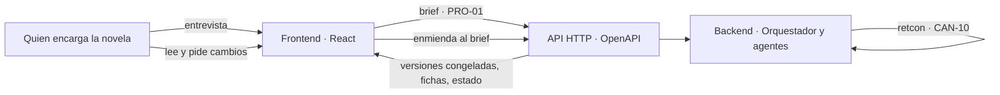

# SRS · Frontend de Story-Maker · versión 1

> Especificación de requisitos de software de la primera versión de `frontend/`: el paso 11 del orden de construcción de [`architecture.md`](../docs/architecture.md) §14. Refina la arquitectura hasta el punto en que se puede escribir código; no la sustituye. Vocabulario: [`definitions.md`](../docs/definitions.md). Métodos: [`verification.md`](../docs/verification.md). Reglas del repositorio: [`AGENTS.md`](../AGENTS.md) §3.3. Las specs del backend que este documento consume: [`srs-backend-v1.md`](srs-backend-v1.md) y [`srs-backend-v2.md`](srs-backend-v2.md).

Ciclo: 3

---

## 1. Introducción

### 1.1 Propósito

Este documento fija **qué debe hacer la primera versión del frontend** para que un equipo la construya sin volver a decidir nada que `docs/` ya decidió, y para que después se pueda escribir su plan de implementación. Cada requisito lleva su fuente en `docs/` o en una spec del backend, y el método `VER-NN` que lo comprueba.

El frontend tiene dos trabajos. **Recoger el encargo**: una entrevista que convierte lo que quien encarga la novela sabe de su destinatario en un brief (PRO-01) estructurado y validado. **Entregar la novela**: una lectura en web con portada y dedicatoria, índice navegable, ficha de personajes y lugares, y la posibilidad de pedir un cambio sobre un hecho desde la propia página, que el sistema aplica solo y entrega como una versión nueva sin perder la anterior.

Lo que no está aquí no es de la versión 1 del frontend. Lo que está aquí y contradice a `architecture.md` es un error de este documento y se corrige aquí, nunca al revés (`AGENTS.md` §3.3).

### 1.2 Alcance

| Entra en la versión 1 | Sale de la versión 1 |
|---|---|
| Entrevista del brief: preguntas, detección de datos que faltan y de contradicciones, texto libre tratado como no confiable, brief estructurado y validado con esquema | Entrega en PDF interactivo. Se elige web (D-47) |
| Lectura en web: portada con dedicatoria, índice de capítulos, lectura por capítulo | Curva de tensión: no hay ruta que la sirva hasta que el Jurado exista (`srs-backend-v2.md` RF-148) |
| Ficha de personajes y lugares generada desde el canon (CAN-03), con enlace a los capítulos donde aparece cada uno | Las trece señales de salud de `architecture.md` §11: su ruta es `srs-backend-v2.md` RI-28 y llega con el Supervisor |
| Solicitud de cambio desde la lectura: seleccionar un fragmento o un hecho y pedir «el perro se llama Nala» | Edición directa del texto por el lector: sería revisión humana del texto (PRO-11) |
| Versiones del manuscrito: la anterior se conserva, la nueva marca qué capítulos cambiaron | Aprobación, rechazo o desbloqueo de cualquier paso del ciclo |
| Estado de la tirada, deuda narrativa y grafo de entidades, con las rutas que el backend ya sirve | Autenticación y multiusuario: el sistema es local, un fichero por novela (`AGENTS.md` §3.2) |

**Por qué esta frontera.** La versión 1 del frontend es la que hace que el sistema se pueda **encargar y leer** de extremo a extremo por una persona sin cliente HTTP. Lo que queda fuera es visualización de métricas que el backend aún no produce, y una segunda forma de entrega, el PDF, que duplicaría la lectura sin añadir nada al ciclo.

### 1.3 Definiciones

Todo el vocabulario es el de `definitions.md`, referenciado por ID. Este documento no introduce términos nuevos. Los que más se usan:

| ID | Término | En una frase aquí |
|---|---|---|
| PRO-01 | Brief | El encargo. Es la única entrada humana del sistema, y entra por el frontend |
| MET-09 | Procedencia | Un hecho del brief lleva procedencia `brief`, y eso decide su precedencia (PRO-10) |
| CAN-03 | Biblia de la obra | De donde sale la ficha de personajes y lugares |
| CAN-10 | Retcon | Cómo el sistema aplica un cambio pedido sobre canon ya congelado |
| PRO-08 | Versión | Instantánea identificable del manuscrito. Una por cada cambio aplicado |
| CTX-05 | Ficha compacta | La faceta (MET-08) de una entidad que la ficha del lector muestra |

Tres expresiones de este documento no son términos del glosario sino descripciones con palabras corrientes, y se usan siempre con el ID al que remiten: **enmienda al brief** es un hecho nuevo con procedencia `brief` (MET-09) pedido después del encargo inicial; **solicitud de cambio** es la petición del lector que el backend convierte en esa enmienda; **entrevista** es la conversación que produce el brief (PRO-01). Si alguna se consolida como término, entra en `definitions.md` por el proceso A de `AGENTS.md` §6.2, no desde aquí (§10).

### 1.4 Referencias

| Documento | Qué aporta a este SRS |
|---|---|
| `docs/definitions.md` | Ontología e IDs: PRO-01, PRO-08, PRO-10, PRO-11, CAN-03, CAN-10, CAN-12, MET-09, CTX-05, CTX-13 |
| `docs/architecture.md` | §2.1 el frontend como observador del ciclo; §2.2 la frontera y lo que la cruza; §2.3 paquete por funcionalidad en `frontend/`; §8 cómo se aplica un cambio pedido por quien encarga; §10 escritura de canon; §14 paso 11 |
| `docs/verification.md` | §4.1, §4.2, §4.5, §4.8 los cuatro métodos del frontend; §5.9 amenazas que el texto libre trae; §7.1 la fila «Frontend» |
| `specs/srs-backend-v1.md` | Las rutas que ya existen (RI-01 a RI-07, RI-27) y las reglas de la API (RI-08 a RI-10) |
| `specs/srs-backend-v2.md` | El retcon con recongelación (RF-151 a RF-155) que la solicitud de cambio reutiliza; RI-28 a RI-31 |
| `AGENTS.md` | Restricciones no negociables (§5.3), stack (§3.1), persistencia (§3.2), la skill `react` |

### 1.5 Convenciones de este documento

- Los requisitos se numeran `RF-NN`, `RD-NN`, `RI-NN` y `RNF-NN`, y las decisiones `D-NN`. **La numeración continúa la de las specs del backend** para que un identificador signifique una sola cosa en todo `specs/`: `RF-162`, `RD-28`, `RI-37`, `RNF-38`, `D-47` en adelante (D-55). Los tramos siguen desde `T25`.
- Un requisito del backend se **cita** por su ID, nunca se redefine aquí. Las rutas que ya existen aparecen en §3.1 con su ID en una columna, no como fila propia.
- «Debe» es obligatorio. «Puede» es opcional y se marca. No hay «debería».
- Cada requisito lleva **fuente** y **verificación**. Un requisito sin método va al riesgo aceptado de §7.4 antes de escribir su código.
- Todos los números salen de `docs/` o de las specs del backend. Los dos que no, van marcados como propuesta con su origen (D-59).

---

## 2. Descripción general

### 2.1 Perspectiva del producto

El backend es el sistema completo y termina una novela con el frontend apagado (`architecture.md` §2.1). El frontend es la puerta por la que **entra el encargo** y por la que **sale la novela**. Nada de lo que hace condiciona el ciclo: el ciclo recibe encargos y devuelve versiones congeladas.

Dos flechas entran y una sale. Las dos que entran son **encargos**: cambian lo que se pide, nunca revisan lo que se escribió. La que sale son **proyecciones**: capítulos congelados, fichas derivadas del canon y estado de la tirada. El registro de eventos en crudo no cruza (`architecture.md` §2.2).

### 2.2 Funciones del producto

Una fila por funcionalidad de `frontend/` (`architecture.md` §2.3). Cada una es una carpeta con sus componentes, hooks, estado local y tests, y solo importa de `commons/`.

| Carpeta | Función en la versión 1 | Rutas que consume |
|---|---|---|
| `commons/` | Cliente generado desde el OpenAPI, tipos, componentes compartidos, armazón de la aplicación y pantallas de error | Todas, es el único punto de acceso HTTP |
| `interview/` | La entrevista: preguntas, texto libre no confiable, hechos propuestos, brief estructurado, datos que faltan, contradicciones, creación de la novela y arranque de la tirada | RI-38 a RI-40, RI-01, RI-02 |
| `manuscript/` | Portada con dedicatoria, índice, lectura por capítulo, versiones, marcas de cambio, solicitud de cambio desde la selección y su seguimiento | RI-42 a RI-44, RI-47 a RI-49, RI-03 |
| `story-bible/` | Ficha de personajes y lugares con enlaces a los capítulos donde aparecen, y solicitud de cambio sobre un hecho de la ficha | RI-45, RI-46, RI-47 |
| `entity-graph/` | Grafo de entidades con relaciones tipadas y su vigencia, dibujado en SVG | RI-46, RI-06 |
| `narrative-debt/` | Setups abiertos sin payoff | RI-07 |
| `run-health/` | Capítulo y escena en curso, capítulos congelados, cuarentenas, condición de cierre, traza | RI-03, RI-27 |

`tension-curve/` existe en el árbol de `architecture.md` §2.3 y **no se construye en esta versión**: no hay ruta que sirva la curva realizada hasta el Jurado (§1.2). Queda como carpeta declarada y vacía, igual que lo estuvo `supervision/` en el backend.

### 2.3 Actores

| Actor | Qué hace | Cuándo |
|---|---|---|
| Quien encarga la novela | Responde la entrevista, pega textos, acepta o descarta los hechos que el sistema extrae de ellos, crea la novela, lee las versiones y pide cambios | Antes del ciclo, y entre congelaciones o con la obra cerrada. **Nunca dentro de un capítulo en curso** (PRO-11) |
| Destinatario | Aparece en el brief con nombre, edad, rasgos y recuerdos, y recibe la dedicatoria. Es una entidad con procedencia `brief`, no un usuario del sistema | — |
| Backend | Sirve el OpenAPI, despacha las llamadas de modelo de la entrevista, aplica las enmiendas como retcon y congela versiones | Siempre |

No hay actor «revisor». Cualquier requisito que lo necesite es un error de este documento. Quien encarga **decide qué pide**; el sistema decide, solo, cómo lo escribe.

### 2.4 Entorno de operación

| Aspecto | Valor | Fuente |
|---|---|---|
| Lenguaje y framework | React con TypeScript en modo `strict`, sin `any` | `AGENTS.md` §3.1; skill `react` |
| Cliente HTTP | Generado desde el esquema OpenAPI versionado del backend; un solo cliente en `commons/` | `architecture.md` §2.2, §2.3 |
| Construcción y pruebas | `tsc --strict`, `eslint` con regla de fronteras, `vitest` con React Testing Library, dobles del backend generados del mismo OpenAPI | `verification.md` §4.1, §4.2, §4.5, §4.8 |
| Despliegue | Sitio estático servido junto al backend, en la misma máquina local. Sin servidor propio | `AGENTS.md` §3.2 |
| Representación gráfica | SVG escrito a mano. La librería de dibujo es una decisión abierta de `architecture.md` §2.2 y esta versión no la cierra de facto | `architecture.md` §2.2; skill `react` |

### 2.5 Restricciones de diseño

Las seis de `AGENTS.md` §5.3 rigen también aquí, y de ellas salen cuatro propias del frontend:

1. **Solo encargos escriben.** Las únicas operaciones que el frontend invoca y que cambian algo en el backend son la creación de la entrevista y sus turnos, la creación de la novela, el arranque de la tirada y la solicitud de cambio. Todas son entrada al sistema; ninguna aprueba, rechaza ni desbloquea. Es `architecture.md` §2.1 y §2.2 aplicado a una lista cerrada de rutas.
2. **El frontend no guarda canon.** Lo que cachea son respuestas, y se invalidan cuando aparece un capítulo congelado o una versión nueva. Si el frontend necesita calcular algo sobre el canon, la proyección la calcula el backend y la sirve (skill `react`).
3. **El contrato es el OpenAPI y nada más.** Ni un DTO escrito a mano, ni una URL construida fuera del cliente generado. Un cambio incompatible del backend rompe la compilación, no la pantalla (VER-08).
4. **Todo texto de persona o de modelo es dato.** Se pinta como nodo de texto, nunca como HTML. El texto libre pegado en la entrevista es contenido no confiable en los dos sentidos: no instruye al modelo (`srs-backend-v1.md` RNF-12) y no ejecuta en el navegador.

### 2.6 Supuestos y dependencias

| Supuesto | Consecuencia si falla |
|---|---|
| El backend sirve las rutas nuevas de §3.2 según `srs-backend-v3.md`, que es donde se realizan (§8) | Se cumple: `srs-backend-v3.md` las realiza en T33 a T36. Si faltaran, T29 a T31 no empezarían |
| El brief que RI-01 acepta incluye los campos del destinatario, la dedicatoria y las prohibiciones que la entrevista recoge | La entrevista produce un brief que el backend rechaza. Se corrige el esquema en `srs-backend-v3.md`, no aquí |
| El retcon de `srs-backend-v2.md` RF-151 a RF-155 existe y se puede disparar desde una enmienda al brief | Una solicitud de cambio se acepta y nunca se aplica. Es fallo del backend v3, y RI-49 lo hace visible con el estado `rejected` y su motivo, nunca con una espera |
| El navegador soporta selección de texto con `Selection` y `Range` del DOM | No se puede anclar un fragmento. Es el supuesto de todo navegador moderno y no se verifica aquí |

---

## 3. Requisitos de interfaces externas

### 3.1 API HTTP que ya existe

Rutas definidas en las specs del backend que esta versión consume tal como están. Se citan por su ID; no se redefinen.

| Ruta | ID del backend | Para qué la usa el frontend |
|---|---|---|
| `POST /novels` | RI-01 | Crear la novela con el brief que la entrevista produjo |
| `POST /novels/{id}/run` | RI-02 | Arrancar la tirada al terminar la entrevista. Idempotente |
| `GET /novels/{id}` | RI-03 | Estado de la tirada: capítulo y escena en curso, congelados, cuarentenas, cierre |
| `GET /novels/{id}/chapters` | RI-04 | Índice de capítulos congelados mientras no exista la versión 1 cerrada, con el instante de mundo en que termina cada uno |
| `GET /novels/{id}/chapters/{n}` | RI-05 | Prosa del capítulo `n` en la versión vigente |
| `GET /novels/{id}/state?at=` | RI-06 | Estado del mundo en t (MUN-10), con las relaciones vigentes, del que sale el grafo cuando RI-46 no basta |
| `GET /novels/{id}/debt` | RI-07 | Deuda narrativa vigente (CAN-08) |
| `GET /novels/{id}/trace` | RI-27 | Registros de la traza, en lectura |

Rigen además RI-08 (el OpenAPI es la única fuente del contrato), RI-09 (ninguna ruta escribe canon salvo la carga del brief) y RI-10 (identificador inexistente devuelve error explícito).

### 3.2 API HTTP que este SRS exige y el backend aún no sirve

Contrato que el frontend necesita. **Quién lo realiza y con qué presupuesto es de `srs-backend-v3.md`** (§8); aquí se fija qué entra y qué sale porque el cliente se genera de ello. La columna «Dueña» es la funcionalidad del backend que se recomienda, y la fija el backend.

| RI | Ruta | Dueña · propuesta | Entrada | Salida |
|---|---|---|---|---|
| RI-37 | `GET /novels` | `canon/` | — | Lista de novelas: identificador, título, estado de la tirada, número de versiones |
| RI-38 | `POST /interviews` | `brief/` | — | Identificador de entrevista, primera pregunta, brief vacío con su esquema, lista de datos que faltan |
| RI-39 | `POST /interviews/{iid}/turns` | `brief/` | Respuesta en texto, o texto libre no confiable, o ediciones estructuradas de campos, o aceptación y descarte de hechos propuestos. Cualquier combinación | Respuesta del entrevistador, brief actualizado, datos que faltan, contradicciones con los dos campos y la regla, hechos propuestos desde el texto libre con su cita, y si el brief está completo |
| RI-40 | `GET /interviews/{iid}` | `brief/` | — | El mismo estado que devuelve RI-39, para reanudar |
| RI-42 | `GET /novels/{id}/versions` | `canon/` | — | Versiones del manuscrito (PRO-08): número, instante, causa —tirada inicial o identificador de la solicitud de cambio— y capítulos cambiados respecto a la anterior |
| RI-43 | `GET /novels/{id}/versions/{v}` | `canon/` | — | Manifiesto de la versión: título, dedicatoria, nombre del destinatario, capítulos con número, título, palabras y marca de cambiado, y si es la vigente |
| RI-44 | `GET /novels/{id}/versions/{v}/chapters/{n}` | `canon/` | — | Prosa del capítulo `n` tal como estaba en la versión `v`, dividida en escenas con su identificador y su marca de cambiada |
| RI-45 | `GET /novels/{id}/entities?type=` | `canon/` | Tipo opcional: personaje (PER-01), lugar (MUN-01), institución (MUN-03), objeto (MUN-02) | Entidades con identificador, tipo, nombre canónico, alias vigentes y capítulos donde aparecen |
| RI-46 | `GET /novels/{id}/entities/{eid}` | `canon/` | — | Ficha compacta (CTX-05), hechos con su atributo, valor y procedencia (MET-09), relaciones vigentes con su tipo y vigencia, y apariciones por capítulo y escena |
| RI-47 | `POST /novels/{id}/change-requests` | `brief/` | Texto de la petición y un ancla: un fragmento —versión, capítulo, escena, cita literal— o un hecho —entidad y atributo— | Identificador de la solicitud y estado inicial: `queued` o `rejected` con motivo |
| RI-48 | `GET /novels/{id}/change-requests` | `brief/` | — | Todas las solicitudes con su estado |
| RI-49 | `GET /novels/{id}/change-requests/{rid}` | `brief/` | — | Estado, la interpretación del sistema —entidad, atributo, valor anterior, valor nuevo—, y si se aplicó: versión producida y capítulos cambiados; si se rechazó: el motivo |

Requisitos transversales de este contrato:

- **RI-41** RI-01 acepta el brief que RI-39 declara completo. Un brief con datos que faltan o con contradicciones se rechaza con error explícito y la lista de lo que falla: la validación de esquema vive en el backend, y el frontend la refleja, no la sustituye.
- **RI-50** Las rutas nuevas entran en el esquema OpenAPI versionado de RI-08 y se prueban con `schemathesis`. El cliente del frontend se regenera desde ese esquema y no compila si una ruta que usa cambia de forma.
- **RI-51** Una solicitud de cambio nunca queda esperando a una persona. Sus estados son `queued`, `applying`, `applied` y `rejected`, y todas las transiciones las hace el backend. El frontend las lee; no existe ruta que las cambie.
- **RI-52** Una solicitud que el sistema no puede interpretar como exactamente una entidad y un atributo se rechaza en la misma respuesta de RI-47 con el motivo —ambigua, entidad desconocida, contradice un invariante duro o el reglamento—, para que quien la pidió la reformule. La ambigüedad se resuelve reformulando, no eligiendo por él.
- **RI-53** Todo texto que el backend devuelve en estas rutas —respuestas del entrevistador, prosa, fichas, motivos— es dato, no marcado. El frontend lo pinta como texto (RNF-40).

### 3.3 Cliente generado

- **RI-54** El cliente vive en `frontend/commons/` y se genera desde el fichero OpenAPI versionado en el repositorio, en el mismo paso de construcción que compila el resto. El cliente generado se versiona también, y la puerta de CI comprueba que regenerarlo no produce diferencias (RNF-45).
- **RI-55** Ninguna funcionalidad construye una URL ni llama a `fetch` por su cuenta. Lo comprueba una regla de `eslint` que solo permite el acceso HTTP dentro de `commons/` (VER-02).

### 3.4 Navegador

- **RI-56** El frontend corre en el navegador de quien encarga, sirve como sitio estático y no necesita más red que la del backend. No llama a ningún proveedor de modelo ni a ningún servicio externo: los servicios externos del sistema son Claude y Langfuse, y solo el backend habla con ellos (`architecture.md` §4.8).

---

## 4. Requisitos funcionales

Agrupados por funcionalidad. El orden es el de los tramos de §11.

### 4.1 `commons/` · armazón, cliente y errores (T26)

| RF | Requisito | Fuente | Verificación |
|---|---|---|---|
| RF-162 | El cliente generado es el único punto de acceso HTTP. Sus tipos son los únicos tipos de datos de la API que existen en el frontend; no hay DTO escrito a mano | `architecture.md` §2.2, §2.3 | VER-01, VER-08 |
| RF-163 | Todo texto procedente del backend o escrito por la persona se pinta como nodo de texto. No se usa `dangerouslySetInnerHTML` ni ninguna vía equivalente en ninguna funcionalidad | `verification.md` §5.9; CTX-13 | VER-02, VER-17 |
| RF-164 | Un identificador inexistente muestra una pantalla de «no existe» explícita, nunca una novela vacía; un fallo de red muestra el error y ofrece reintentar. Refleja RI-10 en la interfaz | `srs-backend-v1.md` RI-10 | VER-05 |
| RF-165 | La aplicación tiene estas direcciones, relativas a la base `/app/` en la que se sirve (D-67), y ninguna más en la versión 1: `/`, `/new`, `/interviews/{iid}`, `/novels/{id}`, `/novels/{id}/v/{v}`, `/novels/{id}/v/{v}/chapters/{n}`, `/novels/{id}/bible`, `/novels/{id}/bible/{eid}`, `/novels/{id}/changes`, `/novels/{id}/status` (D-60) | `architecture.md` §2.3 | VER-05 |
| RF-166 | La portada de la aplicación, `/`, lista las novelas de RI-37 con su estado y da acceso a `/new`. Sin RI-37 en el OpenAPI, la lista se sustituye por los identificadores guardados en el navegador (RD-29) y la pantalla lo dice | RI-37 | VER-05 |

### 4.2 `interview/` · la entrevista (T29)

| RF | Requisito | Fuente | Verificación |
|---|---|---|---|
| RF-167 | Entrar en `/new` crea una entrevista con RI-38 y redirige a `/interviews/{iid}`. Volver a esa dirección reanuda con RI-40: la entrevista vive en el backend, no en la pestaña | RI-38, RI-40 | VER-05 |
| RF-168 | La conversación muestra cada pregunta del entrevistador y cada respuesta de la persona en orden. Responder envía un turno con RI-39 y pinta la respuesta que vuelve | RI-39 | VER-05 |
| RF-169 | Junto a la conversación hay un panel con el brief tal como está: destinatario —nombre, edad, rasgos, recuerdos, papel en la historia—, género, tono, extensión en palabras, dedicatoria, palabras y temas que no deben aparecer. El panel es proyección del estado que RI-39 devuelve, no un formulario con estado propio | PRO-01; RI-39 | VER-05 |
| RF-170 | Cada campo del panel se puede editar directamente, y la edición viaja como edición estructurada en el turno de RI-39. El valor que se muestra es siempre el que el backend devolvió, no el que se tecleó | RI-39 | VER-05 |
| RF-171 | El panel lista los datos que faltan tal como RI-39 los devuelve, y cada uno enlaza con su campo. La lista la calcula el backend; el frontend no decide qué es obligatorio | RI-39 | VER-05 |
| RF-172 | El panel lista las contradicciones tal como RI-39 las devuelve, cada una con los dos campos en conflicto y la regla que la detectó, y cada campo enlaza con su posición en el panel. Ejemplo que la interfaz debe saber mostrar: edad del destinatario frente a género o tono | RI-39; CAN-05 | VER-05 |
| RF-173 | Hay un campo aparte, rotulado como texto libre —una anécdota, una carta—, que viaja en RI-39 como texto no confiable y nunca como respuesta. Su contenido no aparece en el panel del brief | `srs-backend-v1.md` RNF-12; `verification.md` §5.9 | VER-05, VER-17 |
| RF-174 | Los hechos que el backend extrae del texto libre aparecen en una lista de **propuestos**, cada uno con la cita del texto de la que sale. Quien encarga acepta o descarta cada uno, y solo los aceptados entran en el brief, a través del turno de RI-39. Nada del texto libre entra por sí solo (D-50) | RI-39; MET-09 | VER-05 |
| RF-175 | La acción «Crear y escribir» se habilita solo cuando RI-39 declara el brief completo y sin contradicciones. Al pulsarla, el frontend llama a RI-01 con el brief tal como el backend lo devolvió y a continuación a RI-02, y redirige a `/novels/{id}`. Si RI-01 rechaza, la lista de RI-41 se muestra en el panel | RI-01, RI-02, RI-41 | VER-05, VER-08 |
| RF-176 | La entrevista no tiene botón de «saltar» ni de «crear igual»: un brief incompleto no se envía. No es aprobación humana del texto —no hay texto todavía—, es la única persona del sistema terminando su encargo (D-51) | PRO-11; `architecture.md` §2.2 | VER-05 |

### 4.3 `manuscript/` · lectura (T27)

| RF | Requisito | Fuente | Verificación |
|---|---|---|---|
| RF-177 | `/novels/{id}` muestra la portada de la versión vigente: título, dedicatoria y nombre del destinatario del manifiesto de RI-43, y debajo el índice de capítulos | RI-43; PRO-01 | VER-05 |
| RF-178 | El índice lista los capítulos congelados con número y título, cada uno enlazando a su lectura. Los capítulos aún no congelados no aparecen como capítulos: aparece una sola línea con el capítulo y la escena en curso según RI-03. Un borrador (PRO-06) no sale del backend y el frontend no lo pide | `architecture.md` §2.2; RI-03 | VER-05 |
| RF-179 | Mientras el backend no sirva RI-43 ni RI-44, la portada y el índice se construyen con RI-04 y RI-05: sin título ni dedicatoria, con la versión 1 como única y vigente, y con la escena identificada por el par capítulo y número de escena de RI-05, que es único en la novela. La pantalla lo dice. Es lo que permite construir T27 contra el backend de hoy | RI-04, RI-05 | VER-05 |
| RF-180 | La lectura de un capítulo pinta sus escenas en orden, cada una en su propio contenedor con el identificador de escena de RI-44 como atributo del DOM, de modo que una selección del lector se pueda atribuir a exactamente una escena | RI-44; EST-08 | VER-05, VER-06 |
| RF-181 | El lector navega al capítulo anterior y al siguiente desde la propia lectura y vuelve al índice. La posición de lectura se recuerda por novela y versión en el navegador (RD-29) | — | VER-05 |
| RF-182 | La lectura muestra en todo momento la versión que se está leyendo y si es la vigente. El estado de la tirada de `/novels/{id}/status` se resume en una línea en la portada mientras la obra no esté cerrada | RI-03, RI-43 | VER-05 |

### 4.4 `manuscript/` · versiones y solicitudes de cambio (T30, T31)

| RF | Requisito | Fuente | Verificación |
|---|---|---|---|
| RF-183 | La portada ofrece un selector de versiones alimentado por RI-42. Elegir una carga `/novels/{id}/v/{v}`, con su portada e índice, y toda versión anterior sigue legible completa: la versión anterior se conserva (D-52) | RI-42, RI-43; PRO-08 | VER-05 |
| RF-184 | En una versión posterior a la primera, el índice marca los capítulos cambiados respecto a la versión anterior con la marca del manifiesto de RI-43, y la portada dice cuántos cambiaron y por qué solicitud | RI-42, RI-43 | VER-05 |
| RF-185 | Dentro de un capítulo marcado, las escenas cambiadas se distinguen visualmente con la marca de RI-44, y el lector puede abrir la misma escena en la versión anterior al lado | RI-44 | VER-05 |
| RF-186 | Un capítulo sin marca de cambiado tiene el mismo texto en las dos versiones. El frontend no lo recalcula: lo muestra tal como RI-44 lo sirve, y una prueba de propiedad contra el doble comprueba que la marca y el texto coinciden | RI-44 | VER-06 |
| RF-187 | Seleccionar texto dentro de una escena abre una acción «Pedir un cambio» con un campo de texto. Enviarla llama a RI-47 con la petición y el ancla de fragmento: versión, capítulo, identificador de escena y la cita literal seleccionada, sin recortar ni normalizar (RD-30) | RI-47; `verification.md` §5.11 | VER-05, VER-06 |
| RF-188 | La respuesta de RI-47 se muestra al instante: `queued` con la interpretación del sistema —qué entidad, qué atributo, qué valor nuevo—, o `rejected` con su motivo y el campo para reformular. El frontend nunca elige entre interpretaciones: si el sistema no la tiene, quien pide reformula (RI-52) | RI-47, RI-52 | VER-05 |
| RF-189 | `/novels/{id}/changes` lista las solicitudes de RI-48 con su estado y su interpretación, y cada una en curso se vuelve a consultar con RI-49 a intervalo fijo (D-59) hasta que sea `applied` o `rejected` | RI-48, RI-49, RI-51 | VER-05 |
| RF-190 | Cuando una solicitud pasa a `applied`, el frontend invalida la caché de versiones (RD-28), anuncia la versión nueva con los capítulos que cambiaron y ofrece saltar al primero. La versión que se estaba leyendo no cambia bajo los pies: se sigue leyendo la anterior hasta que el lector elige la nueva | RI-49; RD-28 | VER-05 |
| RF-191 | Ninguna pantalla de `manuscript/` ofrece editar el texto, aprobar un cambio, rechazarlo ni forzar su aplicación. Lo único que quien encarga puede hacer con una solicitud es crearla y leerla | PRO-11; `architecture.md` §2.1 | VER-08, VER-02 |

### 4.5 `story-bible/` · ficha de personajes y lugares (T30)

| RF | Requisito | Fuente | Verificación |
|---|---|---|---|
| RF-192 | `/novels/{id}/bible` lista las entidades de RI-45 en dos pestañas, personajes (PER-01) y lugares (MUN-01), y opcionalmente instituciones y objetos. Cada fila muestra nombre canónico, alias y los capítulos donde aparece, cada capítulo enlazando a su lectura en la versión vigente | RI-45; CAN-03 | VER-05 |
| RF-193 | `/novels/{id}/bible/{eid}` muestra la ficha de RI-46: la ficha compacta (CTX-05), los hechos con su atributo, valor y procedencia, las relaciones vigentes con su tipo y su vigencia, y las apariciones por capítulo y escena, cada una enlazando a la escena en la lectura | RI-46; MET-07, MET-09 | VER-05 |
| RF-194 | Cada hecho de la ficha ofrece «Pedir un cambio», que llama a RI-47 con el ancla de hecho: entidad y atributo, más el texto de la petición. El seguimiento es el mismo de RF-188 a RF-190 | RI-47 | VER-05 |
| RF-195 | La ficha refleja el canon vigente, no el estado en el capítulo que se está leyendo (D-58). La pantalla lo dice en una línea | CAN-01 | VER-05 |

### 4.6 `entity-graph/`, `narrative-debt/`, `run-health/` · vistas de estado (T28)

| RF | Requisito | Fuente | Verificación |
|---|---|---|---|
| RF-196 | El grafo de entidades se dibuja en SVG a mano desde las relaciones de RI-46 o, mientras no exista, desde las relaciones vigentes del estado del mundo de RI-06 en el instante del último capítulo congelado. Muestra tipo de relación y vigencia, y cada nodo enlaza a su ficha (D-57) | `architecture.md` §2.2, §3.1; MET-03, MET-07 | VER-05 |
| RF-197 | `narrative-debt/` lista los setups abiertos de RI-07 con su estado, y no calcula nada: la deuda es la que el backend sirve | RI-07; CAN-08 | VER-05 |
| RF-198 | `/novels/{id}/status` muestra el estado de RI-03 —capítulo y escena en curso, capítulos congelados, cuarentenas, condición de cierre— y los últimos registros de la traza de RI-27, en lectura. Se vuelve a consultar a intervalo fijo mientras la obra no esté cerrada (D-59) | RI-03, RI-27; `architecture.md` §11 | VER-05 |
| RF-199 | Ninguna vista de estado tiene controles. Ni «continuar», ni «reintentar», ni «forzar». La única acción de arranque del sistema es RI-02 y vive en la entrevista | `architecture.md` §2.1 | VER-05 |

---

## 5. Requisitos de datos

El frontend no persiste canon. Estos requisitos acotan lo poco que guarda y cómo trata lo que recibe.

| RD | Requisito | Fuente | Verificación |
|---|---|---|---|
| RD-28 | Las respuestas de la API se cachean por novela y versión, y la caché de una novela se invalida cuando RI-03 muestra un capítulo congelado nuevo o RI-42 una versión nueva. Una versión ya publicada es inmutable, así que su caché no caduca | skill `react` §7; PRO-08 | VER-05 |
| RD-29 | En el almacenamiento del navegador solo viven: identificadores de entrevistas y novelas visitadas, posición de lectura por novela y versión, y última versión elegida. Nada de prosa, fichas, brief ni estado de la tirada | `architecture.md` §2.1 | VER-02, VER-05 |
| RD-30 | El ancla de fragmento de una solicitud de cambio lleva la cita literal tal como el lector la seleccionó, más versión, capítulo e identificador de escena. La cita no se recorta, no se normaliza y no se completa: la regla de anclaje de `verification.md` §5.11 la aplica el backend, y el frontend le entrega lo que hay | `verification.md` §5.11 | VER-06 |
| RD-31 | Los tipos de todo dato de la API son los del cliente generado. Una funcionalidad no declara interfaces propias para datos que vienen del backend; sí para su estado de interfaz | `architecture.md` §2.2 | VER-01, VER-02 |

---

## 6. Requisitos no funcionales

### 6.1 Autonomía

| RNF | Requisito | Fuente | Verificación |
|---|---|---|---|
| RNF-38 | El frontend no tiene ninguna operación que apruebe, rechace, corrija, edite ni desbloquee un paso del ciclo. Las únicas escrituras son los encargos: creación y turnos de la entrevista, creación de la novela, arranque de la tirada y solicitud de cambio. Como el cliente se genera del OpenAPI y el OpenAPI no tiene otra ruta de escritura, la propiedad se cumple por construcción y se comprueba en el contrato | `architecture.md` §2.1, §2.2; PRO-11 | VER-08, VER-02 |
| RNF-39 | El sistema termina una novela con el frontend apagado. El frontend no guarda ningún estado que el backend necesite para continuar, y una entrevista abandonada no deja nada en el backend que bloquee nada | `architecture.md` §2.1 | VER-05 |

### 6.2 Seguridad

| RNF | Requisito | Fuente | Verificación |
|---|---|---|---|
| RNF-40 | Ningún texto de persona o de modelo se interpreta como HTML ni como código. El texto libre de la entrevista con marcado, guiones o instrucciones dentro se muestra tal cual y no ejecuta nada | `verification.md` §5.9; CTX-13 | VER-02, VER-17 |
| RNF-41 | El frontend no depende de ningún SDK de proveedor de modelo ni llama a ninguna dirección que no sea la del backend. Lo comprueba una lista de dependencias permitidas en `eslint` y `npm audit` en CI | `architecture.md` §4.8; `verification.md` §4.2 | VER-02 |
| RNF-42 | Las direcciones de la aplicación no llevan más que identificadores. Ningún dato del brief ni de la prosa viaja en la URL | — | VER-05 |

### 6.3 Contrato y mantenibilidad

| RNF | Requisito | Fuente | Verificación |
|---|---|---|---|
| RNF-43 | `tsc --strict` en todo `frontend/`, sin `any` ni supresiones. Un cambio de forma en una ruta que el frontend usa rompe la compilación | `verification.md` §4.1, §4.8 | VER-01, VER-08 |
| RNF-44 | Paquete por funcionalidad con las tres reglas de `architecture.md` §2.3: una funcionalidad importa solo de `commons/`, a `commons/` se baja por uso y no hay capas técnicas. Lo comprueba la regla de fronteras de `eslint` en CI | `architecture.md` §2.3 | VER-02 |
| RNF-45 | Regenerar el cliente desde el OpenAPI versionado no produce diferencias respecto al cliente versionado. La puerta de CI lo comprueba en cada cambio | `architecture.md` §2.2 | VER-08, VER-15 |
| RNF-46 | Todo test que involucre la API usa un doble generado del mismo OpenAPI. Ningún test del frontend levanta el backend real ni llama a un modelo | `verification.md` §4.5 | VER-05 |
| RNF-47 | La lógica de proyección que el frontend sí tiene —atribuir una selección a una escena, marcar capítulos cambiados, invalidar caché— se escribe como funciones puras para que VER-06 pueda aplicarse | `verification.md` §4.6 | VER-06 |

---

## 7. Verificación

### 7.1 Matriz requisito × método

| Método | Requisitos que cubre como método principal |
|---|---|
| VER-01 Type checking | RF-162, RD-31, RNF-43 |
| VER-02 Static analysis | RF-163, RF-191, RI-55, RD-29, RD-31, RNF-38, RNF-40, RNF-41, RNF-44 |
| VER-05 Unit e integration | RF-164 a RF-185, RF-187 a RF-190, RF-192 a RF-199, RI-38, RI-39, RI-40, RI-41, RI-42, RI-43, RI-44, RI-45, RI-46, RI-47, RI-48, RI-49, RI-51, RI-52, RI-53, RI-56, RD-28, RD-29, RNF-39, RNF-42, RNF-46 |
| VER-06 Property-based | RF-180, RF-186, RF-187, RD-30, RNF-47 |
| VER-08 Contract | RI-37, RI-50, RI-54, RF-162, RF-175, RF-191, RNF-38, RNF-43, RNF-45 |
| VER-15 CI/CD | RNF-45 |
| VER-17 Red-teaming | RF-163, RF-173, RNF-40 |

VER-13 está excluido. VER-09, VER-10, VER-14, VER-18, VER-19 y VER-20 son del backend y no cubren nada de esta spec: el frontend no traza, no juzga y no congela.

**Cómo se verifica un contrato con rutas que aún no existen.** RI-37 a RI-53 se cumplen en dos mitades: el backend las realiza y las prueba con `schemathesis` en `srs-backend-v3.md`; el frontend las consume a través del cliente generado, así que su parte de VER-08 es que compile contra el OpenAPI que las declare y que sus pruebas de VER-05 corran contra dobles generados del mismo esquema. Hasta que ese esquema exista, los requisitos de T29 a T31 no se pueden verificar, y por eso esos tramos no empiezan (§11).

### 7.2 Puerta de CI

Ningún cambio en `frontend/` llega a la rama principal sin VER-01, VER-02, VER-05, VER-06 y VER-08 en verde, igual que el backend (`verification.md` §5.7). La regeneración del cliente (RNF-45) forma parte de la puerta de VER-08.

### 7.3 Propiedades que se traducen sin trabajo

| Regla | Propiedad | Requisito |
|---|---|---|
| Contrato RI-44 | Un capítulo sin marca de cambiado tiene el mismo texto en dos versiones consecutivas | RF-186 |
| Ancla RD-30 | La cita del ancla es exactamente la subcadena seleccionada del texto de su escena | RF-187, RD-30 |
| Atribución RF-180 | Toda selección dentro de la lectura se atribuye a exactamente una escena, o a ninguna si cruza dos | RF-180 |
| Caché RD-28 | Dos lecturas de la misma versión devuelven el mismo contenido sin volver a pedirlo; una versión nueva invalida solo la caché de esa novela | RD-28, RNF-47 |

### 7.4 Riesgo aceptado propio de esta versión

| Riesgo | Por qué queda en U | Señal que se vigila |
|---|---|---|
| Que la interpretación del sistema de «el perro se llama Nala» sea la que quien pidió quería | Convertir texto libre en entidad y atributo es trabajo de modelo, y comprobarlo exige otro modelo. RF-188 lo hace visible antes de aplicarlo, y RI-52 rechaza lo ambiguo, pero un cambio bien formado y mal entendido se aplica | Solicitudes seguidas de otra solicitud sobre el mismo hecho, en RI-48 |
| Que la ficha de un personaje revele al lector algo de un capítulo que aún no ha leído | La ficha es el canon vigente (D-58); acotarla al capítulo leído es una decisión abierta (§10) | Ninguna. Riesgo aceptado hasta decidirlo |
| Que la lectura sea cómoda | No hay criterio operativo y el sistema no tiene a quién preguntárselo | Ninguna |

---

## 8. Fuera de alcance y lo que este SRS exige del backend

### 8.1 Fuera de alcance

| Qué | Motivo |
|---|---|
| PDF interactivo con página de novedades | Se elige web (D-47). La lectura web ya cubre índice, ficha, portada y marcas de cambio; el PDF sería una segunda entrega del mismo contenido |
| Curva de tensión y trece señales de salud | Sin ruta hasta el Jurado y el Supervisor (`srs-backend-v2.md` RI-28, RF-148). Frontend versión 2 |
| Edición del texto por el lector | Es revisión humana del texto (PRO-11). Lo que existe es pedir un cambio de hecho, que el sistema escribe solo |
| Varias personas, cuentas, permisos | El sistema es local y una novela es un fichero (`AGENTS.md` §3.2) |
| Librería de dibujo del grafo | Decisión abierta de `architecture.md` §2.2. Esta versión dibuja en SVG a mano y no la cierra |

### 8.2 Lo que el backend tiene que construir para que este SRS se cumpla

Nada de esto lo construye el frontend ni lo especifica este documento más allá del contrato de §3.2. Es el contenido mínimo de `srs-backend-v3.md`, con la decisión de este documento que lo motiva.

| Pieza | Qué tiene que hacer | Decisión que lo fija |
|---|---|---|
| Entrevista | Llamadas de modelo despachadas en código —preguntar, extraer hechos de texto no confiable— más comprobación determinista de datos que faltan, de contradicciones y de esquema. Sus presupuestos entran en `architecture.md` §4.2 como la fila del examen, no como agente nuevo | D-49 |
| Esquema del brief | RI-01 admite destinatario —nombre, edad, rasgos, recuerdos, papel—, dedicatoria y palabras y temas prohibidos, y rechaza con la lista de fallos | RI-41 |
| Enmienda al brief | RI-47 convierte la petición en un hecho con procedencia `brief`, lo encola hasta la siguiente congelación o lo aplica de inmediato si la obra está cerrada, identifica las escenas que lo nombran por el registro de eventos y el índice de prosa, las repara con el hecho nuevo como canónico, las reverifica y las recongela. Gana por PRO-10 sin la regla de los 3 pasajes, que acota lo que el sistema se propone a sí mismo (`architecture.md` §8) | D-48, D-53 |
| Versiones del manuscrito | Una versión (PRO-08) por cada enmienda aplicada, la anterior conservada entera, y el manifiesto con capítulos cambiados. La recongelación de `srs-backend-v2.md` RD-25 reemplaza el índice, no el histórico | D-52 |
| Ficha de entidades | Proyección de entidades con alias, hechos con procedencia, relaciones vigentes y apariciones por capítulo y escena desde el índice de prosa | RI-45, RI-46 |
| Lista de novelas | RI-37 | D-61 |

---

## 9. Decisiones tomadas en este documento

| D | Decisión | Elección | Por qué |
|---|---|---|---|
| D-47 | Forma de entrega | Web, no PDF | Lo pide quien encarga el sistema. La web permite pedir el cambio desde la propia página, que es la mitad más valiosa de la evaluación, y no obliga a regenerar un documento por versión |
| D-48 | Qué es una solicitud de cambio del lector | Una **enmienda al brief**: un hecho con procedencia `brief` (MET-09) que gana sobre el canon derivado por PRO-10 y se aplica como retcon (CAN-10) con la recongelación de `srs-backend-v2.md` RF-153. **Sin la regla de los 3 pasajes** de `architecture.md` §8 | Esa regla acota lo que el sistema se propone a sí mismo, que es el vector de envenenamiento de canon. Un cambio pedido por quien encarga tiene otra procedencia y otra amenaza: no hay nadie tapando su propia incoherencia. Y «brief gana sobre canon derivado» ya está en PRO-10. Corrige `architecture.md` §2.1, §2.2, §2.3 y §8 en esta entrega |
| D-49 | Quién es el entrevistador | **No es un agente 14º.** Son llamadas de modelo que el backend despacha en código, como `quiz.answer` en `architecture.md` §4.2, con comprobación determinista alrededor | Los trece agentes son los del ciclo de la novela; la entrevista ocurre antes y no tiene misión ni criterio de salida dentro del ciclo. Un agente nuevo obligaría a tocar el catálogo, la matriz agente × skill y los flujos para algo que no participa en ninguno |
| D-50 | Texto libre | Se extraen hechos **propuestos** con su cita; quien encarga acepta o descarta cada uno; el texto crudo no entra en el brief | Es contenido no confiable (`verification.md` §5.9). Que lo acepte la única persona del sistema en el único momento en que el sistema le pregunta no es revisión del texto: es terminar el encargo |
| D-51 | Quién decide qué falta y qué se contradice | El backend, en código y con esquema. El frontend refleja y bloquea «Crear y escribir» hasta que el backend declare el brief completo | Determinista antes que modelo y una sola fuente de verdad. Si el frontend calculara lo obligatorio, dos listas se desincronizarían |
| D-52 | Qué es una versión del manuscrito | La 1 es la tirada; cada enmienda aplicada produce una más. Todas se conservan enteras; cada una tiene manifiesto con capítulos cambiados | PRO-08 ya define la versión como instantánea identificable. Una por enmienda hace que cada versión tenga exactamente una causa, que es lo que la trazabilidad (PRO-09) pide |
| D-53 | Cuándo se aplica una enmienda | Entre congelaciones o con la obra cerrada. La encola y la aplica el Orquestador, en código. Una versión por solicitud | Dentro de un capítulo en curso no hay canon estable contra el que aplicarla, y aplicarla al congelar hace que el capítulo siguiente ya la vea. El dueño es el que ya lleva el flujo |
| D-54 | Alcance de la versión 1 del frontend | Lo que la evaluación exige más las vistas cuyas rutas existen; curva de tensión y trece señales a la versión 2 | Una vista sin ruta es una vista contra un doble inventado, y ese doble luego no coincide con el backend |
| D-55 | Numeración | Continúa la del backend: RF-162, RD-28, RI-37, RNF-38, D-47, T25 | `backend/coherence.py` exige IDs únicos en todo `specs/`, y un identificador que significa una sola cosa es lo que hace posible la matriz de cobertura |
| D-56 | Herramientas del frontend | **Propuesta**: Vite para construir, `openapi-typescript` con `openapi-fetch` para generar el cliente, `react-router` para las direcciones, `msw` para los dobles, `fast-check` para las propiedades | Son las elecciones con menos piezas para cumplir la skill `react` y `verification.md` §4.5 y §4.8: el cliente sale del esquema y los dobles del mismo esquema. Ninguna condiciona al backend |
| D-57 | Cómo se dibuja el grafo | SVG a mano | `architecture.md` §2.2 deja la librería abierta y la skill `react` pide no cerrarla de facto |
| D-58 | Qué canon muestra la ficha | El vigente, no el del capítulo que se lee | Es lo que RI-46 puede servir sin una proyección por capítulo. Acotarla es decisión abierta (§10) |
| D-59 | Cómo se sigue el estado | Sondeo a intervalo fijo de RI-03 y RI-49. **Propuesta: 5 segundos** | Un solo proceso y una sola persona: un canal en tiempo real sería infraestructura para un problema que no hay. El número no sale de `docs/`; es el orden de duración de una llamada de modelo, y se ajusta al medir |
| D-60 | Direcciones de la aplicación | Las de RF-165, con identificadores en inglés | `AGENTS.md` §5.4: identificadores técnicos en inglés. Una dirección por recurso y versión hace que una versión sea enlazable |
| D-61 | Lista de novelas | Ruta nueva RI-37, y mientras no exista, identificadores guardados en el navegador | Sin lista no hay forma de volver a una novela sin recordar su identificador |
| D-67 | Dónde se sirve la aplicación | Bajo la base `/app/`, montada por el backend desde `frontend/dist/`; las direcciones de RF-165 son relativas a ella | En la raíz, `/novels/{id}` sería a la vez dirección de la aplicación y ruta RI-03 de la API. Una base propia conserva las direcciones enlazables de D-60 sin tocar ninguna ruta del backend ni exigir un servidor propio (§2.4) |
| D-68 | Raíz de composición del frontend | `main.tsx` y `routes.tsx` en la raíz de `frontend/`: montan las direcciones que exporta cada funcionalidad | Alguien tiene que conocer a todas las funcionalidades para montar el router, y no puede ser `commons/`, porque todas importan de él. Es el papel de `orchestration/` en el backend (`architecture.md` §2.3) |

---

## 10. Decisiones abiertas

| Decisión | Estado en esta versión |
|---|---|
| Librería de dibujo del grafo (`architecture.md` §2.2) | Abierta. SVG a mano |
| Ficha acotada al capítulo leído para no adelantar la historia | Abierta. Exige una proyección por capítulo en el backend (`canon.state-at` por capítulo). Se decide cuando haya lectores que lo pidan |
| Si «enmienda al brief», «solicitud de cambio» y «entrevista» merecen ID en `definitions.md` | Abierta. Hoy se describen con IDs existentes (§1.3). Si `srs-backend-v3.md` las necesita como término, proceso A de `AGENTS.md` §6.2 |
| Intervalo de sondeo (D-59) | Propuesta de 5 segundos hasta medir |
| Enmiendas con la tirada en curso | Se admiten y se encolan (D-53). La alternativa, admitirlas solo con la obra cerrada, es más simple y peor: obligaría a esperar cuarenta capítulos para corregir el nombre del perro |

---

## 11. Plan de ejecución

Continúa la numeración de `backend/PLAN.md` y de `srs-backend-v2.md` §11: el último tramo del backend es T24. **T25 es este documento.** El plan de implementación del frontend —ficheros, orden fino y puertas detalladas— es `frontend/PLAN.md`, que se escribe después de este SRS y no añade requisitos.

| # | Tramo | Qué entrega | Requisitos | Puerta para seguir |
|---|---|---|---|---|
| **T25** | `specs/srs-frontend-v1.md` | Este documento | — | `backend/coherence.py` extendido a esta spec no encuentra inconsistencias |
| **T26** | `commons/` · armazón | Proyecto con `tsc --strict`, `eslint` con fronteras, `vitest`, dobles desde el OpenAPI; cliente generado y versionado; direcciones; pantallas de error; portada de la aplicación | RF-162 a RF-166, RI-54 a RI-56, RD-29, RD-31, RNF-40 a RNF-47 | Quitar una ruta usada del OpenAPI rompe la compilación; regenerar el cliente no produce diferencias; la puerta de CI de §7.2 en verde |
| **T27** | `manuscript/` · lectura | Portada, índice, lectura por capítulo y escena, posición recordada, estado de la tirada en una línea, contra RI-03, RI-04 y RI-05 | RF-177 a RF-182, RD-28, RNF-38 | Contra el backend de hoy se leen los capítulos congelados de `runs-real/real.sqlite` con sus escenas atribuibles; ningún borrador se pide |
| **T28** | Vistas de estado | Grafo en SVG desde RI-06, deuda desde RI-07, estado y traza desde RI-03 y RI-27 | RF-196 a RF-199 | Las tres vistas funcionan contra el backend de hoy y no tienen ningún control |
| **T29** | `interview/` | Entrevista completa: conversación, panel del brief, ediciones, datos que faltan, contradicciones, texto libre con hechos propuestos, «Crear y escribir» | RF-167 a RF-176, RI-38 a RI-41, RI-53 | Una entrevista con dobles llega a brief completo, un texto libre con una instrucción incrustada se muestra tal cual y no entra en el brief sin aceptarse, y un brief con contradicción no se puede enviar |
| **T30** | Versiones y ficha | Selector de versiones, marcas de capítulo y escena, lectura comparada, ficha de personajes y lugares con enlaces | RF-183 a RF-186, RF-192 a RF-195, RI-42 a RI-46 | Con dos versiones del doble, los capítulos sin marca son idénticos y los marcados muestran sus escenas cambiadas; cada aparición de la ficha enlaza a su escena |
| **T31** | Solicitudes de cambio | Selección a ancla, «Pedir un cambio» desde la lectura y desde la ficha, seguimiento de estados, anuncio de versión nueva | RF-187 a RF-191, RI-37, RI-47 a RI-52, RD-30 | Seleccionar «Rex» y pedir «el perro se llama Nala» produce una solicitud `queued` con su interpretación; el doble la pasa a `applied` y el frontend anuncia la versión 2 con sus capítulos cambiados sin mover la lectura en curso |
| **T32** | Tirada real de extremo a extremo | Con el backend v3 real: entrevista, novela, lectura, una solicitud de cambio aplicada y leída como versión 2 | RNF-39; y todos los anteriores, con modelo real | Una persona encarga, lee y corrige el nombre de un personaje sin tocar nada más que el frontend, y la versión 1 sigue legible entera |

**T29 a T31 no empiezan hasta que `srs-backend-v3.md` entregue las rutas de §3.2 en el OpenAPI versionado.** Construirlos antes obligaría a inventar el esquema en el frontend, y un cliente que no sale del esquema del backend es justo lo que VER-08 existe para impedir. T26 a T28 se construyen contra las rutas que ya existen y no dependen de nada.

### 11.1 Qué significa que el frontend está terminado

- [ ] T26 a T32 pasaron su puerta
- [ ] La puerta de CI de §7.2 en verde
- [ ] Todo requisito de §3 a §6 con su método principal ejecutándose, o en §7.4
- [ ] **Una persona encarga una novela, la lee y pide un cambio sin ningún cliente HTTP y sin que nadie apruebe nada** (RNF-38)
- [ ] El sistema sigue terminando una novela con el frontend apagado (RNF-39)
- [ ] `architecture.md` §2.1 a §2.3 y §8 describen el frontend que existe, y `AGENTS.md` §2 lo refleja

---

## Apéndice A · Trazabilidad con `definitions.md`

IDs que esta versión realiza desde el frontend. Un ID que no aparece aquí lo realiza el backend o no está implementado.

| Capa | IDs |
|---|---|
| MET | 03, 07, 08, 09 en su lectura |
| EST | 07, 08 como unidades de lectura y de anclaje |
| PER | 01 en la ficha |
| MUN | 01, 02, 03 en la ficha; 10 en el grafo |
| CAN | 01, 03, 08 en lectura; 10 como efecto de una enmienda |
| CTX | 05 en la ficha; 13 como amenaza que RNF-40 acota |
| PRO | 01 completo por la entrevista; 08 en las versiones; 11 como restricción de toda la interfaz |

No se realizan aquí POE, DEP ni CAL: el frontend no juzga calidad, no simula encuentros ni mide estilo. Muestra lo que el canon dice.
