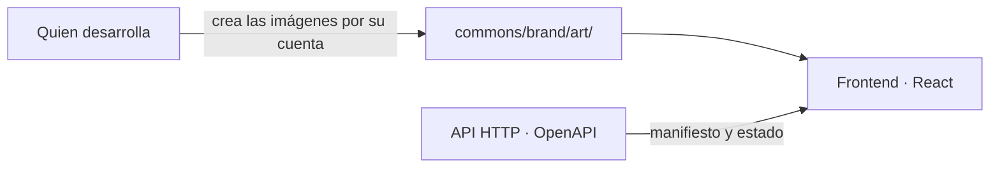

# SRS · Frontend de Story-Maker · versión 2

> Especificación de requisitos de la segunda versión de `frontend/`: ilustraciones deportivas, un sistema visual con elevación, el libro en 3D al cerrar la obra y el grafo de entidades en 3D. Refina [`architecture.md`](../docs/architecture.md) §2.3 y §4.8 y continúa [`srs-frontend-v1.md`](srs-frontend-v1.md), que sigue vigente entero. Vocabulario: [`definitions.md`](../docs/definitions.md). Métodos: [`verification.md`](../docs/verification.md). Reglas del repositorio: [`AGENTS.md`](../AGENTS.md) §3.3.

Ciclo: 1

---

## 1. Introducción

### 1.1 Propósito

La versión 1 hace que la novela se pueda encargar y leer. Esta versión hace que **se vea como lo que es, una épica deportiva**, y que la obra terminada se entregue como un objeto: un libro. No añade ninguna ruta del backend, ninguna escritura y ningún control del ciclo. Todo lo que cambia es presentación de lo que la API ya sirve.

### 1.2 Alcance

| Entra en la versión 2 | Sale de la versión 2 |
|---|---|
| Un catálogo cerrado de ilustraciones deportivas que quien desarrolla crea por su cuenta y deja en `commons/brand/art/`, versionadas como material de marca | Generar ilustraciones desde el sistema, en desarrollo o en ejecución: ni el backend ni el frontend llaman a ningún servicio de imagen |
| Sistema visual con cuatro niveles de elevación, cabecera con sombra, tarjetas, bandas con ilustración en la portada de la aplicación, la entrevista y el estado | Tipografías descargadas: la única red del navegador es el backend (`srs-frontend-v1.md` RI-56) |
| Con la obra cerrada, el libro en 3D sobre fondo blanco en la portada de la novela, con la ilustración, el título y el destinatario | Girar, abrir u hojear el libro: el libro se mira, no se navega |
| Grafo de entidades en 3D, dibujado en SVG a mano, que se gira arrastrando o con el teclado | Una librería de dibujo 3D: la decisión de `architecture.md` §2.2 sigue abierta y D-57 sigue en pie |

### 1.3 Definiciones

Todo el vocabulario es el de `definitions.md` y el de `srs-frontend-v1.md` §1.3. Tres palabras de este documento son descripciones corrientes y no términos del glosario: **ilustración** es una imagen del catálogo; **banda** es una franja con ilustración en la cabecera de una vista; **libro** es la representación en 3D de la portada de la novela (RF-177 de la versión 1). Ninguna entra en `definitions.md`: no describen el dominio de la novela, sino su interfaz.

### 1.4 Referencias

| Documento | Qué aporta a este SRS |
|---|---|
| `docs/architecture.md` | §2.2 la frontera y la librería de dibujo abierta; §2.3 el reparto de `frontend/`; §4.8 los proveedores externos, que esta versión no amplía |
| `specs/srs-frontend-v1.md` | RF-177 la portada, RF-196 el grafo, RF-199 vistas de estado sin controles, RI-56 la red del navegador, RNF-41 la lista cerrada de dependencias, RNF-47 funciones puras |
| `commons/brand/BRAND.md` | Paleta, reglas de color, logo, tipografía y movimiento, que este documento respeta |
| `AGENTS.md` | §1 los servicios externos, §5.3 las restricciones, §5.4 idioma |

### 1.5 Convenciones

Las de `srs-frontend-v1.md` §1.5. La numeración continúa donde terminó la última spec: RF-275, RNF-59, D-115 y el tramo T54.

---

## 2. Descripción general

### 2.1 Perspectiva

**Las ilustraciones son material de marca, como el logo**: las crea quien desarrolla con la herramienta que quiera, a partir de las descripciones del catálogo, y las deja en `commons/brand/art/` con el nombre de su identificador. El sistema no genera ninguna: ni el backend ni el navegador llaman a un servicio de imagen, y una tirada, una lectura y una prueba corren igual sin ellas.

### 2.2 Funciones

| Carpeta | Qué cambia en la versión 2 |
|---|---|
| `commons/` | Catálogo de ilustraciones, la banda, los tokens de elevación y la elección de portada por novela |
| `manuscript/` | El libro en 3D en la portada de la novela con la obra cerrada |
| `entity-graph/` | El grafo en 3D |

### 2.3 Restricciones de diseño

Rigen las de `srs-frontend-v1.md` §2.5 y las reglas de `BRAND.md`. De ellas salen tres propias de esta versión:

1. **La ilustración viste el marco, no el manuscrito.** Nunca aparece dentro de la hoja del capítulo, como el logo (`BRAND.md` §2).
2. **Nunca más de dos cosas naranjas a la vez.** Ni los nodos del grafo ni el libro usan el naranja como relleno; el naranja marca el foco y el paso del puntero.
3. **Sin ilustración, la vista funciona igual.** El catálogo puede estar vacío —antes de ejecutar el guion, o en una copia sin imágenes— y ninguna vista se rompe.

---

## 3. Requisitos de interfaces externas

No hay rutas nuevas ni cambios de contrato. Se consumen RI-03 (el campo `closed` del estado de la tirada), RI-43 (título y destinatario del manifiesto) y RI-06 (el estado del mundo del grafo), tal como están.

No hay ninguna interfaz nueva hacia fuera: las ilustraciones son ficheros del repositorio (RNF-59).

---

## 4. Requisitos funcionales

### 4.1 Ilustraciones (T55)

| RF | Requisito | Fuente | Verificación |
|---|---|---|---|
| RF-275 | El catálogo de ilustraciones es cerrado y vive en `commons/brand/art/catalog.json`: cada entrada tiene identificador, uso, relación de aspecto y la descripción con la que se crea la imagen. Cada imagen se guarda como `commons/brand/art/<identificador>.jpg`, `.png` o `.webp`. Toda descripción prohíbe texto, letras, números, logos y personas reconocibles | `BRAND.md` §2; D-115 | VER-05 |
| RF-277 | La aplicación resuelve las ilustraciones en la construcción desde `commons/brand/art.ts`. Una ilustración que falta se sustituye por un degradado de la marca, y la vista pinta lo mismo en todo lo demás | §2.3 | VER-05 |
| RF-278 | La portada de cada novela usa una de las portadas del catálogo, elegida por una función pura del identificador de la novela: la misma novela tiene siempre la misma portada | `srs-frontend-v1.md` RNF-47; D-116 | VER-06 |

### 4.2 Sistema visual (T56)

| RF | Requisito | Fuente | Verificación |
|---|---|---|---|
| RF-279 | El sistema visual tiene cuatro niveles de elevación con su sombra en los dos temas. Tarjetas, paneles, hoja del capítulo, cabecera y barra de selección toman el suyo, y el texto sobre la banda cumple el contraste AA contra su velo | `BRAND.md` §1; D-119 | VER-05 |
| RF-280 | La portada de la aplicación, la entrevista y el estado abren con una banda: ilustración del catálogo, velo en el azul de titulares y el título de la vista. La ilustración es decorativa, con texto alternativo vacío, y no aparece en la lectura de un capítulo. Cada novela de la lista lleva su portada en miniatura | §2.3; RF-278 | VER-05 |

### 4.3 El libro (T57)

| RF | Requisito | Fuente | Verificación |
|---|---|---|---|
| RF-281 | Con la obra cerrada —`closed` verdadero en RI-03—, la portada de la novela abre con un escenario de fondo blanco en los dos temas y el libro en 3D: tapa con la portada de RF-278, el título y el destinatario del manifiesto de RI-43, lomo con el título, canto de páginas y sombra en el suelo. Ángulo fijo, sin ningún control ni respuesta al puntero, y un solo nombre accesible: «Portada de» y el título. Con la obra sin cerrar no aparece | RI-03, RI-43; `srs-frontend-v1.md` RF-177; D-117 | VER-05 |

### 4.4 El grafo en 3D (T58)

| RF | Requisito | Fuente | Verificación |
|---|---|---|---|
| RF-282 | El grafo de RF-196 se dibuja en 3D en SVG a mano: cada entidad es una esfera sombreada con su nombre, las relaciones son aristas con su tipo, y todo se proyecta con perspectiva, se ordena por profundidad y se atenúa con la distancia. Se gira arrastrando o con las flechas del teclado, y cada nodo sigue enlazando a su ficha. La tabla de relaciones se conserva como alternativa textual. No hay botones ni formularios (`srs-frontend-v1.md` RF-199) | `srs-frontend-v1.md` RF-196, RF-199; D-118 | VER-05 |
| RF-283 | La posición 3D de las entidades y su proyección son funciones puras y deterministas: el mismo canon da la misma figura, toda posición es finita y queda dentro de la esfera unidad, y la proyección conserva los nodos | `srs-frontend-v1.md` RNF-47 | VER-06 |

---

## 5. Requisitos de datos

No hay requisitos de datos nuevos. El navegador sigue guardando solo lo de `srs-frontend-v1.md` RD-29: ni la orientación del grafo ni ninguna ilustración se guardan.

---

## 6. Requisitos no funcionales

| RNF | Requisito | Fuente | Verificación |
|---|---|---|---|
| RNF-59 | Ni la aplicación ni el backend llaman a ningún servicio de imagen: las ilustraciones son ficheros del repositorio, y la aplicación sigue sin más red que la del backend ni más dependencias que las de RNF-41 | `srs-frontend-v1.md` RI-56, RNF-41; `architecture.md` §4.8 | VER-02 |
| RNF-61 | Con `prefers-reduced-motion` no hay movimiento: ni giro automático del grafo ni entrada del libro. Sin esa preferencia, el grafo gira despacio hasta la primera interacción, y nada dura más de 400 ms salvo ese giro | `BRAND.md` §4 | VER-05 |

---

## 7. Verificación

### 7.1 Matriz requisito × método

| Método | Requisitos que cubre como método principal |
|---|---|
| VER-02 Static analysis | RNF-59 |
| VER-05 Unit e integration | RF-275, RF-277, RF-279, RF-280, RF-281, RF-282, RNF-61 |
| VER-06 Property-based | RF-278, RF-283 |

### 7.2 Puerta

La de `srs-frontend-v1.md` §7.2, sin cambios: `node gate.mjs` en verde, con o sin las imágenes del catálogo.

### 7.4 Riesgo aceptado propio de esta versión

| Riesgo | Por qué queda en U | Señal que se vigila |
|---|---|---|
| Que una ilustración generada contenga texto, un logo o una cara reconocible aunque la descripción lo prohíba | El modelo de imagen no garantiza la prohibición y comprobarlo exige mirar la imagen | La validación visual de `visual/`: las capturas se miran al regenerar el catálogo |
| Que el libro y el grafo en 3D se vean mal en un navegador concreto | Las transformaciones 3D de CSS y el SVG se prueban en jsdom sin pintar | Las capturas de `visual/` en Chromium |

---

## 8. Fuera de alcance

| Qué | Motivo |
|---|---|
| Portada generada para cada novela | Pondría un proveedor de imagen dentro del sistema, con su clave, su fallo y su traza, para algo que no cambia el canon |
| Deporte de la novela en el brief | El brief no tiene campo de deporte (`genre` y `rulebook` son texto libre). Elegir la portada por deporte exige ese campo en el backend |
| Librería 3D | D-57 y `architecture.md` §2.2 |

---

## 9. Decisiones tomadas en este documento

| D | Decisión | Elección | Por qué |
|---|---|---|---|
| D-115 | De dónde salen las ilustraciones | Las crea quien desarrolla por su cuenta, con las descripciones del catálogo, y las deja en `commons/brand/art/`. El sistema no genera ninguna | Así Claude sigue siendo el único proveedor de modelo del sistema (`architecture.md` §4.8), el navegador sigue sin red externa (RI-56) y no hay clave de imagen que custodiar. Una ilustración es material de marca, como el logo: se produce una vez, no en cada tirada |
| D-116 | Qué portada lleva cada novela | Una de las seis portadas del catálogo, por un resumen FNV-1a del identificador de la novela | El brief no dice el deporte, y elegir por palabras del título falla en silencio. Un resumen es puro, estable y no pide nada al backend |
| D-117 | Cuándo y dónde aparece el libro | En la portada de la novela, arriba, solo con `closed` verdadero. CSS 3D con ángulo fijo sobre blanco corporativo, `#FFFFFF`, en los dos temas | Es lo que se pidió: la obra terminada se entrega como libro. CSS 3D no añade dependencias. Fijo porque se pidió no navegable |
| D-118 | Cómo se dibuja el grafo en 3D | SVG a mano con proyección en perspectiva y esferas con degradado radial. Posición por relajación de fuerzas determinista desde una espiral de Fibonacci | Cumple D-57 y RNF-41 sin tocar la lista de dependencias. Se prueba en jsdom, que no tiene WebGL, y es pura, así que VER-06 aplica |
| D-119 | Elevación | Cuatro sombras, `--elev-1` a `--elev-4`, derivadas del azul de titulares en claro y del negro en oscuro | La marca no tiene sombras. Salen del mismo color que ya tiñe el claro, sin un color nuevo |

---

## 10. Decisiones abiertas

| Decisión | Estado en esta versión |
|---|---|
| Portada propia por novela, generada al cerrar la obra | Abierta. Exige un proveedor de imagen en el backend, el proceso B sobre `architecture.md` §4.8 y una ruta nueva |
| Portada por deporte | Abierta. Exige un campo de deporte en el brief, en el backend |
| Librería de dibujo del grafo | Sigue abierta (`architecture.md` §2.2). Esta versión dibuja el 3D a mano |

---

## 11. Plan de ejecución

Continúa la numeración de tramos: el último es T53. El detalle de ficheros está en `frontend/PLAN.md` §8.

| # | Tramo | Qué entrega | Requisitos | Puerta para seguir |
|---|---|---|---|---|
| **T54** | `specs/srs-frontend-v2.md` | Este documento | — | `backend/coherence.py` en verde |
| **T55** | Ilustraciones | Catálogo, resolución en la aplicación, portada por novela | RF-275, RF-277, RF-278, RNF-59 | Sin imágenes la puerta pasa; con las imágenes en su carpeta, el sitio las recoge sin tocar código |
| **T56** | Sistema visual | Elevación, cabecera, tarjetas, bandas y portadas en miniatura | RF-279, RF-280 | Contraste AA en los dos temas, con el velo de la banda incluido |
| **T57** | El libro | El libro en 3D con la obra cerrada | RF-281 | Aparece con `closed` verdadero y no aparece sin él |
| **T58** | El grafo en 3D | Proyección, sombreado, giro con arrastre y teclado | RF-282, RF-283, RNF-61 | Las pruebas del grafo de la versión 1 siguen en verde y las propiedades de RF-283 pasan |

---

## Apéndice A · Trazabilidad con `definitions.md`

| Capa | IDs |
|---|---|
| MET | 03 y 07 en el grafo, como en la versión 1 |
| PRO | 01 en el título y el destinatario del libro; 11 como restricción: el libro y el grafo no tienen controles del ciclo |
